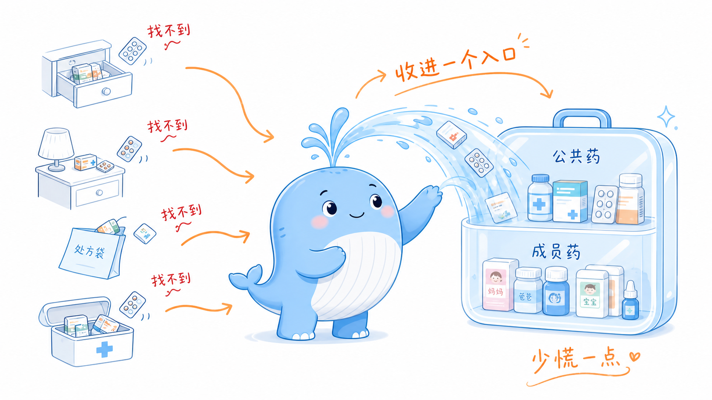
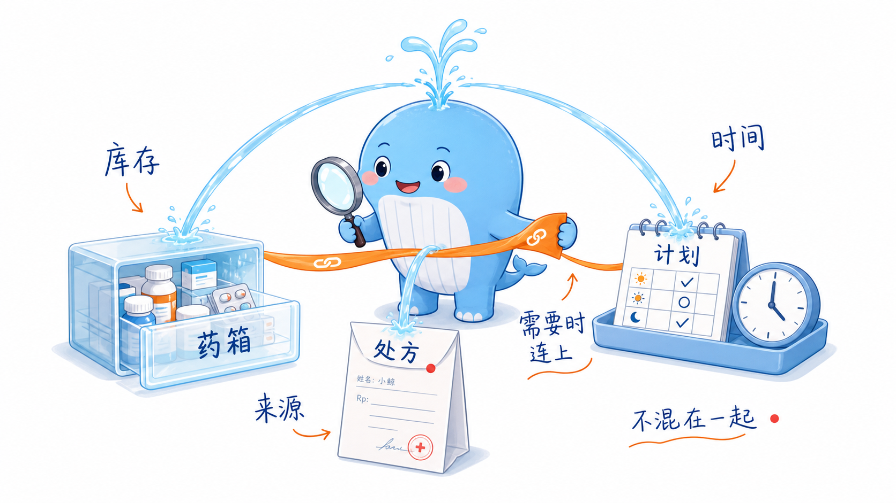
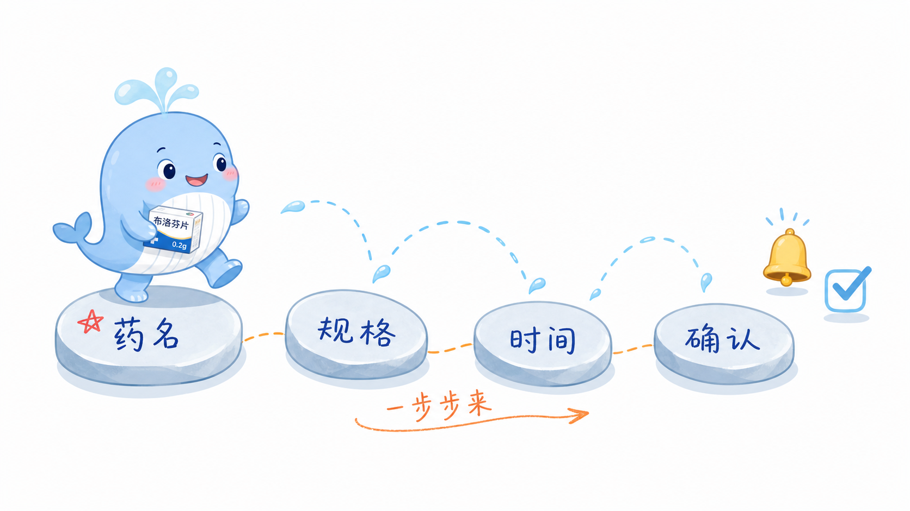

# 家里药一多真的会乱！我把 SparkClient 的家庭药箱翻出来了

有没有人和我一样，家里明明有药，但每次要用的时候都像在开盲盒。

退烧药在客厅抽屉，碘伏在玄关柜，孩子的雾化药夹在上次处方袋里，爸妈的长期用药又各自放在床头。真正着急的时候，最常问的不是“买不买药”，而是：

这个药是谁的？

还剩多少？

过期了吗？

今天到底吃没吃？

所以我看到 SparkClient 里的「家庭药箱」和「用药计划」时，第一反应是：这不就是很多家庭一直缺的那个“药品总管”吗。

## 先把全家的药收进一个地方

家庭药箱最戳我的点，是它不是只管某一个人的药。

它更像一个家庭级入口：公共药可以放进去，比如退烧药、创可贴、碘伏、维生素；某个成员专属的药也可以放进去，比如爸爸的降压药、妈妈的降糖药、孩子的儿科用药。

进入后可以按成员筛选，也能看未绑定成员的公共药。对真实家庭来说，这个逻辑很自然，因为家里的药本来就不是严格按人分盒子的。

而且新增药品时，不一定非要立刻建用药计划。你可以先把药名、类型、剂型、规格、数量、有效期、备注这些信息存好。需要的时候再继续往下走。

这一步解决的是：家里到底有什么药。

## 药箱、处方、计划，不再搅成一团

用药管理最容易乱，是因为三件事经常混在一起：

药箱管库存：家里有哪些药、还剩多少、有没有过期。

处方管来源：这个药是哪次就诊开的，背后有什么医嘱。

用药计划管执行：什么时候吃、每次吃多少、吃多久、要不要提醒。

SparkClient 的思路是把它们拆开，但又能在需要时连上。比如一个药可以先存在家庭药箱里；如果它来自处方，可以和处方关联；如果要规律服用，再从药品继续建立用药计划。

这比“所有信息塞进一个大表单”舒服很多。你不会因为想记录一个药，就被迫把所有用药规则都填完。

## 从药箱到用药计划，是一步步来的

我很喜欢它的用药计划创建方式。

不是一上来甩给你一整页字段，而是分成几步：

先确认药品名称，也可以直接关联药箱里的已有药。

再补充规格，比如剂量数值和单位。

然后设置用药时间，包括频次、提醒时间、开始日期、结束日期、饭前饭后或医嘱备注。

最后检查详情，再决定是否开启提醒。

这个流程对照顾家人的人特别友好。因为很多时候不是“不想记录”，而是信息太多，一次填完太累。分步之后，每一步只做一件事，压力会小很多。

如果是从药箱里的药开始建计划，还能少填重复信息。药名、规格、单位、药箱关联这些可以顺着带过来，体验上更像“从已有药品生成计划”，而不是重新造一份资料。

## 提醒不只是闹钟，而是家庭协同

很多人以为用药提醒就是“到点响一下”，但家里有老人、小孩、慢病成员时，事情会复杂很多。

如果是本人用药，开提醒就很直接。

如果是给家人维护计划，就要考虑：谁真正需要收到提醒？当前手机要不要代提醒？是否要邀请其他家人一起接收？

SparkClient 的用药计划里会区分本人和非本人成员场景。非本人用药时，可以看到邀请他人通知用药、本机提醒开关这类协同选项。这个细节很实用，因为家庭照护最怕靠一句“我记得提醒你”。

把提醒责任说清楚，才是真正能长期坚持的设计。

## 还有一个隐藏省心点：可以拍照整理

家庭药箱不是只能手动录入。

项目里也有药箱拍照识别、处方/药品识别相关链路：拍药盒、说明书、有效期，识别后再确认保存。对家里药比较多的人来说，这个入口很关键。

因为你不需要先变成“药品信息录入员”，只要把包装和关键信息拍下来，再把识别结果检查一遍就行。

适合周末整理家里药箱的时候用：过期的处理掉，常用的录进去，长期用的顺手建计划。

## 我觉得它适合这几类家庭

家里有老人，需要长期吃降压药、降糖药、降脂药。

家里有孩子，经常有退烧药、雾化药、儿科处方药。

家里常备药很多，但总是忘记放哪、剩多少、过没过期。

一个人负责照顾多个家庭成员，经常要帮别人记用药。

你不一定每天打开它，但它会在关键时刻让人少慌一点。

## 一句话总结

SparkClient 的「家庭药箱」管的是全家的药品秩序，「用药计划」管的是每天能不能按时执行。

一个负责把药放清楚，一个负责把药吃明白。

对家庭健康管理来说，这两个功能连起来之后，真的很像给家里装了一个安静但靠谱的用药小助手。

温馨提示：用药计划适合做记录和提醒，具体用药、剂量调整、停药或换药，还是要听医生或药师建议。

---

## 小红书标题备选

1. 家里药一多就乱？这个家庭药箱功能真的很懂我
2. 爸妈孩子的药终于不用靠脑子记了
3. 家庭药箱 + 用药计划，才是家里最该有的健康小工具
4. 整理完家里的药，我发现缺的不是收纳盒
5. 长期照顾家人用药的人，真的需要这种提醒协同

## 正文配图清单

1. `01-xhs-family-cabinet-overview.png`：放在开头痛点后，表达分散药品汇入家庭药箱。
2. `02-xhs-cabinet-prescription-plan.png`：放在“药箱、处方、计划”段落后，表达三者分工。
3. `03-xhs-medication-plan-stepper.png`：放在“从药箱到用药计划”段落后，表达四步创建计划。
4. `04-xhs-reminder-collaboration.png`：放在“提醒不只是闹钟”段落后，表达本人、家人、本机协同提醒。
