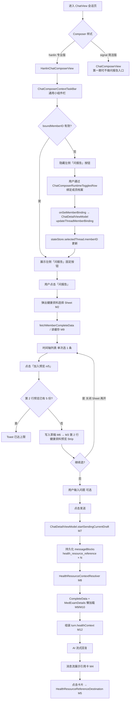
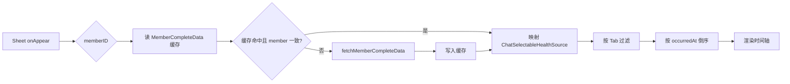
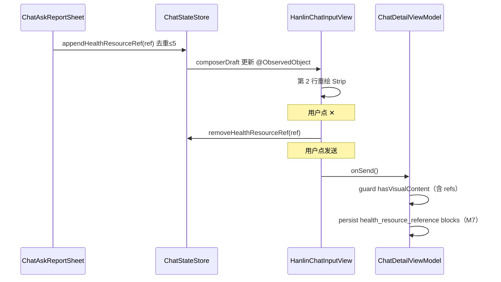
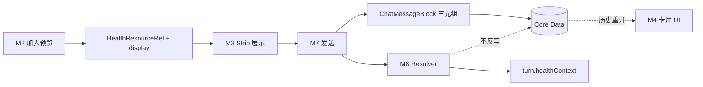
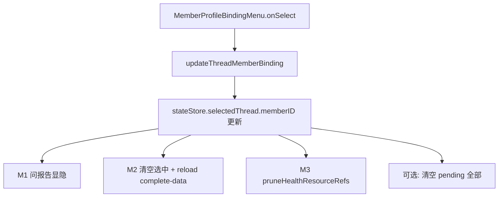

# 对话内「问报告」AI 解读 — 详细设计文档（初版）

> **状态**：v0.4 — §4.1–§4.18 + §10 L10n + **§4.11 工具调用（M11）详设** 已对齐 `ToolHub` / `SparkToolName` / `ToolPrompts.strings`；网关 JSON 字段级契约仍以需求 §7 为准。  
> **需求依据**：[对话问报告AI解读需求文档.md](./对话问报告AI解读需求文档.md)  
> **范围**：SparkClient 聊天模块 + 医疗数据快照 + AI Runtime；本文不展开接口字段级详设。

---

## 1. 文档说明

| 项 | 说明 |
| --- | --- |
| 目标 | 将需求文档中的能力拆为可落地的功能模块，便于排期、分工与代码目录规划 |
| 读者 | iOS 开发、AI/网关对接、测试 |
| 本地化 | 所有用户可见文案走 `L10n.text` + `Localizable.strings`（见 **§10**）；禁止 Swift 内硬编码中文/英文 |
| 非目标 | 本期不写逐文件类图、不写完整 API 契约（见需求文档 §3、§7） |

---

## 2. 系统边界（一句话）

用户在已绑定成员的对话中，通过「问报告」选择已保存健康资料（最多 5 份）→ **统一附件模块第 2 行**累加引用（每张卡 ✕ 可快速取消）→ 发送后客户端从 `RemoteMemberCompleteData` 解析并组装 `healthContext` → AI 流式解读；消息库只持久化 `health_resource_reference`。

---

## 3. 端到端业务流程图

> 下图按**用户操作顺序**描述主路径（手动「问报告」）；自然语言 + 工具调用见 §4.15 / 需求 §10。



### 3.1 与模块编号对照

| 流程节点 | 模块 |
| --- | --- |
| 问报告按钮、Sheet 打开 | M1 |
| 选择 Sheet、加入预览 | M2 |
| 统一附件模块第 2 行 `healthResourcePreviewStrip` | M3 |
| 草稿引用列表 | M6 |
| 发送 / 持久化 | M7 |
| 解析 healthContext | M8 |
| complete-data | M9 |
| 明细懒加载 | M10 |
| 工具 / 自然语言 | M11 |
| AI 请求 | M12 |
| 消息卡 / 详情 | M4 / M5 |
| 输入区轻量预览 | M14 |
| 本地化 | §10（`chat.ask_report.*`） |

---

## 3.2 项目内 Chat 分层（与流程相关）

```
ChatView
└── composerChrome（按 ChatComposerStyle）
    ├── .hanlin → HanlinChatComposerView
    │   ├── ChatComposerContextTaskBar（通用小组件栏，M1 落点）
    │   │     ├── 左：【新增】问报告固定悬浮按钮（M1）
    │   │     └── 右：SmallTask 横向 Pills（通用小组件，现有逻辑）
    │   └── HanlinChatInputView
    │       ├── 【统一附件模块】composerAttachmentArea（VStack，≈112 行）
    │       │     ├── 第 1 行 attachmentStrip（图片/PDF/文件）
    │       │     └── 第 2 行 healthResourcePreviewStrip（M3，单独一行，✕ 移除）
    │       ├── 文本输入 HanlinChatTextView
    │       └── 底栏：plus | ChatComposerRuntimeTogglesRow | 发送（无问报告）
    └── .signal → ChatComposerView（无成员绑定，第一期不挂载问报告）

数据与会话：
ChatStateStore.selectedThread?.memberID  ←→  boundMemberID（Composer 入参）
ChatComposerDraft（按 threadID）← 文本、attachments、【待扩展】healthResourceRefs
ChatDetailViewModel ← 发送、成员绑定、附件队列
```

---


## 4. 主要功能模块清单

### 4.1 入口与 Composer 集成（M1）

> **需求依据**：需求文档 §2（入口设计）、§4（选择 Sheet 触发）、§6（统一附件模块）。  
> **实现范围**：第一期以 **`ChatComposerStyle.hanlin`**（`HanlinChatComposerView`）为主；`signal` 版 `ChatComposerView` 无成员档案能力，可不实现或二期对齐。

#### 4.1.1 职责

| 编号 | 职责 |
| --- | --- |
| M1-1 | 在 `ChatComposerContextTaskBar` **左侧**固定展示「问报告」入口（唯一入口） |
| M1-1b | 同一栏**右侧**为「通用小组件」（`SmallTask` Pills 横向滚动），命名与现网 SmallTask 行为一致 |
| M1-2 | 按规则显示/隐藏按钮 |
| M1-3 | 点击后 present 健康资料选择 Sheet（M2），传入当前 `boundMemberID` |
| M1-4 | 发送中禁用按钮，避免重复打开 Sheet |
| M1-5 | 无障碍文案、埋点（入口曝光/点击，见需求 §12） |

#### 4.1.2 需求规则（摘自需求 §2）

| 规则 | 说明 |
| --- | --- |
| 入口数量 | 仅一个「问报告」按钮，位于通用小组件栏**左侧固定** |
| 栏位命名 | 整条栏：**通用小组件栏**（`ChatComposerContextTaskBar`）；左=问报告，右=SmallTask 通用小组件 |
| 文案 | 「问报告」 |
| 图标 | 建议 SF Symbol：`doc.text.magnifyingglass` 或 `stethoscope` |
| 显示条件 | 会话已绑定成员：`boundMemberID != nil` 且 `> 0`；发送中禁用 |
| 未绑定 | 左侧不展示「问报告」；用户需先在 `memberProfileToggle` / `MemberProfileBindingMenu` 完成绑定 |
| 通用小组件 | `smallTasks` 非空时展示右侧 ScrollView；与成员绑定无关 |
| 禁止重复入口 | 不在 `HanlinChatInputView` 底栏（plus 旁）再放问报告 |

#### 4.1.3 项目内挂载架构

**视图树（hanlin 路径）**

| 文件 | 类型 | 与 M1 关系 |
| --- | --- | --- |
| `Presentation/ChatView.swift` | 会话页容器 | `composerChrome` 根据 `ChatComposerStyle` 分支；传入 `boundMemberID: stateStore.selectedThread?.memberID` |
| `Presentation/Composer/HanlinChatComposerView.swift` | Composer 外壳 | `VStack`：上 `ChatComposerContextTaskBar`，下 `HanlinChatInputView`；向 TaskBar 传入 `boundMemberID`、Sheet 回调 |
| `Presentation/Composer/ChatComposerContextTaskBar.swift` | **M1 主落点** | 扩展为 `HStack`：左固定「问报告」+ 右 `ScrollView` 通用小组件 |
| `Presentation/Composer/HanlinChatInputView.swift` | 输入区 | 仅 M3 预览 Strip；**不放**问报告按钮 |
| `Presentation/Composer/ChatComposerRuntimeTogglesRow.swift` | 成员/工具开关 | 成员绑定；不新增问报告 |

**数据与回调链**

```text
boundMemberID 来源：
  ChatView → HanlinChatComposerView(boundMemberID: stateStore.selectedThread?.memberID)

成员绑定变更：
  ChatComposerRuntimeTogglesRow.onSetMemberBinding
    → ChatView: detailViewModel.updateThreadMemberBinding(memberID, for: threadID)
    → ChatDetailViewModel → chatRepository.updateThreadMemberBinding
    → selectedThread.memberID 更新 → boundMemberID 变化 → M1 显示态刷新

打开 Sheet（建议）：
  HanlinChatComposerView 或 ChatComposerContextTaskBar @State showAskReportSheet
    或 ChatStateStore 按 threadID 存 isAskReportSheetPresented
  点击左侧问报告 → showAskReportSheet = true
```

**现有代码锚点**

- `HanlinChatInputView` 第 118 行注释 `// 预选报告`：扩展为 **统一附件模块**（第 1 行 `attachmentStrip` + 第 2 行 `healthResourcePreviewStrip`），与 M1 按钮分离。
- `canSendPayload` 当前：`trimmedText` 或 `attachments` 非空；接入 M3/M6 后扩展为 **含 `pendingHealthResourceRefs` 也可发送**。
- `ChatComposerDraft`（`ChatComposerDraft.swift`）：现有 `text` / `attachments` / `runtimeFlags`；**待扩展** `pendingHealthResourceRefs: [HealthResourceRef]`（M6，见 §4.4）。

#### 4.1.4 显示逻辑（伪代码）

```swift
var shouldShowAskReportButton: Bool {
    guard let id = boundMemberID, id > 0 else { return false }
    guard stateStore.isSending == false else { return false }
    return true
}
```

> 不在 M1 内判断 `MemberContextStore` 默认成员；仅以**当前会话** `selectedThread.memberID` 为准（需求 §2、§5）。

#### 4.1.5 UI 布局示意（Composer 全高）

**通用小组件栏** — `ChatComposerContextTaskBar.swift`（M1）

```text
┌──────────────────────────────────────────────────────────┐
│ [问报告]  [通用小组件: SmallTask Pill] [Pill] …           │
│  左侧固定    ← ScrollView 横向，现有 ChatComposerContextPill │
└──────────────────────────────────────────────────────────┘
```

| 控件 | 位置 | 交互 |
| --- | --- | --- |
| 问报告 | 栏**左侧**固定（leading，不随滚动） | Tap → Sheet M2 |
| 通用小组件 | 栏右侧，`ScrollView` + `HStack` | 与现网 `onSmallTaskTapped` 一致 |
| 问报告禁用 | `isSending` 或 `boundMemberID == nil` | 隐藏或灰色不可点 |

**输入区** — `HanlinChatInputView`（M3 在统一附件模块内，无 M1）

```text
┌──────────────────────────────────────────────────────────┐
│ 【统一附件模块】  content.VStack 顶部                     │
│  第 1 行  [■][■]  attachmentStrip（仅 attachments）       │
│  第 2 行  [1/5 体检 ✕] [2/5 胃镜 ✕]  healthResourceStrip   │
├──────────────────────────────────────────────────────────┤
│  多行文本输入                                             │
├──────────────────────────────────────────────────────────┤
│ [+] [成员档案 | 工具 | …]                       [发送]      │
└──────────────────────────────────────────────────────────┘
```

#### 4.1.6 建议新增/修改文件（M1 范围）

| 动作 | 路径 |
| --- | --- |
| 修改 | `ChatComposerContextTaskBar.swift` — 左侧固定问报告 + 右侧通用小组件 ScrollView |
| 修改 | `HanlinChatComposerView.swift` — 向 TaskBar 传入 `boundMemberID`、`onAskReport`、Sheet |
| 修改 | `ChatView.swift` — 注入依赖；Sheet 可挂 Composer 层 |
| 新增 | `Presentation/Chat/AskReport/ChatAskReportSheet.swift`（M2） |
| 可选 | `ChatStateStore` — `setAskReportSheetPresented(_:for:)` |
| 不改 | `HanlinChatInputView` 底栏不增加问报告（M3 在统一附件模块第 2 行） |

#### 4.1.7 与需求文档章节映射

| 需求 § | 落点到 M1 |
| --- | --- |
| §2 入口位置/显示条件 | §4.1.2、§4.1.4 |
| §2 未绑定不展示 | `shouldShowAskReportButton` |
| §2 已绑定点击行为 | 打开 M2，默认成员 = `boundMemberID` |
| §4 选择页 | Sheet 由 M1 触发，不在 M1 内实现列表 |
| §6 预览区 | M3 在统一附件模块第 2 行，非 M1 |

#### 4.1.8 验收要点（M1）

1. 未绑定成员时通用小组件栏左侧无「问报告」按钮。  
2. 绑定成员后左侧按钮出现；`boundMemberID` 变化后 Sheet 数据刷新。  
3. 右侧 SmallTask 通用小组件行为与改前一致。  
4. `HanlinChatInputView` 底栏无问报告入口。  
5. 发送过程中问报告按钮禁用。  
6. 仅 hanlin Composer 出现（signal 二期可选）。  
7. 按钮文案来自 `chat.ask_report.entry.title`，非硬编码（§10）。

---

### 4.2 健康资料选择 Sheet（M2）

> **需求依据**：需求文档 §3（数据与 `RemoteMemberCompleteData`）、§4（选择页形态/Tab/时间轴/搜索/多份累加）、§5（成员切换）。  
> **与 M1/M3 关系**：由 M1 唤起；「加入预览」写入 M6 草稿，由 M3 展示；不在 Sheet 内发送。

#### 4.2.1 职责

| 编号 | 职责 |
| --- | --- |
| M2-1 | 以 Sheet + `CompatibleNavigationContainer(legacyStackStyle: true)` 展示当前绑定成员的**可选健康资料时间轴** |
| M2-2 | 从 `RemoteMemberCompleteData` 加载/刷新列表（单接口快照，不并发分散列表 API） |
| M2-3 | 支持 Tab、本地搜索、列表**单选**（每次 1 条，无 checkbox 多选） |
| M2-4 | 「加入预览」将选中项转为 `HealthResourceRef` 追加到 Composer 草稿（去重、≤5） |
| M2-5 | 顶部可选 `MemberProfileBindingMenu`，切换成员并同步会话 `boundMemberID` |
| M2-6 | 空态/错误态/加载态；埋点（Sheet 打开、Tab、加入预览、成员切换） |

#### 4.2.2 需求规则（摘自需求 §3、§4、§5）

| 类别 | 规则 |
| --- | --- |
| 形态 | `.sheet` 呈现；内容根视图包一层 **`CompatibleNavigationContainer(legacyStackStyle: true)`**（`Core/UI/Navigation/CompatibleNavigationContainer.swift`）；标题「问报告」+ 关闭；与 `ChatToolInteractionSheets`、`HanlinChatInputView` 附件 Sheet 一致 |
| 数据源 | `GET /api/v1/medical/members/{memberID}/complete-data/` → `RemoteMemberCompleteData` |
| 第一期资料类型 | `medicalCases`、`healthExamReports`、`examinationReports`、`medicineBoxes`、`prescriptions`、`medicationPlans`、`todayMedicationRecords`、`medicationSummary`、`symptoms`、`visits`、`surgeries`、`followUps`（见需求 §3 字段表） |
| 选择模式 | **Sheet 内每次只选 1 条**；点多份靠关闭 Sheet 后再次打开 + 多次「加入预览」 |
| 预览上限 | 输入区已选 `n` 份，`n ≤ 5`；`n == 5` 时禁用「加入预览」并 Toast |
| 去重 | 相同 `resourceType + resourceID + memberID` 不重复加入 |
| 成员 | 默认 `boundMemberID`；Sheet 内切换成员 → `onSetMemberBinding` → 清空 Sheet 内选中态并重新拉 complete-data |
| 病历 | 病例为聚合容器，可折叠子资料；子项点击仍遵守「单选 1 条」 |
| 明细 | 列表阶段用摘要；`medExamDetails` 不在选择页全量加载（发送后 M8 懒加载） |
| 搜索 | 当前 Tab 内本地搜索（需求 §4 字段列表）；「全部」Tab 可跨类型 |
| 不做 | 列表多选 checkbox；Sheet 内直接发送；自建成员选择 UI |

#### 4.2.3 项目内架构

**模块位置（建议）**

```text
Projects/Features/Chat/
  AskReport/
    ChatAskReportSheet.swift              // 根 Sheet；body 内 CompatibleNavigationContainer(legacyStackStyle: true)
    ChatAskReportSheetViewModel.swift     // 加载、映射、选中、加入预览
    ChatSelectableHealthSource.swift      // 统一时间轴模型（需求 §4）
    ChatAskReportTimelineView.swift       // 列表 + Tab + 搜索
    ChatAskReportCardViews.swift          // 分 resourceType 卡片 UI
  Domain/
    HealthResourceRef.swift               // resourceType + resourceID + memberID
    ChatAskReportCompleteDataStore.swift  // 按 memberID 缓存 completeData（可复用 Home 快照）
```

**依赖注入（从 Chat 层传入）**

| 依赖 | 现有项目类型 | 用途 |
| --- | --- | --- |
| `medicalQueryAPI` | `SparkMedicalQueryAPI` | `fetchMemberCompleteData(memberID:)` |
| `memberContextStore` | `MemberContextStore` | 成员列表、`MemberProfileBindingMenu` |
| `onSetMemberBinding` | `(Int?) -> Void` | 与 `ChatView` → `ChatDetailViewModel.updateThreadMemberBinding` 同链路 |
| `boundMemberID` | `Int?` | 初始成员、列表过滤校验 |
| `pendingRefs` | `[HealthResourceRef]` | 计算 `n/5`、去重判断 |
| `onAppendToPreview` | `([HealthResourceRef]) -> Void` | 写入 `ChatComposerDraft`（M6） |

**与 Home 医疗列表的关系（复用策略）**

| Home 现有能力 | M2 是否直接复用 | 说明 |
| --- | --- | --- |
| `HomeMedicalListView` + 各 `*ListPage` | **不整页嵌入** | 列表页含新增/编辑/删除/导航详情，交互过重 |
| `fetchMemberCompleteData` | **复用 API** | 与 `LoadHomeMedicalOverviewUseCase`、`ToolHubGetCurrentMember` 同源 |
| `HomeDashboard.medical.completeData` | **可选复用缓存** | 若当前 `memberID ==` 首页选中成员，可先读内存快照再后台刷新 |
| `MedExamDetailLazyLoadViewModel` | **不在 M2 使用** | 选择页仅摘要；明细在 M8 发送后加载 |
| `ExaminationReportCategory` 颜色/标签 | **建议复用** | 医疗报告 Tab 卡片角标（需求 §4、§6 视觉） |
| `MemberProfileBindingMenu` | **必须复用** | `Features/MemberContext/Presentation/MemberProfileBindingMenu.swift` |

```text
ChatView / HanlinChatComposerView
    .sheet → ChatAskReportSheet
        └── CompatibleNavigationContainer(legacyStackStyle: true)   // 公共导航容器，勿直接写 NavigationStack
            ├── .navigationTitle + toolbar: 关闭
            ├── 顶栏: MemberProfileBindingMenu（可选）
            ├── 搜索框
            ├── Tab: 全部 | 病历 | 体检 | 医疗报告 | 用药
            ├── ChatAskReportTimelineView（单选列表）
            └── safeAreaInset bottom: 「加入预览 (n/5)」
```

**导航容器约定（项目公共模块）**

| 组件 | 路径 | M2 用法 |
| --- | --- | --- |
| `CompatibleNavigationContainer` | `Projects/Core/UI/Navigation/CompatibleNavigationContainer.swift` | Sheet 内单层导航栏 + toolbar；**`legacyStackStyle: true`**（与 Chat 其它 Sheet 一致） |
| `CompatibleRouteNavigationContainer` | 同上 | M2 第一期**不需要**（无多页 push）；若二期增加详情子页再考虑 typed `path` |

实现骨架（对齐现网 Chat Sheet）：

```swift
struct ChatAskReportSheet: View {
    var body: some View {
        CompatibleNavigationContainer(legacyStackStyle: true) {
            // 列表 + Tab + 搜索 + 底栏「加入预览」
        }
        .navigationTitle("问报告")
        .navigationBarTitleDisplayMode(.inline)
        .toolbar { /* 关闭 */ }
    }
}
```

#### 4.2.4 数据加载与映射流程



**`RemoteMemberCompleteData` → 时间轴条目（第一期）**

| 快照字段 | `resourceType` | 排序时间字段（优先） |
| --- | --- | --- |
| `medicalCases` | `medical_case` | `updatedAt` / 就诊相关 |
| `healthExamReports` | `health_exam_report` | `examDate` |
| `examinationReports` | `examination_report` | `reportTime` / `examTime` |
| `prescriptions` | `prescription` | 处方日期 |
| `medicationPlans` | `medication_plan` | `startDate` |
| `medicineBoxes` | `medicine_box` | `updatedAt` |
| `todayMedicationRecords` | `medication_record` | `scheduledAt` |
| `medicationSummary` | `medication_summary` | 当天（单对象） |
| `symptoms` / `visits` / `surgeries` / `followUps` | 同名 | 各 DTO 业务时间 |

映射实现建议独立 `ChatAskReportTimelineMapper`：输入 `RemoteMemberCompleteData` + `medicalCase` 关联规则（需求 §4「病历关联」），输出 `[ChatSelectableHealthSource]`。

**病历子资料归组（本地 join，字段以 DTO 为准）**

- `examinationReports.medicalRecord`、`prescriptions.medicalCase`、`medicationPlans.medicalCase` 等与 `medicalCase.id` 关联。
- 无关联 ID 的 symptom/visit 等归入「未关联病历」分组，仍在「全部」时间轴展示。

#### 4.2.5 UI 结构示意

```text
┌──────────────────────────────────────────┐
│ 问报告                            [关闭] │
├──────────────────────────────────────────┤
│ [成员 ▼]  MemberProfileBindingMenu       │
│ [🔍 搜索 …]                              │
│ [全部][病历][体检][医疗报告][用药]        │
├──────────────────────────────────────────┤
│ ○ 2026-02-09  无痛电子胃镜    ← 单选高亮 │
│ ○ 2023-01-07  年度体检                   │
│ ▼ 高血压病历（展开子项…）                 │
│   ○ 检查报告 xxx                         │
├──────────────────────────────────────────┤
│        [ 加入预览 (2/5) ]                │
└──────────────────────────────────────────┘
```

| 区域 | 行为 |
| --- | --- |
| 列表行 | 点击 → `selectedID` 切换；再次点击同一条 → 取消选中 |
| 底部按钮 | 无选中 → 禁用；`n>=5` → 禁用 + Toast；有选中 → append 一条 ref 并 dismiss Sheet（或保持打开由产品定，建议 **加入后保持 Sheet** 便于连续选） |
| 关闭 | 不丢弃已加入第 2 行健康资料预览的内容 |

> 产品建议：加入预览后 **不自动关闭 Sheet**，方便连续选第 2～5 份（对齐需求 §4 步骤 4）；若需关闭由用户点关闭。

#### 4.2.6 ViewModel 状态（建议）

```swift
@MainActor
final class ChatAskReportSheetViewModel: ObservableObject {
    @Published var loadState: LoadState  // idle / loading / loaded / failed
    @Published var completeData: RemoteMemberCompleteData?
    @Published var selectedTab: AskReportTab
    @Published var searchText: String
    @Published var selectedSourceID: HealthResourceReference?
    @Published var timelineItems: [ChatSelectableHealthSource]

    let memberID: Int
    let previewCount: Int  // 来自 Composer 草稿，用于 n/5

    func load() async
    func onMemberChanged(_ newMemberID: Int?)  // 调 onSetMemberBinding + reload
    func appendSelectedToPreview() -> HealthResourceRef?
}
```

#### 4.2.7 与 M1 / M3 / M6 的接口

| 方向 | 契约 |
| --- | --- |
| M1 → M2 | `ChatAskReportSheet(memberID: boundMemberID!, pendingRefs:, onAppend:, onSetMemberBinding:)` |
| M2 → M6 | `onAppend(HealthResourceRef)` → `ChatStateStore` / `ChatComposerDraft.pendingHealthResourceRefs.append` |
| M6 → M2 | 打开 Sheet 时传入当前 `pendingRefs.count` 显示 `(n/5)` |
| M2 → M3 | 不直接操作 View；经 M6 草稿刷新后 `HanlinChatInputView` 观察 draft 渲染 Strip |

#### 4.2.8 空态与错误（需求 §4）

| 状态 | UI |
| --- | --- |
| 加载中 | 列表 Skeleton 或 ProgressView |
| 无资料 | 「暂无可解读资料」+ 切换成员 / 去上传（跳转 Home 上传入口可选） |
| 搜索无结果 | 「没有匹配的资料」+ 清空搜索 |
| 网络失败 | 重试按钮；保留上次缓存（若有） |
| complete-data 成功但某数组为空 | 仅该 Tab 空态，不影响其他 Tab |

#### 4.2.9 建议新增/修改文件（M2 范围）

| 动作 | 路径 |
| --- | --- |
| 新增 | `Chat/AskReport/*`（见 §4.2.3） |
| 新增 | `Chat/Domain/HealthResourceRef.swift`、`HealthResourceType.swift` |
| 修改 | `HanlinChatComposerView.swift` / `ChatComposerContextTaskBar.swift` — present Sheet、传 `pendingRefs` / 回调 |
| 修改 | `ChatComposerDraft.swift` — `pendingHealthResourceRefs` |
| 修改 | `ChatStateStore.swift` — draft 读写、去重、上限 5 |
| 可选 | `Chat/Domain/ChatAskReportCompleteDataStore.swift` — 与 `HomeViewModel` 快照共享策略 |

#### 4.2.10 与需求文档章节映射

| 需求 § | 落点到 M2 |
| --- | --- |
| §3 complete-data | §4.2.4 加载与字段映射 |
| §3 指标明细 | 不在 M2 加载，仅卡片摘要/异常数量（可选本地统计 flag 非空数） |
| §4 页面形态/Tab/时间轴 | §4.2.2、§4.2.5 |
| §4 单次选择 + 加入预览 | §4.2.2、§4.2.6 |
| §4 搜索 | §4.2.2、ViewModel `searchText` |
| §4 病历折叠 | §4.2.4 归组 + 卡片 UI |
| §5 成员切换 | §4.2.3 `MemberProfileBindingMenu` |

#### 4.2.11 验收要点（M2）

1. 打开 Sheet 后展示当前 `boundMemberID` 的 complete-data 时间轴。  
2. 切换 Tab、搜索后列表正确过滤；列表为单选，无多选 checkbox。  
3. 选中一条后「加入预览」可在草稿中增加 1 条引用；重复同 ID 不增加。  
4. 第 2 行已有 5 份时无法再加入并提示。  
5. Sheet 内切换成员后会话 `boundMemberID` 同步，列表按新成员刷新。  
6. 关闭 Sheet 后已加入预览的内容保留在输入区（M3）。  
7. 不调用 `listHealthExamReportsWithAttachments` 等分散接口作为主路径。

---

### 4.3 统一附件模块与输入区预览（M3）

> **需求依据**：需求文档 §6（统一附件模块、两行布局、✕ 快速取消、轻量预览）、§4（加入预览 / 去重 / 5 份上限）、§5（成员绑定与预览一致性）、§7（发送门禁与 block 顺序）。  
> **与 M1/M2/M6 关系**：M1/M2 负责选资料；M6 定义引用模型与草稿字段；**M3 只负责输入区展示与移除**，不拉 complete-data、不发送。  
> **代码锚点**：`HanlinChatInputView.swift` → `content` 私有 `VStack`（现网约 111–175 行）；`// 预选报告`（约 118 行）扩展为 `composerAttachmentArea`。

#### 4.3.1 职责

| 编号 | 职责 |
| --- | --- |
| M3-0 | 在 `HanlinChatInputView` 顶部提供**统一附件模块**容器 `composerAttachmentArea`（`VStack(spacing: 6)`） |
| M3-1 | **第 1 行**：沿用 `attachmentStrip` + 私有 `HanlinAttachmentThumbnail`（仅 `composerDraft.attachments`） |
| M3-2 | **第 2 行**：`healthResourcePreviewStrip` **单独一行**横向 `ScrollView`，展示 `pendingHealthResourceRefs`（≤5） |
| M3-3 | 每张健康资料卡 **✕** → `onRemoveHealthResourceRef`，即时从草稿移除（无需回 M2 Sheet） |
| M3-4 | 序号 `1/5`…`5/5`；卡体点击（非 ✕）→ 轻量预览 Sheet（`CompatibleNavigationContainer`） |
| M3-5 | 扩展 `canSendPayload` / `ChatComposerDraft.hasVisualContent`：仅有健康资料引用、无文字时也可发送 |
| M3-6 | 扩展文本区 `padding.top`：由「仅有 attachments」改为「附件模块任一行非空」 |
| M3-7 | 会话 `boundMemberID` 变更时，剔除 `memberID` 不一致的 pending 引用（需求 §5） |

#### 4.3.2 需求规则（摘自需求 §6、§4、§5、§7）

| 类别 | 规则 |
| --- | --- |
| 位置 | 多行文本输入**上方**；在 `HanlinChatComposerView` 内、**不在** `ChatComposerContextTaskBar`（M1） |
| 两行布局 | 第 1 行仅普通附件；第 2 行仅健康资料引用；**不得**同一 `HStack` 混排 |
| 第 1 行 | 沿用上传链路：plus → Sheet/相册/相机/文件 → `appendComposerAttachments`；点击缩略图 → `.unifiedFilePreview` |
| 第 2 行 | 数据来自 M2「加入预览」→ `pendingHealthResourceRefs`；横向最多 5 张；**同 `resourceType+resourceID+memberID` 去重** |
| ✕ | 单卡移除、无二次确认；可选第 2 行 trailing「清空全部」 |
| 上限 | 第 2 行 `count == 5` 时 M2 禁用「加入预览」；第 1 行普通附件仍受现网 **≤5 个**（`plusButton` 在 `attachments.count > 4` 时禁用） |
| 预览 vs 发送 | 草稿区轻量预览（摘要 + 可选指标分组）；消息流卡片走详情 `NavigationLink`（M4，需求 §6 末段） |
| 成员 | 每条 ref 带 `memberID`；`boundMemberID` 切换后移除不属于新成员的 pending 项 |
| 发送顺序 | 第 2 行从左到右顺序 = `health_resource_reference` block 顺序 = `refIndex`（需求 §7） |
| 不做 | 在选择 Sheet 内展示已选列表；不把健康资料写入 `attachments` 数组 |

#### 4.3.3 项目内架构（Composer 数据流）

```text
HanlinChatComposerView
├── ChatComposerContextTaskBar          // M1：问报告 → present M2
└── HanlinChatInputView                 // M3 落点
    ├── composerAttachmentArea          // 【本模块】
    │   ├── attachmentStripRow        // 现网 attachmentStrip 抽出
    │   └── healthResourcePreviewStrip
    ├── 文本区 VStack + HanlinChatTextView
    └── 底栏：plus | ChatComposerRuntimeTogglesRow | 发送

ChatStateStore（按 threadID）
└── composerDrafts[threadID]: ChatComposerDraft
    ├── attachments[]                 // 第 1 行
    └── pendingHealthResourceRefs[]   // 第 2 行【新增】

ChatDetailViewModel.sendCurrentDraft
└── hasVisualContent 含 pending refs → 持久化 blocks（M7/M6）
```

**模块位置（建议）**

```text
Projects/Features/Chat/
  Presentation/Composer/
    HanlinChatInputView.swift           // composerAttachmentArea、两行 Strip、Sheet 绑定
    HanlinChatComposerView.swift        // 透传 onRemove / onClear / AskReport Sheet（M2）
  AskReport/
    HanlinHealthResourceThumbnail.swift // 第 2 行缩略卡（可 private 放在 InputView 同文件，与 HanlinAttachmentThumbnail 一致）
    ChatHealthResourcePreviewSheet.swift // 卡体点击轻量预览（CompatibleNavigationContainer）
    ChatHealthResourcePreviewViewModel.swift // 读缓存 complete-data 摘要，发送前不拉全量 medExamDetails
  Domain/
    HealthResourceRef.swift             // M6，M3 展示用 displaySnapshot 可选
```

#### 4.3.4 现网代码对照与改造点

**现网 `content` 结构**（`HanlinChatInputView.swift`）

```111:175:SparkClient/SparkClient/Projects/Features/Chat/Presentation/Composer/HanlinChatInputView.swift
    private var content: some View {
        VStack(spacing: 6) {
            if composerDraft.attachments.isEmpty == false {
                attachmentStrip
                    .padding(.horizontal, 12)
                    .padding(.top, 12)
            }
            // 预选报告

            VStack(spacing: 0) {
                // ... 文本 + 底栏 ...
            }
            .padding(.top, composerDraft.attachments.isEmpty ? 12 : 6)
        }
    }
```

| 现网逻辑 | M3 改造 |
| --- | --- |
| 仅 `attachments.nonEmpty` 时显示 Strip | `composerAttachmentAreaHasContent` = `attachments` 或 `pendingHealthResourceRefs` 非空 |
| `// 预选报告` 空行 | 替换为 `composerAttachmentArea`（内含第 1、2 行条件子视图） |
| `.padding(.top, attachments.isEmpty ? 12 : 6)` | 改为 `composerAttachmentAreaHasContent ? 6 : 12` |
| `canSendPayload` 依赖 `hasVisualContent` | `hasVisualContent` 增加 `\|\| !pendingHealthResourceRefs.isEmpty` |
| `HanlinAttachmentThumbnail` 80×80 + 右上 `xmark` | 健康资料卡仿尺寸与 ✕ 布局，**独立** `onRemoveHealthResourceRef` |
| `.unifiedFilePreview` 仅附件 | 健康资料卡点击打开 `ChatHealthResourcePreviewSheet` |

**目标 `content` 片段（示意）**

```swift
private var content: some View {
    VStack(spacing: 6) {
        if composerAttachmentAreaHasContent {
            composerAttachmentArea
                .padding(.horizontal, 12)
                .padding(.top, 12)
        }
        textInputChrome
            .padding(.horizontal, 12)
            .padding(.top, composerAttachmentAreaHasContent ? 6 : 12)
    }
}

private var composerAttachmentAreaHasContent: Bool {
    composerDraft.attachments.isEmpty == false
        || composerDraft.pendingHealthResourceRefs.isEmpty == false
}

@ViewBuilder
private var composerAttachmentArea: some View {
    VStack(alignment: .leading, spacing: 8) {
        if composerDraft.attachments.isEmpty == false {
            attachmentStrip  // 第 1 行，现网实现整体下移
        }
        if composerDraft.pendingHealthResourceRefs.isEmpty == false {
            healthResourcePreviewStrip  // 第 2 行
        }
    }
}
```

#### 4.3.5 UI 结构示意

```text
┌──────────────────────────────────────────────────────────┐
│ 【统一附件模块】composerAttachmentArea                    │
│  第 1 行  [■80][■80]  ScrollView → HanlinAttachment…     │
│  第 2 行  [1/5 体检 ✕][2/5 胃镜 ✕]  healthResourceStrip   │
│           （可选 trailing: 清空全部）                     │
├──────────────────────────────────────────────────────────┤
│  多行文本 + [+] [成员档案…]                    [发送]       │
└──────────────────────────────────────────────────────────┘
```

| 区域 | 行为 |
| --- | --- |
| 第 1 行缩略图 | `onTap` → `unifiedFilePreview`；`onRemove` → `onRemoveAttachment(id)` |
| 第 2 行卡片 | `onTap`（非 ✕）→ `ChatHealthResourcePreviewSheet`；`onRemove` → `onRemoveHealthResourceRef` |
| 序号 | `ForEach(Array(refs.enumerated()), …)` 显示 `(index+1)/refs.count` |
| 发送按钮 | `canSendPayload`：文字 **或** 附件 **或** pending refs，且 `!hasBlockingPreparedAttachmentWork` |

#### 4.3.6 数据流：M2 → M6 → M3 → 发送



| 阶段 | 存储位置 | 内容 |
| --- | --- | --- |
| 加入预览 | `ChatComposerDraft.pendingHealthResourceRefs` | 含展示用 `displayTitle`/`displaySubtitle`/`resourceType` 快照（M2 写入，避免 Strip 再查 API） |
| 发送成功 | `clearDraft` / 发送链路清空 | 同时清空 `pendingHealthResourceRefs` 与 `attachments` |
| 消息库 | user message blocks | 仅三元组（M6），不存 Strip 展示字段 |

#### 4.3.7 `ChatComposerDraft` / `ChatStateStore` 扩展

**`ChatComposerDraft`（`ChatComposerDraft.swift`）**

```swift
struct HealthResourceRef: Equatable, Sendable, Identifiable {
    var id: String { "\(resourceType):\(resourceID):\(memberID)" }
    let resourceType: String
    let resourceID: Int
    let memberID: Int
    var displayTitle: String
    var displaySubtitle: String
    var typeBadge: String?  // 本地化类型短名
}

struct ChatComposerDraft: Equatable, Sendable {
    // ... 现网字段 ...
    var pendingHealthResourceRefs: [HealthResourceRef] = []

    var hasVisualContent: Bool {
        trimmedText.isEmpty == false
            || attachments.isEmpty == false
            || pendingHealthResourceRefs.isEmpty == false
    }
}
```

**`ChatStateStore` 建议 API**（对齐 `appendComposerAttachments` / `removeComposerAttachment`）

| 方法 | 行为 |
| --- | --- |
| `appendHealthResourceRefs(_:for:)` | 去重（`id`）、上限 5，超出则 no-op + Toast |
| `removeHealthResourceRef(_:for:)` | 按 `id` 删除一条 |
| `clearHealthResourceRefs(for:)` | 清空第 2 行 |
| `pruneHealthResourceRefs(matchingMemberID:for:)` | `boundMemberID` 变更时调用，移除 `memberID !=` 新绑定值的项 |
| `clearDraft` / `clearComposer` | **扩展**：同时清空 `pendingHealthResourceRefs` |

#### 4.3.8 View 参数与回调（`HanlinChatInputView` / `HanlinChatComposerView`）

| 参数 / 回调 | 类型 | 说明 |
| --- | --- | --- |
| `onRemoveHealthResourceRef` | `(HealthResourceRef) -> Void` | 单卡 ✕；内部 `stateStore.removeHealthResourceRef` |
| `onClearHealthResourceRefs` | `() -> Void` | 可选「清空全部」 |
| `onHealthResourcePreview` | 或由 Input 内 `@State` Sheet | 卡体点击；传入 `ref` + `boundMemberID` |

`HanlinChatComposerView` 仅透传上述回调至 `HanlinChatInputView`；**不在** `ChatComposerView`（signal 样式）第一期实现。

`ChatDetailViewModel.sendCurrentDraft` 门禁同步修改：

```swift
// 现网 609 行
guard composer.hasVisualContent || smallTask != nil else { return }
// hasVisualContent 扩展后即覆盖「仅健康资料引用」场景，无需单独分支
```

#### 4.3.9 健康资料缩略卡与轻量预览（需求 §6）

**缩略卡 `HanlinHealthResourceThumbnail`**（对齐私有 `HanlinAttachmentThumbnail`）

| 元素 | 说明 |
| --- | --- |
| 尺寸 | 宽约 120–140、高约 80–88（比 80×80 略宽以容纳标题两行） |
| 类型角标 | 复用 `ExaminationReportCategory` / `MedicalCaseCardPalette` 色板（需求 §6「仿时间线视觉」） |
| 主/副标题 | `HealthResourceRef.displayTitle` / `displaySubtitle`（M2 加入预览时写入） |
| 序号 | 左上角 `2/5` |
| **✕** | 右上 `xmark` 或 `xmark.circle.fill`，hit ≥ 44pt，`accessibilityLabel("移除")` |
| 不复用 | `MedicalCaseTimelineRow` 整组件（强依赖病历详情上下文，需求 §6 Q&A） |

**轻量预览 `ChatHealthResourcePreviewSheet`**

| 项 | 说明 |
| --- | --- |
| 容器 | `CompatibleNavigationContainer(legacyStackStyle: true)` + `.navigationTitle` + 关闭 |
| 内容 | 标题、成员、类型、日期、机构；`summary`/`findings`/`impression`；指标按 `category` 分组（可读缓存或发送前按需 `listMedExamDetails`，**不映射** `flag`→high/low） |
| 数据 | 优先 `ChatAskReportCompleteDataStore` / Home 快照；缺失时 `fetchMemberCompleteData` 单条匹配 |
| 与附件预览 | 输入区第 1 行仍走 `unifiedFilePreview`；第 2 行走本 Sheet，**不共用** `FilePreviewInput` |

#### 4.3.10 发送门禁与双链路对比

| 维度 | 第 1 行 普通附件 | 第 2 行 健康资料引用 |
| --- | --- | --- |
| 草稿字段 | `attachments: [ChatComposerAttachmentPreview]` | `pendingHealthResourceRefs: [HealthResourceRef]` |
| 准备态 | `composerPreparedAttachmentStates`、上传/OCR 阻塞发送 | 无上传；发送不阻塞（除非 M7 另加校验） |
| 移除 | `onRemoveAttachment(UUID)` | `onRemoveHealthResourceRef(HealthResourceRef)` |
| 点击预览 | `unifiedFilePreview` | `ChatHealthResourcePreviewSheet` |
| 发送产物 | 文件 block + OCR 等现网逻辑 | `health_resource_reference` block（M6/M7） |
| AI 上下文 | 附件/OCR 链路 | `HealthResourceContextResolver`（M8，发送后客户端组装） |

#### 4.3.11 建议新增/修改文件（M3 范围）

| 动作 | 路径 |
| --- | --- |
| 修改 | `HanlinChatInputView.swift` — `composerAttachmentArea`、第 2 行 Strip、预览 Sheet、`canSendPayload` |
| 修改 | `HanlinChatComposerView.swift` — 透传 health resource 回调（若由 VM 注入） |
| 修改 | `ChatComposerDraft.swift` — `pendingHealthResourceRefs`、`hasVisualContent` |
| 修改 | `ChatStateStore.swift` — append/remove/clear/prune；`clearDraft` 扩展 |
| 修改 | `ChatDetailViewModel.swift` — 发送日志 `pendingRefs.count`；构建 message blocks（M7，与 M3 联调） |
| 新增 | `AskReport/HanlinHealthResourceThumbnail.swift` 或 InputView 内 private struct |
| 新增 | `AskReport/ChatHealthResourcePreviewSheet.swift` + ViewModel |
| 不改 | `ChatComposerView.swift`（signal）第一期 |
| 不改 | `attachmentStrip` 上传与 `plusButton` 逻辑（仅上移入 `composerAttachmentArea`） |

#### 4.3.12 与需求文档章节映射

| 需求 § | 落点到 M3 |
| --- | --- |
| §6 放置位置 / 两行布局 | §4.3.2、§4.3.4–4.3.5 |
| §6 双链路（附件 vs 引用） | §4.3.10 |
| §6 ✕ / 清空全部 / 序号 | §4.3.1 M3-3、§4.3.9 |
| §6 轻量预览内容 | §4.3.9 |
| §6 不复用 TimelineRow | §4.3.9 |
| §4 加入预览 / 去重 / 5 份 | §4.3.6、§4.3.7 |
| §5 成员绑定 | §4.3.1 M3-7、§4.3.7 `pruneHealthResourceRefs` |
| §7 block 顺序 / 仅引用可发 | §4.3.6、§4.3.8、`hasVisualContent` |
| §15 验收 4–7 | §4.3.13 |

#### 4.3.13 验收要点（M3）

1. 仅有普通附件时只显示第 1 行；仅有健康资料时只显示第 2 行；两者可同时存在且分两行。  
2. 第 2 行每张卡有 ✕，点击后该条立即消失，`pendingHealthResourceRefs.count` 减 1，M2 的 `n/5` 同步变小。  
3. 从左到右顺序与发送后 `refIndex`、message block 顺序一致。  
4. 无文字、仅有 1~5 条健康资料引用时发送按钮可点且能发出。  
5. 移除健康资料不影响第 1 行附件；移除附件不影响第 2 行。  
6. 卡体点击打开轻量预览；✕ 不打开预览。  
7. `boundMemberID` 切换后，旧成员的 pending 引用自动清除或禁止展示。  
8. 发送成功后草稿区两行均清空。

---

### 4.4 健康资料引用模型（M6）

> **需求依据**：需求文档 §3（`resourceType` / 统一标识 / complete-data 映射）、§7（持久化 vs 发送后组装）、§6（草稿与消息卡分离）、§10（工具调用同构引用）。  
> **与 M2/M3/M7/M8 关系**：M6 定义**领域模型 + 消息 block 契约**；M2/M3 用 `HealthResourceRef`（含展示快照）；发送时 M7 转为 `ChatMessageBlock`；M8 只读三元组解析，不写回 block。  
> **现网状态**：`ChatMessageBlockKind` / `ChatMessageBlockPayload` **尚无** `healthResourceReference`，需扩展（见 §4.4.4）。

#### 4.4.1 职责

| 编号 | 职责 |
| --- | --- |
| M6-1 | 定义 `HealthResourceType` + 引用三元组 `resourceType + resourceID + memberID` |
| M6-2 | 草稿模型 `HealthResourceRef`（M3 展示字段 + 三元组，见 §4.3.7） |
| M6-3 | 消息块 `health_resource_reference`：持久化**仅三元组**，不含 `medExamDetails`/摘要全文 |
| M6-4 | 扩展 `ChatMessageBlockKind` / `ChatMessageBlockPayload` / `ChatMessageBlockCodec` |
| M6-5 | 提供 `HealthResourceRef` ↔ `ChatHealthResourceReferencePayload` 映射与稳定 `block.id` |
| M6-6 | 兼容旧名 `medical_report_reference`（解码时迁移为 `health_resource_reference`） |
| M6-7 | 校验：发送前 `ref.memberID == thread.memberID`（与 §4.5 绑定一致） |

#### 4.4.2 需求规则（摘自需求 §3、§7）

| 类别 | 规则 |
| --- | --- |
| 最小闭环 | `resourceType + resourceID + memberID` 即可插入卡片、发送、历史重建、M8 解析 |
| 禁止 | 把 complete-data 全量或 `medExamDetails` 写入消息 block / 草稿三元组 |
| 草稿 vs 消息 | 草稿 `HealthResourceRef` 可带 `displayTitle` 等 UI 快照；落库 block **只存三元组** |
| 手动 vs 工具 | 工具返回同一 JSON 形状，前端统一走 M6 插入（需求 §3 工具引用 Q&A） |
| 报告类兼容 | 可读旧字段 `reportType`/`reportID`，新代码统一 `resourceType`/`resourceID` |
| 多引用 | 一条用户消息 1~5 个 block；`orderKey` 与 M3 预览从左到右一致 → `refIndex` |
| AI 上下文 | 发送后 M8 组装；消息库不存 `HealthResourceResolvedPayload` |

#### 4.4.3 领域模型（建议路径）

```text
Projects/Features/Chat/Domain/
  HealthResourceType.swift
  HealthResourceRef.swift              // 草稿 / Composer / 去重 id
  ChatHealthResourceReferencePayload.swift  // 消息 block 负载（仅三元组）
```

**`HealthResourceType`（与 `RemoteMemberCompleteData` 字段对齐）**

| `rawValue` | complete-data 来源 | 备注 |
| --- | --- | --- |
| `health_exam_report` | `healthExamReports` | 报告类；`medExamDetails` 懒加载 |
| `examination_report` | `examinationReports` | 报告类 |
| `medical_case` | `medicalCases` | 病例容器 |
| `medicine_box` | `medicineBoxes` | |
| `prescription` | `prescriptions` | |
| `medication_plan` | `medicationPlans` | |
| `medication_record` | `todayMedicationRecords` | |
| `medication_summary` | `medicationSummary` | 单对象，ID 规则需约定（如 `memberID` 或 summary 主键） |
| `symptom` | `symptoms` | |
| `visit` | `visits` | |
| `surgery` | `surgeries` | |
| `follow_up` | `followUps` | |
| `medical_report` | （预留） | complete-data 暂无；后端扩展后加映射 |

**`ChatHealthResourceReferencePayload`（消息持久化）**

```swift
nonisolated struct ChatHealthResourceReferencePayload: Codable, Equatable, Sendable {
    let resourceType: String   // HealthResourceType.rawValue
    let resourceID: Int
    let memberID: Int
}
```

**`HealthResourceRef`（Composer 草稿，§4.3.7）**

- 业务主键：`id = "\(resourceType):\(resourceID):\(memberID)"`
- 展示字段 `displayTitle` / `displaySubtitle` / `typeBadge`：**不进入** `ChatHealthResourceReferencePayload`

#### 4.4.4 消息块扩展（对齐现网 `ChatMessage.swift`）

现网 `ChatMessageBlockKind` 无健康资料引用，需新增：

```swift
// ChatMessageBlockKind
case healthResourceReference

// ChatMessageBlockPayload
case healthResourceReference(ChatHealthResourceReferencePayload)
```

| 落点 | 改动 |
| --- | --- |
| `ChatMessage.swift` | `enum` / `makePayload` / `kind` 计算属性 |
| `ChatMessageBlockCodec` | Codable 编解码（`payloadData` 存 Core Data，见 `CoreDataChatStore.loadBlockRows`） |
| `ChatRichMessageBlocks` 或新建 View | M4 消息流卡片渲染（详设另章） |
| `SendChatMessageUseCase` / `ChatDetailViewModel` | 由 `pendingHealthResourceRefs` 构建 blocks（M7） |

**稳定 Block ID**（与现网 `ChatStableBlockID` 一致）

```swift
// 每条引用一条 block；index 与预览顺序一致
ChatStableBlockID.rich(
    messageID: userMessageID,
    kind: .healthResourceReference,
    suffix: "\(resourceType).\(resourceID).\(memberID)"
)
// 若 rich(messageID:kind:) 不支持 suffix，可新增：
// healthResource(messageID:index:ref:)
```

**用户消息 blocks 组装（M7 调用 M6）**

```swift
func makeHealthResourceBlocks(
    refs: [HealthResourceRef],
    userMessageID: UUID
) -> [ChatMessageBlock] {
    refs.enumerated().map { index, ref in
        ChatMessageBlock(
            id: stableID(userMessageID, index: index, ref: ref),
            kind: .healthResourceReference,
            payload: .healthResourceReference(.init(
                resourceType: ref.resourceType,
                resourceID: ref.resourceID,
                memberID: ref.memberID
            ))
        )
    }
}
// 可与 .text 块并存；orderKey 按 index 递增
```

#### 4.4.5 持久化与存储（项目内）

```text
ChatComposerDraft.pendingHealthResourceRefs     // 内存草稿，按 threadID
        ↓ 发送
ChatMessage.blocks[]                            // ChatMessageBlock + payloadData
        ↓
CoreDataChatStore EntityName.messageBlock       // kind + payloadData (JSON)
        ↓ 同步（若有）
ChatOutboxPipeline / 远端                       // 仅同步 block 载荷，不含 resolved 正文
```

| 层 | 存什么 | 不存什么 |
| --- | --- | --- |
| Core Data `messageBlock` | `kind=healthResourceReference` + 三元组 JSON | 指标明细、附件二进制、AI 组装结果 |
| Composer 草稿 | `HealthResourceRef` + display 快照 | 完整 `RemoteMemberCompleteData` |
| 运行时 M8 | 内存 `resolvedContexts` | 不写 messageBlock |

**旧类型迁移**

| 旧 `kind` / JSON | 处理 |
| --- | --- |
| `medical_report_reference` | 解码时映射为 `healthResourceReference`；`reportType`→`resourceType`，`reportID`→`resourceID` |
| 仅 `reportType`+`reportID` 无 `memberID` | 读历史时用 `thread.memberID` 补全；补不出则标记 block `failed` |

#### 4.4.6 数据流（M2/M3 → M6 → M7 → M8）



#### 4.4.7 与 `RemoteMemberCompleteData` 索引（M8 预置）

M6 不实现解析，但 `resourceType` 必须能映射到快照数组字段（供 M8 `HealthResourceIndex`）：

| `resourceType` | 快照数组 / 对象 | 实体 ID 字段（典型） |
| --- | --- | --- |
| `health_exam_report` | `healthExamReports` | `id` |
| `examination_report` | `examinationReports` | `id` |
| `medical_case` | `medicalCases` | `id` |
| `prescription` | `prescriptions` | `id` |
| `medication_plan` | `medicationPlans` | `id` |
| `medicine_box` | `medicineBoxes` | `id` |
| `medication_record` | `todayMedicationRecords` | `id` |
| `medication_summary` | `medicationSummary` | 约定单例 key |
| `symptom` / `visit` / `surgery` / `follow_up` | 同名数组 | `id` |

#### 4.4.8 校验与错误码（发送前，M7 调用）

| 校验 | 失败处理 |
| --- | --- |
| `refs.count` 1~5 | Toast「最多 5 份资料」 |
| `ref.memberID == thread.memberID` | Toast「请切换为对应成员档案」；不发送（需求 §5） |
| 去重 | 同三元组只保留一条 |
| 可选：快照存在性 | 软校验；缺失仍允许发送，M8 标 `not_found` |

#### 4.4.9 建议新增/修改文件（M6 范围）

| 动作 | 路径 |
| --- | --- |
| 新增 | `Chat/Domain/HealthResourceType.swift`、`HealthResourceRef.swift`、`ChatHealthResourceReferencePayload.swift` |
| 修改 | `Chat/Domain/ChatMessage.swift` — kind + payload + factory |
| 修改 | `ChatComposerDraft.swift` — `pendingHealthResourceRefs`（§4.3） |
| 修改 | `ChatMessageBlockCodec`（若在独立文件）— 编解码 |
| 修改 | `SendChatMessageUseCase` / `ChatDetailViewModel` — 构建 blocks、空输入 guard 扩展 |
| 可选 | `HealthResourceRef+Legacy.swift` — `medical_report_reference` 迁移 |

#### 4.4.10 与需求文档章节映射

| 需求 § | 落点到 M6 |
| --- | --- |
| §3 统一标识 / resourceType 列表 | §4.4.3、§4.4.7 |
| §3 工具同构引用 | §4.4.2 |
| §3 medExamDetails 不在 block | §4.4.2、§4.4.5 |
| §7 持久化 vs 客户端组装 | §4.4.5、§4.4.6 |
| §7 多引用 refIndex | §4.4.4 orderKey |
| §6 草稿展示字段 | `HealthResourceRef` vs payload |
| §15 验收 7–9 | §4.4.11 |

#### 4.4.11 验收要点（M6）

1. 发送后 Core Data 中每条 `health_resource_reference` block 的 JSON 仅含三元组。  
2. 历史消息重开可解码并渲染 M4 卡片（三元组足够）。  
3. 工具调用插入与手动选择 block 形状一致。  
4. 旧 `medical_report_reference` 历史消息可读（迁移或兼容解码）。  
5. `memberID` 与 `thread.memberID` 不一致时发送被拦截。

---

### 4.5 成员绑定协同（M5-绑定，横切）

> **需求依据**：需求文档 §2（问报告显示条件）、§5（绑定一致性 / 跨成员禁止）、§4（Sheet 内 `MemberProfileBindingMenu`）。  
> **与「详情路由 M5」**：本节 **M5-绑定** 仅指会话成员档案绑定；消息卡点击详情跳转见 §4.13（`HealthResourceReferenceDestination`）。  
> **现网锚点**：`ChatThread.memberID` ↔ Composer `boundMemberID` ↔ `ChatComposerRuntimeTogglesRow` + `MemberProfileBindingMenu`。

#### 4.5.1 职责

| 编号 | 职责 |
| --- | --- |
| M5b-1 | 会话级绑定：`ChatThread.memberID` 作为问报告 / AI 成员上下文的**唯一真源** |
| M5b-2 | UI 绑定入口：输入区 `ChatComposerRuntimeTogglesRow`「结合成员档案」+ `MemberProfileBindingMenu` |
| M5b-3 | M2 Sheet 顶栏复用同一 `MemberProfileBindingMenu`，禁止自建成员列表 |
| M5b-4 | 变更链路：`onSetMemberBinding` → `ChatDetailViewModel.updateThreadMemberBinding` → Core Data |
| M5b-5 | 绑定变更副作用：M2 列表重载；M3 `pruneHealthResourceRefs`；M1 问报告显隐 |
| M5b-6 | 发送 / M8 解析 / 工具：校验 `HealthResourceRef.memberID == thread.memberID` |
| M5b-7 | 跨成员选资料：提示切换绑定；用户拒绝则不允许加入预览（需求 §5） |

#### 4.5.2 需求规则（摘自需求 §2、§5）

| 类别 | 规则 |
| --- | --- |
| 问报告入口 | 仅 `boundMemberID` 有效（`> 0`）时展示 M1「问报告」；未绑定隐藏 |
| 绑定真源 | 以**当前会话** `selectedThread.memberID` 为准，不用 `MemberContextStore` 全局选中成员替代 |
| 菜单一致性 | 输入区与 M2 Sheet 内 `MemberProfileBindingMenu` 共用 `onSetMemberBinding` |
| 切换成员 | Sheet 内切换 → 更新会话绑定 → 清空 Sheet 选中态 → 重新 `fetchMemberCompleteData` |
| 跨成员报告 | 属于 B 的资料需切换会话绑定到 B；取消切换则**不允许**加入预览 |
| 发送 / 解析 | 所有 `health_resource_reference.memberID` 必须等于 `thread.memberID` |
| 解绑 | `onSelect(nil)` 允许；解绑后隐藏问报告、清空 pending 健康资料引用（建议） |

#### 4.5.3 项目内架构（绑定数据流）

```text
ChatView
  boundMemberID: stateStore.selectedThread?.memberID
  onSetMemberBinding: { memberID in
      Task { await detailViewModel.updateThreadMemberBinding(memberID, for: threadID) }
  }
    ↓
HanlinChatComposerView(boundMemberID, onSetMemberBinding)
    ├── ChatComposerContextTaskBar → shouldShowAskReportButton(boundMemberID)  // M1
    └── HanlinChatInputView
            └── ChatComposerRuntimeTogglesRow
                    ├── 快捷开关：nil ↔ defaultMemberID（MemberContextStore 当前选中成员）
                    └── MemberProfileBindingMenu(selectedMemberID: boundMemberID, onSelect: onSetMemberBinding)

ChatDetailViewModel.updateThreadMemberBinding
    → ChatRepository.updateThreadMemberBinding
    → CoreDataChatStore（thread.memberID）
    → stateStore.upsertThreadListItem

SendChatMessageUseCase（AI 成员摘要）
    contextMemberID = thread.memberID   // 与 boundMemberID 一致，非 execute 入参 memberID
```

**`boundMemberID` 与 `MemberContextStore` 区别**

| 字段 | 含义 | 问报告使用 |
| --- | --- | --- |
| `ChatThread.memberID` / `boundMemberID` | 当前**会话**绑定的成员档案 | ✅ 列表、引用校验、M8 resolve |
| `memberContextStore.context.selectedMemberID` | 首页/全局当前选中成员 | 仅作 Composer **一键开启绑定**时的默认值（`defaultMemberID`） |
| `sendMessageUseCase.execute(memberID:)` 入参 | 创建线程等历史参数 | AI 编排内成员摘要以 **`thread.memberID`** 为准（见 `SendChatMessageUseCase` 290 行） |

> 第一期建议：问报告链路**禁止**仅依赖 `selectedMemberID`；发送前若 `thread.memberID != ref.memberID` 一律失败。可选增强：绑定变更时 `memberContextStore.select(memberID)` 与全局首页对齐。

#### 4.5.4 现网代码对照

**会话绑定读写**

```425:438:SparkClient/SparkClient/Projects/Features/Chat/Presentation/ChatDetailViewModel.swift
    func updateThreadMemberBinding(_ memberID: Int?, for threadID: UUID) async {
        let current = await chatRepository.loadThread(id: threadID)
        guard current?.memberID != memberID else { return }
        // ...
        await chatRepository.updateThreadMemberBinding(threadID: threadID, memberID: memberID)
        if let item = await loadChatThreadsUseCase.execute(threadID: threadID) {
            stateStore.upsertThreadListItem(item)
        }
    }
```

**Composer 注入（`ChatView.swift`）**

```108:131:SparkClient/SparkClient/Projects/Features/Chat/Presentation/ChatView.swift
                boundMemberID: stateStore.selectedThread?.memberID,
                // ...
                onSetMemberBinding: { memberID in
                    Task { await detailViewModel.updateThreadMemberBinding(memberID, for: threadID) }
                },
```

**输入区成员 UI（`ChatComposerRuntimeTogglesRow`）**

| 控件 | 行为 |
| --- | --- |
| `person.circle` 主按钮 | 未绑定 → `onSetMemberBinding(defaultMemberID)`；已绑定 → `onSetMemberBinding(nil)` |
| `MemberProfileBindingMenu` | `selectedMemberID: boundMemberID`；`onSelect` → `onSetMemberBinding` |
| 背景高亮 | `boundMemberID != nil` 时绿色底 |

**持久化实体**

```5:11:SparkClient/SparkClient/Projects/Core/Domain/Entities/ChatThread.swift
struct ChatThread: Identifiable, Codable, Equatable, Sendable {
    let id: UUID
    let memberID: Int?
    // ...
}
```

`CoreDataChatStore.updateThreadMemberBinding` 写入 thread 实体的 `memberID` 字段。

#### 4.5.5 绑定变更副作用（各模块）



| 模块 | 触发 | 建议行为 |
| --- | --- | --- |
| M1 | `boundMemberID == nil` | 隐藏「问报告」 |
| M2 | `memberID` 变化 | 清空 `selectedSourceID`；`load(memberID:)` |
| M3 | `memberID` 变化 | `pruneHealthResourceRefs`：移除 `ref.memberID != 新 ID` |
| M6/M7 | 发送前 | `assert ref.memberID == thread.memberID` |
| M8 | resolve | `fetchMemberCompleteData(memberID: thread.memberID)` |

**解绑 `memberID = nil`**

- 隐藏问报告；清空 `pendingHealthResourceRefs`；M2 不应在无成员时打开（M1 已隐藏入口）。

#### 4.5.6 跨成员选择策略（需求 §5）

| 场景 | UI | 数据 |
| --- | --- | --- |
| 会话绑定 A，用户在 M2 试图选 B 的资料 | Alert：「是否切换为 B 的成员档案？」 | 确认 → `onSetMemberBinding(B)` 再加入预览；取消 → 不写入草稿 |
| 工具返回 B 的引用 | 同上或自动切换（产品定） | 最终 `ref.memberID` 必须等于 `thread.memberID` |
| 未来「跨成员对比」 | 非第一期 | 需新场景与双 `memberID` 模型 |

#### 4.5.7 与 M1 / M2 / M3 / M6 / M7 / M8 的契约

| 模块 | 使用的绑定字段 |
| --- | --- |
| M1 | `shouldShowAskReportButton(boundMemberID)` |
| M2 | 初始 `memberID = boundMemberID!`；Sheet 内菜单同步绑定 |
| M3 | 展示 refs；切换后 prune |
| M6 | `HealthResourceRef.memberID` 写入来源 = 当前 `boundMemberID` |
| M7 | 发送前校验 `thread.memberID` |
| M8 | `resolve(refs, memberID: thread.memberID)` |
| M11 工具 | 工具参数 `member_id` = `thread.memberID` |

#### 4.5.8 建议新增/修改文件（M5-绑定 范围）

| 动作 | 路径 |
| --- | --- |
| 现网复用 | `MemberProfileBindingMenu.swift` |
| 现网复用 | `ChatComposerRuntimeTogglesRow.swift` |
| 修改 | `ChatDetailViewModel.updateThreadMemberBinding` — 绑定后 `pruneHealthResourceRefs`、可选同步 `MemberContextStore` |
| 修改 | `ChatStateStore` — `pruneHealthResourceRefs(for:matchingMemberID:)` |
| 修改 | `ChatAskReportSheetViewModel.onMemberChanged` — 与 VM 绑定联动 |
| 修改 | `ChatComposerContextTaskBar` / M1 — `boundMemberID` 显隐 |
| 不改 | 新建第二套成员选择 UI |

#### 4.5.9 与需求文档章节映射

| 需求 § | 落点到 M5-绑定 |
| --- | --- |
| §2 显示条件 | §4.5.2、M1 |
| §5 菜单与会话同步 | §4.5.3、§4.5.4 |
| §5 跨成员 | §4.5.6 |
| §4 Sheet 成员切换 | §4.5.5 M2 |
| §15 验收 2–3、7 | §4.5.10 |

#### 4.5.10 验收要点（M5-绑定）

1. 未绑定成员时无「问报告」；绑定后出现。  
2. 输入区与 M2 Sheet 的 `MemberProfileBindingMenu` 选中态与 `thread.memberID` 一致。  
3. 切换成员后 complete-data 列表刷新；M3 中旧成员 pending 引用被移除。  
4. 会话绑定 A 时无法保留 B 的 `health_resource_reference` 至发送。  
5. `SendChatMessageUseCase` 成员摘要使用 `thread.memberID`（与绑定一致）。  
6. 解绑后问报告隐藏且健康资料预览行清空。

> **命名说明**：详设 **M5-绑定** = 本节的横切绑定能力；**M5 详情路由** = §4.13 `HealthResourceReferenceDestination`，勿混用。

---

### 4.6 发送编排（M7）

| 项 | 内容 |
| --- | --- |
| 职责 | 用户点击发送 → 持久化 user message blocks → 触发解析 → 发起 AI 流式请求 |
| 挂载点 | `ChatSendCoordinator`（或现有发送链路扩展） |
| 校验 | 引用数 ≤ 5、成员一致、资源存在性（可选发送前校验） |
| 需求章节 | 需求 §7 时序 |

> **落地判断**：项目当前没有独立 `ChatSendCoordinator`。第一期 M7 建议沿用现有发送主链路扩展：  
> `ChatView/HanlinChatComposerView.onSend` → `ChatDetailViewModel.sendCurrentDraft` → `SendChatMessageUseCase.execute` → `repository.appendMessage` → `MessageRunActor.startAssistantMessage` → `ChatOrchestrator.generateReply` → `ChatOutboxPipeline`。  
> 如后续发送逻辑继续膨胀，再把 `SendChatMessageUseCase` 内的用户消息组装与健康资料解析抽成 `ChatSendCoordinator`。

#### 4.6.1 M7 职责边界

| 编号 | 职责 | 说明 |
| --- | --- | --- |
| M7-1 | 从草稿读取健康资料引用 | 读取 `ChatComposerDraft.pendingHealthResourceRefs`，顺序等于 M3 第 2 行预览顺序 |
| M7-2 | 发送门禁 | 文本、普通附件、小任务、健康资料引用任一存在即可发送 |
| M7-3 | 发送前校验 | 数量 ≤ 5、去重、成员一致、必要时本地存在性校验 |
| M7-4 | 构建用户消息 blocks | text → imageGallery → fileAttachments → smallTaskCard → healthResourceReference × N |
| M7-5 | 持久化引用 block | block 只存 `resourceType + resourceID + memberID + refIndex`，不存 completeData 全量、OCR、明细 |
| M7-6 | 回调 UI | 用户消息落库后刷新消息列表、滚到底部、清空草稿 |
| M7-7 | 触发 AI 上下文解析 | 用户消息落库后、调用 `generateReply` 前，调用 M8 解析本轮引用 |
| M7-8 | 组装 AI 输入 | 将 M8 输出的 `healthContext` 以本轮上下文注入 AI 编排，不写回消息库 |
| M7-9 | 失败处理 | 附件上传失败、引用校验失败、M8 解析失败、AI 失败分别处理 |
| M7-10 | 日志与埋点 | 记录引用数量、类型分布、解析耗时、失败原因，不记录医疗全文 |

#### 4.6.2 现有发送链路与改造点

现有主入口：

```text
ChatView.onSend
  -> ChatDetailViewModel.sendCurrentDraft(smallTask:)
    -> SendChatMessageUseCase.execute(...)
      -> resolveThread(...)
      -> 上传 / OCR 普通附件
      -> 构建 userBlocks
      -> repository.appendMessage(user)
      -> messageRunActor.startAssistantMessage(...)
      -> onUserMessagePersisted(...)
      -> buildMemberContextSummaryUseCase.execute(...)
      -> orchestrator.generateReply(...)
      -> messageRunActor.apply(...)
```

M7 需要插入的点：

| 位置 | 当前行为 | M7 改造 |
| --- | --- | --- |
| `ChatComposerDraft.hasVisualContent` | 文本或普通附件可发送 | 加入 `pendingHealthResourceRefs.isEmpty == false` |
| `ChatDetailViewModel.sendCurrentDraft` | 读取文本、附件、runtimeFlags | 同时读取 `pendingHealthResourceRefs` 快照并写入日志 |
| `hasBlockingPreparedAttachmentWork` | 普通附件准备中阻塞 | 健康资料引用不走上传/OCR，不阻塞；但发送前做轻量校验 |
| `SendChatMessageUseCase.execute` 入参 | `composerAttachments`、`preparedAttachments` | 新增 `healthResourceRefs: [HealthResourceRef] = []` |
| 空输入校验 | 文本/附件/小任务均空则失败 | 文本/附件/小任务/健康资料引用均空才失败 |
| `userBlocks` 组装 | text、imageGallery、fileAttachments、smallTaskCard | 追加 `healthResourceReference` blocks |
| `generateReply` 前 | 只构造成员摘要和历史 | 解析本轮健康资料引用，生成 `healthContext` |
| `onUserMessagePersisted` | 用户消息落库后清草稿 | 清空文本、普通附件、健康资料引用、预览选中态 |

#### 4.6.3 建议 API 变更

**`ChatDetailViewModel.sendCurrentDraft`**

```swift
let composer = stateStore.composerDraft(for: threadID)
let pendingHealthResourceRefs = composer.pendingHealthResourceRefs
```

调用 `SendChatMessageUseCase.execute` 时新增：

```swift
healthResourceRefs: pendingHealthResourceRefs
```

**`SendChatMessageUseCase.execute`**

```swift
func execute(
    threadID: UUID?,
    memberID: Int? = nil,
    userInput: String,
    composerAttachments: [ChatComposerAttachmentPreview] = [],
    preparedAttachments: [ChatPreparedAttachment] = [],
    healthResourceRefs: [HealthResourceRef] = [],
    selectedChatModelName: String? = nil,
    assistantClientMessageID: UUID,
    inference: ChatOrchestratorInferenceOptions = .default,
    modelReasoning: ChatModelReasoningContext = .unknown,
    smallTask: SmallTask? = nil,
    cancellationToken: AIRuntimeCancellationToken? = nil,
    onImageUploadProgress: (@Sendable (UUID, Double) -> Void)? = nil,
    onUserMessagePersisted: (@Sendable (_ snapshot: ChatThreadSnapshot) async -> Void)? = nil,
    onAssistantPartial: (@Sendable (ChatAssistantPartialDelta) async -> Void)? = nil
) async throws -> ChatThreadSnapshot
```

**`ChatOrchestrator.generateReply` 或其上层输入**

M7 不建议把健康资料全文拼进历史消息；建议新增本轮上下文字段：

```swift
healthContext: ChatTurnHealthContext?
```

如果短期不改 `ChatOrchestrator` 入参，可由 `SendChatMessageUseCase` 在 `textForTools` 前拼接一段只用于本轮请求的上下文文本，但必须满足：

1. 不写入用户消息 `blocks`。
2. 不进入 `repository.appendMessage` 的用户正文。
3. 日志只记录长度与引用数量，不打印全文。

#### 4.6.4 发送门禁与校验规则

**可发送条件**

```swift
let hasText = composer.trimmedText.isEmpty == false
let hasAttachments = composer.attachments.isEmpty == false
let hasHealthRefs = composer.pendingHealthResourceRefs.isEmpty == false
let canSend = hasText || hasAttachments || hasHealthRefs || smallTask != nil
```

**发送前校验**

| 校验项 | 规则 | 失败处理 |
| --- | --- | --- |
| 数量 | `healthResourceRefs.count <= 5` | Toast：最多选择 5 份资料；不发送 |
| 去重 | 同一 `resourceType + resourceID + memberID` 只保留一次 | 理论上 M3 已去重；M7 再 assert/去重 |
| 成员绑定 | `thread.memberID != nil` 且每个 ref.memberID == thread.memberID | Toast：资料与当前成员不一致；不发送 |
| 解绑状态 | 当前无绑定成员时不允许发送健康资料引用 | Toast：请先绑定成员 |
| 引用有效性 | resourceID > 0；resourceType 可识别 | Toast：资料引用异常；不发送 |
| 普通附件准备 | 继续沿用 `hasBlockingPreparedAttachmentWork` | 阻塞发送 |
| 小任务 | smallTask 与健康资料引用第一期不建议混用 | 可选：允许，但不做 M8 解析；或禁止并提示 |

**资源存在性校验**

第一期建议轻量校验：

1. 在 `RemoteMemberCompleteData` 缓存里按 `resourceType + resourceID` 查找。
2. 找不到不一定阻塞发送，可交给 M8 解析失败降级。
3. 如果明确是当前成员不匹配或类型非法，必须阻塞。

#### 4.6.5 用户消息 block 组装规则

M7 调用 M6 映射：

```swift
let healthBlocks = healthResourceRefs.enumerated().map { index, ref in
    ChatMessageBlock(
        kind: .healthResourceReference,
        healthResourceReference: ChatHealthResourceReferencePayload(
            resourceType: ref.resourceType,
            resourceID: ref.resourceID,
            memberID: ref.memberID,
            refIndex: index + 1
        ),
        createdAt: now,
        updatedAt: now
    )
}
```

**顺序要求**

| 顺序 | block | 说明 |
| --- | --- | --- |
| 1 | `.text` | 用户输入；为空不创建 |
| 2 | `.imageGallery` | 普通图片附件 |
| 3 | `.fileAttachments` | PDF / 文件附件 |
| 4 | `.smallTaskCard` | 小任务卡片 |
| 5 | `.healthResourceReference` × N | 按 M3 预览从左到右顺序 |

**为什么健康资料 block 放最后？**

1. 现网文本/附件渲染顺序不受影响。
2. 多个引用卡在用户消息底部成组展示，用户更容易理解“本轮参考资料”。
3. `refIndex` 与预览顺序、M8 解析顺序一致。

**落库约束**

1. `health_resource_reference` block payload 只存三元组和 `refIndex`。
2. 不保存 `displayTitle`、`summary`、`medExamDetails`、完整 OCR。
3. 历史消息展示需要标题摘要时，由 M4/M5 通过 completeData 或服务端懒加载。

#### 4.6.6 AI 上下文解析时机

M7 的关键点：**用户消息先落库，再解析健康资料上下文，再请求 AI**。

```text
1. 构建 userBlocks（含 health_resource_reference）
2. repository.appendMessage(user)
3. messageRunActor.startAssistantMessage(...)
4. onUserMessagePersisted(...) 刷 UI、清草稿
5. M8 HealthResourceContextResolver.resolve(refs, memberID)
6. buildMemberContextSummaryUseCase.execute(memberID)
7. ChatOrchestrator.generateReply(..., healthContext)
```

这样做的好处：

1. 用户立即看到自己发送的引用卡片。
2. M8 解析失败不影响消息落库与历史可追溯。
3. AI 失败时，用户消息仍保留，可重试。

#### 4.6.7 M8 解析失败的降级策略

| 场景 | 用户消息 | AI 请求 | UI 提示 |
| --- | --- | --- | --- |
| 部分引用解析失败 | 用户消息保留全部引用卡 | 成功项进入 healthContext；失败项进入 unavailableSources | AI 回复中说明哪些资料未能读取 |
| 全部引用解析失败，但有用户文本 | 用户消息保留 | 仍可带用户文本请求 AI，并提示资料读取失败 | Toast 或 AI 文本说明 |
| 全部引用解析失败，且无用户文本 | 用户消息保留 | 不建议请求 AI；追加系统提示或 assistant 错误块 | “资料暂时无法读取，请重试” |
| 成员不一致 | 不落库 | 不请求 AI | 阻塞发送 |
| 类型非法 | 不落库 | 不请求 AI | 阻塞发送 |

#### 4.6.8 与普通附件的关系

| 项 | 普通附件 | 健康资料引用 |
| --- | --- | --- |
| 草稿字段 | `attachments` | `pendingHealthResourceRefs` |
| 发送前准备 | 上传 / OCR，可阻塞 | 无上传；只校验引用 |
| 落库 block | `imageGallery` / `fileAttachments` | `healthResourceReference` |
| AI 输入 | 附件 OCR / 多模态逻辑 | M8 解析后的 healthContext |
| 失败处理 | 上传失败则发送失败 | 解析失败可降级 |
| 清草稿 | 成功后清空 | 成功落库后清空 |

当普通附件与健康资料引用同时存在：

1. 用户消息同时持久化附件 block 与健康资料引用 block。
2. AI 输入同时包含附件上下文与 `healthContext`。
3. Prompt 中必须区分“用户本次上传附件”和“已保存健康资料引用”。

#### 4.6.9 草稿清理与状态回滚

**成功路径**

`onUserMessagePersisted` 触发后：

1. `stateStore.setMessages(...)`
2. `stateStore.requestScrollToBottom(...)`
3. `stateStore.clearDraft(for:)`
4. `clearDraft` 必须清空：
   - `text`
   - `attachments`
   - `pendingHealthResourceRefs`
   - `previewSelection`
   - 附件上传进度
   - 健康资料轻量预览状态

**失败路径**

| 失败位置 | 草稿是否保留 | 说明 |
| --- | --- | --- |
| 发送前校验失败 | 保留 | 用户可调整成员/移除资料 |
| 附件上传失败 | 保留 | 现网行为应保持 |
| 用户消息落库失败 | 保留 | 不清草稿 |
| 用户消息落库后 M8 失败 | 清空 | 用户消息已存在；以消息内卡片为准 |
| AI 生成失败 | 清空 | 用户消息已存在；可后续重试/再问 |
| 用户取消生成 | 清空 | 与现网取消语义一致 |

#### 4.6.10 Outbox / 同步要求

1. `health_resource_reference` 必须作为普通 `ChatMessageBlock` 随用户消息进入本地库。
2. `ChatOutboxPipeline` 上送用户消息时应包含该 block payload。
3. 远端/同步层只同步引用三元组，不同步 M8 解析全文。
4. 历史消息从服务端回放时，M4 根据 block 重新渲染引用卡；详情标题摘要可懒加载。
5. block updates 机制主要服务 `structuredHealthCards`；`health_resource_reference` 第一版不需要 block update。

#### 4.6.11 日志与埋点

**日志字段**

| 字段 | 示例 | 说明 |
| --- | --- | --- |
| `thread` | short UUID | 线程 |
| `member` | short memberID | 绑定成员 |
| `textLen` | 20 | 用户输入长度 |
| `attachments` | 2 | 普通附件数量 |
| `healthRefs` | 3 | 健康资料引用数量 |
| `resourceTypes` | `health_exam_report,medical_case` | 类型分布 |
| `resolverCostMs` | 120 | M8 解析耗时 |
| `resolverFailedCount` | 1 | 解析失败数量 |

禁止记录：

1. 报告结论全文。
2. OCR 原文。
3. 指标明细全文。
4. 病历摘要全文。

#### 4.6.12 错误码建议

| 错误码 | 场景 |
| --- | --- |
| `healthResource.emptyInput` | 文本/附件/小任务/健康资料均为空 |
| `healthResource.tooManyRefs` | 超过 5 条 |
| `healthResource.memberRequired` | 有健康资料引用但线程未绑定成员 |
| `healthResource.memberMismatch` | 引用成员与线程成员不一致 |
| `healthResource.invalidType` | resourceType 不支持 |
| `healthResource.invalidID` | resourceID 非法 |
| `healthResource.resolveAllFailed` | 所有引用解析失败且无文本兜底 |

这些错误可映射到 `ChatFeatureError` 或新增 `ChatHealthResourceSendError` 后在 VM 层转 Toast。

#### 4.6.13 建议新增/修改文件

| 动作 | 路径 | 内容 |
| --- | --- | --- |
| 修改 | `Projects/Features/Chat/Presentation/ChatDetailViewModel.swift` | 读取 pending refs；发送日志；传入 use case；清草稿确认 |
| 修改 | `Projects/Features/Chat/Application/SendChatMessageUseCase.swift` | 新增 `healthResourceRefs` 入参；门禁；校验；block 组装；M8 调用；AI 上下文注入 |
| 修改 | `Projects/Features/Chat/Presentation/ChatStateStore.swift` | `clearDraft` 清空 refs；发送前快照 |
| 修改 | `Projects/Features/Chat/Presentation/ChatComposerDraft.swift` | `hasVisualContent` 包含 pending refs |
| 修改 | `Projects/Features/Chat/Domain/ChatMessage.swift` | 接入 M6 block kind/payload |
| 新增 | `Projects/Features/Chat/Application/HealthResourceSendValidator.swift` | M7 校验，可单测 |
| 新增 | `Projects/Features/Chat/Application/ChatTurnHealthContextBuilder.swift` | 调 M8 并产出 orchestrator 输入 |
| 修改 | `Projects/Features/Chat/Infrastructure/ChatOutboxPipeline.swift` | 确认新 block 可编码/上送/回放 |

#### 4.6.14 单测建议

| 测试 | 覆盖 |
| --- | --- |
| `testSendTextOnly_unchanged` | 现有文本发送不受影响 |
| `testSendAttachmentOnly_unchanged` | 普通附件发送不受影响 |
| `testSendHealthRefsOnly_allowed` | 仅健康资料引用可发送 |
| `testSendHealthRefs_blockOrderMatchesPreviewOrder` | block 顺序与预览顺序一致 |
| `testSendHealthRefs_tooMany_blocked` | 超过 5 条阻塞 |
| `testSendHealthRefs_memberMismatch_blocked` | 成员不一致阻塞 |
| `testSendMixedAttachmentsAndHealthRefs_persistsAllBlocks` | 附件 + 引用共存 |
| `testHealthResourceBlocksPersistTripletOnly` | block 只存三元组 |
| `testResolvePartialFailure_stillCallsAIWithAvailableSources` | 部分解析失败降级 |
| `testResolveAllFailureWithoutText_doesNotCallAI` | 全失败且无文本不请求 AI |
| `testOutboxEncodesHealthResourceReference` | outbox 可同步新 block |

#### 4.6.15 验收要点（M7）

1. 仅选择 1~5 条健康资料、不输入文字、不加附件，也可以发送。  
2. 发送后用户消息内出现同顺序的 `health_resource_reference` 卡片。  
3. Core Data / 同步 payload 中每个引用 block 只包含 `resourceType + resourceID + memberID + refIndex`。  
4. 超过 5 条、未绑定成员、成员不一致、类型非法时均阻塞发送并保留草稿。  
5. 普通附件上传/OCR 阻塞逻辑不受健康资料引用影响。  
6. 健康资料引用不触发附件上传，不进入 `composerPreparedAttachmentStates`。  
7. 用户消息落库后草稿第 1 行附件与第 2 行健康资料引用均清空。  
8. M8 解析成功时，AI 回复能结合被选资料，并在回答中可按 `[1] [2]` 引用来源。  
9. M8 部分失败时，AI 仍结合成功资料回答，并说明失败资料不可读。  
10. 消息同步/重启后，历史用户消息仍能渲染健康资料引用卡片。

---

### 4.7 健康资料上下文解析（M8）

> **需求依据**：需求 §3（complete-data / 指标明细 / `flag` 透传）、§7（Resolver 流水线 / `HealthResourceResolvedPayload` / 裁剪）。  
> **调用方**：M7 在 `generateReply` 前；M11 工具 `get_health_resource_context` 复用同一 Resolver。  
> **现网复用**：`MedicalQueryAPI.fetchMemberCompleteData`、`listMedExamDetails`；`MedExamDetailLazyLoadViewModel` 模式（M10）。

#### 4.7.1 职责

| 编号 | 职责 |
| --- | --- |
| M8-1 | `HealthResourceContextResolver.resolve(refs, session)` → `HealthResourceResolvedPayload` |
| M8-2 | 校验 `memberID == thread.memberID`；`resourceID > 0`；`resourceType` 可识别 |
| M8-3 | `HealthResourceIndex`：由 `RemoteMemberCompleteData` 构建 `type+id → entity` |
| M8-4 | 报告类 enrich：`medExamDetails == nil` 时走 M10 懒加载 |
| M8-5 | `HealthResourceContextBuilder`：按 `resourceType` 映射 AI DTO 字段 |
| M8-6 | `ContextBudgetTrimmer`：多份裁剪；优先 `flag` 非空行；附 `medExamDetailsStats` |
| M8-7 | **`flag` 原样透传**，禁止映射 `high`/`low`/`normal` |
| M8-8 | 输出 `resolveStatus`：`ok` / `partial` / `not_found`；失败项进 `unavailableSources` |

#### 4.7.2 解析流水线（单条引用）

```text
validate → load snapshot (M9) → index.lookup
  → enrich (M10 if report) → build slice → trim → append resolvedContexts[]
```

| 步骤 | 失败 | 结果 |
| --- | --- | --- |
| validate 跨成员 | 阻断或需确认（需求 §5） | 不进入 AI |
| lookup nil | `not_found` | 卡片保留；AI stub + 用户提示 |
| medExamDetails 失败 | `partial` + `warnings: ["details_load_failed"]` | 仅用摘要解读 |
| trim 省略行 | `medExamDetailsStats.omitted > 0` | AI 仍可见 stats |

#### 4.7.3 建议模块结构

```text
Projects/Features/Chat/Domain/HealthResource/
  HealthResourceContextResolver.swift      // 入口
  HealthResourceIndex.swift
  HealthResourceContextBuilder.swift
  ContextBudgetTrimmer.swift
  HealthResourceResolvedPayload.swift      // version: 1, healthResources[]
  MedExamDetailLazyLoader.swift            // 薄封装 M10，供 Resolver 调用
```

**`HealthResourceResolvedPayload`（不写消息库）**

- `version: 1`
- `memberProfile`：轻量身份（`memberID`、`displayName`、`relation`…）
- `healthResources[]`：长度 1~5，`refIndex` 与 block 顺序一致
- 每条含：`resourceType`、`resourceID`、`memberID`、`resolveStatus`、`title`、`medExamDetails[]`（报告类）、`detailLoadStatus` 等
- 完整 JSON 示例见需求 §7.5.1

#### 4.7.4 类型 → 快照 → AI 字段（摘自需求 §7.4）

| `resourceType` | 快照 | 组装要点 |
| --- | --- | --- |
| `health_exam_report` | `healthExamReports[]` | 体检日期、summary、附件名、`medExamDetails` |
| `examination_report` | `examinationReports[]` | findings、impression、category、`medExamDetails` |
| `medical_case` | `medicalCases[]` | 诊断/主诉摘要；不展开全时间轴 |
| `prescription` / `medication_plan` | 对应数组 + 本地 join 药盒/记录 | 用药语境 |
| `medicine_box` / `medication_record` / `medication_summary` | 对应字段 | 依从/库存/今日记录 |
| `symptom` / `visit` / `surgery` / `follow_up` | 对应数组 | 轻量摘要 |

#### 4.7.5 缓存与刷新（配合 M9）

| 项 | 策略 |
| --- | --- |
| 快照 | `MemberCompleteDataStore.data(for: memberID)`；stale 则 `fetchMemberCompleteData` |
| 解析结果内存缓存 | key = `memberID + resourceType + resourceID + dataVersion`；切换成员清空 |
| 重试/重新生成 | 按**当前** complete-data 重新 resolve（报告可能已更新） |

#### 4.7.6 建议 API

```swift
struct HealthResourceResolveSession {
    let threadID: UUID
    let boundMemberID: Int
}

@MainActor
final class HealthResourceContextResolver {
    func resolve(
        references: [ChatHealthResourceReferencePayload],
        session: HealthResourceResolveSession
    ) async -> HealthResourceResolvedPayload
}
```

#### 4.7.7 验收要点（M8）

1. 5 份混合类型引用可一次 resolve，`refIndex` 0..<n-1 连续。  
2. `flag` 在 AI payload 中与 `listMedExamDetails` 返回一致。  
3. 明细加载失败时 `resolveStatus=partial` 且 AI 仍能基于摘要回答。  
4. 工具 `get_health_resource_context` 与发送路径输出 schema 一致。  
5. 解析结果不写入 Core Data messageBlock。

---

### 4.8 CompleteData 缓存（M9）

> **需求依据**：需求 §3（单接口 `/complete-data/`）、§7.7 缓存策略。  
> **现网**：`MedicalQueryAPI.fetchMemberCompleteData`；`LoadHomeMedicalOverviewUseCase`；`ToolHubGetCurrentMember` / `ToolHubQueryMemberProfile`。

#### 4.8.1 职责

| 编号 | 职责 |
| --- | --- |
| M9-1 | 按 `memberID` 缓存 `RemoteMemberCompleteData` |
| M9-2 | 提供 `data(for:)` / `refreshIfNeeded` / `invalidate(memberID:)` |
| M9-3 | 与首页快照共享：当前成员与 Home 选中成员一致时可读 `HomeDashboard` 缓存 |
| M9-4 | 供 M2 列表、M8 Index、M5 详情命中、M4 卡片摘要懒加载 |

#### 4.8.2 项目内落点

```text
Projects/Features/Chat/Domain/
  MemberCompleteDataStore.swift     // 聊天侧缓存槽
Projects/Core/Networking/API/Medical/
  MedicalQueryAPI.swift             // fetchMemberCompleteData(memberID:)
Projects/Features/Home/Application/
  LoadHomeMedicalOverviewUseCase.swift  // 首页拉取后可注入 Store
```

| 策略 | 说明 |
| --- | --- |
| 读路径 | M2 `onAppear`：`store.data(for: memberID) ?? await refresh` |
| 写路径 | `fetch` 成功后 `store.set(completeData, for: memberID)` |
| stale | 超过 N 分钟（如 5）或用户从详情返回 → 后台 refresh |
| 切换成员 | 不清全局 Home 缓存；Chat 按新 `memberID` 读/拉 |

#### 4.8.3 与 `RemoteMemberCompleteData` 字段

与 `MedicalSyncAPI.swift` 同步：`memberId`、`medicalCases`、`healthExamReports`、`examinationReports`、`medicineBoxes`、`prescriptions`、`medicationPlans`、`todayMedicationRecords`、`medicationSummary`、`symptoms`、`visits`、`surgeries`、`followUps`。  
**不含** `medicalReports`（预留 `resourceType=medical_report`）。

#### 4.8.4 验收要点（M9）

1. 同一成员 M2 二次打开 Sheet 命中缓存，无重复并发列表 API。  
2. 切换 `boundMemberID` 后加载新成员 complete-data。  
3. M8 resolve 只读快照数组，主路径不调用 `listHealthExamReportsWithAttachments` 等分散接口。

---

### 4.9 MedExamDetail 懒加载（M10）

> **需求依据**：需求 §3 指标明细；§7 解析 enrich 步骤。  
> **现网**：`MedExamDetailLazyLoadViewModel`、`MedExamDetailLoadableReport`、`listMedExamDetails(memberID:businessID:)`。

#### 4.9.1 职责

| 编号 | 职责 |
| --- | --- |
| M10-1 | 当报告实体 `medExamDetails == nil` 时拉取明细 |
| M10-2 | 适用 `health_exam_report`（`businessType`: `health_exam_report` / `health_exam`）、`examination_report`（`examination_report` / `examination`） |
| M10-3 | 与首页列表 **`MedExamDetailLazyLoadViewModel` 同逻辑**：过滤 `acceptedBusinessTypes`、按 `sortOrder` 排序 |
| M10-4 | 供 M8 Resolver、M3/M14 轻量预览、M5 详情页（详情页可自行再拉） |

#### 4.9.2 调用约定

```swift
// 复用 Home/Shared/MedExamDetailLazyLoadViewModel 或抽 MedExamDetailLazyLoader
func loadDetailsIfNeeded(
    memberID: Int,
    reportID: Int,
    resourceType: HealthResourceType
) async throws -> [RemoteMedExamDetail]
```

| 场景 | 是否调用 M10 |
| --- | --- |
| M2 选择列表 | ❌ 仅摘要 |
| M3/M14 输入区预览 | ✅ 用户点开预览时 |
| M8 发送前 resolve | ✅ 报告类 enrich |
| M4 消息卡列表展示 | ❌ 仅展示摘要计数；详情页再拉 |

#### 4.9.3 验收要点（M10）

1. 已有 `medExamDetails` 的实体不重复请求。  
2. 加载失败不阻塞发送；M8 标记 `partial`。  
3. 返回行 `flag` 不做客户端归一化。

---

### 4.10 AI 流式请求组装（M12）

> **需求依据**：需求 §7.5 / §7.5.3（`messages` + `turn.healthContext`）、§7.9 多引用混合附件。  
> **现网**：`SendChatMessageUseCase` → `ChatOrchestrator.generateReply`（`memberContextSummary`、`memberID: thread.memberID`）。

#### 4.10.1 职责

| 编号 | 职责 |
| --- | --- |
| M12-1 | 将 M8 的 `HealthResourceResolvedPayload` 注入**本轮** AI 请求 |
| M12-2 | 保持 `history` 仍为 `ChatMessage` 数组（block 仅三元组） |
| M12-3 | 无用户文字时注入默认解读意图（需求 §7 Q&A） |
| M12-4 | 普通附件 + `healthContext` 并存时，Prompt 区分「本次上传」与「已保存资料引用」 |
| M12-5 | 不把 `healthContext` 全文写入用户 message `text` block |

#### 4.10.2 与 `ChatOrchestrator` 集成（两期）

**第一期（最小改动）**

在 `SendChatMessageUseCase` 内：

1. `resolved = await resolver.resolve(...)`
2. `effectiveUserInput = appendHealthContextMarkdown(sanitizedInput, resolved)` **或** 追加到 `systemPrompt` 附加段
3. 调用现有 `generateReply(userInput: effectiveUserInput, memberContextSummary:, memberID: thread.memberID, ...)`

约束：附加段仅本轮请求；不 `appendMessage` 到历史。

**第二期（推荐）**

扩展 `ChatOrchestrator.generateReply`：

```swift
healthContext: HealthResourceResolvedPayload? = nil
```

由 Runtime / 网关映射为 `turn.healthContext` JSON（需求 §7.5.3）。

#### 4.10.3 默认用户意图（无文字仅引用）

```
请帮我解读所选健康资料，重点说明异常项、可能含义、需要关注的问题和建议下一步怎么做。
```

可选：Composer 占位提示，不强制写入 `text` block。

#### 4.10.4 验收要点（M12）

1. AI 回复能引用 `[1][2]` 对应 `refIndex`。  
2. 用户消息 DB 中仍只有 `health_resource_reference` 三元组。  
3. 仅引用、无文字时可发起流式请求并得到有效解读。

---

### 4.11 AI 工具调用（M11）

> **需求依据**：需求 §7.10、§10（自然语言检索 / 候选确认 / 安全 / 控长）。  
> **现网锚点**：`ToolHub`（`Projects/Core/AIRuntime/ToolHub/`）、`SparkToolName`（`ToolingModels.swift`）、`ChatOrchestrator.generateReply` → `executeToolCall`。  
> **已有相关工具**：`get_current_member`、`find_member`、`request_member_selection`、`query_member_profile`（读 `fetchMemberCompleteData`，但仅返回**计数摘要**，不能检索单条报告引用）。

#### 4.11.1 职责与边界

| 编号 | 职责 |
| --- | --- |
| M11-1 | 在 **ToolHub** 注册问报告专用工具（见 §4.11.3），暴露给模型的 `summary` / `properties` 走 `ToolPrompts.strings` |
| M11-2 | 工具只返回 **引用 + 轻量摘要 JSON**；不渲染独立「工具结果报告卡」 |
| M11-3 | **消息编排层**（`MessageRunActor` / `ChatDetailViewModel`）解析工具输出 → 插入 `health_resource_reference` block（M6）或弹候选 UI（§4.15） |
| M11-4 | `get_health_resource_context` **内部复用 M8** `HealthResourceContextResolver`（与 M7 发送后解析同 schema） |
| M11-5 | 默认 `context.memberID == thread.memberID`；跨成员走 `find_member` / `request_member_selection` + 用户确认 |
| M11-6 | 多候选禁止模型自动任选；须用户勾选或走「问报告」Sheet（M2） |
| M11-7 | 与手动预览共用 **≤5 份** 上限；与 M3 草稿 `pendingHealthResourceRefs` 去重规则一致 |

**与现网 `query_member_profile` 的分工**

| 工具 | 用途 | 输出 |
| --- | --- | --- |
| `query_member_profile` | 成员档案**总览**（病例数、报告数…） | 纯文本计数 |
| `list_member_health_sources` | **检索可引用资料**（关键词/类型/日期） | 候选列表 JSON（含三元组） |
| `get_health_resource_reference` | 校验单条是否存在并返回标准引用 | 单条 ref JSON |
| `get_health_resource_context` | 本轮解读用的 **M8 裁剪后** 上下文 | `HealthResourceResolvedPayload` 单片 |

---

#### 4.11.2 工具分组（对齐项目 `SparkToolName` + 设置页）

现网 `SparkToolName.dataCategory`（`ToolingModels.swift`）：`health` / `member` / `location` / `memory` / `knowledge` / `calendar` / `publicWeb` / `ui` / `system`。

**建议**：问报告三工具归入 **`health`**（与 `generate_structured_health_card` 同属医疗数据），在 **AI 设置 / Onboarding 模板** 中与成员工具同组展示。

```text
【健康与医疗 · Health】（OnboardingAgentTemplates.healthTools 扩展）
├── Apple Health 同步类（现有）
│   fetch_step_details / fetch_sleep_details / …
├── 结构化识别（现有）
│   generate_structured_health_card
├── 成员上下文（现有）
│   get_current_member
│   query_member_profile          ← 计数总览，保留
├── 问报告 · 健康资料引用（【新增 M11】）
│   list_member_health_sources    ← 检索候选
│   get_health_resource_reference ← 单条引用
│   get_health_resource_context   ← M8 上下文（解读前）
└── （第二期）search_member_health_sources  ← 主题检索（血压/甲状腺等）

【成员 · Member】（不变，配合 M11 前置）
├── find_member
├── request_member_selection
└── switch_member
```

**Chat 场景工具白名单**（`ChatOrchestrator` + 模型 `aiToolScenarios`）：

- 第一期：在 **chat 场景** 与「私人医生」类模板的 `tools` 数组中 **默认开启** 上述 3 个新工具（可与 `query_member_profile` 并存）。
- 用户可在 AI 设置中按 `ai_settings.tools.<rawValue>` 关闭单项（与现网一致）。
- **不**默认加入第二期 `search_member_health_sources`，避免误触发大范围检索。

**敏感度**（`SparkToolName.declaredSensitivity`）：

| 新工具 | `dataCategory` | `declaredSensitivity` | `egressPolicy` |
| --- | --- | --- | --- |
| 三个问报告工具 | `.health` | `.regulated` | `.requireConsent`（与 Apple Health 工具一致，走现有同意流） |

---

#### 4.11.3 新增 `SparkToolName` 与注册清单

在 `ToolingModels.swift` → `enum SparkToolName` **成员/健康区块** 增加：

```swift
// 问报告 · 健康资料引用（M11）
case listMemberHealthSources       = "list_member_health_sources"
case getHealthResourceReference    = "get_health_resource_reference"
case getHealthResourceContext      = "get_health_resource_context"
// 第二期
case searchMemberHealthSources     = "search_member_health_sources"
```

| 注册点 | 必须改动 |
| --- | --- |
| `SparkToolName` + `CaseIterable` | 新增 case |
| `SparkToolName.dataCategory` | 三个工具 → `.health` |
| `ToolHub.toolProperties(for:)` | 参数 schema（§4.11.5） |
| `ToolHub.toolRequiredFields(for:)` | 必填项 |
| `ToolHub.execute` switch | 分发到 `runListMemberHealthSources` 等 |
| `ToolHub/Executors/*.swift` | 新建 3 个 Executor |
| `Projects/App/Resources/*/ToolPrompts.strings` | `tool.summary.*` + `tool.param.*` |
| `Projects/App/Resources/*/Localizable.strings` | `ai_settings.tools.*` 显示名 |
| `OnboardingAgentTemplates.healthTools`（可选） | 预装新工具 |
| `MessageRunActor` / 工具结果处理器 | 解析 JSON → 插 block / 候选 UI |

---

#### 4.11.4 工具调用链路（项目内）

```mermaid
sequenceDiagram
    participant User
    participant Orchestrator as ChatOrchestrator
    participant Hub as ToolHub
    participant Store as MemberCompleteDataStore
    participant M8 as HealthResourceContextResolver
    participant Actor as MessageRunActor
    participant UI as Chat UI

    User->>Orchestrator: 自然语言提问
    Orchestrator->>Hub: executeToolCall(name, args, memberID: thread.memberID)
    Hub->>Store: complete-data (M9)
    Hub-->>Orchestrator: ToolExecutionResult(outputText JSON)
    Orchestrator->>Actor: 流式 tool delta
    alt 单条明确引用
        Actor->>UI: 插入 health_resource_reference block (M4)
    else 多条候选
        Actor->>UI: ChatHealthSourceCandidateCard (§4.15)
        User->>UI: 勾选确认
        UI->>UI: appendHealthResourceRefs (M3) 或 insert blocks
    end
    Note over Orchestrator,M8: 模型继续回复前可再调 get_health_resource_context
    Orchestrator->>Hub: get_health_resource_context
    Hub->>M8: resolve 单条
    M8-->>Orchestrator: HealthResourceResolvedPayload JSON
```

**`ToolExecutionContext` 约定**

| 字段 | 问报告用法 |
| --- | --- |
| `memberID` | **必须**传 `ChatThread.memberID`（`SendChatMessageUseCase` / `ChatOrchestrator` 已传 `thread.memberID` 作 `contextMemberID`） |
| `threadID` | 用于候选确认后写回**当前会话**草稿或消息 |
| `assistantMessageClientID` | 工具插入 block 时挂到当前 assistant 流式消息或下一轮 user 消息（产品定：建议挂 **下一轮 user 消息** 发送前草稿，或 assistant 文末引用卡） |

---

#### 4.11.5 工具参数 Schema（`ToolHub.toolProperties`）

##### `list_member_health_sources`

| 参数 | 类型 | 必填 | 说明 |
| --- | --- | --- | --- |
| `member_id` | integer | 否 | 默认 `context.memberID`；跨成员须先 `find_member` |
| `resource_type` | string enum | 否 | 同 M6 `HealthResourceType.rawValue`；空=全部 |
| `keyword` | string | 否 | 标题/摘要/检查项目名 本地搜索 |
| `start_date` | string (date) | 否 | yyyy-MM-dd，过滤 occurredAt |
| `end_date` | string (date) | 否 | yyyy-MM-dd |
| `limit` | integer | 否 | 默认 20；返回候选上限（非最终引用上限 5） |

**required**：`[]`（member 默认上下文）

##### `get_health_resource_reference`

| 参数 | 类型 | 必填 |
| --- | --- | --- |
| `resource_type` | string enum | ✅ |
| `resource_id` | integer | ✅ |
| `member_id` | integer | 否（默认 context） |

##### `get_health_resource_context`

| 参数 | 类型 | 必填 |
| --- | --- | --- |
| `resource_type` | string enum | ✅ |
| `resource_id` | integer | ✅ |
| `member_id` | integer | 否 |
| `topic` | string | 否 | 聚焦解读主题（如 `blood_pressure`），传入 M8 trim 策略 |

**`resource_type` enumValues**（与需求 §3 一致）：

`health_exam_report`, `examination_report`, `medical_case`, `medicine_box`, `prescription`, `medication_plan`, `medication_record`, `medication_summary`, `symptom`, `visit`, `surgery`, `follow_up`

---

#### 4.11.6 工具提示词（`ToolPrompts.strings`）

现网规则（`ToolHub.toolSummary`）：**`tool.summary.<tool_name>`** → `AIPromptL10n.tool("tool.summary.xxx")` 读 `ToolPrompts.strings`（**英文 key，各 lproj 译文**）。  
参数描述：**`tool.param.<snake_case>`** → `td("tool.param.xxx")`。

**须在三语系 `ToolPrompts.strings` 新增**（键名固定，值为给模型看的说明；以下为 **en 参考正文**，zh-Hans/zh-Hant 需翻译）：

```text
// tool.summary — 模型选工具时读的「Purpose / Trigger / Pair with」
"tool.summary.list_member_health_sources" = "Purpose: Search saved health sources for the current member from complete-data snapshot (exams, lab/imaging reports, cases, meds, symptoms, visits). Use when user asks about a past report/record without manually tapping Ask Report. Input: optional member_id (defaults to session-bound member), resource_type, keyword, date range, limit. Output: JSON candidate list with resourceType, resourceID, memberID, title, date, matchReason — NOT full clinical text. Rules: (1) scope = bound member only unless user confirmed switch; (2) if multiple matches, return candidates for user confirmation — do NOT auto-pick one; (3) pair with get_health_resource_context after user confirms refs. Do NOT use for aggregate counts only — use query_member_profile instead.";

"tool.summary.get_health_resource_reference" = "Purpose: Validate a single saved health source and return canonical reference {resourceType, resourceID, memberID}. Use after list_member_health_sources or when user clearly points to one record. Output compact JSON only. Pair with: get_health_resource_context for interpretation.";

"tool.summary.get_health_resource_context" = "Purpose: Build AI-readable resolved context for ONE reference (same schema as client-side send resolver). Use right before answering interpretation questions. Loads complete-data + lazy medExamDetails for reports. flag values pass through unchanged. Output JSON must stay within context budget; includes medExamDetailsStats when rows omitted. Pair with: list_member_health_sources / get_health_resource_reference. Never persist output to message database.";

// tool.param — 参数描述（注入 OpenAI tools schema）
"tool.param.health_resource_type_enum" = "Health source type: health_exam_report, examination_report, medical_case, prescription, medication_plan, medicine_box, medication_record, medication_summary, symptom, visit, surgery, follow_up";
"tool.param.health_resource_id" = "Primary key of the resource in complete-data";
"tool.param.health_keyword" = "Search keyword for title, exam name, summary, findings";
"tool.param.health_sources_limit" = "Max candidates returned (default 20)";
"tool.param.health_topic_focus" = "Optional focus topic for context trimming, e.g. blood_pressure, thyroid";
```

**系统 Prompt 补充**（`Prompts.strings`，`AIPromptL10n.prompt`）— 写入 chat 场景 system 或 §4.11 专用 addon：

```text
"prompt.chat.health_resource_tools.addon" = "When interpreting saved medical data: prefer list_member_health_sources to find records; use get_health_resource_context for details. Never dump full lab tables in chat. Insert references via health_resource_reference blocks only. If user refuses to use their records, do not call these tools. Manual Ask Report UI overrides tool guesses.";
```

---

#### 4.11.7 工具显示名（`Localizable.strings` · `ai_settings.tools.*`）

设置页 / 工具列表 UI 用 `SparkToolName.displayName` → `L10n.text("ai_settings.tools.\(toolName)")`。

| Key | zh-Hans 参考 |
| --- | --- |
| `ai_settings.tools.list_member_health_sources` | 检索成员健康资料 |
| `ai_settings.tools.get_health_resource_reference` | 获取健康资料引用 |
| `ai_settings.tools.get_health_resource_context` | 获取健康资料解读上下文 |
| `ai_settings.tools.search_member_health_sources` | 按主题检索健康资料（二期） |

---

#### 4.11.8 工具输出 JSON 契约（`ToolExecutionResult.outputText`）

**禁止**在 `outputText` 中输出完整 OCR、全量 `medExamDetails`、病历全文。日志同样禁止。

##### `list_member_health_sources` 响应

```json
{
  "version": 1,
  "memberID": 456,
  "query": { "keyword": "甲状腺", "resourceType": null },
  "candidates": [
    {
      "resourceType": "examination_report",
      "resourceID": 106,
      "memberID": 456,
      "title": "无痛电子胃镜",
      "occurredAt": "2026-02-09",
      "institution": "某某医院",
      "matchedFields": ["title", "findings"],
      "matchReason": "标题含甲状腺相关检查",
      "confidence": 0.86
    }
  ],
  "truncated": false
}
```

##### `get_health_resource_reference` 响应

```json
{
  "version": 1,
  "reference": {
    "resourceType": "health_exam_report",
    "resourceID": 123,
    "memberID": 456
  },
  "resolveStatus": "ok",
  "displayTitle": "2026 年度体检",
  "displaySubtitle": "2026-04-10 · 某某体检中心"
}
```

`not_found` 时 `resolveStatus: "not_found"`，无 `reference`。

##### `get_health_resource_context` 响应

直接返回 M8 的 **`HealthResourceResolvedPayload` 单元素**（`healthResources[0]`），与需求 §7.5.1 字段一致；或外包一层：

```json
{
  "version": 1,
  "context": { /* HealthResourceResolvedPayload 仅 1 条 resource */ }
}
```

---

#### 4.11.9 前端编排：工具结果 → 卡片（非 ToolHub 职责）

| 路径 | 触发 | 行为 |
| --- | --- | --- |
| A. 助手消息内嵌引用 | 用户确认候选后，由 VM 在**下一条 user 消息**发送前写入 `pendingHealthResourceRefs` | 与 M2 手动一致；发送走 M7 |
| B. 即时插入 block | `MessageRunActor` 解析 tool 结果，**高置信单条**且用户话里明确指定 | 可插入 `health_resource_reference` 到当前轮（需产品确认是否自动） |
| C. 候选 UI | `candidates.count > 1` 或 `confidence < 阈值` | `ChatHealthSourceCandidateCard`（§4.15） |

**第一期推荐**：**C + A**（多候选必确认；确认后只进草稿预览第 2 行，用户点发送再持久化）。**不**默认 B 自动插入，避免误触。

**去重与上限**

- 与 M3/M6 相同键：`resourceType + resourceID + memberID`
- 草稿 + 本轮待插入合计 ≤ 5；超出则 Toast `chat.ask_report.toast.max_refs`

---

#### 4.11.10 Executor 实现要点（`ToolHub/Executors/`）

```text
Projects/Core/AIRuntime/ToolHub/Executors/
  ToolHubListMemberHealthSources.swift
  ToolHubGetHealthResourceReference.swift
  ToolHubGetHealthResourceContext.swift
  ToolHubSearchMemberHealthSources.swift   // 第二期
```

| Executor | 依赖 | 核心逻辑 |
| --- | --- | --- |
| `runListMemberHealthSources` | `MemberCompleteDataStore`、M2 同款 `ChatAskReportTimelineMapper` | 映射 → 关键词/类型/日期 filter → 按时间倒序 → `limit` 截断 |
| `runGetHealthResourceReference` | M9 index | `index.find` → 填 displayTitle/Subtitle |
| `runGetHealthResourceContext` | M8 `HealthResourceContextResolver` | `resolve([ref], session)` 取 `[0]` |

**检索实现（`list` / 第二期 `search`）**

1. 标题 / 摘要 / findings / impression 子串匹配（需求 §10 多层匹配）。  
2. 报告类：可选扫描 `medExamDetails` 已缓存行（**不**为 list 默认拉全量 API）。  
3. 第二期 `search_member_health_sources`：增加 `topic` 枚举（`blood_pressure`、`thyroid`、`lipid`…）→ 关键词扩展表（配置在 `Prompts` 或本地 plist）。

**`shouldBypassModel`**

| 工具 | 建议 |
| --- | --- |
| `list_member_health_sources` | `true`（JSON 给编排层 + 模型短评） |
| `get_health_resource_reference` | `true` |
| `get_health_resource_context` | `false` 或 `true` | 若 `false`，模型可基于 JSON 再组织回答；若 `true`，模型仅看 history 中 tool 消息。第一期建议 **`true`** + 模型在后续 turn 引用 |

---

#### 4.11.11 安全、审计与埋点

| 规则 | 实现 |
| --- | --- |
| 成员范围 | `member_id` 缺省 = `context.memberID`；不等且未确认 → 返回 error JSON |
| 用户拒绝 | 系统 prompt 声明；模型不调工具 |
| 审计 | `ToolAuditStore` 记录 `toolName`、duration、candidateCount、**不记录** output 全文 |
| 埋点 | §4.18 `health_tool_search`；属性：types、count、failed |
| 同意 | `regulated` + `requireConsent`；与现有健康工具一致 |

---

#### 4.11.12 分期

| 期 | 工具 | 说明 |
| --- | --- | --- |
| 第一期 | `list_*` / `get_*_reference` / `get_*_context` | 关键词 + 类型 + 日期；候选确认 UI |
| 第二期 | `search_member_health_sources` | 主题检索 + 置信度 + 命中字段 |
| 第二期 | 助手回复「本次参考」脚注卡 | §4.15 `ChatReferencedSourcesFooter` |

---

#### 4.11.13 建议文件与验收

| 动作 | 路径 |
| --- | --- |
| 修改 | `ToolingModels.swift`、`ToolHub.swift` |
| 新增 | `ToolHub/Executors/ToolHub*HealthResource*.swift` |
| 修改 | `MessageRunActor.swift` 或新建 `ChatHealthResourceToolResultHandler.swift` |
| 修改 | `en/zh-Hans/zh-Hant.lproj/ToolPrompts.strings`、`Localizable.strings` |
| 可选 | `Prompts.strings` — `prompt.chat.health_resource_tools.addon` |
| 复用 | M8、M9、M2 `TimelineMapper` |

**验收**

1. 模型在 chat 场景可见 3 个新工具且 `tool.summary` 为对应语言。  
2. `list_member_health_sources` 仅返回 JSON 候选，无全文明细。  
3. 多候选时 UI 要求确认，不自动插入第 6 条。  
4. `get_health_resource_context` 与 M7 发送后 M8 输出 schema 一致。  
5. `query_member_profile` 仍可用且职责不重叠。  
6. 工具关闭后 `ChatOrchestrator` 白名单不暴露（`allowedToolNames`）。

---

#### 4.11.14 与 §10 本地化交叉索引

| 类型 | 键前缀 |
| --- | --- |
| UI Toast / 候选 | `chat.ask_report.*`（§10.5） |
| 工具摘要 / 参数 | `tool.summary.*` / `tool.param.*`（§4.11.6） |
| 设置页工具名 | `ai_settings.tools.*`（§4.11.7） |
| 编排 Prompt | `prompt.chat.health_resource_tools.*`（§4.11.6） |

---

### 4.12 消息流卡片 UI（M4）

> **需求依据**：需求 §8（用户消息卡 / NavigationLink / 不可用态）。  
> **现网**：`ChatMessageBlock+Render.swift` 按 `payload` switch；新增 case 对齐 `structuredHealthCards` / `fileAttachments` 模式。
> **核心原则**：消息库只存 `health_resource_reference` 三元组；消息流卡片展示所需的标题/摘要/日期等**按需懒加载**。只有卡片滚动到当前屏幕附近才加载摘要；只有进入详情页才加载子数据明细（如 `medExamDetails`）。

#### 4.12.1 职责

| 编号 | 职责 |
| --- | --- |
| M4-1 | 渲染 `healthResourceReference` block 为健康资料引用卡 |
| M4-2 | 用户消息气泡内横向或纵向卡片组（1~5） |
| M4-3 | 展示：类型角标、标题、日期机构、摘要 1~2 行、序号 `n/总数` |
| M4-4 | 点击 → `NavigationLink` → §4.13 `HealthResourceReferenceDestination` |
| M4-5 | `not_found` / 已删除：不可用态，点击 Toast |
| M4-6 | 与 `imageGallery` / `fileAttachments` 同条消息内共存、视觉区分 |
| M4-7 | 卡片摘要懒加载：先本地缓存，未命中再请求服务端 |
| M4-8 | 不加载子明细：消息流只展示摘要，详情页才加载 `medExamDetails` / 子资料 |

#### 4.12.2 项目内挂载

| 文件 | 改动 |
| --- | --- |
| `ChatMessageBlock+Render.swift` | `case .healthResourceReference` → `ChatHealthResourceReferenceBlockView` |
| `ChatMessageBubbleContentView.swift` | 用户消息布局顺序（引用卡组在文本后或按 M7 顺序） |
| `ChatMessageMetadata.swift` | 可选：聚合 refs 供列表缩略 |
| 新增 | `ChatHealthResourceReferenceBlockView.swift` |
| 新增 | `ChatHealthResourceReferenceCardViewModel` | 读 M9 摘要；标题缺失时占位 |

**渲染上下文 `ChatRenderContext`**

- 注入 `MemberCompleteDataStore`（M9）或 `medicalQueryAPI`，用于摘要懒加载。
- 注入导航能力：`NavigationLink(value: HealthResourceReference(...))` + 外层 `navigationDestination`，或闭包 `onOpenHealthResource(reference)`。
- 注入 Toast / notification，用于不可用态点击提示。

建议扩展：

```swift
struct ChatRenderContext {
    ...
    let memberCompleteDataStore: MemberCompleteDataStore
    let medicalQueryAPI: SparkMedicalQueryAPI
    let onHealthResourceUnavailableTap: (HealthResourceReference) -> Void
}
```

如果不希望 `ChatRenderContext` 直接持有 API，可让 `ChatHealthResourceReferenceCardViewModel` 由消息行上层注入 factory。

#### 4.12.3 卡片数据怎么来？

**落库 block 只提供引用**

```json
{
  "type": "health_resource_reference",
  "resourceType": "examination_report",
  "resourceID": 88,
  "memberID": 12,
  "refIndex": 2
}
```

**消息流卡片需要的摘要模型**

```swift
struct HealthResourceCardSummary: Equatable, Sendable {
    let reference: HealthResourceReference
    let status: HealthResourceCardLoadStatus
    let typeLabel: String
    let title: String
    let dateText: String?
    let organizationText: String?
    let summaryText: String?
    let badgeTexts: [String]
    let attachmentCount: Int?
    let indexText: String       // "2/5"
}

enum HealthResourceCardLoadStatus: Equatable, Sendable {
    case idle
    case loading
    case loaded
    case notFound
    case forbidden
    case failed(message: String)
}
```

**摘要字段来源**

| `resourceType` | 标题 | 日期 | 机构/副标题 | 摘要 1~2 行 |
| --- | --- | --- | --- | --- |
| `health_exam_report` | 机构名 / “体检报告” | `examDate` | `institutionName`、`reportNo` | `summary` |
| `examination_report` | `itemName` | `reportedAt ?? performedAt` | `organizationName`、`departmentName` | `impression ?? findings` |
| `medical_case` | `title` | `updatedAt/createdAt` | `hospitalName` | `diagnosisSummary` |
| `prescription` | 处方机构 / “处方” | 处方时间/更新时间 | 诊断/医院 | 诊断摘要、药品数量 |
| `medication_plan` | 药名 | `startDate` | 剂量、频次 | instructions |
| `medicine_box` | 药品名 | 有效期/更新时间 | 规格、剂型 | 库存/备注 |
| `medication_record` | 药品名 / “服药记录” | `scheduledAt` | 已服/漏服/跳过 | 关联计划摘要 |
| `medication_summary` | “用药统计” | 今日 | 活跃计划数 | 依从率、低库存、临期 |
| `symptom` | 症状名 | 发生时间/更新时间 | 严重程度 | 描述 |
| `visit` | 科室 / “就诊记录” | `visitedAt` | 医生/医院 | 就诊摘要 |
| `surgery` | 手术名称 | `performedAt` | 医生/医院 | 备注 |
| `follow_up` | 随访方式 / “随访记录” | `plannedAt/completedAt` | 结果状态 | outcome |

字段以现有 DTO 实际名称为准；缺字段时使用 fallback 文案，不能空白卡。

#### 4.12.4 怎么加载？

**懒加载触发**

1. `ChatHealthResourceReferenceBlockView` 渲染 block。
2. 每张卡 `onAppear` 时触发摘要加载。
3. 如果消息列表没有滚动到该卡，不卡片加载，不请求网络。
4. `onAppear` 只触发一次；同一引用使用内存缓存去重。
5. 可选优化：对即将出现的下一屏做轻量预取，但第一期不要求。

**加载顺序**

```text
Card onAppear
  -> ViewModel.loadIfNeeded(reference)
    -> 1. 查内存 summaryCache
    -> 2. 查 MemberCompleteDataStore.data(memberID)
    -> 3. 在 completeData 各字段按 resourceType/resourceID 匹配
    -> 4. 命中：构建 HealthResourceCardSummary，状态 loaded
    -> 5. 未命中：调用 fetchMemberCompleteData(memberID)
    -> 6. 服务端返回后再次匹配
    -> 7. 仍未命中：notFound
```

**只查询本地缓存优先**

本地缓存包括：

1. M9 `MemberCompleteDataStore` 按 `memberID` 缓存的 `RemoteMemberCompleteData`。
2. 首页已持有的 `HomeDashboard.medical.completeData`，如果可注入。
3. 本轮 M8 resolve 过程中已经拉取的 complete-data，可复用但不作为消息 block 持久化。

**什么时候调用服务端？**

只有满足以下条件才请求：

1. 卡片已经进入可见区域。
2. 内存 summaryCache 未命中。
3. `MemberCompleteDataStore` 无该成员数据，或该成员数据里找不到 `resourceID`。
4. 当前没有同 key 的请求正在进行。

**请求内容**

第一期优先重新拉成员完整快照：

```swift
medicalQueryAPI.fetchMemberCompleteData(memberID: reference.memberID)
```

不在消息流阶段调用 `listMedExamDetails`。因为消息流只需要摘要；明细由 §4.13 详情页负责。

#### 4.12.5 明细加载边界

消息流卡片严禁为了展示摘要加载子明细：

| 数据 | 消息流 M4 | 详情页 M5/M10 |
| --- | --- | --- |
| `RemoteMemberCompleteData` 摘要 | 可以加载 | 可以复用 |
| `medExamDetails` | 不加载 | 进入报告详情页才懒加载 |
| 病例完整时间轴展开 | 不加载 | 进入 `MedicalCaseDetailPage` 才展示 |
| 处方关联所有药品详情 | 仅数量/摘要 | 进入详情页再完整展示 |
| OCR / 附件全文 | 不加载 | 详情页按已有附件预览逻辑 |

这样保证历史消息滚动性能，不会因为几张引用卡触发大量医疗明细请求。

#### 4.12.6 UI 展示规格

**单张卡内容**

1. 类型角标：体检 / 检查 / 病历 / 处方 / 用药 / 药箱 / 症状 / 就诊 / 手术 / 随访。
2. 标题：一行，最多两行截断。
3. 日期 + 机构：一行，弱化样式。
4. 摘要：1~2 行，优先展示结论/诊断/用药说明。
5. 序号：`n/总数`，例如 `2/5`。
6. 状态：
   - loading：骨架/ProgressView。
   - not_found：灰色不可用态。
   - failed：轻量错误态，可重试。
7. 右侧 chevron：仅 loaded 状态展示，表示可进入详情。

**布局**

1. 1 张卡：纵向完整宽度，贴合用户消息气泡宽度。
2. 2~5 张卡：建议纵向列表，不建议横向滚动。
   - 原因：消息气泡内横向滚动可发现性差，且 `n/总数` 已能表达顺序。
3. 卡片最大宽度跟随消息气泡，内部内容左对齐。
4. 与 `imageGallery/fileAttachments` 同条消息共存时，卡片组与附件块之间保留 8~10pt 间距。

**视觉区分**

1. 健康资料引用卡使用医疗资源色条或左侧 icon，不使用普通文件图标。
2. 报告类可使用蓝/橙标签；用药类用绿色；病历类用紫/红；其他记录用灰蓝。
3. 不使用大面积高饱和背景，避免用户消息里过重。

#### 4.12.7 不可用态

| 状态 | 展示 | 点击 |
| --- | --- | --- |
| `loading` | 骨架 + “正在加载资料...” | 不响应或 Toast |
| `notFound` | “资料不存在或已删除” | Toast，不跳转 |
| `forbidden` | “无权限查看该资料” | Toast，不跳转 |
| `failed` | “资料加载失败，点此重试” | 重试摘要加载 |
| `loaded` | 正常摘要卡 | `NavigationLink` 跳详情 |

不可用态仍保留 `resourceType/resourceID/memberID`，历史消息不应消失。

#### 4.12.8 ViewModel 设计

建议新增：

```text
Projects/Features/Chat/Presentation/ChatView/MessageCards/
  ChatHealthResourceReferenceBlockView.swift
  ChatHealthResourceReferenceCardView.swift
  ChatHealthResourceReferenceCardViewModel.swift
```

ViewModel API：

```swift
@MainActor
final class ChatHealthResourceReferenceCardViewModel: ObservableObject {
    @Published private(set) var summary: HealthResourceCardSummary

    func loadIfNeeded(reference: HealthResourceReference, index: Int, total: Int) async
    func retry() async
}
```

内部依赖：

1. `MemberCompleteDataStore`
2. `SparkMedicalQueryAPI`
3. `HealthResourceSummaryBuilder`
4. `Logger`

摘要构建建议拆出纯函数：

```swift
struct HealthResourceSummaryBuilder {
    func makeSummary(
        reference: HealthResourceReference,
        completeData: SparkMedicalSyncAPI.RemoteMemberCompleteData,
        index: Int,
        total: Int
    ) -> HealthResourceCardSummary?
}
```

这样 M4 UI 可测，M9 缓存也可复用。

#### 4.12.9 缓存与并发

**缓存 key**

```swift
struct HealthResourceSummaryCacheKey: Hashable {
    let memberID: Int
    let resourceType: HealthResourceType
    let resourceID: Int
}
```

规则：

1. 同一 key 的摘要内存缓存命中后，不重复构建。
2. 同一 key 同时出现多张卡，共享同一个 in-flight task。
3. 成员切换不影响历史消息，但如果清理 M9 缓存，历史卡片可重新按 memberID 拉取。
4. 服务端拉 complete-data 成功后回写 M9，再由 summary builder 构建卡片摘要。
5. 卡片 View 消失时不强制取消已发出的 complete-data 请求，避免滚动抖动反复请求；但可取消纯 UI task。

#### 4.12.10 NavigationLink 跳转

loaded 状态使用统一引用：

```swift
NavigationLink(value: reference) {
    ChatHealthResourceReferenceCardView(...)
}
.disabled(summary.status != .loaded)
```

外层页面提供：

```swift
.navigationDestination(for: HealthResourceReference.self) { reference in
    HealthResourceReferenceDestination(reference: reference)
}
```

如果当前 `ChatView` 还没有 typed navigation path，可先使用闭包：

```swift
onOpenHealthResource(reference)
```

但最终建议统一到 §4.13 的 `HealthResourceReferenceDestination`。

#### 4.12.11 与输入区 M3 差异

| 维度 | M3 草稿 Strip | M4 消息流 |
| --- | --- | --- |
| 点击 | 轻量预览 Sheet（§4.14） | 完整详情 NavigationLink |
| 移除 | ✕ 改草稿 | 不可移除（历史消息） |
| 数据源 | 草稿 display 快照 | block 三元组 + M9 可见时懒加载摘要 |
| 加载时机 | 用户选择时已有展示快照 | 卡片进入可见区域才加载 |
| 子明细 | 可选轻量预览 | 不加载，进入详情页再加载 |

#### 4.12.12 验收要点（M4）

1. 发送后用户消息内按顺序展示 1~5 张引用卡。  
2. 卡片只在滚动到可见区域时触发摘要加载；未出现的历史卡不请求网络。  
3. 摘要加载先查本地/M9 complete-data，未命中才调用 `fetchMemberCompleteData(memberID:)`。  
4. 消息流阶段不调用 `listMedExamDetails`，只有进入详情页才加载子明细。  
5. 卡片展示类型角标、标题、日期机构、摘要 1~2 行、序号 `n/总数`。  
6. 点击跳转正确 `resourceType` 详情（体检/检查第一期必测）。  
7. 资源不存在时展示不可用态且不崩溃，点击 Toast。  
8. 重启后会话可从 block 三元组恢复卡片，并懒加载摘要。  
9. 与图片/PDF/文件附件在同一条用户消息内共存时布局清晰、顺序符合 M7。  
10. 多张相同引用卡不会重复发起多次请求。

---

### 4.13 统一详情路由（M5 详情）

> **需求依据**：需求 §3 详情映射表、§8 统一目标页。  
> **路径建议**：`Home/Presentation/MedicalLists/Shared/HealthResourceReferenceDestination.swift`（需求 §3）。

#### 4.13.1 职责

| 编号 | 职责 |
| --- | --- |
| M5-1 | 输入 `HealthResourceReference(resourceType, resourceID, memberID)` |
| M5-2 | 先 `MemberCompleteDataStore` / complete-data 命中实体 |
| M5-3 | 未命中再按类型调 API（与 Home 详情一致） |
| M5-4 | 按表分发到现有详情页；缺失类型走只读兜底页 |
| M5-5 | 聊天来源：**只读**或弱化编辑/删除（需求 §14 待确认） |

#### 4.13.2 `resourceType` → 详情页（第一期）

| `resourceType` | 目标页（现网路径） |
| --- | --- |
| `health_exam_report` | `HealthExamReportDetailPage` |
| `examination_report` | `ExaminationReportSummaryDetailPage` → Lab/Imaging/Pathology 子页 |
| `medical_case` | `MedicalCaseDetailPage` |
| `prescription` | `MedicationPrescriptionDetailPage` |
| `medication_plan` | `MedicationPlanDetailPage` |
| `medicine_box` | `MedicineBoxDetailPage`（在 `MedicineBoxListPage` 内） |
| `symptom` / `visit` / `surgery` / `follow_up` | 统一只读兜底（第二期独立页） |
| `medication_record` | 兜底或跳转关联 `MedicationPlanDetailPage` |
| `medication_summary` | 兜底或 `MedicationExecutionCenterPage` |

#### 4.13.3 依赖注入

详情页常需：`completeData`、`workflowAPI`、`fileTransferService`、`memberContextStore`、`notificationClient`。  
Destination 作为 **Host**，从 Chat `NavigationStack` push 时注入环境与只读 flag。

#### 4.13.4 验收要点（M5 详情）

1. 消息流卡片点击可进入对应 Home 详情。  
2. complete-data 命中时无二次列表 API。  
3. 加载失败有重试/提示，不白屏。

---

### 4.14 报告/资料轻量预览（M3-预览 / M14）

> **需求依据**：需求 §6 报告详情预览。  
> **容器**：`CompatibleNavigationContainer(legacyStackStyle: true)`（与 M2 Sheet 一致）。

#### 4.14.1 职责

| 编号 | 职责 |
| --- | --- |
| M14-1 | 仅 **输入区** M3 卡体点击触发（非消息流 M4） |
| M14-2 | 展示摘要、findings/impression、按 `category` 分组 `medExamDetails` |
| M14-3 | 高亮 `flag` 非空行；**不**翻译 flag 语义 |
| M14-4 | 原始附件缩略图可点 `unifiedFilePreview` |
| M14-5 | 底部说明：「消息只存引用；发送后客户端解析」 |

#### 4.14.2 文件

- `AskReport/ChatHealthResourcePreviewSheet.swift`
- `ChatHealthResourcePreviewViewModel`：`M9` + 按需 `M10`

#### 4.14.3 验收要点（M14）

1. ✕ 不打开预览；卡体打开。  
2. 明细失败仍可见摘要。  
3. 不复用 `MedicalCaseTimelineRow` 整组件（需求 §6）。

---

### 4.15 自然语言与候选确认（M11-场景）

> **需求依据**：需求 §10（成员解析 / 主题检索 / 候选卡 / 前端配合）。

#### 4.15.1 场景

| 场景 | 行为 |
| --- | --- |
| 未绑定成员 | `pendingMemberToolCards` 或成员候选卡 → 绑定后再查 |
| 已绑定 | 工具 `search_member_health_sources(topic:)` |
| 多候选 | UI 列表勾选 → `appendHealthResourceRefs`（≤5） |
| 高置信单条 | 可建议 AI 直接引用，仍建议用户确认（第一期） |

#### 4.15.2 前端组件（规划）

| 组件 | 说明 |
| --- | --- |
| `ChatHealthSourceCandidateCard` | 标题、日期、类型、命中原因、`confidence` |
| `ChatReferencedSourcesFooter` | AI 回复底部「本次参考 [1][2]」 |
| 复用 | `ChatPendingMemberToolCardView` 成员选择模式 |

#### 4.15.3 与 M2 关系

候选多时可打开 M2 Sheet 预填 Tab/搜索；**不**替代 M2 手动选择主路径。

#### 4.15.4 验收要点

1. 工具多候选不自动插入第 6 条。  
2. 确认后加入 M3 第 2 行，与手动路径一致。

---

### 4.16 结构化健康卡保存与跳转（关联模块）

> **需求依据**：需求 §9。  
> **现网**：`ChatStructuredHealthCardsBlockView`、`ChatDetailViewModel` 保存与 `structuredHealthCards` block_updates。

#### 4.16.1 与问报告关系

| 阶段 | 行为 |
| --- | --- |
| 识别中 | `structuredHealthCards` block；保存前点击 = 识别结果页 |
| 保存成功 | 回写 `savedResourceKind` + `savedResourceID` + `memberID` |
| 保存后 | 可转换为 `health_resource_reference`（与 M6 同构） |
| 点击详情 | 与 M4/M5 **同一** `HealthResourceReferenceDestination` |

#### 4.16.2 数据回写（保存成功）

```json
{
  "isSaved": true,
  "savedResourceKind": "examination_report",
  "savedResourceID": 123,
  "memberID": 456
}
```

映射：`savedResourceKind` → `resourceType`；`savedResourceID` → `resourceID`。

#### 4.16.3 边界

- 问报告主流程不依赖结构化卡；但 **M5 路由必须同时服务** 上传报告卡、问报告引用卡、保存成功的结构化卡。  
- `block_updates` 机制继续专用于 `structuredHealthCards`；`health_resource_reference` 第一版无 block update。

#### 4.16.4 验收要点

1. 保存成功卡片点击进与问报告相同的详情入口。  
2. 历史消息凭 `savedResourceID` 可恢复跳转。

---

### 4.17 状态与边界处理（横切）

> **需求依据**：需求 §7.8 失败表、§5 跨成员、§14 待确认项。

| 场景 | UI | 数据 / AI |
| --- | --- | --- |
| 资源已删除 / 404 | 卡片不可用态 | M8 `not_found` |
| `medExamDetails` 失败 | 卡片正常 | M8 `partial` |
| complete-data 失败 | M2 重试；发送可拦截 | 无 healthContext |
| 跨成员引用 | 发送前拦截 | 不 resolve |
| 重复同三元组 | M3/M7 去重 | 单 block |
| 切换成员 | M3 prune；M1 显隐 | M9 换快照 |
| 报告 + 附件混合 | 两行/多块共存 | M12 双通道说明 |
| 仅引用无文字 | 可发送 | 默认解读 prompt |
| 小任务 + 健康引用 | 第一期建议禁止或忽略 M8 | 产品确认 |
| 用户取消 AI 生成 | 用户消息已留 | 可重问 |
| 历史消息资源删除 | M4 不可用 | 不重写 block |

---

### 4.18 埋点与可观测性（横切）

> **需求依据**：需求 §12。

#### 4.18.1 事件（建议）

| 事件 | 属性 |
| --- | --- |
| `ask_report_entry_tap` | `thread_id`, `member_id` |
| `ask_report_sheet_open` | `tab`, `member_id` |
| `ask_report_add_preview` | `resource_type`, `preview_count` |
| `ask_report_send` | `ref_count`, `types`, `has_text`, `has_attachments` |
| `health_resource_resolve` | `duration_ms`, `ok_count`, `failed_count` |
| `health_resource_detail_open` | `resource_type`, `source`（message/composer） |
| `health_tool_search` | `topic`, `candidate_count` |

#### 4.18.2 禁止入日志/埋点

完整报告正文、OCR 原文、指标全表、病历全文、身份证号、手机号。

#### 4.18.3 与 M7 日志对齐

见 §4.6.11：`healthRefs`、`resourceTypes`、`resolverCostMs`、`resolverFailedCount`。

#### 4.18.4 验收要点

1. 埋点可统计问报告漏斗且无 PII 明文。  
2. 崩溃/错误上报带 `resource_type` + `error_code`，不带 payload 全文。

---

### 4.19 本地化（横切，详见 §10）

> **实现约束**：问报告相关 UI 文案统一 **`chat.ask_report.*`** + `L10n.text`；资源文件路径见 **§10.1**。  
> 各模块具体 Key 表见 **§10.5–§10.7**；PR 自检见 **§10.8**。

---

## 5. 建议代码归属（目录级）

| 模块 | 建议路径 |
| --- | --- |
| M1 | `Chat/.../ChatComposerContextTaskBar.swift`、`HanlinChatComposerView.swift` |
| M2 | `Chat/AskReport/`（Sheet、ViewModel、Timeline） |
| M3、M14 | `HanlinChatInputView.swift`、`AskReport/ChatHealthResourcePreviewSheet.swift` |
| M4 | `Chat/.../ChatHealthResourceReferenceBlockView.swift`、`ChatMessageBlock+Render.swift` |
| M5 详情 | `Home/.../MedicalLists/Shared/HealthResourceReferenceDestination.swift` |
| M5-绑定 | `MemberProfileBindingMenu`、`ChatComposerRuntimeTogglesRow`、`ChatDetailViewModel` |
| M6–M7 | `Chat/Domain/`、`SendChatMessageUseCase.swift`、`HealthResourceSendValidator.swift` |
| M8 | `Chat/Domain/HealthResource/`（Resolver、Index、Builder、Trimmer） |
| M9–M10 | `MemberCompleteDataStore.swift`；复用 `MedExamDetailLazyLoadViewModel` |
| M11–M12 | `Core/AIRuntime/ToolHub/Executors/ToolHub*HealthResource*.swift`、`ToolingModels.swift`、`ToolPrompts.strings` |
| M16 | `ChatStructuredHealthCardsBlockView` + M5 Destination 共用 |
| **L10n** | `Projects/App/Resources/*.lproj/Localizable.strings`；可选 `Chat/Domain/HealthResource/HealthResourceL10n.swift` |

---

## 6. 分期与模块交付（对齐需求 §13）

### 第一期（最小可用）

| 模块 | 交付 |
| --- | --- |
| M1 | 入口 + 显示条件 |
| M2 | Sheet + complete-data 列表 + 单次选择 + 加入预览 |
| M3 | 统一附件模块两行；第 2 行 ✕ 移除；最多 5 份 |
| M6、M7 | 引用 block 持久化 + 发送编排 |
| M8、M9、M10 | 客户端 Resolver + complete-data + 明细懒加载 |
| M12 | `healthContext` 请求（报告类为主） |
| M4、M5 | 消息卡 + 体检/检查详情跳转 |
| M11 | `list/get_health_resource_*` 三工具 + ToolPrompts + 候选确认 UI |
| L10n | `chat.ask_report.*` + `tool.summary.*` + `ai_settings.tools.*` 三语系 |

### 第二期

| 模块 | 交付 |
| --- | --- |
| M2、M8 | 全类型 healthResources、跨类型对比裁剪 |
| M11、M15 | 候选确认、多候选工具 |
| M14 | 输入区轻量预览增强（§4.14） |
| M16 | 结构化卡保存跳转完善 |

### 第三期

| 模块 | 交付 |
| --- | --- |
| — | 异常趋势、复查提醒、就诊清单等（需求 §13 第三期） |

---

## 7. 核心数据流（初版）

```
问报告按钮 → Sheet(M2) → 加入预览(M3) → 草稿引用(M6)
    → 发送(M7) → 持久化 block → Resolver(M8)
        → CompleteData(M9) + MedExamDetails(M10)
        → healthContext(M12) → AI 流式回复 → 消息卡(M4)
```

---

## 8. 后续仍可深化的主题（非阻塞第一期）

以下在 §4 已有模块级详设；若进入联调/网关对接，可再单独开附录：

| 主题 | 说明 | 参考 |
| --- | --- | --- |
| 网关 JSON 字段级契约 | `turn.healthContext` 与 Runtime 请求体逐字段对齐 | 需求 §7.5.3 |
| `ContextBudgetTrimmer` 参数表 | `maxDetailsPerReport`、flag 优先阈值 | 需求 §7 / §10 控长 |
| 工具 JSON Schema | 见 **§4.11.5–§4.11.8**（已实现级详设） |
| `medication_summary` 的 `resourceID` 约定 | 单对象无表 ID 时的稳定键 | 实现时与后端确认 |
| `businessType` 常量 | `health_exam` vs `health_exam_report` | 需求 §14 待确认 #7 |
| UI / 集成测试矩阵 | 对照需求 §15 全量验收 | §4.6.14、各模块验收小节 |

**已在 §4 覆盖的接入点清单**：`ChatView` → `HanlinChatComposerView` / `HanlinChatInputView`；`ChatDetailViewModel.sendCurrentDraft`；`SendChatMessageUseCase.execute`；`ChatOrchestrator.generateReply`；`ChatMessageBlock+Render`；`CoreDataChatStore` messageBlock；`MemberProfileBindingMenu`。

---

## 9. 参考文档与代码索引

| 类别 | 路径 |
| --- | --- |
| 需求 | [对话问报告AI解读需求文档.md](./对话问报告AI解读需求文档.md) |
| 数据快照 | `Projects/Core/Networking/API/Medical/MedicalSyncAPI.swift`、`MedicalQueryAPI.fetchMemberCompleteData` |
| 明细懒加载 | `Home/.../Shared/MedExamDetailLazyLoadViewModel.swift` |
| Composer | `Chat/.../HanlinChatInputView.swift`、`HanlinChatComposerView.swift`、`ChatComposerContextTaskBar.swift` |
| 成员绑定 | `MemberProfileBindingMenu.swift`、`ChatComposerRuntimeTogglesRow.swift`、`ChatThread.memberID` |
| 消息块 | `Chat/Domain/ChatMessage.swift`、`ChatMessageBlock+Render.swift` |
| 发送 | `ChatDetailViewModel.swift`、`SendChatMessageUseCase.swift`、`ChatOrchestrator.swift` |
| 导航容器 | `Core/UI/Navigation/CompatibleNavigationContainer.swift` |
| 本地化 | `Projects/App/Sources/App/L10n.swift`、`Projects/App/Resources/{en,zh-Hans,zh-Hant}.lproj/Localizable.strings` |
| 工具 | `ToolHub.swift`、`ToolingModels.swift`、`ToolHub/Executors/`、`ToolPrompts.strings` |

---

## 10. 本地化（L10n）

> **原则**：与现网 Chat / Home 一致——UI 层只调用 `L10n.text(_:fallback:comment:)`，文案集中在 App Target 的 `.lproj` 资源中维护；**业务数据标题**（报告名、机构名）来自 API，不做 L10n。

### 10.1 项目内 L10n 架构

```text
SparkClient/Projects/App/
├── Sources/App/
│   └── L10n.swift                    // 统一入口 L10n.text("key")
└── Resources/
    ├── en.lproj/
    │   ├── Localizable.strings       // 【问报告】UI 文案主表
    │   ├── Prompts.strings           // AI 系统/默认用户意图（可选）
    │   └── ToolPrompts.strings       // 工具展示名/摘要（M11）
    ├── zh-Hans.lproj/                // 简体（与 en 键名一一对应）
    └── zh-Hant.lproj/                // 繁体（与 en 键名一一对应）
```

| 组件 | 用法 | 问报告是否使用 |
| --- | --- | --- |
| `L10n.text("…")` | 所有 SwiftUI `Text`、`.navigationTitle`、Toast、`.accessibilityLabel` | ✅ 主路径 |
| `L10n.text("…", fallback: "…")` | 新功能键未翻译时的英文兜底（与现网 `ChatMessageBubbleContentView` 一致） | ✅ 建议 |
| `String(format: L10n.text("…"), …)` | 带 `%@` / `%lld` / `%d` 的格式化文案 | ✅ |
| `AIPromptL10n` + `Prompts.strings` | AI 编排系统提示、默认解读意图（M12） | ✅ 可选 |
| `AIPromptL10n` + `ToolPrompts.strings` | ToolHub 工具名与说明（M11） | ✅ 新增工具时 |
| `Bundle.main` 直接读表 | — | ❌ 禁止 |

**语言回退顺序**（`L10n.swift` 已实现）：`zh-Hans` / `zh-Hant`（按系统 locale）→ `languageCode` → `en` → `fallback` 参数 → key 本身。

### 10.2 Key 命名规范

| 规则 | 示例 |
| --- | --- |
| 前缀 | 本功能统一 **`chat.ask_report.`** |
| 层级 | `chat.ask_report.<区域>.<语义>`，全小写、点分隔 |
| 复用 | 已有键**优先复用**，不重复造句（见 §10.4） |
| 类型角标 | `chat.ask_report.resource_type.<rawValue>` 或复用 `home.medical.*` |
| 无障碍 | 与可见文案同前缀，后缀 `.accessibility` 或独立 key |
| 错误/Toast | `chat.ask_report.error.<code>` / `chat.ask_report.toast.<action>` |
| AI 非 UI | 默认解读问句 → `Prompts` 表：`prompt.chat.ask_report.default_question` |

**禁止**：在 `HanlinChatInputView`、`ChatAskReportSheet` 等 View 内写 `"问报告"`、`"加入预览"` 字面量。

### 10.3 代码侧封装（建议）

```text
Projects/Features/Chat/Domain/HealthResource/
  HealthResourceL10n.swift          // resourceType / tab / 错误码 → L10n key
```

```swift
enum HealthResourceL10n {
    static func resourceTypeTitle(_ type: String) -> String {
        L10n.text("chat.ask_report.resource_type.\(type)",
                  fallback: type,
                  comment: "Health resource type badge")
    }

    static func previewIndex(current: Int, total: Int) -> String {
        String(format: L10n.text("chat.ask_report.preview.index_format"),
               locale: Locale.current, current, total)
    }
}
```

- M2「加入预览 (n/5)」：`String(format: L10n.text("chat.ask_report.sheet.add_preview_format"), n, 5)`
- M3 序号 `2/5`：复用 `preview.index_format` 或 `chat.ask_report.strip.index_format`
- `HealthResourceRef.displayTitle`：**不经过 L10n**（服务端/complete-data 原文）

### 10.4 复用现有 Key（不新增）

| 场景 | 现网 Key | 模块 |
| --- | --- | --- |
| 成员菜单「不结合」 | `chat.composer.member_profile.none` | M5-绑定 |
| 成员菜单未知名 | `chat.composer.member_profile.unknown` | M5-绑定 |
| 结合成员档案开关 | `chat.composer.toggle.member_profile` | M5-绑定 |
| 新建成员 | `home.members.create` | `MemberProfileBindingMenu` |
| 关闭 Sheet | `common.close` | M2 / M14 |
| 体检列表标题 | `home.medical.list.health_exam_reports.title` | M2 Tab / 角标 |
| 检查报告列表 | `home.medical.list.examination_reports.title` | M2 Tab |
| 病例记录 | `home.medical.card.medical_cases.title` | M2 Tab |
| 用药相关 | `home.medical.card.prescriptions.title` / `home.medical.card.medications.title` | M2 Tab |
| 移除附件无障碍 | 参考 `chat.attachments` 模式 | M3 ✕ |

### 10.5 新增 Key 清单（`Localizable.strings`）

实现时 **en / zh-Hans / zh-Hant 三份同步添加**（键名相同）。下表为建议键与简体中文参考译文。

#### 10.5.1 M1 入口

| Key | zh-Hans 参考 | 用途 |
| --- | --- | --- |
| `chat.ask_report.entry.title` | 问报告 | TaskBar 左侧按钮 |
| `chat.ask_report.entry.accessibility` | 选择健康资料并解读 | VoiceOver |

#### 10.5.2 M2 选择 Sheet

| Key | zh-Hans 参考 | 用途 |
| --- | --- | --- |
| `chat.ask_report.sheet.title` | 问报告 | `.navigationTitle` |
| `chat.ask_report.sheet.search_placeholder` | 搜索资料 | 搜索框 |
| `chat.ask_report.sheet.tab.all` | 全部 | Tab |
| `chat.ask_report.sheet.tab.medical_case` | 病历 | Tab |
| `chat.ask_report.sheet.tab.health_exam` | 体检 | Tab |
| `chat.ask_report.sheet.tab.examination` | 医疗报告 | Tab |
| `chat.ask_report.sheet.tab.medication` | 用药 | Tab |
| `chat.ask_report.sheet.add_preview_format` | 加入预览 (%lld/%lld) | 底栏按钮；参数：n, 5 |
| `chat.ask_report.sheet.empty.title` | 暂无可解读资料 | 空态 |
| `chat.ask_report.sheet.empty.subtitle` | 可切换成员或前往上传 | 空态 |
| `chat.ask_report.sheet.search_empty` | 没有匹配的资料 | 搜索无结果 |
| `chat.ask_report.sheet.loading` | 加载中… | 加载态 |

#### 10.5.3 M3 / M14 输入区预览

| Key | zh-Hans 参考 | 用途 |
| --- | --- | --- |
| `chat.ask_report.strip.remove.accessibility` | 移除 | 单卡 ✕ |
| `chat.ask_report.strip.clear_all` | 清空全部 | 第 2 行 trailing |
| `chat.ask_report.strip.index_format` | %lld/%lld | 卡片序号 |
| `chat.ask_report.preview.sheet.title` | 资料预览 | M14 导航标题 |
| `chat.ask_report.preview.scope_notice` | 消息仅保存引用；发送后由客户端解析摘要与指标 | M14 底部说明 |
| `chat.ask_report.preview.details_loading` | 正在加载指标… | M14 |
| `chat.ask_report.preview.details_failed` | 指标暂时无法加载 | M14 降级 |

#### 10.5.4 M4 消息流卡片

| Key | zh-Hans 参考 | 用途 |
| --- | --- | --- |
| `chat.ask_report.message_card.unavailable` | 资料不可用 | 已删除/404 |
| `chat.ask_report.message_card.attachment_count_format` | %lld 项指标 | 可选摘要 |
| `chat.ask_report.message_card.accessibility` | 健康资料，%@ | 无障碍；参数：标题 |

#### 10.5.5 M5 详情 / 跨成员

| Key | zh-Hans 参考 | 用途 |
| --- | --- | --- |
| `chat.ask_report.detail.loading` | 正在加载… | Destination |
| `chat.ask_report.detail.not_found` | 未找到该资料 | 兜底 |
| `chat.ask_report.member_switch.title` | 切换成员档案 | Alert 标题 |
| `chat.ask_report.member_switch.message_format` | 该资料属于「%@」，是否将当前对话切换为该成员？ | Alert；成员名 |
| `chat.ask_report.member_switch.confirm` | 切换 | Alert 主按钮 |
| `chat.ask_report.member_switch.cancel` | 取消 | Alert 次按钮 |

#### 10.5.6 M7 发送 / Toast / 错误

| Key | zh-Hans 参考 | 用途 |
| --- | --- | --- |
| `chat.ask_report.toast.max_refs` | 最多选择 5 份资料 | 达上限 |
| `chat.ask_report.toast.member_required` | 请先绑定成员档案 | 未绑定 |
| `chat.ask_report.toast.member_mismatch` | 资料与当前成员不一致 | 校验失败 |
| `chat.ask_report.toast.duplicate_ignored` | 已添加过该资料 | 去重提示（可选） |
| `chat.ask_report.error.too_many_refs` | 超过份数上限 | 与 §4.6.12 错误码对应 |
| `chat.ask_report.error.resolve_all_failed` | 无法读取所选资料 | M8 全失败 |

#### 10.5.7 M11 候选 / 工具 UI

| Key | zh-Hans 参考 | 用途 |
| --- | --- | --- |
| `chat.ask_report.candidate.title` | 找到相关记录 | 候选区标题 |
| `chat.ask_report.candidate.reason_format` | 命中：%@ | 命中原因 |
| `chat.ask_report.candidate.add_selected` | 加入预览 | 多选确认 |
| `chat.ask_report.sources.footer_format` | 本次参考了 %lld 份资料 | AI 回复脚注 |

#### 10.5.8 `resource_type` 角标（可与 home 复用二选一）

若不复用 `home.medical.*`，在 `Localizable.strings` 增加：

| Key | zh-Hans |
| --- | --- |
| `chat.ask_report.resource_type.health_exam_report` | 体检报告 |
| `chat.ask_report.resource_type.examination_report` | 检查报告 |
| `chat.ask_report.resource_type.medical_case` | 病历 |
| `chat.ask_report.resource_type.prescription` | 处方 |
| `chat.ask_report.resource_type.medication_plan` | 用药计划 |
| `chat.ask_report.resource_type.medicine_box` | 药盒 |
| `chat.ask_report.resource_type.medication_record` | 用药记录 |
| `chat.ask_report.resource_type.medication_summary` | 用药统计 |
| `chat.ask_report.resource_type.symptom` | 症状 |
| `chat.ask_report.resource_type.visit` | 就诊 |
| `chat.ask_report.resource_type.surgery` | 手术 |
| `chat.ask_report.resource_type.follow_up` | 随访 |

### 10.6 AI 与工具提示词表（非 SwiftUI）

| 表文件 | Key 示例 | 模块 |
| --- | --- | --- |
| `Prompts.strings` | `prompt.chat.ask_report.default_user_question` | M12 无文字仅引用时的默认用户意图 |
| `Prompts.strings` | `prompt.chat.health_resource_tools.addon` | M11 工具使用边界（何时调 / 何时禁止） |
| `ToolPrompts.strings` | `tool.summary.list_member_health_sources` | M11 工具摘要（**完整正文见 §4.11.6**） |
| `ToolPrompts.strings` | `tool.summary.get_health_resource_reference` | M11 |
| `ToolPrompts.strings` | `tool.summary.get_health_resource_context` | M11 |
| `ToolPrompts.strings` | `tool.param.health_resource_type_enum` 等 | M11 参数 schema 描述 |

读取方式：

- UI：`L10n.text("chat.ask_report.*")`
- 工具摘要/参数：`ToolHub.td("tool.summary.xxx")` → 内部 `AIPromptL10n.tool`
- 系统补充：`AIPromptL10n.prompt("prompt.chat.health_resource_tools.addon", fallback: "…")`

**不要**把 `tool.summary` 长段说明写入 `Localizable.strings`（与 UI 混表）；**不要**在 Executor 内硬编码英文字符串。

### 10.7 模块与 L10n 落点对照

| 模块 | Swift 文件 | 文案来源 |
| --- | --- | --- |
| M1 | `ChatComposerContextTaskBar.swift` | `chat.ask_report.entry.*` |
| M2 | `Chat/AskReport/*.swift` | `chat.ask_report.sheet.*` + 复用 `home.medical.*` |
| M3 | `HanlinChatInputView.swift`、`HanlinHealthResourceThumbnail` | `chat.ask_report.strip.*` |
| M14 | `ChatHealthResourcePreviewSheet.swift` | `chat.ask_report.preview.*` |
| M4 | `ChatHealthResourceReferenceBlockView.swift` | `chat.ask_report.message_card.*` + `HealthResourceL10n` |
| M5 | `HealthResourceReferenceDestination.swift` | `chat.ask_report.detail.*` |
| M7 | `ChatDetailViewModel` / Toast 层 | `chat.ask_report.toast.*` / `error.*` |
| M11 | 候选卡 `chat.ask_report.candidate.*`；工具名 `ai_settings.tools.*` |
| M8–M12 | 无用户可见句（仅日志 error_code）；M11 模型文案在 `ToolPrompts.strings` |

### 10.8 实现检查清单（PR / 验收）

1. `grep` 新增 Swift 文件无中文/英文用户可见字面量（注释除外）。  
2. 每个 `chat.ask_report.*` 键在 **en、zh-Hans、zh-Hant** 均存在。  
3. 格式化字符串使用 `String(format:locale:arguments)`，与现网 `L10n.homeGreeting` 一致。  
4. `.accessibilityLabel` / `.accessibilityHint` 均已本地化。  
5. Tab / 类型角标与 Home 医疗列表用语一致（复用或对照翻译）。  
6. AI 默认问句走 `Prompts.strings`，不硬编码在 `SendChatMessageUseCase`。  
7. 埋点事件名可用英文常量；**不上报** L10n 译文内容。  
8. 每个 `tool.summary.*` / `tool.param.*` / `ai_settings.tools.list_member_health_sources` 等在 **en、zh-Hans、zh-Hant** 的 `ToolPrompts.strings` / `Localizable.strings` 均存在（§4.11.6–§4.11.7）。

### 10.9 与需求文档映射

| 需求场景 | L10n 落点 |
| --- | --- |
| §2 问报告入口 | `chat.ask_report.entry.title` |
| §4 Sheet / Tab / 空态 | §10.5.2 |
| §6 预览 / ✕ | §10.5.3 |
| §5 跨成员确认 | §10.5.5 |
| §8 消息卡不可用 | §10.5.4 |
| §7 仅引用可发 / 5 份上限 | §10.5.6 |
| §10 候选确认 | §10.5.7 |
| §15 验收（多语言） | §10.8 |

---

*文档版本：v0.4 | §4.11 工具调用详设 + §10 L10n*
