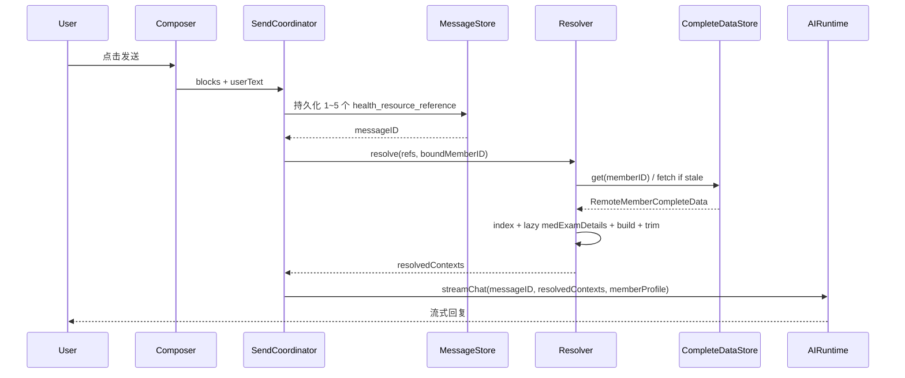

# 对话内「问报告」AI 解读需求文档（讨论稿）

> 范围说明：本文只讨论需求与产品/技术方案，不改动现有代码。目标是在对话过程中支持用户选择已保存的医疗记录/报告，并让 AI 基于报告内容快速给出合理解读。

## 1. 背景与目标

### Q：为什么要在对话里增加「问报告」？

A：用户已经在应用内保存了体检报告、检查报告、病历等医疗资料。当前用户如果想让 AI 解读报告，可能需要重新上传图片/PDF、复制内容，或者在病历页面与对话页面之间来回切换。新增「问报告」后，用户可以在当前对话里直接选择已保存报告，AI 自动带入报告结构化信息、附件、成员档案上下文，减少重复输入。

### Q：这个功能解决的核心问题是什么？

A：

1. 降低用户提问成本：不用再次上传报告。
2. 提升 AI 解读质量：比单纯图片/OCR 更适合传结构化字段、指标明细、报告结论。
3. 让成员档案和报告强绑定：AI 明确知道报告属于谁，避免多人家庭账号下误解读。
4. 保持对话连续性：用户可以围绕同一份或**多份报告（最多 5 份）**连续追问、对比解读。
5. 为后续“报告对比、异常指标趋势、就医建议、复查提醒”打基础。

### Q：一句话需求是什么？

A：在 Composer **通用小组件栏**（`ChatComposerContextTaskBar`）**左侧**增加「问报告」固定入口，同时支持 AI 工具调用读取/选择成员健康资料。无论资料来自用户手动选择，还是来自 AI 工具调用确认，最终都生成同一种“健康资料引用”：`resourceType + resourceID + memberID`。用户可**多次选择、累加至多 5 份**资料到输入区预览区后一并发送。输入区、消息流、工具调用结果都基于引用插入/渲染卡片；**发送后在客户端**由 `HealthResourceContextResolver` 从 `RemoteMemberCompleteData` 组装 AI 上下文（消息库只存引用数组，不存全文明细）。报告类资源可兼容旧的 `reportType + reportID + memberID`，但主模型建议升级为 `health_resource_reference`。

## 2. 入口设计

### Q：入口放在哪里？

A：仅保留一个「问报告」入口，落在 **Composer 通用小组件栏**（代码：`ChatComposerContextTaskBar`，位于 `HanlinChatComposerView` 内、输入框上方）：

1. **左侧（固定）— 问报告**：栏 **左侧** 固定悬浮按钮，文案「问报告」，图标建议 `doc.text.magnifyingglass` 或 `stethoscope`；点击打开健康资料选择 Sheet。
2. **右侧（主体）— 通用小组件**：同一栏右侧为横向滚动 `SmallTask` 快捷任务（`ChatComposerContextPill`），产品统称「通用小组件」；行为与现网一致，点击走 `onSmallTaskTapped`。
3. **不在** `HanlinChatInputView` 底栏（`plus` / 成员开关 / 发送）重复放置问报告入口。

布局示意：

```text
┌──────────────────────────────────────────────────────────┐
│ [问报告]  [通用小组件: SmallTask Pill] [Pill] …           │  ← ChatComposerContextTaskBar
├──────────────────────────────────────────────────────────┤
│ 【统一附件模块】                                          │  ← HanlinChatInputView.content
│   第 1 行：[附件 Strip] 图片/PDF/文件（横向）              │
│   第 2 行：[健康资料预览 Strip] 1/5… 每张带 ✕ 快速取消      │
│ 多行文本输入                                              │
│ [+] [成员档案 | 工具 | …]                      [发送]     │
└──────────────────────────────────────────────────────────┘
```

显示条件（仅作用于左侧「问报告」按钮）：同时满足以下两项时才展示，否则隐藏：

- 已结合成员档案：当前会话已绑定成员（`boundMemberID` 有效）；
- 与输入区 `ChatComposerRuntimeTogglesRow` 成员档区域状态一致（未绑定成员时不展示问报告）。

通用小组件（SmallTask）展示与否仍按现有 `smallTasks` 列表，**不**受成员绑定约束。

### Q：「通用小组件」是什么？

A：指 `ChatComposerContextTaskBar` 内栏 **右侧** 横向滚动的 **SmallTask 快捷入口**（现有 `smallTasks` + `ChatComposerContextPill`）。与左侧「问报告」同属一条 Composer 顶栏，职责分离：

| 区域 | 数据 | 行为 |
| --- | --- | --- |
| 问报告（左，固定） | 无（固定入口） | 打开健康资料选择 Sheet |
| 通用小组件（右） | `SmallTask` 列表 | 点击执行对应小任务（`onSmallTaskTapped`） |

实现文件：`SparkClient/Projects/Features/Chat/Presentation/Composer/ChatComposerContextTaskBar.swift`。

### Q：为什么只在「结合成员档案」时显示？

A：报告选择与解读强依赖成员上下文。仅在会话已绑定成员时展示**左侧**「问报告」按钮，避免未绑定成员时误选报告；点击后统一打开报告选择 Sheet。右侧通用小组件区域不受此限制。

### Q：未绑定成员时「问报告」按钮是否展示？

A：不展示。已开启「结合成员档案」但当前会话尚未绑定成员时，通用小组件栏**左侧**不显示「问报告」按钮。用户需先通过 `ChatComposerRuntimeTogglesRow` / `MemberProfileBindingMenu` 完成成员绑定；绑定成功后按钮出现，再进入报告选择流程。

### Q：当前会话已绑定成员时点击「问报告」怎么办？

A：报告选择页默认加载当前绑定成员的报告。成员切换**不复用单独设计的控件**，统一走项目内公共的 `MemberProfileBindingMenu`（`Features/MemberContext/Presentation/MemberProfileBindingMenu.swift`，`ChatComposerRuntimeTogglesRow`、任务卡片、结构化健康卡、病历表单等已在使用）：

1. 优先在输入区 `ChatComposerRuntimeTogglesRow`「结合成员档案」区域切换成员，`onSelect` 走现有 `onSetMemberBinding`，更新会话 `boundMemberID`。
2. 若报告选择 Sheet 内也需要切换，顶部仅嵌入同一 `MemberProfileBindingMenu`，禁止另做一套成员列表/头像条 UI。
3. `boundMemberID` 变化后，报告列表按新成员重新加载。

## 3. 报告类型与加载方式

### Q：报告类型有哪些？

A：建议不要再为「问报告」单独设计一套分散接口，而是优先复用已有的成员完整数据接口：

```swift
fetchMemberCompleteData(memberID:)
// GET /api/v1/medical/members/{memberID}/complete-data/
// 返回 SparkMedicalSyncAPI.RemoteMemberCompleteData
```

`RemoteMemberCompleteData` 已经是一份按成员聚合好的健康资料快照，包含报告、病例、用药、症状、就诊、手术、随访等模块。对话内的“问报告”可以产品命名仍叫「问报告」，但内部数据模型建议按“可选择的健康资料来源”统一处理。

### Q：`RemoteMemberCompleteData` 最新字段结构是什么？

A：与 `SparkClient/Projects/Core/Networking/API/Medical/MedicalSyncAPI.swift` 同步（`MedicalQueryAPI.fetchMemberCompleteData` → `GET /api/v1/medical/members/{memberID}/complete-data/`）：

```swift
/// 单接口成员医疗数据汇总模型
struct RemoteMemberCompleteData: Codable, Sendable, Equatable {
    /// 成员唯一 ID
    var memberId: Int
    /// 成员基础信息
    var member: RemoteMember
    /// 病例摘要列表
    var medicalCases: [RemoteMedicalCaseSummary]?
    /// 体检报告列表（含附件）；`medExamDetails` 默认不返回，列表/详情按需懒加载
    var healthExamReports: [RemoteHealthExamReportWithAttachments]?
    /// 检查检验报告列表（含附件）；`medExamDetails` 默认不返回，列表/详情按需懒加载
    var examinationReports: [RemoteExaminationReportWithAttachments]?
    /// 药盒列表
    var medicineBoxes: [RemoteMedicineBox]?
    /// 处方列表
    var prescriptions: [RemotePrescription]?
    /// 用药计划列表
    var medicationPlans: [RemoteMedicationPlan]?
    /// 今日用药记录
    var todayMedicationRecords: [RemoteMedicationRecord]?
    /// 用药统计汇总
    var medicationSummary: RemoteMedicationSummary?
    /// 症状记录列表
    var symptoms: [RemoteSymptom]?
    /// 就诊记录列表
    var visits: [RemoteVisit]?
    /// 手术记录列表
    var surgeries: [RemoteSurgery]?
    /// 随访记录列表
    var followUps: [RemoteFollowUp]?
}
```

说明：

1. 当前模型**未包含** `medicalReports` / 通用 `RemoteMedicalReport` 字段；若后端后续加入 `/complete-data/`，前端仅扩展 `resourceType` 映射。
2. `medicationPlans` 类型为 `[RemoteMedicationPlan]?`（非旧版 `MedicationPlan`）。
3. 问报告选择页、工具调用、详情页分发应优先从该快照取数，避免对体检/检查再并发 `listHealthExamReportsWithAttachments` / `listExaminationReportsWithAttachments`。

### Q：第一期可选择的数据类型有哪些？

A：基于 `RemoteMemberCompleteData`，建议支持以下类型：

1. 病例摘要：`medicalCases`
   - DTO：`RemoteMedicalCaseSummary`
   - 用途：疾病/就诊背景、诊断摘要、病例关联资料。

2. 体检报告：`healthExamReports`
   - DTO：`RemoteHealthExamReportWithAttachments`
   - 用途：年度体检、体检指标、体检附件。

3. 检查检验报告：`examinationReports`
   - DTO：`RemoteExaminationReportWithAttachments`
   - 用途：检验、影像、病理、专项检查。

4. 药盒：`medicineBoxes`
   - DTO：`RemoteMedicineBox`
   - 用途：已有药品库存、药品基础信息。

5. 处方：`prescriptions`
   - DTO：`RemotePrescription`
   - 用途：处方诊断、开药信息、关联病历。

6. 用药计划：`medicationPlans`
   - DTO：`RemoteMedicationPlan`
   - 用途：长期用药、剂量频次、用药执行语境；可关联 `medicineBox`、`prescription`、`medicalCase`。

7. 今日用药记录：`todayMedicationRecords`
   - DTO：`RemoteMedicationRecord`
   - 用途：当天是否服药、漏服/已服状态。

8. 用药统计汇总：`medicationSummary`
   - DTO：`RemoteMedicationSummary`
   - 用途：依从性、活跃计划、低库存、临期统计。

9. 症状记录：`symptoms`
   - DTO：`RemoteSymptom`
   - 用途：近期症状、持续时间、严重程度。

10. 就诊记录：`visits`
   - DTO：`RemoteVisit`
   - 用途：科室、医生、就诊时间、就诊摘要。

11. 手术记录：`surgeries`
   - DTO：`RemoteSurgery`
   - 用途：手术名称、时间、医生、术后背景。

12. 随访记录：`followUps`
   - DTO：`RemoteFollowUp`
   - 用途：复诊/随访结果、康复情况、慢病控制。

### Q：这些都叫“报告类型”吗？

A：产品入口可以继续叫「问报告」，但技术上建议不要都叫 `reportType`。更合理的是统一为 `healthSourceType` 或 `resourceType`：

```json
{
  "type": "health_resource_reference",
  "resourceType": "health_exam_report | examination_report | medical_case | medicine_box | prescription | medication_plan | medication_record | medication_summary | symptom | visit | surgery | follow_up",
  "resourceID": 123,
  "memberID": 456
}
```

其中：

1. `health_exam_report` 和 `examination_report` 是真正的报告类。
2. `medical_case`、`prescription`、`medication_plan` 等是健康资料类。
3. 报告类可以兼容生成旧的 `medical_report_reference`，但新模型建议统一升级为 `health_resource_reference`。

### Q：是否仍保留报告类详情页？

A：保留。统一引用不等于所有详情页都一样：

1. 报告类资源进入统一报告详情目标页。
2. 病例、处方、用药计划等进入对应健康资源详情页。
3. 当前没有详情页的类型，先展示统一只读兜底页。
4. AI 引用来源卡片统一展示，但点击后按 `resourceType` 分发。

### Q：这些详情页具体是哪里的页面，路径是什么？

A：现有可复用的详情页主要在 `SparkClient/Projects/Features/Home/Presentation/MedicalLists` 下。建议聊天模块不要直接在卡片里散落引用这些页面，而是新建一个统一的 `HealthResourceReferenceDestination`，内部按 `resourceType` 分发到以下现有页面。

### Q：`resourceType` 到现有详情页怎么映射？

A：

| `resourceType` | 数据来源 | 现有详情页 / 建议目标页 | 文件路径 | 备注 |
| --- | --- | --- | --- | --- |
| `health_exam_report` | `completeData.healthExamReports` | `HealthExamReportDetailPage` / `HealthExamRecognitionResultView` | `SparkClient/Projects/Features/Home/Presentation/MedicalLists/HealthExamReports/HealthExamReportDetailPage.swift` | 已有详情入口，可直接作为统一目标页分支。 |
| `examination_report` | `completeData.examinationReports` | `ExaminationReportSummaryDetailPage` | `SparkClient/Projects/Features/Home/Presentation/MedicalLists/ExaminationReports/ExaminationReportSummaryDetailPage.swift` | 已有总览详情页；内部可继续跳 `LaboratoryReportDetailPage`、`ImagingReportDetailPage`、`PathologyReportDetailPage`。 |
| `medical_case` | `completeData.medicalCases` | `MedicalCaseDetailPage` | `SparkClient/Projects/Features/Home/Presentation/MedicalLists/MedicalCases/MedicalCaseDetail/MedicalCaseDetailPage.swift` | 已有病例详情页，包含时间轴。 |
| `prescription` | `completeData.prescriptions` | `MedicationPrescriptionDetailPage` | `SparkClient/Projects/Features/Home/Presentation/MedicalLists/Medications/MedicationPrescriptionDetailPage.swift` | 已有处方详情页，需要同时传入关联用药计划、药盒、用药记录。 |
| `medication_plan` | `completeData.medicationPlans` | `MedicationPlanDetailPage` | `SparkClient/Projects/Features/Home/Presentation/MedicalLists/Medications/MedicationPlanDetailPage.swift` | 已有用药计划详情页，需要补齐药盒和用药记录。 |
| `medicine_box` | `completeData.medicineBoxes` | `MedicineBoxDetailPage` | `SparkClient/Projects/Features/Home/Presentation/MedicalLists/Medications/MedicineBoxListPage.swift` | 详情页定义在列表文件内，可复用但后续建议拆文件。 |
| `symptom` | `completeData.symptoms` | 统一只读兜底页 / 后续独立详情页 | 暂无独立详情页 | 目前更多出现在病例时间轴和表单流程里。 |
| `visit` | `completeData.visits` | 统一只读兜底页 / 后续独立详情页 | 暂无独立详情页 | 目前更多出现在病例时间轴和表单流程里。 |
| `surgery` | `completeData.surgeries` | 统一只读兜底页 / 后续独立详情页 | 暂无独立详情页 | 目前更多出现在病例时间轴和表单流程里。 |
| `follow_up` | `completeData.followUps` | 统一只读兜底页 / 后续独立详情页 | 暂无独立详情页 | 目前更多出现在病例时间轴和表单流程里。 |
| `medication_record` | `completeData.todayMedicationRecords` | 统一只读兜底页 / 用药计划详情中展示 | 暂无独立详情页 | 可先跳关联 `MedicationPlanDetailPage` 或只读展示。 |
| `medication_summary` | `completeData.medicationSummary` | 统一只读兜底页 / 用药执行中心 | `SparkClient/Projects/Features/Home/Presentation/MedicalLists/Medications/MedicationExecutionCenterPage.swift` | 是汇总数据，不一定适合作为独立详情。 |

### Q：检查检验报告内部详情页有哪些？

A：`examination_report` 先进入 `ExaminationReportSummaryDetailPage`，再按 `ExaminationReportCategory` 分发：

1. 检验：`LaboratoryReportDetailPage`
   - 路径：`SparkClient/Projects/Features/Home/Presentation/MedicalLists/ExaminationReports/LaboratoryReportDetailPage.swift`
2. 影像：`ImagingReportDetailPage`
   - 路径：`SparkClient/Projects/Features/Home/Presentation/MedicalLists/ExaminationReports/ImagingReportDetailPage.swift`
3. 病理：`PathologyReportDetailPage`
   - 路径：`SparkClient/Projects/Features/Home/Presentation/MedicalLists/ExaminationReports/PathologyReportDetailPage.swift`

### Q：为什么还需要统一目标页，而不是卡片直接写这些页面？

A：

1. 很多详情页需要额外依赖：`completeData`、`workflowAPI`、`fileTransferService`、`memberContextStore`、`notificationClient`、更新/删除回调等。
2. 有些现有 host 是局部私有实现，例如 `ExaminationReportDetailHostPage` 在 `LabReportCard.swift` 内部，不适合聊天模块直接引用。
3. 统一目标页可以先按 `resourceType + resourceID + memberID` 从 `completeData` 匹配数据，匹配不到再请求服务器。
4. 统一目标页可以处理加载中、无权限、已删除、缺少详情页等兜底状态。
5. 后续新增详情页时，只改分发表，不改聊天卡片。

### Q：统一目标页建议放在哪里？

A：建议放在 Home 医疗列表的 Shared 层，供 Chat 和 Home 共同使用，而不是放在 Chat 私有目录。

建议路径：

```text
SparkClient/Projects/Features/Home/Presentation/MedicalLists/Shared/HealthResourceReferenceDestination.swift
```

如果后续这个能力不只 Home 使用，也可以进一步上提到：

```text
SparkClient/Projects/Features/MedicalRecord/Presentation/Shared/HealthResourceReferenceDestination.swift
```

### Q：统一目标页的输入是什么？

A：

```swift
struct HealthResourceReference: Hashable, Codable, Sendable {
    let resourceType: HealthResourceType
    let resourceID: Int
    let memberID: Int
}
```

目标页内部再负责：

1. 在当前 `RemoteMemberCompleteData` 中匹配对应数据。
2. 匹配不到时调用对应接口或刷新 `fetchMemberCompleteData(memberID:)`。
3. 找到数据后跳现有详情页。
4. 找不到详情页时展示统一只读兜底页。

### Q：第一期如果要控制范围，优先级怎么排？

A：建议优先级：

1. 体检报告：`health-exam-reports`
   - 对应 DTO：`RemoteHealthExamReportWithAttachments`
   - 典型字段：机构、报告号、体检日期、体检类型、总结、附件、指标明细。
   - 来源：`completeData.healthExamReports`

2. 医疗检查报告：`examination-reports`
   - 对应 DTO：`RemoteExaminationReportWithAttachments`
   - 典型字段：检验/检查项目、分类、子分类、检查时间、报告时间、机构、科室、医生、所见、结论、附件、指标明细。
   - 来源：`completeData.examinationReports`

3. 病例摘要：`medicalCases`
   - 对应 DTO：`RemoteMedicalCaseSummary`
   - 用途：让 AI 理解报告所属病程/诊断背景。

4. 处方与用药计划：`prescriptions`、`medicationPlans`
   - 用途：回答“这个指标和用药有没有关系”“最近用药控制如何”。

5. 症状、就诊、手术、随访：`symptoms`、`visits`、`surgeries`、`followUps`
   - 用途：自然提问和慢病管理场景下作为补充上下文。

### Q：是否要支持 `MedicalReport` / 通用医疗报告？

A：需要确认。代码中存在 `MedicalReport` / `RemoteMedicalReport`，但当前 `RemoteMemberCompleteData` 未包含 `medicalReports` 字段。如果后端后续把通用医疗报告加入 `/complete-data/`，前端只需要新增一个 `resourceType = medical_report` 映射。

待确认问题：

1. 产品入口是否继续叫「问报告」，但内部展示完整健康资料类型？
2. 出院小结、病理报告、病历文书是否会加入 `RemoteMemberCompleteData`？
3. 处方、服药计划是否在「问报告」里可选，还是未来拆成「问用药」？
4. `medical_report_reference` 是否升级为更通用的 `health_resource_reference`？

### Q：如何加载报告？

A：建议报告选择页按当前成员加载 `RemoteMemberCompleteData`（单接口快照，不再并发分散列表接口）：

1. 打开 Sheet。
2. 根据当前绑定成员确定 `memberID`（入口仅在已绑定成员时可见，不依赖默认成员兜底）。
3. 优先读取当前成员已有 `completeData` 缓存（与首页 `HomeDashboard.medical.completeData` 同源）。
4. 缓存不存在或成员切换后不匹配时，调用 `fetchMemberCompleteData(memberID:)`。
5. 从快照字段映射为 `ChatSelectableHealthSource`：`medicalCases`、`healthExamReports`、`examinationReports`、`medicineBoxes`、`prescriptions`、`medicationPlans`、`todayMedicationRecords`、`medicationSummary`、`symptoms`、`visits`、`surgeries`、`followUps`。
6. 按业务时间倒序排列，例如报告日期、就诊日期、随访日期、更新时间。
7. 支持按类型筛选、关键词搜索、异常/有结论/有关联病历优先筛选。
8. 切换成员后清空当前列表加载状态，并重新按新 `memberID` 读取/请求 completeData。
9. 报告类若需指标明细，在选中或发送前对 `healthExamReports` / `examinationReports` 按需懒加载 `medExamDetails`（`/complete-data/` 默认不带明细）。

### Q：为什么优先使用 `/complete-data/`？

A：

1. 已有接口一次返回成员完整健康资料，避免报告选择页发多组分散请求。
2. 与首页、病历列表、详情页使用同一份数据快照，缓存更容易复用。
3. 支持切换成员时只需要以 `memberID` 重新拉 completeData。
4. AI 自然提问时可以跨类型检索，例如“妈妈血压控制”可能命中体检、随访、用药计划，而不是只命中报告。
5. 后续新增类型时，只扩展 completeData 字段映射和 `resourceType`，选择页主流程不变。

### Q：健康资料引用的统一标识怎么设计？

A：选择报告/健康资料或工具调用命中资料后，不要把完整数据塞进草稿，也不要模拟成图片/PDF 附件。建议统一生成：

```json
{
  "kind": "health_resource_reference",
  "resourceType": "health_exam_report | examination_report | medical_case | prescription | medication_plan | symptom | visit | surgery | follow_up",
  "resourceID": 123,
  "memberID": 456
}
```

这三个字段是插入卡片、发送消息、历史消息重建、AI 上下文解析的最小闭环。报告类资源可以派生兼容字段：`reportType = resourceType`，`reportID = resourceID`。

### Q：工具调用为什么也要输出同一种健康资料引用？

A：工具调用的职责是“查找、确认、补充资料”，不是单独发明一套卡片结构。工具调用成功后只需要返回标准引用：

```json
{
  "resourceType": "examination_report",
  "resourceID": 88,
  "memberID": 12
}
```

前端收到后走同一套 `health_resource_reference` 插入逻辑。这样手动选择和 AI 主动查找不会产生两套卡片、两套历史消息、两套预览页。

### Q：为什么必须带 `resourceType`？

A：因为不同报告类型对应不同接口、字段和详情明细：

1. `health_exam_report` 走体检报告读取逻辑。
2. `examination_report` 走检查报告读取逻辑。
3. `medical_case`、`prescription`、`medication_plan` 等走各自健康资源读取逻辑。
4. 未来如果加入 `medical_report`，也只扩展类型映射，不改聊天卡片主流程。

### Q：为什么不能只带 `resourceID`？

A：不同资源表可能出现相同 ID，只传 ID 无法判断该去哪个字段/接口查，也无法知道如何渲染卡片。`resourceType + resourceID` 才是业务唯一引用；`memberID` 用于校验成员绑定和权限。

### Q：指标明细如何加载？

A：`RemoteMemberCompleteData` 内 `healthExamReports` / `examinationReports` 与首页一致：`/complete-data/` 默认不返回 `medExamDetails`，明细由列表/详情页懒加载。因此「问报告」发送给 AI 前必须确认明细完整性：

1. 列表展示阶段可以只用摘要字段和附件。
2. 用户选中报告后，详情预览或发送前按需加载 `listMedExamDetails(memberID:businessType:businessID:)`。
3. 体检报告建议 `businessType = health_exam`，检查报告建议 `businessType = examination`，具体后端常量需确认。
4. 如果明细加载失败，仍允许发送摘要，但需要在 AI 入参中标记“明细缺失/加载失败”，避免 AI 误以为报告没有指标。

### Q：`medExamDetails` 组装给 AI 时如何处理 `flag`？

A：与接口 `RemoteMedExamDetail`（`listMedExamDetails` 返回）**原样透传**，客户端**不做**高低/阴阳性的归一化（禁止映射为 `high` / `low` / `normal` / `critical` 等枚举）。

1. **数据来源**：`GET …/med-exam-details/?member_id=&business_type=&business_id=`，单条结构与后端一致，例如：
   - `item_name`、`item_code`、`result_value`、`unit`、`reference_range`
   - `flag`：后端原文字符串，常见值为 `""`（空）、`"异常"`、`"↑"`、`"↓"` 等，**以实际返回为准**
   - 影像/内镜/描述类：`result_value` 可为长文本（超声所见、胃镜所见）；`item_name` 可能为「医疗报告」；`diagnosis` 为文字结论（如「慢性非萎缩性胃炎伴胆汁反流」），`flag` 常为空
   - 检验类：`examination_report` 下多行 `WBC`/`PLT` 等，`diagnosis` 可能为「正常」且 `flag` 仍为空，不能因此跳过不传
   - `business_type` 与父报告一致：`health_exam_report` 或 `examination_report`（与 `listMedExamDetails` 查询参数一致）
   - 其他：`category`、`sub_category`、`modality`、`body_part`、`result_at`、`sort_order`
2. **AI 职责**：结合 `result_value`、`reference_range`、`flag`、`diagnosis` **自行判断**是否异常、是否需要关注；客户端不替模型下结论。
3. **组装字段名**：写入 `healthContext` 时建议使用与 DTO 一致的 camelCase（`itemName`、`referenceRange`、`resultValue`…），值与接口一致。
4. **裁剪策略**（仅控制条数，不改语义）：
   - 指标过多时，可优先附带 `flag` 非空的行 + `detailStats`（`total` / `included` / `omitted`）；
   - **禁止**因 `flag === "↑"` 就在客户端改成 `high`；
   - 用户问题若限定类目（如「血常规」），可按 `category` 过滤，仍保留原始 `flag` 字符串。
5. **弃用字段**：不要使用虚构的 `abnormalIndicators[].flag: "high"` 结构；统一改为 `medExamDetails[]`（或裁剪后的 `medExamDetailsIncluded[]` + `medExamDetailsStats`）。

## 4. 报告选择页面

### Q：报告选择页应该是什么形态？

A：使用已有 Sheet 打开，内部建议为“成员健康资料时间轴选择页”，而不是单纯报告列表。页面数据统一来自当前成员的 `RemoteMemberCompleteData`，再按业务类型和时间组织成可选择卡片。

1. 顶部：标题「问报告」、关闭按钮。
2. 成员切换（可选）：复用 `MemberProfileBindingMenu` 展示当前绑定成员并切换；与会话绑定逻辑与输入区一致，不单独实现成员选择 UI。
3. 搜索框：搜索标题、机构、医生、诊断、结论、药名、症状、检查项目、随访结果。
4. Tab 切换：全部、病历、体检、医疗报告、用药。
5. 主体：按时间轴倒序展示统一健康资料卡片；**列表为单选态**（每次点选 1 条，无多选 checkbox）。
6. 底部：「加入预览 (n/5)」按钮；`n` 为输入区预览区已累加数量；达 5 份时按钮禁用并提示「最多 5 份资料」。

### Q：如何选择多份报告一起发送？

A：采用**「选择页单次 1 份 + 预览区多次累加」**，第一期即支持，上限 **5 份**。

| 步骤 | 行为 |
| --- | --- |
| 1 | 打开「问报告」Sheet，浏览时间轴列表 |
| 2 | **每次只选中 1 份**资料（点击卡片高亮；再次点击可取消当前条选中） |
| 3 | 点「加入预览」→ 将该条 `resourceType + resourceID + memberID` 追加到输入区预览区 |
| 4 | Sheet 可关闭；再次点「问报告」可继续选第 2、3… 份 |
| 5 | 预览区横向展示已选缩略卡，支持单张移除；**同类型同 ID 去重** |
| 6 | 预览区已有 5 份时，选择页禁止再加入，Toast「最多 5 份资料」 |
| 7 | 用户输入问题（可选）后点发送 → 一条用户消息内包含 **最多 5 个** `health_resource_reference` block |

说明：

1. 选择页**不做**列表多选 checkbox；避免与时间轴病历折叠子项的多选混淆。
2. 「加入预览」不等于发送；用户可在预览区确认后再点聊天发送。
3. 多份发送时，Resolver 批量 `resolve`，`refIndex` 与预览区从左到右顺序一致。
4. 工具调用候选卡可一次勾选多份加入预览，但仍受 5 份上限约束。

### Q：Tab 怎么划分？

A：建议用 5 个 Tab，避免把所有 `RemoteMemberCompleteData` 字段平铺成一堆难扫的类型。

1. 全部
   - 展示所有可选健康资料，按时间轴倒序。

2. 病历
   - 主体是 `medicalCases` 病例卡片。
   - 病例卡片内部折叠展示关联资料：`symptoms`、`visits`、`surgeries`、`followUps`、关联用药、关联处方、关联医疗报告。
   - 未关联病例的症状/就诊/手术/随访也可作为“未归入病例”的时间轴卡片展示。

3. 体检
   - 展示 `healthExamReports`。
   - 卡片突出体检日期、机构、摘要、异常项数量、附件数量。

4. 医疗报告
   - 展示 `examinationReports`。
   - 按 `ExaminationReportCategory` 区分检验、影像、病理。
   - 卡片突出项目名、报告日期、机构、所见/结论、附件数量。

5. 用药
   - 展示 `prescriptions`、`medicationPlans`、`medicineBoxes`、`todayMedicationRecords`、`medicationSummary`。
   - 处方和用药计划优先展示；药盒和今日服药记录作为辅助卡片或关联信息展示。

### Q：时间轴列表如何统一？

A：将 `RemoteMemberCompleteData` 映射成统一的 `ChatSelectableHealthSource`：

```swift
struct ChatSelectableHealthSource: Identifiable, Hashable {
    let id: HealthResourceReference
    let resourceType: HealthResourceType
    let resourceID: Int
    let memberID: Int
    let occurredAt: Date?
    let title: String
    let subtitle: String?
    let summary: String?
    let badges: [String]
    let searchText: String
    let children: [ChatSelectableHealthSource]
}
```

排序规则：

1. 优先用业务发生时间：体检日期、报告日期、就诊日期、手术日期、随访日期、症状发生时间、用药开始时间。
2. 没有业务时间时使用 `updatedAt`。
3. 仍没有时间时放到列表底部。
4. 同一天内按资源类型优先级排序：病例 > 报告 > 就诊/随访 > 用药 > 其他。

### Q：病历卡片为什么要特殊处理？

A：病例是一个“聚合容器”，不是普通单条记录。一个病例下可能关联：

1. 症状：`symptoms`
2. 就诊：`visits`
3. 手术：`surgeries`
4. 随访：`followUps`
5. 医疗报告：`examinationReports`
6. 处方：`prescriptions`
7. 用药计划：`medicationPlans`

因此病历卡片建议折叠展示：

1. 默认折叠：只展示病例标题、诊断摘要、医院、更新时间、关联资料数量。
2. 展开后：按时间轴展示该病例下的子资料。
3. 支持选择整个病例：将病例摘要和子资料摘要一起作为上下文。
4. 支持只选择某个子资料：例如只选病例下的某份检查报告。
5. 已展开状态只影响 UI，不改变选择结果。

### Q：病历卡片如何判断关联资料？

A：基于 `RemoteMemberCompleteData` 里的关联字段做本地归组：

1. `examinationReports.medicalRecord == medicalCase.id`
2. `prescriptions.medicalCase == medicalCase.id`
3. `medicationPlans.medicalCase == medicalCase.id`
4. `symptoms.medicalCase == medicalCase.id`
5. `visits.medicalCase == medicalCase.id`
6. `surgeries.medicalCase == medicalCase.id`
7. `followUps.medicalCase == medicalCase.id`

字段名以现有 DTO 为准，缺失或为空时放入“未关联病历”的时间轴分组。

### Q：搜索怎么做？

A：搜索作用于当前 Tab 内，也可以在“全部”里跨类型搜索。建议本地搜索优先，必要时再加服务端搜索。

搜索字段：

1. 病历：标题、诊断摘要、医院、症状名、药名。
2. 体检：机构、报告号、摘要、异常项、附件名。
3. 医疗报告：项目名、分类、子分类、机构、科室、医生、所见、结论、明细项目名。
4. 用药：药名、剂量、频次、处方机构、药盒备注、服药状态。
5. 就诊/手术/随访/症状：科室、医生、方法、结果、症状名、严重程度。

搜索结果展示：

1. 命中的关键词高亮。
2. 命中子资料时，如果它属于某个病例，自动显示所属病例信息。
3. 搜索为空时恢复当前 Tab 的完整时间轴。

### Q：每类卡片展示什么？

A：

1. 病历卡片
   - 标题、诊断摘要、医院、更新时间。
   - 关联资料数量：报告 N、处方 N、随访 N、症状 N。
   - 折叠/展开按钮。
   - 子资料条目点击即**单选当前 1 条**（与选择页「每次 1 份」规则一致，无批量 checkbox）。

2. 体检卡片
   - 机构、体检日期、报告号、摘要。
   - 异常项数量、附件数量。

3. 医疗报告卡片
   - 项目名、检验/影像/病理标签、报告日期。
   - 机构、所见/结论摘要、附件数量。

4. 用药卡片
   - 处方：机构、诊断、处方时间、药品数量。
   - 用药计划：药名、剂量、频次、开始/结束时间。
   - 药箱：药名、规格、库存、有效期。
   - 今日服药记录：药名、计划时间、已服/漏服/跳过状态。

5. 其他记录卡片
   - 症状、就诊、手术、随访统一用轻量时间轴卡。
   - 展示标题、时间、摘要、所属病例。

### Q：是否支持多份报告一起发送？

A：**支持**。交互上选择页每次只选 1 份，通过多次「加入预览」累加；发送时一条消息可带多份引用。

1. **选择页**：单次选中 1 份 →「加入预览」。
2. **预览区**：可累加多份，**最多 5 份**；可移除、可重复打开 Sheet 继续加。
3. **发送**：一条用户消息内多个 `health_resource_reference` block（≤5）；客户端批量 resolve 后交给 AI。
4. **适用场景**：对比两次体检、结合病例+检查报告+用药计划、综合解读等。
5. **裁剪**：`ContextBudgetTrimmer` 在 5 份上限内控制条数（如优先 `flag` 非空的明细行 + 统计 omitted），**不归一化** `flag` 语义，避免上下文爆炸。

### Q：报告列表卡片展示哪些信息？

A：见上面的卡片分型。核心原则是：所有卡片外层使用统一时间轴视觉，内部根据 `resourceType` 展示不同摘要；病历卡片可折叠，报告和用药卡片保持紧凑。

### Q：空状态如何设计？

A：

1. 当前成员没有健康资料：展示“暂无可解读资料”，提供“去上传报告”或“切换成员”。
2. 搜索无结果：展示“没有匹配的资料”，保留 Tab、筛选和清空搜索。
3. 网络失败：展示重试按钮。
4. 未选择成员：展示成员列表入口。

## 5. 与成员档案绑定的关系

### Q：通过 `MemberProfileBindingMenu` 切换成员后，为什么要更新当前会话绑定成员？

A：菜单的 `onSelect` 与会话绑定共用同一条链路（`onSetMemberBinding` → `boundMemberID`）。报告属于特定成员，AI 解读需要成员上下文；若在菜单里切到李四但会话仍绑定张三，会造成严重上下文污染。`MemberProfileBindingMenu` 在输入区与报告选择 Sheet 内行为须一致。

### Q：如果对话已有绑定成员 A，用户选择成员 B 的报告怎么办？

A：建议弹出轻提示或二次确认：

“该报告属于 B，是否将当前对话切换为 B 的成员档案？”

默认操作建议：切换到 B。因为报告数据优先级高于旧绑定状态。

### Q：如果用户取消切换成员，还能选择 B 的报告吗？

A：建议不允许。报告引用必须和当前会话成员一致，除非未来支持“跨成员对比”这种明确场景。

## 6. 统一附件模块与报告预览

### Q：选择报告后放在哪里？

A：放入 `HanlinChatInputView` 顶部的**统一附件模块**（与现有 `attachmentStrip` 同区域，代码锚点：`content` 内 `VStack`，约第 112–118 行「预选报告」扩展位）。健康资料引用**单独占一行**，不与图片/PDF 混排在同一横向 Strip。

### Q：统一附件模块如何布局？

A：模块位于多行文本输入**上方**，自上而下：

```text
┌──────────────────────────────────────────────────────────┐
│ 【统一附件模块】                                          │
│  第 1 行  [附件 Strip]     ← 仅 composerDraft.attachments │
│  第 2 行  [健康资料预览 Strip]  ← pendingHealthResourceRefs │
│           [1/5 体检卡 ✕] [2/5 胃镜卡 ✕] …                 │
├──────────────────────────────────────────────────────────┤
│  多行文本输入 …                                           │
└──────────────────────────────────────────────────────────┘
```

规则：

1. **第 1 行 — 普通附件 Strip**：沿用现有 `attachmentStrip`（`HanlinAttachmentThumbnail`）；有图片/PDF/文件时展示，无则整行不占位或高度为 0。
2. **第 2 行 — 健康资料预览 Strip**：**单独一行**横向 `ScrollView`；仅展示「问报告」加入预览的引用卡；无已选资料时整行不占位。
3. 两行互不混排：用户可区分「新上传文件」与「已保存健康资料引用」。
4. 模块整体 `padding` 与现网附件区一致（如 horizontal 12、top 12）；有任意一行内容时，文本输入区 `padding.top` 由 12 降为 6（与现网 `attachments.isEmpty` 逻辑一致，扩展为「附件模块是否为空」）。

### Q：报告卡片是否属于普通附件？

A：视觉上在同一附件模块，技术语义上不属于普通附件。建议区分两条链路：

1. 普通附件：图片/PDF/文件，走上传、OCR、文件预览（第 1 行）。
2. 健康资料引用：已保存医疗数据，走 `resourceType + resourceID` 查询、卡片渲染、AI 上下文组装（第 2 行）。

这样可以避免已保存报告被重复上传，也避免把报告当作普通文件丢失业务类型。

### Q：是否需要和附件结合成公共预览页面？

A：输入区**分两行展示**；点击后的详情预览仍共用容器，按类型分发：

1. 第 1 行缩略图：点击走现有 `unifiedFilePreview` / 文件预览。
2. 第 2 行健康资料卡：点击走报告/健康资料轻量预览页（需求 §6 详情预览）。
3. 不在同一横向 Strip 里交错排列两种卡片。

### Q：健康资料预览卡如何设计？（含 ✕ 快速取消）

A：建议尺寸与附件缩略图接近，但为医疗报告卡样式；**每张卡必须有 ✕（X）按钮**，用于快速取消该条选择（从预览区移除，不必进 Sheet 取消）。

1. 左上角类型角标：体检 / 检查 / 病历 / 用药等。
2. 主标题：报告标题或检查项目名。
3. 副标题：日期 + 机构。
4. 序号角标：`1/5`…`5/5`，与发送后 `refIndex` 一致。
5. **✕ 关闭按钮**：卡片右上角或尾随位置，点击立即 `removeHealthResourceRef(id)`，无二次确认（单张移除）。
6. 可选：第 2 行右侧「清空全部」文字按钮，一次移除本行全部健康资料引用（≤5 条）；与单卡 ✕ 并存。
7. 横向排列，**最多 5 张**；达上限后 M2 禁止再加入。
8. 卡片主体点击（非 ✕）：打开轻量预览页，便于发送前确认。

### Q：报告缩略卡与普通附件缩略图差异？

A：见上条；普通附件仍用 `HanlinAttachmentThumbnail` 的 ✕ 移除逻辑（`onRemoveAttachment`），健康资料卡用独立的 `onRemoveHealthResourceRef`，两套回调不共用。

### Q：报告详情预览如何设计？

A：点击报告引用卡片后打开预览页，建议包含：

1. 顶部摘要：标题、成员、报告类型、日期、机构。
2. 关键结论：summary / findings / impression。
3. 指标明细：按 `category` 分组展示 `medExamDetails`；UI 可高亮 `flag` 非空行，但**不**将 `flag` 翻译成 high/low，解读交给 AI。
4. 全部指标：分组展示，可折叠。
5. 原始附件：图片/PDF 缩略图，可点击查看。
6. 发送给 AI 的范围说明：例如“消息只保存报告引用；发送后由客户端从成员快照解析摘要、指标与附件元数据，不发送无关成员资料”。

### Q：报告预览是否复用病历详细内时间线卡片？

A：可以复用视觉语言，但不建议直接复用 `MedicalCaseTimelineRow` 整体组件。

原因：

1. 时间线卡片强依赖病历详情页上下文：`medicalCaseID`、`workflowAPI`、`fileTransferService`、编辑入口、删除回调等。
2. 聊天消息卡片只需要展示和预览，不应带完整编辑能力。
3. 时间线是纵向事件流，聊天卡片是消息内附件，需要更紧凑。

建议抽取或仿照以下设计元素：

1. 左侧类型图标/颜色。
2. 标题 + 日期 + 状态 Badge。
3. `findings/impression/detailText` 三行摘要。
4. 附件 Pill 横向展示。
5. 分类颜色：实验室、影像、病理用现有 `ExaminationReportCategory` 颜色体系。

## 7. 发送给 AI 的数据整理

### Q：选择报告后，发送时 AI 应收到什么？

A：第一层消息保存和传递健康资料引用；如果资料来自工具调用，工具调用结果也必须转成同样的引用再插入卡片：

```json
{
  "messageBlocks": [
    {
      "type": "health_resource_reference",
      "resourceType": "health_exam_report",
      "resourceID": 123,
      "memberID": 456
    },
    {
      "type": "health_resource_reference",
      "resourceType": "examination_report",
      "resourceID": 88,
      "memberID": 456
    },
    {
      "type": "health_resource_reference",
      "resourceType": "medication_plan",
      "resourceID": 12,
      "memberID": 456
    }
  ],
  "userQuestion": "请对比第 1 份体检和第 2 份甲状腺彩超，并结合用药计划说明要注意什么"
}
```

（最多 5 个 `health_resource_reference` block；预览区顺序与 block 顺序、`refIndex` 一致。）

**持久化与 AI 上下文分离**：消息库/服务端只存引用三元组；**发送后在客户端**由统一解析器组装 AI 可读上下文，再随本轮 `sendMessage` / 流式请求提交。详见下文「发送后客户端组装」。

### Q：发送后客户端如何组装 AI 上下文？（详细设计）

A：核心原则：**存得轻、解析得全、组装在客户端、每轮可刷新**。

#### 1. 时机与触发点

| 阶段 | 做什么 | 是否持久化 |
| --- | --- | --- |
| 用户点发送 | 将 `health_resource_reference` block 写入用户消息 | ✅ 只存引用 |
| 发送成功回调后、发起 AI 流式请求前 | 客户端 `HealthResourceContextResolver` 解析引用 → 生成 `resolvedContexts[]` | ❌ 不写消息库 |
| AI 流式回复中 | 可选：工具 `get_health_resource_context` 复用同一 Resolver | ❌ |
| 用户重试 / 重新生成 | 按当前 `completeData` 缓存**重新解析**（报告可能已更新） | ❌ |

不在服务端二次拉全量资料作为主路径；服务端若需审计可只记录 `resourceType/resourceID/memberID` 与解析耗时，不记录完整指标/OCR。

#### 2. 模块划分（建议落点）

```
ChatSendCoordinator
  └─ persist user message (blocks only)
  └─ HealthResourceContextResolver.resolve(references[], session)
       ├─ MemberCompleteDataStore     // 读/刷 RemoteMemberCompleteData
       ├─ HealthResourceIndex         // memberID → 各数组索引 (type+id → 实体)
       ├─ MedExamDetailLazyLoader     // 报告类按需补 medExamDetails
       ├─ HealthResourceContextBuilder // 按 resourceType 映射字段 → AI DTO
       └─ ContextBudgetTrimmer        // 裁剪、异常优先、多报告排序
  └─ AIRuntimeRequestFactory.build(..., resolvedContexts, memberProfile, userText)
```

与现有代码对齐：

- 快照来源：`MedicalQueryAPI.fetchMemberCompleteData` → `RemoteMemberCompleteData`（§3 字段表）。
- 首页/聊天共用：`HomeDashboard.medical.completeData` 或按 `memberID` 的独立缓存槽。
- 报告明细懒加载：复用 `MedExamDetailLazyLoadViewModel` / `listMedExamDetails` 模式。

#### 3. 解析流水线（单条引用）

对每条 `{ resourceType, resourceID, memberID }`：

```
1. validate
   - memberID == session.boundMemberID（不一致则标记 cross_member，默认阻断或要求确认）
   - resourceID > 0

2. load snapshot
   - MemberCompleteDataStore.data(for: memberID)
   - 若无缓存或 stale：await fetchMemberCompleteData(memberID)
   - HealthResourceIndex.rebuild(completeData)

3. lookup entity
   - entity = index.find(resourceType, resourceID)
   - nil → status = not_found，卡片仍保留引用，AI 上下文带 error stub

4. enrich（按类型）
   - health_exam_report / examination_report：
       if entity.medExamDetails == nil → MedExamDetailLazyLoader.load(...)
   - prescription / medication_plan：
       从同一 completeData 关联 medicineBoxes、todayMedicationRecords、medicalCases（本地 join，不再打分散接口）
   - medication_summary：单对象，无 enrich

5. build AI slice
   - HealthResourceContextBuilder.build(entity, resourceType, enrichments)
   - ContextBudgetTrimmer.trim(slice, policy)

6. append to resolvedContexts[]
```

#### 4. 从 `RemoteMemberCompleteData` 取数的映射表

解析器**优先只读快照内数组**，找不到再标记 `not_found`；除 `medExamDetails` 外，第一期不对各类型再并发列表接口。

| `resourceType` | 快照字段 | 组装给 AI 的主要字段（示例） |
| --- | --- | --- |
| `health_exam_report` | `healthExamReports[]` | 机构、体检日期、体检类型、summary、附件名列表、`medExamDetails[]`（懒加载后原样透传，含原始 `flag`） |
| `examination_report` | `examinationReports[]` | 项目名、分类、检查/报告时间、机构、科室、findings、impression、附件、`medExamDetails[]`（同上） |
| `medical_case` | `medicalCases[]` | 诊断、主诉摘要、就诊时间、关联资源 ID 列表（不展开全时间轴） |
| `prescription` | `prescriptions[]` | 诊断、药品、剂量、频次；关联 `medicationPlans`/`medicineBoxes` 由 index 本地 join |
| `medication_plan` | `medicationPlans[]` | drugName、dose、frequency、起止日期、status；关联药盒/今日记录 |
| `medicine_box` | `medicineBoxes[]` | 药品名、规格、库存、有效期 |
| `medication_record` | `todayMedicationRecords[]` | 计划 ID、scheduledAt、takenAt、status |
| `medication_summary` | `medicationSummary` | 今日统计、依从率、活跃计划数（单对象） |
| `symptom` | `symptoms[]` | 症状名、程度、起止时间 |
| `visit` | `visits[]` | 科室、医生、就诊时间、摘要 |
| `surgery` | `surgeries[]` | 手术名、时间、医生 |
| `follow_up` | `followUps[]` | 随访类型、结果、下次时间 |

`HealthResourceIndex` 建议在 `completeData` 更新后一次性构建：

```swift
// 伪代码：各数组按 id 建字典，避免发送时 O(n) 扫描
healthExamByID: [Int: RemoteHealthExamReportWithAttachments]
examinationByID: [Int: RemoteExaminationReportWithAttachments]
// ... 其余类型同理
```

#### 5. 输出结构（交给 AI Runtime，不写入消息 block）

建议客户端组装为**固定 schema** `HealthResourceResolvedPayload`（`version: 1`）。`healthResources` 长度 **1~5**，与预览区、消息 block 顺序一致。

##### 5.1 完整示例（多类型，节选 5 份）

下列为一次发送 **5 份不同类型** 资料的完整 `healthContext` 示例（`healthResources` 可混合报告、病历、用药等）。

指标明细均来自 `listMedExamDetails`，`business_type` 为 `health_exam_report` 或 `examination_report`；`flag` **原样透传**（可为空），是否异常由 AI 结合 `resultValue`、`referenceRange`、`diagnosis` 判断。下文含三类真实形态：

1. **体检报告**（`health_exam_report`）：数值项 `↑`/`↓`、描述项 `异常`、`flag` 为空的一般检查。
2. **检查报告 · 内镜**（`examination_report`）：单行 `item_name=医疗报告`，长文本 `result_value` + `diagnosis`，`flag` 常为空。
3. **检查报告 · 检验**（`examination_report`）：多行 WBC/RBC/…，`diagnosis` 可为「正常」且 `flag` 仍为空，见 §5.1.1。

```json
{
  "version": 1,
  "memberProfile": {
    "memberID": 456,
    "displayName": "妈妈",
    "relation": "mother",
    "age": 58,
    "sex": "female"
  },
  "healthResources": [
    {
      "refIndex": 0,
      "resourceType": "health_exam_report",
      "resourceID": 123,
      "memberID": 456,
      "resolveStatus": "ok",
      "title": "2026 年度体检",
      "examType": "年度体检",
      "summary": "体检汇总摘要…",
      "medExamDetailsStats": { "total": 17, "included": 6, "omitted": 11 },
      "medExamDetails": [
        {
          "id": 871,
          "category": "血常规",
          "itemName": "血小板计数",
          "itemCode": "PLT",
          "resultValue": "357",
          "unit": "10^9/L",
          "referenceRange": "100-300 10^9/L",
          "flag": "↑"
        },
        {
          "id": 868,
          "category": "血常规",
          "itemName": "中性粒细胞百分数",
          "itemCode": "NEUT%",
          "resultValue": "46.5",
          "unit": "%",
          "referenceRange": "50.00-70.00%",
          "flag": "↓"
        },
        {
          "id": 872,
          "category": "心电图",
          "itemName": "静态心电图",
          "resultValue": "窦性心动过缓(54次/分)",
          "referenceRange": "",
          "flag": "异常",
          "diagnosis": "窦性心动过缓"
        },
        {
          "id": 867,
          "category": "甲状腺彩超",
          "itemName": "甲状腺双叶囊肿",
          "resultValue": "甲状腺双叶内均可见多个类圆形无回声区…",
          "modality": "超声",
          "bodyPart": "甲状腺",
          "flag": "异常",
          "diagnosis": "甲状腺双叶囊肿（多发）"
        },
        {
          "id": 874,
          "category": "一般检查",
          "itemName": "收缩压",
          "resultValue": "115",
          "unit": "mmHg",
          "referenceRange": "90-139mmHg",
          "flag": ""
        }
      ],
      "detailLoadStatus": "loaded"
    },
    {
      "refIndex": 1,
      "resourceType": "examination_report",
      "resourceID": 106,
      "memberID": 19,
      "resolveStatus": "ok",
      "title": "无痛电子胃镜",
      "category": "内镜检查",
      "subCategory": "无痛电子胃镜",
      "findings": "食管通过顺利…十二指肠降部未见明显异常",
      "impression": "慢性非萎缩性胃炎伴胆汁反流",
      "occurredAt": "2026-02-09",
      "medExamDetailsStats": { "total": 1, "included": 1, "omitted": 0 },
      "medExamDetails": [
        {
          "id": 736,
          "businessType": "examination_report",
          "businessId": 106,
          "category": "内镜检查",
          "subCategory": "无痛电子胃镜",
          "itemName": "医疗报告",
          "itemCode": "",
          "resultValue": "食管通过顺利，黏膜大致正常；贲门开合佳通畅；胃底黏膜正常；胃体见胆汁残留；胃角光整；胃窦黏膜红白相间，以红为主；幽门圆，开放好；十二指肠球部及降部未见明显异常",
          "unit": "",
          "referenceRange": "",
          "flag": "",
          "diagnosis": "慢性非萎缩性胃炎伴胆汁反流",
          "resultAt": "2026-02-09T16:00:00Z",
          "sortOrder": 0
        }
      ],
      "detailLoadStatus": "loaded"
    },
    {
      "refIndex": 2,
      "resourceType": "medical_case",
      "resourceID": 9,
      "memberID": 456,
      "resolveStatus": "ok",
      "title": "高血压病历",
      "diagnosisSummary": "原发性高血压",
      "detailLoadStatus": "not_requested"
    },
    {
      "refIndex": 3,
      "resourceType": "prescription",
      "resourceID": 31,
      "memberID": 456,
      "resolveStatus": "ok",
      "title": "降压药处方",
      "drugs": [{ "name": "氨氯地平", "dose": "5mg" }],
      "linkedMedicationPlanIDs": [12]
    },
    {
      "refIndex": 4,
      "resourceType": "medication_plan",
      "resourceID": 12,
      "memberID": 456,
      "resolveStatus": "ok",
      "title": "氨氯地平 每日一次",
      "drugName": "氨氯地平",
      "status": "active"
    }
  ],
  "userQuestion": "请对比第 1 份体检和第 2 份彩超，并结合用药计划给建议",
  "policy": {
    "disclaimer": "非诊断，需结合面诊",
    "maxResources": 5
  }
}
```

##### 5.1.1 检查报告 · 检验类 `medExamDetails` 示例（`business_id: 103`）

同一 `examination_report` 下可有多条细项；`flag` 全为空时，仍应把 `itemName`、`resultValue`、`diagnosis` 交给 AI（勿在客户端标成 normal）。

```json
{
  "refIndex": 1,
  "resourceType": "examination_report",
  "resourceID": 103,
  "memberID": 19,
  "resolveStatus": "ok",
  "title": "血细胞分析+CRP",
  "category": "血细胞分析+CRP",
  "medExamDetailsStats": { "total": 5, "included": 5, "omitted": 0 },
  "medExamDetails": [
    {
      "id": 729,
      "businessType": "examination_report",
      "businessId": 103,
      "category": "血细胞分析+CRP",
      "itemName": "WBC",
      "resultValue": "5.56",
      "referenceRange": "",
      "flag": "",
      "diagnosis": "正常",
      "sortOrder": 0
    },
    {
      "id": 730,
      "businessType": "examination_report",
      "businessId": 103,
      "itemName": "RBC",
      "resultValue": "4.74",
      "flag": "",
      "diagnosis": "正常",
      "sortOrder": 1
    },
    {
      "id": 731,
      "businessType": "examination_report",
      "businessId": 103,
      "itemName": "HGB",
      "resultValue": "141",
      "flag": "",
      "diagnosis": "正常",
      "sortOrder": 2
    },
    {
      "id": 732,
      "businessType": "examination_report",
      "businessId": 103,
      "itemName": "PLT",
      "resultValue": "270",
      "flag": "",
      "diagnosis": "正常",
      "sortOrder": 3
    },
    {
      "id": 733,
      "businessType": "examination_report",
      "businessId": 103,
      "itemName": "hs-CRP",
      "resultValue": "0.93",
      "flag": "",
      "diagnosis": "正常",
      "sortOrder": 4
    }
  ],
  "detailLoadStatus": "loaded"
}
```

说明：`diagnosis: "正常"` 是报告/细项上的文字结论，**不等于**客户端可忽略该行；AI 仍需结合 `resultValue` 与用户问题判断是否解读。

##### 5.2 各 `resourceType` 单条实例（补充）

| 类型 | 单条关键字段示例 |
| --- | --- |
| `medicine_box` | `drugName`, `specification`, `stockQuantity`, `expiryDate` |
| `medication_record` | `planID`, `scheduledAt`, `takenAt`, `status`, `plannedDose` |
| `medication_summary` | `todayTotal`, `todayTaken`, `adherenceRate`（`resourceID` 可为 0） |
| `symptom` | `symptomName`, `severity`, `duration`, `occurredAt` |
| `visit` | `department`, `doctorName`, `visitSummary` |
| `surgery` | `surgeryName`, `surgeryAt`, `postOpSummary` |
| `follow_up` | `followUpType`, `outcome`, `nextFollowUpAt`, `bloodPressureNote` |

`medicine_box` 单条 JSON：

```json
{ "refIndex": 0, "resourceType": "medicine_box", "resourceID": 5, "memberID": 456, "resolveStatus": "ok", "title": "氨氯地平", "drugName": "氨氯地平", "specification": "5mg×7片", "stockQuantity": 2, "expiryDate": "2027-06-01" }
```

`follow_up` 单条 JSON：

```json
{ "refIndex": 1, "resourceType": "follow_up", "resourceID": 66, "memberID": 456, "resolveStatus": "ok", "title": "高血压随访", "outcome": "家庭血压控制尚可", "nextFollowUpAt": "2026-08-01" }
```

字段约定：

1. `refIndex`：与预览区、消息 block 顺序一致（0 起），最多 5 条。
2. `resolveStatus`：`ok | not_found | forbidden | stale | partial`。
3. `detailLoadStatus`：报告类 `not_requested | loaded | failed`。
4. `policy.maxResources` 固定 **5**。
5. 报告类指标用 `medExamDetails[]` 透传 `RemoteMedExamDetail` 字段；`flag` 保持后端原值（`""` / `异常` / `↑` / `↓` 等），**禁止**客户端写死 `high`/`low`。
6. 附件只传元数据，不传 OSS 二进制。

##### 5.3 最终发送给 AI 的对话请求格式（样式）

**持久化**：消息库仅存 `messageBlocks[]`（1~5 个引用）+ `userQuestion` 文本。  
**AI 请求**：`messages`（历史对话）+ `turn.healthContext`（§5.1 Resolver 输出）。

```json
{
  "requestId": "uuid",
  "threadID": "thread-uuid",
  "turn": {
    "userMessageID": "msg-user-uuid",
    "streaming": true,
    "runtimeFlags": { "memberProfileEnabled": true },
    "healthContext": {
      "version": 1,
      "memberProfile": { "memberID": 456, "displayName": "妈妈", "relation": "mother" },
      "healthResources": [ "/* §5.1，1~5 条 */" ],
      "userQuestion": "请对比第 1 份体检和第 2 份彩超…",
      "policy": { "maxResources": 5 }
    },
    "ephemeralAttachments": []
  },
  "messages": [
    { "role": "system", "content": "你是医疗健康助手…" },
    { "role": "user", "content": "…历史问题…" },
    { "role": "assistant", "content": "…历史回答…" },
    {
      "role": "user",
      "content": "请对比第 1 份体检和第 2 份甲状腺彩超，并结合用药计划说明要注意什么",
      "metadata": { "boundMemberID": 456, "healthResourceRefCount": 3 }
    }
  ]
}
```

**模型侧 Markdown 拼接示例**（由网关或客户端注入 system/user 尾部）：

```markdown
## 本轮成员
妈妈（母亲），memberID=456

## 用户问题
请对比第 1 份体检和第 2 份甲状腺彩超…

## 健康资料 [0] 体检报告 #123
- 总结：…
- [血常规] 血小板计数 PLT = 357 10^9/L（参考 100-300）flag=↑
- [心电图] 静态心电图：窦性心动过缓(54次/分) flag=异常 诊断=窦性心动过缓
- [甲状腺彩超] … flag=异常 诊断=甲状腺双叶囊肿（多发）
- [一般检查] 收缩压 115 mmHg（参考 90-139）flag=（空，由模型结合参考范围判断）

## 健康资料 [1] 检查报告 #106（胃镜）
- [内镜检查/无痛电子胃镜] 所见：胃体见胆汁残留；胃窦黏膜红白相间… flag=
- 诊断：慢性非萎缩性胃炎伴胆汁反流（由 AI 结合所见判断，非客户端 flag=high）

## 健康资料（检验示例）#103
- WBC=5.56 diagnosis=正常 flag=
- PLT=270 diagnosis=正常 flag=
（flag 为空时仍传入，是否异常由模型判断）

## 健康资料 [2] 用药计划 #12
氨氯地平 5mg 每日一次 | active

请按 [n] 引用；非诊断定论。
```

#### 6. 与发送链路的衔接（时序）



#### 7. 缓存与刷新策略

1. **快照缓存**：按 `memberID` 缓存 `RemoteMemberCompleteData`；首页已拉过则聊天发送直接命中。
2. **解析结果缓存（内存）**：key = `memberID + resourceType + resourceID + completeData.updatedAt`（若无全局版本则用各实体 `updatedAt` 最大值）；发送后写入，切换成员清空。
3. **stale 判定**：发送前若快照超过 N 分钟（如 5min）或用户刚从报告详情返回，可 `fetchMemberCompleteData` 刷新后再 resolve。
4. **删除/404**：快照中找不到实体 → `not_found`；历史消息卡片展示不可用，重试时不阻断会话。

#### 8. 失败与降级

| 情况 | 卡片 UI | AI 上下文 |
| --- | --- | --- |
| 快照无该 ID | 不可用态 | `resolveStatus: not_found`，提示用户重新选择 |
| `medExamDetails` 加载失败 | 正常摘要卡 | `partial` + `warnings: ["details_load_failed"]`，AI 只解读摘要 |
| `completeData` 请求失败 | 发送前拦截或允许仅发引用 | 无 `healthResources` 正文，AI 回复“暂时无法读取资料” |
| 跨成员引用 | 发送前校验失败 | 不发起 AI，Toast 提示绑定成员不一致 |

#### 9. 多引用与混合消息

1. 一条用户消息可含 **1~5 个** `health_resource_reference` block：`resolve` 批量处理，按预览区顺序赋 `refIndex`。
2. 预览区达 5 份后禁止再加入；发送前校验 block 数量 ≤ 5。
3. 同时存在普通图片/PDF 附件：附件走现有上传/OCR 通道；`healthResources` 与 `ephemeralAttachments` 并列传入 AI，由 prompt 说明二者关系。
4. 多报告对比：`ContextBudgetTrimmer` 在 5 份内按时间排序，同名指标抽「变化摘要」字段（第二期可增强）。

#### 10. 与工具调用的复用

- `get_health_resource_context` 工具实现 = 直接调用 `HealthResourceContextResolver` 单条 `resolve`，避免工具路径与发送路径两套组装逻辑。
- 工具 `list_member_health_sources` = 读同一 `completeData` + 关键词/类型过滤，返回候选摘要，不返回全量指标。

#### 11. 第一期实现边界

1. ✅ 客户端发送后组装；消息只存引用。
2. ✅ 主数据源 `RemoteMemberCompleteData`；报告类仅补 `medExamDetails`。
3. ✅ 输出 JSON schema + `refIndex` + 裁剪策略。
4. ⏳ 附件二进制/vision 是否进模型 — 待确认。
5. ⏳ 服务端是否二次校验引用权限 — 建议有，但不替代客户端组装。

### Q：是否支持工具调用？

A：需要支持。工具调用用于 AI 在对话中主动理解用户意图、查询已有报告、返回可插入卡片的报告引用。

典型场景：

1. 用户说“帮我看一下上次的甲状腺彩超”，但没有手动点「问报告」。
2. 用户说“对比我最近两次体检的血脂”，AI 需要查询符合条件的体检报告。
3. 用户已经绑定成员，AI 可以在该成员范围内查找报告。
4. 用户没有绑定成员，AI 需要先提示选择成员或通过工具返回需要成员选择的状态。

### Q：工具调用应该做什么？

A：建议提供一组“成员健康资料查询/引用生成”工具，而不是让工具直接生成聊天卡片：

1. `list_member_health_sources(memberID, resourceType?, keyword?, dateRange?)`
   - 基于 `RemoteMemberCompleteData` 返回健康资料列表摘要。
2. `get_health_resource_reference(resourceType, resourceID, memberID)`
   - 返回标准健康资料引用。
3. `get_health_resource_context(resourceType, resourceID, memberID)`
   - 返回 AI 解读所需的结构化上下文。

工具调用返回的数据最终要进入统一 `health_resource_reference` 逻辑。报告类资源可在渲染/详情跳转时兼容 `medical_report_reference`。

### Q：工具调用结果如何插入卡片？

A：工具调用命中报告后，前端或消息编排层不要展示“工具调用结果卡片”，而是把结果转换为同一种报告引用卡片：

1. AI 调用工具查到健康资料。
2. 工具返回 `resourceType + resourceID + memberID`。
3. 消息编排层生成 `health_resource_reference` block。
4. 消息流用健康资料引用卡片展示。
5. AI 回复内容引用同一个 health resource block。

### Q：为什么工具调用和手动选择要走同一套插入逻辑？

A：

1. 卡片 UI 一致：用户不需要区分报告来自手动选择还是 AI 查找。
2. 历史消息一致：只存 `health_resource_reference`，不会被工具调用日志结构绑死。
3. 导航逻辑一致：消息流卡片都走统一报告详情路由，输入区草稿卡片保留轻量预览。
4. AI 上下文一致：发送后在客户端由 `HealthResourceContextResolver` 统一解析（与工具 `get_health_resource_context` 复用）。
5. 后续扩展一致：新增类型只扩展 `resourceType` 映射。

### Q：统一解析逻辑负责什么？

A：统一解析逻辑输入是报告引用数组，输出是 AI 可读的报告上下文：

1. 校验报告是否存在。
2. 校验报告是否属于当前成员。
3. 根据 `resourceType` 调用对应查询逻辑。
4. 加载摘要字段、结论字段、附件元数据、指标明细。
5. 做上下文裁剪。
6. 生成报告卡片渲染所需的轻量摘要。
7. 生成 AI prompt 所需的结构化文本/JSON。

### Q：报告卡片插入走哪套逻辑？

A：走一套通用“消息块/卡片块”逻辑。工具调用可以触发卡片插入，但不能独立渲染另一种报告卡：

1. 草稿中保存 `health_resource_reference`。
2. 输入区根据引用异步加载摘要并展示预览卡。
3. 点击发送时，将引用作为用户消息 block 持久化。
4. 工具调用命中健康资料时，也转换成同样的 `health_resource_reference` block。
5. 消息流读取 block，根据 `resourceType + resourceID` 渲染卡片。
6. 发送成功后、AI 流式请求前：读取同一 block，经 `HealthResourceContextResolver` 从 `RemoteMemberCompleteData` 组装 `resolvedContexts`（不写入消息库）。

这样用户消息卡片、工具调用结果卡片、AI 入参、历史消息恢复都来自同一个来源。

### Q：工具调用需要哪些安全与确认规则？

A：

1. 工具只能在当前登录用户可访问的成员范围内查报告。
2. 已绑定成员时，默认只查当前成员；跨成员查询必须先让用户确认。
3. 工具命中多份候选报告时，不应直接任选一份，应返回候选列表让用户确认。
4. 工具插入卡片前必须生成 `resourceType + resourceID + memberID`，不能直接把完整资料内容塞进消息。
5. 工具日志只能记录类型、ID、数量、耗时、错误码，不记录完整 OCR、结论全文、指标明细。
6. 当用户明确说“不要读取报告/不要结合病历”时，不触发报告查询工具。
7. 工具解析失败时，AI 应说明“没有找到匹配报告”，并引导用户手动点击「问报告」选择。

### Q：工具调用和用户手动选择发生冲突怎么办？

A：

1. 用户手动选择优先级最高。
2. 如果 AI 工具调用找到的报告与用户已选报告不同，AI 需要解释“我还找到另一份可能相关的报告”，并由用户确认是否加入。
3. 如果工具返回报告属于另一个成员，必须先切换成员或询问用户，不能直接插入。
4. 同一 `resourceType + resourceID + memberID` 已存在时，不重复插入卡片，只复用现有引用。

### Q：如何控制上下文长度？

A：

1. 优先发送报告摘要（summary / findings / impression）及 `medExamDetails` 结构化行。
2. 指标过多时：本地保留全量；发给 AI 可优先 `flag` **非空**的行（仍为原始 `异常`/`↑`/`↓` 字符串，不做 high/low 映射），并附 `medExamDetailsStats: { total, included, omitted }`；其余行省略。
3. **是否异常由 AI 判断**：即使 `flag` 为空，只要用户问题相关（如血压、血脂），仍应保留对应 `itemName` + `resultValue` + `referenceRange`。
4. 原始 OCR 不直接全量发送，除非报告结构化字段为空。
4. 附件只作为报告详情的一部分被引用，不重复上传已有文件。
5. 多报告对比时，按时间排序并突出同名指标变化。

### Q：AI 回答应该遵守哪些安全边界？

A：

1. 不做诊断定论。
2. 对危急值、明显异常、红旗症状提示尽快就医。
3. 明确“需结合症状、病史、医生面诊”。
4. 不建议用户自行停药、换药、延误治疗。
5. 对儿童、孕产妇、老人、慢病患者加强提示。
6. 当报告缺失参考范围或单位时，不强行判断高低。

### Q：用户没有输入文字，只选择报告直接发送怎么办？

A：默认问题可以是：

“请帮我解读这份报告，重点说明异常项、可能含义、需要关注的问题和建议下一步怎么做。”

发送前输入框也可以自动填充轻提示，但不强制插入文本。

## 8. 消息流与会话卡片 UI

### Q：用户消息里怎么展示已发送报告？

A：用户消息气泡内展示报告引用卡，卡片由 `reportType + reportID` 加载摘要得到：

1. 标题：报告名。
2. 类型：体检报告 / 检查报告。
3. 成员：成员昵称。
4. 日期与机构。
5. 摘要 1-2 行。
6. 附件数量或指标数量。
7. 点击使用 `NavigationLink` 跳转到对应报告详情页。

### Q：消息卡片点击后跳哪里？

A：已发送消息里的报告卡片建议不是只打开轻量预览，而是使用 `NavigationLink` 进入真实报告详情页。输入框草稿里的报告卡可以继续走轻量预览，方便发送前确认；消息流里的报告卡应跳转详情，因为它已经成为历史消息的一部分，用户更可能要查看完整报告。

建议规则：

1. 输入区报告引用卡：点击打开轻量预览或半屏预览。
2. 用户消息/AI 引用中的报告卡：点击 `NavigationLink` push 到报告详情页。
3. 报告不可用、无权限、已删除：点击不跳转，展示不可用状态或 Toast。
4. 详情页返回后仍停留在当前聊天会话，不改变聊天滚动位置。

### Q：不同报告类型的详情页如何统一管理？

A：建议新增一个统一的报告详情路由管理层，聊天卡片只传 `medical_report_reference`，不直接判断每种详情页。可以抽象为：

```swift
enum MedicalReportReferenceRoute: Hashable {
    case healthExamReport(reportID: Int, memberID: Int)
    case examinationReport(reportID: Int, memberID: Int)
    case medicalReport(reportID: Int, memberID: Int)
}
```

然后由统一目标页负责加载数据并分发到真实详情页：

```swift
struct MedicalReportReferenceDestination: View {
    let reference: MedicalReportReference
}
```

### Q：统一详情目标页负责什么？

A：

1. 根据 `reportType + reportID + memberID` 加载完整报告。
2. 校验报告是否属于当前成员、当前用户是否有权限。
3. 根据报告类型选择具体详情页。
4. 处理加载中、失败、无权限、已删除状态。
5. 为详情页注入必要依赖，例如 `medicalQueryAPI`、`workflowAPI`、`fileTransferService`、`memberContextStore`、`notificationClient`。
6. 对聊天来源做只读约束，避免从聊天详情页误触发不合适的编辑/删除流程。

### Q：现有详情页如何映射？

A：第一期建议这样映射：

1. `health_exam_report`
   - 加载 `RemoteHealthExamReportWithAttachments`
   - 跳转/承载 `HealthExamReportDetailPage`

2. `examination_report`
   - 加载 `RemoteExaminationReportWithAttachments`
   - 通过 `ExaminationReportCategory.category(for:)` 判断检验/影像/病理
   - 跳转/承载 `ExaminationReportSummaryDetailPage`
   - 详情页内部继续复用现有 `LaboratoryReportDetailPage`、`ImagingReportDetailPage`、`PathologyReportDetailPage`

3. `medical_report`
   - 暂定预留
   - 等通用医疗报告详情页和附件关系稳定后接入

### Q：为什么要统一管理详情跳转？

A：

1. 聊天消息卡片、AI 引用卡片、报告选择页都可以复用同一个跳转入口。
2. 新增报告类型时只扩展路由映射，不需要改每个卡片。
3. 权限、加载失败、删除状态可以统一处理。
4. 可以避免聊天模块直接强依赖多个 Home/MedicalLists 详情页的初始化细节。
5. 方便未来支持从通知、搜索、会话列表缩略图进入同一份报告详情。

### Q：历史消息里的报告卡如何恢复？

A：历史消息不需要保存完整报告快照，优先保存引用：

```json
{
  "type": "medical_report_reference",
  "reportType": "examination_report",
  "reportID": 88,
  "memberID": 12
}
```

恢复时按引用加载最新报告摘要。如果报告已删除或无权限，卡片展示“报告不可用”，但仍保留类型、ID 和发送时间，避免历史消息结构断裂。

### Q：AI 回复里是否需要展示引用的报告？

A：建议需要。AI 回复顶部或结尾可以有“基于以下报告解读”的引用卡片，便于用户知道 AI 依据来源。该引用卡片也应复用同一个 `NavigationLink` 详情跳转逻辑。

### Q：会话卡片能否复用病历详细内时间线卡片？

A：建议不要直接复用完整时间线 Row，而是抽取一个轻量 `MedicalReportSummaryCard` 的设计规范：

1. 可用于聊天附件预览。
2. 可用于消息流中的报告卡片。
3. 可用于报告选择页列表。
4. 可复用时间线卡片里的颜色、Badge、附件 Pill，但不要带编辑/删除/导航到病历编辑的行为。

### Q：时间线卡片设计需要注意哪些点？

A：

1. 避免聊天卡片过高：消息流内最多展示三行摘要。
2. 不显示病历详情页专用操作：编辑、删除、跳转复杂详情页。
3. 点击行为要单一：消息流内进入报告详情页，输入区草稿内打开轻量预览。
4. 多附件报告要显示数量，不要在聊天消息内展开所有图片。
5. 异常项要突出，但避免制造焦虑，文案用“需关注”而不是“危险”。
6. 对同一报告重复发送时，要能识别报告 ID，避免消息里出现无法区分的重复卡。
7. 深色模式、动态字体、长机构名、长检查名都要可读。

## 9. 结构化卡片保存状态与详情跳转

### Q：AI 识别出来的结构化卡片，页面应该像“识别结果页”还是“编辑页”？

A：建议第一屏更像“识别结果页”，不要直接变成完整编辑页。

原因：

1. 对话里的卡片本质是 AI 从用户上传内容或文本中识别出的结果，用户首先需要确认“识别得对不对”。
2. 直接进入编辑页会让用户感觉流程变重，也容易误以为已经保存成功。
3. 识别结果页可以更好地展示来源、关键字段、置信提示、成员绑定和保存动作。
4. 真正需要修改字段时，再提供“编辑后保存”或“查看详情后编辑”的入口。

建议状态：

1. `recognized`：识别完成，尚未保存，展示识别结果 + 成员选择 + 保存按钮。
2. `saving`：正在保存，按钮 loading，禁止重复提交。
3. `saved`：保存成功，展示保存成功状态，并允许点击进入详情页。
4. `saveFailed`：保存失败，展示失败原因和重试按钮。

### Q：保存成功后必须记录什么？

A：必须把服务端返回的业务 ID 回写到这条结构化卡片里。仅有 `isSaved = true` 不够。

建议每个结构化卡片保存成功后都补充：

```json
{
  "isSaved": true,
  "savedResourceKind": "examination_report | health_exam_report | medical_case | prescription | medication_plan | medicine_box",
  "savedResourceID": 123,
  "memberID": 456,
  "savedAt": "2026-05-21T10:00:00Z"
}
```

其中报告类卡片最好进一步能转换成统一报告引用：

```json
{
  "type": "medical_report_reference",
  "reportType": "examination_report",
  "reportID": 123,
  "memberID": 456
}
```

### Q：为什么保存成功后一定要记录返回 ID？

A：

1. 点击跳详情需要稳定主键，不能靠标题、日期、医院模糊匹配。
2. 历史消息恢复时可以直接定位同一份已保存记录。
3. 保存成功后卡片可以和“用户上传的报告引用卡片”走同一套详情跳转逻辑。
4. 如果后续用户编辑了报告，卡片仍能通过 ID 找到最新数据。
5. 避免重复保存同一张卡片。

### Q：保存成功后的卡片点击行为是什么？

A：保存成功前和保存成功后要分开：

1. 未保存：点击卡片打开识别结果预览，主要用于核对字段；主按钮是“保存到健康档案”。
2. 保存中：点击不跳转，防止重复动作。
3. 保存失败：点击展示失败详情或重试。
4. 保存成功：点击使用 `NavigationLink` 跳转到对应详情页。

保存成功后的跳转最好和用户上传的报告引用卡片一致：统一走 `savedResourceKind/reportType + savedResourceID/reportID + memberID`，进入同一个报告详情目标页。

### Q：保存成功后的结构化报告卡，和用户上传的报告卡片是不是同一种？

A：交互上应该尽量一致。差异只在来源：

1. 用户上传/选择报告卡：一开始就有 `reportType + reportID + memberID`。
2. AI 结构化识别卡：保存前只有草稿和 `draftJson`；保存成功后才拿到 `reportType + reportID + memberID`。

一旦保存成功，两者都应转换为“已保存资源引用”，点击后走同一套详情页。

### Q：详情页数据如何获取，先本地匹配还是直接请求服务器？

A：建议先匹配当前项目中已有的患者/成员完整数据缓存，匹配不到再请求服务器。

推荐顺序：

1. 根据 `memberID + reportType + reportID` 在当前成员 `completeData` 或本地缓存中查找。
2. 找到后直接构造详情页数据并跳转，速度最快。
3. 如果本地没有，调用对应查询接口加载详情。
4. 加载成功后再跳转，并把数据回写缓存。
5. 加载失败时停留当前页，提示“报告加载失败，请稍后重试”。

### Q：为什么不是直接每次都请求服务器？

A：

1. 聊天里点击卡片应该很快，已有数据可以直接用。
2. 避免重复请求。
3. 离线或弱网时，本地缓存可以兜底展示。
4. 但本地匹配不到时必须能服务端加载，避免因为缓存不完整导致跳转失败。

### Q：结构化卡片保存后如何和统一详情路由衔接？

A：保存成功回写 ID 后，生成统一详情路由：

```swift
enum SavedHealthCardRoute: Hashable {
    case medicalReport(reference: MedicalReportReference)
    case medicalCase(id: Int, memberID: Int)
    case prescription(id: Int, memberID: Int)
    case medicationPlan(id: Int, memberID: Int)
    case medicineBox(id: Int, memberID: Int)
}
```

报告类优先转成 `MedicalReportReference`，复用前文统一报告详情目标页；非报告类也建议后续有统一健康资源详情路由。

### Q：结构化卡片保存成功后是否还展示“保存成功”按钮？

A：建议展示成可点击的成功状态，而不是普通静态文本：

1. 左侧：`checkmark.circle.fill` + “已保存到健康档案”。
2. 右侧：`chevron.right` 或“查看详情”。
3. 点击整张卡或成功状态区域进入详情。
4. 如果详情数据不可用，保持已保存状态，但提示“详情暂时无法加载”。

### Q：保存成功后如果本地匹配不到对应数据怎么办？

A：

1. 先通过保存返回的 ID 调服务器详情接口。
2. 服务器返回成功：进入详情页，并更新本地成员数据缓存。
3. 服务器返回 404：卡片保留“已保存”但显示“记录可能已删除”。
4. 服务器返回无权限：展示“无权限查看该记录”。
5. 网络失败：允许重试，不要清除 `savedResourceID`。

## 10. 对话自然提问场景需求

### 场景 1：用户问“最近我妈妈血压控制得怎么样？”

### Q：这个场景的完整链路是什么？

A：这类问题不是用户主动选择报告，而是 AI 从一句自然语言里主动完成“成员识别 -> 健康主题识别 -> 数据检索 -> 候选确认 -> 解读回答”。

建议链路：

1. 用户输入：“最近我妈妈血压控制得怎么样？”
2. AI 识别意图：
   - 成员：妈妈。
   - 健康主题：血压 / 高血压管理 / 收缩压舒张压趋势。
   - 时间范围：最近，默认可理解为近 30 天或近 3 个月，需产品确认。
3. AI 工具调用查询成员：
   - 如果“妈妈”能匹配唯一成员，继续。
   - 如果匹配多个或没有匹配，前端展示成员候选，让用户确认。
4. AI 工具调用查询该成员相关健康数据：
   - 优先查结构化血压记录，如果项目中已有血压/生命体征数据。
   - 再查体检报告、检查报告、病历、随访记录中可能包含血压的信息。
5. AI 根据候选结果筛选“含血压相关信息”的记录。
6. 前端展示 AI 使用到的成员和报告/记录引用卡。
7. AI 输出回答：趋势、异常点、是否达标、建议复测/就医提醒、引用来源。

### Q：AI 怎么从“妈妈”找到对应成员？

A：需要支持成员别名/关系匹配：

1. 成员资料里应包含姓名、关系、昵称、备注。
2. “妈妈 / 母亲 / 老妈”应映射到关系为 mother 或备注命中的成员。
3. 如果只有一个女性长辈成员，可以给出高置信匹配，但仍建议在首次使用时轻提示“已按妈妈=张某某查询”。
4. 如果匹配不唯一，不能直接查报告，应让用户选择。

前端配合：

1. 提供成员候选选择卡片。
2. 支持 AI 回复中嵌入“我找到这些成员，你想看哪位？”。
3. 用户选择后，把该成员绑定到当前会话，后续问题默认沿用。
4. 选择结果进入上下文，避免下一轮重复询问。

### Q：AI 怎么知道要查“血压相关报告”？

A：AI 需要先做主题归一化，把用户自然表达转成标准检索主题。

示例：

```json
{
  "topic": "blood_pressure",
  "keywords": ["血压", "收缩压", "舒张压", "高血压", "BP", "SBP", "DBP"],
  "timeRange": "recent",
  "memberHint": "妈妈"
}
```

报告检索不能只靠标题。很多报告标题可能是“年度体检”“内科检查”“随访记录”，但内容里包含血压。因此需要多层匹配：

1. 标题匹配：报告标题、项目名、分类中包含血压。
2. 摘要匹配：summary、findings、impression、detailText 中包含血压词。
3. 指标明细匹配：`MedExamDetail.itemName/itemCode/resultValue/unit/referenceRange/flag` 中包含血压、收缩压、舒张压。
4. 病历/随访匹配：诊断、主诉、随访结果中包含高血压、降压药、家庭血压。
5. OCR/原文兜底：结构化字段为空时，可用 OCR 摘要做关键词检索，但不建议把完整 OCR 暴露给日志。

### Q：从几份报告里找“可能包含血压”的记录，怎么设计？

A：建议工具返回“候选记录 + 命中原因 + 置信度”，不要只返回最终报告 ID。

```json
{
  "memberID": 456,
  "topic": "blood_pressure",
  "candidates": [
    {
      "sourceType": "health_exam_report",
      "sourceID": 123,
      "title": "2026 年体检报告",
      "date": "2026-04-10",
      "matchedFields": ["medExamDetails.itemName", "summary"],
      "matchedText": ["收缩压", "舒张压"],
      "confidence": 0.92,
      "reason": "体检明细包含收缩压/舒张压数值"
    },
    {
      "sourceType": "follow_up",
      "sourceID": 66,
      "title": "高血压随访",
      "date": "2026-05-01",
      "matchedFields": ["outcome"],
      "matchedText": ["家庭血压"],
      "confidence": 0.86,
      "reason": "随访结果记录家庭血压控制情况"
    }
  ]
}
```

AI 使用规则：

1. 高置信且数量少：可直接引用并回答。
2. 候选较多：前端展示“找到 4 条相关记录”，让用户选择要结合哪些。
3. 候选置信度低：AI 先说明“我找到了可能相关的记录”，不要直接下结论。
4. 没有候选：建议用户上传报告、选择报告，或补充血压记录。

### Q：前端应该怎么配合？

A：前端重点不是自己判断医学含义，而是承接 AI/工具返回的结构化候选和确认流程。

需要的前端能力：

1. 成员候选卡：
   - 展示可能匹配的成员。
   - 用户点击后绑定会话成员。

2. 相关记录候选卡：
   - 展示 AI 找到的报告/病历/随访候选。
   - 每条展示标题、日期、类型、命中原因。
   - 支持勾选多条加入预览区（与手动选择共用 5 份上限）。

3. 已引用来源卡：
   - AI 最终回答中展示“本次参考了这些记录”。
   - 报告类用 `medical_report_reference`。
   - 非报告类未来用统一健康资源引用。

4. 详情跳转：
   - 报告候选点击后进入统一报告详情页。
   - 保存成功的结构化卡片、用户上传报告卡片、AI 检索报告卡片使用同一套跳转。

5. 状态展示：
   - 正在查找成员。
   - 正在查找相关报告。
   - 找到 N 条相关记录。
   - 没有找到血压相关记录。
   - 需要用户确认成员/记录。

### Q：工具调用建议怎么拆？

A：建议不要一个工具做完所有事，拆成可组合工具：

1. `resolve_member(query)`
   - 输入：“妈妈”
   - 输出：成员候选、置信度、是否唯一。

2. `search_member_health_sources(memberID, topic, timeRange)`
   - 输入：成员 ID、主题 `blood_pressure`、时间范围。
   - 输出：候选报告/病历/随访/指标明细。

3. `get_health_source_reference(sourceType, sourceID, memberID)`
   - 输出：可插入消息的标准引用。

4. `get_health_source_context(sourceType, sourceID, memberID, topic)`
   - 输出：AI 解读需要的结构化上下文。

报告类最终仍要转换成：

```json
{
  "type": "medical_report_reference",
  "reportType": "health_exam_report",
  "reportID": 123,
  "memberID": 456
}
```

### Q：AI 回答“血压控制得怎么样”应该包含什么？

A：

1. 数据范围说明：例如“我查看了妈妈近 3 个月的 2 份体检/随访记录”。
2. 关键数值：收缩压、舒张压、日期、测量场景。
3. 趋势判断：升高、下降、波动、稳定，但不要替代诊断。
4. 达标判断：如要判断达标，需结合医生目标值；没有目标值时只能做一般提醒。
5. 风险提示：持续高于阈值、伴随胸痛头晕等症状需就医。
6. 下一步建议：继续记录家庭血压、复查、带报告咨询医生。
7. 引用来源：附报告/记录卡片。

### Q：前端是否需要展示 AI 查找过程？

A：建议轻量展示，不要打断对话：

1. “正在查找妈妈的相关记录...”
2. “找到 3 条可能和血压相关的记录。”
3. 如果高置信可自动继续；如果低置信或多候选，展示选择卡。

前端不需要展示复杂 tool log，但需要展示用户能理解的进度和确认点。

### Q：这个场景的验收标准是什么？

A：

1. 用户输入“最近我妈妈血压控制得怎么样”，AI 能识别“妈妈”为成员查询意图。
2. 成员唯一匹配时，可自动绑定或轻提示绑定；成员不唯一时必须让用户选择。
3. AI 能按 `blood_pressure` 主题查询该成员相关报告和记录。
4. 候选记录必须包含命中原因，例如“体检明细包含收缩压/舒张压”。
5. 报告类候选插入后必须走 `medical_report_reference`。
6. AI 回复必须展示引用来源卡片。
7. 点击报告来源卡片可进入统一报告详情页。
8. 没有找到相关记录时，AI 要说明未找到，并引导用户上传/选择报告或补充血压记录。

## 11. 关键状态与边界场景

### Q：报告被删除或成员切换后，草稿中的报告怎么办？

A：

1. 如果报告已在草稿里但服务器删除：发送前校验失败，提示“报告不存在或已删除”。
2. 如果切换成员：清空不属于新成员的已选报告，或二次确认。
3. 如果用户退出会话再回来：是否保留草稿报告需跟现有附件草稿策略一致。

### Q：工具调用返回的报告被删除或无权限怎么办？

A：

1. 工具调用阶段发现无权限：不返回报告详情，只返回错误状态。
2. 卡片渲染阶段发现无权限：展示“报告不可用或无权限查看”。
3. AI 解读阶段发现报告已删除：停止基于该报告解读，并提示用户重新选择。
4. 历史消息保留 `reportType + reportID + memberID`，但卡片以不可用状态展示。

### Q：报告引用是否需要重新上传附件？

A：不需要。已保存报告只传 `reportType + reportID + memberID`。统一解析逻辑按引用读取已有 `ManagedFile`/OSS 元数据。只有用户临时新选的图片/PDF 才走现有附件上传/OCR。

### Q：报告选择后是否可以继续添加普通附件？

A：可以。报告引用和普通附件可以并存，但发送时需要区分：

1. 普通附件：用户临时上传的新材料。
2. 报告引用：系统内已有医疗记录，只保存 `reportType + reportID + memberID`。
3. 如果两者都存在，AI prompt 需要明确“已保存报告”和“补充附件”的关系。

### Q：报告数量过多怎么办？

A：

1. 默认按时间倒序。
2. 提供搜索和类型筛选。
3. 可增加“最近 3 个月 / 最近 1 年”筛选。
4. 优先展示含异常项、含附件、含结论的报告。

## 12. 埋点与可观测性

### Q：需要记录哪些事件？

A：

1. 点击「问报告」入口（Composer 通用小组件栏左侧固定按钮）。
2. 报告选择页打开/关闭。
3. 成员切换。
4. 报告类型筛选。
5. 报告选中/取消。
6. 报告加入输入区。
7. 报告发送成功/失败。
8. 明细加载成功/失败。
9. AI 解读生成成功/失败。
10. 工具调用查询报告开始/成功/失败。
11. 工具调用候选报告数量。
12. 工具调用结果插入报告卡片成功/失败。
13. 结构化卡片保存开始/成功/失败。
14. 结构化卡片保存成功后详情点击。
15. 保存成功资源本地缓存命中/服务器加载成功/服务器加载失败。

### Q：日志里不能记录什么？

A：不能记录完整报告内容、OCR 原文、身份证号、电话号码等敏感信息。日志只记录 reportID、类型、数量、耗时、错误码。

## 13. 分期建议

### 第一期：最小可用

1. 通用小组件栏（`ChatComposerContextTaskBar`）左侧固定「问报告」；右侧保留 SmallTask 通用小组件。
2. Sheet 选择当前成员的体检报告和检查报告。
3. 成员切换复用 `MemberProfileBindingMenu`，并同步更新会话 `boundMemberID`。
4. 选择页单次选 1 份，「加入预览」累加至多 5 份到输入区预览区。
5. 发送时一条消息持久化多个 `health_resource_reference`（≤5）。
6. 支持工具调用按成员和关键词查询报告。
7. 工具调用命中单份明确报告时，转成同一种报告引用卡片。
8. 用户消息展示报告卡片。
9. 消息流报告卡片点击后通过 `NavigationLink` 进入统一报告详情目标页。
10. 结构化卡片保存成功后回写 `savedResourceKind + savedResourceID + memberID`。
11. 保存成功的结构化报告卡片点击后复用统一报告详情目标页。

### 第二期：增强体验

1. 五份资料跨类型对比摘要（自动抽同名指标变化）。
2. 指标明细懒加载与异常项提取。
3. 输入区报告轻量预览页增强。
4. AI 回复引用报告卡。
5. 报告对比能力。
6. 工具调用返回多候选报告时，支持候选卡片让用户确认加入。
7. 将更多报告类型接入统一详情路由。
8. 结构化卡片识别结果页支持“编辑后保存”。
9. 非报告类健康资源接入统一详情路由。

### 第三期：深度医疗工作流

1. 异常指标趋势。
2. 复查提醒。
3. 和病历、处方、服药计划联动。
4. 基于报告生成结构化问诊问题。
5. 医生就诊准备清单。

## 14. 需要继续确认的问题清单

1. 「问报告」第一期是否只支持体检报告和检查报告？
2. ~~是否允许多选报告？如果允许，最多几份？~~ **已定：选择页每次 1 份，预览区累加，最多 5 份一并发送。**
3. 报告切换成员时，是否直接更新当前会话绑定成员，还是必须二次确认？
4. 选择报告后，输入框是否自动填充默认问题？
5. 输入区轻量预览页是否需要展示完整指标，还是只展示异常项？
6. AI 是否需要读取原始附件图片/PDF，还是只读取结构化字段？
7. `businessType` 的后端常量是否确定为 `health_exam` / `examination`？
8. 通用 `MedicalReport` 是否已有列表查询和附件关系？是否纳入第一期？
9. 聊天消息内的报告卡点击后，是否统一使用 `NavigationLink` 跳转到报告详情页？建议是。
10. 普通附件和报告引用同时存在时，AI 应如何描述二者关系？
11. 已保存报告的 OCR 原文是否允许发送给 AI？是否需要用户授权？
12. 报告内容进入 AI 上下文是否需要单独隐私提示？
13. AI 解读结果是否需要支持“一键保存为报告解读记录”？
14. 是否要在会话列表缩略图中展示报告引用卡片？
15. 报告被删除后，历史聊天消息里的报告卡如何展示？
16. `medical_report_reference` 应该复用现有 message block 体系，还是新增独立 block 类型？
17. ~~统一解析逻辑放在客户端、服务端，还是客户端构建摘要后服务端二次校验？~~ **已定：发送后在客户端组装 AI 上下文（§7）；服务端可选做引用权限校验，不替代组装。**
18. ~~发送给 AI 的最终上下文是否需要包含报告 ID？~~ **已定：使用 `refIndex` + `resourceType/resourceID`（§7.5.1、§7.5.3）。**
19. 工具调用是否允许自动插入卡片，还是必须用户确认后插入？
20. 工具调用返回多份候选报告时，候选列表展示在 AI 回复内，还是打开报告选择 Sheet？
21. 工具调用查询范围默认是当前成员、全部成员，还是必须显式选择成员？
22. 统一报告详情目标页是否放在 Chat 模块、Home/MedicalLists Shared 模块，还是 Core UI 层？
23. 从聊天进入详情页时，是否允许编辑、关联病历、删除报告？建议第一期只读或弱化危险操作。
24. 通用 `medical_report` 详情页缺失时，是否先展示统一只读兜底页？
25. 结构化卡片保存前是否允许进入完整编辑页，还是只提供轻量识别结果页？
26. 保存成功返回 ID 的字段由客户端统一命名，还是直接沿用服务端资源字段？
27. 保存成功卡片点击详情时，非报告类资源是否也第一期支持跳转？
28. 本地缓存和服务器数据不一致时，详情页以哪个为准？建议服务器成功返回后覆盖本地缓存。

## 15. 建议的验收标准

1. 未绑定成员时，输入区不展示「问报告」按钮。
2. 已绑定成员时，通用小组件栏左侧展示「问报告」按钮；点击后默认加载当前绑定成员报告。
3. 通过 `MemberProfileBindingMenu` 切换成员后，当前会话 `boundMemberID` 同步变化，报告列表随之刷新。
4. 选择页每次选 1 份，「加入预览」后在输入区**统一附件模块第 2 行**出现健康资料缩略卡。
5. 统一附件模块：**第 1 行**仅普通附件 Strip，**第 2 行**仅健康资料 Strip，两行不混排。
6. 健康资料预览可累加至多 5 份；每张卡 **✕** 可快速取消该条选择；达上限后选择页不可再加。
7. 健康资料卡点击卡体可预览；随消息发送；与普通附件区分。
8. 一条用户消息可持久化 1~5 个 `health_resource_reference`（`resourceType + resourceID + memberID`）。
9. 发送成功后、AI 请求前，客户端 `HealthResourceContextResolver` 能批量解析 1~5 个引用，组装 `healthContext`（含 `refIndex`）；消息库仅持久化引用三元组。
10. 最终 AI 请求体包含 `messages` + `turn.healthContext`（样式见 §7「5.3 最终发送给 AI 的对话请求格式」）。
11. AI 能在无用户文字输入时默认按“解读报告”回答。
12. 消息流能展示多张报告卡片，并能区分普通附件和报告引用卡片。
13. 消息流报告卡片点击后通过 `NavigationLink` 跳转统一报告详情目标页。
14. 统一报告详情目标页能根据 `resourceType` 分发到对应详情页。
15. 报告明细加载失败时有降级提示，不阻断基础解读。
16. 日志和埋点不泄露完整医疗隐私内容。
17. 用户未手动选择报告时，AI 可以通过工具调用按成员和关键词查询报告。
18. 工具调用命中报告后，插入的仍是 `health_resource_reference` 卡片，而不是另一种工具结果卡片。
19. 工具调用命中多份报告时，不自动任选一份，必须让用户确认。
20. 工具调用不得跨成员读取报告，除非用户确认切换或选择成员。
21. 结构化卡片未保存时展示识别结果态，而不是直接伪装成已保存报告。
22. 结构化卡片保存成功后必须记录服务端返回的 `savedResourceID`。
23. 保存成功后的结构化报告卡片点击后能进入和用户上传报告卡片一致的详情页。
24. 点击详情时优先从当前患者/成员数据缓存匹配，匹配不到再请求服务器。
25. 服务器加载成功后能跳转详情页，并回写本地缓存。
26. 服务器加载失败时保留保存成功状态，并允许重试跳转。

## 16. 附录：已绑定成员时如何给 AI 成员上下文

### 场景：当前对话已经绑定成员，用户继续自然提问

例如当前会话已绑定“妈妈”，用户问：

1. “最近血压控制得怎么样？”
2. “这个报告严重吗？”
3. “要不要复查？”
4. “和上次比有没有变差？”

这时 AI 不应该每次重新询问成员，而应该默认结合当前绑定成员。但“给 AI 哪些成员信息”要控制好，既要足够有用，又不能把过多隐私和无关病史都塞进去。

### 方案 A：轻量成员身份上下文

### Q：给 AI 哪些信息？

A：

```json
{
  "boundMember": {
    "memberID": 456,
    "displayName": "妈妈",
    "relationship": "mother",
    "age": 62,
    "gender": "female"
  }
}
```

### Q：适合什么场景？

A：适合大多数普通问答、报告解读、用药咨询前置上下文。它只告诉 AI “当前说的是谁”，不会主动暴露大量病史。

### 优点

1. 隐私暴露最少。
2. 上下文短，成本低。
3. 不容易把旧病史误带入当前问题。
4. 适合默认开启。

### 缺点

1. AI 不知道慢病、近期报告、用药情况。
2. 用户问“控制得怎么样”“和上次比”时，仍需要工具调用查数据。

### 建议

A：作为默认方案。只要会话绑定成员，所有 AI 请求都可以带这份轻量身份上下文。

### 方案 B：成员健康摘要上下文

### Q：给 AI 哪些信息？

A：在身份基础上，加一段经过裁剪的健康摘要：

```json
{
  "boundMember": {
    "memberID": 456,
    "displayName": "妈妈",
    "relationship": "mother",
    "age": 62,
    "gender": "female"
  },
  "healthSummary": {
    "knownConditions": ["高血压", "高脂血症"],
    "currentMedications": ["苯磺酸氨氯地平"],
    "allergies": [],
    "recentConcerns": ["血压波动", "低密度脂蛋白偏高"],
    "summaryUpdatedAt": "2026-05-21"
  }
}
```

### Q：健康摘要从哪里来？

A：

1. 成员档案中的基础病、过敏史、备注。
2. 最近病历和随访摘要。
3. 已保存处方和服药计划。
4. 最近体检/检查报告中的重要异常项。
5. 用户显式确认过的长期健康问题。

### 优点

1. AI 回答更像“知道这个人”的连续健康助手。
2. 用户问“最近怎么样”时更自然。
3. 适合慢病管理、报告解读、复查建议。

### 缺点

1. 需要摘要生成和更新策略。
2. 摘要过旧可能误导 AI。
3. 隐私暴露比方案 A 更高。

### 建议

A：作为“结合成员档案”打开后的增强默认方案，但必须带更新时间和摘要来源，避免 AI 把旧信息当成最新结论。

### 方案 C：按意图动态检索上下文

### Q：给 AI 哪些信息？

A：默认只给轻量成员身份。AI 根据用户问题动态工具调用相关数据。

例如用户问“最近血压控制得怎么样”，AI 再检索：

```json
{
  "intent": "blood_pressure_review",
  "memberID": 456,
  "timeRange": "recent",
  "retrievedSources": [
    {
      "type": "health_exam_report",
      "id": 123,
      "reason": "包含收缩压/舒张压"
    },
    {
      "type": "follow_up",
      "id": 66,
      "reason": "记录家庭血压"
    }
  ]
}
```

### 优点

1. 最准确，按问题查相关数据。
2. 不会每次都塞大量无关病史。
3. 可追溯来源，方便展示引用卡片。
4. 适合“最近怎么样”“对比上次”“控制得如何”这类问题。

### 缺点

1. 依赖工具调用能力。
2. 有等待时间，需要前端展示查询状态。
3. 多候选时需要用户确认。

### 建议

A：作为最推荐的长期方案。默认给方案 A 或 B 的上下文，再根据问题动态检索相关报告/记录。

### 方案 D：完整成员档案快照

### Q：给 AI 哪些信息？

A：把成员完整档案、历史病历、报告、处方、用药计划都整理后给 AI。

### 优点

1. AI 掌握信息最多。
2. 复杂问题可能更完整。

### 缺点

1. 隐私风险最高。
2. 上下文过长，成本高。
3. 容易混入无关历史，导致回答发散。
4. 数据时效性和冲突处理很难。

### 建议

A：不建议作为默认方案。只适合用户明确要求“全面分析我的健康档案”“帮我整理全部病史”时使用，并且需要明确提示会读取较多健康资料。

### 最推荐组合

### Q：当前产品最适合选哪个？

A：建议采用“方案 A + 方案 C”，逐步增强到“方案 B + 方案 C”。

第一期：

1. 会话绑定成员后，默认给 AI 轻量身份上下文。
2. 用户问题涉及报告、指标、趋势、控制情况时，AI 通过工具动态检索。
3. 检索到的报告/记录必须以引用卡片展示，用户可点击查看来源。

第二期：

1. 增加成员健康摘要。
2. 摘要只保留长期疾病、当前用药、过敏、近期重点异常。
3. 摘要带更新时间和来源。
4. AI 回答时区分“成员档案摘要”和“本次检索到的最新记录”。

### 推荐给 AI 的上下文结构

```json
{
  "conversationContext": {
    "boundMember": {
      "memberID": 456,
      "displayName": "妈妈",
      "relationship": "mother",
      "age": 62,
      "gender": "female"
    },
    "memberContextMode": "identity_only | health_summary | dynamic_retrieval",
    "healthSummary": {
      "enabled": true,
      "updatedAt": "2026-05-21",
      "knownConditions": ["高血压"],
      "currentMedications": ["苯磺酸氨氯地平"],
      "allergies": [],
      "recentConcerns": ["血压波动"]
    },
    "retrievalPolicy": {
      "useToolsWhenQuestionNeedsRecords": true,
      "showSourcesAsCards": true,
      "askUserWhenMultipleCandidates": true
    }
  }
}
```

### 前端需要怎么配合？

1. 在输入区明确当前绑定成员，例如“正在结合：妈妈”。
2. 支持用户一键取消成员绑定。
3. AI 触发动态检索时展示轻量状态：“正在查找妈妈的相关记录...”。
4. 多候选时展示候选卡，让用户选择。
5. AI 使用了哪些报告/记录，必须在回答中展示来源卡。
6. 用户点击来源卡进入统一详情页。
7. 当 AI 使用成员健康摘要时，可以在回答底部展示“已结合成员档案摘要”，并允许用户查看/关闭。

### 需要避免什么？

1. 不要每次都把完整成员档案塞给 AI。
2. 不要在用户没有绑定成员时猜测家庭成员并直接查资料。
3. 不要把旧摘要当作最新检查结果。
4. 不要隐藏 AI 使用了哪些报告或记录。
5. 不要在多成员匹配时自动选择一个成员。
