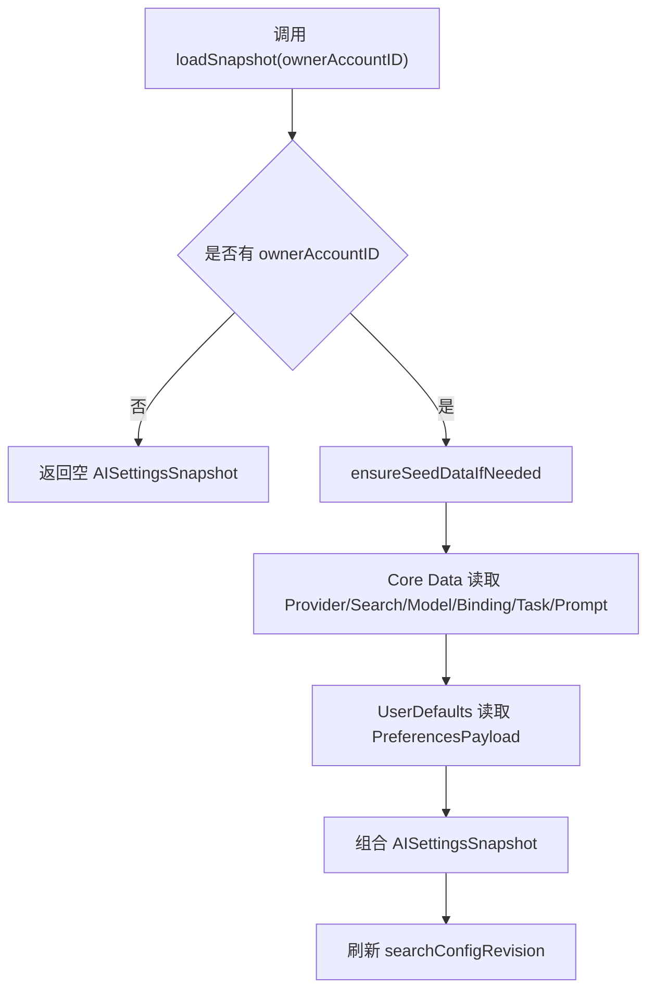
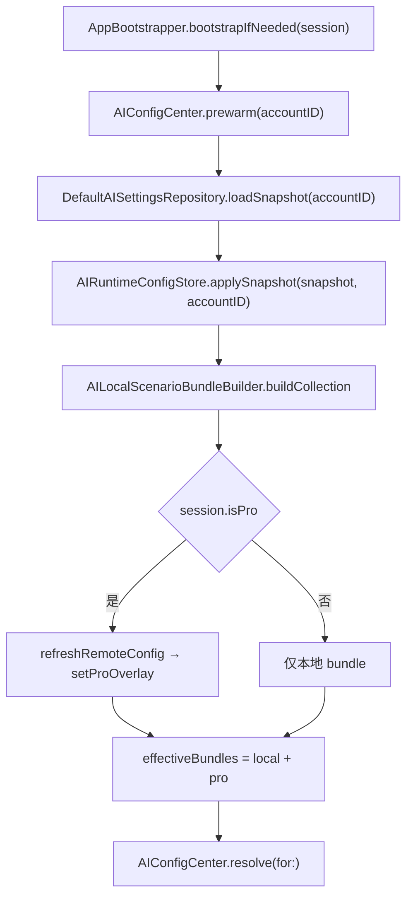
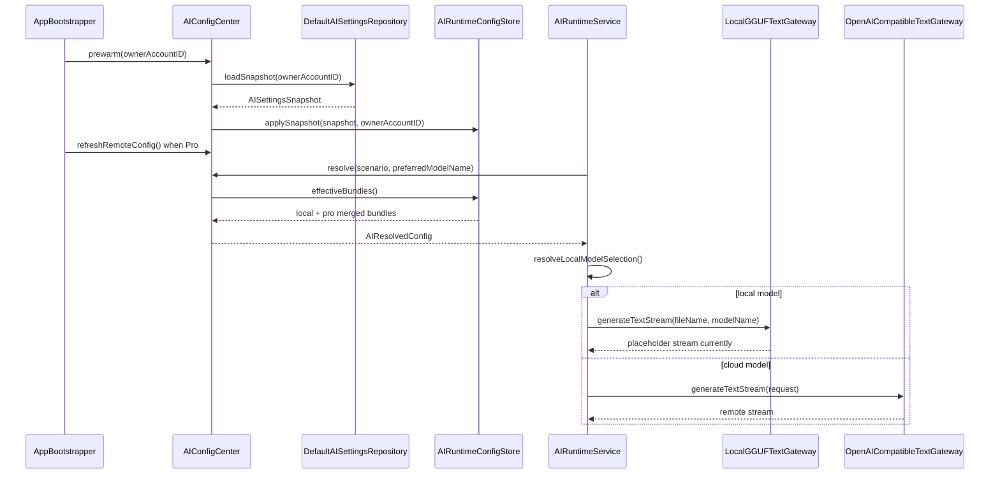

# AI 配置生命周期与本地、Pro 统一消费需求

## 一、模块目标

AI 配置生命周期与本地、Pro 统一消费模块负责把账号级 AI 目录、厂商 Key、场景模型绑定、小任务、提示词和本地模型文件组织成可恢复、可隔离、可预热的运行时配置，并将本地配置与 Pro 远端 overlay 合并为统一消费结果。当前 iOS 实现采用 SwiftUI + Core Data + UserDefaults + Application Support 文件目录的混合存储：目录类数据进入 Core Data，轻量偏好进入按账号隔离的 UserDefaults payload，`.gguf` 本地模型文件进入沙盒 Application Support/LocalModels，推理侧通过 `AIConfigCenter` 与 `AIRuntimeConfigStore` 构建内存 bundle。

该文档只描述当前已落地的 iOS 代码事实；本地 GGUF 推理执行已接入路由，但 `LocalGGUFTextGateway` 当前返回占位结果并记录“临时禁用”，因此不能视为真实端侧模型推理已完成。

## 二、AI 配置生命周期与本地、Pro 统一消费模块结构

```text
SparkClient/
├── SparkClient/Projects/Core/AI/
│   ├── AIConfigCenter.swift
│   ├── AIRuntimeConfigStore.swift
│   ├── AILocalScenarioBundleBuilder.swift
│   ├── AIRuntimeConfigAssembler.swift
│   ├── AIRuntimeStore.swift
│   ├── LocalModelService.swift
│   └── AIConfigModels.swift
├── SparkClient/Projects/Features/AISettings/
│   ├── Domain/AISettingsRepository.swift
│   ├── Domain/AISettingsSnapshot.swift
│   ├── Domain/AISettingsDomainModels.swift
│   ├── Infrastructure/DefaultAISettingsRepository.swift
│   └── Presentation/Root/AISettingsViewModel.swift
├── SparkClient/Projects/Core/AIRuntime/
│   ├── AIRuntimeService.swift
│   └── LocalGGUFTextGateway.swift
├── SparkClient/Projects/App/Sources/App/
│   ├── AppBootstrapper.swift
│   └── Architecture/AssemblyProducts.swift
└── SparkClient/Projects/App/Resources/
    ├── SparkClient.xcdatamodeld/SparkClient.xcdatamodel/contents
    └── AISettings/
```

| 职责 | 当前实现 | 说明 |
| --- | --- | --- |
| 账号级 AI 设置快照 | `AISettingsSnapshot` | 聚合模型、Key、场景绑定、小任务、提示词、搜索偏好和试用策略。 |
| 持久化仓储 | `DefaultAISettingsRepository` | Core Data 保存目录类数据，UserDefaults 保存轻量偏好。 |
| 启动预热 | `AIConfigCenter.prewarm(ownerAccountID:)` | 加载账号快照并写入 `AIRuntimeConfigStore`。 |
| 本地 bundle 构建 | `AILocalScenarioBundleBuilder` | 由 `allModels`、`apiKeys`、`scenarioBindings` 生成各场景可用模型行。 |
| 远程 overlay 合并 | `AIRuntimeConfigAssembler` | 本地模型优先，同名 Pro 模型被丢弃。 |
| 本地模型文件 | `LocalModelService` | 下载、导入、删除 `.gguf` 文件，目录为 Application Support/LocalModels。 |
| 推理路由 | `AIRuntimeService` | 根据模型目录判断本地或云端；本地路径转给 `LocalGGUFTextGateway`。 |

## 三、本地快照持久化

### 3.1 账号级 Core Data 目录持久化

#### 需求说明

AI 设置需要在不同登录账号之间隔离，避免 A 账号的厂商 Key、模型目录、场景绑定或提示词被 B 账号读取。当前实现以 `ownerAccountID` 作为 Core Data 实体和 UserDefaults payload 的隔离键。

#### 基础要求与业务规则

| 数据类别 | 存储位置 | 账号隔离 | 当前字段证据 |
| --- | --- | --- | --- |
| 厂商 Key | Core Data `AIProviderEntity` | 是 | `ownerAccountID`、`providerID`、`key`、`requestURL`。 |
| 搜索厂商 | Core Data `AISearchProviderEntity` | 是 | 仓储读写 `SearchKeys`，缺失时可从偏好迁移或种子回填。 |
| 模型目录 | Core Data `AIModelEntity` | 是 | 包含 `localFilename`、`providerID`、`baseModelName`、能力标记。 |
| 场景绑定 | Core Data `AIScenarioModelBindingEntity` | 是 | 绑定 `scenario`、`modelID`、`isDefault`、温度和 token。 |
| 小任务 | Core Data `AISmallTaskEntity` | 是 | 本地小任务参与运行时合并。 |
| 提示词库 | Core Data `PromptRepoEntity` | 是 | 与模 照。 |
| 种子初始化状态 | Core Data `AISettingsSeedStateEntity` | 是 | 记录该账号是否已执行 bundle 种子灌库。 |
| 轻量偏好 | UserDefaults `spark.ai.prefs.payload.<accountID>` | 是 | 保存 `PreferencesPayload`。 |

`DefaultAISettingsRepository.loadSnapshot(ownerAccountID:)` 在没有账号 ID 时返回空快照并记录警告，不会读取全局默认目录。该行为保护账号隔离，但也意味着未完成登录或会话恢复前，新建对话和模型校验可能失败。

#### 主流程



#### 失败、重试和恢复

| 场景 | 当前行为 | 恢复方式 |
| --- | --- | --- |
| 无账号 ID | 返回空快照，日志提示新建对话/模型校验可能失败 | 登录后以显式 `ownerAccountID` 重新加载或预热。 |
| Core Data 读取失败 | catch 后返回空快照 | 用户再次进入设置页或启动预热可重试；当前没有显式 UI 恢复入口。 |
| UserDefaults payload 缺失或损坏 | 使用 `PreferencesPayload.default` | 目录数据仍以 Core Data 为准。 |
| 搜索偏好多处选中 | `normalizeSearchProviderSelection()` 只保留优先级最高的一项 | 保存或加载时刷新 revision。 |

#### 技术细节与设计代码位置

- `SparkClient/Projects/Features/AISettings/Infrastructure/DefaultAISettingsRepository.swift`：`loadSnapshot(ownerAccountID:)`、`save(snapshot:ownerAccountID:)`、`persist(snapshot:ownerAccountID:)`、`loadSnapshotFromStore(ownerAccountID:)`。
- `SparkClient/Projects/Features/AISettings/Domain/AISettingsSnapshot.swift`：快照结构、默认值、`PreferencesPayload` 和搜索配置 revision 刷新。
- `SparkClient/Projects/Features/AISettings/Domain/AISettingsDomainModels.swift`：`AllModels.localFilename`、`isLocalModel`、`AIScenarioModelBinding`。
- `SparkClient/Projects/App/Resources/SparkClient.xcdatamodeld/SparkClient.xcdatamodel/contents`：Core Data 实体和 `ownerAccountID`、`localFilename` 字段。

#### 验收标准

1. 同一设备切换账号后，AI 设置页只能读到当前账号的模型、Key、场景绑定、小任务和提示词。
2. 未登录状态调用仓储加载时返回空快照，不从其他账号或全局默认目录回退。
3. 保存 AI 设置后，Core Data 目录数据和 UserDefaults 偏好均按当前账号写入。
4. UserDefaults payload 损坏时，设置页仍能读取 Core Data 目录并使用默认偏好恢复。

### 3.2 首次账号种子灌库

#### 需求说明

首次登录某个账号时，需要把 bundle 内置 AI 设置种子写入该账号的 Core Data。种子只在该账号未初始化时执行，之后不按版本自动重灌，避免覆盖用户本地修改。

#### 基础要求与业务规则

| 规则 | 当前实现 |
| --- | --- |
| 灌库触发 | `DefaultAISettingsRepository.loadSnapshot(ownerAccountID:)` 内调用 `ensureSeedDataIfNeeded`。 |
| 灌库内容 | `AISettingsSeedCatalog` 的模型、场景绑定、厂商 Key、搜索 Key、提示词等。 |
| 空种子保护 | `AllModels.json` 为空时跳过灌库和初始化标记，下次仍视为未初始化。 |
| 灌库完成标记 | 写入 `AISettingsSeedStateEntity`。 |
| 后续升级 | 当前注释明确“之后只读本地库，不按版本从 bundle 重灌”。 |

#### 主流程

```text
账号首次 loadSnapshot
  ↓
检查 AISettingsSeedStateEntity
  ↓
读取 AISettingsSeedCatalog
  ↓
AllModels 非空
  ↓
persist(snapshot, ownerAccountID)
  ↓
保存 PreferencesPayload
  ↓
写入种子状态
```

#### 失败、重试和恢复

种子 JSON 解码为空时不会写初始化标记，下一次 `loadSnapshot` 仍会尝试灌库。Core Data 写入失败会被上层捕获，返回空快照；当前没有面向用户的“重置 AI 种子”按钮。

#### 技术细节与设计代码位置

- `SparkClient/Projects/Features/AISettings/Infrastructure/DefaultAISettingsRepository.swift`：`ensureSeedDataIfNeeded(ownerAccountID:)`、`upsertSeedState`、`persist`。
- `SparkClient/Projects/App/Resources/AISettings/`：AI 设置种子资源目录。
- `SparkClient/Tests/AI/AISettingsAndResolverTests.swift`：`testAPIKeysSeedJSONDecodesToNonEmptyCatalog` 防止 Key 种子静默解码为空。

#### 验收标准

1. 新账号首次进入已登录态后，Core Data 出现该账号的 AI 模型目录、Key、场景绑定和提示词。
2. 已初始化账号再次启动不会用 bundle 种子覆盖用户修改。
3. `AllModels.json` 解码为空时不写入初始化完成标记。
4. 种子 Key 解码失败可被测试发现。

### 3.3 设置页草稿、保存与运行时缓存同步

#### 需求说明

设置页修改需要同时支持“草稿即时预览”和“保存后持久化”。当前实现通过 `AISettingsViewModel` 的 `snapshot` 变化监听，把草稿防抖应用到 `AIConfigCenter`，保存后写仓储并重建运行时缓存。

#### 基础要求与业务规则

| 操作 | 当前行为 |
| --- | --- |
| 设置页加载 | `load()` 使用 `AIConfigCenter.reloadLocalSnapshot(ownerAccountID:)` 或仓储读取，避免依赖会话快照顺序。 |
| 草稿变化 | `$snapshot` 防抖 300ms 后调用 `applyDraftSnapshot`，只更新内存。 |
| 保存按钮 | `save()` 刷新搜索 revision、写仓储、更新 `lastPersistedSnapshot`、重建 runtime cache。 |
| 厂商 Key 等即时保存 | `persistSnapshotNowReturningBool()` 执行同样的写入和 runtime cache 重建。 |
| 小任务刷新 | 保存后刷新 `effectiveSmallTasks`。 |

#### 主流程

```text
用户修改设置页 snapshot
  ↓
hasUnsavedChanges = true
  ↓
300ms 防抖 applyDraftSnapshot
  ↓
AIRuntimeConfigStore.applySnapshot(ownerAccountID: nil)
  ↓
用户保存
  ↓
SaveAISettingsUseCase → DefaultAISettingsRepository.save
  ↓
AIConfigCenter.rebuildRuntimeCache
```

#### 失败、重试和恢复

保存失败时 `AISettingsViewModel.errorMessage` 记录错误，`lastPersistedSnapshot` 不更新，`hasUnsavedChanges` 仍可提示用户再次保存。草稿仅更新内存，不应被视为已持久化。

#### 技术细节与设计代码位置

- `SparkClient/Projects/Features/AISettings/Presentation/Root/AISettingsViewModel.swift`：`save()`、`performPersistToRepository()`、`bindSnapshotChanges()`、`persistSnapshotNowReturningBool()`。
- `SparkClient/Projects/Core/AI/AIConfigCenter.swift`：`applyDraftSnapshot`、`rebuildRuntimeCache`、`reloadLocalSnapshot`。
- `SparkClient/Projects/Core/AI/AIRuntimeConfigStore.swift`：`applySnapshot`、`cachedSnapshotIfMatches`。

#### 验收标准

1. 修改模型或 Key 后，未保存状态能被标记。
2. 草稿变化能影响设置页预览和运行时内存，但重新加载后以持久化数据为准。
3. 保存成功后，`AIConfigCenter.currentSnapshot` 能命中新账号绑定的内存快照。
4. 保存失败时页面展示错误且不清除未保存状态。

### 3.4 本地模型文件安装、导入与删除

#### 需求说明

本地模型由两部分组成：沙盒中的 `.gguf` 文件和 Core Data 模型目录行。文件只保存文件名到 `AllModels.localFilename`，运行时再通过 `LocalModelService` 找到实际路径。

#### 基础要求与业务规则

| 能力 | 当前实现 |
| --- | --- |
| 内置目录 | `LocalModelService.builtInCatalog()` 提供 Qwen2.5 1.5B、Qwen2.5 3B、DeepSeek-R1 1.5B 等下载项。 |
| 下载模型 | `downloadModel(_:)` 使用 URLSession 下载后安装。 |
| 导入模型 | `importModel(from:)` 要求文件名以 `.gguf` 结尾。 |
| 文件目录 | Application Support 下的 `LocalModels`。 |
| 文件名冲突 | `makeUniqueFileName` 自动追加 `-1`、`-2`。 |
| 模型名生成 | 文件名规范化为 `local-<stem>`。 |
| 配置写入 | `AISettingsViewModel.upsertLocalBaseModel` 创建 `providerID=LOCAL` 的 `AllModels` 并追加 chat 场景绑定。 |
| 删除模型 | 删除文件、模型目录、基于该模型的 agent 和相关场景绑定。 |

#### 主流程

```text
下载或导入 .gguf
  ↓
LocalModelService.installModelFile
  ↓
Application Support/LocalModels 写入唯一文件
  ↓
返回 LocalModelInstalled(modelName, displayName, fileName)
  ↓
AISettingsViewModel.upsertLocalBaseModel
  ↓
追加 AllModels(providerID=LOCAL, localFilename=fileName)
  ↓
追加 chat 场景绑定
  ↓
保存快照并重建 runtime cache
```

#### 失败、重试和恢复

| 失败场景 | 当前错误 | 处理 |
| --- | --- | --- |
| 非 `.gguf` 文件 | `LocalModelServiceError.invalidGGUF` | 导入失败，不写模型目录。 |
| 文件不存在 | `fileNotFound` | 删除或推理查找时抛错。 |
| 下载 URL 非 HTTP | `unsupportedURL` | 下载前拦截。 |
| 删除文件失败 | 抛出底层 FileManager 错误 | `removeLocalModelAndPersist` 写入 `errorMessage`。 |

#### 技术细节与设计代码位置

- `SparkClient/Projects/Core/AI/LocalModelService.swift`：本地模型目录、下载、导入、删除、唯一文件名和模型名生成。
- `SparkClient/Projects/Features/AISettings/Presentation/Root/AISettingsViewModel.swift`：`installLocalModel`、`importLocalModel`、`upsertLocalBaseModel`、`removeLocalModel`。
- `SparkClient/Projects/Features/AISettings/Domain/AISettingsDomainModels.swift`：`AllModels.isLocalModel`。

#### 验收标准

1. 导入非 `.gguf` 文件必须失败，且不新增模型目录行。
2. 导入同名 `.gguf` 文件时，沙盒文件名自动去重。
3. 成功导入后，模型目录中出现 `providerID=LOCAL`、`localFilename=<file>` 的模型。
4. 删除本地模型后，文件、模型目录、基于该模型的 agent 和相关场景绑定都被清理。

### 3.5 运行时初始化与本地/Pro 合并

#### 需求说明

已登录账号进入应用后，需要把账号级 AI 设置预热成运行时可直接解析的场景 bundle。Pro 远程配置只作为内存 overlay，不写入本地持久化；本地配置在合并时优先级最高。

#### 基础要求与业务规则

| 规则 | 当前实现 |
| --- | --- |
| 预热触发 | `AppBootstrapper.bootstrapIfNeeded(for:)` 调用 `AIConfigCenter.prewarm(ownerAccountID:)`。 |
| Pro 远程配置 | `session.isPro` 时调用 `refreshRemoteConfig()`，结果写入 `proBundles` 和 `proSmallTasks`。 |
| 账号绑定 | `AIRuntimeConfigStore.applySnapshot(snapshot, ownerAccountID:)` 记录 `cachedOwnerAccountID`。 |
| 本地 bundle | 只把启用模型、启用厂商 Key、有效场景绑定组合成模型行。 |
| 本地模型 endpoint | 无厂商 Key 时，本地模型使用 `local://chat/completions`。 |
| 合并优先级 | 同名模型保留本地，Pro 同名被丢弃；默认模型依次使用有效本地默认、有效 Pro 默认、合并结果第一项。 |
| 小任务合并 | Pro 小任务先入表，本地小任务按 code 覆盖。 |

`AIRuntimeConfigAssembler.merge` 对每个 `AIScenario` 独立执行以下规则：

1. 没有 Pro bundle 时直接返回本地 bundle。
2. Pro 场景模型为空时保留本地场景包。
3. 先放入全部本地模型，再追加本地不存在的 Pro 模型。
4. 同名判断当前只使用 `AIScenarioRemoteModelRow.name`；同名 Pro 行直接丢弃，即使 Provider 或 endpoint 不同也不例外。
5. 合并后重新计算 `defaultModelName` 和所有模型行的 `isDefault`，确保最终只有一个默认标记。

#### 主流程



#### 失败、重试和恢复

启动预热中某个场景没有可用模型时，`AppBootstrapper` 捕获 `AIConfigError.missingModelForScenario` 并降级结束，不阻断整个账号引导。运行时缓存未初始化时，`AIRuntimeConfigStore.effectiveBundles()` 抛出 `runtimeNotBootstrapped`，上层应提示稍后重试或引导用户进入 AI 设置。

#### 技术细节与设计代码位置

- `SparkClient/Projects/App/Sources/App/AppBootstrapper.swift`：账号进入已登录态后的 AI 预热、Pro overlay 刷新和场景解析预检查。
- `SparkClient/Projects/App/Sources/App/Architecture/AssemblyProducts.swift`：装配 `DefaultAISettingsRepository`、`AIRuntimeStore`、`AIRuntimeConfigStore`、`LocalModelService`、`AIConfigCenter`、`LocalGGUFTextGateway`。
- `SparkClient/Projects/Core/AI/AIConfigCenter.swift`：`prewarm`、`refreshRemoteConfig`、`resolve`、`effectiveScenarioBundles`。
- `SparkClient/Projects/Core/AI/AIRuntimeConfigStore.swift`：账号绑定缓存、bundle 合并入口、小任务合并、search config 缓存。
- `SparkClient/Projects/Core/AI/AILocalScenarioBundleBuilder.swift`：本地场景 bundle 构建。
- `SparkClient/Projects/Core/AI/AIRuntimeConfigAssembler.swift`：本地与 Pro bundle 合并策略。

#### 验收标准

1. 登录后以 `UserSession.accountID` 显式预热，不依赖会话快照异步读取顺序。
2. Pro 配置刷新失败不清空本地 bundle。
3. 本地与 Pro 出现同名模型时，最终 bundle 保留本地模型。
4. 本地小任务与 Pro 小任务 code 冲突时，本地小任务生效。
5. 未完成预热时调用推理应得到明确的运行时未初始化错误。

### 3.6 本地模型推理路由

#### 需求说明

推理侧需要根据解析出的模型判断走本地 GGUF 还是云端 OpenAI-compatible 网关。当前已经完成路由判断和本地网关接入，但本地 GGUF 实际推理暂未启用。

#### 基础要求与业务规则

| 场景 | 当前行为 |
| --- | --- |
| 选择基础本地模型 | `AIRuntimeService.resolveLocalModelSelection` 根据 `localFilename` 走 `LocalGGUFTextGateway`。 |
| 选择本地 agent | 查找 `baseModelName` 对应基础模型的 `localFilename`。 |
| 本地模型无网关 | 抛出 `LocalModelServiceError.modelLoadFailed`。 |
| 本地模型 tools | 仍先做 tools 能力判断，不支持时清空 tools 降级纯文本。 |
| GGUF 执行 | `LocalGGUFTextGateway` 当前返回用户最后一条输入作为占位结果，并记录“本地 GGUF 能力已临时禁用”。 |

调用方不直接读取本地或 Pro bundle。`ScenarioPolicyResolver` 统一按以下顺序选择最终配置：

```text
preferredModelName
  > AIRuntimeStore.runtimeOverride
  > effective bundle 的默认模型
  > missingModelForScenario
```

显式 preferred model 非空但不存在时直接抛出 `missingModelForScenario`，不会静默回退；解析成功后由 `AIScenarioConfig.toResolvedConfig` 校验 endpoint，并生成带 `source` 的 `AIResolvedConfig`。

#### 主流程

```text
AIRuntimeService.generateTextStream
  ↓
AIConfigCenter.resolve(scenario, preferredModelName)
  ↓
effectiveScenarioBundles.allRows
  ↓
resolveLocalModelSelection
  ↓
命中 LOCAL + localFilename
  ↓
LocalGGUFTextGateway.generateTextStream
  ↓
当前返回占位流式结果
```

统一消费入口不重新判断 local/Pro 优先级：`AIRuntimeService.generateTextStream` 先消费 `AIConfigCenter.resolve` 和 `effectiveScenarioBundles` 的结果，再按最终模型的 `providerID`、能力字段和 `localFilename` 选择 gateway。普通模型进入 `OpenAICompatibleTextGateway`，命中本地文件的模型进入 `LocalGGUFTextGateway`；当前本地 gateway 仍是占位实现。

#### 失败、重试和恢复

本地推理真实执行未启用，因此当前不能用本地模型结果作为医疗结构化抽取、问诊或报告解释的可信输出。若业务场景需要真实 AI 结果，应选择云端模型或在启用真实 GGUF engine 后再开放本地模型入口。

#### 技术细节与设计代码位置

- `SparkClient/Projects/Core/AIRuntime/AIRuntimeService.swift`：`generateTextStream`、`resolveLocalModelSelection`、本地/云端路由。
- `SparkClient/Projects/Core/AIRuntime/LocalGGUFTextGateway.swift`：本地 GGUF 占位实现。
- `SparkClient/Projects/Core/AI/AIProviderAdapterRegistry`：`LOCAL` provider 识别为 `localGGUF`。

#### 验收标准

1. 选择本地模型时不会误走云端网关。
2. 本地 agent 能解析到基座本地模型文件。
3. 缺少 `LocalGGUFTextGateway` 时明确失败。
4. 在真实 GGUF engine 未启用前，产品验收不得把本地模型推理标记为完成。

## 四、整体业务流程



## 五、状态模型

| 状态 | 触发 | 数据位置 | 用户可见影响 |
| --- | --- | --- | --- |
| 未登录/无账号 | 仓储无法解析 `ownerAccountID` | 返回空 `AISettingsSnapshot` | 模型校验和新建对话可能失败。 |
| 首次待灌库 | 账号无 `AISettingsSeedStateEntity` | Bundle seed → Core Data | 首次进入后生成默认目录。 |
| 已持久化 | 保存成功 | Core Data + UserDefaults + LocalModels | 重启后可恢复。 |
| 草稿态 | 设置页未保存修改 | `AISettingsViewModel.snapshot` + runtime draft | 当前内存可预览，重启不保留。 |
| 已预热 | `prewarm` 成功 | `AIRuntimeConfigStore` | 推理侧可解析场景模型。 |
| Pro overlay 已加载 | `refreshRemoteConfig` 成功 | `AIRuntimeConfigStore.proBundles` | 仅内存增强，不覆盖本地库。 |
| Runtime 未初始化 | 未执行或重置 runtime cache | `localBundles=nil` | 推理抛 `runtimeNotBootstrapped`。 |
| 本地推理占位 | 选择 LOCAL 模型 | `LocalGGUFTextGateway` | 返回占位文本，不能作为真实推理能力。 |

## 六、数据与持久化

| 数据 | 类型 | 持久化 | 清理责任 |
| --- | --- | --- | --- |
| `AISettingsSnapshot.allModels` | 账号模型目录 | Core Data `AIModelEntity` | 设置页删除模型或账号数据清理。 |
| `AllModels.localFilename` | 本地模型文件名 | Core Data 字段 | 删除本地模型时同步删除文件。 |
| `.gguf` 文件 | 模型二进制 | Application Support/LocalModels | `LocalModelService.deleteModel`。 |
| `apiKeys` | 厂商认证信息 | Core Data `AIProviderEntity` | 账号级隔离；当前未见 Keychain 存储。 |
| `scenarioBindings` | 场景到模型绑定 | Core Data `AIScenarioModelBindingEntity` | 删除模型时清理关联绑定。 |
| `smallTasks` | 小任务 | Core Data `AISmallTaskEntity` | 本地小任务保存/删除入口。 |
| `promptRepo` | 提示词库 | Core Data `PromptRepoEntity` | 仓储整包替换。 |
| `PreferencesPayload` | 搜索、试用、来源选择等轻量偏好 | UserDefaults 按账号 key | 仓储保存覆盖。 |
| Pro bundles | 远程配置 overlay | 仅内存 | `clearProOverlay` 或 runtime reset。 |
| runtime overrides | 调试覆盖 | 仅内存 | `AIRuntimeStore.clearAll`。 |

### 6.1 本地存储数据模型

#### 6.1.1 `AISettingsSnapshot` 账号配置聚合

`AISettingsSnapshot` 是本地设置页、仓储和运行时预热之间的聚合对象。目录数据进入 Core Data；轻量偏好通过 `PreferencesPayload` 进入账号级 UserDefaults。

| 字段 | 类型 | 存储/用途 | 规则 |
| --- | --- | --- | --- |
| `allModels` | `[AllModels]` | Core Data `AIModelEntity` | 模型目录；运行时只使用启用且有场景绑定的模型。 |
| `scenarioBindings` | `[AIScenarioModelBinding]` | `AIScenarioModelBindingEntity` | 场景与模型的显式关系。 |
| `apiKeys` | `[APIKeys]` | `AIProviderEntity` | 厂商请求地址、Key 和启用状态。 |
| `smallTasks` | `[SmallTask]` | `AISmallTaskEntity` | 本地任务与 Agent 关联任务。 |
| `searchToolPreferences` | `AISearchToolPreferences` | UserDefaults | 知识库、联网搜索、双语搜索及数量偏好。 |
| `searchConfigRevision` | `SearchRuntimeConfigRevision` | UserDefaults | 搜索配置本地 revision 和 hash。 |
| `scenarioModelSources` | `[String: AIModelSelectionSource]` | UserDefaults | 场景使用 `localKey` 或 `trial` 策略。 |
| `trialChatPickerDisabledModelNames` | `[String]` | UserDefaults | 试用模型输入栏隐藏列表。 |
| `trial` | `AITrialState` | UserDefaults | 试用状态、起止时间和剩余秒数。 |
| `trialModelPolicy` | `[AITrialModelPolicyItem]` | UserDefaults | 试用期按场景提供的模型策略。 |
| `searchKeys` | `[SearchKeys]` | Core Data/兼容迁移到 UserDefaults | 搜索厂商及其鉴权配置。 |
| `toolKeys` | `[ToolKeys]` | UserDefaults | 工具服务 Key 配置。 |
| `promptRepo` | `[PromptRepo]` | `PromptRepoEntity` | 系统/自定义提示词库。 |
| `memoryArchive` | `[MemoryArchive]` | UserDefaults | 轻量记忆归档偏好/数据。 |
| `translationDic` | `[TranslationDic]` | UserDefaults | 本地翻译字典。 |

#### 6.1.2 厂商 Key `APIKeys` / `AIProviderEntity`

| 字段 | Swift 类型 | Core Data 字段 | 说明 |
| --- | --- | --- | --- |
| `id` | `UUID` | `id` | 厂商记录主键。 |
| `providerID` | `String` | `providerID` | 规范化后的稳定匹配键，通常由 company 推导并大写。 |
| `name` | `String` | `name` | 设置页展示名称。 |
| `company` | `String` | `company` | 厂商名称。 |
| `key` | `String` | `key` | API Key；当前代码未见 Keychain 存储。 |
| `requestURL` | `String` | `requestURL` | OpenAI-compatible 请求地址。 |
| `help` | `String` | `help` | 设置页帮助说明。 |
| `from` | `String` | `from` | 兼容来源字段。 |
| `privacyPolicyURL` | `String` | `privacyPolicyURL` | 隐私政策地址。 |
| `isEnabled` | `Bool` | `isEnabled` | 是否参与本地 bundle；`isHidden` 是其反向计算属性。 |
| `source` | `AIRecordSource` | `source` | `system`、`custom` 或 `pro`。 |
| `privacyPolicyAccepted` | `Bool` | `privacyPolicyAccepted` | 用户是否同意隐私政策。 |
| `privacyPolicyAcceptedAt` | `Date?` | `privacyPolicyAcceptedAt` | 同意时间。 |
| `timestamp` | `Date` | `timestamp` | 创建/更新时间。 |
| `ownerAccountID` | `Int64` | `ownerAccountID` | Core Data 账号隔离字段，属于实体层字段而非 `APIKeys` 值对象字段。 |

#### 6.1.3 模型目录 `AllModels` / `AIModelEntity`

| 字段 | Swift 类型 | Core Data 字段 | 说明 |
| --- | --- | --- | --- |
| `id` | `UUID` | `id` | 模型目录主键。 |
| `name` | `String` | `name` | 运行时和服务端识别的模型名，也是 Pro 合并当前使用的同名判重键。 |
| `displayName` | `String` | `displayName` | UI 展示名。 |
| `identity` | `AIModelIdentity` | `identity` | `model` 或 `agent`。 |
| `position` | `Int` | `position` | 目录排序。 |
| `providerID` | `String` | `providerID` | 与 `APIKeys.providerID` 关联；LOCAL 表示本地模型。 |
| `company` | `String` | `company` | 厂商展示名。 |
| `price` | `Int` | `price` | 价格等级，计算属性 `priceTier` 同义。 |
| `isEnabled` | `Bool` | `isEnabled` | 是否允许参与场景 bundle。 |
| `supportsSearch` | `Bool` | `supportsSearch` | 是否支持搜索能力。 |
| `supportsTextGen` | `Bool` | `supportsTextGen` | 是否支持文本生成，计算属性 `supportsText` 同义。 |
| `supportsMultimodal` | `Bool` | `supportsMultimodal` | 是否支持多模态输入。 |
| `supportsReasoning` | `Bool` | `supportsReasoning` | 是否支持推理。 |
| `supportReasoningChange` | `Bool` | `supportReasoningChange` | 是否可控制推理强度，计算属性 `reasoningControllable` 同义。 |
| `supportsImageGen` | `Bool` | `supportsImageGen` | 是否支持图像生成。 |
| `supportsVoiceGen` | `Bool` | `supportsVoiceGen` | 是否支持语音生成。 |
| `supportsToolUse` | `Bool` | `supportsToolUse` | 是否支持工具调用。 |
| `systemProvision` | `String` | `systemProvision` | 系统提示词/模型系统配置，计算属性 `systemPrompt` 可转为空值。 |
| `icon` | `String` | `icon` | 图标名或资源标识。 |
| `briefDescription` | `String` | `briefDescription` | 简短说明。 |
| `characterDesign` | `String` | `characterDesign` | Agent 角色设计信息。 |
| `aiToolScenarios` | `[String]` | `aiToolScenariosData` | 允许的工具场景，二进制编码保存；空数组有“默认全选”语义。 |
| `relatedTaskCodes` | `[String]` | `relatedTaskCodesData` | Agent 关联的小任务 code。 |
| `baseModelName` | `String?` | `baseModelName` | Agent 使用的基础模型名。 |
| `localFilename` | `String?` | `localFilename` | 本地 `.gguf` 文件名；不保存完整绝对路径。 |
| `source` | `AIRecordSource` | `source` | `system`、`custom` 或 `pro`。 |
| `timestamp` | `Date` | `timestamp` | 创建/更新时间。 |
| `ownerAccountID` | `Int64` | `ownerAccountID` | 账号隔离字段。 |

#### 6.1.4 场景绑定 `AIScenarioModelBinding` / `AIScenarioModelBindingEntity`

| 字段 | Swift 类型 | Core Data 字段 | 说明 |
| --- | --- | --- | --- |
| `id` | `UUID` | `id` | 绑定主键。 |
| `ownerAccountID` | `Int64` | `ownerAccountID` | 账号隔离字段。 |
| `scenario` | `String` | `scenario` | `AIScenario.rawValue`。 |
| `identity` | `AIModelIdentity` | `identity` | 绑定的是基础模型还是 Agent。 |
| `modelID` | `UUID` | `modelID` | 指向 `AllModels.id`。 |
| `temperature` | `Double` | `temperature` | 场景采样温度，默认值为 `0.68`。 |
| `maxTokens` | `Int` | `maxTokens` | 场景最大 token，默认值为 `12800`。 |
| `position` | `Int` | `position` | 场景候选排序。 |
| `isDefault` | `Bool` | `isDefault` | 场景默认候选标记。 |
| `isActive` | `Bool` | `isActive` | 是否参与 bundle 构建。 |
| `systemProvision` | `String` | `systemProvision` | 场景级系统提示词。 |
| `briefDescription` | `String` | `briefDescription` | 场景级说明。 |
| `aiToolScenarios` | `[String]` | `aiToolScenariosData` | 场景允许的工具列表。 |
| `relatedTaskCodes` | `[String]` | `relatedTaskCodesData` | 场景关联的小任务 code。 |
| `createdAt` | `Date` | `createdAt` | 创建时间。 |
| `updatedAt` | `Date` | `updatedAt` | 更新时间。 |

#### 6.1.5 本地小任务 `SmallTask` / `AISmallTaskEntity`

| 字段 | Swift 类型 | Core Data 字段 | 说明 |
| --- | --- | --- | --- |
| `id` | `Int` | `id` | 本地/服务端任务主键；本地新增按最大本地 ID 加一。 |
| `name` | `String` | `name` | 任务名称。 |
| `code` | `String` | `code` | 统一覆盖和路由键；本地与 Pro 同 code 时本地优先。 |
| `brief` | `String` | `brief` | 任务简介。 |
| `prompt` | `String` | `prompt` | 完整任务规则或 Prompt。 |
| `icon` | `String` | `icon` | 图标名称或 URL。 |
| `toolList` | `[String]` | `toolListData` | 任务调用的工具列表。 |
| `source` | `TaskSource` | `source` | `Local` 或 `Service`。 |
| `ownerAccountID` | `Int64` | `ownerAccountID` | 账号隔离字段。 |
| `timestamp` | `Date` | `timestamp` | 创建/更新时间。 |

#### 6.1.6 轻量偏好 `PreferencesPayload`

| 字段 | 类型 | 说明 |
| --- | --- | --- |
| `searchToolPreferences` | `AISearchToolPreferences` | `useKnowledge`、`knowledgeCount`、`knowledgeSimilarity`、`useSearch`、`bilingualSearch`、`searchCount`。 |
| `searchConfigRevision` | `SearchRuntimeConfigRevision` | schema version、local revision、更新时间、active search key 和 preferences hash。 |
| `scenarioModelSources` | `[String: AIModelSelectionSource]` | 场景到模型选择来源。 |
| `trialChatPickerDisabledModelNames` | `[String]` | 隐藏的试用模型名。 |
| `trial` | `AITrialState` | status、isActive、grantSource、startedAt、expiresAt、remainingSeconds。 |
| `trialModelPolicy` | `[AITrialModelPolicyItem]` | 场景、`AIScenarioConfig` 和 isDefault。 |
| `searchKeys` | `[SearchKeys]` | 搜索厂商兼容迁移载荷。 |
| `toolKeys` | `[ToolKeys]` | 工具 Key 配置。 |
| `memoryArchive` | `[MemoryArchive]` | 记忆归档偏好/数据。 |
| `translationDic` | `[TranslationDic]` | 翻译字典。 |

### 6.2 Pro 远端数据模型

Pro 数据只作为远程 bootstrap/patch 的内存 overlay，不直接写入本地 Core Data。网络层将服务端响应映射为以下客户端模型。

#### 6.2.1 `AIRemoteSettingsPatch`

| 字段 | 类型 | 说明 |
| --- | --- | --- |
| `revision` | `String?` | Pro 配置版本；当前只保存在 `AIRuntimeConfigStore.proRevision`。 |
| `scenarioRemoteBundles` | `AIScenarioRemoteBundlesCollection?` | Pro 专属场景模型集合；可为空。 |
| `smallTasks` | `[SmallTask]` | 服务端小任务，装载时只保留 `source == .service`。 |

#### 6.2.2 `AIScenarioRemoteModelRow`

| 字段 | 类型 | 消费意义 |
| --- | --- | --- |
| `name` | `String` | 模型唯一消费名和当前合并判重键。 |
| `displayName` | `String` | 展示标题。 |
| `identity` | `String` | `model`/`agent`。 |
| `providerID` | `String` | Provider 归属，进入 adapter 选择。 |
| `company` | `String` | Provider 展示名。 |
| `endpoint` | `String` | 原始请求地址；本地模型可为 `local://chat/completions`。 |
| `apiKey` | `String?` | 可选调用密钥。 |
| `supportsSearch` | `Bool` | 搜索能力。 |
| `supportsMultimodal` | `Bool` | 多模态能力。 |
| `supportsReasoning` | `Bool` | 推理能力。 |
| `supportsToolUse` | `Bool` | 工具调用能力。 |
| `supportsVoiceGen` | `Bool` | 语音生成能力。 |
| `supportsImageGen` | `Bool` | 图像生成能力。 |
| `supportsText` | `Bool` | 文本生成能力。 |
| `supportsDeepReasoning` | `Bool` | 深度推理能力。 |
| `reasoningControllable` | `Bool` | 推理强度是否可控。 |
| `priceTier` | `Int` | 价格等级。 |
| `systemProvision` | `String?` | 系统提示词/模型系统配置。 |
| `icon` | `String?` | 图标。 |
| `briefDescription` | `String?` | 简短描述。 |
| `source` | `String` | `system`、`custom` 或 `pro`，映射为 `AIConfigSource`。 |
| `aiScenarios` | `[String]` | 模型支持的场景声明。 |
| `aiToolScenarios` | `[String]` | 模型允许的工具场景。 |
| `relatedTaskCodes` | `[String]` | 关联小任务 code。 |
| `isDefault` | `Bool` | 场景候选默认标记；合并后会被重新归一化。 |
| `temperature` | `Double` | 场景默认温度。 |
| `maxTokens` | `Int` | 场景默认最大 token。 |
| `baseModelName` | `String?` | Agent 对应基础模型名。 |
| `localFilename` | `String?` | 本地模型文件名；Pro 行通常为空。 |

#### 6.2.3 `AIScenarioRemoteBundle` 与集合

| 模型 | 字段 | 说明 |
| --- | --- | --- |
| `AIScenarioRemoteBundle` | `defaultModelName: String` | 当前场景默认模型名。 |
| `AIScenarioRemoteBundle` | `models: [AIScenarioRemoteModelRow]` | 当前场景候选模型行。 |
| `AIScenarioRemoteBundlesCollection` | 18 个场景 bundle 字段 | `chat`、`embedding`、`voice`、医疗抽取类 8 项、优化类 2 项、`contextFolding`、`router`、`modelConfig`、`reportInterpretation`、`nutritionIntakeExtraction`。 |

`AIScenarioRemoteBundle.resolveRow(preferredModelName:)` 的 bundle 内部选择顺序是：命中 preferred model → 命中 `defaultModelName` → 命中 `isDefault` → 第一行 → 空列表返回 nil。

### 6.3 通用消费模型

#### 6.3.1 原始配置 `AIScenarioConfig`

| 字段 | 类型 | 来源 | 消费阶段 |
| --- | --- | --- | --- |
| `endpoint` | `String` | 模型行或 runtime override | 转换为 URL 前的原始地址。 |
| `model` | `String` | 模型名 | gateway 请求模型标识。 |
| `apiKey` | `String?` | Provider 或远端模型行 | 云端鉴权；为空时交给统一代理/网关。 |
| `temperature` | `Double` | 绑定/模型行/override | 采样温度。 |
| `maxTokens` | `Int` | 绑定/模型行/override | 最大回复 token。 |

#### 6.3.2 已解析配置 `AIResolvedConfig`

| 字段 | 类型 | 说明 |
| --- | --- | --- |
| `endpoint` | `URL` | 已通过 scheme 校验的请求地址。 |
| `model` | `String` | 最终选中的模型名。 |
| `apiKey` | `String?` | 最终调用密钥。 |
| `temperature` | `Double` | 最终温度。 |
| `maxTokens` | `Int` | 最终 token 上限。 |
| `source` | `AIConfigSource` | `localCatalog`、`proOverlay`、`runtimeOverride`、`trialPolicy` 等来源。 |

#### 6.3.3 Provider 适配模型 `AIProviderAdapter`

| 字段 | 类型 | 说明 |
| --- | --- | --- |
| `providerID` | `String` | 规范化后的 Provider 标识。 |
| `displayName` | `String` | Provider 展示名称。 |
| `apiStyle` | `AIProviderAPIStyle` | `openAICompatible` 或 `localGGUF`。 |
| `isLocal` | `Bool` | `apiStyle == .localGGUF` 的计算属性；LOCAL Provider 由 Registry 识别为本地。 |

#### 6.3.4 通用请求 `AIRuntimeTextRequest`

| 字段 | 类型 | 说明 |
| --- | --- | --- |
| `scenario` | `AIScenario` | 统一消费场景。 |
| `messages` | `[AIRuntimeMessage]` | 消息序列；每条消息含 role、content/contentParts、toolCalls、toolCallID、name、reasoningContent。 |
| `tools` | `[AIRuntimeToolDefinition]` | 可用工具定义。 |
| `toolChoice` | `AIRuntimeToolChoice` | 工具调用策略。 |
| `reasoning` | `AIRuntimeReasoningOptions` | 是否推理、effortTier、是否使用 Prompt fallback。 |
| `preferredModelName` | `String?` | 显式模型选择，优先于默认。 |
| `providerCompanyUppercased` | `String?` | 调用方提供的 Provider 兼容字段；最终会与模型目录 Provider 合并。 |
| `temperature` | `Double?` | 线程级温度覆盖。 |
| `topP` | `Double?` | 线程级 top-p 覆盖。 |
| `maxTokens` | `Int?` | 线程级最大回复长度覆盖。 |
| `cancellationToken` | `AIRuntimeCancellationToken?` | 协作式取消。 |

#### 6.3.5 通用消息 `AIRuntimeMessage`

| 字段 | 类型 | 说明 |
| --- | --- | --- |
| `role` | `AIRuntimeRole` | `system`、`user`、`assistant` 或 `tool`。 |
| `content` | `String?` | 纯文本内容。 |
| `contentParts` | `[AIRuntimeContentPart]?` | 多模态内容片段；文本和 `image_url` 可并存。 |
| `toolCalls` | `[AIRuntimeToolCall]?` | Assistant 发出的工具调用。 |
| `toolCallID` | `String?` | Tool 返回对应的调用 ID。 |
| `name` | `String?` | 工具/函数名称。 |
| `reasoningContent` | `String?` | 思考模式回传内容，兼容部分模型的 reasoning content。 |

#### 6.3.6 通用响应与流事件

| 模型 | 字段/事件 | 说明 |
| --- | --- | --- |
| `AIRuntimeTextResponse` | `text` | 最终回复文本。 |
| `AIRuntimeTextResponse` | `reasoningText` | 可选推理文本。 |
| `AIRuntimeTextResponse` | `model` | 实际使用模型。 |
| `AIRuntimeTextResponse` | `promptTokens` / `completionTokens` | Token 消耗，可为空。 |
| `AIRuntimeTextResponse` | `toolCalls` | 最终工具调用列表。 |
| `AIRuntimeTextResponse` | `finishReason` | `stop`、`tool_call`、`length` 等。 |
| `AIRuntimeStreamEvent` | `textDelta(String)` | 文本增量。 |
| `AIRuntimeStreamEvent` | `reasoningDelta(String)` | 推理增量。 |
| `AIRuntimeStreamEvent` | `toolCallDelta(AIRuntimeToolCallDelta)` | 工具调用增量。 |
| `AIRuntimeStreamEvent` | `completed(AIRuntimeTextResponse)` | 完成事件。 |

### 6.4 统一消费场景

所有场景统一使用 `AIScenario` → `AIScenarioRemoteBundle` → `ScenarioPolicyResolver` → `AIResolvedConfig` → gateway 的消费链路。场景定义来自 `AIScenario.swift`；以下是当前 19 个枚举场景的业务边界。

| 场景 rawValue | 业务用途 | 典型输入 | 期望输出/消费方式 | 当前 bundle 状态 |
| --- | --- | --- | --- | --- |
| `chat` | 通用对话 | 文本、多模态消息、工具 | 流式文本/工具调用 | 独立 bundle |
| `embedding` | 知识库向量化/检索 | 文本分块 | 向量结果；当前通用文本消费入口之外的 embedding gateway 未在本文代码中确认 | 独立 bundle，可为空 |
| `voice` | TTS/语音生成 | 文本 | 音频结果；具体音频 gateway 未在本文代码中确认 | 独立 bundle |
| `medical_structured_extraction` | 通用医疗文档结构化 | 医疗文档文本/图像 | 结构化 JSON/领域 DTO | 独立 bundle |
| `medical_document_type_recognition` | 文档类型识别 | 文档内容/图像 | 病例、体检、报告、处方、用药等类型 | 独立 bundle |
| `medical_case_extraction` | 病例结构化抽取 | 病例文本/附件 | 病例结构化数据 | 独立 bundle |
| `health_exam_extraction` | 体检报告抽取 | 体检报告 | 指标和异常结构化数据 | 独立 bundle |
| `medical_report_extraction` | 医疗报告抽取 | 医疗报告 | 报告结构化数据 | 独立 bundle |
| `prescription_extraction` | 处方抽取 | 处方图像/文本 | 药品、剂量、频次等结构化数据 | 独立 bundle |
| `medication_extraction` | 用药计划抽取 | 用药记录/医嘱 | 用药计划结构化数据 | 独立 bundle |
| `medicine_box_extraction` | 药盒/药箱识别 | 药盒标签图像 | 药品识别和字段化结果 | 独立 bundle |
| `optimization_text` | 文本优化 | 原始文本和优化要求 | 润色、改写、纠错、摘要文本 | 独立 bundle |
| `optimization_visual` | 视觉内容优化 | 图像/视觉描述 | 视觉相关优化文本或结果 | 独立 bundle |
| `context_folding` | 长上下文折叠 | 历史消息/上下文 | 压缩后的上下文 | 独立 bundle |
| `router` | 模型/策略路由 | 场景、请求特征、候选模型 | 路由决策或模型选择 | 独立 bundle |
| `model_config` | 模型配置管理/解析 | 模型元数据或配置请求 | 模型配置结果 | 独立 bundle |
| `report_interpretation` | 报告解读 | 医疗报告和用户问题 | 解释、风险提示、建议文本 | 独立 bundle |
| `nutrition_intake_extraction` | 营养摄入抽取 | 食物描述/饮食记录 | 营养草稿 JSON | 独立 bundle，可为空 |
| `medical_exam_plan_generation` | 体检计划生成 | 用户健康信息/目标 | 体检计划 | 当前没有独立 bundle 字段；`AIScenarioRemoteBundlesCollection.setBundle` 将其映射到 `reportInterpretation`，`AILocalScenarioBundleBuilder` 未发现独立构建分支，属于当前实现缺口 |

#### 统一场景消费规则

1. 业务侧只传 `scenario` 和通用 `AIRuntimeTextRequest`，不传本地 Core Data 对象。
2. 配置中心先取本地 bundle，再与 Pro overlay 合并。
3. `preferredModelName`、runtime override、bundle 默认模型按固定优先级解析。
4. `AIRuntimeService` 根据最终模型行的 `providerID`、能力字段和 `localFilename` 选择 gateway。
5. 不支持 tools 的模型会在统一消费入口降级为纯文本请求。
6. 结构化场景的 JSON/schema 校验和领域 DTO 映射不属于当前配置模块；当前代码证据不足的具体业务 DTO 不在本模型中虚构。

### 6.5 字段一致性与版本边界

- 本地 `AllModels` 与 Pro `AIScenarioRemoteModelRow` 字段不是一一相同：Pro 行增加 `endpoint`、`apiKey`、`aiScenarios`、`isDefault`、场景参数等运行时字段；本地模型通过 `providerID`、绑定和 Provider Key 组装这些字段。
- `AIScenarioRemoteBundle` 是本地和 Pro 的共同中间模型；合并后仍使用同一 `AIScenarioRemoteModelRow` 类型，统一消费无需区分来源结构。
- `AIScenarioConfig` 是可持久化/可传输的原始请求配置；`AIResolvedConfig` 是 endpoint 已校验并带来源的运行时配置。
- `SmallTask` 同时承载本地和 Pro 任务，通过 `source` 和 `code` 完成来源过滤与覆盖。
- `medicalExamPlanGeneration` 已存在于场景枚举，但当前 bundle 结构未单独承载，后续若服务端独立下发该场景，需要增加 collection 字段、builder 分支、解码映射、合并测试和消费验收。

### 6.6 SparkService 后端接口交互

#### 6.6.1 接口总览

| 接口 | 方法 | 客户端入口 | 鉴权 | 作用 | 是否写本地 AI 目录 |
| --- | --- | --- | --- | --- | --- |
| `/api/v1/ai/config/bootstrap/` | `GET` | `SparkAIConfigAPI.fetchBootstrapPatch` | 必须登录 | 获取 Pro 场景模型、小任务和 revision | 否，仅进入内存 overlay |
| `/api/v1/ai/trial/status/` | `GET` | `SparkAIConfigAPI.fetchTrialStatus` | 必须登录 | 查询试用状态、有效期和剩余秒数 | 否，写入 UserDefaults 偏好 |
| `/api/v1/ai/trial/apply/` | `POST` | `SparkAIConfigAPI.applyTrial` | 必须登录 | 提交试用申请 | 否 |
| `/api/v1/ai/providers/test-connection/` | `POST` | `SparkAIConfigAPI.testProviderConnection` | 必须登录 | 用指定 URL、Key、模型发送 ping 请求 | 否 |

SparkService 路由由 `SparkService/SparkService/urls.py` 挂载 `ai_config.urls`，AI 配置路由由 `SparkService/ai_config/urls.py` 定义。服务端接口统一返回：

```json
{
  "code": 0,
  "msg": "ok",
  "data": {}
}
```

客户端使用 `APIResponseDecoder.decodeWrappedData` 读取 `data`；HTTP 状态和 wrapped `code` 都属于请求成功判断的一部分。

#### 6.6.2 Pro bootstrap 请求

客户端请求：

```http
GET /api/v1/ai/config/bootstrap/?platform=ios&client_version=<CFBundleShortVersionString>
Authorization: Bearer <access_token>
```

`client_version` 为空时不发送。`SparkAIConfigAPI` 当前网络策略为：

| 配置 | 当前实现 |
| --- | --- |
| `requiresAuth` | `true`，对应服务端 `IsAuthenticated`。 |
| HTTP 缓存 | 允许 ETag，`etagTTL=60` 秒。 |
| 幂等性 | `GET` 标记为幂等。 |
| 重试 | 使用网络层默认 retry config。 |
| 串行键 | `ai.config.bootstrap`，避免同一配置并发刷新。 |
| 优先级 | 普通 `normal`。 |

服务端 `AIBootstrapConfigView.get` 的组装顺序为：

```text
认证用户
  ↓
TrialService.is_pro_user(user)
  ↓
非 Pro：空 scenarios + trial_status/trial_message
Pro：读取启用 API Provider
  ↓
按 company 建 Provider 索引
  ↓
遍历 DEFAULT_SCENARIOS
  ↓
读取 active AIScenarioModelBinding，按 position/id 排序
  ↓
关联 AIModelCatalog、Provider、TrialModelPolicyItem
  ↓
收集关联 SmallTask
  ↓
计算 revision
  ↓
返回 wrapped data
```

#### 6.6.3 Bootstrap 响应模型

非 Pro 或试用不可用时，SparkService 当前返回：

```json
{
  "revision": "2026-07-20T12:00:00+00:00",
  "scenarios": {},
  "smallTasks": [],
  "trial_status": "none",
  "trial_message": "当前账号无试用记录，暂无 Pro 场景配置；请先在应用内申请试用。"
}
```

Pro 用户返回：

```json
{
  "revision": "2026-07-20T12:00:00+00:00",
  "scenarios": {
    "chat": {
      "default_model": "spark-chat",
      "models": []
    }
  },
  "smallTasks": []
}
```

客户端映射关系如下：

| SparkService JSON | iOS 类型/字段 | 处理规则 |
| --- | --- | --- |
| `revision` | `AIRemoteSettingsPatch.revision` | 写入 `AIRuntimeConfigStore.proRevision`，当前不落库。 |
| `scenarios` | `RemoteScenarioCollection` → `AIScenarioRemoteBundlesCollection` | 缺失场景用空 bundle 补齐，再统一标记 source 为 `pro`。 |
| `default_model` | `AIScenarioRemoteBundle.defaultModelName` | `CodableKey` 兼容服务端 snake_case。 |
| `models` | `[AIScenarioRemoteModelRow]` | 空数组表示该 Pro 场景不提供模型，本地 bundle 保留。 |
| `display_name` | `displayName` | 服务端 binding display_name 优先，空时回退模型目录 display_name。 |
| `api_key` | `apiKey` | 服务端 Provider Key 映射；客户端不把它写入本地 Core Data。 |
| `is_default` | `isDefault` | 合并时会重新归一化。 |
| `max_tokens` | `maxTokens` | 场景最大 token。 |
| `supports_*` | 对应能力 Bool | 服务端字段经 Swift `CodingKeys` 映射。 |
| `systemProvision`、`briefDescription`、`aiScenarios`、`aiToolScenarios`、`relatedTaskCodes` | 同名 Swift 字段 | 当前服务端按 camelCase 输出，客户端按同名读取。 |
| `smallTasks` | `[SmallTask]` | `tool_list` 映射到 `toolList`；只保留服务端任务。 |
| `trial_status`、`trial_message` | 当前 `RemoteAIBootstrapPayload` 未建模 | iOS 当前会忽略这两个 bootstrap 字段；试用状态应通过独立 `/trial/status/` 获取。 |

#### 6.6.4 SparkService 服务端数据来源

| 服务端模型 | 接口用途 | 关键字段/规则 |
| --- | --- | --- |
| `AIProviderKeyConfig` | 提供模型 endpoint 和 api_key | 只读取 `kind=api`、`is_active=true`；按 `is_using`、position、company、name 选优。 |
| `AIModelCatalog` | 提供模型展示和能力字段 | name、display_name、company、能力 Bool、price_tier、icon、related_task_codes、is_active。 |
| `AIScenarioModelBinding` | 生成场景模型行 | 只读取 `is_active=true`；按 scenario、position、id 排序；每场景维护默认行。 |
| `TrialModelPolicyItem` | 试用期间覆盖场景展示字段 | 按 `(scenario, model_id)` 查找；覆盖 system_provision、brief_description、ai_tool_scenarios、related_task_codes。 |
| `SmallTask` | 返回服务端小任务 | 读取 `source=Service` 且 `is_deleted=false`；当前代码未启用 related_task_codes 过滤，返回全部服务任务。 |
| `TrialApplication`/`TrialService` | 判断 Pro 和非 Pro状态 | 非 Pro 返回空场景；状态变更由独立试用接口负责。 |

Agent 行的服务端特殊规则：`AIScenarioModelBinding.identity == agent` 时，`name` 不是基础模型名，而是 `agent-<binding_pk>-<model_pk>-<model.name>`；`baseModelName` 为基础模型名，`display_name` 优先取绑定行。这保证同一基础模型下多个 Agent 在同一场景中拥有不同消费名。

#### 6.6.5 试用状态与申请接口

试用状态请求：

```http
GET /api/v1/ai/trial/status/
Authorization: Bearer <access_token>
```

响应字段映射：

| 服务端字段 | iOS `AITrialState` | 说明 |
| --- | --- | --- |
| `status` | `status` | `none`、`pending`、`active`、`expired` 等。 |
| `is_active` | `isActive` | 当前是否有效。 |
| `grant_source` | `grantSource` | 自动、手动或活动来源。 |
| `started_at` | `startedAt` | ISO8601 时间。 |
| `expires_at` | `expiresAt` | ISO8601 时间。 |
| `remaining_seconds` | `remainingSeconds` | 服务端计算的剩余秒数。 |
| `note` | 当前 iOS 模型未保存 | 服务端备注字段目前未进入 `AITrialState`。 |

试用申请请求：

```http
POST /api/v1/ai/trial/apply/
Content-Type: application/json
Authorization: Bearer <access_token>

{"note": "need trial for evaluation"}
```

成功 data 字段为 `submitted`、`application_id`、`sequence`、`status`、`message`；客户端将 `application_id` 映射为 `applicationId`。服务端异常时当前仍可能返回 HTTP 200，但 wrapped `code=-1`、`submitted=false`，因此客户端不能只依赖 HTTP status 判断申请成功。

#### 6.6.6 Provider 连通性测试接口

请求：

```http
POST /api/v1/ai/providers/test-connection/
Content-Type: application/json
Authorization: Bearer <access_token>

{
  "request_url": "https://provider.example/v1/chat/completions",
  "api_key": "<provider-key>",
  "model": "spark-chat-default"
}
```

SparkService 会先校验 URL、Key，再使用 `POST`、Bearer Key、`ping` 用户消息、`max_tokens=4`、`temperature=0` 请求 Provider，超时为 8 秒。响应 data 为：

| 字段 | 类型 | 说明 |
| --- | --- | --- |
| `reachable` | `Bool` | Provider 是否返回 2xx。 |
| `message` | `String?` | `ok`、`request_url_required`、`api_key_required`、`invalid_request_url`、`http_<status>` 或 `network_error`。 |

该接口只负责连通性探测，不保存 Provider Key，不改变 Core Data 的 `AIProviderEntity`。

#### 6.6.7 鉴权、缓存与失败边界

- `SparkService/ai_config/views.py` 四个 AI 接口均声明 `permission_classes = [IsAuthenticated]`；未登录 bootstrap 当前应返回 401。
- iOS 的 `NetworkStrategy.requiresAuth=true` 负责从当前会话注入 Bearer access token；token 刷新和失效回到认证生命周期，不由 AI 配置模块自行处理。
- bootstrap 是幂等 GET，可使用 ETag 和 60 秒客户端缓存；Pro refresh 失败时 `AIConfigCenter` 记录日志并保留旧本地 bundle。
- bootstrap 非 Pro 返回空 `scenarios` 是业务成功，不是网络错误；客户端必须继续使用本地 bundle。
- Pro bootstrap 响应缺少某场景时，iOS 用空 bundle 补齐；合并器随后回退本地场景。
- SparkService 返回 wrapped `code != 0` 或 HTTP 非 2xx 时，客户端应视为接口失败；当前 `refreshRemoteConfig` 只记录错误，没有对用户展示重试状态。
- 服务端 `revision` 由场景绑定、Provider、模型目录、试用策略、小任务最近 `updated_at` 的最大值生成；没有数据时使用当前时间，因此它是配置版本提示，不是强一致事务版本。

#### 6.6.8 当前接口漂移与验收重点

1. `SparkService.DEFAULT_SCENARIOS` 包含 `medical_exam_plan_generation`，但 iOS `RemoteScenarioCollection`、`AIScenarioRemoteBundlesCollection` 和本地 builder 当前没有独立字段/分支；服务端字段可能被客户端忽略或错误映射。
2. SparkService 测试文件中仍有检查旧版 bootstrap `api_keys`、`search_keys`、`all_models`、`user_info` 等字段的断言，而当前 `AIBootstrapConfigView` 实际只返回 `revision`、`scenarios`、`smallTasks`，这是后端测试与实现的漂移，不能把旧测试断言当作当前接口契约。
3. 服务端 `_build_related_small_tasks` 当前注释掉 `code__in=related_task_codes`，实际会返回所有未删除的 Service 小任务；客户端文档和验收不能假设接口只返回被模型引用的任务。
4. `RemoteAIBootstrapPayload` 没有解析 `trial_status`、`trial_message`；如需要在 bootstrap 后立即展示试用状态，应复用独立 TrialStatus 接口或补充 DTO 字段。

敏感数据说明：厂商 API Key 当前存储在 Core Data `AIProviderEntity.key` 字段，代码未显示使用 Keychain 加密存储。若该客户端面向正式生产环境，建议补充 Keychain 迁移或数据库加密策略。

## 七、错误模型

| 错误 | 来源 | 当前处理 |
| --- | --- | --- |
| `AIConfigError.runtimeNotBootstrapped` | `AIRuntimeConfigStore.effectiveBundles/effectiveSearchConfig` | 抛给上层，文案为“AI 运行环境未初始化完成，请稍后重试”。 |
| `AIConfigError.missingModelForScenario` | `ScenarioPolicyResolver` | 启动预热捕获后降级；推理侧应提示配置模型。 |
| `AIConfigError.invalidEndpoint` | `AIScenarioConfig.toResolvedConfig` | 抛错阻断推理。 |
| `LocalModelServiceError.invalidGGUF` | 本地模型导入 | 导入失败。 |
| `LocalModelServiceError.fileNotFound` | 本地文件查找/删除 | 操作失败并可记录到设置页错误。 |
| Core Data 读写失败 | `DefaultAISettingsRepository` | 读取失败返回空快照；保存失败抛给 ViewModel。 |
| Pro 配置刷新失败 | `AIConfigCenter.refreshRemoteConfig` | 记录错误，不影响本地配置。 |
| 本地 GGUF 未启用 | `LocalGGUFTextGateway` | 返回占位结果并记录日志。 |
| SparkService HTTP 401 | `IsAuthenticated`/Token 失效 | 交给认证生命周期刷新或清除会话，AI 模块不伪造 Pro 配置。 |
| SparkService wrapped `code != 0` | `success_response`/`error_response` | 视为接口失败；试用申请失败即使 HTTP 200 也必须看 wrapped code。 |
| 非 Pro bootstrap | `AIBootstrapConfigView` | 业务成功返回空 `scenarios`，客户端继续使用本地 bundle。 |

## 八、与其他模块的接口边界

| 上游/下游 | 接口 | 边界 |
| --- | --- | --- |
| 启动生命周期 | `AppBootstrapper.bootstrapIfNeeded(for:)` | 负责触发账号预热，不直接读写 AI 设置细节。 |
| 账号会话 | `SessionSnapshotStore`、显式 `ownerAccountID` | 提供账号归属；AI 仓储不负责登录状态管理。 |
| 设置页 | `AISettingsViewModel` | 负责编辑快照、导入/删除本地模型、触发保存。 |
| 推理服务 | `AIRuntimeService` | 消费 `AIConfigCenter.resolve` 的结果，不直接读 Core Data。 |
| 远程配置 | `BackendAIRemoteConfigProvider` | 只提供 Pro overlay，当前不进入本地持久化。 |
| SparkService AI 配置 | `SparkService/ai_config/views.py` | 负责 Pro 判定、Provider/模型/绑定组装、试用状态和 Provider 连通性测试。 |
| SparkService AI 路由 | `SparkService/ai_config/urls.py`、`SparkService/SparkService/urls.py` | 暴露 bootstrap、trial、Provider test 四组认证接口。 |
| Core Data 基础设施 | `CoreDataStack` | 提供后台 context；AI 仓储负责实体映射。 |
| 文件系统 | `LocalModelService` | 只管理 LocalModels 目录下的本地模型文件。 |

本模块不负责聊天线程、附件同步、医疗结构化抽取本身，也不负责真实 GGUF engine 的底层推理实现；它只提供配置、存储、初始化和推理路由所需的数据基础。

## 九、关键代码对应关系

| 能力 | 关键代码 |
| --- | --- |
| AI 设置仓储协议 | `SparkClient/Projects/Features/AISettings/Domain/AISettingsRepository.swift` |
| AI 设置快照 | `SparkClient/Projects/Features/AISettings/Domain/AISettingsSnapshot.swift` |
| 模型、Key、绑定领域模型 | `SparkClient/Projects/Features/AISettings/Domain/AISettingsDomainModels.swift` |
| Core Data/UserDefaults 仓储 | `SparkClient/Projects/Features/AISettings/Infrastructure/DefaultAISettingsRepository.swift` |
| 设置页保存和本地模型管理 | `SparkClient/Projects/Features/AISettings/Presentation/Root/AISettingsViewModel.swift` |
| AI 配置中心 | `SparkClient/Projects/Core/AI/AIConfigCenter.swift` |
| 运行时配置缓存 | `SparkClient/Projects/Core/AI/AIRuntimeConfigStore.swift` |
| 本地 bundle 构建 | `SparkClient/Projects/Core/AI/AILocalScenarioBundleBuilder.swift` |
| 本地/Pro 合并 | `SparkClient/Projects/Core/AI/AIRuntimeConfigAssembler.swift` |
| 本地模型文件服务 | `SparkClient/Projects/Core/AI/LocalModelService.swift` |
| 推理路由 | `SparkClient/Projects/Core/AIRuntime/AIRuntimeService.swift` |
| 本地 GGUF 网关 | `SparkClient/Projects/Core/AIRuntime/LocalGGUFTextGateway.swift` |
| 启动预热 | `SparkClient/Projects/App/Sources/App/AppBootstrapper.swift` |
| 依赖装配 | `SparkClient/Projects/App/Sources/App/Architecture/AssemblyProducts.swift` |
| Core Data 模型 | `SparkClient/Projects/App/Resources/SparkClient.xcdatamodeld/SparkClient.xcdatamodel/contents` |
| 测试 | `SparkClient/Tests/AI/AISettingsAndResolverTests.swift` |
| SparkService Pro bootstrap | `SparkService/ai_config/views.py` / `AIBootstrapConfigView` |
| SparkService AI 数据模型 | `SparkService/ai_config/models.py` / `AIProviderKeyConfig`、`AIModelCatalog`、`AIScenarioModelBinding`、`SmallTask`、`TrialModelPolicyItem` |
| SparkService AI 路由 | `SparkService/ai_config/urls.py`、`SparkService/SparkService/urls.py` |
| SparkService AI 测试 | `SparkService/ai_config/tests.py` |

## 十、测试策略

当前已有测试覆盖：

| 测试 | 覆盖点 |
| --- | --- |
| `testScenarioResolverPrefersRuntimeOverride` | 运行时 override 优先级。 |
| `testAPIKeysSeedJSONDecodesToNonEmptyCatalog` | 种子 Key JSON 解码不能为空。 |
| `testLocalBundleDoesNotInferModelsWithoutScenarioBindings` | 无场景绑定时不凭空推断模型可用。 |
| `testTrialPolicyFallsBackToDefaultFlagWhenNoSelection` | 试用策略默认模型选择。 |
| `testScenarioDefaultModelOverridesChatPicker` | 场景默认模型覆盖输入栏选择。 |

建议补充的高风险测试：

| 测试方向 | 目的 |
| --- | --- |
| 账号隔离仓储测试 | 验证 A/B 账号模型、Key、绑定和 UserDefaults payload 不串读。 |
| 首次种子灌库幂等测试 | 验证已初始化账号不会被 bundle seed 二次覆盖。 |
| 本地模型导入/删除测试 | 使用临时目录和 mock FileManager 验证 `.gguf` 校验、重名去重和删除清理。 |
| runtime cache 账号绑定测试 | 验证 `cachedSnapshotIfMatches` 不跨账号命中。 |
| Pro overlay 合并测试 | 验证同名模型本地优先、小任务本地覆盖 Pro。 |
| 本地 GGUF 状态测试 | 在真实 engine 未启用前，测试应明确占位行为，避免误判为可用推理。 |
| 合并器纯函数测试 | 验证本地模型全部保留、Pro 非同名追加、默认模型回退和唯一默认标记。 |
| 统一消费路由测试 | 验证 `localFilename` 进入本地 gateway，普通模型进入云端 gateway，取消和缺少 gateway 可区分。 |

SparkService 侧已有测试入口 `SparkService/ai_config/tests.py`，接口验收应至少保留以下断言：

| 后端测试方向 | 验收内容 |
| --- | --- |
| bootstrap wrapped schema | 响应包含 `code`、`msg`、`data.revision`、`data.scenarios`、`data.smallTasks`。 |
| 鉴权 | 未认证请求 bootstrap/trial/provider test 返回 401。 |
| Pro 多 Agent | 同一基础模型的不同 Agent 返回唯一 `name`，并填充 `baseModelName`。 |
| 默认模型 | 每个场景最多一个默认绑定；没有默认时第一行补为默认。 |
| 字段映射 | `display_name`、`api_key`、`is_default`、`max_tokens` 与 iOS Codable 映射一致。 |
| 试用接口 | apply/status 字段和失败时 wrapped code/data 结构稳定。 |
| Provider 探测 | 缺 URL、缺 Key、非法 URL、HTTP 错误和网络错误都返回 `reachable=false` 的稳定 data。 |

客户端与 SparkService 的联调验收还需要覆盖：Pro/non-Pro bootstrap、本地回退、ETag 命中、401 会话失效、缺场景空 bundle、同名模型合并和 `medical_exam_plan_generation` 字段兼容。

## 十一、当前实现、缺口与演进

| 项目 | 当前实现 | 缺口/风险 | 建议 |
| --- | --- | --- | --- |
| 账号级隔离 | Core Data 和 UserDefaults 均按 `ownerAccountID` 隔离 | API Key 存在 Core Data 明文字段风险 | 引入 Keychain 或数据库加密迁移方案。 |
| 首次初始化 | 账号首次 load 时灌 seed，之后不重灌 | seed 版本升级无法自动合并新增默认模型 | 增加显式迁移器，按版本追加不覆盖用户修改的系统目录。 |
| 草稿与保存 | 草稿防抖更新内存，保存后持久化 | 草稿可能影响当前推理选择，用户未必感知 | 在设置页区分“预览生效”和“已保存生效”的文案或状态。 |
| 本地模型文件 | 文件与目录行分离，删除时清理关联配置 | 文件存在但 Core Data 丢失、或 Core Data 存在但文件丢失的孤儿状态未见扫描修复 | 增加启动或设置页诊断修复：扫描 LocalModels 与 `AIModelEntity.localFilename`。 |
| Pro overlay | 仅内存，本地优先，同名模型本地覆盖 | App 重启需重新拉取，当前无 revision 回滚 | 维持当前设计；如要离线 Pro 能力，需要单独定义缓存有效期。 |
| 本地 GGUF | 路由已接入，占位网关返回输入文本 | 真实推理未启用，医疗场景不可用 | 接入真实 llama.cpp/MLX/GGUF engine 后再开放正式能力，并补内存、取消、流式和错误测试。 |
| 可观测性 | AI 配置链路日志较完整 | 缺少可视化诊断页和指标 | 增加设置页诊断：当前账号、模型数、绑定数、runtime 是否预热、本地文件缺失。 |

## 十二、整体验收标准

1. 登录账号首次启动后，AI 种子目录按该账号写入 Core Data，并完成 runtime cache 预热。
2. 切换账号后，AI 设置、模型目录、本地偏好和运行时缓存不跨账号复用。
3. 设置页保存模型、Key、场景绑定、小任务后，重启应用仍能恢复相同快照。
4. 本地 `.gguf` 导入后，文件落在 Application Support/LocalModels，模型目录只保存 `localFilename`，场景绑定可解析出本地模型。
5. 删除本地模型会同步清理文件、模型目录、基于该模型的 agent 和场景绑定。
6. Pro overlay 刷新失败时，本地模型与本地 Key 仍可用于运行时解析。
7. 同名模型合并时本地目录优先，Pro 不覆盖本地；非同名 Pro 模型可以进入统一候选集合。
8. 未初始化 runtime 时，推理侧返回明确错误，不静默使用空配置。
9. 场景模型解析遵循 preferred model、runtime override、默认模型的明确优先级，并输出带来源的 `AIResolvedConfig`。
10. 统一消费入口按 `localFilename` 正确路由本地/云端 gateway，tools 能力不足时执行纯文本降级。
11. 本地 GGUF 真实引擎未接入前，任何产品验收、需求状态和测试报告都不得标记“端侧本地模型推理已完成”。
12. iOS 调用 SparkService bootstrap 时携带认证信息、`platform=ios` 和可选 `client_version`，并正确处理 wrapped response、ETag、401、非 Pro 空场景和 Pro overlay。
13. SparkService 返回的模型字段、场景字段、小任务字段与 iOS DTO 完成逐字段映射；接口变更必须同步客户端解码、合并器和场景测试。
