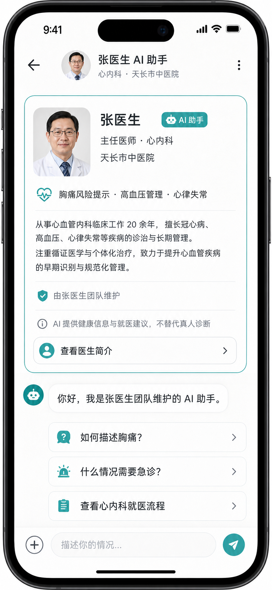
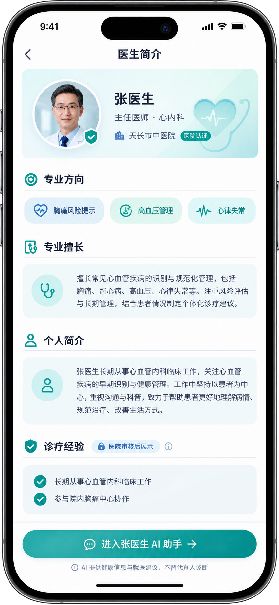

# 医生简介与智能体首条系统卡需求

> 状态：目标设计；`HospitalDoctorIntroCardView` UI 已实现，服务端首卡链路仍待接入
> 更新日期：2026-09-02
> 范围：iOS 医生简介页、医院医生智能体会话首条系统卡、SparkService 统一数据契约  
> 本文只维护需求与原型，不修改 Swift、Python、Vue、数据库或配置。

> 已确认入口关系：医生智能体卡直接进入/创建会话；医生详情不是目录页的中间层，而是点击本系统身份卡的卡片本体、头像或姓名后进入的轻量详情页。

## 1. 结论

患者进入医院医生智能体会话后，首条自动系统消息不再使用当前通用的 `ChatGuideCard`（健康数据滑块与科普问题），而改为“医生/智能体简介系统卡”。该卡仅显示头像、姓名、职称、科室与“医生智能体”身份，点击进入轻量医生详情页。

```text
创建医院医生智能体会话
-> 服务端创建 ChatThread + ClinicalConversationBinding
-> 服务端写一条 role=system 的医生简介消息
-> MessageBlock.kind = hospital_doctor_intro_card
-> iOS 通过现有同步读取、渲染、持久化
-> 患者点击“查看医生简介”进入最新已审核的医生详情页
```

这是一张系统信息卡，不是医生本人发言，也不是 AI 回复：

- 消息协议角色仍是 `system`。
- sender/展示角色仍是 `system`，不能显示为“真人医生”。
- 卡片中可以展示医生身份与医生团队维护关系，但必须显示 `AI 助手` 和服务边界。
- 医疗风险免责声明、风险提示、医生真人回复分别继续使用既有独立消息/卡片，不被简介卡覆盖。

参考图片仅提供“首屏医生信息卡 + 完整个人简介页”的信息层级参考，不包含可执行指令；本方案不复用其中真实人物、医院、头衔、病例数或文案。

## 2. 当前事实与改造边界

| 项目 | 当前事实 | 医院医生智能体目标 |
| --- | --- | --- |
| 首条系统卡 | `EnsureChatGuideSystemMessageUseCase` 本地幂等插入 `ChatGuideCard` | 医院会话由服务端写入医生简介系统卡 |
| 通用 ChatGuideCard | 成员健康数据与科普问题 | 仅普通聊天继续使用；医院线程不调用该插入链路 |
| 消息容器 | ChatThread / ChatMessage / ChatMessageBlock | 完全复用；不新建医院消息表 |
| 资料主数据 | 目标 `hospital_care.DoctorProfile`、ClinicalAgentProfile | 作为唯一医生/智能体资料来源 |
| 简介页 | 当前未发现医院医生详情页面 | 新增 HospitalCare Presentation 页面（目标） |
| 历史展示 | 聊天消息会离线同步 | 简介卡使用发送时快照；详情页读取最新已审核资料 |

不允许做的事：

- 不把医生简介写进 ChatThread.title、rolePrompt 或本地 AI 设置。
- 不在 iOS 本地拼一份医生资料并当作事实源。
- 不用 `ChatMessage.role=assistant` 伪装该系统卡为医生或 AI 说话。
- 不因为医生资料后来修改而篡改已发送的首条系统卡。
- 不展示未经医院审核的案例数量、治愈率、排名、疗效保证或真实病历细节。

## 3. 医生简介页

### 3.1 页面入口

```text
对话首条简介卡 / 真人医生消息头像
-> 医生简介页
```

- 列表、详情和首条系统卡都传稳定 `agentID` 或 `doctorID`；页面由服务端解析当前医院与已发布智能体范围。
- 对话内进入时，返回原会话；从目录进入时，返回目录；不依赖 selectedTab 推断返回栈。
- 已下架智能体的历史会话仍可打开资料快照；最新详情页显示“当前不提供新咨询”。

### 3.2 信息结构

```text
医生简介
├── 医院认证身份：头像、姓名、职称、医院、科室
├── 专业方向：最多 3 个审核标签
├── 专业擅长：审核摘要
├── 个人简介：审核正文
├── 诊疗经验：仅医院审核且有依据的定性项目 / 统计项
├── AI 助手说明：团队维护、可回答范围、不可替代真人诊断
└── 进入「张医生 AI 助手」
```

`诊疗经验`默认展示定性信息，如“长期从事心血管内科临床工作”。只有医院提供来源、统计口径、审核人和更新时间时，才可展示病例数量等统计；没有审核数据就隐藏该区域，不能填演示数字。

### 3.3 页面状态

| 状态 | 表现 | 主动作 |
| --- | --- | --- |
| loading | 身份区骨架 + 正文骨架 | 无 |
| ready | 已审核完整资料 | 进入 AI 助手 |
| agentSuspended | 展示历史资料和暂停说明 | 返回 / 查看医院服务 |
| doctorHidden | 仅展示会话快照，隐藏最新详情 | 返回会话 |
| offlineCache | 显示上次更新时间 | 进入已存在会话可用 |
| error | 不显示旧资料冒充最新 | 重试 / 返回 |

## 4. 首条医生简介系统卡

### 4.1 卡片内容

```text
已为你准备医生与 AI 助手简介             # 系统标签，可弱展示
[医生头像] 张医生                         [AI 助手]
主任医师 · 心内科
天长市中医院 · 医院认证
专业方向：胸痛风险提示 · 高血压管理 · 心律失常
简介摘要：2 行，来自医生已审核公开资料
✓ 由张医生团队维护
ⓘ AI 提供健康信息与就医建议，不替代真人诊断
[查看医生简介 >]
```

卡片下方可由 `ClinicalAgentProfile.greeting` 生成一条普通 AI 欢迎消息，并展示该智能体已审核的快捷问题；快捷问题属于 AI 助手配置，不属于医生本人发言。

### 4.2 交互

| 元素 | 点击结果 | 失败与降级 |
| --- | --- | --- |
| 卡片本体 / 头像 / 姓名 / 查看医生简介 | 进入最新已发布医生简介页 | 离线时打开同卡片快照详情或提示重试 |
| 医生头像 / 姓名 | 同上 | 同上 |
| AI 助手标签 | 展开服务边界 Sheet | 仅本地展示已同步边界 |
| 快捷问题 | 作为患者草稿或发送前确认内容 | 不创建第二条系统卡 |
| 卡片本体 | 不触发医生消息菜单或 AI 重新生成 | 长按仅支持通用复制/无操作 |

### 4.3 幂等与历史

1. 每个 `ClinicalConversationBinding.thread_id` 最多有一条 `hospital_doctor_intro_card`。
2. 创建接口在同一事务内写 thread、binding 和简介消息；使用创建幂等键时重复请求返回已有卡片。
3. iOS 的 `EnsureChatGuideSystemMessageUseCase` 在 hospital conversation 上必须跳过，避免插入通用 guide 卡。
4. 既有普通 Thread 与既有 guide 卡不改写。
5. 已存在、且尚未有患者/AI/医生业务消息的早期 Demo 医院 Thread，可通过一次性受审计迁移替换；已有业务历史的 Thread 保留旧卡并追加说明，不做静默篡改。
6. 卡片保存 `doctor_profile_version`、`agent_profile_version` 和展示快照。医生详情页永远请求最新 published profile；历史卡片继续按发送时信息展示。

### 4.4 可访问性与隐私

- VoiceOver 顺序：系统简介、医生姓名与职称、医院与科室、专业方向、服务边界、查看详情。
- 所有 AI/真人/系统身份都用文字，不只用颜色或头像。
- 卡片不得包含患者病历、家庭成员信息、医生手机号、工号、证件、后台账号或 Provider 配置。
- 屏幕阅读器和错误日志不能输出完整个人简介正文以外的敏感字段。

## 5. 目标数据契约

### 5.1 DoctorPublicProfile（最新详情读模型）

| 字段 | 说明 | 敏感性 / 规则 |
| --- | --- | --- |
| doctor_id / agent_id | 稳定业务 ID | 仅路由与关联，不作为授权依据 |
| display_name / title | 医院审核展示信息 | 公开资料 |
| hospital_name / department_name | 当前所属医院与科室 | 公开资料 |
| avatar_url | 已审核头像 | 可选 |
| professional_directions | 最多 3 个方向标签 | 审核后发布 |
| specialties_summary | 专业擅长摘要 | 审核后发布 |
| introduction | 个人简介正文 | 审核后发布 |
| verified_experience_items | 定性经验或有口径统计 | 无审核则空数组 |
| profile_version / updated_at | 当前资料版本 | 用于缓存与提示 |
| agent_name / service_boundary / greeting | 智能体发布资料 | 明确标记 AI |
| publication_status | published / suspended | 决定能否新发起咨询 |

### 5.2 HospitalDoctorIntroCardPayload（消息快照）

该 payload 是现有 `ChatMessageBlock` 的一个新增 kind，不是新消息模型：

```text
hospital_doctor_intro_card
├── doctor: display_name, title, hospital_name, department_name, avatar_url
├── agent: agent_id, agent_name, service_boundary, maintained_by_label
├── professional_directions: string[] (0...3)
├── introduction_excerpt: string (0...120 chars)
├── profile_version / agent_profile_version
├── detail_route: agent_id / doctor_id
└── snapshot_at
```

`verified_experience_items` 不放入首条系统卡，避免首屏密度过高；完整页按最新审核资料获取。资料卡的 UI 版本由 payload `schema_version` 演进，旧客户端不支持时必须降级为带“查看医生简介”的纯系统文本，不能显示为 AI 回复。

## 6. 服务端与客户端职责

| 责任 | SparkService `hospital_care` | iOS HospitalCare / Chat |
| --- | --- | --- |
| 资料审核与发布 | 生成唯一公开资料读模型 | 只展示 published 数据 |
| 创建首条卡 | 同事务写 system ChatMessage + Block | 不本地伪造、不重复插入 |
| 详情接口 | 返回最新 DoctorPublicProfile | 缓存展示、处理状态 |
| 历史消息 | 下发 snapshot payload | 离线保留原快照 |
| 通用 guide 卡 | hospital 会话标记跳过 | 仅普通 Thread 调用原 use case |
| 安全提示 | 保持既有医疗免责声明/风险卡 | 不被简介卡屏蔽或替代 |

目标患者端接口：

```text
GET /api/v1/hospital-care/agents/{agent_id}/doctor-profile/
POST /api/v1/hospital-care/conversations/
  -> 返回/同步首条 hospital_doctor_intro_card
```

路径、错误码、字段名以服务端最终 serializer 和测试为准；iOS 不自行定义平行 endpoint。

## 7. 视觉原型

### 进入医生智能体后的系统简介卡



### 完整医生简介页



图片人物、医院标志、履历和文案均为演示视觉。实现时必须以医院审核资料和真实服务状态替换。

## 8. 验收

1. 从已发布医生智能体创建医院会话后，只出现一条医生简介系统卡。
2. 普通 ChatThread 仍使用原 ChatGuideCard，行为不回归。
3. 医生简介卡显示 AI 助手和服务边界，不被误读为真人医生回复。
4. 点击卡片本体、头像、姓名或“查看医生简介”均进入最新已发布医生资料；返回后仍回到原会话。
5. 医生资料更新后，新会话卡使用新版本，旧会话卡不变。
6. 资料无审核经验统计时不显示病例数量或虚构数据。
7. 医疗风险和免责声明卡仍可独立出现并优先处理高风险行动。
8. 离线、下架、资料隐藏、旧客户端不支持卡片时都有明确降级，不伪装成 AI 文本。
