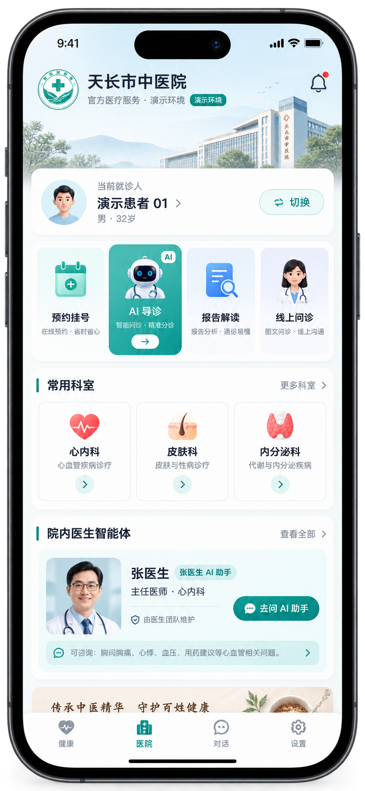
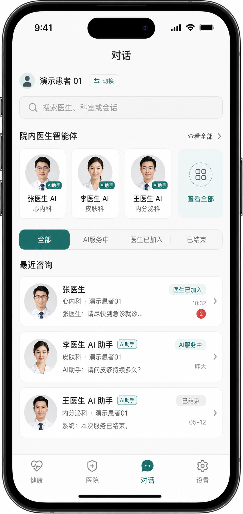
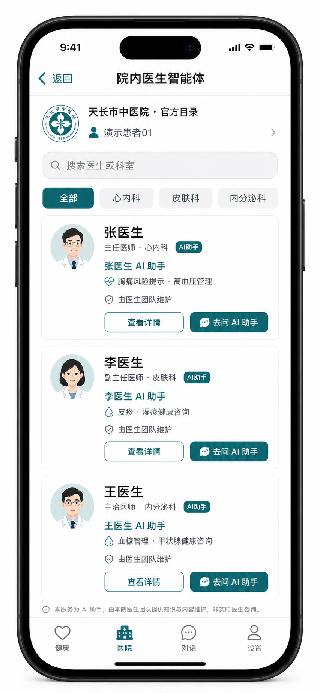

# 医院演示客户端 Plain Text UI 原型

> 设备基线：iPhone 竖屏，支持动态字体和深色模式。  
> 状态：页面原型，不实现代码。

## 0. 视觉原型

### 新医院首页



### 新院内对话列表



### 院内医生智能体目录



### 医生简介系统卡


### 医生完整简介页


视觉图只冻结整体方向：iOS 原生层级、`健康 / 医院 / 对话 / 设置` 四 Tab、蓝绿色医院识别、当前患者、医生智能体和院内会话列表。实现时以本文 Plain Text 状态、后端字段和真实医院授权素材为准，不直接把原型中的合成 Logo、医生头像或医院建筑作为生产资源。

## 0. 本期确认版：院内名医到会话

本节覆盖下文早期的“最近会话”“对话页成员切换”“AI 导诊”“会话页挂号”等原型表达；本期以本节为准。

### 0.1 对话 Tab 默认入口

```text
┌─────────────────────────────────────┐
│ <  [院内名医 | 普通对话]        [＋] │
│     对话导航栏标题区域，默认院内名医  │
├─────────────────────────────────────┤
│ 天长市中医院 · 院内名医              │
│ [搜索医生、职称、科室]               │
│ [全部] [心内科] [皮肤科] [内分泌科] →│
├─────────────────────────────────────┤
│ [头像][医生智能体] 张医生            │
│ 主任医师 · 心内科                    │
│ 擅长：胸痛评估、高血压管理            │
│ AI 提供健康信息，不替代诊断           │
│                         [继续咨询]   │
├─────────────────────────────────────┤
│ [头像][医生智能体] 李医生            │
│ 副主任医师 · 皮肤科                  │
│                         [开始咨询]   │
└─────────────────────────────────────┘
```

- 分段选择器位于 `.toolbar` 的 `ToolbarItem(placement: .principal)`，不占用页面滚动内容区；`isEditing` 时沿用现有编辑态标题，不显示 Picker。
- 固定当前演示医院，不显示医院切换、症状导诊或历史会话列表。
- 名医目录只显示每位医生最新已发布智能体；同一医生的其他智能体不在患者端露出。
- 已咨询医生优先，再按医院后台展示顺序；不显示最后消息、会话时间、未读或重点患者标签。
- 搜索仅匹配医生姓名、职称、科室；科室芯片与搜索可叠加。
- 点击卡片或 CTA：有最近会话则续聊；没有则创建带当前 `agent_id + member_id` 的医院会话。
- 当前成员由既有输入框内切换能力处理，名医页不重复展示成员选择。

### 0.2 医生智能体会话

```text
┌─────────────────────────────────────┐
│ < 张医生 AI 助手              [＋]   │
│   心内科 · 医生智能体                │
├─────────────────────────────────────┤
│ ┌─────────────────────────────────┐ │
│ │ [头像] 张医生       [医生智能体] │ │
│ │ 主任医师 · 心内科               │ │
│ │ 点击查看医生简介                │ │
│ └─────────────────────────────────┘ │
│                                     │
│            现有 AI / 风险 / 医生消息 │
│            渲染与输入框保持复用       │
├─────────────────────────────────────┤
│ [+] 描述你的情况……           [发送] │
└─────────────────────────────────────┘
```

- 新医院会话由服务端插入一张 `system` 身份卡，替换通用初始科普问题卡；普通对话仍保留原卡。
- 卡片本体、头像、姓名均进入轻量医生详情页。
- 右上角既有“新建对话”按钮不改 UI；在本会话内新建时自动绑定当前医生智能体，并以输入框当前成员创建新医院会话。
- 患者端不提供历史会话入口；旧会话只在服务端保留。
- 不新增挂号入口；风险等级、就医指导继续由现有工具与消息卡处理。
- 知识库 Manifest、正文、切块和向量同步完全静默；会话页不增加进度条、状态文字、完成提示或失败提示。

### 0.3 轻量医生详情页

```text
┌─────────────────────────────────────┐
│ < 医生简介                           │
├─────────────────────────────────────┤
│ [头像] 张医生                        │
│ 主任医师 · 心内科                    │
│ 天长市中医院                          │
├─────────────────────────────────────┤
│ 擅长方向                             │
│ [胸痛评估] [高血压管理] [心律失常]    │
│                                     │
│ 医生简介 / 医院公开介绍               │
├─────────────────────────────────────┤
│ [咨询医生智能体]                     │
└─────────────────────────────────────┘
```

本期不展示出诊排班、挂号、评价、费用或真人问诊入口。

## 1. 医院首页

```text
┌─────────────────────────────────────┐
│ [医院 Logo] 天长市中医院    [消息]  │
│              官方医疗服务 · Demo   │
├─────────────────────────────────────┤
│ 当前就诊人                          │
│ 演示患者 01                 [切换 >]│
│ 本页面为演示环境，不产生真实就诊记录 │
├─────────────────┬───────────────────┤
│  🗓 预约挂号     │  ✦ AI 导诊       │
│  科室/医生/日期  │  描述不适找科室   │
├─────────────────┼───────────────────┤
│  ▣ 报告解读     │  ☏ 线上问诊       │
│  上传或选择报告  │  当前：未真实接入 │
└─────────────────┴───────────────────┘

热门科室                         全部 >
[心内科] [皮肤科] [内分泌科] [更多]

院内医生智能体                   全部 >
┌─────────────────────────────────────┐
│ [头像][AI] 张医生                    │
│ 主任医师 · 心内科                    │
│ 张医生 AI 助手                       │
│ 擅长：胸痛评估、高血压、心律失常      │
│ 由医生团队维护     [去问 AI 助手]     │
└─────────────────────────────────────┘

就医服务
[医院导航] [门诊流程] [报告查询] [用药清单]

[健康] [医院●] [对话] [设置]
```

交互：

- “当前就诊人 / 当前患者”就是登录账号下当前选中的既有成员，不建立第二份患者状态。
- 点击当前就诊人直接复用现有成员选择；切换成员即切换患者，完成后刷新与该成员相关的快捷状态。
- 切换不会修改已有会话的患者归属；进入旧会话仍展示该会话原 memberID 对应的成员，新建咨询使用新选中的成员。
- 主操作中不可用能力显示原因，不用可点击但永远失败的入口。
- 医院品牌区域点击进入医院简介、地址、急诊电话和 Demo 声明。

## 2. 院内医生智能体目录

```text
┌─────────────────────────────────────┐
│ <  院内医生智能体          [搜索]   │
│ 天长市中医院 · 官方目录              │
├─────────────────────────────────────┤
│ [全部] [心内科] [皮肤科] [内分泌科] →│
│ [可咨询] [真人可接管] [按科室排序]    │
├─────────────────────────────────────┤
│ [头像][AI] 张医生                    │
│ 主任医师  心内科                     │
│ 张医生 AI 助手 · 由本人团队维护       │
│ 擅长：胸痛初步风险提示、高血压管理     │
│ AI 提供健康信息，不替代医生诊断        │
│ [查看详情]               [去问问]     │
├─────────────────────────────────────┤
│ [头像][AI] 李医生                    │
│ 副主任医师  皮肤科                    │
│ ……                                  │
└─────────────────────────────────────┘
```

空状态按原因区分：无搜索结果、该科暂无发布智能体、医院服务暂停、离线无缓存。

## 3. 医生智能体详情

```text
┌─────────────────────────────────────┐
│ <                     [医院认证]     │
│          [医生头像 + AI 角标]        │
│              张医生                  │
│          主任医师 · 心内科           │
│          张医生 AI 助手              │
├─────────────────────────────────────┤
│ 擅长                                │
│ [胸痛风险提示] [高血压] [心律失常]    │
│                                     │
│ AI 助手可以                         │
│ · 整理症状并提示可能的就医紧迫程度     │
│ · 解释院内审核的患者教育资料           │
│ · 引导选择科室和挂号                  │
│                                     │
│ AI 助手不可以                       │
│ · 替代医生确诊、开具处方或处理急症      │
│                                     │
│ 知识来源：心内科患者教育库 v3 等       │
│ 最近审核：2026-08-30                 │
├─────────────────────────────────────┤
│ 当前就诊人：演示患者 01      [切换]   │
│ [ ] 我已了解 AI 服务边界              │
│                  [开始咨询]           │
└─────────────────────────────────────┘
```

如果医生支持真实线上问诊，另设 `联系真人医生` 按钮并说明服务时间、费用和资质；禁止让“开始咨询”同时代表 AI 和真人问诊。

## 4. 新院内对话列表

```text
┌─────────────────────────────────────┐
│ 对话               演示患者01 [切换]│
├─────────────────────────────────────┤
│ [搜索医生、科室或会话……]             │
│ 院内医生智能体                 全部 > │
│ [张医生 AI] [李医生 AI] [更多]       │
│ [全部] [AI服务中] [医生已加入] [结束] │
├─────────────────────────────────────┤
│ 最近会话                            │
│ [AI] 张医生 AI 助手        10:32     │
│ 心内科 · 演示患者 01                 │
│ 医生已接管                          │
│ 张医生：请尽快到急诊就诊……      ●2  │
├─────────────────────────────────────┤
│ [AI] 李医生 AI 助手          昨天    │
│ 皮肤科 · 演示患者 02                 │
│ 服务已结束                          │
│ 系统：本次服务已结束                 │
├─────────────────────────────────────┤
│ [健康] [医院] [对话●] [设置]         │
└─────────────────────────────────────┘
```

列表预览必须带发言者前缀：`AI 助手：`、`张医生：`、`我：`、`系统：`。不能仅靠头像判断。首次进入本页始终停留在列表，不自动复用或创建普通会话；新咨询只能从院内医生智能体发起。

## 5. 医院智能体对话页

```text
┌─────────────────────────────────────┐
│ < 张医生 AI 助手         [医生详情] │
│   心内科 · AI 服务中                 │
├─────────────────────────────────────┤
│ AI 健康信息不替代诊断；危急情况请拨打 │
│ 120 或立即前往急诊。          [了解] │
├─────────────────────────────────────┤
│ [AI 助手]                            │
│ 您好，我是张医生团队维护的 AI 助手。  │
│ 请描述最不舒服的部位和持续时间。       │
│                                     │
│                         [患者]       │
│               胸口痛了大约 20 分钟。 │
│                                     │
│ [AI 助手]                            │
│ 是否伴随出汗、呼吸困难或放射到左臂？   │
│                                     │
│ ┌─────────────────────────────────┐ │
│ │ 高风险提示                      │ │
│ │ 当前描述可能需要紧急医疗评估。   │ │
│ │ 请停止活动，立即呼叫 120 或急诊。 │ │
│ │ [拨打 120] [查看急诊路线]        │ │
│ └─────────────────────────────────┘ │
│                                     │
│ — 张医生已加入本次会话 —             │
│ [张医生 · 真人医生]                  │
│ 请立即按上方建议就医，不要自行驾车。   │
├─────────────────────────────────────┤
│ [+]  描述你的情况……          [发送] │
└─────────────────────────────────────┘
```

身份视觉：AI 使用统一 AI 标识；真人医生气泡显示实名、职称和 `真人医生`。医生加入后 AI 是否继续自动回复由服务端策略决定，客户端只按状态展示。

角色实现语义：患者自己是 `currentUser`，后台医生是 `otherUser`，智能体是 `assistant`，接管/结束事件是 `system`。这是展示角色；底层 AI Runtime 角色不新增 otherUser。

### 5.1 医生简介首条系统卡

```text
┌─────────────────────────────────────┐
│ 系统 · 已为你准备医生与 AI 助手简介   │
│                                     │
│ [头像] 张医生              [AI 助手] │
│ 主任医师 · 心内科                   │
│ 天长市中医院 · 医院认证             │
│                                     │
│ 专业方向                             │
│ 胸痛风险提示 · 高血压管理 · 心律失常  │
│                                     │
│ 简介摘要：从事心血管内科临床工作……   │
│ ✓ 由张医生团队维护                  │
│ ⓘ AI 提供健康信息与就医建议，不替代  │
│    真人诊断                          │
│                                     │
│ [查看医生简介                       >]│
└─────────────────────────────────────┘
```

- 本卡是 `system`，不是张医生本人消息；点击头像、姓名或“查看医生简介”进入详情页。
- 医院医生智能体会话只插入一次；普通聊天继续显示现有健康数据/科普引导卡。
- 卡片资料是创建会话时快照；医生资料更新后，卡片不变，详情页显示最新已审核版本。
- 卡片下方可显示 AI 欢迎语和审核过的快捷问题；风险免责声明仍作为独立卡片出现。

### 5.2 医生完整简介页

```text
┌─────────────────────────────────────┐
│ <  医生简介                          │
├─────────────────────────────────────┤
│ [头像] 张医生                        │
│ 主任医师 · 心内科                    │
│ 天长市中医院 · 医院认证              │
├─────────────────────────────────────┤
│ 专业方向                             │
│ [胸痛风险提示] [高血压管理] [心律失常] │
│                                     │
│ 专业擅长                             │
│ 审核后的专业摘要……                   │
│                                     │
│ 个人简介                             │
│ 审核后的公开介绍……                   │
│                                     │
│ 诊疗经验 · 医院审核后展示             │
│ ✓ 长期从事心血管内科临床工作          │
│ ✓ 参与院内胸痛中心协作               │
├─────────────────────────────────────┤
│ [进入张医生 AI 助手]                 │
│ AI 提供健康信息与就医建议，不替代诊断 │
└─────────────────────────────────────┘
```

病例数量、疗效、诊疗年限等统计只有在服务端带审核口径和更新时间时才显示；无审核数据时隐藏该模块，不用 Demo 数字填充。

## 6. 风险与就医指导卡片

```text
┌─────────────────────────────────────┐
│ 中风险 · 建议尽快就医                │
│                                     │
│ 依据摘要                            │
│ · 症状持续超过 3 天                  │
│ · 出现发热                          │
│                                     │
│ 下一步                              │
│ 建议 24 小时内挂皮肤科门诊。         │
│ [预约挂号] [查看门诊时间]            │
│                                     │
│ 该提示由 AI 生成，不是诊断。  [详情] │
└─────────────────────────────────────┘
```

高风险 CTA 顺序：120 / 急诊路线 > 联系家人 > 继续补充信息。卡片必须可被 VoiceOver 完整朗读，不能只靠颜色传达等级。

## 7. 预约挂号 Demo

```text
┌─────────────────────────────────────┐
│ < 预约挂号                          │
│ [演示模式：不会产生真实挂号]         │
├─────────────────────────────────────┤
│ 1 选择科室   心内科                  │
│ 2 选择医生   张医生                  │
│ 3 选择日期   9 月 2 日 上午          │
│ 4 就诊人     演示患者 01             │
├─────────────────────────────────────┤
│ 演示号源：普通门诊                   │
│ 演示费用：¥0                         │
│                                     │
│                [确认演示预约]        │
└─────────────────────────────────────┘
```

结果页必须写“演示预约已完成，仅用于展示产品流程”。如果是跳转模式，则按钮文案为“前往医院挂号”，返回后不显示成功状态。

## 8. 已结束状态

```text
┌─────────────────────────────────────┐
│ 本次服务已结束                       │
│ 结束原因：已引导线下就医             │
│ 历史内容仍可查看，如有新问题请重新咨询 │
│ [重新咨询]              [预约挂号]   │
└─────────────────────────────────────┘
```

输入框替换为结束状态卡，不允许继续发送。重新咨询创建新 ChatThread，不覆盖历史。

## 9. 原型验收

- 320pt 宽度无横向裁切；大字体时卡片允许增高，不截断风险行动。
- 浅色、深色、高对比度下 AI/医生身份均可辨认。
- 网络失败不会隐藏已经看到的高风险行动建议。
- 所有演示、未接入、AI 生成和真人医生身份说明均使用可见文字。
- 每个入口都能回到医院首页或对话，不产生导航死路。
