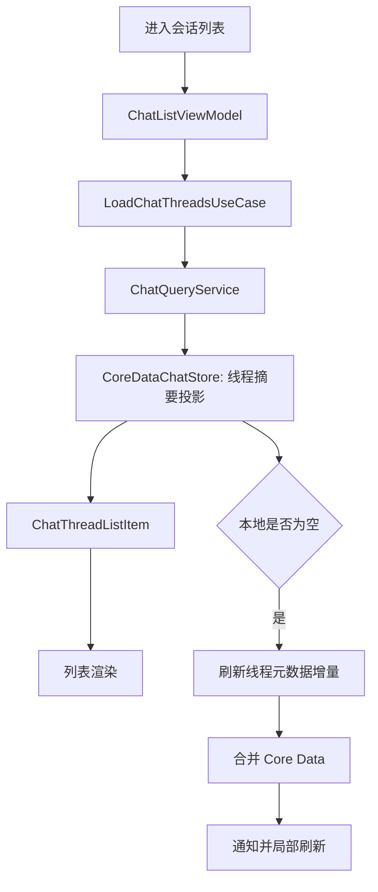
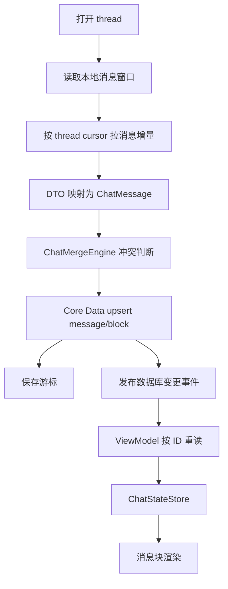

# 对话线程与消息读模型需求

> 文档类型：具体功能分析 / 读模型专项
>
> 分析范围：`SparkClient/SparkClient` iOS 客户端的 Chat Feature 读模型（线程投影、消息窗口、Core Data、StateStore）；当前代码事实以仓库扫描结果为准。本文不把推荐设计描述成已实现能力。
>
> Presentation 列表页、消息 CollectionView、气泡与 MessageCards 详见 `消息卡片UI、对话列表.md`。

## 一、模块目标

本模块负责把本地 Core Data 中的聊天线程、消息、消息块和同步游标，转换为会话列表与会话详情可直接消费的读模型，并在本地写入、远端增量同步、实时通知、AI 流式运行和账号切换后保持展示一致。

当前实现形态是 **Feature 内部分层 + Core Data 本地优先 + REST 增量同步 / WebSocket 提示 + Outbox 写回**：

```text
ChatConversationListPage / ChatView
        ↓
ChatListViewModel / ChatDetailViewModel
        ↓
LoadChatThreadsUseCase / LoadChatMessagesUseCase
        ↓
ChatQueryService
        ↓
ChatRepository → CoreDataChatRepository → CoreDataChatStore
        ↓                         ↑
ChatStateStore              ChatSyncEngine / MessageRunActor / ToolHub
        ↓                         ↑
列表投影、消息窗口、消息块渲染 ← ChatConversationChangeEvent
```

目标边界：

- 线程列表只读取线程元数据和最新消息摘要、未读信息，不为每个线程加载完整消息正文。
- 会话详情优先展示本地消息，再按线程游标拉取远端增量；消息按时间窗口读取并支持加载更旧消息。
- 消息块以稳定 `id`、`revision`、`orderKey` 合并，支持文本、推理、工具和结构化健康卡片等富内容更新。
- 本模块不负责 AI 推理、工具授权、远端业务规则或附件实际下载；这些由 `ChatOrchestrator`、ToolHub、`ChatSyncEngine` 和 `ChatAttachmentPipeline` 等协作模块负责。

## 二、对话线程与消息读模型模块结构

### 2.1 结构职责表

| 层级 | 职责 | 关键代码 |
|---|---|---|
| Presentation | 页面生命周期、加载状态、消息窗口、局部刷新和用户反馈 | `SparkClient/Projects/Features/Chat/Presentation/ChatListViewModel.swift`、`ChatDetailViewModel.swift`、`ConversationList/ChatLoadCoordinator.swift` |
| Application | 为 UI 提供稳定查询用例；编排发送、运行时副作用和线程同步入口 | `Application/ChatQueryService.swift`、`LoadChatThreadsUseCase.swift`、`LoadChatMessagesUseCase.swift`、`MessageRunActor.swift` |
| Domain | 定义 `ChatThread`、`ChatMessage`、`ChatMessageBlock`、存储协议、投递状态和同步游标 | `Domain/ChatMessage/ChatMessage.swift`、`Domain/ChatStoreProtocols.swift`、`Domain/ChatDeliveryState.swift` |
| Infrastructure / Storage | Core Data 查询、投影组装、持久化、幂等 upsert、变更通知 | `Infrastructure/CoreDataChatStore.swift`、`CoreDataChatRepository.swift`、`ChatDatabaseKernel.swift` |
| Sync / API | 线程和消息增量拉取、REST 推送、WebSocket 实时提示、游标推进和 Outbox | `Infrastructure/ChatSyncEngine.swift`、`ChatInboundPipeline.swift`、`ChatOutboxPipeline.swift`、`Core/Networking/API/AI/ChatRemoteAPI.swift` |
| Composition Root | 组装唯一 Repository、Query Service、同步引擎、运行时 Actor 和 ViewModel 依赖 | `Projects/App/Sources/App/Architecture/AssemblyProducts.swift` |
| Test | 当前主要覆盖架构禁用符号、工具事件和消息元数据；读模型查询/合并专项覆盖不足 | `SparkClient/Tests/Chat/ChatArchitectureGateTests.swift` 等 |

### 2.2 具体目录结构

```text
SparkClient/SparkClient/
├── Projects/App/
│   ├── Resources/SparkClient.xcdatamodeld/
│   │   └── SparkClient.xcdatamodel/contents
│   └── Sources/App/Architecture/
│       ├── AssemblyProducts.swift
│       └── AccountSessionRuntime.swift
├── Projects/Core/
│   ├── Database/CoreDataStack.swift
│   └── Networking/API/AI/ChatRemoteAPI.swift
├── Projects/Features/Chat/
│   ├── Application/
│   │   ├── ChatQueryService.swift
│   │   ├── LoadChatThreadsUseCase.swift
│   │   ├── LoadChatMessagesUseCase.swift
│   │   └── MessageRunActor.swift
│   ├── Domain/
│   │   ├── ChatMessage/ChatMessage.swift
│   │   ├── ChatStoreProtocols.swift
│   │   └── ChatDeliveryState.swift
│   ├── Infrastructure/
│   │   ├── CoreDataChatRepository.swift
│   │   ├── CoreDataChatStore.swift
│   │   ├── ChatDatabaseKernel.swift
│   │   ├── ChatMergeEngine.swift
│   │   ├── ChatInboundPipeline.swift
│   │   ├── ChatSyncEngine.swift
│   │   ├── ChatSyncSupervisor.swift
│   │   └── ChatNotifications.swift
│   └── Presentation/
│       ├── ChatListViewModel.swift
│       ├── ChatDetailViewModel.swift
│       ├── ChatStateStore.swift
│       └── ConversationList/
└── Tests/Chat/
    ├── ChatArchitectureGateTests.swift
    ├── ChatMessageMetadataTests.swift
    ├── ChatToolEventInterpreterTests.swift
    └── ChatToolRuntimeAttachmentBuilderTests.swift
```

### 2.3 目录职责与依赖方向

- UI/Feature 只通过 ViewModel 和 UseCase 读取数据；当前没有单独的通用 `ReadModel` 类型目录，`ChatThreadListItem` 是线程列表投影模型。
- Application 依赖 Domain 协议，不直接创建 Core Data 对象；`ChatQueryService` 只是 Repository 查询门面。
- Domain 不依赖 Core Data、网络或 SwiftUI。
- Infrastructure 实现 `ChatRepository`，通过 `ChatDatabaseKernel` 获取按账号隔离的 Core Data 上下文。
- Sync/API 可把远端 DTO 映射为 Domain，再通过 Inbound Pipeline 写回 Repository；读模型不直接请求网络。
- `ChatStateStore` 是会话内瞬时/展示缓存，不是持久化事实源；持久化事实源是 Core Data。

## 三、线程列表读模型

### 3.1 需求说明

线程列表加载应返回 `ChatThreadListItem`，包含线程自身信息及列表所需的最新消息摘要、未读/活动信息。禁止为了渲染列表而对每条线程加载全量消息。

### 3.2 基础要求与业务规则

- `CoreDataChatStore.loadThreadListItems()` 只查询当前账号且 `isSoftDeleted == NO` 的 `ChatThreadEntity`。
- 线程投影由 `makeThreadListProjectionItem` 组装；最终由 `sortThreadListItems` 排序，置顶和更新时间规则必须与该实现保持一致。
- `loadThreadListItem(threadID:)` 用于数据库通知后的局部刷新，线程被软删除后返回 `nil`。
- 本地列表为空时，`ChatListViewModel.refreshThreadsIfLocalEmpty` 可触发线程元数据增量刷新；列表刷新不拉取每个会话的消息正文。
- 未登录或没有活动 `accountID` 时返回空列表；不得把其他账号的线程作为访客数据展示。

### 3.3 主流程

```text
进入会话列表
  → ChatListViewModel.loadIfNeeded()
  → LoadChatThreadsUseCase.execute()
  → ChatQueryService.loadThreadListItems()
  → CoreDataChatStore 查询线程并组装摘要投影
  → ChatListViewModel 更新列表
  → 若本地为空，ChatSyncSupervisor.refreshThreadListIncremental()
  → 数据库变更通知后仅刷新受影响线程行
```

### 3.4 失败、重试和恢复

- Core Data 读取失败时底层当前以 `try?` 转换为空结果，UI 可能无法区分“真实空列表”和“读取失败”；这是已确认的错误可见性缺口。
- 远端刷新失败不应清空已有本地列表；可保留本地快照并允许用户再次刷新。
- 线程软删除先保留待上送删除游标，远端确认后再清理；列表查询始终过滤软删除线程。

### 3.5 技术细节与设计代码位置

- `ChatThreadStoring.loadThreadListItems()` 与 `loadThreadListItem(threadID:)`：列表读协议。
- `CoreDataChatStore.loadThreadListItems()`：按 `ownerAccountID` 过滤线程并构造投影。
- `CoreDataChatStore.makeThreadListProjectionItem(...)`：摘要聚合位置。
- `ChatListViewModel.loadIfNeeded()`、`refreshThreads()`、`refreshThreadsIfLocalEmpty(isSearching:)`：入口和刷新策略。
- `ChatConversationListPage.swift`：用户可见列表页面入口。

### 3.6 验收标准

- 列表只显示当前账号的未软删除线程。
- 列表加载不触发每线程全量消息查询。
- 新消息或线程元数据变化后，受影响行能局部刷新且排序正确。
- 本地列表非空时远端刷新失败不导致已有内容消失。
- 空列表、未登录、软删除和 Core Data 读取失败均有可区分的可观测状态；当前最后一项尚未完整实现。

## 四、会话详情消息窗口读模型

### 4.1 需求说明

会话详情按线程读取 `ChatMessage`，返回未墓碑消息，支持首屏加载、按 `before` 加载更旧消息、按客户端消息 ID 局部重读，以及消息块更新后的精确刷新。

### 4.2 基础要求与业务规则

- `loadMessages(threadID:limit:before:)` 以 `createdAt` 降序从 Core Data 取数，再反转为时间正序返回。
- `before` 是严格小于游标时间的分页条件；分页合并不得重复已有消息。
- `isTombstone == NO` 才能进入读模型；删除使用墓碑/软删除语义，不应让 UI 看到已删除消息。
- `countMessages(threadID:)` 用于判断 `hasMore`，当前实现以消息数量与已加载数量比较。
- `loadMessages(clientMessageIDs:)` 用于同步/流式更新后的局部重读，按创建时间升序返回。
- 消息块通过 `ChatMessageBlockEntity` 单独存储，负载编码在 `payloadData`，展示顺序由 `orderKey`，更新幂等性由 `revision` 支撑。

### 4.3 主流程

```text
打开 thread
  → ChatDetailViewModel.loadMessagesIfNeeded()
  → 先读取本地消息窗口
  → ChatSyncSupervisor.pullThreadMessagesIncrementalOnOpen(threadID)
  → ChatSyncEngine 按 thread cursor 拉取远端消息
  → ChatInboundPipeline → ChatMergeEngine → CoreDataChatStore.upsertRemoteMessages
  → sparkChatDatabaseDidChange
  → ViewModel 按受影响 clientMessageID 局部重读
  → ChatStateStore 更新消息窗口 → UI 渲染 blocks
```

### 4.4 失败、重试和恢复

- 首次打开本地消息为空时使用 `cursor=nil` 拉取首屏；已有本地消息时优先使用每线程游标，缺游标则退回本地最新 `serverUpdatedAt`。
- 同步失败时保留本地消息窗口，允许再次打开/刷新重试；当前 ViewModel 对同步错误的用户可见映射需结合页面调用方继续补测。
- 远端消息不存在的线程由同步引擎识别 404/`thread_not_found`，不能把本地消息静默替换为空。
- 发送中的本地消息、失败消息和已发送消息都可进入本地读模型；失败用户消息由重试用例处理，不应在普通历史加载中被误删。
- 消息块的部分成功更新必须保留已存在的本地健康卡片，并按稳定块 ID 合并，避免远端较旧快照覆盖本地富内容。

### 4.5 技术细节与设计代码位置

- `ChatDetailViewModel.loadMessagesIfNeeded(...)`：首屏、总数和分页。
- `ChatDetailViewModel` 中数据库通知处理：按 `affectedClientMessageIDs` 调用 `LoadChatMessagesUseCase.execute(clientMessageIDs:)`。
- `CoreDataChatStore.loadMessages(...)`、`countMessages(...)`：消息查询和分页。
- `ChatMessage.swift`：消息角色、消息类型、块类型、块状态和稳定块 ID。
- `ChatMessageBlock+Render.swift` 与 `ChatMessageBubbleContentView.swift`：读模型到 UI 的渲染适配。

### 4.6 验收标准

- 首屏消息按时间正序展示，加载更旧消息不重复、不乱序。
- 墓碑消息不展示，失败/发送中消息状态可正确显示。
- 消息块更新只刷新受影响消息，不要求全量重载整个线程。
- 工具块、推理块、结构化健康卡片和免责声明块按 `orderKey` 正确排列。
- 打开已有线程时只拉取该线程消息增量，不触发全量线程消息同步。

## 五、本地写入、同步合并与读模型刷新

### 5.1 需求说明

所有会影响会话展示的本地写入都必须落到同一 Repository/Store，并在 Core Data save 成功后发送结构化变更事件；远端同步必须通过相同入口合并，确保 UI 读模型只有一个事实来源。

### 5.2 基础要求与业务规则

- `CoreDataChatRepository` 是 `ChatRepository` 的 actor 实现，统一代理线程、消息、块、游标、Outbox 和附件任务存储。
- 本地新消息通过 `appendMessage` / `upsertLocalMessage` 写入；投递状态使用 `pending → sending → sent/failed`，定义于 `ChatDeliveryState`。
- 远端消息按 `clientMessageID` 或 `serverMessageID` 定位；`ChatMergeEngine.shouldSkipApplyingRemote` 决定是否跳过旧远端版本。
- 远端合并不得丢失本地健康资源块；消息块采用稳定 ID、revision 和 orderKey 做局部幂等更新。
- `ChatSyncEngine` 对全局和单线程同步使用 single-flight；同一作用域重复请求复用进行中的任务。
- `ChatSyncSupervisor` 监听 `sparkChatDatabaseDidChange`，对 Outbox 推送做 700ms debounce；数据库通知不是网络请求本身。

### 5.3 主流程

```text
本地/AI/工具产生消息或 block
  → Repository/MessageRunActor 写 Core Data
  → save 成功后发布 ChatConversationChangeEvent
  → ViewModel 查询局部读模型并更新 StateStore
  → SyncSupervisor debounce
  → OutboxPipeline 推送 DTO 并处理 ACK
  → 下次 pull / realtime hint 再由 InboundPipeline 合并远端版本
```

### 5.4 失败、重试和恢复

- 网络失败由 Outbox 保留待发送数据，消息维持失败/待重试状态；ACK 只更新服务端 ID 和 `serverUpdatedAt`，不依赖完整消息回包。
- 实时连接断开时由同步引擎恢复或转为 REST 拉取；鉴权失效通过 `AuthSessionInvalidation` 进入账号生命周期处理。
- 并发写入由 Repository actor、数据库写事务、single-flight 和稳定消息/块 ID共同约束；跨进程并发策略当前未确认。
- 远端重复消息必须幂等 upsert；游标只有在成功应用拉取页后推进。

### 5.5 技术细节与设计代码位置

- `ChatMergeEngine.swift`：远端版本冲突决策。
- `ChatInboundPipeline.swift`：DTO 域模型转换后的入库入口。
- `ChatSyncEngine.swift`：全局/线程同步、分页、游标和 single-flight。
- `ChatOutboxPipeline.swift`、`ChatOutboxStore.swift`：发送队列、ACK 和重试数据。
- `ChatNotifications.swift`、`ChatDatabaseKernel.swift`：提交后事件和通知。
- `MessageRunActor.swift`：AI 流式输出、工具块、状态块和免责声明块写入消息读模型。

### 5.6 验收标准

- 同一 `clientMessageID` 重复拉取不会产生重复消息。
- 旧远端版本不会覆盖较新的本地块或消息状态。
- 数据库提交失败时不发送“已变更”通知。
- UI 收到消息更新后能通过 ID 局部重读并显示最新块。
- 同一线程并发打开/刷新不会产生重复网络拉取或游标回退。

## 六、整体业务流程

### 6.1 线程列表



### 6.2 线程详情



### 6.3 完整同步流程与触发矩阵

| 触发场景 | 同步方向 | 范围 | 是否拉正文 | 是否上送 Outbox | 游标 |
|---|---|---|---|---|---|
| App 登录/恢复 | 上送后可选拉取 | 全局 | 取决于调用的 `syncNowWithPull` | 是 | 全局/线程/消息 |
| 会话列表首次为空 | 拉取 | 线程元数据 | 否 | 否 | 线程游标 |
| 会话列表下拉刷新 | 拉取 | 线程元数据增量 | 否 | 否 | 线程游标 |
| 打开某个 thread | 拉取 | 当前线程消息增量 | 是 | 否 | 该线程消息游标 |
| 新消息本地提交 | 上送 | 当前 Outbox 批次 | 不拉取 | 是，700ms debounce | ACK 回填服务端 ID/时间 |
| 消息块本地补写 | 上送 | 待同步 blocks | 不拉取 | 是 | block pending 标记 |
| WebSocket realtime hint | 拉取 | hint 指向的增量范围 | 按范围 | 通常否 | 服务端 hint cursor |
| 账号切换/登出 | 停止 | 旧账号实时连接和任务 | 否 | 不应向新账号上送旧数据 | 旧账号游标隔离 |

#### 6.3.1 线程列表同步

```text
ChatListViewModel.loadIfNeeded / refreshThreads
  → 读取本地 ChatThreadListItem
  → 若需要远端刷新：ChatSyncSupervisor.refreshThreadListIncremental
  → ChatSyncEngine.pullThreadDeltas(cursor: thread cursor)
  → SparkChatRemoteAPI.pullThreads(cursor:, limit: 100)
  → ChatSyncEngineDTOMapper.toDomainThread
  → repository.upsertRemoteThreads
  → 保存 thread cursor
  → 发布 genericThreadsChanged / threadsChanged
  → ViewModel 重新查询列表投影
```

线程列表刷新只处理标题、成员绑定、置顶、图标、模型配置、删除状态和远端更新时间等元数据，不拉每个线程的消息正文。这是为了避免列表页 N+1 请求和不必要的附件任务。

#### 6.3.2 进入线程同步

```text
进入 thread
  → countMessages(threadID)
  → count == 0：cursor = nil，拉取首屏
  → count > 0：优先读取 chat.thread.message.cursor.<threadID>
                 无游标则使用本地 latestServerActivity
  → pullThreadMessagesIncrementalOnOpen(threadID)
  → API 分页，每页最多 200 条，单次最多 20 页
  → DTO → ChatMessage
  → InboundPipeline → MergeEngine
  → upsertRemoteMessages（消息 + blocks）
  → 本页应用成功后保存 message cursor
  → hasMore 且 cursor 前进才继续下一页
  → 通知 ChatDetailViewModel 按 clientMessageID 局部重读
```

进入线程时如果本地已有数据，不能把 `latestServerActivity` 当作绝对正确的同步游标；它只是没有持久化游标时的回退点。服务端时间精度、时钟漂移、同一时间戳消息和删除事件都需要由服务端游标语义兜底。

#### 6.3.3 Outbox 上送与 ACK

```text
本地消息/块写入
  → deliveryState = pending 或 block.isPendingSync = true
  → Core Data save
  → sparkChatDatabaseDidChange
  → ChatSyncSupervisor 取消旧 debounce，等待 700ms
  → ChatOutboxPipeline 读取当前账号 pending 消息/块
  → ChatRemoteMessageDTO / block update DTO
  → SparkChatRemoteAPI.push
  → 服务端返回 acceptedMessages / acceptedBlockUpdates
  → applyPushMessageAck 回填 serverMessageID + serverUpdatedAt
  → markMessageBlocksSynced 清除 block pending
  → 保留本地内容；不依赖 ACK 中返回完整消息
```

上送失败时必须保留可重试状态和原始本地内容；不能因为一次网络失败把消息物理删除，也不能把 `pending` 错误改成 `sent`。ACK 只确认服务端接收元数据，服务端最终规范化内容仍通过后续 pull/realtime 增量回流。

#### 6.3.4 WebSocket 与 REST 关系

WebSocket 是低延迟变化提示，不应成为唯一事实来源。收到 realtime hint 后，客户端仍应通过 `ChatSyncEngine` 使用 REST 增量接口拉取并合并；连接断开、鉴权失效或 hint 丢失时，列表刷新/进入线程仍必须能够依靠游标完成恢复。

#### 6.3.5 同步并发与 single-flight

- 全局同步使用 `.global` scope；同一时间重复调用应等待同一个 Task。
- 线程打开使用 `.thread(threadID)` scope；如果全局同步正在进行，线程同步等待全局任务完成。
- 不同线程可并行的策略当前由 actor 与 scope 控制，不能假设 Core Data context 支持任意并发写；需要以 `ChatDatabaseKernel` 的上下文策略为准。
- 任务取消不等于同步失败；取消时不推进游标，不清除待发送数据，不发布“完整同步成功”状态。
- 单次同步最多处理 20 页，超出部分由下一轮继续；如果服务端返回相同 cursor，必须停止，避免死循环。

#### 6.3.6 同步失败恢复矩阵

| 失败 | 本地数据 | 游标 | 下次动作 |
|---|---|---|---|
| 网络断开/超时 | 保留当前读模型 | 保留旧游标 | 重试同一 cursor |
| 401/会话失效 | 保留但标记不可刷新 | 不推进 | 交给账号会话失效流程，重新登录后恢复 |
| 404 thread_not_found | 不立即清空本地历史 | 不伪造新游标 | 记录诊断，按产品规则处理线程失效 |
| DTO 解码失败 | 保留旧读模型 | 不推进该页 | 记录坏数据，避免跳过不可解析页 |
| 合并冲突 | 保留本地较新字段/块 | 应用成功后推进 | 记录 skip/merge 计数 |
| ACK 部分成功 | 成功项回填，失败项保留 pending/failed | 不把未确认项标成 sent | 下轮仅重试未确认项 |
| Core Data save 失败 | 保留事务前状态 | 不推进 | 记录存储错误并重试/提示 |

## 七、状态模型

| 状态类别 | 当前实现 | 说明 |
|---|---|---|
| 会话状态 | `ChatListViewModel` / `ChatDetailViewModel` 的加载与选择状态 | UI 瞬时状态，账号切换时 reset |
| 消息投递状态 | `pending`、`sending`、`sent`、`failed`、`read` | 持久化在 `ChatMessageEntity.deliveryState` |
| 消息块状态 | `pending`、`streaming`、`ready`、`failed` | 持久化在 `ChatMessageBlockEntity.status` |
| 删除状态 | `isTombstone` / `isSoftDeleted` | 消息/线程分别使用墓碑和软删除 |
| 同步状态 | 全局游标、线程游标、每线程消息游标、Outbox 队列 | 持久化在 `ChatSyncCursorEntity` 等实体 |
| 账号状态 | `AccountSessionRuntime` 的 guest/account 模式 | 账号切换停止实时同步并重置 Chat 状态 |
| 附件状态 | `ChatAttachmentDownloadEntity.stateRaw` | 不属于消息读查询，但影响附件最终可渲染性 |

读模型相关异常状态至少包括：本地空数据、加载中、已有本地数据但同步失败、消息分页结束、消息发送中、发送失败、远端合并成功、账号切换中和未登录。当前未发现统一的 `ChatReadModelError` 类型；底层读取错误被折叠为空集合，是后续应优先收敛的边界。

## 八、数据与持久化

| 实体 | 关键字段 | 读模型用途 |
|---|---|---|
| `ChatThreadEntity` | `id`、`ownerAccountID`、`title`、`memberID`、`updatedAt`、置顶与模型配置 | 线程主体和列表排序 |
| `ChatMessageEntity` | `clientMessageID`、`serverMessageID`、`threadID`、`role`、`deliveryState`、墓碑、时间戳 | 消息主体和投递状态 |
| `ChatMessageBlockEntity` | `id`、`clientMessageID`、`payloadData`、`kind`、`status`、`revision`、`orderKey`、工具父子关系 | 富内容与工具时间线 |
| `ChatSyncCursorEntity` | `ownerAccountID`、`key`、`value` | 全局/线程/线程消息增量游标 |
| `ChatAttachmentDownloadEntity` | `dedupeKey`、消息/线程 ID、状态、本地 URL | 附件异步下载补偿 |

数据隔离规则：所有查询和写入均须带当前 `ownerAccountID`；退出登录或账号切换由 `StorageRegistry`、`AccountSessionRuntime`、`ChatStateStore` 和 ViewModel 共同清理/重置。访客 AI 对话使用 `Presentation/Guest` 的独立内存模型，不应混入本读模型，除非后续明确设计迁移规则。

### 8.1 本地化存储总体原则

当前 Chat 本地存储是“领域模型与 Core Data 行分离”的结构：消息正文不是一个大 JSON 字段，而是 `ChatMessageEntity` 保存消息头，`ChatMessageBlockEntity` 一对多保存内容块；消息块的 `payloadData` 承载 Codable 负载。

```text
ChatThreadEntity
  └── ChatMessageEntity
        └── ChatMessageBlockEntity

ChatSyncCursorEntity     （线程/消息同步位置）
ChatAttachmentDownloadEntity （附件下载补偿队列）
```

设计含义：

- 线程、消息和消息块可以分别更新，流式文本或工具卡片更新不必重写整条消息。
- 消息列表查询通过 `ChatMessageEntity` 过滤墓碑，再加载关联的块行并解码 `payloadData`。
- 消息块拥有独立排序和 revision，适合远端重复投递、流式增量和工具副作用补写。
- `ChatSyncCursorEntity` 使用字符串 `key/value`，当前通过 key 前缀区分全局游标、线程游标和线程消息游标。
- 附件下载使用独立任务实体，网络同步成功不等于本地附件已可展示。

### 8.2 `ChatThreadEntity` 字段细节

| 字段 | 类型/默认值 | 当前语义 | 写入/使用注意 |
|---|---|---|---|
| `id` | UUID，必填 | 客户端线程主标识，也是远端 thread ID | 创建时生成；远端消息缺失线程时可补建本地线程 |
| `ownerAccountID` | Int64，默认 0 | 数据归属账号 | 所有 fetch/upsert/delete 都必须带此条件，不能仅按 `id` 查询 |
| `title` | String，默认空串 | 列表标题 | 展示层空标题回退为“新对话”；标题可由线程元数据同步更新 |
| `scenario` | String，默认 `chat` | AI 场景 | 当前聊天线程使用 `AIScenario.chat`，不能用模型名代替场景 |
| `memberID` | Int64? | 绑定的家庭成员/患者 | 可为空；切换成员只改变线程上下文，不应改变 thread ID |
| `createdAt` | Date | 本地创建时间 | 新建线程时设置；远端同步需要保留服务端语义或明确取舍 |
| `updatedAt` | Date | 本地列表排序和最近活动时间 | 消息/块/线程元数据变化会推进；不能直接等同于远端更新时间 |
| `serverUpdatedAt` | Date? | 远端线程最后更新时间 | 用于增量同步、冲突比较或诊断；为空表示尚未获得服务端时间 |
| `isActive` | Bool，默认 false | 本地当前活动线程标志 | 仅用于恢复活动会话；账号切换时必须避免跨账号保留活动线程 |
| `isSoftDeleted` | Bool，默认 false | 本地软删除标志 | 列表过滤；远端删除同步不能立即物理删除仍需上传的数据 |
| `deletedAt` | Date? | 软删除时间 | 与删除 outbox/cursor 配合；物理清理策略当前未确认 |
| `isPinned` | Bool，默认 false | 是否置顶 | 列表排序使用；与 `pinnedAt` 应保持一致 |
| `pinnedAt` | Date? | 置顶发生时间/排序辅助 | 取消置顶时应清空；不能只修改 `isPinned` 留下旧时间 |
| `iconName` | String? | 列表图标名 | 仅存语义名，不存图片二进制 |
| `iconColorName` | String? | 列表图标颜色语义名 | 必须由 UI 主题映射，不能把 RGB 解析逻辑放到存储层 |
| `imageDeliveryModeRaw` | String? | 图片发送/投递模式 | 以 raw value 存储，读取时必须有未知值回退 |
| `currentModelName` | String? | 线程当前选用模型 | 是线程运行配置，不等于全局 AI 设置 |
| `temperature` | Double? | 线程采样温度 | 可为空表示跟随默认策略；需限制合法范围 |
| `topP` | Double，默认 1.0 | 线程 top-p | 迁移时保留默认值，不能因缺字段变成 0 |
| `maxTokens` | Int32? | 线程最大输出 token | 可为空表示由 Provider/场景默认值决定 |
| `maxMessages` | Int32，默认 20 | 发给模型的历史消息上限 | 仅是运行时上下文限制，不是本地历史消息保留上限 |
| `rolePrompt` | String，默认空串 | 线程级角色/系统提示词 | 属于敏感运行配置；同步和日志不得明文泄露 |

当前 Core Data 模型未看到明确的唯一约束声明；实际去重依赖 Repository 的 `fetchThread`、线程 ID、账号条件和业务代码。若未来增加唯一约束，必须先验证历史重复数据和迁移行为。

### 8.3 `ChatMessageEntity` 字段细节

| 字段 | 类型/默认值 | 当前语义 | 关键规则 |
|---|---|---|---|
| `id` | UUID，必填 | 本地消息实体 ID/领域消息 ID | 不作为跨客户端幂等唯一键的唯一依据 |
| `clientMessageID` | UUID，必填 | 客户端生成的幂等 ID | 本地创建即生成；Outbox、远端合并、ACK 和局部重读的主键 |
| `serverMessageID` | String? | 服务端消息 ID | push ACK 后回填；为空表示未被服务端确认 |
| `ownerAccountID` | Int64，默认 0 | 消息归属账号 | 必须与线程归属账号一致；禁止只用 `clientMessageID` 跨账号读取 |
| `threadID` | UUID，必填 | 所属线程 | 查询、分页、游标和列表聚合的核心分区键 |
| `role` | String，默认 `user` | `system` / `user` / `assistant` | 解码未知值时要有失败或安全回退策略，不能静默改成 assistant |
| `deliveryState` | String，默认 `pending` | `pending`、`sending`、`sent`、`failed`、`read` | 表示投递生命周期，不表示内容块是否 ready |
| `createdAt` | Date | 消息在时间线中的创建时间 | 分页排序依据；同一时间戳的稳定二级排序当前未确认 |
| `serverUpdatedAt` | Date? | 服务端确认/远端更新时间 | ACK、远端合并和块更新会写入；用于确定本地最新服务器活动 |
| `isTombstone` | Bool，默认 false | 消息逻辑删除 | 读查询过滤；墓碑消息仍可能需要保留 server ID/同步信息 |
| `modelName` | String? | 生成该 assistant 消息使用的模型 | 只记录消息实际模型，不应被线程当前模型覆盖 |

消息本身不直接保存正文列；正文和卡片都在 `ChatMessageBlockEntity.payloadData` 中。这样可以表达一条 assistant 消息包含文本、推理、工具调用、工具结果和医疗提示等多个时间线块。

### 8.3.1 Domain `ChatMessage` 模型

`ChatMessage` 是跨 UI、运行时、同步和持久化的领域快照，字段与 Core Data 消息头基本一一对应，但 `blocks` 已经是解码后的领域对象：

| Domain 字段 | 来源/用途 | 设计细节 |
|---|---|---|
| `id` | 本地领域消息 ID | 用于 Identifiable 和内部引用；不能替代 `clientMessageID` 做同步幂等 |
| `threadId` | 线程分区 | 与 `ChatThread.id` 对齐；所有消息必须属于已存在或可补建的线程 |
| `role` | system/user/assistant | 决定气泡、运行时历史角色和失败恢复逻辑 |
| `blocks` | 解码后的消息块数组 | 不是可信排序源；入 UI 前应按 orderKey/createdAt 规则整理 |
| `clientMessageId` | 客户端幂等 ID | 用户消息、助手占位消息、重试消息都要保持明确的 ID 语义 |
| `serverMessageId` | 服务端确认 ID | ACK 前为空；回填后不可因远端缺省值覆盖本地已有值 |
| `deliveryState` | 投递生命周期 | 与块 `status` 解耦：消息可 sent，但某个富块仍 pending/failed |
| `createdAt` | 时间线时间 | 分页主排序；重试不应无意修改原用户消息的时间线位置 |
| `serverUpdatedAt` | 远端/同步活动时间 | 用于游标回退和诊断，不直接决定块显示顺序 |
| `isTombstone` | 逻辑删除 | 保留同步所需标识，但普通读模型过滤 |
| `modelName` | 生成模型 | 只记录实际生成消息的模型，允许用户切换线程模型后历史保持不变 |

`ChatMessage` 的合并规则不是简单的 remote 覆盖 local：

- `clientMessageID` 不相同的消息不能合并。
- 远端消息应保留本地尚未被服务端支持的 `healthResourceReference` 块，避免问报告等本地富内容丢失。
- 用户图片附件存在本地/远端信息不完整时，使用富附件评分选择信息更完整的一侧。
- 远端缺少 `serverMessageID` 时保留本地已有值。
- 失败消息重试应通过原消息/新运行消息的明确 ID 规则完成，不能用标题或正文匹配。

### 8.4 `ChatMessageBlockEntity` 字段细节

| 字段 | 类型/默认值 | 当前语义 | 关键规则 |
|---|---|---|---|
| `id` | UUID，必填 | 块稳定 ID | 文本段、reasoning、tool/rich block 可由 `ChatStableBlockID` 确定性生成 |
| `clientMessageID` | UUID，必填 | 父消息客户端 ID | 块更新与消息局部重读的关联键 |
| `threadID` | UUID，必填 | 冗余分区键 | 便于按线程查询和清理，必须与父消息一致 |
| `ownerAccountID` | Int64，默认 0 | 块归属账号 | 与父消息、线程保持一致，所有块查询带账号过滤 |
| `kind` | String，默认 `text` | 块类型索引 | 与 `ChatMessageBlockPayload` case 对齐；未知 kind 要可降级或诊断 |
| `payloadData` | Binary，必填 | Codable 块负载 | JSON/二进制编码格式变化必须考虑版本兼容和损坏恢复 |
| `anchorData` | Binary? | `messageStart`、`messageEnd`、前后块、tool call 锚点 | 用于工具结果/富内容定位，解码失败不能导致整条消息不可读 |
| `toolCallID` | String? | 工具调用 ID | 工具块与工具展示块的关联键；应支持远端重放去重 |
| `parentToolCallID` | String? | 父工具调用 | 表示富展示块属于哪个 tool call |
| `parentBlockID` | UUID? | 父块 | 表示块树关系；删除/替换父块时需定义子块处理策略 |
| `nodeRole` | String，默认 `timeline` | `timeline`、`tool`、`toolPresentation` | 影响时间线与工具展示分组 |
| `status` | String，默认 `ready` | `pending`、`streaming`、`ready`、`failed` | 只描述块生命周期，不等于消息 deliveryState |
| `revision` | Int64，默认 0 | 块内容版本 | `upsertBlockRowIfNewer` 仅接受更高版本，防止旧事件覆盖新块 |
| `orderKey` | Double? | 稳定展示顺序 | 流式/工具块不依赖数组合并顺序；相同 orderKey 的二级排序需固定 |
| `createdAt` | Date | 块创建时间 | 诊断和兜底排序使用 |
| `updatedAt` | Date | 块最近修改时间 | 用于诊断、同步和缓存失效 |
| `isPendingSync` | Bool，默认 false | 块是否等待上送 | 本地富内容补写可单独进入 block outbox，不应重复上传整条消息 |

当前 `ChatMessageBlockKind` 已覆盖文本、深度思考、工具、图片、文件、知识、地图、事件、健康卡片、结构化健康卡片、睡眠、营养、运动、HTML、任务、错误、助手状态、健康资料引用、医疗风险提示和免责声明等类型。新增类型必须同时更新 Codable、渲染分支、远端 DTO 兼容和测试。

### 8.5 同步游标与附件任务字段

| 类型 | 字段/键 | 当前用途 |
|---|---|---|
| `ChatSyncCursorEntity` | `ownerAccountID`、`key`、`value`、`updatedAt` | `chat.main` 全局消息游标、`chat.thread.cursor` 线程元数据游标、`chat.thread.message.cursor.<threadID>` 线程消息游标 |
| 线程删除游标 | `chat.thread.delete.<threadID>` | 记录待上送的线程删除事件，避免本地删除后丢失同步意图 |
| `ChatAttachmentDownloadEntity` | `id`、`dedupeKey`、`attachmentID`、`clientMessageID`、`threadID`、`attachmentPayload` | 附件下载任务的去重、关联和恢复 |
| 附件状态 | `stateRaw`、`localFileURLString`、`createdAt`、`updatedAt` | `pending`/处理中/成功/失败等状态及本地文件位置 |

游标不是消息的业务时间字段。只有远端拉取页成功映射、合并并写入后才能推进游标；失败、取消或应用不完整时必须保留旧游标，以便下次重放。

### 8.6 本地写入与清理事务

当前 `ChatDatabaseKernel.writeWithoutNotification` 负责执行写事务，Store 在写事务返回成功后再调用 `postChangeNotification`。因此：

1. 线程创建、消息追加、消息 upsert、消息块更新、软删除和 ACK 回填都先完成 Core Data save。
2. 只有 save 成功才发布 `ChatConversationChangeEvent`。
3. ViewModel 收到事件后按线程 ID或消息 ID查询最新读模型，不直接相信事件携带的旧快照。
4. 账号切换/登出先停止实时同步，再清理或切换 `SessionSnapshotStore`、StateStore 和 ViewModel；旧任务不得继续向新账号上下文写入。
5. 物理删除、历史压缩、附件文件回收和游标回收策略当前未完全确认，不能在客户端新增清理逻辑时默认永久删除。

### 8.7 迁移、版本与兼容性要求

- Core Data 模型位于 `Projects/App/Resources/SparkClient.xcdatamodeld`；新增字段必须提供默认值或 optional 策略，避免旧数据库打开失败。
- `payloadData` 是多态 Codable 数据，新增 block kind 必须兼容旧客户端读取未知类型；最低要求是跳过不可识别块并保留同消息其他可读块，同时记录解码错误。
- `ChatDeliveryState`、`ChatMessageBlockStatus`、`ChatMessageBlockNodeRole` 和各种 raw enum 都可能落库或出现在远端 DTO；修改 raw value 等同于数据迁移，禁止只改 Swift case 名称。
- 本地数据库升级与账号切换不是同一件事：迁移失败不能通过清空账号数据“修复”，应保留备份/诊断路径。
- 远端新增字段必须允许旧客户端忽略；客户端新增字段发送前需确认服务端兼容，否则应由 DTO 版本或能力协商控制。
- 迁移后必须验证：线程数、消息数、块数、待发送消息、游标数量、附件任务数量以及每个账号的 owner 归属没有异常下降。

### 8.8 性能、索引与容量要求

当前模型文件中未见可直接确认的唯一约束和完整索引定义，因此以下是必须验证的数据库要求，而非已确认现状：

- `ChatThreadEntity(ownerAccountID, isSoftDeleted, updatedAt)` 支撑线程列表过滤和排序。
- `ChatMessageEntity(ownerAccountID, threadID, isTombstone, createdAt)` 支撑历史分页和计数。
- `ChatMessageEntity(ownerAccountID, clientMessageID)` 支撑本地幂等 upsert、ACK 和局部重读。
- `ChatMessageEntity(ownerAccountID, serverMessageID)` 支撑远端消息重合并，但必须允许 server ID 为空。
- `ChatMessageBlockEntity(ownerAccountID, clientMessageID, id)` 支撑块 upsert 和消息删除清理。
- `ChatSyncCursorEntity(ownerAccountID, key)` 应保证同一账号同一 cursor key 只有一个活动值。
- `ChatAttachmentDownloadEntity(ownerAccountID, dedupeKey)` 应支撑附件任务去重。

容量和性能还应关注：超长对话的 blocks 数量、`payloadData` 大小、单次消息解码耗时、列表摘要是否加载了过多附件字段、Core Data 内存峰值、分页时重复 count 查询，以及附件二进制是否被误存入消息块而非文件缓存。

### 8.9 隐私、安全与数据留存

- `rolePrompt`、消息文本、健康卡片、工具参数、医疗文档引用和图片附件均可能包含敏感健康信息；日志只能输出脱敏后的 thread/client ID 和错误类别。
- 远端同步 DTO、Outbox 和本地 Core Data 都属于账号私有数据，任何 debug dump、崩溃报告和预览数据都必须遵守隐私策略。
- 账号切换时必须同时隔离线程、消息、块、游标、Outbox、附件任务和 StateStore；只清空 ViewModel 不足以证明数据隔离完成。
- 退出登录后的本地数据策略需要明确为“保留但不可见”“加密保留”或“清理”；当前代码能确认 reset/切换流程，但不能据此推断所有历史文件已物理删除。
- 附件本地文件 URL、缓存 key、OSS URL 和下载任务状态应与 owner account 绑定，避免同设备多账号复用错误缓存。

## 九、错误模型

当前错误边界如下：

- Core Data 查询：`CoreDataChatStore` 多数读操作 `try?` 后返回空集合或 `nil`，错误日志不足，无法向上层区分空数据与存储故障。
- 网络同步：`ChatSyncEngine` 保留同步任务错误，远端 404 thread_not_found、鉴权失效和普通网络错误有分支处理。
- 合并冲突：由 `ChatMergeEngine` 跳过旧版本或合并本地富内容，不直接暴露为用户错误。
- Outbox：推送失败保留本地状态，`ChatSyncSupervisor` 仅记录 debounce 触发失败，不承担最终错误展示。
- 账号切换：`AccountSessionRuntime` 先停止实时同步，再重置账号级状态，避免旧账号请求继续写入。

需要补充的统一错误语义：`readEmpty`、`readFailed`、`syncStale`、`pageExhausted`、`permissionDenied`、`sessionInvalidated`、`conflictRecovered` 等是否对 UI 暴露，目前未确认，应由产品交互和测试共同定稿。

## 十、与其他模块的接口边界

| 交互方 | 本模块提供/接收 | 边界 |
|---|---|---|
| Chat UI | 提供线程列表项、消息窗口、块状态 | 不在 View 内直接访问 Core Data 或远端 API |
| AI Runtime / `MessageRunActor` | 接收运行输出并写入消息块 | 本模块不决定模型推理、工具调用或授权 |
| ToolHub | 通过副作用 sink 写入结构化块 | 本模块只持久化和读取块，不执行工具 |
| Backend Chat API | DTO、增量游标、推送 ACK | API 只通过 Sync Engine/Inbound/Outbox 进入读模型 |
| AccountSessionRuntime | 账号激活、登出、切换时 reset/stop | 本模块不自行判断登录身份 |
| AttachmentPipeline | 消息附件下载任务 | 本模块保存任务状态，不负责文件传输 |

## 十一、关键代码对应关系

| 能力 | 入口 | 编排/查询 | 存储/基础设施 | 测试 |
|---|---|---|---|---|
| 线程列表 | `ChatConversationListPage.swift` | `ChatListViewModel` → `LoadChatThreadsUseCase` | `CoreDataChatStore.loadThreadListItems` | 当前未发现专项列表投影测试 |
| 消息首屏/分页 | `ChatView.swift` | `ChatDetailViewModel.loadMessagesIfNeeded` → `LoadChatMessagesUseCase` | `CoreDataChatStore.loadMessages` | 当前未发现专项分页测试 |
| 远端消息增量 | 打开 thread / refresh | `ChatSyncSupervisor` → `ChatSyncEngine` | `ChatRemoteAPI`、`ChatInboundPipeline`、`ChatMergeEngine` | 当前未发现专项游标/幂等测试 |
| 流式块更新 | 发送消息 | `SendChatMessageUseCase`、`MessageRunActor` | `updateMessageBlocks` / `upsertMessageBlock` | `ChatMessageMetadataTests` 等，覆盖不完整 |
| 账号隔离 | 登录/登出/切换 | `AccountSessionRuntime` | `ChatDatabaseKernel` 的 owner predicate | 当前未发现专项账号串数据测试 |

## 十二、测试策略

当前已存在 `ChatArchitectureGateTests`，用于阻止旧架构符号回归；另有消息元数据、工具事件和工具附件构建测试。针对本专项应新增以下测试：

1. 线程列表投影：置顶、更新时间、最新摘要、未读聚合、软删除和空线程。
2. 消息窗口：`limit`、`before` 严格边界、正序返回、墓碑过滤和 `hasMore`。
3. 消息块：稳定块 ID、revision 版本、orderKey 排序、工具父子块和本地健康资源保留。
4. 同步：重复 pull 幂等、旧远端跳过、游标只在成功应用后推进、single-flight 和 404 thread_not_found。
5. 账号隔离：不同 `ownerAccountID` 不可互读；切换/登出后 StateStore 与实时同步均清理。
6. 故障：Core Data 读取失败不能伪装成普通空列表，或至少必须有日志/可观测指标证明故障。

## 十三、当前实现、缺口与演进

### 13.1 当前已确认实现

- `ChatQueryService` 与两个 Load UseCase 已形成稳定读查询入口。
- Core Data 的线程、消息、消息块、同步游标和附件下载任务已分实体保存。
- 线程列表采用摘要投影；详情消息支持本地优先、线程级增量同步和分页。
- Repository 为 actor；同步引擎按全局/线程作用域 single-flight；数据库事件驱动局部刷新。
- 账号过滤贯穿读写，账号切换会停止实时同步并重置 Chat 内存状态。

### 13.2 已确认缺口

- 读操作的 `try?` 将存储错误折叠为空结果，空态与故障态无法稳定区分。
- 缺少线程列表投影、分页边界、游标推进、合并幂等和账号串数据的直接自动化测试。
- `countMessages + loadMessages` 是两次查询，数据在两次查询间变化时 `hasMore` 可能短暂不一致；当前未见统一快照分页协议。
- 文档未确认 Core Data 模型中是否存在足够的唯一约束/索引来支撑大规模 `clientMessageID`、`serverMessageID` 和线程游标查询。
- `ChatStateStore` 与 Core Data 之间的窗口合并规则分散在 ViewModel，后续可抽取纯函数 reducer 以便测试；当前不应称为已存在的统一读模型 reducer。

### 13.3 演进建议

1. 先为 Query Service 和 CoreDataChatStore 增加可注入错误的读模型测试，明确空态、失败态和过期态。
2. 将线程列表投影、消息窗口分页和消息块合并抽成纯 `ChatReadModelMapper`/`ChatMessageWindowReducer`；收益是可测试和降低 ViewModel 复杂度，代价是增加模型转换层。
3. 将 `count + page` 收敛为带分页元数据的单次查询或同一数据库读事务；收益是 `hasMore` 一致性更强，代价是改动 UseCase 和 UI 分页接口。
4. 为 Core Data 实体补充经验证的唯一约束与索引；收益是重复合并和大历史查询更稳定，代价是需要迁移策略和历史数据验证。
5. 建立读模型指标：查询耗时、返回数量、同步游标、合并跳过数、Core Data 失败数、按账号/线程的刷新频率；收益是能定位“空列表”问题，代价是增加脱敏日志和指标维护成本。

## 十四、服务器数据模型与同步契约

> 当前工作区未发现可直接核验的服务端源码、数据库迁移或 Controller 实现。本章依据 iOS `ChatRemoteAPI`、DTO、同步管线，以及 Android 对齐总领文档中记录的服务端契约整理。标注为“服务端实现基线”的内容仍需后端实际工程验收。

### 14.1 事实源与职责边界

服务端是跨设备、跨客户端的聊天事实源；客户端 Core Data 是账号范围内的本地读缓存、离线 Outbox 和同步游标存储。

```text
服务端数据库/变更日志
       ↓ pull / WebSocket hint
同步 API
       ↓
iOS/Android Repository → 本地读模型 → UI

本地消息/块/线程变更 → push / ACK → 服务端幂等写入
```

服务端负责权限、线程/消息/块持久化、幂等写入、服务端 ID、服务端时间、删除事件和增量 cursor。客户端负责本地优先展示、Outbox、游标保存、DTO 映射、merge 和重试。WebSocket 只应是变化提示，REST pull 才是最终补齐路径。

### 9.2 服务端逻辑数据模型

#### 14.2.1 `chat_threads`

```text
id                         UUID PRIMARY KEY
owner_account_id           BIGINT NOT NULL
member_id                  BIGINT NULL
title                      TEXT NOT NULL
scenario                   TEXT NOT NULL
current_model_name         TEXT NULL
temperature                REAL NULL
top_p                      REAL NOT NULL DEFAULT 1.0
max_tokens                 INTEGER NULL
max_messages               INTEGER NOT NULL DEFAULT 20
role_prompt                TEXT NOT NULL DEFAULT ''
image_delivery_mode_raw    TEXT NULL
icon_name                  TEXT NULL
icon_color_name            TEXT NULL
is_pinned                  BOOLEAN NOT NULL DEFAULT FALSE
pinned_at                  TIMESTAMP NULL
is_deleted                 BOOLEAN NOT NULL DEFAULT FALSE
deleted_at                 TIMESTAMP NULL
created_at                 TIMESTAMP NOT NULL
updated_at                 TIMESTAMP NOT NULL
server_updated_at          TIMESTAMP NOT NULL
version                    BIGINT NOT NULL DEFAULT 0
```

服务端约束：

- 所有查询以 `owner_account_id + id` 为租户边界；请求体中的 owner 不可信。
- `member_id` 必须校验属于当前账号且当前用户有访问权限。
- `scenario`、图片模式、模型参数、`max_messages` 和 prompt 长度必须服务端再次校验。
- `updated_at` 是业务时间；同步排序应使用服务端变更序列/opaque cursor，不依赖客户端时钟。
- 删除使用 tombstone/soft delete；离线设备必须能拉到删除事件，普通 upsert 不得意外复活已删除线程。

推荐索引：

```text
(owner_account_id, is_deleted, updated_at DESC)
(owner_account_id, is_pinned, pinned_at DESC)
(owner_account_id, member_id)
(owner_account_id, server_updated_at, id)
```

#### 14.2.2 `chat_messages`

```text
id                         UUID PRIMARY KEY
owner_account_id           BIGINT NOT NULL
thread_id                  UUID NOT NULL
role                       TEXT NOT NULL
kind                       TEXT NULL
client_message_id          UUID NOT NULL
server_message_id          TEXT NULL
delivery_state             TEXT NOT NULL
created_at                 TIMESTAMP NOT NULL
updated_at                 TIMESTAMP NOT NULL
server_updated_at          TIMESTAMP NOT NULL
is_tombstone               BOOLEAN NOT NULL DEFAULT FALSE
model_name                 TEXT NULL
revision                   BIGINT NOT NULL DEFAULT 0
```

推荐约束/索引：

```text
UNIQUE(owner_account_id, client_message_id)
UNIQUE(owner_account_id, server_message_id) WHERE server_message_id IS NOT NULL
(owner_account_id, thread_id, is_tombstone, created_at, id)
(owner_account_id, server_updated_at, id)
(owner_account_id, delivery_state)
```

语义要求：

- `client_message_id` 是跨重试、重放和多端同步的幂等键；重复 push 返回原 server ID，不重复插入或执行副作用。
- `thread_id` 必须引用同一账号线程；不能只验证 UUID 存在。
- `role` 至少支持 `system/user/assistant`；未知角色要稳定拒绝或以协议版本处理。
- `server_message_id` 在 ACK 前可为空；已有值不能被 null 覆盖。
- 消息正文以 blocks 为完整来源；服务器若为搜索维护 text index，必须标记为派生索引。
- 服务端不得把客户端旧 `created_at` 当作新的同步时间；消息时间线与同步顺序分离。

#### 14.2.3 `chat_message_blocks`

```text
id                         UUID PRIMARY KEY
owner_account_id           BIGINT NOT NULL
thread_id                  UUID NOT NULL
client_message_id          UUID NOT NULL
anchor_json                JSON/TEXT NULL
tool_call_id               TEXT NULL
parent_tool_call_id        TEXT NULL
parent_block_id            UUID NULL
node_role                  TEXT NOT NULL
kind                       TEXT NOT NULL
payload_json               JSON/JSONB/TEXT NOT NULL
status                     TEXT NOT NULL
revision                   BIGINT NOT NULL
order_key                  REAL NULL
created_at                 TIMESTAMP NOT NULL
updated_at                 TIMESTAMP NOT NULL
```

推荐约束/索引：

```text
UNIQUE(owner_account_id, client_message_id, id)
(owner_account_id, client_message_id, order_key)
(owner_account_id, thread_id, updated_at)
(owner_account_id, tool_call_id)
```

服务端规则：

- `payload_json` 保存完整结构化 payload，不能只保存展示文本。
- `kind` 是查询/调试冗余字段；未知 kind 必须原样保存和透传，不能转换为空文本。
- 同一 block ID 只接受更高 `revision`；相同 revision 相同 payload 幂等成功，相同 revision 不同 payload 返回冲突。
- `order_key` 是客户端展示顺序，不按服务端到达顺序重写；缺失时使用 createdAt/id 兜底。
- 工具父子关系、附件、健康卡片和医疗提示不能因一个 block 解码失败而丢弃同消息其他块。
- block 可以独立 push；若父消息不存在，返回稳定 `message_not_found`，客户端重新整包上送。

#### 14.2.4 变更日志与游标

推荐服务端存在独立变更日志：

```text
chat_change_log
sequence_id                BIGINT/UUID
owner_account_id           BIGINT NOT NULL
scope                      TEXT NOT NULL       -- threads/messages
thread_id                  UUID NULL
entity_type                TEXT NOT NULL       -- thread/message/block/delete
entity_id                  TEXT NOT NULL
operation                  TEXT NOT NULL       -- upsert/tombstone
server_updated_at          TIMESTAMP NOT NULL
payload_version            INTEGER NOT NULL
created_at                 TIMESTAMP NOT NULL
```

cursor 必须定义：是否账号范围、是否线程范围、是否 opaque、过期行为、是否包含 tombstone，以及 `has_more=true` 时是否保证 cursor 前进。推荐返回不可解析的 `(sequence_id, scope, schema_version)` cursor；客户端只保存和回传。

不要只用裸 `server_updated_at` 作为 cursor，除非使用 `(timestamp, stable_id)` 复合边界、重叠窗口和幂等去重，否则同毫秒消息、时钟漂移和乱序会导致漏数据。

### 14.3 REST 同步接口

客户端已依赖：

```text
GET  /api/v1/ai/chat/sync/thread-head/?thread_id={threadId}
POST /api/v1/ai/chat/sync/push/
POST /api/v1/ai/chat/sync/block-push/       -- 当前客户端有 block push 能力，路径需后端确认
POST /api/v1/ai/chat/sync/thread-push/
GET  /api/v1/ai/chat/sync/pull/?cursor={cursor}&thread_id={threadId}&limit={limit}
GET  /api/v1/ai/chat/sync/thread-pull/?cursor={cursor}&limit={limit}
POST /api/v1/ai/chat/sync/thread-delete/
```

#### 14.3.1 Pull 返回模型

线程 pull：

```json
{"data":{"cursor":"opaque-cursor","threads":[],"has_more":false}}
```

消息 pull：

```json
{"data":{"cursor":"opaque-cursor","messages":[],"has_more":false}}
```

约束：

- `thread_id` 存在时只返回该线程；全局 pull 不能突破账号范围。
- 结果必须包含 upsert 和 tombstone 事件，否则离线端无法收敛删除。
- 消息返回应包含完整 blocks 快照，或明确 block 独立事件协议，不能返回无状态的半消息。
- 客户端线程页上限为 100、消息页上限为 200、单次最多 20 页；服务端应限制并返回稳定错误/或明确 clamp 规则。
- 同一消息可跨页重复，客户端必须幂等；`has_more=true` 时 cursor 必须推进。

#### 14.3.2 `POST /push/`

请求核心字段与 iOS `ChatRemoteMessageDTO` 对齐：`thread_id`、`role`、`blocks`、`client_message_id`、`server_message_id`、`delivery_state`、`created_at`、`server_updated_at`、`tombstone`、线程运行配置和 `model_name`。

服务端事务：

```text
认证/权限校验
  → 校验线程与成员归属
  → 以 owner + client_message_id 查找
  → 消息 insert 或幂等 merge
  → blocks 逐块按 id + revision upsert
  → 分配 server id / server sequence / server time
  → 写 change log
  → commit 成功后生成 ACK
```

ACK：

```json
{
  "data": {
    "accepted_messages":[{"client_message_id":"uuid","server_message_id":"server-id","server_updated_at":"2026-07-22T10:20:31.000Z"}],
    "accepted_block_updates":[{"client_message_id":"uuid","block_id":"uuid","server_updated_at":"2026-07-22T10:20:31.100Z"}]
  }
}
```

批量请求必须能表达逐项 accepted/rejected；不能 HTTP 200 只返回部分 accepted 而没有拒绝原因，否则客户端无法判断哪些消息应继续重试。

#### 14.3.3 `block-push`

用于工具副作用、结构化健康卡片、免责声明和附件补写。ACK 至少包含父消息 ID、block ID、服务端更新时间；revision 过旧时返回当前版本/冲突，不静默覆盖。block 成功必须生成父线程可拉取的变更事件。

#### 14.3.4 `thread-push` 与 `thread-delete`

线程元数据 push 独立于消息正文，负责标题、成员、置顶、图标、模型参数和 prompt；服务端返回规范化后的线程 DTO。删除是幂等的，返回 accepted/rejected ID；已删除线程不能被普通旧消息 push 复活，复活必须是显式版本策略。

### 14.4 WebSocket 实时提示

```text
WS /ws/chat/sync/
Authorization: Bearer <token>
event: chat.sync.updated
```

建议事件：

```json
{"event":"chat.sync.updated","cursor":"opaque-cursor","thread_id":"uuid","scope":"messages","reason":"message_updated","server_updated_at":"2026-07-22T10:20:31.000Z"}
```

服务端必须按账号/权限过滤事件；连接断开、事件丢失或服务重启不影响 REST 变更日志。鉴权失效应使用稳定 close code/事件（当前 iOS 对 4401、`auth.session.invalidated` 有处理）。客户端收到 hint 后可以 debounce，最终通过 pull 补齐，不应将 WebSocket 消息当作唯一事实。

### 14.5 幂等、并发与冲突

| 操作 | 幂等键 | 规则 |
|---|---|---|
| 消息 push | `owner + client_message_id` | 重试返回原 server ID，不重复副作用 |
| block push | `owner + client_message_id + block.id` | 只接受更高 revision |
| 线程 push | `owner + thread_id + mutation/version` | 重复请求不重复生成事件 |
| 删除 | `owner + thread_id` | 重复删除返回已确认 |
| pull | cursor | 可安全重放，客户端去重 |
| 附件任务 | `owner + dedupe_key` | 不重复创建下载任务 |

推荐冲突优先级：同 block ID 取高 revision；同 revision 不同 payload 返回冲突；已有 server ID 不被 null 覆盖；tombstone 不被旧普通 upsert 复活；线程当前模型与历史消息 `model_name` 分离；服务端不认识的客户端本地扩展块不能被空 blocks 静默抹掉。

单消息 push 的最小事务应覆盖线程权限校验、消息 upsert、blocks upsert、服务端时间/序列分配和 change log 写入。ACK 只能在事务提交后产生。批量请求允许部分成功，但每项必须独立返回结果，避免已成功消息被无意义重复执行。

### 14.6 安全、恢复与数据留存

- owner/account 从认证上下文获得，不信任请求体。
- 限制线程、消息、blocks 数量、单 payload 大小、批量大小、频率和附件引用格式。
- 工具 payload 只表示运行记录，不能仅凭客户端 block 触发高权限副作用。
- 医疗数据、成员数据、附件 object key 和 URL 均须服务端再次做账号/成员授权。
- tombstone 必须保留至最大离线窗口结束；变更日志清理前要有快照/重建方案。
- cursor 过期应返回稳定 `cursor_expired`：客户端暂停旧 cursor，重拉线程快照，再按线程重建消息，应用 tombstone，保存新 cursor，恢复 realtime 和 Outbox。
- 删除、账号注销和成员解绑必须明确线程、消息、blocks、附件对象、搜索索引、备份和审计记录的级联策略。

### 14.7 跨端兼容、迁移与可观测性

- JSON 日期统一 UTC ISO-8601，保留毫秒/微秒；字段命名与 iOS DTO 的 snake_case 对齐。
- 新增字段必须向后兼容；新增 block kind 要允许旧客户端保存/透传/降级，不能转为空文本。
- raw enum 变化等同 schema 迁移，不能只修改 Swift/Kotlin case 名称。
- 记录 request_id、account、scope、thread 短 ID、cursor in/out、请求/接受/拒绝数量、insert/update/skip/tombstone 数、耗时和 error code；禁止记录完整健康内容、用户输入、模型输出、API Key 和签名 URL。
- 建立 push 成功率、幂等命中率、ACK 延迟、pull 重复率、cursor 过期率、revision conflict、tombstone 延迟、WebSocket 重连率、5xx/429/权限拒绝和 payload 超限指标。

### 14.8 服务端验收清单

- [ ] 真实服务端表、迁移、唯一约束、索引和变更日志已实现。
- [ ] 所有读写均有认证账号和成员权限隔离。
- [ ] push、block-push、thread-push、pull、thread-pull、thread-delete、thread-head 与客户端 DTO 完全对齐。
- [ ] ACK 只在事务提交后返回，且能表达逐项成功/失败。
- [ ] client ID、block ID、thread ID 的重复、乱序、重试、并发写入均幂等。
- [ ] cursor 不漏数据、不回退，过期有全量恢复方案。
- [ ] pull 包含 tombstone；WebSocket 断线后 REST cursor 可补齐。
- [ ] 未知 block kind 可保存和透传，revision 冲突可诊断。
- [ ] 两设备并发发送、离线数天、删除后重连、部分 ACK、权限撤销和 cursor 过期均有集成测试。

## 十五、整体验收标准

- [ ] 线程列表、消息详情和消息块均从当前账号的本地读模型读取。
- [ ] 线程列表不触发每线程全量消息加载。
- [ ] 消息分页返回正序、无重复，墓碑消息不可见。
- [ ] 远端重复/乱序/旧版本数据合并后不破坏本地较新内容。
- [ ] 文本、推理、工具、结构化健康卡片、风险提示和免责声明块的顺序及状态稳定。
- [ ] 数据库提交成功后才发布变更事件，UI 能按受影响 ID 局部刷新。
- [ ] 全局同步与单线程同步 single-flight，游标不回退。
- [ ] Outbox、ACK、失败重试和附件补偿不会破坏读模型。
- [ ] 账号切换、登出、未登录和访客模式不存在跨账号数据泄露。
- [ ] Core Data 读取故障、网络故障、鉴权失效和远端线程不存在均有可追踪结果；当前读故障向 UI 的区分仍需补齐。
- [ ] 补齐本专项列出的读模型、分页、合并、同步和账号隔离自动化测试。
- [ ] 明确并验证 Core Data 唯一约束、索引、迁移版本和历史数据校验方案。
- [ ] 明确 `payloadData` 未知 block、损坏 block、枚举 raw value 变化时的兼容策略。
- [ ] 验证长对话、超大消息块、附件下载积压和多账号切换下的内存、磁盘与查询性能。
- [ ] 完成敏感消息、工具参数、健康卡片、附件缓存和日志脱敏/留存策略。
