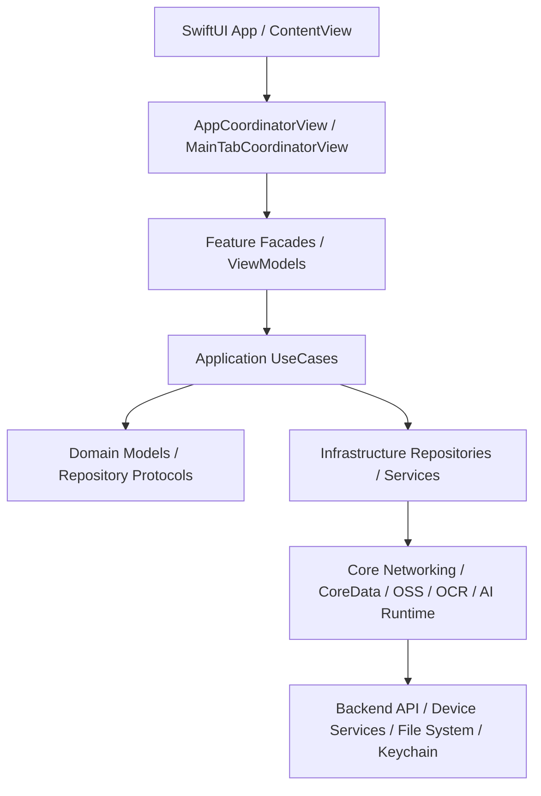

# SparkClient 项目汇总

## 1. 文档定位

本文是 SparkClient iOS 客户端的项目总领文档，用于给产品、客户端、后端和测试同学提供一份“以当前代码为准”的架构地图。

事实来源优先级：

| 来源 | 代表位置 |
| --- | --- |
| 当前可编译代码与工程配置 | `SparkClient.xcodeproj/project.pbxproj`、`SparkClient/Projects/` |
| 应用入口与组合根 | `SparkClient/Projects/App/Sources/SparkClientApp.swift`、`SparkClient/Projects/App/Sources/App/AppContainer.swift` |
| 网络、存储、运行时基础设施 | `SparkClient/Projects/Core/`、`SparkClient/Projects/Foundation/` |
| Feature 实现 | `SparkClient/Projects/Features/` |
| 自动化测试 | `SparkClient/Tests/` |
| 既有专项需求文档 | `需求文档/` |

专项文档当前仍保留在 `需求文档/` 下；本目录 `总领文档/` 用于承接跨模块总览和后续模块级主体需求。医院 Demo 的目标方案见 `总领文档/医院智能体与医生工作台/医院演示客户端产品与接入方案.md` 和 `医院演示客户端 Plain Text UI 原型.md`，后端契约以 SparkService 同名专题为准。

## 2. 项目概览

### 2.1 项目定位

SparkClient 是一个面向家庭健康管理的 iOS 客户端。当前代码覆盖登录与账号、家庭成员、医疗档案、病历/报告上传识别、AI 对话、知识库、科普内容、饮食营养、家庭药箱、任务提醒、通知分享和自定义相机等能力。

从实体和功能命名看，核心业务对象包括：

| 业务对象 | 代表代码 |
| --- | --- |
| 用户会话 | `SparkClient/Projects/Core/Domain/Entities/UserSession.swift` |
| 家庭成员 | `SparkClient/Projects/Core/Domain/Entities/Member.swift` |
| 医疗记录与病例 | `SparkClient/Projects/Core/Domain/Entities/MedicalRecord.swift`、`SparkClient/Projects/Core/Domain/Entities/MedicalCase.swift` |
| 检查/体检/处方/用药 | `SparkClient/Projects/Core/Domain/Entities/ExaminationReport.swift`、`SparkClient/Projects/Core/Domain/Entities/HealthExamReport.swift`、`SparkClient/Projects/Core/Domain/Entities/Prescription.swift`、`SparkClient/Projects/Core/Domain/Entities/MedicationRecord.swift` |
| AI 对话线程 | `SparkClient/Projects/Core/Domain/Entities/ChatThread.swift` |
| 任务与提醒 | `SparkClient/Projects/Features/Task/Domain/Task.swift`、`SparkClient/Projects/Core/Domain/Entities/MedicationPlan.swift` |

### 2.2 当前架构形态

当前实现是以 SwiftUI 为主、少量 UIKit/Objective-C 兼容代码并存的模块化单体 iOS 应用。架构形态接近“分层 + Feature Slice”的混合形态：

- `App` 层负责入口、生命周期、组合根、路由和全局装配。
- `Features/<Feature>/{Presentation,Application,Domain,Infrastructure}` 按功能切片组织。
- `Core` 放置跨 Feature 的领域实体、网络、数据库、AI/OCR/OSS/FileStorage/Notification 等基础能力。
- `Foundation` 放置更底层的日志、Keychain、工具和扩展。

该判断来自 `AppContainer` 中对 Assembly、Repository、UseCase、ViewModel 和运行时 Store 的集中装配，以及各 Feature 内的四层目录结构。项目不是微服务，也不是纯 Clean Architecture；有些能力仍直接依赖 `Backend` 或共享 Store，因此更准确地称为“模块化单体客户端”。

### 2.3 架构原则

| 原则 | 当前实现 |
| --- | --- |
| 组合根集中装配 | `AppContainer.live()` 构建 CoreData、Backend、Repository、UseCase、Coordinator、ViewModel |
| UI 不直接创建基础设施 | View 多通过 facade、ViewModel 和依赖包接入业务 |
| 登录态是根分流条件 | `AppLifecycleCoordinator.sessionState` 决定登录页、引导页、主 Tab |
| 账号级运行时统一重置 | `AccountSessionRuntime` 与 `StorageRegistry` 处理账号切换、登出清理 |
| 网络错误统一映射 | `SparkNetworkEngine` 负责鉴权刷新、重试、ETag、业务错误解码 |
| 医疗/AI/文件等副作用集中编排 | `MedicalSyncService`、`AIRuntimeService`、`FileTransferService`、`OCROrchestrator` |

## 3. 项目目录结构

```text
SparkClient/
├── SparkClient.xcodeproj/
├── SparkClient/
│   ├── Info.plist
│   ├── SparkClient.entitlements
│   ├── Base.lproj/
│   ├── Projects/
│   │   ├── App/
│   │   │   ├── Sources/
│   │   │   ├── Presentation/
│   │   │   └── Resources/
│   │   ├── Core/
│   │   │   ├── Domain/
│   │   │   ├── Networking/
│   │   │   ├── Database/
│   │   │   ├── AI/
│   │   │   ├── AIRuntime/
│   │   │   ├── OCR/
│   │   │   ├── OSS/
│   │   │   ├── FileStorage/
│   │   │   ├── Notification/
│   │   │   └── UI/
│   │   ├── Features/
│   │   │   ├── Auth/
│   │   │   ├── AccountManagement/
│   │   │   ├── Home/
│   │   │   ├── MemberContext/
│   │   │   ├── MedicalRecord/
│   │   │   ├── MedicalDocumentUpload/
│   │   │   ├── Chat/
│   │   │   ├── Knowledge/
│   │   │   ├── Memory/
│   │   │   ├── PopularScience/
│   │   │   ├── Nutrition/
│   │   │   ├── AISettings/
│   │   │   ├── CustomCamera/
│   │   │   ├── Share/
│   │   │   ├── Task/
│   │   │   └── Settings/
│   │   └── Foundation/
│   └── Tests/
├── Vendor/
│   └── LLM.swift/
├── 需求文档/
└── 总领文档/
```

### 3.1 目录职责边界

| 目录 | 职责 | 不应承担的职责 |
| --- | --- | --- |
| `SparkClient/Projects/App` | App 入口、组合根、全局生命周期、路由、主 Tab、资源和本地化 | 具体业务规则、远端 API 细节 |
| `SparkClient/Projects/Core/Domain` | 跨模块领域实体和协议 | UI 展示状态、网络 DTO 细节 |
| `SparkClient/Projects/Core/Networking` | 统一网络引擎、API 客户端、缓存、WebSocket、错误映射 | ViewModel 状态和页面跳转 |
| `SparkClient/Projects/Core/Database` | Core Data 栈 | 具体页面读写逻辑 |
| `SparkClient/Projects/Core/AI` / `AIRuntime` | AI 配置、模型解析、推理网关、工具编排 | 登录态、成员 UI |
| `SparkClient/Projects/Core/OCR` | OCR 引擎选择、融合、预处理和纠错 | 上传流程页面状态 |
| `SparkClient/Projects/Core/OSS` / `FileStorage` | OSS 凭证、上传下载、缓存和文件模型 | 医疗实体归属判断 |
| `SparkClient/Projects/Core/Notification` | 应用内通知、远程推送适配、队列、指标和收件箱 | 业务页面内部状态 |
| `SparkClient/Projects/Features/*` | 按业务模块封装 Presentation/Application/Domain/Infrastructure | 全局组合根和跨模块公共基础设施 |
| `SparkClient/Projects/Foundation` | 日志、Keychain、系统信息、原子写入、扩展 | 业务流程编排 |
| `SparkClient/Tests` | 单元测试和架构门禁测试 | 生产代码 |
| `需求文档` | 历史与专项需求、详设、工单 | 新的跨模块总领结构 |

## 4. 应用分层与依赖方向



允许的依赖方向：

| 调用方 | 允许依赖 |
| --- | --- |
| `App` | `Core`、`Foundation`、各 Feature 的 Assembly/facade/ViewModel |
| `Features/Presentation` | 本 Feature ViewModel、跨模块 Store、通用 UI |
| `Features/Application` | Domain、Repository 协议、必要的 Core 服务 |
| `Features/Domain` | 领域模型、协议、纯规则 |
| `Features/Infrastructure` | Core Networking、CoreData、FileStorage、OSS、OCR、AI Runtime |
| `Core` | Foundation、系统框架、底层 SDK |

需要避免的依赖：

- Feature A 的 Presentation 直接操作 Feature B 的 Infrastructure。
- UI 直接拼接 API path 或直接读写 Keychain。
- 登录态、账号 ID、选中成员出现多个事实源。
- 业务模块绕过 `SparkNetworkEngine` 自行实现 token 刷新和错误映射。

## 5. 应用启动与全局生命周期

### 5.1 启动链路

```text
SparkClientApp
  -> AppContainer.live()
  -> ContentView
  -> NotificationHostView
  -> AppCoordinatorView
  -> NetworkPathMonitor 评估网络
  -> AppLifecycleCoordinator.bootstrapLaunchAfterNetworkEvaluation()
  -> AppSessionStore.restoreIfNeeded()
  -> AppBootstrapper.bootstrapAppLaunchIfNeeded()
  -> 设备登记 / 账号准备 / onboarding / 主 Tab
```

已登录账号准备链路：

```text
会话恢复或登录成功
  -> AccountSessionRuntime.activateUser(accountID)
  -> OnboardingStore.activate(session)
  -> DeviceRegistrationCoordinator.requestRegisterWithLimitedRetry()
  -> AppBootstrapper.bootstrapIfNeeded(for:)
  -> HomeViewModel.loadInitialIfNeeded(syncRemote: true)
  -> TaskRuntimeSyncing.syncIncremental()
  -> MedicationReminderSyncCoordinator.requestRebuild()
```

### 5.2 关键代码

| 责任 | 代码位置 |
| --- | --- |
| SwiftUI 入口 | `SparkClient/Projects/App/Sources/SparkClientApp.swift` |
| 根内容包装 | `SparkClient/Projects/App/Sources/ContentView.swift` |
| 组合根 | `SparkClient/Projects/App/Sources/App/AppContainer.swift` |
| 根分流 | `SparkClient/Projects/App/Sources/App/AppCoordinatorView.swift` |
| 生命周期协调 | `SparkClient/Projects/App/Sources/App/Architecture/AppLifecycleCoordinator.swift` |
| 账号级运行时 | `SparkClient/Projects/App/Sources/App/Architecture/AccountSessionRuntime.swift` |
| 路由协调 | `SparkClient/Projects/App/Sources/App/Architecture/RouteCoordinator.swift` |
| 启动引导 | `SparkClient/Projects/App/Sources/App/AppBootstrapper.swift` |
| 主 Tab | `SparkClient/Projects/App/Sources/App/MainTabCoordinatorView.swift` |
| 远程推送入口 | `SparkClient/Projects/App/Sources/App/SparkApplicationDelegate.swift` |

### 5.3 启动设计要求

- 网络路径未完成评估前显示启动页；网络不可用时显示 `NetworkGateView`。
- 冷启动引导通过 `didBootstrapLaunch` 去重。
- 已登录账号准备通过 `SignedInSessionPreparationRegistry` 避免重复准备同一账号。
- 设备登记失败会阻断后续账号级引导，避免在身份未准备好时加载业务。
- 鉴权失效从网络层发出通知，由 `RouteCoordinator` 转交 `AppLifecycleCoordinator` 强制回到未登录态。
- 登出和账号切换清理不散落在页面中，统一进入 `AccountSessionRuntime` 与 `StorageRegistry`。

## 6. 核心模块地图

### 6.1 基础工程与运行环境

- 主体文档：`总领文档/基础工程与运行环境/基础工程与运行环境需求.md`
- 职责：Xcode 工程、SwiftUI App 入口、环境配置、资源、本地化、日志、兼容层。
- 关键代码：`SparkClient.xcodeproj/project.pbxproj`、`SparkClient/Projects/App/Resources/`、`SparkClient/Projects/Foundation/Utilities/Logger.swift`、`SparkClient/Projects/Core/Concurrency/IOS16CompatAsyncActions.swift`。
- 技术方案：SwiftUI 生命周期 + UIKit AppDelegate 适配；`AppEnvironment` 按 DEBUG/STAGING/production 切换 API、站点、日志、OCR 配置。
- 当前缺口：未在本次审计中确认 CI 配置；UI 测试未发现。

### 6.2 会话、认证与账号

- 主体文档：`总领文档/会话、认证与账号/会话、认证与账号需求.md`
- 职责：Apple 登录、手机号验证码、设备游客账号、会话恢复、退出、账号绑定/修改、注销和服务端鉴权失效处理。
- 关键代码：`Features/Auth/`、`Features/AccountManagement/`、`Core/Domain/Entities/UserSession.swift`、`Core/Networking/AuthTokenProvider.swift`、`Foundation/Security/SparkKeychain.swift`。
- 技术方案：UseCase + Repository；token 由 `AuthTokenProvider` 支持刷新；根生命周期监听会话状态并触发账号运行时准备。
- 测试：`Tests/Networking/AuthSessionInvalidationTests.swift`、`Tests/AccountManagement/EmailAddressNormalizerTests.swift`、`Tests/AccountManagement/PhoneNumberNormalizerTests.swift`。

### 6.3 启动、导航与全局生命周期

- 主体文档：`总领文档/启动、导航与全局生命周期/启动、导航与全局生命周期需求.md`
- 职责：冷启动、网络门禁、主 Tab 分流、typed route graph、深链、通知路由、前台恢复、版本更新。
- 关键代码：`AppCoordinatorView.swift`、`AppRouteStore.swift`、`RouteCoordinator.swift`、`LaunchIntentCoordinator.swift`、`AppVersionUpdateCoordinator.swift`。
- 技术方案：`AppRoute` 表示可跳转目标；深链和远程通知先被解析成 typed route，再写入 `AppRouteStore`。
- 当前缺口：路由覆盖更多业务入口后，需要补足 route parser 的回归测试。

### 6.4 首页、成员与医疗画像

- 主体文档：`总领文档/首页、成员与医疗画像/首页、成员与医疗画像需求.md`
- 专项文档：
  - [首页医疗接口.md](./首页、成员与医疗画像/首页医疗接口.md)
  - [首页医疗数据缓存.md](./首页、成员与医疗画像/首页医疗数据缓存.md)
  - [首页成员模块.md](./首页、成员与医疗画像/首页成员模块.md)
  - [医疗检查报告.md](./首页、成员与医疗画像/医疗检查报告.md)（检验/影像/病理；与体检报告分离）
- 职责：首页医疗概览、成员建档、成员选择、成员绑定/分享、医疗画像投影和模块入口；检查报告列表/详情/懒加载/单字段回写。
- 关键代码：`Features/Home/`、`Features/MemberContext/`、`Core/Domain/Entities/Member.swift`、`Core/Domain/Entities/ExaminationReport.swift`、`Core/Networking/API/Medical/`。
- 技术方案：成员上下文由 `MemberContextStore` 共享；首页 complete-data 驱动四类卡片；成员模块配置控制医疗/饮食分区显隐；检查报告列表首屏注入 `examinationReports`，下拉只刷新 `kind=examination-reports` 并 patch 首页缓存。
- 测试：`Tests/Home/AddFamilyMemberViewModelTests.swift`、`Tests/Home/ExaminationReportsListTimelineTests.swift`（成员模块分区显隐专项测试当前缺失）。

### 6.5 医疗档案与文档上传

- 主体文档：`总领文档/医疗档案与文档上传/医疗档案与文档上传需求.md`
- 职责：医疗记录、外部 PDF 打开导入、拍照/文件选择、文件上传、OCR/AI 结构化抽取、结果确认、workflow 保存和附件绑定。
- 关键代码：`Features/MedicalRecord/`、`Features/MedicalDocumentUpload/`、`App/Sources/App/ExternalMedicalDocumentImportCoordinator.swift`、`Core/Networking/API/Medical/`。
- 技术方案：上传流程拆成选择、上传、识别、预提交校验、保存和绑定；抽取失败由 `MedicalExtractionFailureClassifier` 与重试设置分类处理。
- 测试：`Tests/MedicalDocumentUpload/` 下覆盖输入来源、预提交校验、处方候选和识别前校验。

### 6.6 家庭药箱、任务与提醒

- 主体文档：`总领文档/家庭药箱、任务与提醒/家庭药箱、任务与提醒需求.md`
- 职责：家庭药箱、用药计划、任务中心、任务同步、本地提醒重建。
- 关键代码：`Features/Task/`、`Core/Domain/Entities/MedicineBox.swift`、`MedicationPlan.swift`、`MedicationRecord.swift`、`AppContainer.medicationReminderSyncCoordinator`。
- 技术方案：任务通过 `TaskManager` / `TaskService` 远端同步；本地提醒在已登录引导和前台恢复时按成员上下文重建。
- 当前缺口：任务模块代码量较小，复杂用药执行状态的测试覆盖本次未发现。

### 6.7 对话、AI Runtime 与工具调用

- 主体文档：`总领文档/对话、AI Runtime 与工具调用/对话、AI Runtime 与工具调用需求.md`
- 专项文档：`对话线程与消息读模型需求.md`、`消息发送、附件与同步管线需求.md`、`消息卡片UI、对话列表.md`、`AI Runtime 推理编排需求.md`、`工具调用与审计需求.md`、`问报告与健康资源上下文需求.md`
- 职责：聊天线程、消息历史、发送、失败重试、附件管线、流式模型、工具调用、问报告；以及线程列表页、消息气泡与富内容卡片 UI。
- 关键代码：`Features/Chat/`、`Core/AIRuntime/ChatOrchestrator.swift`、`Core/AIRuntime/AIRuntimeService.swift`、`Core/AIRuntime/ToolHub/`。
- 技术方案：聊天分为 Query、UseCase、Sync Supervisor、Inbound/Outbox Pipeline、CoreData Repository；Presentation 为 SwiftUI 线程列表 + UIKit Diffable 消息宿主 + MessageCards；AI Runtime 可接 OpenAI 兼容网关或本地 GGUF。
- 测试：`Tests/Chat/ChatArchitectureGateTests.swift`、`ChatToolEventInterpreterTests.swift`、`ChatToolRuntimeAttachmentBuilderTests.swift`、`ChatMessageMetadataTests.swift`（列表/卡片 UI 专项测试当前缺口）。

### 6.8 知识库、记忆与科普内容

- 主体文档：`总领文档/知识库、记忆与科普内容/知识库、记忆与科普内容需求.md`
- 职责：本地知识文档、编辑、导入、切块、Embedding、检索、长期记忆、科普内容列表与详情。
- 关键代码：`Features/Knowledge/`、`Features/Memory/`、`Features/PopularScience/`、`Core/Markdown/`。
- 技术方案：知识库使用 Core Data；Embedding 通过 OpenAI 兼容客户端；科普内容使用远端仓储 + JSON 文件缓存。
- 当前缺口：知识库导入、Embedding 构建和科普缓存的测试覆盖本次未发现。

### 6.9 AI 设置与本地模型

- 主体文档：`总领文档/AI 设置与本地模型/AI 设置与本地模型需求.md`
- 职责：Provider、模型、API Key、本地偏好、远程配置、场景策略、本地模型服务。
- 关键代码：`Features/AISettings/`、`Core/AI/`、`Vendor/LLM.swift/`。
- 技术方案：`AIConfigCenter` 合并本地设置和远程配置；`ScenarioPolicyResolver` 决定不同场景的模型能力；`LocalModelService` 连接本地 GGUF 推理。
- 测试：`Tests/AI/AISettingsAndResolverTests.swift`。

### 6.10 网络、文件、OSS 与同步基础设施

- 主体文档：`总领文档/网络、文件、OSS 与同步基础设施/网络、文件、OSS 与同步基础设施需求.md`
- 职责：统一网络、鉴权、重试、ETag、文件缓存、上传下载、OSS STS、医疗同步、账号级清理。
- 关键代码：`Core/Networking/`、`Core/FileStorage/`、`Core/OSS/`、`Core/Sync/MedicalSyncService.swift`、`App/Sources/App/Architecture/StorageRegistry.swift`。
- 技术方案：`SparkNetworkEngine` 统一执行串行门控、鉴权、ETag、重试、传输、解码和错误映射；文件上传下载通过 `FileTransferService` 复用 `backend.files` 与 OSS 运行时凭证。
- 测试：`Tests/Networking/SparkNetworkEngineTests.swift`。

### 6.11 OCR、相机与媒体能力

- 主体文档：`总领文档/OCR、相机与媒体能力/OCR、相机与媒体能力需求.md`
- 职责：自定义相机、SecondCamera、预览确认、媒体保存、OCR 引擎选择、医学图像预处理和术语纠错。
- 关键代码：`Features/CustomCamera/`、`Core/OCR/`、`Core/UI/ImagePicker/`。
- 技术方案：OCR 由 `OCROrchestrator` 统一协调 Vision、阿里云和本地服务引擎；环境配置控制不同构建下的 OCR 策略。
- 测试：`Tests/CustomCamera/SecondCameraReadOnlyPreviewStoreTests.swift`。

### 6.12 通知、分享与开放 Web

- 主体文档：`总领文档/通知、分享与开放 Web/通知、分享与开放 Web需求.md`
- 职责：应用内通知、远程推送、收件箱、成员二维码分享、附近分享、远程邀请、公开 Web 分享。
- 关键代码：`Core/Notification/`、`Features/Share/`、`Core/Networking/API/Medical/MedicalShareAPI.swift`、`AppEnvironment.openWebBaseURL`。
- 技术方案：通知先进入队列和 UseCase，再投递给 Store 与路由；分享支持二维码、附近 BLE 传输和远程邀请。
- 测试：`Tests/Notification/NotificationEnvelopeTests.swift`、`Tests/Share/`。

### 6.13 设置、安全与通用 UI

- 主体文档：`总领文档/设置、安全与通用 UI/设置、安全与通用 UI需求.md`
- 职责：设置页、同步偏好、通用输入组件、Markdown 渲染、Keychain、本地化、安全文档承接。
- 关键代码：`Features/Settings/`、`Core/UI/`、`Core/Markdown/`、`Foundation/Security/SparkKeychain.swift`、`App/Sources/App/L10n.swift`。
- 技术方案：Settings 目前主要承载同步偏好和通用入口；安全能力分散在 Keychain、网络鉴权、OSS 凭证和既有全加密通讯文档中。
- 当前缺口：安全专项仍需对照当前网络实现重新核对，避免旧文档漂移。

### 6.14 医院智能体与医生工作台（目标设计，尚未实现）

- 主体文档：`总领文档/医院智能体与医生工作台/医院演示客户端产品与接入方案.md`。
- 页面原型：`总领文档/医院智能体与医生工作台/医院演示客户端 Plain Text UI 原型.md`。
- 医生消息角色方案：`总领文档/医院智能体与医生工作台/医生直接消息与对方用户角色方案.md`。
- 服务端事实源：`SparkService/总领文档/医院智能体与医生工作台/服务端数据模型与接口契约.md`。
- 目标：增加医院首页、挂号能力声明、科室与院内医生智能体目录，并在现有对话中明确区分患者、AI 助手和真人医生。
- 复用边界：继续使用现有成员、ChatThread/Message/Block、ChatListViewModel、AI Runtime、知识库、记忆、报告解读和同步管线；不把 `AllModels` 当成医生实体。
- 患者身份：当前选中 Member 直接作为当前患者；切换患者就是现有切换成员流程，不新增 PatientStore 或第二个 memberID 事实源。
- 当前缺口：医院、科室、医生和挂号领域尚未实现；无 HIS 时只允许演示或跳转模式。

## 7. 关键业务流程

### 7.1 冷启动到主界面

```text
用户打开 App
  -> SparkClientApp 构建 AppContainer
  -> ContentView 挂载通知宿主和 AppCoordinatorView
  -> NetworkPathMonitor 检查网络
  -> AppSessionStore 恢复 Keychain/本地会话
  -> 未登录：登录页 + 游客运行时
  -> 已登录：账号运行时准备
  -> onboarding 未完成：OnboardingFlowView
  -> onboarding 完成：MainTabCoordinatorView
```

- 参与模块：基础工程、会话认证、启动导航、通知、首页成员。
- 成功结果：进入登录页、引导页或主 Tab。
- 失败和恢复：网络不可用时停留在 `NetworkGateView`；设备登记失败会中断账号准备；鉴权失效强制登出。
- 并发/幂等：冷启动和账号准备均有去重状态。

### 7.2 用户登录与账号准备

```text
LoginView
  -> LoginViewModel / LoginConductor
  -> Auth UseCase
  -> DefaultAuthRepository
  -> Backend.auth / Backend.otp / Backend.device
  -> AuthTokenProvider / SessionSnapshotStore 写入会话
  -> AppLifecycleCoordinator 观察 signedIn
  -> AccountSessionRuntime + AppBootstrapper + Home/Task 同步
```

- 成功结果：会话状态变为 signedIn，账号运行时就绪。
- 失败和恢复：验证码错误通过本地错误映射显示；token 刷新失败触发鉴权失效流程。
- 并发/幂等：token 刷新由 `AuthTokenProvider` 去重；账号准备通过 registry 去重。

### 7.3 医疗文档上传识别保存

```text
拍照 / 文件选择 / 外部 PDF 打开
  -> MedicalDocumentUploadViewModel
  -> UploadMedicalDocumentFilesUseCase
  -> FileTransferService / Backend.files / OSS
  -> ExtractTypedMedicalDocumentUseCase
  -> OCR / AI Runtime / 结构化 JSON 解码
  -> MedicalPreSubmitValidator
  -> SaveTypedMedicalDocumentUseCase
  -> SparkMedicalWorkflowAPI
  -> BindUploadedFilesToMedicalBusinessUseCase
  -> 首页/成员医疗数据刷新
```

- 成功结果：医疗实体落库，附件与业务对象绑定，相关列表可刷新。
- 失败和恢复：识别失败按可重试/不可重试分类；预提交校验阻断字段不完整结果；上传和保存失败需保留草稿态。
- 并发/幂等：当前文档未确认服务端幂等键；建议在上传保存链路专项文档中补齐。

### 7.4 聊天消息发送与 AI 工具调用

```text
ChatComposerView
  -> SendChatMessageUseCase
  -> CoreDataChatRepository 写本地 outbox
  -> ChatSyncSupervisor / ChatOutboxPipeline
  -> ChatOrchestrator
  -> AIRuntimeService
  -> ToolHub 可选调用医疗/知识/附件工具
  -> ChatInboundPipeline / ChatMergeEngine
  -> ChatDetailViewModel 更新 UI
```

- 成功结果：本地消息和模型回复合并到线程。
- 失败和恢复：失败气泡可进入 `RetryFailedMessageUseCase`；附件下载/上传由独立 pipeline 续跑。
- 并发/幂等：`MessageRunActor` 和同步管线承担串行化责任；具体幂等键需在聊天专项文档中继续核实。

### 7.5 深链、推送与冷启动目标页面

```text
onOpenURL / 推送点击 / 外部文件打开
  -> ContentView 或 SparkApplicationDelegate
  -> ExternalMedicalDocumentImportCoordinator 优先消费文件导入
  -> RouteCoordinator / LaunchIntentCoordinator
  -> AppRouteStore
  -> MainTabCoordinatorView 对应 Tab 和目标页面
```

- 成功结果：用户进入知识库、AI 设置、设置、聊天、成员邀请或首页等目标。
- 失败和恢复：无法识别深链会记录 warning；未登录或 onboarding 阻塞时由 LaunchIntent 等待 readiness。
- 并发/幂等：LaunchIntent 有合并动作模型，避免重复消费同类启动意图。

## 8. 数据、状态与持久化

### 8.1 状态分类

| 状态类型 | 示例 | 主要承载位置 |
| --- | --- | --- |
| 瞬时 UI 状态 | 输入框、sheet、上传步骤、筛选项 | 各 Feature `Presentation/*ViewModel.swift` |
| 会话状态 | loading/signedOut/signedIn、token | `AppSessionStore`、`UserSession`、`AuthTokenProvider`、`SessionSnapshotStore` |
| 账号运行时状态 | 当前账号、成员上下文、聊天状态、AI 配置缓存 | `AccountSessionRuntime`、`MemberContextStore`、`ChatStateStore`、`AIConfigCenter` |
| 领域状态 | 医疗记录、成员、处方、体检、任务、聊天线程 | `Core/Domain/Entities/`、各 Feature Domain |
| 持久化状态 | CoreData 文档/聊天/记忆、本地偏好 | `CoreDataStack`、`DefaultAISettingsRepository`、`UserDefaultsOnboardingStateRepository` |
| 文件和缓存状态 | 附件缓存、科普 JSON 缓存、ETag | `FileCacheManager`、`PopularScienceCacheStore`、`DeviceCache`、`ETagStore` |
| 敏感状态 | token、设备 ID、API Key 或凭证 | `SparkKeychain`、`AuthTokenProvider`、`SparkOSSConfigurationStore` |

### 8.2 持久化边界

| 数据类别 | 当前策略 |
| --- | --- |
| 敏感令牌 | Keychain 保存，登出由认证用例清理 |
| 设备 ID | Keychain/设备级存储，按 `StorageRegistry` 描述保留跨登出能力 |
| 账号数据 | CoreData 或 UserDefaults 按 accountID 隔离 |
| 文件缓存 | `FileCacheManager` 按账号上下文切换 |
| OSS STS | 内存运行时凭证，账号切换/登出清理 |
| 可重建缓存 | ETag、科普缓存、AI runtime cache 可通过远端或本地配置重建 |

## 9. 关键技术标准

### 9.1 并发与线程安全

- 根组合容器标记为 `@MainActor`，确保 UI 相关依赖在主线程装配。
- `SparkNetworkEngine` 使用 `SerialRequestGate` 按请求策略串行化关键请求。
- 启动、账号准备、任务同步和聊天同步都有去重或协调器，避免 SwiftUI `.task` 重入造成重复副作用。
- Swift6/iOS16 兼容问题已有专项工单：`需求文档/iOS16并发回部署兼容修复工单.md`、`需求文档/Swift6-Release归档EarlyPerfInliner编译器崩溃修复工单.md`。

### 9.2 错误与恢复

- 网络层统一把 HTTP、业务包裹错误、刷新失败、取消映射为 `SparkNetworkError`。
- 服务端鉴权失效由 `AuthSessionInvalidation` 广播，根生命周期做统一登出恢复。
- 医疗抽取错误由 `MedicalExtractionFailureClassifier`、`MedicalExtractionErrorNormalizer` 和重试设置处理。
- 启动阶段设备登记失败会阻断后续账号准备，避免半初始化状态。

### 9.3 安全

- token、设备身份和敏感凭证应集中走 Keychain/运行时凭证，不应散落在普通 `UserDefaults`。
- `SparkNetworkEngine` 统一注入 Authorization 和 X-Request-ID。
- OSS STS 通过 `SparkOSSConfigurationStore` 预取与刷新，不应在 Feature 层长期持有。
- 既有安全专项：`需求文档/安全/全加密通讯需求设计文档.md`。该文档需要按当前网络层重新核对。

### 9.4 可观测性

- 日志通过 `Logger` / `ConsoleLogger` 与 `LogModule` 分模块输出。
- 网络请求带 `X-Request-ID`。
- 通知模块有 `NotificationMetricsStore`。
- 当前未发现统一崩溃上报、Trace 或 Metrics SDK 接入。

### 9.5 性能与资源

- 文件下载/上传有缓存和传输服务，避免页面直接管理大文件。
- AI 图片输入有压缩与多模态/OCR 降级策略。
- 自定义相机和 OCR 是资源敏感模块，需重点关注内存、主线程和相册权限。
- 聊天和知识库使用 CoreData，需要关注大线程、大消息和大文档切块的查询性能。

## 10. 测试策略

### 10.1 单元测试

已发现测试：

| 模块 | 测试文件 |
| --- | --- |
| AI 设置 | `SparkClient/Tests/AI/AISettingsAndResolverTests.swift` |
| 账号输入 | `SparkClient/Tests/AccountManagement/EmailAddressNormalizerTests.swift`、`PhoneNumberNormalizerTests.swift` |
| 聊天 | `SparkClient/Tests/Chat/ChatArchitectureGateTests.swift`、`ChatToolEventInterpreterTests.swift`、`ChatToolRuntimeAttachmentBuilderTests.swift`、`ChatMessageMetadataTests.swift` |
| 相机 | `SparkClient/Tests/CustomCamera/SecondCameraReadOnlyPreviewStoreTests.swift` |
| 首页 | `SparkClient/Tests/Home/AddFamilyMemberViewModelTests.swift`、`ExaminationReportsListTimelineTests.swift` |
| 医疗上传 | `SparkClient/Tests/MedicalDocumentUpload/MedicalExtractionInputSourceTests.swift`、`MedicalPreSubmitValidatorTests.swift`、`PrescriptionMedicineBoxCandidateTests.swift`、`PrescriptionPreSubmitValidationTests.swift` |
| 网络 | `SparkClient/Tests/Networking/AuthSessionInvalidationTests.swift`、`SparkNetworkEngineTests.swift` |
| 通知 | `SparkClient/Tests/Notification/NotificationEnvelopeTests.swift` |
| 分享 | `SparkClient/Tests/Share/MemberShareDeepLinkParserTests.swift`、`NearbySharePayloadCodecTests.swift`、`PendingMemberShareTicketStoreTests.swift` |

### 10.2 集成测试

本次审计未发现独立集成测试目录。建议优先补以下集成级验证：

- 登录成功到账号准备完成。
- 医疗文档上传、识别、保存、绑定全链路。
- 聊天消息 outbox、模型响应、工具调用和 merge。
- 推送/深链到目标页面。

### 10.3 UI/端到端测试

本次审计未发现 UI Test target 或端到端测试脚本。当前 UI 风险最高的模块是自定义相机、医疗上传、聊天、成员建档和账号管理。

### 10.4 当前测试缺口

- CoreData migration 和账号切换数据隔离。
- OSS STS 失效、续期和后台回调线程。
- OCR 多引擎降级和结构化 JSON 边界。
- 任务和本地提醒的系统权限/时间变更场景。
- AI Runtime 多 provider、多模态、本地模型失败恢复。

## 11. 现有专项文档与总览关系

| 专项目录 | 对应总领模块 |
| --- | --- |
| `总领文档/首页、成员与医疗画像/首页医疗接口.md` | 首页、成员与医疗画像（complete-data 与卡片） |
| `总领文档/首页、成员与医疗画像/首页医疗数据缓存.md` | 首页、成员与医疗画像（内存缓存与字段 patch） |
| `总领文档/首页、成员与医疗画像/首页成员模块.md` | 首页、成员与医疗画像（模块开通与分区显隐） |
| `总领文档/首页、成员与医疗画像/医疗检查报告.md` | 首页、成员与医疗画像（检验/影像/病理检查报告） |
| `需求文档/启动` | 启动、导航与全局生命周期 |
| `需求文档/账号` | 会话、认证与账号 |
| `需求文档/成员管理`、`需求文档/成员多用户绑定与分享需求文档` | 首页、成员与医疗画像；通知、分享与开放 Web |
| `需求文档/医疗档案` | 医疗档案与文档上传；通知、分享与开放 Web |
| `需求文档/家庭药箱` | 家庭药箱、任务与提醒 |
| `需求文档/对话` | 对话、AI Runtime 与工具调用 |
| `需求文档/科普` | 知识库、记忆与科普内容 |
| `需求文档/饮食营养` | 首页、成员与医疗画像；家庭药箱、任务与提醒 |
| `需求文档/相机` | OCR、相机与媒体能力 |
| `需求文档/数据模型` | 医疗档案、首页成员、聊天、任务等共享领域 |
| `需求文档/安全` | 设置、安全与通用 UI；网络、文件、OSS 与同步基础设施 |
| `需求文档/通用` 和 Swift/iOS 兼容工单 | 基础工程与运行环境 |

建议阅读顺序：

1. 先读本文。
2. 再进入 `总领文档/<模块>/<模块>需求.md` 看模块主体。
3. 最后按工单或历史背景补读 `需求文档/` 下专项。

## 12. 实现顺序与演进建议

### 第一阶段：基础闭环

- 固化 `AppContainer`、`AppLifecycleCoordinator`、`RouteCoordinator` 的边界，避免新业务把启动副作用散落到 View。
- 为 `StorageRegistry` 补文档和测试，确认账号切换、登出、游客模式的数据隔离。
- 梳理 `AppEnvironment` 中 debug/staging/production 的 API、Web、OCR 配置，避免发布包误用 debug 地址。

### 第二阶段：核心业务

- 优先完善医疗文档上传识别保存链路的专项文档和集成测试。
- 明确成员上下文作为首页、聊天、医疗档案共同事实源的读写规则。
- 对聊天同步和工具调用建立端到端回归样例。

### 第三阶段：扩展能力

- 把知识库、长期记忆、科普内容和 AI Runtime 的边界写清：哪些数据本地持久化，哪些仅远端缓存，哪些可以被模型读取。
- 补齐分享和开放 Web 的权限、过期、撤销、分享对象边界。
- 对任务和提醒补系统权限、时区、账号切换、成员删除后的清理规则。

### 第四阶段：质量完善

- 增加 UI Test 或可脚本化验收覆盖登录、首页、上传、聊天、分享。
- 对 OCR、OSS、CoreData migration、AI Runtime 做失败注入测试。
- 建立旧 `需求文档/` 到新 `总领文档/` 的维护规范，减少文档漂移。

### 12.1 演进边界

| 建议 | 收益 | 代价 | 触发条件 |
| --- | --- | --- | --- |
| 为每个一级模块补完整主体需求 | 团队可按模块交接和验收 | 需要持续读取代码补细节 | 新功能进入排期或重构前 |
| 建立启动/账号准备集成测试 | 降低登录态和冷启动回归 | 需要 mock 网络、设备登记和通知 | 频繁改动启动链路时 |
| 抽取共享 API 错误模型文档 | 后端和客户端对齐错误恢复 | 需要核对服务端业务码 | 新增高风险流程时 |
| 清理旧文档漂移 | 减少误读历史工单 | 需要人工判断旧结论是否废弃 | 模块主体文档稳定后 |

## 13. 架构验收清单

- [x] 入口和组合根位置清晰：`SparkClientApp`、`ContentView`、`AppContainer`。
- [x] 根生命周期有统一协调器：`AppLifecycleCoordinator`。
- [x] typed route graph 有统一入口：`RouteCoordinator`、`AppRouteStore`。
- [x] 网络请求统一经过 `SparkNetworkEngine`。
- [x] 账号级清理策略已有集中注册表：`StorageRegistry`。
- [x] 核心模块目录和主体需求文档已创建在 `总领文档/`。
- [ ] 每个主体需求文档已补齐真实流程、状态、错误和验收标准。
- [ ] 医疗上传、聊天、账号准备已有集成测试。
- [ ] UI/端到端测试覆盖核心用户路径。
- [ ] 旧 `需求文档/` 已逐项标注有效、已废弃或已迁移。
