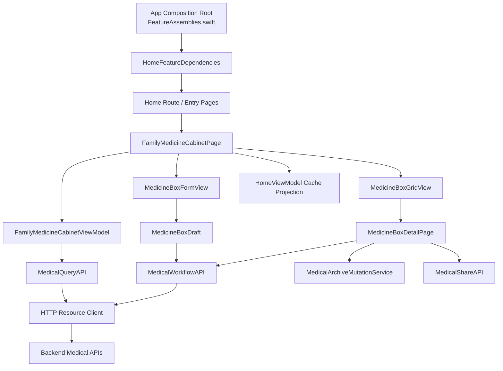
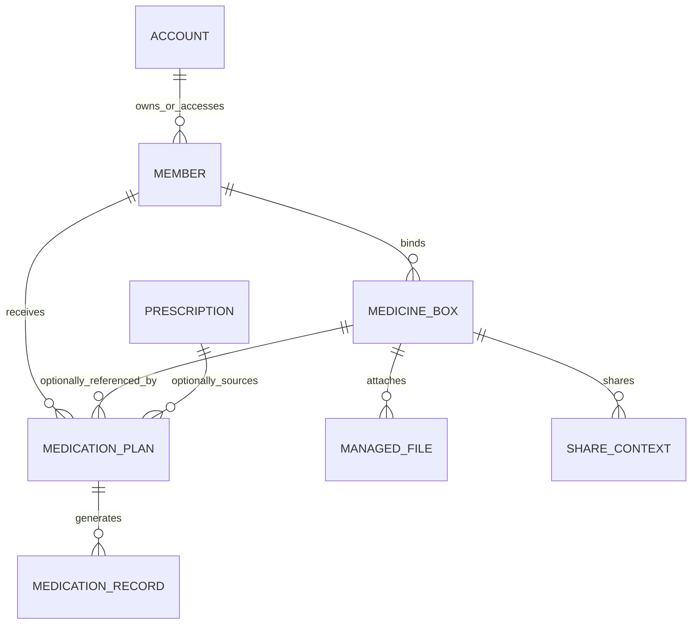

# 家庭药箱、个人药箱需求

> 本文记录 `SparkClient` 当前 iOS 实现中“家庭药箱”和“个人药箱”的页面、数据、接口与缓存边界。结论以当前代码为准；涉及后端权限语义但未在本仓库实现的部分标记为“依赖服务端确认”。

## 一、模块目标

药箱模块用于维护成员可使用的药品库存，并提供两种视图：

- 家庭药箱：以入口成员为范围，汇总创建者名下全部成员药品和公共药品，并支持按归属成员筛选。
- 个人药箱：只展示入口成员绑定的药品，供成员医疗档案和用药执行中心使用。

两种模式共用药品卡片、表单、详情、编辑、删除、归档、附件和分享能力；模式差异由 `MedicineBoxMode` 控制，不重复实现两套页面。

本模块只负责“药品库存/药箱条目”，不负责服药计划的周期计算、服药记录生成和提醒调度；这些能力由用药计划与任务提醒模块负责。

## 二、家庭药箱、个人药箱模块结构

### 2.1 结构职责表

| 层级 | 当前职责 | 关键代码 |
|---|---|---|
| 首页/入口 | 从首页医疗路由、成员医疗列表或用药执行中心进入药箱，并注入首页缓存和共享依赖 | `Projects/Features/Home/Presentation/HomeMedicalRouteSupport.swift`、`Projects/Features/Home/Presentation/MedicalLists/Medications/MedicationsListPage.swift`、`Projects/Features/Home/Presentation/MedicalLists/Medications/MedicationExecutionCenter/MedicationExecutionCenterPage.swift` |
| Feature UI | 展示家庭/个人模式、成员筛选、类型 Tab、搜索、网格、刷新、创建入口和 OCR 上传入口 | `Projects/Features/Home/Presentation/MedicalLists/Medications/MedicineBox/FamilyMedicineCabinetPage.swift`、`MedicineBoxGridView.swift` |
| Feature 状态 | 管理列表、筛选条件、加载锁、错误和父页面缓存同步 | `Projects/Features/Home/Presentation/MedicalLists/Medications/MedicineBox/FamilyMedicineCabinetViewModel.swift` |
| 编辑与详情 | 编辑字段、上传附件、创建/更新、详情展示、删除、归档和分享 | `MedicineBoxFormView.swift`、`MedicineBoxDetailPage.swift` |
| Domain | 定义药箱字段及模式值；表单 Draft 负责 UI 输入到 API 请求体的转换 | `Projects/Core/Domain/Entities/MedicineBox.swift`、`MedicineBoxDraft.swift`、`MedicineBoxMode.swift` |
| Query/API | 家庭汇总、个人列表、详情查询，以及资源类型 `medicine-boxes` 的请求映射 | `Projects/Core/Networking/API/Medical/MedicalQueryAPI.swift`、`MedicalSyncAPI.swift`、`MedicalWorkflowAPI.swift` |
| Storage/Cache | 使用首页 `RemoteMemberCompleteData` 的 `medicineBoxes`/`familyMedicineBoxes` 作为内存投影；未发现药箱专用本地数据库 | `MedicalSyncAPI.swift`、`HomeViewModel.swift` |
| 测试 | 当前只有处方 OCR 结果与药箱候选绑定测试，未发现家庭/个人药箱页面或 ViewModel 的直接测试 | `Tests/MedicalDocumentUpload/PrescriptionMedicineBoxCandidateTests.swift` |

### 2.2 具体目录结构

```text
SparkClient/
├── SparkClient/Projects/Core/Domain/Entities/
│   └── MedicineBox.swift
├── SparkClient/Projects/Core/Networking/API/Medical/
│   ├── MedicalQueryAPI.swift
│   ├── MedicalSyncAPI.swift
│   ├── MedicalWorkflowAPI.swift
│   └── SparkMedicalResourceKind.swift
├── SparkClient/Projects/Features/Home/Presentation/
│   ├── HomeMedicalRouteSupport.swift
│   └── MedicalLists/Medications/
│       ├── MedicationsListPage.swift
│       ├── MedicationExecutionCenter/MedicationExecutionCenterPage.swift
│       └── MedicineBox/
│           ├── FamilyMedicineCabinetPage.swift
│           ├── FamilyMedicineCabinetViewModel.swift
│           ├── MedicineBoxMode.swift
│           ├── MedicineBoxGridView.swift
│           ├── MedicineBoxCardView.swift
│           ├── MedicineBoxFormView.swift
│           ├── MedicineBoxDraft.swift
│           ├── MedicineBoxDetailPage.swift
│           └── MedicineBoxListPage.swift
└── SparkClient/Tests/
    └── MedicalDocumentUpload/PrescriptionMedicineBoxCandidateTests.swift
```

### 2.3 目录职责与依赖方向

当前实现是 SwiftUI Feature Slice + Core API/Domain 的混合分层：入口页面注入 `HomeFeatureDependencies`，页面持有 `FamilyMedicineCabinetViewModel`；ViewModel 直接依赖 `SparkMedicalQueryAPI`，表单和详情直接依赖 `SparkMedicalWorkflowAPI`。当前未单独分出药箱 Repository、UseCase 或独立本地 Storage 层。

依赖方向为：

```text
首页/用药执行中心入口
  → FamilyMedicineCabinetPage
  → FamilyMedicineCabinetViewModel → SparkMedicalQueryAPI → HTTP/资源 API
  → MedicineBoxFormView → MedicineBoxDraft → SparkMedicalWorkflowAPI
  → MedicineBoxDetailPage → delete/archive/share API
  → 页面回调 → HomeViewModel / 上层用药缓存
```

## 三、功能模块

### 3.1 家庭药箱

#### 需求说明

家庭模式由 `FamilyMedicineCabinetPage(mode: .family)` 提供。它以 `entryMemberID` 为查询范围，展示创建者名下所有成员药品和 `member == nil` 的公共药品。页面显示成员筛选、药品类型 Tab、关键字搜索、双列网格、刷新、归档入口、新建入口和拍照识别入口。

#### 基础要求与业务规则

- 家庭模式允许药品绑定到某个成员，也允许绑定为家庭公共药品。
- 成员筛选包含全部、家庭公共和实际返回数据中出现的成员；不为没有药品的成员强行创建筛选项。
- 类型筛选和搜索在客户端基于当前列表执行；搜索字段为药品名、品牌、规格和剂型。
- 列表按 `updatedAt` 倒序展示。
- 首页已有 `familyMedicineBoxes` 时先展示缓存；缓存为空或不存在时进入页面加载。
- 家庭模式加载成功后回写首页 `RemoteMemberCompleteData.familyMedicineBoxes`；加载失败时保留已有缓存。

#### 验收标准

- 能从首页医疗入口打开家庭药箱，并正确显示家庭标题。
- 公共药品和成员药品都可展示、筛选和进入详情。
- 切换成员筛选、类型 Tab、搜索条件不会改变服务端数据。
- 下拉刷新成功后列表和首页家庭药箱缓存一致；失败时列表不被清空。
- 新建、编辑、删除、归档后当前列表与首页缓存立即同步。

#### 技术细节与设计代码位置

- 入口：`Projects/Features/Home/Presentation/HomeMedicalRouteSupport.swift` 的 `familyMedicineCabinetView`。
- 页面与模式：`FamilyMedicineCabinetPage.swift`、`MedicineBoxMode.swift`。
- 状态与加载：`FamilyMedicineCabinetViewModel.swift` 的 `load()`、`filteredBoxes`、`memberFilterOptions()`。
- 家庭查询：`Projects/Core/Networking/API/Medical/MedicalQueryAPI.swift` 的 `listFamilyMedicineCabinet(memberID:)`，请求 `/api/v1/medical/medicine-cabinet/summary/`，客户端设置 `etagTTL: 120`。
- 缓存回写：`FamilyMedicineCabinetPage.swift` 的 `notifyParentCompleteDataIfFamily()`。

### 3.2 个人药箱

#### 需求说明

个人模式复用同一页面，调用方式为 `FamilyMedicineCabinetPage(mode: .personal, entryMemberID: memberID)`。页面只加载当前成员药箱，不显示家庭成员筛选，创建表单默认将药品绑定到当前成员，适合成员医疗列表和用药执行中心中“添加药品”的流程。

#### 基础要求与业务规则

- 个人模式只使用 `entryMemberID` 查询和创建药箱数据。
- 进入页面时优先展示上游传入的 `initialMedicineBoxes`，再后台刷新。
- 个人模式不允许创建家庭公共药品；表单绑定成员固定为入口成员。
- 页面变更通过 `onMedicineBoxesChanged` 回写上游缓存，例如用药执行中心的药箱列表。
- 个人模式仍可进入归档列表；归档列表使用 `MedicineBoxListPage` 和 `archived` 查询参数。

#### 验收标准

- 从成员医疗列表或用药执行中心进入时只显示当前成员药品。
- 页面加载失败时保留传入的缓存内容，并给出可见错误提示。
- 新建药品的 `member` 为当前成员，不会误写为公共药品。
- 编辑、删除、归档成功后，上游药箱缓存收到更新。
- 个人模式不出现家庭成员筛选控件。

#### 技术细节与设计代码位置

- 入口：`MedicationsListPage.swift`、`MedicationExecutionCenterPage.swift`、`MedicationExecutionLogSheet.swift`。
- 查询：`MedicalQueryAPI.listMedicineBoxes(memberID: archived:)`，资源类型为 `.medicineBoxes`，支持 `medicine_type`、`expire_before`、`low_stock` 和归档状态参数。
- 默认绑定：`FamilyMedicineCabinetPage.swift` 的 `defaultBindingMemberID`；保存时由 `MedicineBoxFormView` 传入 `bindingMemberID: entryMemberID`。
- 上游同步：`notifyParentIfPersonal()` 调用 `onMedicineBoxesChanged`，按更新时间倒序回写。

### 3.3 药品创建、编辑与附件

#### 需求说明

用户可以手动创建或编辑药品，填写药品名称、类型、品牌、剂型、规格、单次剂量单位、总数量、有效期和备注，并可添加附件。药品识别结果也可进入同一表单或详情链路继续确认。

#### 基础要求与业务规则

- 药品名称是当前客户端明确校验的必填字段。
- 总数量为空时传 `nil`；非空必须能解析为 `Double`，否则阻止提交。
- 有效期通过日期开关控制，启用时按日期字符串提交。
- 规格由 `MedicineSpecification` 维护结构化输入，并编码为后端 `strength` 与 `dose_unit` 字段；兼容旧的自由文本规格。
- 待上传附件先通过 `UploadMedicalDocumentFilesUseCase` 上传，再把已有和新上传文件 ID 合并提交。
- 创建和更新使用同一个 `MedicineBoxWritePayload`；提交期间通过 `isSubmitting` 防止重复提交。

#### 验收标准

- 空药品名和非法数量不能发起请求。
- 创建成功后返回的服务端对象进入列表，不依赖手工重启页面。
- 编辑成功后详情和列表使用服务端返回的新对象。
- 附件上传失败时不提交不完整的药品关联，并展示错误。
- 重复点击保存不会产生重复创建请求。

#### 技术细节与设计代码位置

- 表单：`MedicineBoxFormView.swift`。
- 草稿与请求映射：`MedicineBoxDraft.swift` 的 `payload(entryMemberID:bindingMemberID:fileIds:)`。
- 请求字段：`MedicalWorkflowAPI.swift` 的 `MedicineBoxWritePayload`，包含 `member`、`entry_member_id`、药品信息、库存、有效期、备注、`extra` 和 `file_ids`。
- 创建/更新：`workflowAPI.create/update(... kind: .medicineBoxes ...)`。
- OCR 入口：`FamilyMedicineCabinetPage.swift` 使用 `.medicineBox` 文档类型，识别结果位于 `Features/MedicalDocumentUpload/Presentation/ResultPages/MedicineBoxRecognitionResult/`。

### 3.4 药品详情、删除、归档与分享

#### 需求说明

详情页展示归属、药品基本信息、库存、有效期、备注和附件，并提供编辑、删除、归档/取消归档和分享操作。

#### 基础要求与业务规则

- 删除是服务端资源删除，成功后通过 `onDeleted` 从当前列表移除。
- 归档使用统一的 `MedicalArchiveMutationService`，当前列表模式下药品离开列表，归档列表下取消归档的药品离开列表。
- 删除、归档和分享请求分别使用独立的进行中状态，操作期间禁用详情操作菜单。
- 分享业务类型为 `medicine_box`，由分享模块生成分享上下文；分享失败只影响分享操作，不删除或修改药品。
- 归档状态依赖服务端返回的 `isArchived`/`archivedAt`，客户端不自行推断。

#### 验收标准

- 详情页字段与服务端对象一致，未填写字段显示统一的空值文案。
- 删除需二次确认，成功后返回列表并移除条目，失败时保留详情。
- 归档和取消归档均有确认、加载态和结果处理。
- 从详情发起分享可生成 `medicine_box` 分享内容，失败有明确提示。
- 附件可查看，并能进入附件编辑流程。

#### 技术细节与设计代码位置

- 详情：`MedicineBoxDetailPage.swift`。
- 卡片/网格：`MedicineBoxCardView.swift`、`MedicineBoxGridView.swift`。
- 删除：`workflowAPI.delete(kind: .medicineBoxes, id:)`。
- 归档：`MedicalArchiveMutationService.setArchived(... kind: .medicineBoxes ...)`。
- 归档列表：`MedicineBoxListPage.swift`，通过 `MedicalQueryAPI.listMedicineBoxes(... archived:)` 加载。
- 分享：`MedicineBoxDetailPage.swift` 调用 `MedicalShareAPI.createShare(businessType: "medicine_box", businessID:)`。

## 四、整体业务流程

### 4.1 进入与加载

```text
首页/成员医疗列表/用药执行中心触发
  ↓
注入 entryMemberID、模式、上游缓存和 HomeFeatureDependencies
  ↓
FamilyMedicineCabinetPage 创建 FamilyMedicineCabinetViewModel
  ↓
先按模式展示缓存
  ├─ family：RemoteMemberCompleteData.familyMedicineBoxes
  └─ personal：initialMedicineBoxes
  ↓
task / refreshable 调用 ViewModel.load()
  ├─ family → GET /api/v1/medical/medicine-cabinet/summary/?member_id=...
  └─ personal → GET medicine-boxes?member_id=...
  ↓
RemoteMedicineBox 列表按 updatedAt 倒序
  ↓
客户端执行归属、类型、搜索过滤
  ↓
成功回写对应上游缓存；失败保留已有数据并展示 errorMessage
```

### 4.2 创建或编辑

```text
点击新增/编辑
  ↓
MedicineBoxFormView 编辑 MedicineBoxDraft
  ↓
校验药品名、总数量和有效期
  ↓
上传待处理附件（如有）
  ↓
MedicineBoxDraft.payload()
  ↓
workflowAPI.create/update(kind: .medicineBoxes)
  ↓
接收 RemoteMedicineBox
  ↓
列表 upsert + 回写家庭/个人上游缓存
```

### 4.3 删除或归档

```text
详情页菜单
  ├─ 删除 → 二次确认 → DELETE medicine-boxes/{id} → remove(id)
  └─ 归档 → 二次确认 → MedicalArchiveMutationService → 更新/移出当前列表
```

## 五、状态模型

| 状态类别 | 当前状态 | 说明 |
|---|---|---|
| 页面模式 | `family` / `personal` | 决定查询接口、标题、成员筛选和默认绑定成员 |
| 数据加载 | `allBoxes`、`isLoading`、`errorMessage` | 有缓存时可先展示；加载锁防止并发重复加载 |
| 筛选 | `memberFilter`、`selectedTypeTab`、`searchText` | 仅影响客户端展示，不修改源列表 |
| 表单 | `MedicineBoxDraft`、`isSubmitting`、`alertMessage` | 草稿提交成功后由服务端对象覆盖列表数据 |
| 详情操作 | `isDeleting`、`isUpdatingArchiveState`、`isPreparingShare` | 防止重复删除、归档或分享 |
| 数据状态 | `isArchived`、`archivedAt` | 服务端归档资源与活动资源分开查询 |

当前未发现药箱页面显式建模“未开始/取消”状态；网络请求取消主要通过 `Task.isCancelled` 检查处理。药品本身的库存低、过期等业务提示未在药箱 ViewModel 中形成独立状态枚举。

## 六、数据与持久化

### 6.1 核心数据

`RemoteMedicineBox` 的核心字段为：`id`、`member`、`medicineName`、`medicineType`、`brandName`、`dosageForm`、`strength`、`doseUnit`、`totalQuantity`、`expireDate`、`notes`、`extra`、`attachments`、`updatedAt`、`isArchived` 和 `archivedAt`。

`member == nil` 表示家庭公共药品；非空表示绑定到具体成员。药箱与 `MedicationPlan.medicineBox` 通过药箱 ID 关联，但药箱模块不负责计划的创建或执行记录。

### 6.2 缓存与账号隔离

- 首页完整成员数据中的 `medicineBoxes` 是个人/成员药箱投影；`familyMedicineBoxes` 是家庭药箱汇总投影。
- 当前代码表现为内存缓存回写，未确认有药箱专用磁盘持久化、离线队列或增量同步。
- 查询、创建、更新和删除均依赖当前会话及服务端成员绑定权限；客户端只传 `entryMemberID`/`member`，不应把筛选结果当作权限判断。
- 账号切换/退出登录后的缓存清理由全局账号与同步生命周期负责，药箱模块自身未定义独立清理机制。

## 七、错误模型

| 场景 | 当前处理 | 结果 |
|---|---|---|
| 家庭/个人列表网络失败 | ViewModel 保存 `errorMessage`，保留已有列表 | 弹出加载失败提示，可再次刷新 |
| 加载任务取消 | 检测 `Task.isCancelled`，不写入错误 | 保留当前数据 |
| 重复加载 | `isLoading` 保护 | 忽略后续加载请求 |
| 页面入口成员变化 | 记录请求时的 `entryMemberID`，家庭请求返回后再次校验 | 避免旧请求覆盖新页面状态 |
| 空列表 | 网格展示空态文案 | 不视为错误 |
| 药品名为空 | 表单校验失败 | 不发起创建/更新 |
| 总数量非法 | `MedicineBoxFormError.invalidQuantity` | 不发起创建/更新 |
| 附件上传/保存失败 | 表单捕获异常并展示提示 | 不回写未成功的对象 |
| 删除/归档失败 | 详情页保留当前对象并展示提示 | 不提前从列表移除 |
| 分享失败 | 独立分享错误提示 | 不影响药品数据 |

当前未确认：服务端对成员无权限、过期、低库存、并发更新、幂等键和冲突版本的具体错误码；客户端目前主要透传 `localizedDescription`，没有药箱专用错误映射或重试退避策略。

## 八、与其他模块的接口边界

| 交互方 | 药箱模块负责 | 药箱模块不负责 |
|---|---|---|
| 首页与成员模块 | 接收入口成员和缓存；成功后回写 `medicineBoxes`/`familyMedicineBoxes` | 不负责成员创建、成员绑定和成员权限授予 |
| 医疗档案/处方 | 保存药品实体，并允许处方识别结果绑定或新建药箱候选 | 不负责处方 OCR 的完整识别和处方业务归档 |
| 用药计划 | 提供可绑定的 `medicineBox.id` 和药品展示信息 | 不负责频次、周期、提醒时间和服药记录 |
| 文件与 OSS | 通过 `FileTransferService` 上传并关联附件 ID | 不负责对象存储授权、文件生命周期和通用上传协议 |
| 分享模块 | 提供 `businessType=medicine_box` 和资源 ID | 不负责分享票据、深链解析和分享权限实现 |
| 会话/同步基础设施 | 依赖当前会话和 API 客户端 | 不负责账号生命周期和全局缓存清理 |

输入模型是页面参数 `entryMemberID`、模式和可选缓存；写入模型是 `MedicineBoxWritePayload`；输出模型是服务端返回的 `RemoteMedicineBox`。数据删除责任由服务端资源 API 承担，客户端负责成功后的列表和上游缓存投影清理。

## 九、关键代码对应关系

| 能力 | 入口/编排 | Domain/状态 | API/基础设施 | 测试 |
|---|---|---|---|---|
| 家庭药箱 | `HomeMedicalRouteSupport.familyMedicineCabinetView` | `FamilyMedicineCabinetViewModel`、`MedicineBoxMode.family` | `MedicalQueryAPI.listFamilyMedicineCabinet` | 当前未发现直接测试 |
| 个人药箱 | `MedicationsListPage`、`MedicationExecutionCenterPage` | `MedicineBoxMode.personal`、`initialMedicineBoxes` | `MedicalQueryAPI.listMedicineBoxes` | 当前未发现直接测试 |
| 创建/编辑 | `MedicineBoxFormView.submitToServer` | `MedicineBoxDraft.payload` | `MedicalWorkflowAPI.MedicineBoxWritePayload`、`create/update` | 当前未发现直接测试 |
| 详情/删除 | `MedicineBoxGridView` → `MedicineBoxDetailPage` | `RemoteMedicineBox` | `workflowAPI.delete` | 当前未发现直接测试 |
| 归档 | `MedicineBoxDetailPage.updateArchiveState` | `isArchived`、`archivedAt` | `MedicalArchiveMutationService` | 当前未发现直接测试 |
| OCR 结果绑定 | `MedicineBoxRecognitionResult*`、处方识别结果 | `MedicineBoxRecognitionDraft` | 上传/医疗文档工作流 | `PrescriptionMedicineBoxCandidateTests.swift` |

## 十、测试策略

当前已有测试覆盖处方识别结果与药箱候选的名称归一化、未确认候选剔除、绑定已有药箱和新建药箱分支；这些测试不能替代药箱页面本身的测试。

建议补充以下高风险测试：

1. `FamilyMedicineCabinetViewModel`：家庭/个人模式查询选择、缓存首屏、空缓存自动加载、加载失败保留缓存、请求取消和重复加载保护。
2. 筛选：公共药品、成员筛选、类型筛选、大小写/空白搜索及更新时间排序。
3. `MedicineBoxDraft`：空名、非法数量、空有效期、结构化规格/旧规格兼容和附件 ID 合并。
4. 表单/API：创建与更新请求的 `member`、`entry_member_id`、`expire_date`、`file_ids` 编码正确，重复保存只触发一次请求。
5. 详情操作：删除和归档成功/失败、当前列表与上游缓存同步、归档列表移入移出。
6. 权限与账号：成员切换、共享成员无权访问、退出登录后旧成员药箱不残留。

## 十一、当前实现、缺口与演进

### 11.1 当前实现

- 家庭和个人药箱已统一为一个 SwiftUI 页面与一个 ViewModel，通过模式参数复用 UI。
- 家庭查询使用专用汇总接口并设置 120 秒 ETag 缓存时效；个人查询使用通用资源列表接口。
- 创建、编辑、删除、归档、附件和分享链路已经落到实际代码。
- 首页缓存是内存中的完整成员数据投影，列表操作成功后会回写上游。

### 11.2 已确认缺口

- 未发现家庭/个人药箱 ViewModel、筛选、表单编码和归档操作的直接单元测试。
- 药箱没有独立 Repository/UseCase，页面和 ViewModel 直接持有 API，未来替换 API 或增加离线能力时耦合较高。
- 当前未确认药箱的本地持久化、离线编辑、失败重试队列、冲突解决和增量同步方案。
- 加载错误主要使用通用本地化描述，未形成无权限、网络、超时、冲突等可行动错误分类。
- 首页缓存字段同时承载列表投影和跨页面回写，需持续防止成员切换或旧请求覆盖新成员数据。

### 11.3 演进顺序

1. 先补 ViewModel、Draft 和资源操作测试，固定家庭/个人模式和缓存语义。
2. 抽取 `MedicineBoxRepository` 或最小应用服务，集中查询、写入、归档和缓存映射，降低 View 直接依赖 API 的耦合。
3. 在服务端错误码确认后建立药箱错误映射、可重试分类和并发冲突提示。
4. 若产品需要离线药箱，再引入按账号与成员隔离的本地存储和同步队列；同时定义删除、归档和附件的补偿策略，不应仅依赖当前内存缓存。

## 十二、整体验收标准

- [ ] 家庭模式能汇总入口成员范围内全部成员药品和公共药品。
- [ ] 个人模式只显示并创建当前成员药品。
- [ ] 家庭/个人模式共用页面，但标题、筛选、默认绑定和查询接口均符合模式规则。
- [ ] 首页缓存可首屏展示，成功刷新后正确回写，失败不清空已有数据。
- [ ] 药品名称、数量、规格、有效期、附件等字段按当前 API 契约正确保存。
- [ ] 创建、编辑、删除、归档和取消归档具备加载态、失败反馈和列表同步。
- [ ] 归档列表与活动列表的资源边界正确。
- [ ] 药箱详情可查看附件并生成 `medicine_box` 分享内容。
- [ ] 成员切换、账号切换和无权限场景不会泄漏或错误复用其他成员药箱数据。
- [ ] 补充的单元测试覆盖缓存、筛选、请求映射、重复提交和失败恢复。

## 十三、页面设计详细规格

### 13.1 页面层级总览

家庭药箱和个人药箱不是两套视觉页面，而是同一页面组件的两个业务模式。页面层级如下：

```text
NavigationStack / MainNavigationLink
└── FamilyMedicineCabinetPage
    ├── NavigationBar
    │   ├── 标题：家庭药箱 / 个人药箱
    │   └── 操作区：归档药品、添加药品
    ├── Searchable
    │   └── 药品名称、品牌、规格、剂型搜索
    ├── 家庭模式：MedicineBoxMemberFilterBar
    ├── MedicineBoxTypeTabBar
    ├── MedicineBoxGridView
    │   └── MedicineBoxCardView × N
    │       └── MainNavigationLink → MedicineBoxDetailPage
    ├── 空态 / 加载态 / 错误提示
    └── MedicalListBottomActionBar
        └── MedicalDocumentUploadModeSelectionView
            └── 药箱拍照/文件导入 → MedicineBoxRecognitionResult

Sheet 路由：
└── MedicineBoxSheetDestination
    ├── .create → MedicineBoxFormView(.create)
    └── .serverEdit(box) → MedicineBoxFormView(.serverEdit)
```

### 13.2 家庭药箱页面布局

家庭模式的垂直布局顺序由 `FamilyMedicineCabinetPage.body` 决定：

1. 页面背景为 `systemGroupedBackground`，内容左右内边距为 16，顶部内边距为 12，底部预留 100。
2. 第一行是横向滚动的人员归属筛选胶囊，包含“全部”“家庭药箱/公共药品”和实际返回数据中的成员。
3. 第二行是横向滚动的药品类型胶囊，第一项固定为“全部”，后续由 `MedicineBoxTypeCatalog.options(in:)` 从当前列表动态生成。
4. 主体是两列 `LazyVGrid`，列间距 12、行间距 12；每个条目进入详情页。
5. 列表为空时显示最小高度 200 的空态区域；首次加载且没有缓存时叠加 `ProgressView`。
6. 底部安全区插入医疗文档上传操作栏，保持药箱手动录入和拍照识别两个入口并存。

家庭模式的核心视觉意图是“先按人定位，再按药品类型缩小范围，最后通过搜索定位具体药品”。人员筛选是家庭模式特有的业务维度，不能在个人模式中显示。

### 13.3 个人药箱页面布局

个人模式复用同一布局，但有以下差异：

- 导航标题为个人药箱。
- 不渲染 `MedicineBoxMemberFilterBar`，因为当前成员已经由 `entryMemberID` 固定。
- 类型筛选、搜索、网格、归档、新建和 OCR 上传保持一致。
- 新建表单不显示归属选择器，并将 `bindingMemberID` 固定为 `entryMemberID`。
- 页面可以由成员药品列表或用药执行中心打开，接收上游已经加载的 `initialMedicineBoxes`，实现“先显示、后刷新”。

### 13.4 顶部导航与操作

| 位置 | 当前控件 | 行为 | 失败/禁用规则 |
|---|---|---|---|
| 导航标题 | `navigationTitle` | 根据 `mode` 显示家庭药箱或个人药箱 | 无 |
| 右侧第一项 | `archivebox` | 打开 `MedicineBoxListPage(archiveMode: .archived)` | 归档页面自行加载，当前页面不预取归档数据 |
| 右侧第二项 | `plus` | 设置 `sheetDestination = .create`，打开创建表单 | 表单提交期间内部禁用保存 |
| 搜索栏 | `.searchable` | 更新 `viewModel.searchText`，客户端即时过滤 | 空白搜索恢复完整列表 |
| 底部操作栏 | `MedicalListBottomActionBar` | 进入药箱文档导入和识别链路 | 识别过程由上传模块管理 |

当前实现为了兼容 iOS 15，将归档按钮与添加按钮合并在同一个 `ToolbarItem` 的 `HStack` 中；不要在不验证最低系统版本的情况下拆成依赖 iOS 16 的条件 ToolbarItem。

### 13.5 药品卡片设计

`MedicineBoxCardView` 是药箱的主要列表视觉单元：

```text
MedicineBoxCardView
├── 顶部图片区域
│   ├── 高度 120
│   ├── 圆角矩形背景
│   ├── 优先展示 attachments 中 isMedicationImageLike 的附件
│   └── 无图片时使用 MedicationImageGlyph(seed: box.id)
├── 右上状态角标
│   ├── 已过期：expireDate < 今天
│   ├── 临期：今天 ≤ expireDate ≤ 今天 + 30 天
│   └── 库存不足：totalQuantity != nil 且 ≤ 0
├── 药品名称
│   └── subheadline semibold，单行截断
├── 规格/库存摘要
│   └── strength + “×总数量”，最多两行
└── 底部查看更多
    └── 紫色强调色 + chevron
```

卡片整体使用 16 圆角、系统背景色和 12 内边距；图片区域使用 12 圆角。状态角标优先级为：过期 > 临期 > 库存不足，因此一张同时过期且库存为 0 的药品只显示过期角标。

### 13.6 筛选与搜索交互

筛选不是服务端查询，而是对 `allBoxes` 的派生计算：

```text
allBoxes
  ↓ 家庭模式 memberFilter
  ↓ selectedTypeTab
  ↓ searchText.trimmed
  ↓ updatedAt 降序
filteredBoxes
```

搜索匹配字段：

- `medicineName`：药品名称。
- `brandName`：品牌名称。
- `strength`：服务端存储的规格字符串。
- `dosageForm`：剂型。

搜索前会拼成一个小写字符串，并将用户输入去除首尾空白；当前没有对中文拼音、通用名/商品名别名、成分或批准文号做扩展搜索。

### 13.7 创建/编辑表单页面

表单由 `CompatibleNavigationContainer`、可适配键盘的滚动容器和底部固定操作栏组成：

```text
MedicineBoxFormView
├── NavigationBar
│   ├── 新增药品 / 编辑药品
│   └── 系统返回/取消
├── 表单内容滚动区
│   ├── 家庭模式：药品归属卡片
│   │   ├── 家庭公共药品
│   │   └── 成员选择
│   ├── 药品信息卡片
│   │   ├── 药品名称（必填）
│   │   ├── 是否设置有效期
│   │   ├── 有效期日期
│   │   ├── 药品类型
│   │   ├── 剂型 Sheet
│   │   ├── 规格 Sheet
│   │   └── 总数量（decimalPad）
│   ├── 更多信息卡片
│   │   ├── 品牌
│   │   └── 备注
│   └── 附件卡片
│       ├── 已保存附件
│       ├── 待上传附件预览
│       └── 添加附件
└── sparkFormBottomBar
    ├── 取消
    └── 完成/保存
```

表单的“保存”按钮只以药品名称和提交状态作为当前客户端的可提交条件；数量的数值合法性在 `submitToServer()` 生成 payload 时进一步验证。因此 UI 设计上应允许用户暂时留空非必填字段，但提交前必须完成类型转换。

### 13.8 详情页设计

`MedicineBoxDetailPage` 使用 `List` 分组展示：

1. 家庭模式且允许公共药品时，先展示药品归属 Section。
2. 药品信息 Section 展示名称、类型、品牌、剂型、规格。
3. 库存 Section 展示总数量；有有效期时额外展示有效期。
4. 备注非空时单独展示备注 Section。
5. 服务端对象或本地草稿存在附件时展示附件网格。
6. 右上角菜单提供分享、编辑、归档/取消归档、删除。

详情页保存编辑结果后先更新自己的 `currentBox`，再调用上层 `onSaved`；删除成功后调用 `onDeleted` 并 dismiss。归档成功后根据当前 `archiveMode` 判断是否仍属于当前列表，不属于时自动退出详情页。

### 13.9 空态、加载态与反馈设计

| 状态 | 页面表现 | 数据要求 |
|---|---|---|
| 无缓存首次加载 | 页面主体空态区域 + 居中 ProgressView | 不展示误导性的“暂无药品”内容 |
| 加载完成但无数据 | 空态文案 | 允许继续新增或上传识别 |
| 有缓存后台刷新 | 保留现有网格，刷新控件表示进行中 | 不阻塞已有内容浏览 |
| 刷新失败 | 保留原列表 + 通用错误 Alert | 不回滚为零条目 |
| 创建/编辑失败 | 表单 Alert | 草稿保留在当前表单内 |
| 删除/归档失败 | 详情 Alert | 当前对象仍在详情页 |
| OCR 识别中 | 由医疗文档上传模块展示进度 | 药箱页面不重复实现上传状态机 |

## 十四、项目架构详细映射

### 14.1 当前项目架构判断

从代码组织和依赖关系看，当前项目不是严格 Clean Architecture，也不是独立 Repository 驱动的 MVVM。更准确的描述是：

> 以 SwiftUI 为 UI 框架、以 Feature Slice 为业务组织方式、以 Core Domain/Networking 为共享基础、以 ViewModel 管理页面派生状态的模块化单体客户端。

药箱功能在这个架构中的真实分层如下：



### 14.2 Composition Root 与依赖注入

`FeatureAssemblies.swift` 中的 `HomeFeatureDependencies` 是首页功能的组合根注入对象，当前至少包含：

- `medicalWorkflowAPI`：药品创建、更新、删除及其他医疗资源写操作。
- `medicalQueryAPI`：家庭汇总和成员药箱列表查询。
- `medicalMemberAPI`：成员相关操作，药箱页通过成员上下文读取成员选项。
- `memberModuleSetupUseCase`：成员模块配置，决定上游医疗模块可见性。
- `shareMemberUseCase`、`memberInviteUseCase`、`manageMemberBindingUseCase`：共享成员能力，药箱页不直接编排成员权限。
- `fileTransferService`：附件上传、预览和文件访问。
- `memberContextStore`：家庭模式筛选项与成员名称的来源。

药箱页面不创建这些依赖，也不在页面内配置 Base URL、Token、会话或 OSS 客户端；这些职责属于 App/Core 组合根和基础设施。

### 14.3 Presentation 层职责

Presentation 层包含页面结构、SwiftUI 状态、用户输入和用户反馈：

- `FamilyMedicineCabinetPage`：决定模式、依赖、缓存注入和上游回调。
- `FamilyMedicineCabinetViewModel`：负责列表源数据、客户端过滤、加载并发保护、错误文本和缓存同步所需的派生列表。
- `MedicineBoxGridView`：将列表映射为双列导航卡片，不负责请求。
- `MedicineBoxCardView`：负责药品图片、规格摘要和状态角标，不负责药品生命周期判断之外的业务写入。
- `MedicineBoxFormView`：负责表单交互、字段编辑、附件选择和提交动作。
- `MedicineBoxDetailPage`：负责详情读取、编辑入口、操作确认和操作结果反馈。

当前页面层存在的直接 API 依赖是可确认的架构事实：表单直接调用 `SparkMedicalWorkflowAPI`，详情直接调用删除、归档和分享能力，ViewModel 直接调用 `SparkMedicalQueryAPI`。因此新增 Repository 不能被描述为当前已有实现，只能作为演进方案。

### 14.4 Domain 与 DTO 边界

项目同时存在两类模型：

1. Core Domain 的 `MedicineBox`，表达通用领域实体，字段使用 `memberID`、`expireDate` 等客户端命名。
2. API 层的 `SparkMedicalSyncAPI.RemoteMedicineBox`，表达服务端返回 DTO，使用 `member`、`attachments`、`isArchived` 等远端结构。

当前药箱页面主要直接使用 `RemoteMedicineBox`，而不是先转换为 Core Domain 的 `MedicineBox`。`MedicineBoxDraft` 是 UI 草稿和 API DTO 之间的局部适配层。这样可以减少当前页面的映射代码，但也意味着 API 字段变更会直接影响 Feature UI。

### 14.5 Infrastructure 层职责

基础设施调用链为：

```text
SparkMedicalQueryAPI / SparkMedicalWorkflowAPI
  → MedicalResourceClient / request helper
  → HTTP method、query、JSONEncoder.medicalAPI
  → snake_case API payload
  → Token/session/network middleware
  → medical backend
```

药箱 API 的资源标识是 `SparkMedicalResourceKind.medicineBoxes = "medicine-boxes"`。家庭汇总使用独立路径 `/api/v1/medical/medicine-cabinet/summary/`，不等同于普通 `medicine-boxes` 列表。

### 14.6 当前架构的优点与代价

| 方面 | 当前收益 | 当前代价 |
|---|---|---|
| 页面复用 | 家庭/个人共用页面，减少 UI 分叉 | 模式条件散落在页面和 ViewModel，复杂度会随模式增加 |
| 直接 API | CRUD 链路短，代码定位容易 | 页面难以隔离网络，单元测试需要构造 API 实例或替身 |
| 上游缓存回调 | 成功后首页和用药中心能立即刷新 | 多个父页面都可能持有同一列表投影，容易产生同步漂移 |
| Remote DTO 直用 | 字段与后端对齐，减少映射 | 后端结构变更容易穿透到 UI，领域规则集中度不足 |
| 内存缓存 | 实现简单，适合当前页面首屏 | 无离线能力，账号切换、进程重启和冲突恢复依赖全局机制 |

## 十五、业务流程详细设计

### 15.1 业务参与者与边界

| 参与者 | 作用 |
|---|---|
| 当前登录账号 | 发起查看、创建、编辑、删除、归档和分享操作 |
| 入口成员 | 决定家庭汇总范围或个人药箱查询范围 |
| 家庭成员 | 家庭药箱中的药品归属对象，可作为筛选项 |
| 家庭公共药品 | `member == nil` 的共享库存对象 |
| 首页 ViewModel | 持有完整成员医疗数据和家庭药箱投影 |
| 药箱页面 | 展示与编排当前页面行为 |
| 医疗 API | 负责服务端查询、权限、持久化和资源生命周期 |
| 文件服务 | 负责附件上传和文件元数据 |
| 分享服务 | 负责药箱分享票据或分享上下文 |

### 15.2 家庭药箱进入流程

```text
用户点击首页家庭药箱卡片
  ↓
HomeMedicalRouteSupport.familyMedicineCabinetView(memberID: ...)
  ↓
读取 HomeViewModel.dashboard.medical.completeData
  ↓
传入 familyMedicineBoxes（可能为 nil、空数组或已有数据）
  ↓
FamilyMedicineCabinetViewModel 初始化
  ├─ 缓存非空：allBoxes = 按 updatedAt 倒序的缓存
  └─ 缓存为空：allBoxes 保持空
  ↓
shouldAutoLoadOnAppear 判断是否请求
  ↓
listFamilyMedicineCabinet(memberID: entryMemberID)
  ↓
服务端按创建者/成员绑定权限返回家庭汇总
  ↓
页面显示公共药品和成员药品
  ↓
onMemberCompleteDataChanged
  ↓
HomeViewModel.updateMedicalCompleteData
  ↓
只更新 completeData.familyMedicineBoxes
```

注意：家庭汇总接口的 `member_id` 是“入口成员/范围锚点”，不是将结果过滤为单一成员的语义。单一成员筛选在当前代码中是列表加载后的客户端过滤。

### 15.3 个人药箱进入流程

```text
用户从成员用药列表或用药执行中心打开个人药箱
  ↓
上游传入 memberID + medicineBoxes 缓存
  ↓
FamilyMedicineCabinetPage(mode: .personal)
  ↓
缓存立即进入 allBoxes
  ↓
用户可以先浏览/搜索/打开详情
  ↓
task 或 refreshable 调用 listMedicineBoxes(memberID: memberID)
  ↓
成功：替换 allBoxes，并通过 onMedicineBoxesChanged 回写上游
失败：保留初始缓存，只设置 errorMessage
```

### 15.4 手动创建流程

```text
点击导航栏 +
  ↓
sheetDestination = .create
  ↓
MedicineBoxFormView(.create)
  ↓
初始化 MedicineBoxDraft
  ├─ 家庭模式：bindingMemberID 默认 nil 或指定成员
  └─ 个人模式：bindingMemberID 固定 entryMemberID
  ↓
用户填写字段/选择规格/选择附件
  ↓
点击完成
  ↓
canSubmit：名称非空且当前未提交
  ↓
uploadPendingAttachmentsIfNeeded
  ├─ 无待上传附件：继续
  └─ 有附件：FileTransferService → 返回 remoteFile.id
  ↓
MedicineBoxDraft.payload()
  ├─ 数量为空 → nil
  ├─ 数量可解析 → Double
  └─ 数量非法 → MedicineBoxFormError.invalidQuantity
  ↓
POST resource=medicine-boxes
  ↓
服务端返回 RemoteMedicineBox
  ↓
onServerSaved
  ↓
viewModel.upsert
  ↓
上游缓存同步
```

### 15.5 编辑流程与归属变更

编辑时 `MedicineBoxDraft(existing:)` 从服务端对象初始化草稿：

- `medicineName`、`medicineType`、`brandName`、`dosageForm`、`notes` 直接复制。
- `strength` 先尝试解析结构化规格；解析失败则保留为 legacy 自由文本。
- `doseUnit` 合并回结构化规格。
- `totalQuantity` 转为可编辑字符串。
- 有 `expireDate` 时自动打开有效期开关。
- 已有附件进入“已保存附件”区域。

家庭模式允许编辑时改变绑定成员或切换为公共药品；个人模式不提供此选择器。当前服务端是否允许跨成员改绑、以及改绑是否需要额外权限，客户端没有独立判断，最终由 API 响应决定。

### 15.6 OCR 导入流程

```text
点击底部药箱上传入口
  ↓
选择拍照或本地文件
  ↓
MedicalDocumentKind.medicineBox
  ↓
MedicalDocumentUploadViewModel 上传文件
  ↓
服务端识别药品字段
  ↓
MedicineBoxRecognitionResult 页面展示识别草稿
  ↓
用户确认/修正
  ↓
创建药箱或保存为本地草稿
  ↓
药箱列表刷新并同步上游缓存
```

处方识别中还存在药箱候选匹配：系统可以将识别到的药品绑定已有药箱，也可以创建新的药箱。候选未确认时会被剔除，已有药箱绑定通过确认的药箱 ID 传递；相关行为由 `PrescriptionMedicineBoxCandidateMatcher` 和测试覆盖。

### 15.7 删除流程

```text
用户进入详情页 → 菜单 → 删除
  ↓
展示二次确认
  ↓
确认后检查 isDeleting
  ├─ true：忽略重复操作
  └─ false：置 true 并发起 DELETE
  ↓
成功 → onDeleted(id) → ViewModel.remove(id) → 上游缓存回写 → dismiss
失败 → alertMessage → 保留详情和列表对象
```

当前删除不是客户端软删除；客户端调用的是资源删除 API。归档是另一条生命周期操作，不能把“删除”和“归档”混为同一状态。

### 15.8 归档流程

```text
详情页 → 菜单 → 归档/取消归档
  ↓
二次确认
  ↓
MedicalArchiveMutationService.setArchived
  ↓
服务端返回更新后的 RemoteMedicineBox
  ↓
更新 currentBox + 回调 onSaved
  ↓
按 archiveMode 判断
  ├─ 活动列表中变为 archived：关闭详情
  ├─ 归档列表中变为 active：关闭详情
  └─ 仍属于当前列表：继续停留
```

### 15.9 并发与一致性流程

当前已实现的保护：

- `isLoading` 防止同一页面重复加载。
- `isSubmitting` 防止重复创建/更新。
- `isDeleting` 防止重复删除。
- `isUpdatingArchiveState` 防止重复归档。
- 家庭加载完成后校验请求时的 `entryMemberID`，避免旧响应写入错误页面。
- 刷新失败不回写父级缓存，避免失败响应覆盖已有正确数据。

当前未实现或未确认的保护：

- 没有看到药箱对象版本号或 `updatedAt` 条件更新。
- 没有确认两个设备同时编辑同一药箱时的冲突提示。
- 创建接口标记为非幂等，客户端没有本地请求去重键；网络超时后重试可能需要服务端提供幂等语义。
- 附件上传成功但药箱保存失败时，孤立文件的清理由服务端/文件模块负责，当前页面没有补偿删除代码。

## 十六、数据模型详细设计

### 16.1 领域对象关系



上述关系中的服务端表名、外键约束和级联策略未在本 iOS 仓库中直接定义；图示表达的是客户端 DTO 之间可确认的引用关系，不等同于已核验的数据库 ER 图。

### 16.2 RemoteMedicineBox 字段字典

| 字段 | 类型 | 可空 | 当前含义 | 当前客户端用途 | 写入/展示规则 |
|---|---|---:|---|---|---|
| `id` | `Int` | 否 | 药箱资源主键 | 列表 identity、图片 seed、删除/归档/分享 ID | 服务端生成，不由表单编辑 |
| `member` | `Int` | 是 | 绑定成员 ID；空表示公共药品 | 家庭筛选、详情归属、创建/编辑绑定 | 家庭模式可为空；个人模式固定为入口成员 |
| `medicineName` | `String` | 否 | 药品名称 | 卡片标题、搜索、详情、必填校验 | trim 后写入；空值阻止提交 |
| `medicineType` | `String` | 是 | 药品分类存储值 | 类型 Tab、表单菜单、详情显示 | 通过 `MedicineBoxTypeCatalog` 映射显示值 |
| `brandName` | `String` | 否 | 商品品牌 | 搜索、详情、表单 | 空字符串表示未填写 |
| `dosageForm` | `String` | 否 | 剂型，如片剂/胶囊 | 搜索、卡片辅助信息、表单 | 通过剂型目录选择或兼容旧值 |
| `strength` | `String` | 否 | 规格/含量的服务端字符串 | 卡片规格、详情、搜索、表单回填 | 可为结构化编码或 legacy 文本 |
| `doseUnit` | `String` | 否 | 单次剂量单位或紧凑剂量文本 | 参与规格解析和写入 | 由 `MedicineSpecification` 生成 |
| `totalQuantity` | `Double` | 是 | 当前库存数量 | 卡片库存、低库存角标、详情、表单 | 空值不显示数量；≤0 触发库存不足角标 |
| `expireDate` | `Date` | 是 | 药品有效期 | 过期/临期角标、详情、表单 | 表单按日期开关编码为 date-only |
| `notes` | `String` | 否 | 用户补充说明 | 详情备注、表单 | 空白不展示备注 Section |
| `extra` | `[String:String]` | 是 | 扩展字段 | 当前主要原样透传 | 新建表单当前传空字典 |
| `attachments` | `[RemoteManagedFile]` | 是 | 关联文件元数据 | 图片、附件列表、文件预览 | 新建时通过 `file_ids` 关联 |
| `updatedAt` | `Date` | 否 | 服务端更新时间 | 排序、缓存新旧判断 | 当前列表按降序排列 |
| `isArchived` | `Bool` | 否 | 是否归档 | 活动/归档列表边界 | 默认值由 `@DefaultFalse` 提供 |
| `archivedAt` | `Date` | 是 | 归档时间 | 归档对象展示/同步 | 由服务端生命周期操作维护 |

### 16.3 MedicineBoxWritePayload 字段字典

| 请求字段 | 来源 | 说明 |
|---|---|---|
| `member` | `bindingMemberID` | 家庭公共药品为 null；成员药品为成员 ID |
| `entry_member_id` | 页面 `entryMemberID` | 当前页面入口成员，用于服务端权限/范围判定 |
| `medicine_name` | `draft.medicineName` | trim 后的药品名 |
| `medicine_type` | `draft.medicineType.nilIfBlank` | 目录存储值，不是显示文案 |
| `brand_name` | `draft.brandName.nilIfBlank ?? ""` | 空值转空字符串 |
| `dosage_form` | `draft.dosageForm.nilIfBlank ?? ""` | 剂型存储值 |
| `strength` | `draft.specification.storedStrengthString` | 结构化规格编码或 legacy 文本 |
| `dose_unit` | `draft.specification.backendDoseUnitField` | 后端剂量单位字段 |
| `total_quantity` | `draft.totalQuantityValue` | 空为 null，合法数字为 Double |
| `expire_date` | `hasExpireDate ? encodeDateOnly(expireDate) : nil` | 不带时间的日期字符串 |
| `notes` | `draft.notes.nilIfBlank ?? ""` | 空值转空字符串 |
| `extra` | 当前固定为 `[:]` | 预留扩展字段 |
| `file_ids` | 已有附件 ID + 新上传附件 ID | 关联已上传文件 |

`MedicalWorkflowAPI` 使用医疗 API 编码器将 Swift 属性编码为 snake_case。文档和测试应以网络层最终 JSON 字段为准，不能只验证 Swift 属性名。

### 16.4 MedicineBox 与 MedicationPlan 的边界

药箱是“物理库存”，用药计划是“服用规则”，二者是可选引用关系：

| 维度 | MedicineBox | MedicationPlan |
|---|---|---|
| 业务对象 | 家庭/个人持有的药品库存 | 某成员按周期服用某药的计划 |
| 主键 | `RemoteMedicineBox.id` | `RemoteMedicationPlan.id` |
| 所属成员 | `member` 可为空 | `member` 必填 |
| 药品名称 | `medicineName` | `drugName` |
| 库存 | `totalQuantity`、`expireDate` | 不直接承载库存 |
| 服用规则 | 不包含 | `frequencyType`、`reminderTimes`、开始/结束日期 |
| 处方关联 | 不直接承载处方 | `prescription` 可选 |
| 执行记录 | 不包含 | 计划生成 `RemoteMedicationRecord` |
| 删除影响 | 删除药品库存 | 是否允许删除被计划引用的药箱由服务端确认 |

当前客户端允许 `MedicationPlan.medicineBox` 只保存药箱 ID，计划详情会从完整医疗数据或候选映射中读取药箱展示信息。药箱删除前是否必须解除计划关联，现有 iOS 代码未显式校验，应纳入服务端契约和验收测试。

### 16.5 附件模型与一致性

`RemoteManagedFile` 至少包含 `id`、`fileUuid`、`originalName`、`fileSize`、`mimeType`、`fileMd5`、`businessType`、`businessId` 等元数据。药箱页面使用附件中的可识别图片作为卡片主图，其他附件进入详情/编辑附件区域。

附件保存是两阶段流程：

```text
本地文件选择
  → FileTransferService 上传
  → 得到 remoteFile.id
  → MedicineBoxWritePayload.fileIds
  → 药箱资源创建/更新
```

因此“文件上传成功”不代表“药箱已保存成功”。产品验收和错误恢复必须分别验证这两个结果；保存失败时不能把只上传成功的文件误显示为已绑定药品附件。

### 16.6 缓存投影模型

首页 `RemoteMemberCompleteData` 至少有两种与药箱相关的投影：

```text
RemoteMemberCompleteData
├── member
├── medicineBoxes
│   └── 当前成员/个人医疗数据中的药箱列表
└── familyMedicineBoxes
    └── 进入家庭药箱后按 entryMemberID 请求得到的家庭汇总列表
```

同步规则：

| 操作 | 家庭模式 | 个人模式 |
|---|---|---|
| 首屏来源 | `completeData.familyMedicineBoxes` | `initialMedicineBoxes` |
| 网络查询 | 家庭汇总接口 | 成员药箱资源列表 |
| 成功回写 | `completeData.familyMedicineBoxes` | `onMedicineBoxesChanged` / `completeData.medicineBoxes` |
| 失败回写 | 不回写，保留旧家庭缓存 | 不回写，保留旧个人缓存 |
| 本地筛选 | 不改变缓存源列表 | 不改变缓存源列表 |

### 16.7 数据生命周期

```text
服务端创建
  ↓
活动药箱（isArchived = false）
  ├─ 更新字段/附件/归属
  ├─ 被 MedicationPlan 引用
  └─ 归档
       ↓
     归档药箱（isArchived = true, archivedAt != nil）
       └─ 取消归档 → 活动药箱

活动/归档任一状态
  └─ 删除 → 服务端资源删除（是否级联解除计划依赖服务端确认）
```

## 十七、实现级页面与数据验收矩阵

| 验收场景 | 前置数据 | 用户操作 | 预期页面 | 预期 API/缓存结果 |
|---|---|---|---|---|
| 家庭缓存首屏 | `familyMedicineBoxes` 有数据 | 打开家庭药箱 | 立即出现卡片 | 后台可刷新，成功后覆盖家庭投影 |
| 家庭首次进入 | 家庭缓存 nil/空 | 打开家庭药箱 | 首次加载指示器 | 调用 summary 接口 |
| 公共药品筛选 | 存在 `member == nil` | 点击公共药品 | 只剩公共药品 | 不发起新查询 |
| 成员筛选 | 存在多个成员药品 | 点击成员名 | 只剩该成员药品 | 不修改服务端数据 |
| 个人缓存首屏 | 上游有成员药品 | 打开个人药箱 | 立即显示缓存 | 后台调用 member list |
| 新建家庭公共药品 | 家庭模式 | 归属选择家庭公共 | 保存成功后卡片出现 | `member = null` |
| 新建个人药品 | 个人模式 | 填写名称并保存 | 回到药箱并出现卡片 | `member = entryMemberID` |
| 非法数量 | 名称已填，数量为 abc | 点击保存 | 表单提示错误 | 不调用 create/update |
| 临期药品 | `expireDate` 在未来 30 天内 | 打开列表 | 显示临期角标 | 不改变资源 |
| 过期且库存为零 | 已过期且数量 0 | 打开列表 | 只显示过期角标 | 不改变资源 |
| 删除 | 活动药品存在 | 详情确认删除 | 返回列表，卡片消失 | DELETE 成功后回写缓存 |
| 归档 | 活动药品存在 | 详情确认归档 | 活动列表退出详情 | 设置 archived，移出活动列表 |
| 取消归档 | 归档药品存在 | 归档详情取消归档 | 归档列表退出详情 | 设置 active，移出归档列表 |
| 网络刷新失败 | 页面已有缓存 | 下拉刷新 | 原卡片保留并提示 | 不覆盖上游缓存 |
| 账号切换 | 账号 A 有药品 | 退出并登录账号 B | 不显示 A 药品 | 全局生命周期清理/替换缓存 |

## 十八、详细开发拆分建议

如果后续要把该文档转为开发任务，建议按以下顺序拆解，避免先做页面再补数据一致性：

### 阶段 1：契约与数据基础

- 固定 `RemoteMedicineBox`、`MedicineBoxWritePayload` 和 `SparkMedicalResourceKind.medicineBoxes` 的字段契约。
- 确认 `member = null` 的公共药品语义、入口成员权限和跨成员改绑权限。
- 确认删除时被用药计划引用的行为。
- 确认附件上传成功但资源保存失败时的孤立文件清理策略。

### 阶段 2：页面与状态测试

- 为家庭/个人模式建立 ViewModel 测试替身，覆盖缓存、查询分支和错误保留。
- 为筛选链路建立纯函数测试，固定筛选顺序和搜索字段。
- 为卡片角标建立日期边界测试：今天、未来 30 天、超过 30 天、昨天、数量 0、数量负数。

### 阶段 3：写入与生命周期

- 为 Draft 建立 payload snapshot 测试，验证 snake_case 编码后的最终 JSON。
- 覆盖附件上传成功/失败、创建成功/失败、更新成功/失败。
- 覆盖删除、归档和取消归档后列表与父级缓存同步。

### 阶段 4：架构收敛

- 抽取最小 `MedicineBoxRepository`，统一家庭查询、个人查询、CRUD、归档和资源映射。
- 将 `FamilyMedicineCabinetViewModel` 的 API 直接依赖改为 Repository 协议。
- 将首页缓存更新收敛为单一 `MedicineBoxCacheProjection`，避免多个页面各自维护回调语义。
- 在有明确产品需求后再引入本地数据库、离线队列或冲突解决，不应在当前证据不足时虚构持久化方案。
