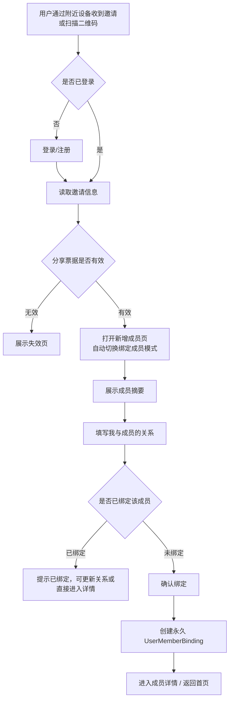
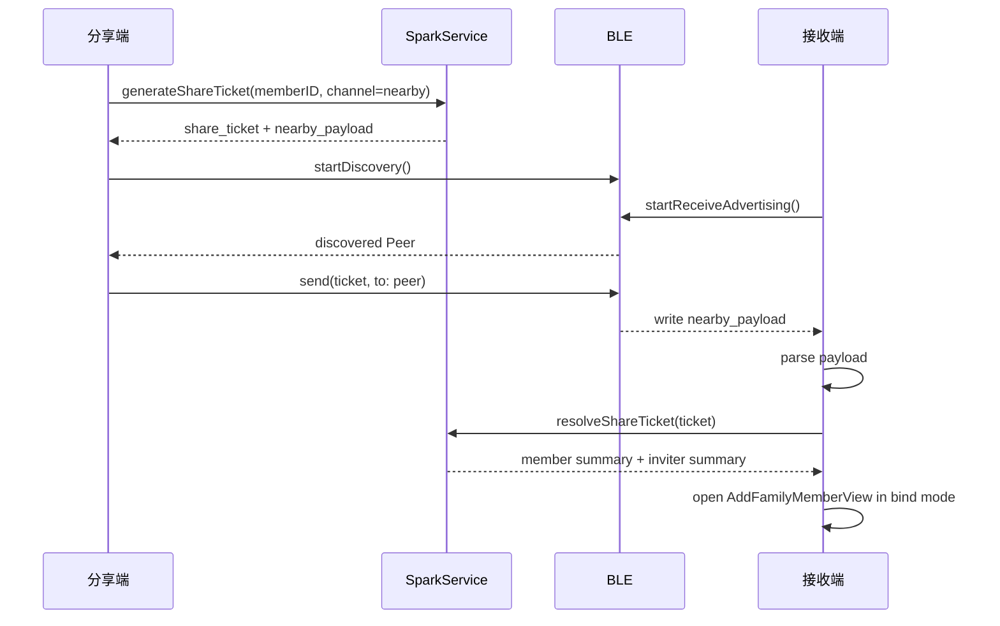

# 成员多用户绑定与分享需求文档

- 项目：SparkClient / SparkService
- 文档版本：v1.0
- 生成日期：2026-05-23
- 文档目的：讨论并沉淀“成员支持多用户绑定”后的首页成员入口、成员详情页、更多操作、分享与绑定关系填写方案。本文仅为需求设计，不涉及代码改动。

---

## 1. 背景与目标

### 1.1 现状

当前成员模型更接近“用户 1-1 拥有成员”：

- 服务端 `Member` 继承 `MedicalBaseModel`，包含 `user` 字段，成员与医疗数据按当前登录用户隔离。
- 当前成员关系需要从成员表中拆出，用户与成员的关系统一由绑定表表达。
- 客户端首页顶部成员 Chip 选中后弹出操作：编辑、删除。
- 新增/编辑成员页面需要拆分：成员基础资料写 `Member`，我与成员的关系写 `UserMemberBinding`。

### 1.2 新目标

成员需要支持被多个用户绑定：

- 一个真实成员档案可以被多个账号访问。
- 每个账号与该成员都有独立的“关系”描述，例如 A 绑定为“本人”，B 绑定为“父亲”，C 绑定为“女儿”。
- `Member` 表删除 `relationship` 字段；新增 `UserMemberBinding` 作为多用户绑定关系。
- 绑定用户需要单独填写“我与该成员的关系”，业务读取统一使用 `UserMemberBinding.relationship`。
- 首页成员入口从直接“编辑/删除成员”改为“查看详细/分享”，降低误操作风险。
- 成员详情页承载成员资料、绑定信息、共享用户、医疗概览，并在右上角提供更多操作：分享、编辑、删除。

### 1.3 核心原则

- `Member` 作为成员档案主表，不再承载 relationship；`UserMemberBinding` 表达“哪个用户绑定了哪个成员，以及该用户视角下的关系/权限”。
- 分享不是复制成员，而是邀请另一个用户绑定同一个成员。
- 绑定时必须填写“我与该成员的关系”，该关系只对绑定用户自身生效。
- 医疗数据继续归属成员维度；权限由用户是否拥有有效绑定决定。
- 删除要区分“解绑”和“删除成员档案”。普通用户优先做解绑；只有满足权限和无其他绑定时才允许删除档案。

---

## 2. 术语

| 术语 | 含义 |
| --- | --- |
| 成员 / Member | 被管理的真实健康档案主体，例如本人、父母、孩子 |
| 绑定 / Binding | 某个用户与某个成员之间的访问关系 |
| 关系 / Relationship | 绑定用户视角下与成员的关系，例如本人、父亲、母亲、子女、其他 |
| 分享 / Share | 当前用户邀请另一个用户绑定同一成员 |
| 邀请人 | 发起分享的用户 |
| 被邀请人 | 接收分享并完成绑定的用户 |
| 管理者 | 对成员档案拥有编辑、分享、解绑/删除权限的绑定用户 |

---

## 3. 信息架构调整

### 3.1 服务端概念模型

建议从“成员直接归属用户”调整为“Member + UserMemberBinding”。`Member.relationship` 删除，成员关系统一放到 `UserMemberBinding.relationship`。

```text
Member                          # 成员档案主表
  user                          # 当前创建/归属用户
  name
  gender
  birth_date
  blood_type
  allergies
  chronic_conditions
  notes
  avatar_url
  is_primary
  created_at / updated_at       # 来自 MedicalBaseModel

UserMemberBinding               # 用户-成员绑定（新增表）
  id                            # 绑定主键
  user_id                       # 用户 ID
  member_id                     # 成员 ID
  relationship                  # 当前绑定用户视角下与成员的关系（如 self / father / mother / other）
  role                          # 权限角色：owner / admin / viewer
  status                        # 绑定状态：active / revoked 等
  invited_by                    # 邀请人用户 ID（通过分享绑定时记录，自创建可为空）
  created_at                    # 创建时间
  updated_at                    # 更新时间
```

### 3.2 字段与业务真源

| 字段 | 归属 | 说明 |
| --- | --- | --- |
| 成员基础资料 | `Member` | 删除 `relationship`，保留姓名、性别、生日、血型、过敏史、慢病、备注、头像等成员资料 |
| 分享绑定关系 | `UserMemberBinding` | 新增表，关联 `user_id + member_id` |
| 当前用户与成员关系 | `UserMemberBinding.relationship` | 分享绑定时必填；不同用户可以不同 |
| 权限角色 | `UserMemberBinding.role` | owner/admin/viewer 等；第一期可简化 |
| 是否可编辑/分享/删除 | 从绑定角色和成员绑定数量计算 | 客户端使用服务端返回能力位 |
| 绑定状态 | `UserMemberBinding.status` | active / revoked，控制是否可访问 |

业务规则：

- 创建成员时，继续创建 `Member`；同时为创建者创建一条 `UserMemberBinding`。
- 成员列表、成员详情、新增成员页的“绑定成员”模式展示的“我与成员的关系”，统一来自 `UserMemberBinding.relationship`。
- `Member` 不再包含 `relationship` 字段；所有成员关系读取和写入都走 `UserMemberBinding.relationship`。
- 首页默认成员选择第一期仍可沿用现有 `Member.is_primary` 和本地 selected member 逻辑；是否迁移为绑定维度默认成员，放到后续版本讨论。

---

## 4. 首页成员入口调整

### 4.1 当前入口

首页顶部成员 Chip：

- 未选中：点击切换成员。
- 已选中：点击弹出菜单，包含“编辑”“删除”。

### 4.2 调整后入口

首页顶部成员 Chip：

- 未选中：点击切换成员。
- 已选中：点击弹出菜单，包含：
  - 查看详细
  - 分享
  - 取消

不再在首页菜单直接出现“编辑”“删除”。

### 4.3 交互原因

- 成员支持多用户绑定后，“删除”语义变复杂，首页直接删除容易误删共享档案。
- “编辑”也可能影响其他绑定用户看到的共享资料，应放到详情页并展示影响范围。
- “分享”属于高频协作动作，可保留在首页快捷入口。

### 4.4 首页成员 Chip 展示建议

Chip 保持当前轻量形态：

- 头像/关系首字 + 成员名。
- 选中态仍用强调色。
- 选中成员右侧图标从编辑笔建议改为 `ellipsis.circle` 或 `chevron.down`，表达“更多入口”而不是“编辑”。

---

## 5. 成员详情页设计

### 5.1 入口

成员详情页从以下位置进入：

- 首页成员 Chip 菜单 -> 查看详细。
- 首页成员 Chip 菜单 -> 分享，若需要先展示成员信息，可先进入详情页再拉起分享 Sheet。
- 未来可从成员选择器、聊天成员绑定菜单、医疗资料列表成员头部进入。

### 5.2 页面目标

成员详情页负责回答四个问题：

- 这个成员是谁？
- 我和这个成员是什么关系？
- 有哪些健康资料/最近动态？
- 我能对这个成员做什么操作？

### 5.3 页面结构

```text
导航栏
  标题：成员详情
  右上角：更多(...)

成员头部
  头像 / 关系徽标
  成员姓名
  当前用户关系：我的父亲 / 本人 / 其他
  共享状态：已与 2 位用户绑定

基础资料
  性别
  出生日期 / 年龄
  血型
  过敏史
  慢病
  备注

我的绑定
  我与成员的关系
  我的权限角色
  是否默认成员

医疗概览
  病历数
  体检报告数
  检查报告数
  服药计划数
  最近更新时间

共享用户
  用户昵称/脱敏手机号或邮箱
  与成员关系
  权限角色
  绑定时间

危险操作区
  解绑该成员 / 删除成员档案
```

### 5.4 更多操作

详情页右上角更多菜单包含：

- 分享
- 编辑
- 删除

展示规则：

- 分享：`can_share = true` 时可点，否则隐藏或置灰。
- 编辑：`can_edit = true` 时可点，否则隐藏或置灰。
- 删除：`can_delete = true` 或 `can_unbind = true` 时展示，但点击后进入二次确认，由服务端能力决定最终文案。

### 5.5 删除语义

删除按钮需要根据场景转译：

| 场景 | 文案 | 结果 |
| --- | --- | --- |
| 当前成员还有其他用户绑定 | 解绑该成员 | 只删除当前用户绑定关系，不删除成员和医疗数据 |
| 当前用户是唯一绑定用户 | 删除成员档案 | 删除成员、医疗数据或执行服务端软删除 |
| 当前用户无权限删除档案但可解绑 | 解绑该成员 | 仅解绑 |
| 当前用户无任何删除/解绑权限 | 不展示或置灰 | 无操作 |

确认弹窗必须明确影响范围：

- 解绑：你将无法继续查看该成员资料，其他已绑定用户不受影响。
- 删除档案：将删除该成员及相关健康资料，此操作可能影响所有绑定用户。

---

## 6. 分享功能设计

### 6.1 分享目标

用户可以把某个成员分享给其他用户绑定。被邀请用户接受后，需要填写“我与该成员的关系”，完成绑定后即可在首页成员列表看到该成员。

### 6.2 分享入口

- 首页选中成员菜单 -> 分享。
- 成员详情页右上角更多 -> 分享。
- 成员详情页共享用户区 -> 邀请成员。

### 6.3 分享方式

第一期不走复杂邀请链接流，改为“面对面快速分享”：

- 附近设备：参考 `bitchat-main` 的 BLE 近场发现思路，发现附近打开同一分享/接收页的用户，选择对方后发送分享票据。
- 二维码：分享页展示成员绑定二维码；被邀请用户在新增成员页内打开扫码，扫码成功后自动切换为“绑定成员”模式。
- 永久绑定：用户接受后创建长期有效的 `UserMemberBinding`，不是临时访问、不是短期授权。

第一期不做：

- 有效期选择。
- 权限选择。
- 系统分享链接。
- 输入手机号/邮箱。
- App 内通知邀请。

附近设备技术参考：

- `bitchat-main` 使用 `CoreBluetooth` 同时做 Central/Peripheral，设备通过固定 Service UUID 扫描和广播，发现附近 peer 后建立连接。
- Spark 不需要完整 mesh 聊天、TTL 多跳转发、文件分片和消息时间线，只需要一个轻量 `NearbyShareTransport`。
- 传输内容只放分享票据 payload，例如 `share_ticket`、`member_id`、成员摘要、邀请人摘要、签名/nonce。
- 不新增分享邀请数据表；分享票据由服务端签名生成，接受时校验签名和权限后直接创建 `UserMemberBinding`。
- 绑定最终仍由服务端确认，BLE/二维码只负责把分享票据交给对方，避免本地伪造绑定。

二期可补充：

- 输入手机号/邮箱定向邀请。
- App 内通知邀请。
- 系统分享链接。

### 6.4 分享 Sheet 设计

分享 Sheet 做成公共分享页，后续所有“把某个资源分享给其他用户”的场景都复用同一个容器，只替换资源摘要和分享通道。视觉和交互参考 `travel-main/TravelChinaUI/UI/Journey/Project/ShareCard.swift`：

- 使用 bottom sheet，而不是全屏页面。
- sheet 高度根据内容自适应，参考 `readGeometry + presentationDetents([.height(shareHeight)])`。
- 入口按钮使用圆形彩色 icon + 下方标题的样式。
- 二维码点击后在按钮上方展开，带 `scale + opacity` 过渡动画。
- 底部固定取消按钮，样式参考 `ShareCard.buildFloatButton()`。

```text
公共分享页 ShareSheet
  标题：分享

资源摘要区
  头像 + 成员名
  当前我的关系
  已绑定用户数量

分享方式区
  [二维码] [附近设备]

二维码展开区
  展示二维码
  说明：让对方用 Spark 扫一扫

附近设备展开区
  正在发现附近用户...
  用户列表：头像 / 昵称 / 距离提示或最近发现时间
  点击用户 -> 发送分享票据

底部说明
  对方接受后需要填写与成员的关系。
  接受后为永久绑定，可在成员详情中解绑。

关闭
```

第一期默认权限：

- 被邀请用户接受后获得长期绑定。
- 默认角色建议为 `viewer` 或“家庭成员普通权限”；是否允许编辑医疗资料需产品再定。
- 分享页不暴露权限配置，避免流程变重；服务端和接口仍预留 `role`。

公共化设计：

- `ShareSheet` 负责标题、资源摘要、分享方式入口、结果提示。
- `ShareResourceSummary` 描述被分享资源：类型、ID、标题、头像、摘要。
- `ShareChannel` 描述分享通道：附近设备、二维码；二期新增手机号/邮箱、App 内通知时只新增 channel。
- 成员分享只是第一个资源类型，后续可复用给报告、病历、任务等。

第一期通道顺序：

1. 二维码：默认展开，保证打开分享页即可让对方扫码。
2. 附近设备：点击后收起二维码，展开附近设备列表。

切换规则：

- `QRCode` 与 `Nearby` 二选一展开，避免 sheet 同时过高。
- 切换使用 `.easeInOut(duration: 0.3)`，与 `travel-main` 的二维码展开动画保持一致。
- 附近设备未发现时，仍保留二维码通道作为兜底。

### 6.4.1 扫码入口放置

应用内扫码入口放在“新增成员”页右上角：

- 用户点击首页成员栏的 `+` 进入新增成员页。
- 新增成员页右上角放“扫码”图标按钮。
- 点击扫码按钮弹出 `QRCodeScannerView` 全屏相机。
- 扫码成功后，新增成员页自动切换到“绑定成员”模式。

不在首页直接放扫码入口，不在设置页放扫码入口。扫码是新增/绑定成员流程的一部分，入口归属于新增成员页。

### 6.5 被邀请用户绑定流程



第一期流程压缩为三步：

1. 分享人点击“分享”，打开公共分享页。
2. 被邀请人通过附近设备接收或在新增成员页扫码，自动进入新增成员页的“绑定成员”模式。
3. 被邀请人选择关系并确认，完成永久绑定。

### 6.6 新增成员页的绑定成员模式

不单独新增 `MemberShareAcceptView`。分享绑定确认合并到现有新增成员页面，页面有两种模式：

| 模式 | 进入方式 | 是否用户可手动切换 |
| --- | --- | --- |
| 新增成员 | 默认进入新增成员页 | 是，默认模式 |
| 绑定成员 | 扫码成功并解析分享票据后自动进入 | 否 |

绑定成员模式页面内容：

- 标题：绑定成员。
- 邀请人信息：某某正在分享成员给你。
- 成员摘要：姓名、性别、年龄/生日，避免展示医疗明细。
- 关系选择：必须填写。
- 绑定说明：确认后该成员会加入你的首页成员列表，属于永久绑定，可随时解绑。
- 主按钮：确认绑定。
- 次按钮：取消绑定 / 返回新增成员。

模式约束：

- 只有扫码成功、`resolveShareTicket` 成功后，才能切换到绑定成员模式。
- 用户不能通过 segmented control、普通按钮直接手动进入绑定成员模式。
- 深链、二维码、附近设备 payload 都不能绕过 `resolveShareTicket`；只有解析成功并拿到服务端返回的成员摘要后，ViewModel 才允许设置绑定模式。
- 绑定成员模式必须持有有效 `share_ticket` 和服务端解析得到的成员摘要。
- 取消绑定模式时，清空 `share_ticket`、成员摘要、关系选择，并回到新增成员模式。
- 绑定成功后关闭新增成员页并刷新成员列表。

建议状态模型：

```swift
enum AddFamilyMemberMode: Equatable {
    case create
    case bind(ticket: String, summary: ResolvedMemberShareSummary)
}
```

页面不提供模式切换控件，`mode` 只能由以下事件改变：

- 打开新增成员页：`.create`。
- 新增成员页扫码成功并解析成功：`.bind(...)`。
- 取消绑定、绑定失败后放弃、重新新增：`.create`。
- 绑定成功：关闭页面并刷新成员列表。

关系选择：

- 复用当前 `MemberRelationshipCatalog`：本人、父亲、母亲、丈夫、妻子、儿子、女儿、兄弟姐妹、祖父母、外祖父母、其他。
- 当选择“其他”时，建议允许输入自定义关系，最多 20 字。
- 若被邀请用户选择“本人”，需要允许，但后续可加风险提示：确认该成员是你的本人档案。

### 6.7 分享后权限与隐私

服务端必须校验：

- 只有拥有 `can_share` 的绑定用户可以生成分享票据。
- 分享票据不能直接暴露连续 ID，必须包含服务端签名，防止篡改 `member_id`、`inviter_user_id`、`role`。
- 被邀请用户接受分享时不能绕过权限创建任意绑定。
- 若成员已删除、分享者已失去分享权限、当前用户已绑定该成员，服务端需要返回明确错误码或幂等结果。
- 成员医疗资料接口必须从“请求用户是否绑定该成员”判断权限，不再只看 `Member.user == request.user`。

客户端需要提示：

- 分享成员会让对方访问该成员的健康资料。
- 对方填写的关系是对方视角，不会改变你这边的关系。
- 你可以在成员详情页查看共享用户，并在有权限时移除绑定。

---

## 7. 接口需求建议

### 7.1 成员列表

`GET /api/v1/medical/members/`

返回当前用户已绑定成员列表。每项建议包含：

```json
{
  "id": 12,
  "binding_id": 88,
  "name": "张三",
  "gender": "male",
  "relationship": "father",
  "birth_date": "1968-02-01",
  "avatar_url": "",
  "is_primary": false,
  "binding_role": "admin",
  "shared_user_count": 2,
  "can_share": true,
  "can_edit": true,
  "can_delete": false,
  "can_unbind": true,
  "updated_at": "2026-05-23T10:00:00Z"
}
```

### 7.2 成员详情

`GET /api/v1/medical/members/{member_id}/`

返回：

- 成员基础资料。
- 当前用户绑定关系。
- 能力位。
- 共享用户列表，按权限决定是否返回完整信息。
- 医疗概览统计。

### 7.3 更新成员基础资料

`PATCH /api/v1/medical/members/{member_id}/`

用于编辑共享成员资料，要求当前绑定具备 `can_edit`。

### 7.4 更新我的绑定关系

`PATCH /api/v1/medical/member-bindings/{binding_id}/`

用于编辑当前用户自己的绑定关系：

- `relationship`

说明：

- `is_primary` 仍属于现有 `Member` 字段，第一期不迁移到绑定表。
- 不新增 `alias_name` 等备注名字段，避免绑定表过重。

### 7.5 解绑成员

`DELETE /api/v1/medical/member-bindings/{binding_id}/`

仅删除当前用户与成员的绑定关系。

### 7.6 删除成员档案

`DELETE /api/v1/medical/members/{member_id}/`

仅当服务端判定可删除时执行。若成员仍有其他绑定用户，服务端应拒绝或转为解绑，建议返回明确错误码：

- `member_has_other_bindings`
- `permission_denied`
- `cannot_delete_primary_binding`

### 7.7 生成分享票据

`POST /api/v1/medical/members/{member_id}/share-ticket/`

请求：

```json
{
  "channel": "nearby",
  "role": "viewer"
}
```

返回：

```json
{
  "share_ticket": "signed.payload.xxxx",
  "qr_payload": "spark://member-share?ticket=signed.payload.xxxx",
  "nearby_payload": {
    "type": "member_share",
    "ticket": "signed.payload.xxxx",
    "member_id": 12
  }
}
```

说明：

- `channel = nearby` 时用于附近设备传输。
- `channel = qr` 时用于生成二维码。
- 第一期不返回系统分享链接，不提供有效期选择。
- 不新增分享邀请数据表，不记录邀请生命周期。
- `share_ticket` 是服务端签名票据，建议包含 `member_id`、`inviter_user_id`、`role`、`channel`、`issued_at`、`nonce`。
- 票据本身只是让新增成员页进入“绑定成员”模式并提交绑定的凭证；绑定成功后创建永久 `UserMemberBinding`。

### 7.8 解析分享票据

`POST /api/v1/medical/member-share-ticket/resolve/`

请求：

```json
{
  "share_ticket": "signed.payload.xxxx"
}
```

返回成员摘要、邀请人摘要、当前用户是否已绑定该成员、默认角色。

### 7.9 接受分享并绑定

`POST /api/v1/medical/member-share-ticket/accept/`

请求：

```json
{
  "share_ticket": "signed.payload.xxxx",
  "relationship": "father",
  "custom_relationship": ""
}
```

返回新绑定后的成员详情或成员列表项。

幂等规则：

- 如果当前用户已经绑定该成员，返回已绑定状态，并允许用户更新自己的关系。
- 如果分享者已经没有分享权限或成员不存在，返回明确错误码。
- 不做“已使用即失效”的状态记录；是否允许同一票据被多个人扫码绑定，由服务端签名策略和产品规则决定。第一期面对面分享可以接受多人扫码，绑定仍需要逐个确认。

---

## 8. 客户端页面与状态

### 8.1 新增页面

| 页面 | 说明 |
| --- | --- |
| `MemberDetailView` | 成员详情页 |
| `ShareSheet` | 公共分享页，第一期承载附近设备和二维码 |
| `NearbyShareDeviceListView` | 附近设备发现与发送分享票据 |
| `QRCodeShareView` | 成员绑定二维码展示 |
| `QRCodeScannerView` | 新增成员页内的全屏扫码入口，只负责识别二维码并回传分享票据 |

### 8.2 调整页面

| 页面 | 调整 |
| --- | --- |
| 首页 `HomeView` | 成员 Chip 菜单从“编辑/删除”改为“查看详细/分享” |
| `AddFamilyMemberView` | 支持“新增成员 / 绑定成员”两种模式；默认新增成员，扫码成功后自动切换绑定成员；创建成功时服务端同时补创建者的 `UserMemberBinding` |
| `MemberProfileBindingMenu` | 列表继续展示当前用户已绑定成员 |
| 医疗上传/问报告 | 成员 ID 仍作为医疗资料归属维度，但权限由绑定关系保障 |

### 8.3 本地状态建议

`MemberContextStore` 后续应保存“当前用户可见成员列表”，其中每个成员包含当前用户绑定关系。选中成员仍按账号维度本地持久化。

### 8.4 分享票据载荷处理

客户端需要识别：

```text
spark://member-share?ticket=xxx
```

处理规则：

- 未登录：缓存 `share_ticket`，登录完成后打开新增成员页并自动切换为绑定成员模式。
- 已登录：解析分享票据，打开新增成员页并展示绑定成员模式。
- 票据无效、签名错误、成员不存在、分享者无权限：展示失效页。
- 已绑定：展示“你已绑定该成员”，允许更新关系或进入详情。
- 附近设备收到的 payload 和二维码扫码结果都统一解析为同一个 `spark://member-share?ticket=xxx`。
- 第一阶段不做系统外部分享链接入口；上述 URL 主要作为二维码和近场 payload 的内部载荷格式。

---

## 9. 权限规则

### 9.1 第一阶段权限口径

第一阶段不做细粒度角色限制：用户只要与成员存在 `active UserMemberBinding`，就拥有该成员下医疗资料的完整操作权限。

完整操作权限包括：

- 查看成员详情和 complete-data。
- 上传报告、图片、文件。
- 保存 AI 识别结果。
- 创建/更新/删除病历、体检报告、检查报告、药箱、处方、服药计划、服药记录等医疗资料。
- 绑定上传文件到医疗业务对象。
- 在聊天、问报告、医疗上传等入口选择该成员并写入医疗数据。

`role` 字段可以预留，但第一阶段不能用 `viewer/admin/owner` 阻断医疗资料写入。若未来启用角色权限，需要单独产品确认并补充权限矩阵。

成员档案级操作：

- 绑定用户可编辑成员基础资料。
- 绑定用户可分享成员。
- 绑定用户可解绑自己。
- 删除成员档案仍需二次确认；如果存在多个绑定用户，优先执行“解绑自己”，避免误删共享成员。

### 9.2 医疗资料访问

所有成员相关医疗接口需要统一校验：

```text
request.user 与 member 存在 active binding
```

不应只依赖 `record.user == request.user`。医疗资料访问权限以成员绑定关系为准。

### 9.3 问题复盘：分享用户上传报告保存失败

现象：

- 分享绑定用户为成员 `member=20` 上传并识别报告。
- 客户端保存识别结果 `kind=medicationPlan`，请求 `POST /api/v1/medical/workflows/medication-plans/save/`。
- 请求体内包含 `member: 20` 和上传文件 ID。
- 服务端返回 `403 {"code":-1,"msg":"permission_denied","data":null}`。
- 客户端把 `permission_denied` 当成“鉴权失效”，触发强制登出，回到登录页。

根因判断：

- 服务端工作流接口仍按 `Member.user == request.user` 或医疗记录 `user == request.user` 判断权限。
- 分享绑定用户虽然已经拥有 `UserMemberBinding`，但工作流保存接口没有统一走成员绑定权限判断。
- 客户端错误处理把 403 授权失败误判为 401 登录失效，导致用户被错误登出。

这不是单个服药计划接口问题，而是权限架构问题。所有成员相关读写接口必须统一接入成员绑定权限判断，不能只在成员列表/详情里支持绑定。

### 9.4 权限架构硬约束

服务端硬约束：

- 所有带 `member` / `member_id` 的医疗接口，必须先校验 `request.user` 与该成员存在 active binding。
- 校验通过后，应允许分享绑定用户执行完整医疗资料写操作。
- `record.user` 只能作为创建者/操作者记录，不能作为是否允许访问成员医疗资料的唯一依据。
- 工作流接口必须纳入同一权限体系，包括：
  - `/api/v1/medical/workflows/case-documents/save/`
  - `/api/v1/medical/workflows/health-exams/save/`
  - `/api/v1/medical/workflows/medical-reports/create/`
  - `/api/v1/medical/workflows/medication-plans/save/`
  - `/api/v1/medical/workflows/symptoms/create/`
  - `/api/v1/medical/workflows/visits/create/`
  - `/api/v1/medical/workflows/surgeries/create/`
  - `/api/v1/medical/workflows/follow-ups/create/`
  - `/api/v1/medical/workflows/attachments/batch-bind/`
  - `/api/v1/medical/combined-create/`
- ViewSet 接口也必须纳入同一权限体系，包括成员、病例、症状、就诊、手术、随访、体检报告、检查报告、药箱、处方、服药计划、服药记录、附件关系。

客户端硬约束：

- HTTP 401 / token 失效 / refresh 失败才允许触发强制登出。
- HTTP 403 `permission_denied` 只能作为授权不足处理，展示业务错误或刷新成员绑定状态，不能触发退出登录。
- 保存识别结果失败时，错误提示应说明“当前账号无权操作该成员或绑定已失效”，不得清理会话。
- 若 403 发生在绑定成员操作上，客户端可刷新成员列表；若该成员仍在列表中，应提示服务端权限异常。

### 9.5 共享用户管理

详情页共享用户列表中：

- 当前用户永远可看到自己的绑定。
- 管理者可看到所有绑定用户的脱敏信息。
- 普通查看者可只看到“已与 N 位用户绑定”，不展示完整列表。

---

## 10. 落地实施方案

### 10.1 总体落地顺序

建议按“服务端权限底座 -> 客户端数据模型 -> 首页与详情 -> 公共分享页 -> 二维码 -> 附近设备”的顺序推进：

1. 服务端新增 `UserMemberBinding`，并让成员列表/详情/complete-data 等接口按绑定权限读取。
2. 客户端医疗成员 DTO 增加绑定字段，保持 `Member` 领域模型最小改动。
3. 首页成员 Chip 菜单改为“查看详细 / 分享”。
4. 新增成员详情页，承载编辑、删除/解绑、分享入口。
5. 新增公共 `ShareSheet`，第一期接入成员分享资源。
6. 先落二维码分享和应用内扫码，保证面对面绑定闭环。
7. 再落附近设备分享，参考 `bitchat-main` 的 BLE 发现与点对点小 payload 传输。

### 10.2 SparkService 目录与职责

服务端在 `SparkService/medical` 内落地，不新增独立 app：

```text
medical/
  models.py                  # Member 删除 relationship；新增 UserMemberBinding
  serializers.py             # 新增绑定、分享票据、成员详情序列化
  views.py                   # 扩展 MemberViewSet；新增 share-ticket resolve/accept API
  urls.py                    # 注册 member-bindings 与 share-ticket 路由
  permissions.py             # 可选：抽出成员绑定权限判断
  services/
    member_binding_service.py # 可选：绑定创建、解绑、权限判断
    member_share_ticket.py    # 可选：签名票据生成/解析/校验
  migrations/
    00xx_user_member_binding.py
```

模型约束：

- `Member` 删除 `relationship` 字段，不再承载用户与成员关系。
- 新增 `UserMemberBinding`，字段建议为 `user`、`member`、`relationship`、`role`、`status`、`invited_by`、`created_at`、`updated_at`。
- `unique_together` / `UniqueConstraint`：同一 `user + member` 只能有一条 active 绑定。
- 创建成员时，同步创建创建者绑定；分享接受时，只创建绑定，不创建新成员。

权限改造点：

- `MemberViewSet.get_queryset()` 从 `Member.objects.filter(user=request.user)` 调整为“当前用户 active binding 可访问的成员”。
- `MemberCompleteDataAPI` 校验当前用户是否绑定 `member_id`。
- 病历、报告、药箱、服药计划等按 `member_id` 过滤的接口，统一校验成员绑定权限。
- 所有 workflow save/create 接口统一使用同一套成员绑定权限服务，不能各自手写 `member.user == request.user`。
- 分享绑定用户保存 AI 识别结果、上传报告、绑定附件时必须与创建者用户同权。
- 删除成员时区分解绑和删除档案：多绑定时默认解绑当前用户；只有满足权限时才允许删除成员档案。

### 10.3 SparkClient 目录与职责

客户端遵循现有 Feature 分层，不把成员分享逻辑塞进 Home 单文件：

```text
Projects/Features/MemberContext/
  Domain/
    MemberContextModels.swift          # 扩展绑定角色、能力位、分享票据摘要模型
  Application/
    LoadMembersUseCase.swift           # 继续作为成员列表入口
    ShareMemberUseCase.swift           # 生成/解析/接受分享票据
    ManageMemberBindingUseCase.swift   # 更新关系、解绑
  Infrastructure/
    DefaultMembersRepository.swift     # 映射绑定字段
    MemberShareRepository.swift        # 调用 share-ticket API
    NearbyShareTransport.swift         # BLE 近场传输抽象，二阶段实现
  Presentation/
    MemberProfileBindingMenu.swift
    MemberDetailView.swift
    MemberRelationshipPicker.swift

Projects/Features/Home/
  Presentation/
    HomeView.swift                     # 只负责入口和导航状态
    MemberSelectorChip.swift           # 可从 HomeView 拆出
    AddFamilyMemberView.swift          # 新增成员页；内部承载绑定成员模式和扫码入口
    AddFamilyMemberViewModel.swift     # 管理 add/bind mode、showMemberScanner、resolve/accept 状态

Projects/Features/Share/
  Domain/
    ShareResourceSummary.swift
    ShareChannel.swift
  Application/
    ShareTicketPayload.swift
  Presentation/
    ShareSheet.swift
    QRCodeShareView.swift
    QRCodeScannerView.swift
    QRScannerCameraView.swift
    NearbyShareDeviceListView.swift

```

若短期不想新增 `Features/Share`，也可以先放在 `Features/MemberContext/Presentation/Share/`，但公共分享页的模型命名要保持资源无关，后续迁移成本会低。

### 10.4 客户端接口落点

现有医疗 API 位于：

- `Projects/Core/Networking/API/Medical/MedicalMemberAPI.swift`
- `Projects/Core/Networking/API/Medical/MedicalQueryAPI.swift`
- `Projects/Core/Networking/API/Medical/MedicalRemoteDTO+Domain.swift`

建议新增：

```text
MedicalMemberAPI.swift
  RemoteMember 删除 relationship 字段，增加 bindingInfo 或 bindingRelationship / bindingID / bindingRole / canShare / canEdit / canUnbind / sharedUserCount
  UpsertMemberPayload 删除 relationship 字段
  createMember 仍走 members
  updateMember 仍走 members
  deleteMember 根据服务端语义处理删除/解绑结果

MemberShareAPI.swift 或 MedicalMemberAPI extension
  generateShareTicket(memberID:channel:)
  resolveShareTicket(_:)
  acceptShareTicket(_:relationship:)

MemberBindingAPI.swift 或 MedicalMemberAPI extension
  updateBinding(bindingID:relationship:)
  unbind(bindingID:)
```

DTO 映射规则：

- 服务端成员列表返回 `binding_relationship`；客户端展示“我与成员关系”时读取该字段。
- 客户端领域模型 `Member` 不再包含 `relationship`；关系字段放入 `MemberBindingInfo.relationship` 或同等绑定模型。
- 绑定能力位可放入新的 `MemberAccess` / `MemberBindingInfo`，避免把过多权限字段塞进 `Member`。
- `MemberContextStore` 保存成员列表和当前选中成员；分享绑定成功后触发 `membersDidChange` 刷新首页。

### 10.5 本地化落点

项目本地化使用：

- `Projects/App/Resources/zh-Hans.lproj/Localizable.strings`
- `Projects/App/Resources/en.lproj/Localizable.strings`
- 代码通过 `Projects/App/Sources/App/L10n.swift` 的 `L10n.text("key")` 读取。

新增文案必须同时补中文和英文，key 建议：

```text
home.members.action.view_detail
home.members.action.share
home.members.detail.title
home.members.detail.my_relationship
home.members.detail.shared_users
home.members.detail.medical_overview
home.members.detail.more
home.members.detail.unbind
home.members.detail.delete_profile
home.members.share.title
home.members.share.nearby
home.members.share.nearby.searching
home.members.share.nearby.empty
home.members.share.qr
home.members.share.qr.hint
home.members.share.scan
home.members.share.scan.title
home.members.share.scan.subtitle
home.members.share.scan.permission_denied
home.members.share.scan.open_settings
home.members.share.scan.invalid_code
home.members.share.scan.retry
home.members.share.ticket_invalid
home.members.add.title
home.members.add.scan
home.members.add.save
home.members.bind.title
home.members.bind.inviter
home.members.bind.summary
home.members.bind.relationship_required
home.members.bind.confirm
home.members.bind.cancel
home.members.bind.success
home.members.bind.failed
home.members.binding.relationship.title
home.members.binding.relationship.other_placeholder
```

扫码权限文案还需要补 `Info.plist`：

```text
NSCameraUsageDescription = 用于扫描成员分享二维码并完成绑定
```

BLE 近场分享需要补：

```text
NSBluetoothAlwaysUsageDescription = 用于发现附近设备并面对面分享成员绑定
```

### 10.6 二维码与扫码设计

二维码第一期优先落地，因为链路稳定、测试成本低。扫码相机和二维码生成参考 `travel-main/TravelChinaUI/UI/ScannerView/ScannerView.swift`、`CameraView.swift`、`QRCodeView.swift`，功能需要保持一致：

- 分享端：`QRCodeShareView` 展示 `spark://member-share?ticket=...`。
- 接收端：`QRCodeScannerView` 扫描后解析二维码中的分享票据载荷。
- 分享票据 URL、扫码结果、附近设备 payload 统一交给新增成员页处理。
- 未登录时缓存 `share_ticket`，登录后打开新增成员页并自动进入绑定成员模式。

#### 10.6.1 二维码生成

参考 `travel-main` 的 `QRCodeView`：

- 使用 `CoreImage.CIFilterBuiltins` 的 `CIFilter.qrCodeGenerator()`。
- 使用 `CIContext` 将 `CIImage` 转为 `UIImage`。
- `Image(uiImage:)` 使用 `.interpolation(.none)`，避免二维码缩放后模糊。
- 尺寸使用容器宽度的约 60%，在 Spark 中建议使用固定上限，避免 iPad 上过大。

Spark 设计：

```text
QRCodeShareView
  input: String  // spark://member-share?ticket=...
  output: QR image
  style: 无边框白底二维码 + 下方提示文案
```

#### 10.6.2 扫码相机页面

参考 `travel-main` 的 `ScannerView + CameraView`：

- `QRCodeScannerView` 使用全屏 `fullScreenCover` 展示。
- 顶部左侧关闭按钮。
- 标题文案：扫描二维码。
- 副标题文案：将二维码放入框内，系统会自动识别。
- 中间为正方形扫描区域，最大宽度约 300。
- 相机预览使用 `AVCaptureVideoPreviewLayer`，`videoGravity = .resizeAspectFill`。
- 扫描框使用四角描边，不使用厚重遮罩。
- 扫描线使用上下往返动画，时长约 0.85s，重复 autoreverse。
- 下方保留 `qrcode.viewfinder` 按钮，用于相机停止时重新启动。

扫码页状态：

```text
idle
checkingPermission
permissionDenied
running
detected
resolving
failed
```

#### 10.6.3 相机权限与生命周期

与 `travel-main` 保持一致：

- `onAppear` 检查 `AVCaptureDevice.authorizationStatus(for: .video)`。
- `.notDetermined` 时请求 `AVCaptureDevice.requestAccess(for: .video)`。
- `.denied / .restricted` 时展示 alert，并提供“设置”按钮打开 `UIApplication.openSettingsURLString`。
- 相机 session 必须在后台线程 `startRunning()`。
- `onDisappear` 必须 `stopRunning()`。
- 首次识别到二维码后立即停止 session 和扫描线动画，避免重复识别。
- 如果 session 停止且权限已允许，点击取景器按钮可重新启动扫描。

#### 10.6.4 扫码结果处理

与 `travel-main` “扫码 -> 解码 -> 查询 -> 展示分享卡片”的流程一致，但 Spark 的业务是：

1. 扫到字符串。
2. 校验是否为 `spark://member-share?ticket=...`。
3. 停止相机和扫描动画。
4. 调用 `resolveShareTicket`。
5. 成功后关闭扫码页，回到新增成员页并自动切换为“绑定成员”模式。
6. 失败时展示错误，并允许重新扫码。

Spark 不使用 travel-main 的 base64 加密行程 payload；成员分享只识别服务端签名 `share_ticket`。

#### 10.6.5 扫描后回到新增成员页

本项目不沿用 `travel-main` “扫描后在相机页覆盖确认卡片”的完整交互，只借鉴相机识别、权限处理和视觉扫描框。扫码页只负责识别二维码，绑定确认必须回到新增成员页内完成：

- 扫码成功后停止相机，解析 `share_ticket`。
- `resolveShareTicket` 成功后关闭 `QRCodeScannerView`。
- 新增成员页自动从“新增成员”切换为“绑定成员”模式。
- 绑定成员模式展示邀请人、成员摘要、关系选择和确认绑定按钮。
- 点击取消绑定时清空票据和摘要，回到“新增成员”模式。
- 用户确认绑定时展示 loading/反馈文案，成功后关闭新增成员页并刷新首页成员。

扫码入口：

- 入口只放在新增成员页右上角。
- 首页成员栏保持 `+` 新增成员入口，不额外增加扫一扫。
- 分享页只负责“把当前成员分享出去”，不放“扫码绑定别人分享给我的成员”入口，避免分享与接收混在同一个 Sheet。

新增成员页集成方式：

```swift
.fullScreenCover(isPresented: $viewModel.showMemberScanner) {
    QRCodeScannerView(shareUseCase: dependencies.shareMemberUseCase) { ticket in
        viewModel.presentShareAcceptAfterScanner(ticket: ticket)
    }
}
```

`presentShareAcceptAfterScanner(ticket:)` 的职责：

1. 保存扫描得到的 `share_ticket`。
2. 调用 `resolveShareTicket` 获取成员摘要和邀请人摘要。
3. 成功后设置 `mode = .bindMember(resolvedSummary)`。
4. 失败时保留在新增成员模式，并展示错误提示。

### 10.7 附近设备设计

附近设备参考 `bitchat-main`，但只取轻量能力：

- 使用 `CoreBluetooth` 做短时扫描和广播。
- 双方必须在前台打开分享/接收页，第一期不做后台发现。
- 固定 Spark 自有 Service UUID，不复用 bitchat 的 UUID。
- 广播只暴露临时设备名/会话 ID，不暴露成员姓名和医疗信息。
- 连接后只发送 `nearby_payload`，其中包含 `share_ticket` 和最小成员摘要。
- 绑定仍由服务端 `accept` 接口完成。

不做：

- BLE mesh 多跳。
- 长消息分片。
- 聊天消息同步。
- 离线永久可达。

#### 10.7.1 可借鉴 bitchat 的点

`bitchat-main` 的 `BLEService` 有几个适合参考的实现策略：

- 同时持有 `CBCentralManager` 和 `CBPeripheralManager`，设备既扫描别人，也广播自己。
- 使用固定 `serviceUUID` 和 `characteristicUUID` 区分同类设备。
- 扫描时通过 `scanForPeripherals(withServices:)` 发现附近 peer，前台可短时允许 duplicate 以提升发现速度。
- 广播时通过 `startAdvertising` 暴露服务，不在广播包里放敏感业务数据。
- 连接后通过 characteristic 写入小 payload，收到写入后快速响应。
- 维护 peer 列表和 `lastSeen`，UI 只消费轻量 peer snapshot。

Spark 不需要复用以下复杂能力：

- Noise 握手和聊天级端到端会话。
- mesh flooding、TTL、中继和去重。
- 大文件/长消息分片。
- Nostr fallback。
- 私聊消息状态和通知体系。

#### 10.7.2 第一阶段占位接口

第一阶段先保留接口与 UI 状态模型，方便分享页先接入：

```swift
import Combine
import Foundation

/// BLE 近场分享传输（第一期占位：接口与发现模型，后续接入 CoreBluetooth）。
@MainActor
final class NearbyShareTransport: ObservableObject {
    struct Peer: Identifiable, Equatable {
        let id: String
        let displayName: String
        let lastSeen: Date
    }

    @Published private(set) var peers: [Peer] = []
    @Published private(set) var isScanning = false

    func startDiscovery() {
        isScanning = true
        peers = []
    }

    func stopDiscovery() {
        isScanning = false
    }

    func send(ticket: String, to peer: Peer) async throws {
        _ = ticket
        _ = peer
    }
}
```

落地到 CoreBluetooth 后建议保持上层 API 不变，只扩展状态：

```swift
@Published private(set) var authorizationState: NearbyShareAuthorizationState
@Published private(set) var sendState: NearbyShareSendState?
@Published private(set) var receiveState: NearbyShareReceiveState?
```

这样 `ShareSheet` 不需要感知 BLE 细节。

#### 10.7.3 分层结构

建议文件位置：

```text
Projects/Features/MemberContext/Infrastructure/
  NearbyShareTransport.swift          # ObservableObject facade，给 UI 使用
  NearbyShareBLEAdapter.swift         # CoreBluetooth 具体实现
  NearbySharePayloadCodec.swift       # payload 编解码、大小校验
  NearbyShareSessionStore.swift       # 当前前台分享/接收会话状态

Projects/Features/MemberContext/Domain/
  NearbyShareModels.swift             # Peer、Payload、错误码、状态枚举

Projects/Features/MemberContext/Presentation/
  NearbyShareDeviceListView.swift     # 发现列表、发送按钮、发送状态
```

如果后续新增 `Features/Share`，上述文件可整体迁移到 `Projects/Features/Share/Infrastructure` 和 `Presentation`。

#### 10.7.4 CoreBluetooth 角色

分享端和接收端都进入“近场分享页”后启动 BLE：

| 角色 | Central | Peripheral | 说明 |
| --- | --- | --- | --- |
| 分享端 | 扫描附近接收端 | 广播自身可选 | 发现对方后发送分享票据 |
| 接收端 | 扫描附近分享端可选 | 广播“可接收”服务 | 被选中后接收 payload |

第一期建议简化：

- 分享端主要作为 Central：扫描、连接、写入。
- 接收端主要作为 Peripheral：广播、提供可写 characteristic。
- 如果双方都打开同一个页面，可同时启用 Central/Peripheral，提升发现概率。

固定 UUID：

```text
Spark Nearby Share Service UUID:      待生成一个 Spark 专用 UUID
Spark Nearby Share Characteristic ID: 待生成一个 Spark 专用 UUID
```

要求：

- 不复用 bitchat 的 UUID。
- DEBUG / Release 可使用不同 UUID，避免测试环境串扰正式环境。
- UUID 写入文档和代码常量，统一管理。

#### 10.7.5 Peer 发现模型

广播包只放非敏感信息：

```json
{
  "v": 1,
  "mode": "receive",
  "session_id": "8-char-random",
  "display_name": "华的 iPhone"
}
```

约束：

- 不放 `member_id`。
- 不放成员姓名。
- 不放 `share_ticket`。
- `display_name` 可使用当前用户昵称或设备临时名；没有昵称时展示“附近用户”。
- `session_id` 每次打开页面重新生成。

`NearbyShareTransport.Peer` 建议扩展：

```swift
struct Peer: Identifiable, Equatable {
    let id: String                  // sessionID 或 peripheral.identifier
    let displayName: String
    let lastSeen: Date
    let rssi: Int?
    let connectionState: ConnectionState
}
```

Peer 列表规则：

- 按 `lastSeen` 和 RSSI 排序。
- 超过 15 秒未出现则从列表移除。
- 同一个 peripheral 重复发现时只更新 `lastSeen` / `rssi`。
- UI 最多展示 20 个附近设备。

#### 10.7.6 分享 payload

BLE 写入 payload 只承载打开新增成员页绑定模式所需的最小信息：

```json
{
  "v": 1,
  "type": "member_share",
  "ticket": "signed.payload.xxxx",
  "member": {
    "id": 12,
    "name": "张三",
    "gender": "male",
    "birth_date": "1968-02-01"
  },
  "inviter": {
    "display_name": "华"
  },
  "sent_at": "2026-05-23T10:00:00Z",
  "nonce": "random"
}
```

约束：

- `ticket` 必须来自服务端 `generateShareTicket`。
- BLE payload 不作为授权依据；接收端仍必须调用 `resolveShareTicket`。
- payload 控制在 1 KB 内，避免第一期引入分片。
- 若超过大小限制，发送端提示“分享信息过大，请使用二维码”。

#### 10.7.7 发送流程



发送结果：

- 成功写入 characteristic 后，发送端展示“已发送，等待对方确认”。
- 接收端解析成功后，可回写一个小 ACK。
- 第一阶段可不依赖 ACK 完成闭环，避免 CoreBluetooth 双向复杂度过高。

#### 10.7.8 接收流程

接收端入口：

- 新增成员页右上角扫码入口第一期承载二维码扫描。
- 附近设备接收入口后续也放在新增成员页内，作为“绑定成员”的接收方式，而不是放在首页。

接收端状态：

```text
idle
advertising
receivedPayload
resolvingTicket
showingBindMode
accepted
failed
```

收到 payload 后：

1. 校验 JSON 格式和 `type == member_share`。
2. 提取 `ticket`。
3. 调用 `resolveShareTicket`。
4. 打开或回到新增成员页，并切换为绑定成员模式。
5. 用户选择 relationship。
6. 调用 `acceptShareTicket`。
7. 刷新成员列表。

#### 10.7.9 错误处理

| 错误 | UI 文案 |
| --- | --- |
| 蓝牙未授权 | 需要蓝牙权限才能发现附近设备 |
| 蓝牙不可用 | 当前设备无法使用蓝牙近场分享 |
| 未发现设备 | 暂未发现附近用户 |
| 连接失败 | 发送失败，请靠近后重试 |
| payload 过大 | 分享信息过大，请使用二维码 |
| payload 无效 | 分享信息无效 |
| ticket 无效 | 分享已失效 |
| 对方已绑定 | 对方已绑定该成员 |

#### 10.7.10 安全与隐私

- 广播包不包含成员信息和医疗信息。
- `share_ticket` 必须服务端签名，客户端不可自造。
- `share_ticket` 内不放完整医疗资料。
- 接收端必须二次确认，不允许收到 BLE payload 后自动绑定。
- 接受绑定前必须选择 relationship。
- 附近设备只在前台页面工作，离开页面立即停止扫描和广播。

#### 10.7.11 UI 绑定

`NearbyShareDeviceListView`：

- 顶部展示当前成员摘要。
- 中间展示附近设备列表。
- 设备行展示头像占位、displayName、最近发现时间、发送状态。
- 空态：“让对方打开 Spark 的附近接收页”。
- 底部保留二维码入口作为兜底。

`ShareSheet` 中附近设备区域：

```text
附近设备
  正在发现附近用户...
  [华的 iPhone] [发送]
  [附近用户] [发送]

未发现？
  使用二维码分享
```

#### 10.7.12 测试点

单元测试：

- `NearbySharePayloadCodec` 编码/解码。
- payload 缺 ticket 时失败。
- payload 超过 1 KB 时失败。
- Peer 去重、排序、过期移除。

集成测试：

- Mock transport 下发送成功后 UI 状态变为 sent。
- 接收 payload 后打开或回到 `AddFamilyMemberView`，并自动切换为绑定成员模式。
- ticket 无效时展示失效页。
- 绑定成功后触发成员列表刷新。

真机测试：

- 两台 iPhone 前台互相发现。
- 弱信号或锁屏后停止发现。
- 拒绝蓝牙权限后的错误态。
- 二维码兜底可完成同一绑定流程。

### 10.8 开发任务拆分

服务端：

1. 新增 `UserMemberBinding` migration 和 admin 展示。
2. 创建成员时补创建者绑定。
3. 成员列表/详情返回绑定字段和能力位。
4. complete-data 与医疗资源接口统一校验绑定权限。
5. 所有医疗 workflow save/create 接口统一改为 active binding 权限判断。
6. 实现分享票据 generate/resolve/accept。
7. 实现解绑接口和删除语义。
8. 补单元测试：绑定权限、重复绑定、无权限访问、分享票据篡改、分享用户保存识别结果。

客户端：

1. 扩展 RemoteMember DTO 与成员绑定领域模型。
2. 新增 share-ticket API 封装和 UseCase。
3. 首页成员 Chip 菜单改为“查看详细/分享”。
4. 新增 `MemberDetailView`。
5. 新增公共 `ShareSheet` 与二维码分享。
6. 在 `AddFamilyMemberView` 增加扫码入口和绑定成员模式，扫码成功后自动切换模式。
7. 接入绑定成功后的成员列表刷新。
8. 实现附近设备传输。
9. 补中英文 `Localizable.strings`。
10. 补 UI 状态：加载、空态、失败、无权限、已绑定。
11. 修正网络错误分类：403 不触发登出，只有 401/鉴权失效触发会话清理。

### 10.9 测试与验收补充

服务端测试：

- A 创建成员后自动拥有绑定。
- B 通过分享票据绑定 A 的成员。
- A/B 对同一成员看到不同 `relationship`。
- 未绑定用户无法访问成员详情和 complete-data。
- B 可为 A 分享的成员上传报告并保存服药计划识别结果。
- B 可调用 medication-plans/save、health-exams/save、medical-reports/create、attachments/batch-bind 等工作流。
- 重复 accept 返回已绑定或更新关系，不创建重复绑定。
- 篡改 `share_ticket.member_id` 被拒绝。

客户端测试：

- 首页选中成员菜单不再出现编辑/删除。
- 查看详细能展示当前绑定关系。
- 分享页二维码能生成；在新增成员页扫码成功后自动切换为绑定成员模式。
- 未选择关系时确认按钮不可用。
- 绑定成功后首页成员列表刷新。
- 分享绑定用户保存识别结果遇到 403 时不退出登录，只展示授权错误。
- 401 鉴权失效仍按原流程回登录页。
- 中英文环境下所有新增文案都有本地化。

---

## 11. 边界场景

| 场景 | 处理 |
| --- | --- |
| 分享票据签名无效 | 展示“分享信息无效” |
| 分享者失去分享权限 | 展示“分享已失效” |
| 成员被删除 | 分享失效，详情不可访问 |
| 被邀请人已绑定该成员 | 提示已绑定，可更新关系或进入详情 |
| 被邀请人填写关系为空 | 禁止提交 |
| 当前用户解绑当前选中成员 | 首页自动选择剩余成员；无成员时展示空态 |
| 删除唯一成员 | 二次确认后清空首页成员上下文 |
| 编辑成员基础信息 | 提示该信息会影响所有绑定用户 |

---

## 12. 埋点建议

- `member_detail_open`
- `member_action_menu_open`
- `member_share_open`
- `member_share_created`
- `member_share_nearby_open`
- `member_share_nearby_device_found`
- `member_share_nearby_sent`
- `member_share_qr_show`
- `member_share_qr_scan_open`
- `member_invite_open`
- `member_invite_accept_success`
- `member_invite_accept_failed`
- `member_binding_relationship_selected`
- `member_unbind_confirmed`
- `member_delete_confirmed`

---

## 13. 验收标准

### 13.1 首页入口

1. 选中成员后点击 Chip，不再出现“编辑/删除”。
2. 菜单展示“查看详细/分享/取消”。
3. 点击“查看详细”进入对应成员详情页。
4. 点击“分享”进入分享流程。

### 13.2 成员详情

1. 展示成员基础资料、我的关系、医疗概览。
2. 右上角更多菜单包含分享、编辑、删除。
3. 无权限操作不应可执行。
4. 删除操作根据绑定数量展示“解绑”或“删除档案”的确认文案。

### 13.3 分享绑定

1. 有权限用户点击“分享”后进入公共分享页。
2. 公共分享页第一期提供“附近设备”和“二维码”两个方式。
3. 附近设备可发现同样打开接收状态的用户，并发送分享票据。
4. 二维码可被新增成员页右上角扫码入口识别，并自动进入绑定成员模式。
5. 被邀请用户进入绑定成员模式后必须填写与成员的关系。
6. 绑定成功后，该成员出现在被邀请用户首页成员列表。
7. 邀请人和被邀请人的 `relationship` 可以不同，互不覆盖。
8. 绑定为永久绑定，用户可在成员详情中解绑。

### 13.4 服务端权限

1. 未绑定用户不能读取成员详情和医疗资料。
2. 已绑定用户可以读取并写入该成员全部医疗资料。
3. 成员有多个绑定用户时，普通删除不会误删共享档案。
4. 分享票据签名错误、成员不存在、分享者无权限、重复绑定都有明确响应。
5. 分享绑定用户可以上传报告并保存 AI 识别结果，包括服药计划、体检报告、检查报告、病历等 workflow。
6. 任一医疗 workflow 不得因 `Member.user != request.user` 拒绝 active binding 用户。
7. 客户端收到 403 `permission_denied` 不得退出登录；只有 401 或明确 token 失效才进入未登录态。

---

## 14. 待确认问题

1. “气筒用户绑定”是否指“其他用户绑定”。本文按“其他用户”理解。
2. 被分享用户第一期是否只能查看，还是允许编辑医疗资料。
3. 附近设备第一期是否必须要求双方都打开分享/接收页，还是后台也可被发现。
4. 成员档案被多个用户绑定后，谁拥有最终删除权。
5. 医疗资料权限是否完全按成员绑定判断，`record.user` 仅作为创建者记录。
6. 共享用户列表是否对普通用户展示，还是仅展示绑定人数。

---

## 15. 未提交代码设计复盘与优化建议

本章节只基于当前 `SparkClient` 与 `SparkService` 未提交代码做设计复盘，不改变前文需求结论。总体判断：当前实现方向基本能跑通“成员多用户绑定、分享票据、二维码、附近设备、共享用户医疗写入”主链路，但仍存在若干架构债务、需求偏差和提交卫生问题，建议在合并前集中收敛。

### 15.1 设计合理的部分

客户端合理点：

- `ShareMemberUseCase`、`ManageMemberBindingUseCase` 把分享票据和绑定管理从页面中抽出，方向合理。
- `MedicalMemberAPI+Share.swift` 将分享、解析、接受、绑定更新接口归入医疗成员 API 扩展，调用入口清晰。
- `AddFamilyMemberViewModel` 用状态控制“扫码成功后才进入绑定成员模式”，符合“用户不能手动切换绑定成员”的目标。
- `QRCodeScannerView` 只负责扫码并回传 ticket，没有在扫码页内做绑定确认，和最新流程方向一致。
- `AuthSessionInvalidation` 已把 403 从强制登出条件中移除，能避免 `permission_denied` 误登出。
- `Features/Share` 单独放二维码、Sheet、近场分享组件，有利于后续复用。

服务端合理点：

- 新增 `UserMemberBinding`、`member_binding_service`、`member_share_ticket`，把绑定关系、权限判断、分享票据从 View 中拆出来，方向正确。
- `MemberViewSet.get_queryset()` 改为按 active binding 取成员，解决了列表层的多用户可见性。
- `MemberCompleteDataAPI`、部分 workflow、附件读取开始按成员绑定授权，覆盖了这次 403 的关键问题。
- `file_manager.business_access` 开始按业务对象所属 member 判断附件可见性，符合“报告由共享用户访问”的需求。
- 服务端补了 `medical/tests_member_binding.py`，覆盖分享接受、共享用户读取体检明细、附件、服药计划 workflow 保存和票据篡改。

### 15.2 设计不合理或与需求冲突的部分

1. `Member.relationship` 仍然存在，和需求冲突。

- 服务端 `medical/models.py` 仍保留 `Member.relationship`。
- `MemberSerializer.create()` 还会把请求里的 `relationship` 写回 `Member.relationship`。
- 迁移 `0011_user_member_binding.py` 只新增绑定表并回填绑定，没有删除 `Member.relationship`。
- 客户端 `Member` 领域模型仍有顶层 `relationship`，只是注释改成“当前用户视角”。

优化方案：

- 服务端模型层删除 `Member.relationship`，迁移中先用旧字段回填 `UserMemberBinding.relationship`，再 `RemoveField("Member", "relationship")`。
- `Member.__str__` 改为只显示姓名或成员 ID，不再依赖 relationship。
- `MemberSerializer` 不再把 `relationship` 放在 `Member` 字段里；创建成员接口可以临时接受 `relationship`，但只用于创建创建者的 `UserMemberBinding`。
- 客户端把关系从 `Member.relationship` 迁入 `MemberBindingInfo.relationship` 或 `CurrentMemberBinding.relationship`；如果短期保留兼容属性，也应做成只读 computed，避免业务继续误以为关系属于 Member。

2. 客户端 `effectiveBinding` 默认给了过高权限。

当前 `Member.effectiveBinding` 在 binding 缺失时默认 `owner + canShare/canEdit/canDelete/canUnbind = true`。这对旧接口兼容友好，但在共享成员权限体系下风险很大：一旦某个接口漏返回 binding，UI 会错误展示分享、编辑、删除能力。

优化方案：

- 缺失 binding 时默认最小权限：`canShare=false`、`canEdit=false`、`canDelete=false`、`canUnbind=false`。
- 只有创建本地预览数据或显式 legacy mock 时，才单独构造 owner 权限。
- 详情页和菜单展示必须以服务端能力位为准，不以本地 fallback 放权。

3. 新增/编辑成员与绑定关系更新不是一个原子操作。

客户端 `ManageHomeMemberUseCase.updateMemberRelationship` 先 `updateMember`，再 `updateBinding`。如果成员资料更新成功但绑定关系更新失败，会出现“资料已改、关系未改”的半成功状态。

优化方案：

- 服务端提供一个“更新成员基础资料 + 当前用户绑定关系”的组合接口，或在成员 PATCH 中明确支持 `binding_relationship` 并在一个事务里更新。
- 如果继续两个接口，客户端要先更新 binding 或在失败时明确提示“成员资料已保存，关系保存失败”，并刷新详情修正状态。

4. 分享 Sheet 混入了“接收附近分享”，和最新产品流程冲突。

当前 `ShareSheet` 既负责把当前成员分享出去，也包含 `startNearbyReceive()` 和接收 ticket 后跳转绑定。这会把“分享出去”和“绑定别人分享给我”混在同一个 Sheet 里，和最新要求“扫码入口放新增成员页右上角，打开到新增成员页面内”不一致。

优化方案：

- `ShareSheet` 第一阶段只保留分享出去：二维码展示、附近设备发现并发送。
- 附近设备“接收”入口移到新增成员页，和扫码入口并列或作为后续入口。
- `ShareSheet` 删除 `onBindTicketReceived`、`isReceivingNearby`、`startNearbyReceive()` 相关 UI，降低公共分享页复杂度。

5. BLE 近场实现偏重，第一期可能过早。

代码已经实现 `NearbyShareBLEAdapter` 的 Central/Peripheral、GATT service、扫描、广播、写 characteristic、peer prune 等，超出了第一期“占位接口 + 可逐步接入”的需求。BLE 真机兼容、权限、前后台生命周期、重复连接、ACK、失败重试都需要大量测试。

优化方案：

- 第一期若以二维码闭环为主，BLE 可先保留 `NearbyShareTransport` 抽象和 Mock/占位实现，不急于合并完整 CoreBluetooth adapter。
- 若必须合并 BLE，需要增加真机测试清单、Info.plist 蓝牙权限、DEBUG/Release UUID 隔离、发送 ACK、失败重试和断开清理策略。
- 广播 displayName 不建议直接用 `UIDevice.current.name`，避免暴露真实设备名；应使用临时“附近用户”或 App 内昵称脱敏值。

6. 二维码 ticket 识别过宽。

`QRCodeScannerView.extractTicket` 允许“不是 URL、没有点、长度大于 16”的字符串作为 ticket。这个规则过宽，后续可能把非 Spark 二维码误识别为成员分享票据。

优化方案：

- 第一阶段只接受 `spark://member-share?ticket=...`。
- 如果要支持裸 ticket，也应要求服务端签名格式前缀，例如 `spark_member_share.`，或先本地校验签名结构后再提交 resolve。
- 扫描失败文案区分“不是 Spark 成员分享二维码”和“分享已失效”。

7. 深链票据缓存使用 `UserDefaults`，缺少账号隔离和过期策略。

`PendingMemberShareTicketStore` 使用固定 key 存储 pending ticket。若用户 A 未登录收到票据，之后用户 B 登录，可能消费到 A 流程留下的 ticket。虽然服务端仍会校验，但体验和隐私边界不够清晰。

优化方案：

- pending ticket 增加 `createdAt`、来源、目标场景，并设置短过期时间。
- 登录后消费前再次要求用户确认。
- 如果已知当前账号 ID，应按账号命名空间保存；未登录态只做内存缓存或短期临时缓存。

### 15.3 冗余模块与重复逻辑

1. 关系字段和关系更新逻辑重复。

- 服务端 `Member.relationship` 与 `UserMemberBinding.relationship` 重复。
- 客户端 `Member.relationship` 与 `MemberBindingInfo` 重复。
- `AddFamilyMemberView` 有一套 `relationshipCode`，`AddFamilyMemberViewModel` 绑定模式又有一套 `relationshipCode`。

优化方案：

- 成员资料表只保留成员基础资料。
- 当前用户关系只走 binding。
- 新增成员模式和绑定成员模式可以共享一个 `MemberRelationshipPicker`，但状态应归属各自 ViewModel，不要在 View 和 ViewModel 两边各维护一份同名关系状态。

2. 权限判断散落在 serializer、view、service、file_manager 中。

虽然已新增 `member_binding_service`，但仍有很多 serializer 自己写 `validate_member`，View 里也有 `ensure_can_write_medical_member`，file_manager 又有 `user_can_access_business`。逻辑方向一致，但入口分散，后续很容易漏改。

优化方案：

- 服务端建立统一权限 API：
  - `can_access_member(user, member_id)`
  - `can_write_member_medical(user, member_id)`
  - `filter_queryset_by_member_binding(queryset, user, member_field="member")`
  - `ensure_business_access(user, business_type, business_id)`
- serializer 只调用统一函数，不自行拼条件。
- workflow、ViewSet、附件读取都走同一个服务，避免再次出现某个接口仍按 `record.user` 卡住共享用户。

3. 成员详情删除/解绑链路重复。

客户端 `MemberDetailViewModel.deleteOrUnbind()` 有判断，但实际 `performDelete()` 又自己判断 `deleteIsProfile`，删除档案时调用 `memberContextStore.deleteMember(member)`，解绑时调用 `bindingUseCase.unbind()`。这让删除语义分散在 ViewModel、View、Store 三处。

优化方案：

- `ManageMemberBindingUseCase` 提供 `deleteOrUnbind(memberDetail)`，返回 `deleted/unbound` 结果。
- View 只负责展示确认弹窗和结果，不直接决定调用哪个底层接口。
- `MemberContextStore` 只负责刷新/缓存，不承载删除语义。

4. 分享资源模型不够公共。

`ShareResourceSummary` 放在 `ShareSheet.swift` 内，`MemberShareSheetViewModel` 直接依赖 `Member` 和 `ShareMemberUseCase`。这让 `ShareSheet` 名义上公共，实际仍是成员专用。

优化方案：

- 抽出公共层：`ShareResourceSummary`、`ShareChannel`、`SharePayloadProvider`。
- 成员分享通过 `MemberSharePayloadProvider` 适配公共 ShareSheet。
- 后续报告/病历分享只新增 provider，不复制 Sheet。

### 15.4 考虑不够全面的地方

1. 角色语义与“绑定用户操作权限全部放开”需要明确边界。

服务端 `compute_capabilities` 对 `viewer` 禁止分享和编辑成员基础资料，但 `ensure_can_write_medical_member` 允许所有 active binding 写医疗资料。这个设计可以成立，但必须在接口和 UI 上明确：第一期“全部放开”指医疗资料读写，不一定包括成员基础资料编辑、再次分享、删除档案。

优化方案：

- 文案和能力位拆成两类：`medical_access` 与 `profile_capabilities`。
- 客户端不要用 `bindingRole=viewer` 推断医疗资料不可写；医疗写入只看 active binding。

2. 文件权限只覆盖已绑定业务对象的附件，上传阶段仍需校验。

当前附件读取和下载开始按业务所属 member 放权，这是必要的。但共享用户上传新文件后、绑定到业务对象前，文件仍归上传者所有。`batch-bind` 已尝试校验 file 和 business 权限，但还需要明确“共享用户上传的文件能绑定到共享成员业务对象”。

优化方案：

- 上传文件创建时记录操作者 user。
- 绑定附件时同时校验：当前用户可访问文件、当前用户可写目标业务 member。
- 绑定成功后，其他绑定用户可通过业务对象读取附件。
- 增加“共享用户上传文件 -> 保存识别结果 -> 附件绑定 -> 创建者可见”的双向测试。

3. 迁移文件需要收敛。

当前存在 `0011_user_member_binding.py` 和自动生成的 `0012_rename_medical_use_member...`。后者只是 rename index，容易制造无意义迁移噪音。

优化方案：

- 合并迁移，手写稳定 index name。
- 同一个需求尽量一个 schema migration + 必要 data migration。
- 如果要删除 `Member.relationship`，迁移顺序应是：创建绑定表 -> 回填绑定 -> 删除 Member.relationship。

4. 本地运行产物混在未提交变更中。

服务端未提交包含 `dump.rdb`、`logs/app.log.2026-05-21`；客户端包含 `xcuserdata`、`Vendor/LLM.swift/.swiftpm/xcode/xcuserdata`、`SparkClient/Projects/App/Sources/App/Untitled`。这些不属于业务实现。

优化方案：

- 提交前移除本地运行产物和 IDE 用户态文件。
- `.gitignore` 补充：
  - `dump.rdb`
  - `logs/*.log*`
  - `**/__pycache__/`
  - `*.pyc`
  - `**/xcuserdata/`
  - `.swiftpm/xcode/xcuserdata/`
- `Untitled` 文件内容只有 `AppCoordinatorView`，应删除或确认是否误创建。

5. 测试覆盖仍偏服务端，客户端关键状态缺测试。

服务端已有绑定主链路测试，但客户端新增了较复杂的状态机、扫码、pending ticket、Sheet 路由，目前未看到足够的 ViewModel 单元测试。

优化方案：

- 补 `AddFamilyMemberViewModel` 测试：
  - 默认是 create。
  - scanner ticket resolve 成功才进入 bind。
  - resolve 失败留在 create。
  - cancel 清空 ticket/summary/relationship。
  - accept 成功返回 Member 并触发刷新。
- 补 `QRScannerController.extractTicket` 测试。
- 补 `AuthSessionInvalidation` 测试：403 不登出、401 登出、token invalid message 登出。

### 15.5 建议的收敛顺序

1. 先清理提交范围：移除 `dump.rdb`、日志、`xcuserdata`、`Untitled`、`__pycache__` 等非业务文件。
2. 服务端先修正数据模型：彻底删除 `Member.relationship`，把关系写入和读取统一迁到 `UserMemberBinding.relationship`。
3. 收敛服务端权限入口：所有成员医疗接口、workflow、附件业务访问统一调用 binding permission service。
4. 客户端收敛成员领域模型：关系进入 binding info，缺失 binding 默认不放权。
5. 调整分享/接收职责：`ShareSheet` 只分享出去；新增成员页负责扫码/近场接收并进入绑定模式。
6. 二维码优先闭环；BLE 如果保留，要补权限、隐私、真机测试和失败态。
7. 最后补测试：服务端覆盖所有 workflow，客户端覆盖 ViewModel 状态机和网络错误分类。
