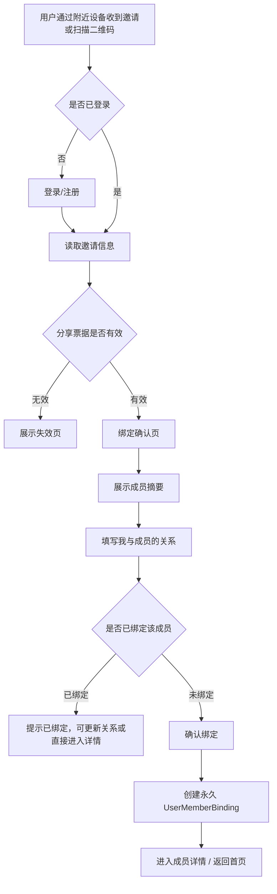

# 成员多用户绑定与分享需求文档

- 项目：SparkClient / SparkService
- 文档版本：v1.0
- 生成日期：2026-05-23
- 文档目的：讨论并沉淀“成员支持多用户绑定”后的首页成员入口、成员详情页、更多操作、分享与绑定关系填写方案。本文仅为需求设计，不涉及代码改动。

---

## 1. 背景与目标

### 1.1 现状

当前成员模型更接近“用户 1-1 拥有成员”：

- 服务端 `Member` 继承 `MedicalBaseModel`，包含 `user` 字段，成员与医疗数据按当前登录用户隔离。
- 成员字段里的 `relationship` 表示“该成员与当前主账户的关系”。
- 客户端首页顶部成员 Chip 选中后弹出操作：编辑、删除。
- 新增/编辑成员页面同时维护成员基础信息和关系。

### 1.2 新目标

成员需要支持被多个用户绑定：

- 一个真实成员档案可以被多个账号访问。
- 每个账号与该成员都有独立的“关系”描述，例如 A 绑定为“本人”，B 绑定为“父亲”，C 绑定为“女儿”。
- `Member` 表结构保持不变，不迁移、不删除、不改现有字段；仅新增 `UserMemberBinding` 作为多用户绑定关系。
- 绑定用户需要单独填写“我与该成员的关系”，业务读取统一使用 `UserMemberBinding.relationship`。
- 首页成员入口从直接“编辑/删除成员”改为“查看详细/分享”，降低误操作风险。
- 成员详情页承载成员资料、绑定信息、共享用户、医疗概览，并在右上角提供更多操作：分享、编辑、删除。

### 1.3 核心原则

- `Member` 继续沿用现有模型和字段，作为成员档案主表；`UserMemberBinding` 只表达“哪个用户绑定了哪个成员，以及该用户视角下的关系/权限”。
- 分享不是复制成员，而是邀请另一个用户绑定同一个成员。
- 绑定时必须填写“我与该成员的关系”，该关系只对绑定用户自身生效。
- 医疗数据继续归属成员维度；权限由用户是否拥有有效绑定决定。
- 删除要区分“解绑”和“删除成员档案”。普通用户优先做解绑；只有满足权限和无其他绑定时才允许删除档案。

---

## 2. 术语

| 术语 | 含义 |
| --- | --- |
| 成员 / Member | 被管理的真实健康档案主体，例如本人、父母、孩子 |
| 绑定 / Binding | 某个用户与某个成员之间的访问关系 |
| 关系 / Relationship | 绑定用户视角下与成员的关系，例如本人、父亲、母亲、子女、其他 |
| 分享 / Share | 当前用户邀请另一个用户绑定同一成员 |
| 邀请人 | 发起分享的用户 |
| 被邀请人 | 接收分享并完成绑定的用户 |
| 管理者 | 对成员档案拥有编辑、分享、解绑/删除权限的绑定用户 |

---

## 3. 信息架构调整

### 3.1 服务端概念模型

建议从“成员直接归属用户”扩展为“现有 Member + 新增绑定关系”。`Member` 表结构不做任何改动，仅新增 `UserMemberBinding` 表关联到 `Member` 和 `User`。

```text
Member                          # 保持现有表结构，不做字段调整
  user                          # 当前创建/归属用户
  name
  gender
  relationship                  # 字段存在于当前模型；新业务不作为用户-成员关系真源
  birth_date
  blood_type
  allergies
  chronic_conditions
  notes
  avatar_url
  is_primary
  created_at / updated_at       # 来自 MedicalBaseModel

UserMemberBinding               # 用户-成员绑定（新增表）
  id                            # 绑定主键
  user_id                       # 用户 ID
  member_id                     # 成员 ID
  relationship                  # 当前绑定用户视角下与成员的关系（如 self / father / mother / other）
  role                          # 权限角色：owner / admin / viewer
  status                        # 绑定状态：active / revoked 等
  invited_by                    # 邀请人用户 ID（通过分享绑定时记录，自创建可为空）
  created_at                    # 创建时间
  updated_at                    # 更新时间
```

### 3.2 字段与业务真源

| 字段 | 归属 | 说明 |
| --- | --- | --- |
| `Member` 全部现有字段 | `Member` | 不做任何表结构改动 |
| 分享绑定关系 | `UserMemberBinding` | 新增表，关联 `user_id + member_id` |
| 当前用户与成员关系 | `UserMemberBinding.relationship` | 分享绑定时必填；不同用户可以不同 |
| 权限角色 | `UserMemberBinding.role` | owner/admin/viewer 等；第一期可简化 |
| 是否可编辑/分享/删除 | 从绑定角色和成员绑定数量计算 | 客户端使用服务端返回能力位 |
| 绑定状态 | `UserMemberBinding.status` | active / revoked，控制是否可访问 |

业务规则：

- 创建成员时，继续创建 `Member`；同时为创建者创建一条 `UserMemberBinding`。
- 成员列表、成员详情、分享绑定确认页展示的“我与成员的关系”，统一来自 `UserMemberBinding.relationship`。
- `Member.relationship` 不作为多用户绑定关系的业务真源，不参与分享绑定关系判断。
- 首页默认成员选择第一期仍可沿用现有 `Member.is_primary` 和本地 selected member 逻辑；是否迁移为绑定维度默认成员，放到后续版本讨论。

---

## 4. 首页成员入口调整

### 4.1 当前入口

首页顶部成员 Chip：

- 未选中：点击切换成员。
- 已选中：点击弹出菜单，包含“编辑”“删除”。

### 4.2 调整后入口

首页顶部成员 Chip：

- 未选中：点击切换成员。
- 已选中：点击弹出菜单，包含：
  - 查看详细
  - 分享
  - 取消

不再在首页菜单直接出现“编辑”“删除”。

### 4.3 交互原因

- 成员支持多用户绑定后，“删除”语义变复杂，首页直接删除容易误删共享档案。
- “编辑”也可能影响其他绑定用户看到的共享资料，应放到详情页并展示影响范围。
- “分享”属于高频协作动作，可保留在首页快捷入口。

### 4.4 首页成员 Chip 展示建议

Chip 保持当前轻量形态：

- 头像/关系首字 + 成员名。
- 选中态仍用强调色。
- 选中成员右侧图标从编辑笔建议改为 `ellipsis.circle` 或 `chevron.down`，表达“更多入口”而不是“编辑”。

---

## 5. 成员详情页设计

### 5.1 入口

成员详情页从以下位置进入：

- 首页成员 Chip 菜单 -> 查看详细。
- 首页成员 Chip 菜单 -> 分享，若需要先展示成员信息，可先进入详情页再拉起分享 Sheet。
- 未来可从成员选择器、聊天成员绑定菜单、医疗资料列表成员头部进入。

### 5.2 页面目标

成员详情页负责回答四个问题：

- 这个成员是谁？
- 我和这个成员是什么关系？
- 有哪些健康资料/最近动态？
- 我能对这个成员做什么操作？

### 5.3 页面结构

```text
导航栏
  标题：成员详情
  右上角：更多(...)

成员头部
  头像 / 关系徽标
  成员姓名
  当前用户关系：我的父亲 / 本人 / 其他
  共享状态：已与 2 位用户绑定

基础资料
  性别
  出生日期 / 年龄
  血型
  过敏史
  慢病
  备注

我的绑定
  我与成员的关系
  我的权限角色
  是否默认成员

医疗概览
  病历数
  体检报告数
  检查报告数
  服药计划数
  最近更新时间

共享用户
  用户昵称/脱敏手机号或邮箱
  与成员关系
  权限角色
  绑定时间

危险操作区
  解绑该成员 / 删除成员档案
```

### 5.4 更多操作

详情页右上角更多菜单包含：

- 分享
- 编辑
- 删除

展示规则：

- 分享：`can_share = true` 时可点，否则隐藏或置灰。
- 编辑：`can_edit = true` 时可点，否则隐藏或置灰。
- 删除：`can_delete = true` 或 `can_unbind = true` 时展示，但点击后进入二次确认，由服务端能力决定最终文案。

### 5.5 删除语义

删除按钮需要根据场景转译：

| 场景 | 文案 | 结果 |
| --- | --- | --- |
| 当前成员还有其他用户绑定 | 解绑该成员 | 只删除当前用户绑定关系，不删除成员和医疗数据 |
| 当前用户是唯一绑定用户 | 删除成员档案 | 删除成员、医疗数据或执行服务端软删除 |
| 当前用户无权限删除档案但可解绑 | 解绑该成员 | 仅解绑 |
| 当前用户无任何删除/解绑权限 | 不展示或置灰 | 无操作 |

确认弹窗必须明确影响范围：

- 解绑：你将无法继续查看该成员资料，其他已绑定用户不受影响。
- 删除档案：将删除该成员及相关健康资料，此操作可能影响所有绑定用户。

---

## 6. 分享功能设计

### 6.1 分享目标

用户可以把某个成员分享给其他用户绑定。被邀请用户接受后，需要填写“我与该成员的关系”，完成绑定后即可在首页成员列表看到该成员。

### 6.2 分享入口

- 首页选中成员菜单 -> 分享。
- 成员详情页右上角更多 -> 分享。
- 成员详情页共享用户区 -> 邀请成员。

### 6.3 分享方式

第一期不走复杂邀请链接流，改为“面对面快速分享”：

- 附近设备：参考 `bitchat-main` 的 BLE 近场发现思路，发现附近打开同一分享/接收页的用户，选择对方后发送一次性绑定邀请。
- 二维码：分享页展示成员绑定二维码；被邀请用户在 App 内扫码后进入绑定确认页。
- 永久绑定：用户接受后创建长期有效的 `UserMemberBinding`，不是临时访问、不是短期授权。

第一期不做：

- 有效期选择。
- 权限选择。
- 系统分享链接。
- 输入手机号/邮箱。
- App 内通知邀请。

附近设备技术参考：

- `bitchat-main` 使用 `CoreBluetooth` 同时做 Central/Peripheral，设备通过固定 Service UUID 扫描和广播，发现附近 peer 后建立连接。
- Spark 不需要完整 mesh 聊天、TTL 多跳转发、文件分片和消息时间线，只需要一个轻量 `NearbyShareTransport`。
- 传输内容只放分享票据 payload，例如 `share_ticket`、`member_id`、成员摘要、邀请人摘要、签名/nonce。
- 不新增分享邀请数据表；分享票据由服务端签名生成，接受时校验签名和权限后直接创建 `UserMemberBinding`。
- 绑定最终仍由服务端确认，BLE/二维码只负责把分享票据交给对方，避免本地伪造绑定。

二期可补充：

- 输入手机号/邮箱定向邀请。
- App 内通知邀请。
- 系统分享链接。

### 6.4 分享 Sheet 设计

分享 Sheet 做成公共分享页，后续所有“把某个资源分享给其他用户”的场景都复用同一个容器，只替换资源摘要和分享通道。

```text
公共分享页 ShareSheet
  标题：分享

资源摘要区
  头像 + 成员名
  当前我的关系
  已绑定用户数量

分享方式区
  附近设备
    正在发现附近用户...
    用户列表：头像 / 昵称 / 距离提示或最近发现时间
    点击用户 -> 发送绑定邀请

  二维码
    展示二维码
    说明：让对方用 Spark 扫一扫

底部说明
  对方接受后需要填写与成员的关系。
  接受后为永久绑定，可在成员详情中解绑。

关闭
```

第一期默认权限：

- 被邀请用户接受后获得长期绑定。
- 默认角色建议为 `viewer` 或“家庭成员普通权限”；是否允许编辑医疗资料需产品再定。
- 分享页不暴露权限配置，避免流程变重；服务端和接口仍预留 `role`。

公共化设计：

- `ShareSheet` 负责标题、资源摘要、分享方式入口、结果提示。
- `ShareResourceSummary` 描述被分享资源：类型、ID、标题、头像、摘要。
- `ShareChannel` 描述分享通道：附近设备、二维码；二期新增手机号/邮箱、App 内通知时只新增 channel。
- 成员分享只是第一个资源类型，后续可复用给报告、病历、任务等。

### 6.4.1 扫码入口放置

应用内扫码入口建议放两个位置：

- 首页右上角或成员栏附近增加“扫一扫”入口，用于面对面绑定成员，离当前场景最近。
- 分享 Sheet 的二维码区域增加“扫码绑定别人分享给我的成员”文本按钮，方便双方都在同一页面完成操作。

不建议第一期放到设置页深处；扫码是即时动作，应该靠近首页成员上下文。

### 6.5 被邀请用户绑定流程



第一期流程压缩为三步：

1. 分享人点击“分享”，打开公共分享页。
2. 被邀请人通过附近设备接收或扫码进入确认页。
3. 被邀请人选择关系并确认，完成永久绑定。

### 6.6 绑定确认页设计

页面内容：

- 标题：绑定成员
- 邀请人信息：某某正在分享成员给你。
- 成员摘要：姓名、性别、年龄/生日，避免展示医疗明细。
- 关系选择：必须填写。
- 绑定说明：确认后该成员会加入你的首页成员列表，属于永久绑定，可随时解绑。
- 主按钮：确认绑定。
- 次按钮：取消。

关系选择：

- 复用当前 `MemberRelationshipCatalog`：本人、父亲、母亲、丈夫、妻子、儿子、女儿、兄弟姐妹、祖父母、外祖父母、其他。
- 当选择“其他”时，建议允许输入自定义关系，最多 20 字。
- 若被邀请用户选择“本人”，需要允许，但后续可加风险提示：确认该成员是你的本人档案。

### 6.7 分享后权限与隐私

服务端必须校验：

- 只有拥有 `can_share` 的绑定用户可以生成分享票据。
- 分享票据不能直接暴露连续 ID，必须包含服务端签名，防止篡改 `member_id`、`inviter_user_id`、`role`。
- 被邀请用户接受分享时不能绕过权限创建任意绑定。
- 若成员已删除、分享者已失去分享权限、当前用户已绑定该成员，服务端需要返回明确错误码或幂等结果。
- 成员医疗资料接口必须从“请求用户是否绑定该成员”判断权限，不再只看 `Member.user == request.user`。

客户端需要提示：

- 分享成员会让对方访问该成员的健康资料。
- 对方填写的关系是对方视角，不会改变你这边的关系。
- 你可以在成员详情页查看共享用户，并在有权限时移除绑定。

---

## 7. 接口需求建议

### 7.1 成员列表

`GET /api/v1/medical/members/`

返回当前用户已绑定成员列表。每项建议包含：

```json
{
  "id": 12,
  "binding_id": 88,
  "name": "张三",
  "gender": "male",
  "relationship": "father",
  "birth_date": "1968-02-01",
  "avatar_url": "",
  "is_primary": false,
  "binding_role": "admin",
  "shared_user_count": 2,
  "can_share": true,
  "can_edit": true,
  "can_delete": false,
  "can_unbind": true,
  "updated_at": "2026-05-23T10:00:00Z"
}
```

### 7.2 成员详情

`GET /api/v1/medical/members/{member_id}/`

返回：

- 成员基础资料。
- 当前用户绑定关系。
- 能力位。
- 共享用户列表，按权限决定是否返回完整信息。
- 医疗概览统计。

### 7.3 更新成员基础资料

`PATCH /api/v1/medical/members/{member_id}/`

用于编辑共享成员资料，要求当前绑定具备 `can_edit`。

### 7.4 更新我的绑定关系

`PATCH /api/v1/medical/member-bindings/{binding_id}/`

用于编辑当前用户自己的绑定关系：

- `relationship`

说明：

- `is_primary` 仍属于现有 `Member` 字段，第一期不迁移到绑定表。
- 不新增 `alias_name` 等备注名字段，避免绑定表过重。

### 7.5 解绑成员

`DELETE /api/v1/medical/member-bindings/{binding_id}/`

仅删除当前用户与成员的绑定关系。

### 7.6 删除成员档案

`DELETE /api/v1/medical/members/{member_id}/`

仅当服务端判定可删除时执行。若成员仍有其他绑定用户，服务端应拒绝或转为解绑，建议返回明确错误码：

- `member_has_other_bindings`
- `permission_denied`
- `cannot_delete_primary_binding`

### 7.7 生成分享票据

`POST /api/v1/medical/members/{member_id}/share-ticket/`

请求：

```json
{
  "channel": "nearby",
  "role": "viewer"
}
```

返回：

```json
{
  "share_ticket": "signed.payload.xxxx",
  "qr_payload": "spark://member-share?ticket=signed.payload.xxxx",
  "nearby_payload": {
    "type": "member_share",
    "ticket": "signed.payload.xxxx",
    "member_id": 12
  }
}
```

说明：

- `channel = nearby` 时用于附近设备传输。
- `channel = qr` 时用于生成二维码。
- 第一期不返回系统分享链接，不提供有效期选择。
- 不新增分享邀请数据表，不记录邀请生命周期。
- `share_ticket` 是服务端签名票据，建议包含 `member_id`、`inviter_user_id`、`role`、`channel`、`issued_at`、`nonce`。
- 票据本身只是进入绑定确认页和提交绑定的凭证；绑定成功后创建永久 `UserMemberBinding`。

### 7.8 解析分享票据

`POST /api/v1/medical/member-share-ticket/resolve/`

请求：

```json
{
  "share_ticket": "signed.payload.xxxx"
}
```

返回成员摘要、邀请人摘要、当前用户是否已绑定该成员、默认角色。

### 7.9 接受分享并绑定

`POST /api/v1/medical/member-share-ticket/accept/`

请求：

```json
{
  "share_ticket": "signed.payload.xxxx",
  "relationship": "father",
  "custom_relationship": ""
}
```

返回新绑定后的成员详情或成员列表项。

幂等规则：

- 如果当前用户已经绑定该成员，返回已绑定状态，并允许用户更新自己的关系。
- 如果分享者已经没有分享权限或成员不存在，返回明确错误码。
- 不做“已使用即失效”的状态记录；是否允许同一票据被多个人扫码绑定，由服务端签名策略和产品规则决定。第一期面对面分享可以接受多人扫码，绑定仍需要逐个确认。

---

## 8. 客户端页面与状态

### 8.1 新增页面

| 页面 | 说明 |
| --- | --- |
| `MemberDetailView` | 成员详情页 |
| `ShareSheet` | 公共分享页，第一期承载附近设备和二维码 |
| `NearbyShareDeviceListView` | 附近设备发现与发送分享票据 |
| `QRCodeShareView` | 成员绑定二维码展示 |
| `QRCodeScannerView` | 应用内扫码入口 |
| `MemberShareAcceptView` | 分享绑定确认页 |

### 8.2 调整页面

| 页面 | 调整 |
| --- | --- |
| 首页 `HomeView` | 成员 Chip 菜单从“编辑/删除”改为“查看详细/分享” |
| `AddFamilyMemberView` | 继续用于创建/编辑成员；创建成功时服务端同时补创建者的 `UserMemberBinding` |
| `MemberProfileBindingMenu` | 列表继续展示当前用户已绑定成员 |
| 医疗上传/问报告 | 成员 ID 仍作为医疗资料归属维度，但权限由绑定关系保障 |

### 8.3 本地状态建议

`MemberContextStore` 后续应保存“当前用户可见成员列表”，其中每个成员包含当前用户绑定关系。选中成员仍按账号维度本地持久化。

### 8.4 分享票据载荷与 Deep Link

客户端需要支持：

```text
spark://member-share?ticket=xxx
```

处理规则：

- 未登录：缓存 `share_ticket`，登录完成后继续打开绑定确认页。
- 已登录：解析分享票据并展示绑定确认页。
- 票据无效、签名错误、成员不存在、分享者无权限：展示失效页。
- 已绑定：展示“你已绑定该成员”，允许更新关系或进入详情。
- 附近设备收到的 payload 和二维码扫码结果都统一解析为同一个 `spark://member-share?ticket=xxx`。

---

## 9. 权限规则

### 9.1 推荐角色

| 角色 | 能力 |
| --- | --- |
| owner | 查看、编辑、分享、管理绑定用户、删除档案 |
| admin | 查看、编辑、分享、移除部分绑定 |
| viewer | 查看资料，编辑自己的关系，解绑自己 |

第一期可以简化为：

- 创建者：可编辑、可分享、可删除/解绑。
- 被分享者：可查看、可编辑自己的关系、可解绑自己。

### 9.2 医疗资料访问

所有成员相关医疗接口需要统一校验：

```text
request.user 与 member 存在 active binding
```

不应只依赖 `record.user == request.user`。医疗资料访问权限以成员绑定关系为准。

### 9.3 共享用户管理

详情页共享用户列表中：

- 当前用户永远可看到自己的绑定。
- 管理者可看到所有绑定用户的脱敏信息。
- 普通查看者可只看到“已与 N 位用户绑定”，不展示完整列表。

---

## 10. 边界场景

| 场景 | 处理 |
| --- | --- |
| 分享票据签名无效 | 展示“分享信息无效” |
| 分享者失去分享权限 | 展示“分享已失效” |
| 成员被删除 | 分享失效，详情不可访问 |
| 被邀请人已绑定该成员 | 提示已绑定，可更新关系或进入详情 |
| 被邀请人填写关系为空 | 禁止提交 |
| 当前用户解绑当前选中成员 | 首页自动选择剩余成员；无成员时展示空态 |
| 删除唯一成员 | 二次确认后清空首页成员上下文 |
| 编辑成员基础信息 | 提示该信息会影响所有绑定用户 |

---

## 11. 埋点建议

- `member_detail_open`
- `member_action_menu_open`
- `member_share_open`
- `member_share_created`
- `member_share_nearby_open`
- `member_share_nearby_device_found`
- `member_share_nearby_sent`
- `member_share_qr_show`
- `member_share_qr_scan_open`
- `member_invite_open`
- `member_invite_accept_success`
- `member_invite_accept_failed`
- `member_binding_relationship_selected`
- `member_unbind_confirmed`
- `member_delete_confirmed`

---

## 12. 验收标准

### 12.1 首页入口

1. 选中成员后点击 Chip，不再出现“编辑/删除”。
2. 菜单展示“查看详细/分享/取消”。
3. 点击“查看详细”进入对应成员详情页。
4. 点击“分享”进入分享流程。

### 12.2 成员详情

1. 展示成员基础资料、我的关系、医疗概览。
2. 右上角更多菜单包含分享、编辑、删除。
3. 无权限操作不应可执行。
4. 删除操作根据绑定数量展示“解绑”或“删除档案”的确认文案。

### 12.3 分享绑定

1. 有权限用户点击“分享”后进入公共分享页。
2. 公共分享页第一期提供“附近设备”和“二维码”两个方式。
3. 附近设备可发现同样打开接收状态的用户，并发送成员邀请。
4. 二维码可被 App 内扫码入口识别，并打开绑定确认页。
5. 被邀请用户进入确认页后必须填写与成员的关系。
6. 绑定成功后，该成员出现在被邀请用户首页成员列表。
7. 邀请人和被邀请人的 `relationship` 可以不同，互不覆盖。
8. 绑定为永久绑定，用户可在成员详情中解绑。

### 12.4 服务端权限

1. 未绑定用户不能读取成员详情和医疗资料。
2. 已绑定用户可以读取授权范围内的成员资料。
3. 成员有多个绑定用户时，普通删除不会误删共享档案。
4. 分享票据签名错误、成员不存在、分享者无权限、重复绑定都有明确响应。

---

## 13. 待确认问题

1. “气筒用户绑定”是否指“其他用户绑定”。本文按“其他用户”理解。
2. 被分享用户第一期是否只能查看，还是允许编辑医疗资料。
3. 附近设备第一期是否必须要求双方都打开分享/接收页，还是后台也可被发现。
4. 成员档案被多个用户绑定后，谁拥有最终删除权。
5. 医疗资料权限是否完全按成员绑定判断，`record.user` 仅作为创建者记录。
6. 共享用户列表是否对普通用户展示，还是仅展示绑定人数。
