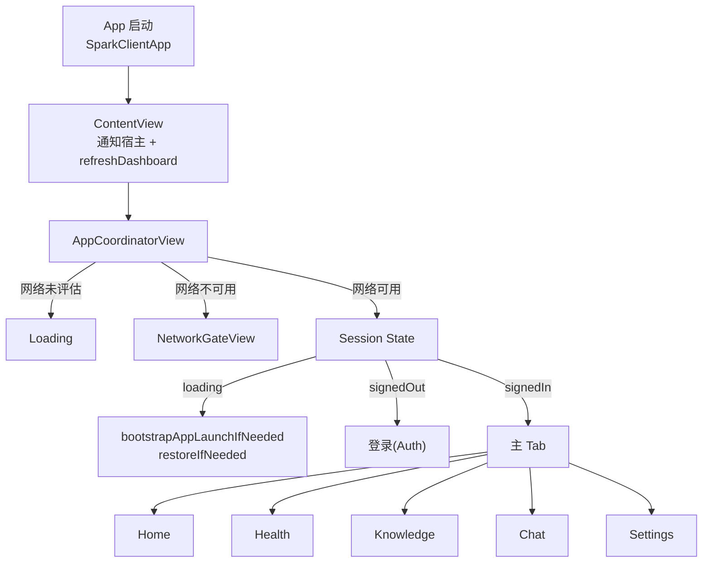

# SparkClient 标准需求文档（按模块/页面/接口）

- 项目：SparkClient（iOS，SwiftUI + Tuist，模块化 Feature 架构）
- 文档版本：v1.0（从现有代码反推需求）
- 生成日期：2026-04-11
- 文档目的：梳理整体业务流程、初始化链路、模块与页面、触发场景、接口清单、数据展示规则与页面约束，作为产品/研发/测试对齐依据。

---

## 1. 范围与术语

### 1.1 业务范围（本项目覆盖）

- 认证登录：Sign in with Apple
- 主 Tab：
  - 首页 Home：成员/就诊人切换、医疗摘要卡片、HealthKit 基础指标入口、进入病历上传
  - 健康 Health：健康指标时间轴（远程指标为主）
  - 知识库 Knowledge：本地 Markdown 知识库（列表/详情/搜索/索引重建）
  - 对话 Chat：会话列表、会话详情、发送与流式回复、失败重试、增量同步
  - 设置 Settings：同步偏好、清缓存、退出登录、进入 AI 设置
- AI 设置：模型/API Key/工具开关/个性化（Prompt repo、Memory archive、翻译词典等）
- 医疗文档上传：选择文件 -> 上传 -> OCR/类型识别/抽取 -> 结果展示 -> 保存并绑定附件
- 通知体系：应用内通知队列/投递协调/收件箱（UI 宿主在 App 层）
- 医疗同步：后台/手动同步（设置页可控）

### 1.2 不在范围（代码中未体现或未提供 UI）

- 医疗记录详情页（MedicalRecord Feature 仅提供 UseCase/Repository，无 Presentation 页面）
- 账户注销/停用（Deactivation API 有实现，但 UI 未暴露）

### 1.3 核心术语

- `profileID`：用户档案（`UserSession.profileID`，UUID）
- Member/成员：医疗家庭成员/就诊人（可为本人或家属）
- Thread/会话：聊天会话线程（UUID）
- Message/消息：聊天消息（含本地 clientMessageID 与可选 serverMessageID）
- ETag：读接口的缓存机制（读请求允许 `allowETag=true`，TTL 常为 120s）

---

## 2. 总体业务流程（端到端）

### 2.1 App 启动与导航总览

#### 2.1.1 启动分支

1. App 启动（`SparkClientApp`）
2. 安装推送适配器为 NotificationCenter delegate
3. `ContentView` 挂载通知宿主 + 协调器，并刷新通知 Dashboard
4. `AppCoordinatorView` 依据网络与会话状态决定展示：
   - 网络未评估：加载中
   - 网络不可用：NetworkGateView（网络门禁）
   - 网络可用：进入会话分支
5. 会话分支：
   - `.loading`：执行 `AppBootstrapper.bootstrapAppLaunchIfNeeded()` + `sessionStore.restoreIfNeeded()`
   - `.signedOut`：进入登录页（并重置启动器/清空就诊人上下文）
   - `.signedIn(session)`：进入主 Tab（并对该 profile 执行 bootstrap、请求推送权限）

#### 2.1.2 Mermaid 流程图

---

## 3. 初始化（Initialization）模块需求

### 3.1 初始化目标

- 保障“网络可用性判定 + 会话恢复/登录态判定 + 远程 AI 配置预热 + 医疗同步启动条件 + 推送适配”在正确时机触发
- 避免在登录页弹系统推送授权弹窗（仅在进入已登录态后再请求）
- 通过 ETag/缓存降低启动与频繁切换页面的网络压力

### 3.2 初始化时机与触发点

- App 进入前台首次渲染：
  - `container.pushAdapter.installAsNotificationCenterDelegate()`
- 进入 `ContentView`：
  - `notificationDeliveryCoordinator.refreshDashboard()`
- `AppCoordinatorView` 进入 `.loading`：
  - `appBootstrapper.bootstrapAppLaunchIfNeeded()`
  - `sessionStore.restoreIfNeeded()`（恢复会话）
- 从 `.signedOut` -> `.signedIn` 切换后：
  - `appBootstrapper.bootstrapIfNeeded(for: session)`
  - `pushAdapter.requestAuthorizationIfNeeded()`（请求推送权限）

### 3.3 初始化执行内容（AppBootstrapper）

#### 3.3.1 冷启动 bootstrap（不依赖登录）

- 刷新远程 AI 配置：`aiConfigCenter.refreshRemoteConfig()`
- 预热 AI：`aiConfigCenter.prewarm()`
- 为所有 `AIScenario.allCases` 解析可用配置：`aiConfigCenter.resolve(for:)`
- 设备登记：`registerDevice()`（可能匿名或已登录态）

#### 3.3.2 登录后 profile bootstrap

- 重置路由：`routeStore.resetForNewSession()`
- 再次刷新并预热 AI 配置
- 医疗同步 bootstrap：`medicalSyncService.bootstrapIfNeeded()`
- 预拉取 OSS STS：`ossConfigurationStore.prefetchFromBackend(using: ossAPI)`
- 解析所有场景配置
- 设备登记（带用户上下文）

### 3.4 初始化约束与异常处理

- 初始化阶段任何网络失败均允许“降级完成”（日志 warning，不阻塞进入主 UI）
- 推送权限请求必须在已登录态后触发
- 网络门禁：未满足网络条件不进入会话分支

---

## 4. 模块与页面需求（按 Tab/功能拆分）

## 4.1 认证模块 Auth

### 4.1.1 页面：登录页 `LoginView`

- 入口：
  - 会话状态为 `.signedOut` 时展示
- 页面元素：
  - App 标识/标题/副标题
  - Apple 登录按钮（`SignInWithAppleButton`）
  - 错误提示区域（`errorMessage`）
  - Loading 状态（`isLoading` 时 ProgressView）
- 触发场景：
  - 点击 Apple 登录按钮并完成系统授权回调后触发登录用例
- 规则与约束：
  - 登录过程中禁用按钮，避免重复提交
  - 若授权回调缺失 identity token，展示本地化错误

### 4.1.2 用例/接口映射

- `SignInWithAppleUseCase` -> `SparkAuthAPI.loginWithApple`
  - `POST /api/v1/auth/apple/login/`
  - 请求字段：`identity_token`, `authorization_code?`, `nonce?`, `user`, `email?`, `full_name?`, `bundle_id`, `device_id`
  - 响应字段（关键）：`user_id`, `access_token`, `refresh_token`, `expires_in`, `token_type`, `email?`, `display_name?`
- token 刷新：`SparkAuthAPI.refresh`
  - `POST /api/v1/auth/token/refresh/`

---

## 4.2 主 Tab 总览 MainTab

主 Tab 固定 5 个入口：

1. Home（首页）
2. Health（健康时间轴）
3. Knowledge（知识库）
4. Chat（对话）
5. Settings（设置）

导航结构：每个 Tab 内使用 `NavigationView` 承载栈式 push。

---

## 4.3 首页模块 Home

### 4.3.1 页面：首页 `HomeView`

- 入口：
  - 登录后主 Tab 的 Home
- 页面结构：
  - 顶部悬浮：成员选择条（横向滚动 Chips）
  - Header Card：问候语、登录时间、跳转健康时间轴按钮
  - 医疗信息区：
    - 标题 + 上传入口按钮
    - 医疗摘要卡片（2 列网格）
  - 健康基础区：
    - 标题 + 授权 HealthKit 按钮
    - 指标列表（由 `HomeDashboard.motion.healthBasics` 驱动）
- 触发场景：
  - 首次进入页面：`.task` -> `viewModel.load()`
  - 下拉刷新：`.refreshable` -> `viewModel.refresh()`
  - 选择成员：点 Chip -> `viewModel.selectMember(member.id)`（不拉远端，仅重算/本地快照）
  - 新增成员：点 “+” -> Sheet 弹出 `AddFamilyMemberView(mode: .create)`
  - 编辑成员：Chip 上编辑 -> Sheet `AddFamilyMemberView(mode: .edit(member))`
  - 删除成员：Chip 删除 -> Alert 二次确认 -> `viewModel.deleteMember(target)`
  - 点击“时间轴”按钮 / 点击医疗卡片：跳转 Health Tab
  - 点击“上传病历”按钮：全屏弹出医疗文档上传（`MedicalDocumentUploadHostView`）
  - 点击“健康授权”：`viewModel.requestHealthAuthorization()`

### 4.3.2 页面：新增/编辑成员 `AddFamilyMemberView`

- 模式：
  - `create` 新增
  - `edit(Member)` 编辑
- 校验规则：
  - `name` 非空（trim 后）
  - `birthDate` 必填（否则保存按钮禁用）
- 字段规则：
  - 关系 relationship：从预置字典选择（含“本人/父母/配偶/子女/祖辈/其他”等）
  - 性别 gender：可由关系推断（部分关系自动推断男女），也允许手动选择
  - 出生日期：通过 DatePicker（wheel）选择，范围 `...Date()`（不可选择未来日期）
- 触发：
  - 保存：调用 `HomeViewModel.addMember` 或 `updateMember`，完成后 dismiss

### 4.3.3 数据展示规则（首页）

- 成员条：
  - 数据源：`dashboard.members`
  - 选中态：`member.id == selectedMemberID`
  - 删除：需要二次确认，确认文案带成员名
- 医疗卡片：
  - 数据源：`dashboard.medical.cards`
  - 数字展示：
    - `medicalCases.count`：病历数量
    - `healthExamReports.count`：体检报告数量
    - `medicalReports.count`：检查/检验报告数量
    - `medications` 卡展示“今日服药依从率(%)”：`takenToday / todayRecords * 100`，无记录时为 0
  - 日期展示：取 `latestDate`，只显示日期不显示时间
- 运动健康：
  - 若加载失败：降级为 `healthAuthorizationStatus = .unavailable`，页面不报错弹窗（只记录日志）

### 4.3.4 用例/接口映射（首页）

- 首页加载：
  - `LoadHomeMedicalOverviewUseCase`
    - 若 `syncRemote=true`：`HomeMemberRepository.refreshRemoteSnapshot()`（触发医疗同步/快照拉取，具体实现由仓库决定）
    - `loadMembers()` + `loadSnapshot(memberID:)`
    - 远端读接口通常来自 `SparkMedicalQueryAPI`（见“接口清单-医疗查询”）
  - `LoadHomeMotionHealthUseCase`：读 HealthKit（本机）
- 成员 CRUD：
  - `ManageHomeMemberUseCase` -> `HomeMemberRepository`
  - 接口：`SparkMedicalMemberAPI`
    - 列表：`GET /api/v1/medical/resources/?kind=members`
    - 创建：`POST /api/v1/medical/resources/?kind=members`
    - 更新：`PUT /api/v1/medical/resources/<id>/?kind=members`
    - 删除：`DELETE /api/v1/medical/resources/<id>/?kind=members`
- 进入上传：
  - 仅 UI 跳转；实际接口见“医疗文档上传模块”

---

## 4.4 健康模块 Health

### 4.4.1 页面：健康时间轴 `HealthTimelineView`

- 入口：
  - Health Tab
  - Home 页面点击“时间轴”或点击医疗卡片（切换 Tab）
- 页面元素：
  - 顶部介绍：当前用户 displayName + 说明文案
  - 列表：健康指标项（标题、数值、记录时间）
  - 加载中：当 `metrics` 为空且 `isLoading=true` 显示 Progress
  - 错误覆盖层：`errorMessage != nil` 显示居中错误卡片
- 触发：
  - 进入页面：`.task` -> `viewModel.load()`
- 展示规则：
  - steps：值显示为整数
  - 其它：保留 1 位小数
  - 时间：`abbreviated date + shortened time`

### 4.4.2 用例/接口映射（健康时间轴）

- `LoadHealthTimelineUseCase` -> `HealthMetricsRepository.fetchRecentMetrics(profileID, limit: 30)`
- 远端实现：`RemoteHealthMetricsRepository(queryAPI: backend.medicalQuery)`
  - 主要接口：`SparkMedicalQueryAPI.listHealthMetrics(profileClientUID:)`
  - 资源路径（通用列表）：`GET /api/v1/medical/resources/?kind=health_metrics&profile_client_uid=<uuid>`

---

## 4.5 知识库模块 Knowledge（本地）

### 4.5.1 页面：知识库首页 `KnowledgeLibraryView`

- 入口：Knowledge Tab
- 页面元素：
  - 文档列表（标题、摘要、更新时间、chunk 数）
  - 空态：无文档且非 loading 时展示
  - 顶部工具：
    - 搜索按钮 -> `KnowledgeSearchView`
    - 新建按钮 -> 创建空白文档并 push 到详情
  - 行操作：右滑/菜单删除
- 触发：
  - 首次进入：`.task` -> `viewModel.loadIfNeeded()`
  - 下拉刷新：`viewModel.refresh()`
  - 新建：
    1. `viewModel.createNewDocument()`（先持久化）
    2. push 到 `KnowledgeDocumentDetailView(documentID:)`
- 规则：
  - 删除为 destructive 行为，删除后从列表与搜索结果移除
  - 错误通过 alert 展示（`errorMessage != nil`）

### 4.5.2 页面：知识库详情/搜索

- 代码结构上由 `KnowledgeLibraryViewModel` 统一承载状态，详情/搜索页面与其共享：
  - `loadDocument(id:)`
  - `saveDocument(id?, title, content, source)`
  - `search(query:)`
  - `rebuildIndex(for:)`

### 4.5.3 数据规则（知识库）

- 文档实体：`KnowledgeDocument`
  - `title`、`content`、`updatedAt`、`chunkCount`
- chunk/索引：
  - `SearchKnowledgeUseCase` 返回 `KnowledgeSearchResult`，展示为搜索结果列表
  - `ReindexKnowledgeDocumentUseCase` 用于手动重建某文档索引（chunk）

### 4.5.4 触发场景（与 Chat 工具联动）

- Chat 中启用 `useKnowledgeBag` 时，会通过工具链使用知识库的检索能力（具体工具名称在 ToolHub 内定义）

---

## 4.6 对话模块 Chat

### 4.6.1 页面：会话列表 `ChatConversationListPage`

- 入口：Chat Tab
- 页面元素：
  - 会话列表（标题、最新消息预览、时间）
  - 搜索框：按标题或预览内容匹配（本地过滤）
  - 新建按钮：`plus.bubble`
  - 空态：无会话时提示并提供创建按钮
  - 行操作：右滑/长按菜单删除
- 触发：
  - 首次进入：`listViewModel.loadForListIfNeeded()`
  - 下拉刷新：
    - `detailViewModel.sync()`（先同步）
    - `listViewModel.refreshThreads()`（再刷新列表）
  - 新建会话：
    1. `listViewModel.createThread()`（标题为本地化默认）
    2. 获取 `stateStore.selectedThreadID`
    3. `detailViewModel.loadMessagesIfNeeded(for:)`
    4. 跳转到会话详情页
- 展示规则（时间格式）：
  - 今日：`HH:mm`
  - 昨日：`Yesterday`
  - 其它：`MM-dd`

### 4.6.2 页面：会话详情 `ChatView`

- 入口：从会话列表 push
- 页面元素：
  - 消息列表（Markdown 渲染，按角色左右对齐）
  - 流式发送中：底部显示 ProgressView
  - 输入栏两种风格：
    - Signal 风格：`ChatComposerView`
    - Hanlin 风格：`HanlinChatComposerView`（包含模型选择与“思考/推理”相关 UI）
  - 顶部菜单：切换输入栏样式（保存在 `@AppStorage`）
- 触发：
  - 首次进入会话：选中 thread -> `detailViewModel.loadMessagesIfNeeded(for:)`
  - 页面出现/消失：
    - appear -> `detailViewModel.chatPageDidAppear()` 开启实时同步
    - disappear -> `detailViewModel.chatPageDidDisappear()` 停止实时同步
  - 刷新：
    - 下拉刷新：同步 -> 重拉消息 -> 刷新线程列表
- 发送规则：
  - 草稿 trim 后为空：不发送
  - 正在发送 `stateStore.isSending=true`：不允许并发发送
  - 发送时会根据 composer runtimeFlags 组装推理/工具/知识库/web 搜索开关：
    - `useTools`
    - `useKnowledgeBag`
    - `useWebSearch`
    - `reasoningEnabled`
    - `reasoningEffortTier`
  - 流式回复：
    - 先插入一个 streaming assistant 占位
    - `onAssistantPartial` 持续更新内容/推理内容
    - 成功结束后用最终消息快照替换
  - 失败重试：
    - 若消息 `deliveryState == failed`：显示“重试”按钮，触发 `retryFailedMessageUseCase`

### 4.6.3 用例/接口映射（对话同步）

- 本地层：
  - `LoadChatThreadsUseCase` / `LoadChatMessagesUseCase`：读取本地持久化（Core Data 等）
  - `CreateThreadUseCase` / `DeleteThreadUseCase`
  - `SendChatMessageUseCase`：编排 AI 运行时 + 工具链 + 本地落库
  - `SyncChatUseCase`：调用 `ChatSyncEngine`
- 远端同步接口（增量）：
  - `SparkChatRemoteAPI.threadHead`
    - `GET /api/v1/ai/chat/sync/thread-head/?thread_id=<uuid>`
  - `SparkChatRemoteAPI.push`
    - `POST /api/v1/ai/chat/sync/push/`
    - body: `{ messages: [ChatRemoteMessageDTO] }`
  - `SparkChatRemoteAPI.pull`
    - `GET /api/v1/ai/chat/sync/pull/?cursor=<...>&thread_id=<uuid?>`
    - 返回：`{ cursor, messages }`

---

## 4.7 设置模块 Settings

### 4.7.1 页面：设置页 `SettingsView`

- 入口：Settings Tab
- 区块：
  - Session 信息：email、登录方式（Apple）、登录时间
  - 架构说明：静态文案
  - AI：进入 AISettingsView
  - Sync：
    - 同步开关 `syncEnabled`
    - 同步优先级 `syncPriority`（realtime/balanced/background）
    - 上次同步时间 `lastSyncDescription`
    - 立即同步按钮（同步中显示 Progress）
  - Cache：
    - 清除 ETag 缓存按钮
  - 退出登录（destructive）
- 触发：
  - 进入页面：`viewModel.loadSyncPreference()`
  - 切换开关/优先级：立即写入 preference（失败则回滚/提示）
  - 立即同步：`medicalSyncService.syncNow()`
  - 清缓存：`deviceCache.clearETagResponseCache()`
  - 退出登录：`signOutUseCase.execute()` + `sessionStore.setSignedOut()`
- 约束：
  - 同步关闭时禁用优先级与“立即同步”
  - 同步过程中禁用相关控件避免并发触发

---

## 4.8 AI 设置模块 AISettings

### 4.8.1 页面：AI 设置入口 `AISettingsView`

- 入口：Settings -> AI
- 主要分区：
  - Model：
    - API Keys 管理
    - Models（模型目录/在线模型/本地模型/Agent）
    - Embedding 偏好
    - Voice 偏好
    - Optimization 偏好
  - Tools：
    - 搜索工具 keys 与开关（Search/Tool keys）
  - Personalization：
    - Prompt Repo
    - Memory Archive
    - Translation Dictionary
- 触发：
  - 进入页面：`viewModel.load()`
  - 点击右上角 Save：`viewModel.save()`（只有有改动才可点）
  - 与远程联动（可选）：
    - 试用状态：`aiConfigAPI.fetchTrialStatus()` -> `GET /api/v1/ai/trial/status/`
    - 申请试用：`aiConfigAPI.applyTrial()` -> `POST /api/v1/ai/trial/apply/`
    - 测试供应商连通性：`POST /api/v1/ai/providers/test-connection/`
- 规则：
  - `snapshot` 与 `lastPersistedSnapshot` 不同则 `hasUnsavedChanges=true`
  - 保存成功弹“saved”提示
  - 本地模型：
    - 可从内置目录下载或从文件导入
    - 删除本地模型会同步移除其衍生 agent，并在必要时重置 chat 场景选择

---

## 4.9 医疗文档上传模块 MedicalDocumentUpload

### 4.9.1 页面：上传容器 `MedicalDocumentUploadHostView`

该模块采用三态编排：

- `picking`：选文件与类型（`MedicalDocumentUploadPickingView`）
- `processing`：流水线处理与进度（`MedicalDocumentUploadProgressContainerView`）
- `result`：结果路由展示（`MedicalDocumentResultRouterView`）

顶栏：左上角 X 关闭（dismiss）
错误：统一 alert（`errorMessage != nil`）

### 4.9.2 主要流程（识别流水线）

1. 用户选择就诊人（来自全局 `PatientContextStore`，通常在 Home 选择）
2. 用户选择 1..N 个文件（图片/PDF 等），生成预览 items
3. 用户点击“开始识别”
4. 进入 `processing`：
   - 初始化进度模型（title/status/预计耗时/步骤列表）
   - 步骤顺序固定：`upload` -> `ocr` -> `type_recognition` -> `extract` -> `save`
5. 若自动类型识别失败：
   - 标记 `needsManualModeSelection=true`，引导用户手动选择文档类型（case/体检/检查/处方/用药等）
6. 抽取成功进入 `result`：
   - 展示 TypedExtractionOutput 的字段
7. 用户点击“保存”：
   - 保存结构化结果到 workflow
   - 绑定已上传文件到业务实体
   - 返回保存回执（saveReceipt）

### 4.9.3 触发场景与约束

- 必须选中就诊人（member）才能开始识别，否则提示 `medical.upload.error.no_member`
- 必须已选择文件才允许开始识别（`canStartRecognition`）
- 取消/返回选择页：重置识别状态但保留已选文件（便于重试）
- 重试识别：保留文件，重置进度与中间态重新开始

### 4.9.4 用例/接口映射（上传与保存）

#### A. 源文件上传（Managed Files + OSS）

- `UploadMedicalDocumentFilesUseCase`
  - 通过 `FileTransferService.upload(ManagedFileUploadPayload)`
  - 业务绑定：`businessType = "medical_document_upload_source"`，`businessID = "<memberID>"`
- 相关接口：
  - `POST /api/v1/files/register/`（注册文件记录）
  - `GET /api/v1/oss/sts/credentials/`（OSS STS，登录后预拉取，也可能按需刷新）
  - （可选）`PATCH /api/v1/files/business/update/`（更新业务绑定）

#### B. OCR STS（如 OCR 走 OSS 侧能力）

- `GET /api/v1/oss/ocr/sts/credentials/`

#### C. 结构化保存（Workflows）

由 `SaveTypedMedicalDocumentUseCase` 等用例落库，核心接口为：

- `POST /api/v1/medical/workflows/case-documents/save/`
- `POST /api/v1/medical/workflows/health-exams/save/`
- `POST /api/v1/medical/workflows/medical-reports/save/`
- `POST /api/v1/medical/workflows/prescriptions/save/`
- `POST /api/v1/medical/workflows/medications/save/`

#### D. 一次性组合创建（可选能力）

- `POST /api/v1/medical/combined-create/`
  - 一次创建成员+病历+症状/就诊/手术/随访/检查/处方等

---

## 4.10 通知模块 Notifications（应用内 + 推送）

### 4.10.1 目标

- 统一承载“错误提示、成功提示、操作反馈”等轻量通知
- 支持队列化与指标统计（送达/点击等）
- 远程推送通过适配器进入业务用例，再写入应用内通知/路由

### 4.10.2 触发场景（典型）

- Home 加载失败：`notificationClient.error(...)`
- Chat 发送失败/重试失败：`notificationClient.error(...)`
- 成员删除成功：触发 haptic（并可伴随通知）

---

## 5. 接口清单（Backend API 级别，按域）

说明：

- Base URL：由 `Backend(baseURL:)` 注入
- 通用响应包装：多数接口使用 Spark `{ code, msg, data }` 结构（由 `APIResponseDecoder` 解包）
- Auth：
  - `requiresAuth=true` 表示需要携带 access token
  - token refresh 不需要已有 access token
- 缓存：
  - 读接口常启用 ETag（`allowETag=true`），TTL 常为 60s/120s

### 5.1 Auth 域

- `POST /api/v1/auth/password/login/`
  - 用途：账号密码登录（本项目 UI 未暴露，但 API 存在）
  - Auth：否
- `POST /api/v1/auth/apple/login/`
  - 用途：Apple 登录
  - Auth：否
- `POST /api/v1/auth/token/refresh/`
  - 用途：刷新 token
  - Auth：否

### 5.2 OTP 域

- `POST /api/v1/otp/email/request/`
  - 用途：邮箱 OTP 请求（UI 未暴露）
  - Auth：否
- `POST /api/v1/otp/email/verify/`
  - 用途：邮箱 OTP 校验并换取 token（UI 未暴露）
  - Auth：否

### 5.3 Device 域

- `POST /api/v1/device/register/`
  - 用途：设备登记（匿名或已登录）
  - 请求关键字段：
    - `device_id`, `user_id?`, `push_token?`, `notifications_enabled?`
    - `app_version`, `build_version`, `bundle_identifier`, `platform`, `system_version`
    - `device_model`, `device_model_name`, `device_name`, `screen_size`, `time_zone`, `language_code`, `region_code`, `is_simulator`
  - Auth：可选（由 `requiresAuth` 决定）

### 5.4 AI Config 域

- `GET /api/v1/ai/config/bootstrap/?platform=ios&client_version=<ver?>`
  - 用途：远程 AI 配置 bootstrap（场景 bundle、模型目录、keys、试用策略等）
  - Auth：是（ETag 60s）
- `GET /api/v1/ai/trial/status/`
  - 用途：试用状态
  - Auth：是
- `POST /api/v1/ai/trial/apply/`
  - 用途：提交试用申请
  - Auth：是
- `POST /api/v1/ai/providers/test-connection/`
  - 用途：测试第三方 provider 连通性
  - Auth：是

### 5.5 Chat Sync 域

- `GET /api/v1/ai/chat/sync/thread-head/?thread_id=<uuid>`
  - 用途：获取某线程最新 server_updated_at
  - Auth：是
- `POST /api/v1/ai/chat/sync/push/`
  - 用途：推送 outbox 消息（幂等 upsert）
  - Auth：是
- `GET /api/v1/ai/chat/sync/pull/?cursor=<...>&thread_id=<uuid?>`
  - 用途：拉取增量消息（可按 thread 过滤）
  - Auth：是

### 5.6 File 域

- `GET /api/v1/files/`
  - 用途：文件列表（可按 business_type/business_id/is_public 过滤）
  - Auth：是（ETag 120s）
- `POST /api/v1/files/register/`
  - 用途：注册文件（上传前/上传任务初始化）
  - Auth：是
- `PATCH /api/v1/files/business/update/`
  - 用途：更新文件业务绑定
  - Auth：是
- `GET /api/v1/files/<fileID>/download-url/?expires=<seconds>`
  - 用途：获取预签名下载地址
  - Auth：是

### 5.7 OSS / OCR 域

- `GET /api/v1/oss/sts/credentials/`
  - 用途：OSS STS 凭证（Authenticated）
  - Auth：是
- `GET /api/v1/oss/ocr/sts/credentials/`
  - 用途：OCR STS 凭证
  - Auth：是

### 5.8 Medical 资源 CRUD（统一资源接口）

- `GET /api/v1/medical/resources/?kind=<kind>&...`
  - 用途：按 kind 列表查询（ETag 120s）
  - kind 示例：`members`, `cases`, `symptoms`, `visits`, `surgeries`, `follow_ups`, `health_exam_reports`, `examination_reports`, `prescription_batches`, `med_exam_details`, `medications`, `medication_taken_records`, `health_metrics` 等
  - Auth：是
- `GET /api/v1/medical/resources/<id>/?kind=<kind>`
  - 用途：详情
  - Auth：是
- `POST /api/v1/medical/resources/?kind=<kind>`
  - 用途：创建
  - Auth：是
- `PATCH /api/v1/medical/resources/<id>/?kind=<kind>`
  - 用途：部分更新
  - Auth：是
- `PUT /api/v1/medical/resources/<id>/?kind=<kind>`
  - 用途：全量替换
  - Auth：是
- `DELETE /api/v1/medical/resources/<id>/?kind=<kind>`
  - 用途：删除
  - Auth：是

### 5.9 Medical 查询接口（按需查询/摘要）

- `GET /api/v1/medical/members/<memberID>/summary/`
  - 用途：首页按成员聚合摘要（卡片需要的统计与最新时间）
  - Auth：是（ETag 120s）

### 5.10 Medical Workflows（结构化保存）

- `POST /api/v1/medical/workflows/case-documents/save/`
- `POST /api/v1/medical/workflows/health-exams/save/`
- `POST /api/v1/medical/workflows/medical-reports/save/`
- `POST /api/v1/medical/workflows/prescriptions/save/`
- `POST /api/v1/medical/workflows/medications/save/`
  - 用途：保存结构化医疗单据/用药
  - Auth：是

### 5.11 Medical 组合创建

- `POST /api/v1/medical/combined-create/`
  - 用途：一次创建多个医疗实体并返回各自 ID
  - Auth：是

---

## 6. 页面约束与通用交互规范

### 6.1 加载态与错误态

- 首页：
  - 医疗与运动健康分阶段加载，医疗失败时通过应用内通知提示，不阻塞 Tab 导航
- 健康时间轴：
  - 使用 `errorMessage` 覆盖层提示，避免空白页无反馈
- 知识库：
  - error 通过 alert 展示
- 聊天：
  - 发送失败：保留消息并允许重试
  - 同步失败：写入 stateStore error，必要时提示

### 6.2 交互与可用性约束

- destructive 操作必须二次确认或使用系统 destructive 样式（成员删除/会话删除/退出登录）
- 表单保存按钮需满足最小校验（如成员名与出生日期）
- 同步与保存动作需要防抖/禁用并发（Settings 同步中禁用控件、Chat sending 中禁止重复发送）

### 6.3 数据一致性规则（关键）

- Member 选择是跨模块共享上下文：
  - Home 切换成员会更新 `PatientContextStore`
  - Chat 创建线程会使用 `patientContextStore.context.selectedMemberID` 作为 patientID
- Chat 流式状态更新：
  - 线程刷新（setMessages）时需保留 streaming assistant 占位，避免 partial 回调失效

---

## 7. 非功能性需求（NFR）

- 性能：
  - 列表采用增量/懒加载（SwiftUI List/LazyVGrid/LazyVStack）
  - 流式滚动降频（每 4 个 generation 才自动滚动一次）
- 缓存与网络：
  - 读接口启用 ETag 缓存，TTL 60s/120s
  - 网络门禁在会话加载前阻断，避免大量错误弹窗
- 可测试性：
  - AppContainer 作为 Composition Root，将 UseCase/Repository 以协议注入，便于替换 mock

---

## 8. 测试建议（按模块）

- Auth：
  - Apple 登录成功/失败/缺少 identity token
- Home：
  - 成员 CRUD（新增/编辑/删除），删除当前选中成员后选中态回退
  - 下拉刷新会触发远端快照同步
- Health：
  - 正常加载 30 条指标；错误态 overlay 展示
- Knowledge：
  - 新建后立即进入详情；删除后列表与搜索结果一致更新
- Chat：
  - 新建线程后跳转、同步、发送流式回复、失败重试
  - 下拉刷新顺序：sync -> reload messages -> refresh thread list
- Upload：
  - 未选 member/未选文件禁止识别
  - 自动类型失败后手动选择类型可继续识别
  - 保存成功后生成回执并绑定附件

