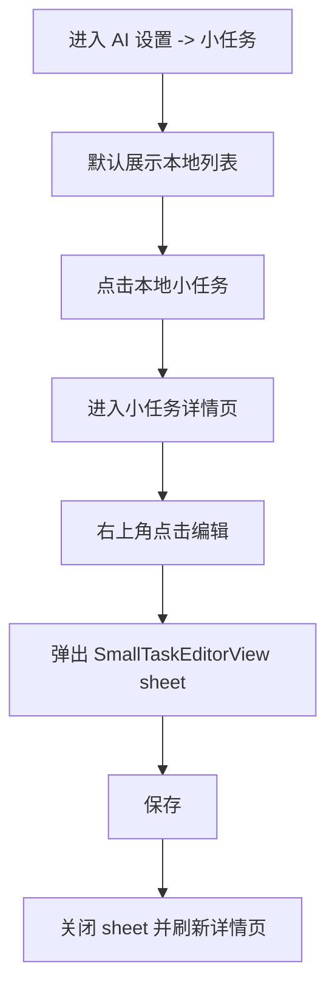
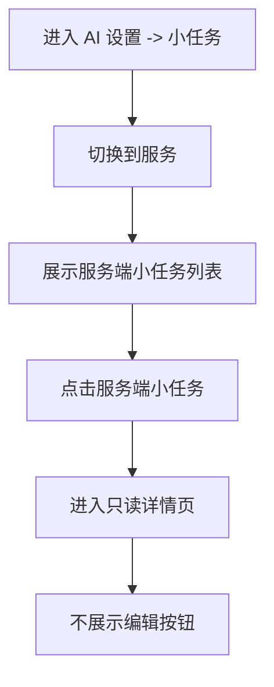

# AISETTINGS-000001 小任务列表详情与服务端展示需求工单

## 0. 工单元信息

| 字段 | 内容 |
| --- | --- |
| 工单编号 | AISETTINGS-000001 |
| 工单类型 | P1 AI 设置 / 小任务管理 / 详情页 / 服务端小任务展示 |
| 当前范围 | 创建需求与技术方案工单；本工单不直接修改代码 |
| 目标工程 | `/Users/hua/Documents/project/Reference/LookHealthClient/SparkClient` |
| 目标模块 | `Features/AISettings/Presentation/Root`、`Core/AI`、`Features/Chat/Application/AutoSmallTask` |
| 创建日期 | 2026-08-11 |
| 入口路径 | 设置 -> AI 设置 -> 小任务 |
| 关联工单 | `CHAT-000015`、`CHAT-000016`、`DEEPTUTORCHAT-000051` |
| 明确非目标 | 本工单不实现代码；不调整小任务执行链路；不新增服务端接口；不改变 Chat 自动发送小任务流程 |

## 1. 背景与现状

当前 iOS 的小任务设置页已经具备本地小任务列表、新建、编辑和删除能力，但交互与数据范围仍停留在“本地配置维护”阶段：

1. 列表页只展示 `source == .local` 的小任务。
2. 点击列表行会直接弹出 `SmallTaskEditorView` 编辑 sheet。
3. 服务端小任务虽然已经可以通过 Pro overlay / runtime store 进入 `effectiveSmallTasks`，但设置页没有展示入口。
4. 本地内置小任务已经开始进入版本化治理，但用户在小任务详情中看不到当前版本。

本次需求目标是把“小任务”从纯编辑列表升级为“可查看详情、可区分来源、可展示服务端配置”的管理页。

## 2. 关键代码位置

### 2.1 小任务列表与编辑入口

| 文件 | 当前职责 |
| --- | --- |
| `SparkClient/SparkClient/Projects/Features/AISettings/Presentation/Root/SmallTasksSettingsView.swift` | 小任务列表页主体：标题“小任务”、列表、`+` 新建、删除确认 |
| `SmallTasksSettingsView.swift` 内 `SmallTaskRow` | 小任务卡片行：图标、`name`、`brief` |
| `SparkClient/SparkClient/Projects/Features/AISettings/Presentation/Root/SmallTaskEditorView.swift` | 当前新建/编辑 sheet |
| `SparkClient/SparkClient/Projects/Features/AISettings/Presentation/Root/AISettingsView.swift` | AI 设置页进入小任务列表的导航入口 |

当前导航入口：

```swift
Section(L10n.text("ai_settings.section.tools")) {
    MainNavigationLink {
        SmallTasksSettingsView(viewModel: viewModel)
    } label: {
        SettingNavRow(
            title: "小任务",
            subtitle: "维护本地小任务并关联到模型",
            icon: "checklist"
        )
    }
}
```

### 2.2 小任务模型与数据来源

| 文件 | 当前职责 |
| --- | --- |
| `SparkClient/SparkClient/Projects/Core/AI/SmallTask.swift` | 小任务核心模型，包含 `source: TaskSource`，区分 `.local` 与 `.service` |
| `SparkClient/SparkClient/Projects/Core/AI/AIRuntimeConfigStore.swift` | 合并本地小任务与服务端小任务，`local` 按 code 覆盖 `service` |
| `SparkClient/SparkClient/Projects/Core/AI/AIConfigCenter.swift` | 暴露 `effectiveSmallTasks()`、`upsertLocalSmallTask()` |
| `SparkClient/SparkClient/Projects/Features/AISettings/Presentation/Root/AISettingsViewModel.swift` | `effectiveSmallTasks`、`refreshEffectiveSmallTasks()`、`upsertLocalSmallTaskAndPersist()`、`deleteLocalSmallTaskAndPersist()` |
| `SparkClient/SparkClient/Projects/Core/Networking/API/AI/AIConfigAPI.swift` | 远端 AI 配置 patch 中包含服务端 smallTasks |

### 2.3 内置小任务与版本化

| 文件 | 当前职责 |
| --- | --- |
| `SparkClient/SparkClient/Projects/Features/Chat/Domain/AutoSmallTask/BuiltInAutoSmallTaskCatalog.swift` | 内置小任务定义，例如“生成体检计划” |
| `SparkClient/SparkClient/Projects/Features/Chat/Application/AutoSmallTask/AutoSmallTaskRegistry.swift` | 内置小任务注册 / 升级 / 写入本地 SmallTask |
| `SparkClient/SparkClient/Projects/Features/Chat/Infrastructure/AutoSmallTask/UserDefaultsAutoSmallTaskRegistryStore.swift` | 内置小任务版本注册记录 |
| `SparkClient/SparkClient/Projects/Features/Chat/Domain/AutoSmallTask/AutoSmallTaskDefinition.swift` | 内置定义版本、运行时版本、工具契约版本等定义字段 |

“生成体检计划”文案来源：

```swift
static let healthExamPlan = AutoSmallTaskDefinition(
    businessKey: .healthExamPlan,
    smallTaskCode: "Service_health_exam_plan_task",
    name: "生成体检计划",
    brief: "生成一份个体化体检计划，自动保存到知识库，并创建 1 个关联该计划的体检任务。",
    prompt: healthExamPlanPrompt,
    icon: "stethoscope",
    ...
)
```

### 2.4 本地化

| 文件 | 说明 |
| --- | --- |
| `SparkClient/SparkClient/Projects/App/Resources/zh-Hans.lproj/Localizable.strings` | 小任务相关文案使用 `ai_settings.small_tasks.*` 命名空间 |

## 3. 需求目标

1. 小任务列表点击行后进入详情页，不再直接弹出编辑 sheet。
2. 新增小任务详情页，详情页右上角按来源决定是否展示“编辑”按钮。
3. 本地小任务详情页点击“编辑”后，以 sheet 形式打开现有 `SmallTaskEditorView`。
4. 服务端小任务只允许查看，不允许编辑，不展示“编辑”按钮。
5. 小任务列表支持通过滑块 / 分段控件切换“本地”和“服务”两个来源。
6. 列表需要能展示服务端小任务，不能只展示本地小任务。
7. 本地小任务详情页需要展示当前版本。

## 4. 详细需求

### 4.1 列表页来源筛选

小任务列表顶部增加来源切换控件：

| 选项 | 展示数据 | 说明 |
| --- | --- | --- |
| 本地 | `source == .local` | 包含用户自建小任务，以及由内置注册流程写入本地的小任务 |
| 服务 | `source == .service` | 来自服务端 / Pro overlay 的小任务，只读展示 |

推荐使用 SwiftUI `Picker` + `.segmented` 样式或项目已有的滑块式 segmented 控件。默认选中“本地”。

数据源建议从 `viewModel.effectiveSmallTasks` 获取，再按 `source` 过滤。这样列表可以自然承接服务端小任务，同时保留本地覆盖服务端的现有合并语义。

当前不可继续只使用：

```swift
viewModel.snapshot.smallTasks.filter { $0.source == .local }
```

否则服务端小任务永远无法展示。

### 4.2 列表行点击行为

点击 `SmallTaskRow` 后应导航到详情页：

```text
小任务列表
  -> 点击任意小任务行
  -> SmallTaskDetailView
```

不再执行：

```text
点击列表行 -> editingTask = task -> 直接弹出 SmallTaskEditorView sheet
```

`+` 新建按钮的行为保持不变：仍然可以直接打开新建 sheet。因为新建不是查看链路，直接进入编辑表单符合当前管理场景。

### 4.3 详情页展示内容

详情页至少展示以下信息：

| 字段 | 本地小任务 | 服务端小任务 | 展示要求 |
| --- | --- | --- | --- |
| 图标 | 展示 | 展示 | 优先使用 `task.icon`，空值回退 `checklist` |
| 名称 | 展示 | 展示 | 使用 `task.name` |
| 简介 | 展示 | 展示 | 使用 `task.brief`，为空时可显示 `task.code` |
| 来源 | 展示“本地” | 展示“服务” | 需要清晰区分来源 |
| 编码 | 展示 | 展示 | 使用 `task.code`，方便排查模型关联问题 |
| 工具列表 | 展示 | 展示 | 展示 `toolList`，为空时展示“无” |
| Prompt / 任务规则 | 展示 | 展示 | 只读展示，支持长文本滚动 |
| 当前版本 | 展示 | 不要求 | 本地详情页必须展示 |

详情页不是编辑页，所有字段默认只读。

### 4.4 本地详情页编辑入口

当 `task.source == .local`：

1. 详情页右上角展示“编辑”按钮。
2. 点击后弹出 sheet。
3. sheet 复用现有 `SmallTaskEditorView`。
4. 保存后关闭 sheet，并刷新详情页当前展示内容。
5. 如果编辑导致 `code` 不变，应更新同一条任务；如未来允许改 code，需要明确处理模型关联关系，本期不建议开放修改 code。

### 4.5 服务端详情页只读

当 `task.source == .service`：

1. 详情页右上角不展示“编辑”按钮。
2. 不展示删除入口。
3. 不允许侧滑删除。
4. Prompt、工具列表、编码、简介均只读展示。
5. 如服务端小任务与本地小任务 code 冲突并被本地覆盖，列表只展示合并后的有效结果，不额外展示被覆盖的服务端原始项。

### 4.6 删除能力边界

列表页删除能力仅对本地小任务开放：

| 来源 | 是否支持删除 | 说明 |
| --- | --- | --- |
| 本地 | 支持 | 继续调用 `deleteLocalSmallTaskAndPersist(code:)` |
| 服务 | 不支持 | 不展示 swipe delete |

删除本地小任务时仍需要同步清理模型关联：

```swift
snapshot.allModels[index].relatedTaskCodes.removeAll { $0 == code }
```

### 4.7 本地版本展示

本地小任务详情页需要展示“当前版本”。版本来源建议按优先级解析：

1. 如果该本地小任务来自内置注册流程，优先读取 `AutoSmallTaskRegistryRecord.definitionVersion`。
2. 如果后续 `SmallTask` 模型增加版本字段，则以模型字段为主。
3. 如果是用户手动创建的本地小任务且没有版本记录，展示 `本地自定义` 或 `未版本化`，不要伪造版本号。

“生成体检计划”等内置本地小任务需要能展示真实 definition version，方便后续排查内置 prompt / toolList 升级是否生效。

## 5. 推荐交互流程

### 5.1 查看本地小任务并编辑



### 5.2 查看服务端小任务



## 6. UI 与文案要求

### 6.1 列表页

1. 标题继续使用“小任务”。
2. 顶部来源切换建议文案：
   - 本地
   - 服务
3. 空状态需要按来源区分：
   - 本地：暂无本地小任务
   - 服务：暂无服务端小任务
4. 本地列表保留 `+` 新建按钮。
5. 服务列表可继续显示 `+` 按钮用于新建本地任务，但不得让用户误以为可以新建服务端任务。若容易混淆，可只在本地 tab 展示 `+`。

### 6.2 详情页

推荐结构：

1. 顶部概要区：图标、名称、简介、来源 badge。
2. 元信息区：编码、当前版本、工具数量。
3. 工具区：展示工具列表。
4. Prompt 区：只读展示完整 prompt / 任务规则。

服务端详情页需要通过来源 badge 明确标识“服务”，并隐藏编辑按钮。

### 6.3 本地化键建议

新增文案继续使用 `ai_settings.small_tasks.*` 命名空间：

| Key | 中文建议 |
| --- | --- |
| `ai_settings.small_tasks.source.local` | 本地 |
| `ai_settings.small_tasks.source.service` | 服务 |
| `ai_settings.small_tasks.detail.title` | 小任务详情 |
| `ai_settings.small_tasks.detail.source` | 来源 |
| `ai_settings.small_tasks.detail.code` | 编码 |
| `ai_settings.small_tasks.detail.version` | 当前版本 |
| `ai_settings.small_tasks.detail.tools` | 工具 |
| `ai_settings.small_tasks.detail.prompt` | 任务规则 |
| `ai_settings.small_tasks.detail.version.custom` | 本地自定义 |
| `ai_settings.small_tasks.detail.version.unversioned` | 未版本化 |
| `ai_settings.small_tasks.empty.local` | 暂无本地小任务 |
| `ai_settings.small_tasks.empty.service` | 暂无服务端小任务 |

## 7. 技术落点建议

### 7.1 新增视图

建议新增：

```text
SparkClient/SparkClient/Projects/Features/AISettings/Presentation/Root/SmallTaskDetailView.swift
```

职责：

1. 接收 `SmallTask` 或 `taskCode`。
2. 只读展示小任务详情。
3. 根据 `source` 控制右上角编辑按钮。
4. 本地小任务编辑时复用 `SmallTaskEditorView` sheet。
5. 展示当前版本。

如果担心列表进入详情后数据更新不同步，详情页可接收 `taskCode` 并从 `viewModel.effectiveSmallTasks` / `snapshot.smallTasks` 中实时解析最新任务。

### 7.2 调整列表页

`SmallTasksSettingsView` 建议调整：

1. 增加 `selectedSource: TaskSource` 或本地 UI enum。
2. 列表数据源改为 `viewModel.effectiveSmallTasks`。
3. 行点击改为 `MainNavigationLink` 进入 `SmallTaskDetailView`。
4. 本地来源才展示 swipe delete。
5. 服务来源不触发编辑 sheet。

### 7.3 版本解析

建议在 ViewModel 或一个轻量 resolver 中提供：

```swift
func displayVersion(for task: SmallTask) -> SmallTaskDisplayVersion
```

避免详情页直接理解 `UserDefaultsAutoSmallTaskRegistryStore` 的存储细节。

展示策略：

```text
内置本地小任务有 registry record -> v{definitionVersion}
用户自建本地小任务 -> 本地自定义
本地任务但找不到版本记录 -> 未版本化
服务端小任务 -> 不展示版本行，或展示服务端管理
```

### 7.4 服务端小任务数据刷新

进入小任务列表时，应确保触发过 `refreshEffectiveSmallTasks()`。当前 `AISettingsViewModel` 在刷新 provider runtime configuration 和持久化后会刷新有效小任务，但列表页进入时最好不要依赖过期快照。

本期不要求新增网络协议，只消费现有：

```text
AIConfigAPI -> AIRemoteSettingsPatch.smallTasks
AIConfigCenter -> AIRuntimeConfigStore.setProOverlay(...)
AISettingsViewModel.effectiveSmallTasks
```

## 8. 验收标准

1. 从“设置 -> AI 设置 -> 小任务”进入后，页面展示来源切换控件，默认选中“本地”。
2. 本地列表展示所有有效本地小任务，包括“生成体检计划”等由内置注册流程写入的小任务。
3. 切换到“服务”后，列表能展示 `source == .service` 的服务端小任务。
4. 点击任意小任务行进入详情页，不直接弹出编辑 sheet。
5. 本地小任务详情页右上角展示“编辑”按钮。
6. 点击本地详情页“编辑”后弹出 `SmallTaskEditorView`，保存后详情页内容刷新。
7. 服务端小任务详情页不展示“编辑”按钮，也不能删除。
8. 本地小任务列表保留删除能力，服务端小任务列表不展示删除能力。
9. 本地详情页展示当前版本；内置本地小任务展示真实 definition version，用户自建任务展示“本地自定义”或“未版本化”。
10. 工具列表为空时有明确空态，不显示空白区域。
11. Prompt 长文本在详情页可完整阅读，不挤压顶部概要信息。
12. 新增文案均写入 `Localizable.strings`，且中文环境不出现英文 fallback。

## 9. 回归测试建议

### 9.1 本地小任务

1. 新建一个本地小任务。
2. 返回列表，确认在“本地”筛选下可见。
3. 点击进入详情页。
4. 确认详情页有编辑按钮和版本展示。
5. 点击编辑，修改简介并保存。
6. 确认详情页和列表行同步更新。
7. 从列表删除该小任务，确认关联模型的 `relatedTaskCodes` 被清理。

### 9.2 内置小任务

1. 通过首页“制定体检计划”触发内置小任务注册。
2. 进入“设置 -> AI 设置 -> 小任务”。
3. 确认“生成体检计划”出现在本地列表。
4. 进入详情页，确认展示当前 definition version。
5. 点击编辑并保存后，确认仍作为本地小任务存在。

### 9.3 服务端小任务

1. 准备一个 `source == .service` 的远端小任务。
2. 刷新 AI runtime / Pro overlay。
3. 进入小任务列表并切换到“服务”。
4. 确认服务端小任务可见。
5. 进入详情页，确认无编辑按钮、无删除入口。
6. 返回列表，确认服务端小任务没有 swipe delete。

### 9.4 本地覆盖服务端

1. 准备一个本地小任务和服务端小任务使用相同 `code`。
2. 确认 `effectiveSmallTasks` 中以本地版本为准。
3. 列表中不重复展示同一 code 的两条记录。
4. 详情页显示本地来源与本地版本规则。

## 10. 风险与待确认

1. **版本字段来源待确认**：当前 `SmallTask` 模型没有直接版本字段，详情页版本需要从内置 registry 或后续模型字段解析。
2. **服务端小任务是否需要服务端版本**：本期需求只要求本地详情页展示当前版本，服务端版本可暂不展示。
3. **`+` 按钮在服务 tab 是否展示**：建议仅本地 tab 展示，避免用户误解为创建服务端小任务。
4. **详情页实时刷新方式**：如果详情页持有 `SmallTask` 值类型，编辑保存后需要重新解析最新数据，否则可能出现详情页展示旧值。
5. **本地编辑内置小任务后的版本语义**：如果用户编辑了内置小任务，应明确显示“基于 vX 本地修改”还是继续显示 `vX`。建议后续结合 `CHAT-000016` 的 `is_user_edited` 语义收口。
