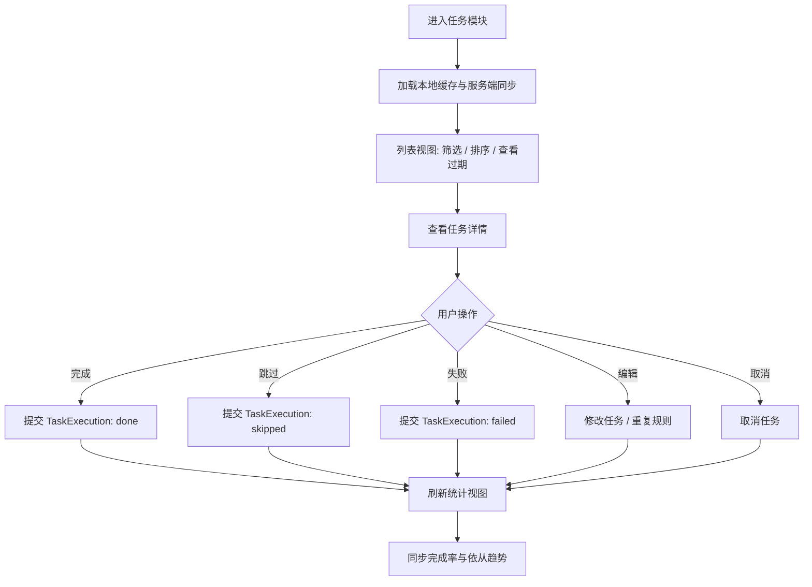

# TASK-000001：任务模块整体优化重构客户端需求工单

> 创建日期：2026-08-07  
> 关联端：SparkClient iOS 客户端  
> 关联服务端：`SparkService/task_system/models.py`、`views.py`、`serializers.py`、`urls.py`  
> 关联客户端：`SparkClient/Projects/Features/Task/Application/TaskManager.swift`、`SparkClient/Projects/Features/Task/Infrastructure/TaskService.swift`、`SparkClient/Projects/Features/Task/Presentation/TaskCenterViewController.swift`、`SparkClient/Projects/Features/Task/Presentation/TaskCardCell.swift`、`SparkClient/Projects/Features/Home/Presentation/HomeView.swift`、`SparkClient/Projects/Features/Home/Presentation/IOS26HomeTaskSummary.swift`  
> 状态：新需求 / 待评审  
> 优先级：P1

## 1. 工单目标

将当前客户端已有的“任务中心”能力，重构为一套完整、可扩展、可统计、可回放、可适配 AI 生成的任务模块。目标不是单纯换皮，而是把任务从“列表页功能”升级为“健康日常执行系统”。

本次重构重点覆盖四件事：

1. 列表视图从单一任务清单升级为可筛选、可排序、可识别过期风险的任务工作台。
2. 任务详情升级为“通用标题描述 + 业务面板”的结构化详情页。
3. 任务创建页同时支持手动创建和 AI 结构化生成。
4. 统计视图基于 `TaskExecution` 形成完成率、依从趋势、执行回放与行为分析。

---

## 2. 背景与问题

当前任务能力已经存在，但客户端体验仍偏“能用”，还没有形成“好用”的任务模块。

### 2.1 现状

服务端已经具备完整任务域模型：

- `Task` 作为主任务
- `TaskMedical`、`TaskExercise`、`TaskDiet` 作为差异化业务子表
- `TaskExecution` 作为执行记录
- `TaskNotification` 作为提醒策略
- `TaskPlan` 作为长期计划底座

客户端也已经具备基础能力：

- `TaskService` 支持任务列表、创建、更新、完成、取消、同步
- `TaskManager` 负责加载、合并、通知对齐
- `TaskCenterViewController` 提供列表、筛选、创建、编辑、滑动操作
- `IOS26HomeTaskSummary` 提供首页任务摘要

### 2.2 主要问题

1. 列表筛选维度太少，只有状态级筛选，不足以支撑真实健康任务管理。
2. 任务详情只做了弱展示，没有把医疗、运动、饮食三类差异化信息讲清楚。
3. 创建页过于简单，不能体现任务源、业务结构和 AI 生成能力。
4. 执行动作只有“完成/取消”的弱流程，没有统一的执行数据上报。
5. 统计只停留在个数层面，没有完成率、依从趋势、执行历史。
6. 重复任务没有明确区分“本次实例”和“整个计划”，容易误改。
7. 目前任务页面更像通用列表，而不是一个面向健康管理的专业模块。

---

## 3. 目标与非目标

### 3.1 用户目标

1. 用户能快速找到今天最该处理的任务。
2. 用户能明确知道任务属于医疗、运动还是饮食。
3. 用户能在任务详情页看到当前任务真正要做什么。
4. 用户能一键完成、跳过、失败上报，并保留执行数据。
5. 用户能从统计页看到自己最近的依从情况。

### 3.2 产品目标

1. 提升任务可见性、可理解性、可执行性。
2. 降低任务漏做、误改、重复创建、重复完成的概率。
3. 统一任务生命周期和执行记录生命周期。
4. 为后续 AI 任务生成、周期计划、自动建议留出稳定接口。

### 3.3 非目标

1. 本期不重做服务端权限体系。
2. 本期不替换现有任务 REST API 协议。
3. 本期不把任务模块完全并入 DeepTutorChat。
4. 本期不实现复杂的计划生成算法，只保留 AI 生成入口和结构化输入输出。
5. 本期不把任务统计做成医疗级科研看板，只做面向用户日常管理的实用统计。

---

## 4. 服务端模型对齐

下面这张表是本次重构的真实约束来源，客户端设计必须和它对上。

| 服务端模型 | 客户端用途 | 备注 |
| --- | --- | --- |
| `Task` | 任务主对象、列表、详情、创建、编辑 | 统一标题、描述、时间、状态、优先级、重复规则 |
| `TaskMedical` | 医疗详情面板 | 展示提醒时间、医疗类型、描述 |
| `TaskExercise` | 运动详情面板 | 展示时长、强度、运动类型 |
| `TaskDiet` | 饮食详情面板 | 展示热量、食物推荐、餐次类型 |
| `TaskExecution` | 执行记录、统计趋势 | 标记完成 / 跳过 / 失败时创建 |
| `TaskNotification` | 提醒与通知状态 | 需要在任务详情中可读，但不抢主信息 |
| `TaskPlan` | 重复任务计划、周期编辑 | 用于“修改单次”或“修改整个计划” |

### 4.1 `Task` 关键字段

- `title`
- `description`
- `type`
- `status`
- `start_time`
- `due_time`
- `repeat_type`
- `priority`
- `business_type`
- `business_id`
- `source`
- `extra`

### 4.2 `TaskExecution` 关键字段

- `status`
- `executed_at`
- `value`
- `notes`
- `business_type`
- `business_id`

### 4.3 客户端现状约束

现有 `TaskService` 已经支持：

- `GET /api/v1/tasks/`
- `POST /api/v1/tasks/`
- `PATCH /api/v1/tasks/{id}/`
- `POST /api/v1/tasks/{id}/complete/`
- `POST /api/v1/tasks/{id}/cancel/`
- `GET /api/v1/tasks/sync/`
- `GET /api/v1/tasks/{id}/executions/`

本次重构尽量复用这些入口，不新增分裂式协议。

---

## 5. 业务流程



### 5.1 两条主链路

1. 查看链路：列表 -> 详情 -> 统计
2. 执行链路：列表/详情 -> 完成/跳过/失败 -> 记录执行 -> 刷新统计

### 5.2 创建链路

1. 手动创建：用户填表 -> 生成 `TaskCreatePayload` -> `POST /api/v1/tasks/`
2. AI 创建：AI 输出结构化 JSON -> 客户端校验 -> 组装同样的 `TaskCreatePayload` -> `POST /api/v1/tasks/`

---

## 6. UI 总体设计

### 6.1 设计关键词

```text
克制
专业
清晰分层
强执行感
低噪音
更像工作台，不像清单
```

### 6.2 视觉原则

1. 首屏先给结论，再给细节。
2. 状态颜色只用于状态，不要给整页染色。
3. 任务列表要像“行动列表”，不是“消息流”。
4. 详情页要把主信息和业务信息分开，不让用户自己猜任务属于哪一类。
5. 创建页要让“手动”和“AI”并列出现，但默认不互相干扰。
6. 统计视图要以趋势和完成率为主，不要把图表做得过重。

### 6.3 色彩与光影

建议保持系统风格 + 轻材质的 UI 方向：

- 主色：系统蓝或品牌蓝
- 强调色：任务高优先级用橙红，完成用绿色，失败用红色，跳过用灰蓝
- 背景：系统分组背景或浅材质
- 阴影：轻阴影、大模糊、低不透明度

不要使用：

- 大面积纯红警告底
- 重度渐变背景
- 卡片上再套卡片
- 过多装饰性图标

### 6.4 空间与留白

1. 页面级模块之间保持明确间距，避免挤成一整片。
2. 卡片内部采用 12-16pt 级别留白。
3. 筛选区和列表区之间要留足分隔。
4. 列表项之间保持 8-12pt 间距。
5. 操作按钮区域要留出误触缓冲，不让底部手势抢操作。

### 6.5 交互与状态反馈

1. 按下状态必须立即反馈。
2. 提交动作必须立即进入 loading，禁止重复点击。
3. 过滤条件切换时，列表内容应平滑刷新。
4. 详情页编辑后回到列表，列表排序要及时更新。
5. 关键动作如取消、修改重复规则、改整个计划，必须弹窗确认。

### 6.6 异常与边界

1. 空状态不能只放一句“暂无数据”，要给出明确下一步。
2. 加载状态优先骨架屏，局部刷新用 spinner。
3. 离线或同步失败时允许看缓存，并明确告知最后一次同步时间。
4. 超长标题、描述、食物推荐必须截断或折行，不允许撑爆布局。
5. 重复任务修改必须区分单次实例和整段计划。

### 6.7 微交互与动效

1. 列表切换、tab 切换、筛选 chip 切换建议 200ms-300ms。
2. 任务完成时可加入轻量对勾反馈，不做夸张庆祝。
3. 统计数字可以短促滚动，但要克制。
4. Reduce Motion 开启时保留颜色与透明度变化，减少位移动效。

---

## 7. 页面结构

### 7.1 信息架构

建议将任务模块拆成四个核心视图：

1. 列表视图
2. 任务详情页
3. 创建任务页
4. 统计视图

### 7.2 plain text UI 线框

#### 7.2.1 列表视图

```text
┌────────────────────────────────────┐
│  任务                              │
│  待完成 12   逾期 3   今日 5        │
│                                    │
│  [全部] [待完成] [已完成]          │
│  [医疗] [运动] [饮食]              │
│  [高优先级] [中优先级] [低优先级]  │
│  [今日] [明日] [未来]              │
│                                    │
│  排序: 截止时间优先 + 优先级       │
│                                    │
│  ┌──────────────────────────────┐  │
│  │ 医疗 | 服药提醒               │  │
│  │ 今天 20:00  高优先级  逾期?    │  │
│  │ 描述摘要 / 业务摘要           │  │
│  └──────────────────────────────┘  │
│  ┌──────────────────────────────┐  │
│  │ 运动 | 慢跑 30 分钟           │  │
│  │ 明天 07:00  中优先级          │  │
│  └──────────────────────────────┘  │
│  ┌──────────────────────────────┐  │
│  │ 饮食 | 控制晚餐热量           │  │
│  │ 未来 低优先级                 │  │
│  └──────────────────────────────┘  │
│                                    │
│                    ＋ 新建任务      │
└────────────────────────────────────┘
```

#### 7.2.2 任务详情页

```text
┌────────────────────────────────────┐
│  返回          任务详情            │
│                                    │
│  标题：服药提醒                    │
│  描述：晚餐后服用，注意饮水        │
│  状态：待完成   优先级：高         │
│  时间：今天 20:00                  │
│  重复：每日                        │
│                                    │
│  ┌──────────────────────────────┐  │
│  │ 医疗面板                     │  │
│  │ 提醒时间 19:50               │  │
│  │ 医疗任务类型：用药            │  │
│  └──────────────────────────────┘  │
│                                    │
│  执行操作                         │
│  [完成] [跳过] [失败]              │
│                                    │
│  记录区                           │
│  - 最近执行记录                    │
│  - 修改历史                        │
└────────────────────────────────────┘
```

#### 7.2.3 创建任务页

```text
┌────────────────────────────────────┐
│  新建任务                          │
│  [手动创建] [AI 生成]              │
│                                    │
│  标题                             │
│  描述                             │
│  类型: 医疗/运动/饮食              │
│  时间: 开始 / 截止                 │
│  重复: 不重复/每日/每周            │
│  优先级: 高/中/低                  │
│                                    │
│  业务面板随类型切换                │
│  医疗: 提醒时间/医疗类型           │
│  运动: 时长/强度                   │
│  饮食: 热量/食物推荐               │
│                                    │
│  [保存]                            │
└────────────────────────────────────┘
```

#### 7.2.4 统计视图

```text
┌────────────────────────────────────┐
│  统计                              │
│  完成率  78%   逾期  5             │
│                                    │
│  [7天] [30天] [90天]               │
│                                    │
│  依从趋势折线图                    │
│  完成 / 跳过 / 失败分布            │
│                                    │
│  最近执行记录                      │
│  今日 20:00 完成 用药              │
│  今日 07:10 跳过 运动              │
└────────────────────────────────────┘
```

---

## 8. 列表视图详细设计

### 8.1 展示维度

列表视图必须支持以下维度：

1. 状态筛选：全部 / 待完成 / 已完成
2. 类型筛选：医疗 / 运动 / 饮食
3. 优先级筛选：高 / 中 / 低
4. 时间筛选：今日 / 明日 / 未来
5. 排序策略：截止时间优先 + 优先级
6. 过期标记：过期任务显式提示

### 8.2 排序规则

建议排序规则：

1. 过期任务优先置顶
2. 同状态下按 `due_time` 升序
3. `due_time` 相同时按优先级排序，`high > medium > low`
4. 没有 `due_time` 的任务使用 `start_time`
5. 仍然无法比较时按 `updated_at` 降序

### 8.3 列表卡片信息

每个任务卡片建议展示：

1. 类型标签
2. 标题
3. 简短描述
4. 状态标签
5. 时间信息
6. 优先级提示
7. 过期标记
8. 进入详情的箭头或点击区域

### 8.4 过期任务标记

过期任务建议同时满足以下表达：

1. 时间文本高亮为风险色
2. 状态标注为“已过期 / 待处理”
3. 只在必要位置显示红色，避免整屏报警化

### 8.5 列表空态

当列表为空时，不要只展示空白。

建议文案结构：

1. 主文案：今天还没有任务
2. 辅助文案：可以创建新任务，或者先同步服务端数据
3. 主按钮：新建任务
4. 次按钮：手动刷新 / 重新同步

---

## 9. 任务详情页详细设计

### 9.1 通用结构

任务详情页应分成两层：

1. 通用层：标题、描述、状态、优先级、时间、重复规则、来源
2. 业务层：按任务类型展示差异化面板

### 9.2 医疗任务面板

医疗任务必须展示：

1. 提醒时间
2. 医疗任务类型
3. 关联说明
4. 可选执行备注

### 9.3 运动任务面板

运动任务必须展示：

1. 运动类型
2. 时长
3. 强度
4. 目标说明

### 9.4 饮食任务面板

饮食任务必须展示：

1. 餐次类型
2. 目标热量
3. 食物推荐
4. 摄入建议说明

### 9.5 任务详情的主要行为

1. 标记完成
2. 跳过
3. 失败
4. 编辑
5. 取消
6. 查看执行记录
7. 查看重复计划

---

## 10. 任务创建页详细设计

### 10.1 创建方式

创建页分成两个入口：

1. 手动新建任务
2. AI 生成任务

### 10.2 手动创建要求

表单最少包含：

1. 标题
2. 描述
3. 类型
4. 开始时间
5. 截止时间
6. 重复规则
7. 优先级
8. 业务面板字段

### 10.3 AI 生成要求

AI 生成必须输出结构化 JSON，而不是散文。

客户端要做三步：

1. 校验字段完整性
2. 校验类型与枚举
3. 转换成标准 `TaskCreatePayload`

### 10.4 AI 输出 JSON 示例

```json
{
  "title": "晚餐后服药提醒",
  "description": "晚餐后 30 分钟服药，注意饮水。",
  "type": "medical",
  "startTime": "2026-08-07T19:30:00+08:00",
  "dueTime": "2026-08-07T20:00:00+08:00",
  "repeatType": "daily",
  "priority": "high",
  "businessType": "medical.medication",
  "businessID": "med-001",
  "taskMedical": {
    "reminderTime": "2026-08-07T19:50:00+08:00",
    "medicalTaskType": "medication",
    "description": "晚餐后服药",
    "source": "ai",
    "extra": {}
  }
}
```

### 10.5 提交接口

最终仍统一调用：

`POST /api/v1/tasks/`

客户端应保持和当前 `TaskService.createTask(payload:)` 对齐。

---

## 11. 统计视图详细设计

### 11.1 统计目标

统计视图不是“看热闹”，而是帮助用户回答三个问题：

1. 最近有没有按时完成任务？
2. 哪一类任务最容易拖延？
3. 执行情况是在变好还是变差？

### 11.2 统计指标

建议优先展示以下指标：

1. 完成率
2. 依从趋势
3. 今日完成数
4. 今日失败数
5. 今日跳过数
6. 过期任务数
7. 最近执行时间

### 11.3 数据来源

统计数据来源于两部分：

1. 本地缓存任务与执行记录
2. 服务端返回的 `TaskExecution`

### 11.4 趋势维度

可按以下维度切换：

1. 7 天
2. 30 天
3. 90 天

### 11.5 统计空态

如果没有执行记录：

1. 展示空态图文
2. 提示先完成几个任务
3. 不显示假图表

---

## 12. 用户交互设计

### 12.1 执行动作

任务执行支持三类结果：

1. 标记完成
2. 跳过
3. 失败

每一种操作都必须创建 `TaskExecution`。

### 12.1.1 接口缺口与落地建议

当前服务端已有：

- `POST /api/v1/tasks/{id}/complete/`：完成任务并创建 `TaskExecution`
- `POST /api/v1/tasks/{id}/cancel/`：取消任务

但还没有一个统一的“执行记录写入接口”专门承接跳过和失败。

因此本次重构建议采用两段式策略：

1. 短期：客户端保留完成接口，同时把跳过/失败动作抽象为统一执行动作入口，后端补一个通用执行写入接口。
2. 中期：将完成、跳过、失败全部统一走 `TaskExecution` 写入，再由任务状态派生是否完成。

推荐新增接口：

`POST /api/v1/tasks/{task_id}/executions/`

请求体：

```json
{
  "status": "done",
  "executed_at": "2026-08-07T20:00:00+08:00",
  "value": {
    "duration_min": 30,
    "intensity": "medium"
  },
  "notes": "今日晚间完成",
  "business_type": "exercise",
  "business_id": "workout-001"
}
```

这样客户端的完成、跳过、失败三个入口就能完全统一。

### 12.2 `value` 数据建议

`TaskExecution.value` 不要空着，建议保存结构化执行数据。

#### 医疗任务

```json
{
  "actual_taken_at": "2026-08-07T20:02:00+08:00",
  "dose": "1片",
  "adherence": "on_time",
  "result": "taken"
}
```

#### 运动任务

```json
{
  "duration_min": 30,
  "intensity": "medium",
  "calories_burned": 180,
  "result": "done"
}
```

#### 饮食任务

```json
{
  "meal_type": "dinner",
  "calorie_target": 500,
  "actual_calories": 460,
  "food_items": ["鸡胸肉", "西兰花"],
  "result": "done"
}
```

### 12.3 编辑与取消

编辑与取消必须支持：

1. 修改时间
2. 修改优先级
3. 修改重复规则
4. 修改描述
5. 修改业务面板字段

### 12.4 重复任务交互

当任务属于重复任务时，修改操作必须弹窗确认：

1. 修改本次实例
2. 修改整个周期计划
3. 取消操作

这一步非常关键，不能只做单一确认按钮。

---

## 13. plain text UI 设计细节

### 13.1 视觉层次与排版

1. 标题层级要明确，首页级标题与详情页标题不能同样重。
2. 列表卡片中，标题、描述、标签、时间要有明显主次。
3. 标题建议 1 行，描述最多 2-3 行。
4. 关键数字使用更高字重，但不要把整屏都做得很重。

### 13.2 色彩与光影

1. 绿色只表达完成，不表达一切健康。
2. 红色只表达风险、过期、失败，不要做装饰。
3. 材质与描边比阴影更适合这类工具型页面。
4. 深色模式下仍需保证层次，不要只靠颜色区分。

### 13.3 空间与留白

1. 任务卡片内部左右留白大于上下留白。
2. 筛选条要比列表内容更紧凑。
3. 详情页的业务面板与通用面板之间要明显分组。
4. 创建页的手动/AI 两个模式之间要有足够切换空间。

### 13.4 交互与状态反馈

1. 默认、按下、选中、禁用、加载态都要定义。
2. 按钮点击必须有即时反馈。
3. 切换筛选条件时，不要让列表“闪一下又重排”太突兀。
4. 保存后要给明确成功反馈，并保持当前页面上下文。

### 13.5 边界与异常处理

1. 文本过长时必须截断或折行。
2. 无效时间要有兜底文案。
3. 如果任务缺少业务子表，详情页不能崩，要显示“业务信息暂不可用”。
4. 网络错误时保留本地缓存与最后同步时间。

### 13.6 微交互与动效

1. 筛选 chip 切换建议轻量过渡。
2. 详情页返回列表时，列表可依据更新结果局部刷新。
3. 成功完成任务后给短促反馈，不拖慢用户下一步。
4. 统计页图表加载可以先骨架后成型。

---

## 14. 关键代码示例

### 14.1 列表筛选与排序建议

```swift
func makeVisibleTasks(
    tasks: [HealthTask],
    statusFilter: TaskStatusFilter,
    typeFilter: TaskTypeFilter?,
    priorityFilter: TaskPriorityFilter?,
    timeFilter: TaskTimeFilter?,
    now: Date = Date(),
    calendar: Calendar = .current
) -> [HealthTask] {
    tasks
        .filter { task in
            statusFilter.matches(task.status)
            && (typeFilter?.matches(task.type) ?? true)
            && (priorityFilter?.matches(task.priority) ?? true)
            && (timeFilter?.matches(task, now: now, calendar: calendar) ?? true)
        }
        .sorted { lhs, rhs in
            let lhsOverdue = lhs.status == .pending && (lhs.dueTime ?? lhs.startTime ?? .distantFuture) < now
            let rhsOverdue = rhs.status == .pending && (rhs.dueTime ?? rhs.startTime ?? .distantFuture) < now
            if lhsOverdue != rhsOverdue { return lhsOverdue }

            if lhs.priority.rawValue != rhs.priority.rawValue {
                return lhs.priority.rawValue < rhs.priority.rawValue
            }

            let leftDate = lhs.dueTime ?? lhs.startTime ?? lhs.updatedAt
            let rightDate = rhs.dueTime ?? rhs.startTime ?? rhs.updatedAt
            if leftDate != rightDate { return leftDate < rightDate }

            return lhs.updatedAt > rhs.updatedAt
        }
}
```

### 14.2 AI 生成任务后的创建请求

```swift
let payload = TaskCreatePayload(
    member: memberID,
    title: aiDraft.title,
    description: aiDraft.description,
    type: aiDraft.type,
    status: .pending,
    startTime: aiDraft.startTime,
    dueTime: aiDraft.dueTime,
    repeatType: aiDraft.repeatType,
    priority: aiDraft.priority,
    businessType: aiDraft.businessType,
    businessID: aiDraft.businessID,
    extra: aiDraft.extra,
    taskMedical: aiDraft.medicalPayload,
    taskExercise: aiDraft.exercisePayload,
    taskDiet: aiDraft.dietPayload
)

try await taskService.createTask(payload: payload)
```

### 14.3 完成 / 跳过 / 失败统一上报

```swift
func submitExecution(
    taskID: Int,
    status: TaskExecutionStatus,
    value: [String: String],
    notes: String?
) async throws {
    let payload = TaskExecutionPayload(
        executedAt: ISO8601DateFormatter.taskFormatter.string(from: Date()),
        value: value,
        notes: notes,
        businessType: currentBusinessType,
        businessID: currentBusinessID
    )

    switch status {
    case .done:
        _ = try await taskService.completeTask(taskID: taskID, payload: payload)
    case .skipped, .failed:
        // 建议后续统一改为 /executions/ 写入，当前先作为接口补齐目标。
        break
    }
}
```

### 14.4 详情页业务面板选择

```swift
@ViewBuilder
func taskBusinessPanel(task: HealthTask) -> some View {
    switch task.type {
    case .medical:
        MedicalTaskPanel(task: task)
    case .exercise:
        ExerciseTaskPanel(task: task)
    case .diet:
        DietTaskPanel(task: task)
    }
}
```

### 14.5 统计摘要示意

```swift
struct TaskStatisticsSummary {
    let completionRate: Double
    let adherenceTrend: [Double]
    let doneCount: Int
    let skippedCount: Int
    let failedCount: Int
    let overdueCount: Int
}
```

---

## 15. 客户端落地细节

### 15.1 推荐改造范围

1. `TaskCenterViewController` 拆分为列表、详情、创建、统计四个子视图。
2. `TaskManager` 增强执行记录、统计摘要和重复任务处理。
3. `TaskService` 增强任务执行上报能力。
4. `HomeView` 仅保留任务摘要入口，不承载完整管理逻辑。
5. `IOS26HomeTaskSummary` 继续用于首页卡片概览。

### 15.2 建议的新 UI 结构

1. 顶部：任务概览
2. 中部：筛选区 + 排序区 + 列表区
3. 底部：新建入口
4. 右上角：统计视图入口

### 15.3 建议的数据流

1. `TaskService.fetchTasks(memberID:since:)`
2. `TaskManager.loadInitial(memberID:)`
3. `TaskManager.syncIncremental(memberID:)`
4. 本地聚合后生成列表、详情、统计
5. 执行动作创建 `TaskExecution`

### 15.4 与现有代码的衔接点

1. 现有 `TaskCenterViewController` 的状态筛选可以扩成多维筛选。
2. 现有 `TaskCardCell` 的卡片样式可以复用为列表卡片雏形。
3. 现有 `TaskService.TaskCreatePayload` 已具备扩展字段，可直接承载 AI 生成任务。
4. 现有 `TaskExecution` 模型已经足够支撑执行历史与统计。

---

## 16. 验收标准

### 16.1 功能验收

1. 列表能按状态、类型、优先级、时间筛选。
2. 列表能按截止时间优先 + 优先级排序。
3. 过期任务能被明显识别。
4. 详情页能展示医疗、运动、饮食差异化面板。
5. 创建页支持手动创建和 AI 生成。
6. 执行动作能写入执行记录。
7. 统计视图能展示完成率和依从趋势。
8. 重复任务能区分单次修改和整个计划修改。

### 16.2 体验验收

1. 首屏不拥挤，信息层级清晰。
2. 主要操作路径不超过 3 步。
3. 空态、加载态、错误态都有明确反馈。
4. 不出现卡片套卡片、按钮拥挤、文本溢出等问题。

### 16.3 技术验收

1. 与 `Task`、`TaskExecution`、`TaskPlan` 模型对齐。
2. 与现有 `TaskService` API 对齐。
3. 新增 UI 不破坏首页现有入口。
4. 后续可扩展新的任务类型而不重写主结构。

---

## 17. 风险与注意事项

1. 重复任务最容易做错，必须先定义清楚“单次”和“整周期”。
2. AI 生成任务一定要先做结构化校验，再允许提交。
3. 统计如果只靠本地缓存会不准，必须保留服务端执行记录来源。
4. 任务详情中的业务面板如果字段不全，要有兜底 UI。
5. 列表筛选和排序如果一次性拼得太复杂，容易影响可维护性，建议分层实现。

---

## 18. 结论

本工单的核心不是增加一个任务列表，而是把任务模块重构成一个真正可执行、可统计、可扩展的健康管理子系统。

如果按本工单落地，客户端会同时得到：

1. 更清晰的任务结构
2. 更专业的任务详情
3. 更顺手的创建流程
4. 更有价值的执行统计
5. 更稳的重复任务编辑体验

这会让任务模块从“附属功能”变成“日常使用的主功能之一”。

---

## 19. 目录结构建议

下面是本次重构建议补齐的客户端目录结构。目标是把“列表 / 详情 / 创建 / 统计 / 领域模型 / 网络层”拆开，避免一个 View 文件继续承载所有逻辑。

```text
SparkClient/
└── Projects/
    └── Features/
        └── Task/
            ├── Application/
            │   ├── TaskManager.swift
            │   ├── TaskStatisticsStore.swift
            │   └── TaskExecutionRecorder.swift
            ├── Domain/
            │   ├── Task.swift
            │   ├── TaskFilters.swift
            │   ├── TaskSorters.swift
            │   ├── TaskStatistics.swift
            │   └── TaskExecutionDraft.swift
            ├── Infrastructure/
            │   ├── TaskService.swift
            │   ├── TaskExecutionService.swift
            │   └── TaskPlanService.swift
            ├── Presentation/
            │   ├── TaskListView.swift
            │   ├── TaskDetailView.swift
            │   ├── TaskCreateView.swift
            │   ├── TaskStatisticsView.swift
            │   ├── TaskFilterBar.swift
            │   ├── TaskSortBar.swift
            │   ├── TaskExecutionActionSheet.swift
            │   └── TaskCardCell.swift
            └── Support/
                ├── TaskBusinessPanelView.swift
                ├── TaskRepeatEditSheet.swift
                ├── TaskEmptyStateView.swift
                └── TaskLoadingSkeletonView.swift
```

### 19.1 目录职责

1. `Application`：管理状态、同步、执行记录聚合、统计缓存。
2. `Domain`：放纯数据模型、过滤条件、排序规则、统计计算。
3. `Infrastructure`：放 API、DTO、请求响应转换。
4. `Presentation`：放页面、组件、弹窗、表单、列表卡片。
5. `Support`：放重复复用的业务面板、空态、骨架屏、确认弹窗。

### 19.2 推荐文件拆分原则

1. 一个文件只承担一个页面或一个清晰组件。
2. 与网络协议强绑定的结构体放在 `Infrastructure`。
3. 与 UI 状态直接绑定的结构体放在 `Domain`。
4. 详情页业务面板不要堆在列表页里。
5. 任务执行和任务详情不要共用一个巨型 ViewModel。

---

## 20. 落地细节补充

### 20.1 推荐实现顺序

1. 先补领域层：过滤、排序、执行数据、统计结构。
2. 再补列表页：筛选条、排序条、过期标识、空态。
3. 再补详情页：通用信息 + 业务面板 + 执行动作。
4. 再补创建页：手动表单 + AI JSON 导入。
5. 最后补统计页：完成率、趋势图、执行历史。

### 20.2 页面责任边界

1. 列表页只负责发现任务，不承担过多编辑逻辑。
2. 详情页负责理解任务、执行任务、进入编辑。
3. 创建页负责生产标准化任务对象。
4. 统计页负责回顾执行结果，不反向控制列表状态。
5. 任务管理器负责聚合状态，不直接承载业务文案。

### 20.3 数据流落地

建议客户端采用以下流向：

1. `TaskService` 拉取任务与同步数据。
2. `TaskManager` 合并本地缓存、服务端状态和执行记录。
3. `TaskStatisticsStore` 根据 `TaskExecution` 和任务状态计算统计。
4. `TaskListView`、`TaskDetailView`、`TaskStatisticsView` 订阅同一个任务域状态。
5. 完成 / 跳过 / 失败后统一触发局部刷新，不要全局重建页面。

### 20.4 重复任务编辑落地

1. 用户点击编辑时先判断 `repeat_type`。
2. 非重复任务直接进入编辑表单。
3. 重复任务弹出确认层，先确认改单次还是改整周期。
4. 选择“单次”时，只修改任务实例字段。
5. 选择“整周期”时，联动 `TaskPlan` 或周期规则层。

### 20.5 执行记录落地

1. 用户点击完成 / 跳过 / 失败后，先落 `TaskExecutionDraft`。
2. 请求成功后再刷新列表和统计。
3. 若服务端失败，保留本地草稿和错误提示，允许重试。
4. `value` 必须和业务类型匹配，避免统计时丢信息。

### 20.6 UI 性能注意点

1. 筛选条件过多时，建议先计算可见结果再渲染，不要在 row 里重复过滤。
2. 列表卡片的业务面板内容要按需加载，避免所有类型同时渲染。
3. 统计图表的数据聚合应在 ViewModel 层完成，不要放在 SwiftUI body 里。
4. 详情页执行完成后，只刷新当前任务和统计摘要，不要强行重载全量列表。

---

## 21. 关键代码示例补充

### 21.1 筛选条件模型

```swift
enum TaskStatusFilter: String, CaseIterable, Sendable {
    case all
    case pending
    case completed

    func matches(_ status: HealthTask.TaskStatus) -> Bool {
        switch self {
        case .all:
            return true
        case .pending:
            return status == .pending
        case .completed:
            return status == .completed
        }
    }
}

enum TaskTimeFilter: String, CaseIterable, Sendable {
    case today
    case tomorrow
    case future

    func matches(_ task: HealthTask, now: Date, calendar: Calendar) -> Bool {
        let anchor = task.dueTime ?? task.startTime
        guard let anchor else { return false }
        switch self {
        case .today:
            return calendar.isDateInToday(anchor)
        case .tomorrow:
            return calendar.isDate(anchor, inSameDayAs: calendar.date(byAdding: .day, value: 1, to: now) ?? now)
        case .future:
            return anchor > now
        }
    }
}
```

### 21.2 任务详情数据组装

```swift
struct TaskDetailModel: Sendable {
    let task: HealthTask
    let overdue: Bool
    let canEdit: Bool
    let canExecute: Bool
    let businessTitle: String
    let businessSubtitle: String
}

func makeTaskDetailModel(task: HealthTask, now: Date = .now) -> TaskDetailModel {
    let due = task.dueTime ?? task.startTime ?? .distantFuture
    let overdue = task.status == .pending && due < now
    let businessTitle: String
    let businessSubtitle: String

    switch task.type {
    case .medical:
        businessTitle = task.taskMedical?.medicalTaskType ?? "medical"
        businessSubtitle = task.taskMedical?.reminderTime.map {
            DateFormatter.localizedString(from: $0, dateStyle: .none, timeStyle: .short)
        } ?? "未设置提醒时间"
    case .exercise:
        businessTitle = task.taskExercise?.exerciseType ?? "exercise"
        businessSubtitle = "\(task.taskExercise?.durationMin ?? 0) 分钟 · \(task.taskExercise?.intensity ?? "medium")"
    case .diet:
        businessTitle = task.taskDiet?.mealType ?? "diet"
        businessSubtitle = "\(task.taskDiet?.calorieTarget ?? 0) kcal"
    }

    return TaskDetailModel(
        task: task,
        overdue: overdue,
        canEdit: task.status != .completed,
        canExecute: task.status == .pending,
        businessTitle: businessTitle,
        businessSubtitle: businessSubtitle
    )
}
```

### 21.3 执行记录写入草稿

```swift
struct TaskExecutionDraft: Encodable, Sendable {
    let status: String
    let executedAt: String
    let value: [String: String]
    let notes: String?
    let businessType: String
    let businessID: String
}
```

### 21.4 统计聚合示例

```swift
struct TaskStatistics {
    let totalCount: Int
    let doneCount: Int
    let skippedCount: Int
    let failedCount: Int
    let overdueCount: Int

    var completionRate: Double {
        guard totalCount > 0 else { return 0 }
        return Double(doneCount) / Double(totalCount)
    }
}

func buildStatistics(tasks: [HealthTask], executions: [TaskExecutionRecord]) -> TaskStatistics {
    let overdueCount = tasks.filter { task in
        guard task.status == .pending else { return false }
        return (task.dueTime ?? task.startTime ?? .distantFuture) < .now
    }.count

    return TaskStatistics(
        totalCount: tasks.count,
        doneCount: executions.filter { $0.status == "done" }.count,
        skippedCount: executions.filter { $0.status == "skipped" }.count,
        failedCount: executions.filter { $0.status == "failed" }.count,
        overdueCount: overdueCount
    )
}
```
