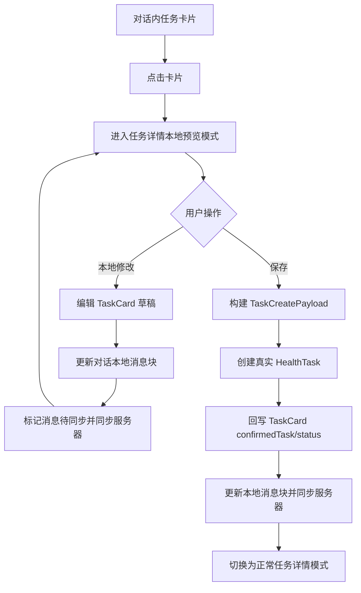
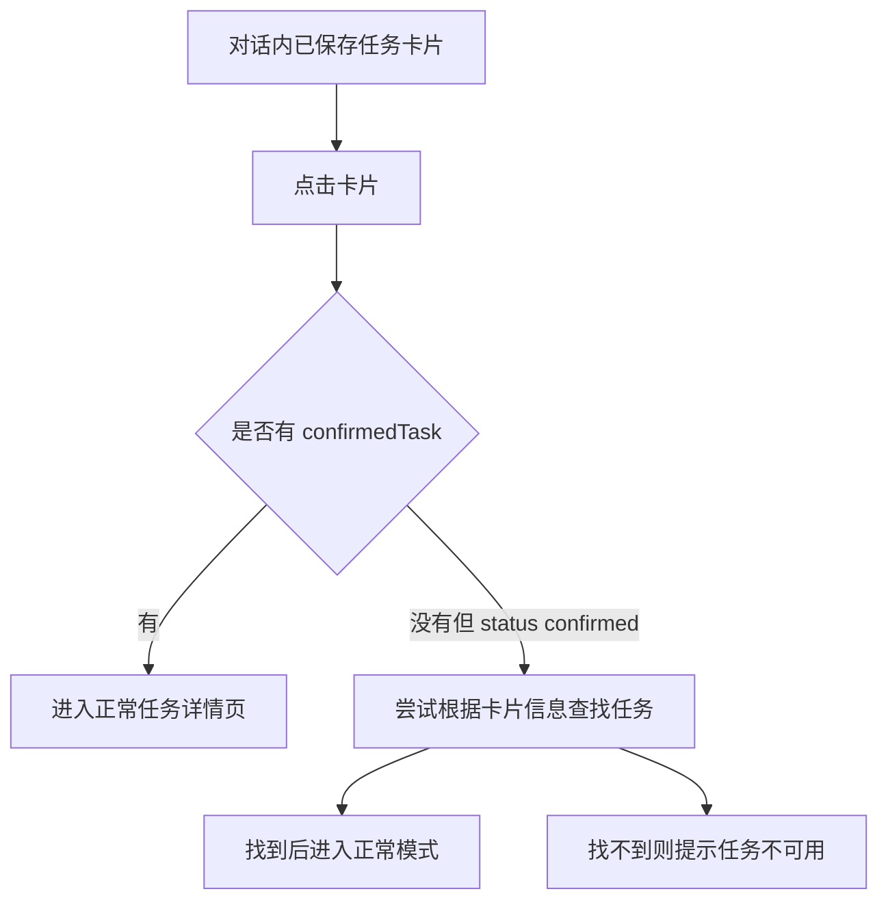

# TASK-000003：任务详情本地预览模式与会话卡片保存闭环工单

> 创建日期：2026-08-11  
> 关联工单：`TASK-000001-任务模块整体优化重构客户端需求工单.md`、`TASK-000002-任务中心与详情页移动端UI质感优化工单.md`  
> 关联入口：`SparkClient/Projects/Features/Chat/Presentation/ChatView/Components/ChatMessageBlock+Render.swift:213`  
> 关联客户端：`TaskDetailView.swift`、`TaskCreateView.swift`、`TaskManager.swift`、`TaskService.swift`、`TaskCardCell.swift`、`TaskCard.swift`、`ChatDetailViewModel.swift`、`ChatRenderContext.swift`、`ChatMessageBubbleContentView.swift`  
> 状态：新需求 / 待实现  
> 优先级：P0，会话任务卡片保存体验闭环

## 1. 一句话目标

任务卡片在对话消息内点击后，不再直接只做“创建 / 忽略”的卡片内操作，而是进入任务详情页的“本地预览模式”。预览模式展示完整任务详情，底部只显示“保存”按钮，替代正常任务详情页里的“标记完成 / 跳过 / 失败”。用户可在右上角进入“本地修改”，只修改对话内任务卡片草稿；点击保存后回调会话内保存逻辑，创建真实任务，保存成功后详情页自动切换为正常模式。

---

## 2. 背景与现状

当前对话任务卡片渲染入口位于：

`SparkClient/Projects/Features/Chat/Presentation/ChatView/Components/ChatMessageBlock+Render.swift:213`

当前代码结构：

```swift
case .taskCards(let cards):
    ForEach(cards) { card in
        TaskCardCell(
            card: card,
            memberContextStore: context.memberContextStore,
            onAction: context.onTaskCardAction,
            isLoading: context.taskCardLoadingIDs.contains(card.id)
        )
    }
```

当前 `TaskCardCell` 支持卡片内“创建任务 / 忽略 / 切换成员”。`ChatDetailViewModel.confirmTaskCard` 会把 `TaskCard` 转成 `TaskCreatePayload`，调用 `taskManager.createTask(payload:)`，然后回写消息块，把卡片状态置为 `.confirmed`。

这条链路已经能保存任务，但有三个体验缺口：

1. 用户保存前不能进入完整详情预览，只能看消息卡片摘要。
2. 用户保存前不能在详情页里本地修改任务草稿。
3. 保存成功后没有“预览详情 -> 正常任务详情”的自然模式切换。

---

## 3. 核心需求

### 3.1 新增任务详情本地预览模式

任务详情页新增两种模式：

1. 正常模式：基于真实 `HealthTask.id` 展示服务端任务。
2. 本地预览模式：基于对话消息内 `TaskCard` 草稿展示完整详情。

本地预览模式的视觉结构应复用 `TASK-000002` 已落地的详情页结构：

1. 头部：标题、描述、类型、优先级、状态。
2. 基础信息卡片：时间、重复、来源、关联业务。
3. 业务面板：医疗 / 运动 / 饮食差异化字段。
4. 底部操作：只显示“保存”。

### 3.2 预览模式底部按钮

本地预览模式底部必须使用“保存”按钮，替代正常模式的：

1. 标记完成
2. 跳过
3. 失败

预览模式不能出现任务执行操作，因为任务还没有真实落库，不存在执行记录语义。

### 3.3 右上角本地修改

本地预览模式右上角提供 `...` 菜单，菜单项为：

1. 本地修改
2. 放弃修改

“本地修改”进入编辑页，但只编辑对话消息内的 `TaskCard` 草稿，不创建真实任务，不调用 `POST /api/v1/tasks/`。

### 3.4 点击保存后的回调

预览模式点击“保存”后必须回调会话内保存逻辑：

1. 使用当前预览草稿构建 `TaskCreatePayload`。
2. 调用任务创建接口。
3. 保存成功后更新对话消息内的 `TaskCard`。
4. 将卡片状态置为 `.confirmed`。
5. 写入 `confirmedTask` 为真实任务 ID。
6. 更新本地消息存储。
7. 标记消息待同步并同步服务器。
8. 当前详情页从本地预览模式切换为正常模式。

### 3.5 已保存卡片点击行为

对话内消息卡片如果已经保存过：

1. `TaskCard.status == .confirmed`
2. 或 `TaskCard.confirmedTask != nil`

点击卡片时必须直接进入正常模式任务详情页，而不是本地预览模式。

---

## 4. 业务流程

### 4.1 未保存任务卡片



### 4.2 已保存任务卡片



---

## 5. 页面模式定义

### 5.1 建议新增枚举

```swift
enum TaskDetailMode: Equatable {
    case normal(taskID: Int)
    case preview(TaskCardPreviewContext)
}

struct TaskCardPreviewContext: Equatable {
    let threadID: UUID
    let messageClientID: UUID
    let card: TaskCard
}
```

### 5.2 详情页输入调整

当前 `TaskDetailView` 输入：

```swift
let taskID: Int
```

建议改为：

```swift
let mode: TaskDetailMode
```

兼容方式：

```swift
init(
    memberID: Int?,
    taskManager: TaskManager,
    knowledgeDependencies: KnowledgeFeatureDependencies,
    knowledgeViewModel: KnowledgeLibraryViewModel,
    taskID: Int
) {
    self.mode = .normal(taskID: taskID)
}
```

这样任务中心原有正常详情入口不受影响，对话卡片入口可以传 `.preview(...)`。

---

## 6. 数据模型设计

### 6.1 TaskCard 到预览详情模型

本地预览模式不能依赖真实 `HealthTask.id`，建议新增一个轻量展示模型：

```swift
struct TaskDetailDisplayModel: Equatable, Sendable {
    let title: String
    let description: String
    let type: HealthTask.TaskType
    let statusText: String
    let startTime: Date?
    let dueTime: Date?
    let repeatType: HealthTask.RepeatType
    let priority: HealthTask.Priority
    let businessType: String
    let businessID: String
    let source: HealthTask.Source
    let medical: TaskMedicalDisplay?
    let exercise: TaskExerciseDisplay?
    let diet: TaskDietDisplay?
}
```

### 6.2 预览模式状态

```swift
enum TaskDetailPreviewState: Equatable {
    case idle(TaskCard)
    case editing(TaskCard)
    case saving(TaskCard)
    case saved(taskID: Int)
    case failed(TaskCard, message: String)
}
```

---

## 7. UI 设计

### 7.1 本地预览模式线框

```text
┌────────────────────────────────────┐
│  < 返回                  ...       │
│                                    │
│  服药提醒                    [医疗] │
│  晚餐后 30 分钟服药，注意饮水       │
│  [待保存] [高优先级] [AI 生成]      │
│                                    │
│  ┌──────────────────────────────┐  │
│  │ 基础信息                     │  │
│  │ 时间        今天 20:00        │  │
│  │ 重复        每日              │  │
│  │ 来源        AI 生成           │  │
│  └──────────────────────────────┘  │
│                                    │
│  ┌──────────────────────────────┐  │
│  │ 医疗任务                     │  │
│  │ 类型        健康监测          │  │
│  │ 说明        记录血压与心率     │  │
│  └──────────────────────────────┘  │
│                                    │
├────────────────────────────────────┤
│  [保存]                            │
└────────────────────────────────────┘
```

### 7.2 正常模式线框

正常模式继续使用 `TASK-000002` 已落地样式：

```text
┌────────────────────────────────────┐
│  < 返回                  ...       │
│  任务详情                          │
│  ...                               │
├────────────────────────────────────┤
│  [标记完成]                  [...] │
└────────────────────────────────────┘
```

### 7.3 模式差异

| 页面元素 | 本地预览模式 | 正常模式 |
| --- | --- | --- |
| 数据来源 | `TaskCard` | `HealthTask` |
| 底部主按钮 | 保存 | 标记完成 |
| 跳过 / 失败 | 不显示 | `...` 菜单内显示 |
| 执行记录 | 不显示或展示“保存后可记录执行” | 展示真实执行记录 |
| 右上角编辑 | 本地修改 | 修改任务 |
| 保存行为 | 创建真实任务 | 不出现保存按钮 |
| 成功后模式 | 切换正常模式 | 保持正常模式 |

---

## 8. 交互细节

### 8.1 卡片点击

`TaskCardCell` 新增点击详情能力：

```swift
let onOpenPreview: (TaskCard) -> Void
```

点击规则：

1. `confirmedTask != nil`：打开正常任务详情。
2. `status == .confirmed` 且有真实任务 ID：打开正常任务详情。
3. 其他情况：打开本地预览模式。

### 8.2 本地修改

预览模式点击右上角 `... -> 本地修改`：

1. 打开任务编辑页。
2. 编辑对象是 `TaskCard` 草稿。
3. 点击编辑页保存时只更新对话消息块。
4. 不调用任务创建接口。
5. 不创建 `HealthTask`。
6. 更新后的消息块必须写入本地存储并同步服务器。

### 8.3 保存

预览模式底部点击保存：

1. 保存按钮立即进入 loading。
2. 禁止重复点击。
3. 创建真实任务。
4. 成功后 toast 提示。
5. 回写卡片状态和真实任务 ID。
6. 切换为正常模式。
7. 正常模式底部显示“标记完成 / ...”。

### 8.4 保存失败

保存失败时：

1. 保留预览模式。
2. 保留用户本地编辑内容。
3. 显示错误提示。
4. 保存按钮恢复可点击。

---

## 9. 落地目录结构

```text
SparkClient/
└── Projects/
    ├── Features/
    │   ├── Task/
    │   │   ├── Domain/
    │   │   │   ├── TaskDetailMode.swift                 # 新增
    │   │   │   ├── TaskCardPreviewMapper.swift          # 新增
    │   │   │   └── TaskCreateFormDraft.swift            # 扩展 TaskCard 草稿转换
    │   │   ├── Presentation/
    │   │   │   ├── TaskDetailView.swift                 # 改造支持 normal / preview
    │   │   │   ├── TaskCreateView.swift                 # 扩展本地草稿编辑模式
    │   │   │   └── TaskCardPreviewEditView.swift        # 可选新增
    │   │   └── Support/
    │   │       ├── TaskDetailBottomActionBar.swift      # 复用正常模式
    │   │       └── TaskPreviewSaveBottomBar.swift       # 新增
    │   └── Chat/
    │       ├── Domain/
    │       │   └── ChatMessage/BlockPayloads/TaskCard.swift
    │       └── Presentation/
    │           ├── ChatDetailViewModel.swift            # 增加保存/本地编辑回调
    │           ├── ChatMessageBlock+Render.swift        # 任务卡片点击进入预览
    │           └── ChatRenderContext.swift              # 增加 onTaskCardOpen
```

---

## 10. 关键代码示例

### 10.1 TaskDetailMode

```swift
enum TaskDetailMode: Equatable {
    case normal(taskID: Int)
    case preview(TaskCardPreviewContext)

    var isPreview: Bool {
        if case .preview = self { return true }
        return false
    }
}

struct TaskCardPreviewContext: Equatable {
    let threadID: UUID
    let messageClientID: UUID
    var card: TaskCard
}
```

### 10.2 任务卡片打开规则

```swift
func openTaskCard(_ card: TaskCard, message: ChatMessage) {
    if let taskID = card.confirmedTask {
        route.append(.taskDetail(.normal(taskID: taskID)))
        return
    }

    route.append(.taskDetail(.preview(TaskCardPreviewContext(
        threadID: threadID,
        messageClientID: message.clientMessageID,
        card: card
    ))))
}
```

### 10.3 预览模式底部保存

```swift
struct TaskPreviewSaveBottomBar: View {
    let isSaving: Bool
    let onSave: () -> Void

    var body: some View {
        Button(action: onSave) {
            if isSaving {
                ProgressView()
                    .frame(maxWidth: .infinity)
            } else {
                Label(NSLocalizedString("common.save", comment: "保存"), systemImage: "tray.and.arrow.down.fill")
                    .frame(maxWidth: .infinity)
            }
        }
        .buttonStyle(.borderedProminent)
        .disabled(isSaving)
        .frame(minHeight: 44)
        .padding(.horizontal, 16)
        .padding(.vertical, 10)
        .background(.bar)
    }
}
```

### 10.4 预览保存回调

```swift
func savePreviewTaskCard(
    threadID: UUID,
    message: ChatMessage,
    card: TaskCard
) async throws -> Int {
    guard let memberID = validatedTaskCardMemberID(card.member) else {
        throw TaskPreviewSaveError.missingMember
    }

    var cardToCreate = card
    cardToCreate.member = memberID
    cardToCreate.taskPayload = Self.taskPayload(card.taskPayload, settingMemberID: memberID)

    let payload = ChatTaskPayloadBuilder.build(from: cardToCreate)
    let createdTask = try await taskManager.createTaskReturningTask(payload: payload)

    await updateTaskCard(threadID: threadID, message: message, cardID: card.id) {
        $0.member = memberID
        $0.taskPayload = cardToCreate.taskPayload
        $0.status = .confirmed
        $0.confirmedTask = createdTask.id
        $0.updatedAt = Date()
    }

    return createdTask.id
}
```

### 10.5 本地编辑回写

```swift
func updatePreviewTaskCardDraft(
    threadID: UUID,
    message: ChatMessage,
    cardID: Int,
    mutate: @escaping (inout TaskCard) -> Void
) async {
    await updateTaskCard(threadID: threadID, message: message, cardID: cardID) { card in
        mutate(&card)
        card.updatedAt = Date()
    }
}
```

`updateTaskCard` 必须继续调用：

```swift
updateChatMessageBlocksUseCase.execute(
    clientMessageID: message.clientMessageID,
    blocks: updatedBlocks,
    markPendingForSync: true
)
```

这样本地编辑会更新本地存储，并通过消息同步链路同步服务器。

---

## 11. 需要调整的现有代码

### 11.1 `TaskManager`

当前：

```swift
func createTask(payload: TaskCreatePayload) async throws
```

建议新增：

```swift
func createTaskReturningTask(payload: TaskCreatePayload) async throws -> HealthTask
```

原因：

1. 保存成功后需要真实任务 ID。
2. 需要写回 `TaskCard.confirmedTask`。
3. 详情页需要立即切换正常模式。

### 11.2 `TaskCardCell`

新增打开详情回调：

```swift
let onOpenPreview: (TaskCard) -> Void
```

卡片点击不应直接触发创建；创建入口保留为按钮，卡片主体点击进入预览。

### 11.3 `ChatRenderContext`

新增：

```swift
let onTaskCardOpen: (TaskCard, ChatMessage) -> Void
```

或简化为：

```swift
let onTaskCardOpen: (TaskCard) -> Void
```

如果路由层需要消息上下文，推荐保留 `ChatMessage`。

### 11.4 `ChatMessageBlock+Render`

当前只传 `onAction`：

```swift
TaskCardCell(
    card: card,
    memberContextStore: context.memberContextStore,
    onAction: context.onTaskCardAction,
    isLoading: context.taskCardLoadingIDs.contains(card.id)
)
```

改为：

```swift
TaskCardCell(
    card: card,
    memberContextStore: context.memberContextStore,
    onOpenPreview: { context.onTaskCardOpen($0, context.message) },
    onAction: context.onTaskCardAction,
    isLoading: context.taskCardLoadingIDs.contains(card.id)
)
```

### 11.5 `TaskDetailView`

改为支持：

```swift
let mode: TaskDetailMode
```

本地预览模式：

1. 不调用 `taskManager.loadExecutions(taskID:)`。
2. 不展示执行记录或展示弱提示。
3. 不显示 `TaskDetailBottomActionBar`。
4. 显示 `TaskPreviewSaveBottomBar`。
5. 右上角菜单显示“本地修改”。

正常模式：

1. 继续按 `taskID` 从 `TaskManager` 查询真实任务。
2. 继续加载执行记录。
3. 继续显示标记完成、跳过、失败。

---

## 12. 状态同步要求

### 12.1 本地编辑同步

本地编辑不是创建任务，但必须更新对话消息：

1. 更新 `TaskCard` 字段。
2. 更新 `TaskCard.taskPayload` 中对应 JSON。
3. 更新 `updatedAt`。
4. 调用 `updateChatMessageBlocksUseCase`。
5. `markPendingForSync = true`。

### 12.2 保存成功同步

保存成功后必须更新：

1. `status = .confirmed`
2. `confirmedTask = createdTask.id`
3. `member = memberID`
4. `taskPayload = savedPayload`
5. `updatedAt = Date()`
6. 本地消息存储
7. 服务端消息同步
8. `TaskManager.tasks`

### 12.3 已保存重复点击

如果消息卡片已经保存：

1. 不再进入预览模式。
2. 不再显示保存按钮。
3. 不再允许“本地修改”影响真实任务。
4. 点击直接打开正常任务详情页。

---

## 13. 验收标准

### 13.1 未保存卡片

- [ ] 对话内任务卡片主体点击进入任务详情本地预览模式。
- [ ] 本地预览模式底部只显示“保存”。
- [ ] 本地预览模式不显示“标记完成 / 跳过 / 失败”。
- [ ] 右上角提供“本地修改”入口。
- [ ] 本地修改只更新对话消息内 `TaskCard` 草稿。
- [ ] 本地修改后不创建真实任务。
- [ ] 本地修改后本地消息存储更新，并标记同步服务器。

### 13.2 保存

- [ ] 点击保存会创建真实 `HealthTask`。
- [ ] 保存中按钮进入 loading，禁止重复点击。
- [ ] 保存成功后写回 `TaskCard.status = .confirmed`。
- [ ] 保存成功后写回 `TaskCard.confirmedTask = task.id`。
- [ ] 保存成功后当前页面切换为正常任务详情模式。
- [ ] 保存失败保留本地预览模式和用户修改。

### 13.3 已保存卡片

- [ ] 已保存任务卡片点击直接进入正常任务详情页。
- [ ] 正常模式底部显示“标记完成 / ...”。
- [ ] 正常模式不显示“保存”按钮。
- [ ] 已保存卡片不再允许预览模式本地修改。

---

## 14. 边界与风险

1. `TaskManager.createTask(payload:)` 当前不返回 `HealthTask`，无法写回 `confirmedTask`，必须新增返回真实任务的方法。
2. `TaskCard.taskPayload` 是字符串字典，编辑时必须同步修改内层 JSON，不能只改外层字段。
3. 对话消息块本地更新后必须走 `markPendingForSync = true`，否则刷新或跨端后会丢失本地编辑。
4. 保存成功后页面模式切换要避免重新 push 一个页面导致导航栈重复。
5. 如果保存后服务端返回任务但消息块回写失败，需要保留可恢复提示，避免用户以为没保存。

---

## 15. 推荐落地顺序

1. 增加 `TaskDetailMode` 和 `TaskCardPreviewContext`。
2. 增加 `TaskCardPreviewMapper`，将 `TaskCard` 转成详情展示模型。
3. 改造 `TaskDetailView` 支持 normal / preview。
4. 增加 `TaskPreviewSaveBottomBar`。
5. 改造 `TaskManager` 增加返回 `HealthTask` 的创建方法。
6. 改造 `ChatDetailViewModel` 增加预览保存和本地编辑回写方法。
7. 改造 `TaskCardCell` 支持主体点击进入预览。
8. 改造 `ChatRenderContext` 和 `ChatMessageBlock+Render.swift:213` 传入打开预览回调。
9. 验证未保存、已保存、编辑后保存、保存失败四条路径。

---

## 16. 详细落地架构

### 16.1 总体架构目标

本工单不是新增一个孤立页面，而是把“聊天消息任务卡片”和“任务详情页”打通成同一套详情能力：

1. 任务中心打开真实任务：`HealthTask.id -> TaskDetailView.normal`。
2. 对话卡片打开未保存任务：`TaskCard -> TaskDetailView.preview`。
3. 预览编辑只改 `TaskCard` 草稿。
4. 预览保存创建真实 `HealthTask`。
5. 保存成功后回写聊天消息，并切换成 `HealthTask.id -> TaskDetailView.normal`。

工程实现上必须保持三个边界清晰：

| 边界 | 负责内容 | 不负责内容 |
| --- | --- | --- |
| Chat 模块 | 持有消息、打开预览、保存回调、回写消息块 | 不直接绘制复杂任务详情 |
| Task 模块 | 详情页、编辑页、任务创建接口、任务展示映射 | 不持有聊天消息存储细节 |
| Mapper/Adapter | `TaskCard` 与任务详情/创建草稿之间的转换 | 不发网络请求 |

### 16.2 推荐分层

```text
ChatMessageBlock+Render
        │
        ▼
TaskCardCell
        │ 点击卡片主体
        ▼
Chat 层 openTaskCardPreview/openTaskDetail
        │
        ▼
TaskDetailView(mode: .preview / .normal)
        │
        ├─ preview：TaskCardPreviewMapper -> TaskDetailDisplayModel
        │
        └─ normal：TaskManager.task(for:) -> TaskDetailModelBuilder
        │
        ▼
保存
        │
        ▼
ChatDetailViewModel.saveTaskCardPreview
        │
        ├─ ChatTaskPayloadBuilder.build
        ├─ TaskManager.createTaskReturningTask
        ├─ replacingTaskCard(status/confirmedTask)
        └─ updateChatMessageBlocksUseCase(markPendingForSync: true)
```

### 16.3 为什么不能让 TaskDetailView 直接更新聊天消息

`TaskDetailView` 属于任务模块。如果它直接依赖 `ChatMessage`、`UpdateChatMessageBlocksUseCase`、会话同步等能力，会让任务模块反向依赖聊天模块，后续任务中心、首页待办、通知点击进入任务详情都会被聊天语义污染。

正确做法是：

1. `TaskDetailView.preview` 只暴露回调。
2. Chat 层把 `TaskCardPreviewContext` 传入详情页。
3. 用户点击保存时，详情页调用 `onPreviewSave(context, card)`。
4. Chat 层完成创建任务和消息回写。
5. Chat 层把保存结果 `HealthTask.id` 返回给详情页。
6. 详情页本地切换为 `.normal(taskID:)`。

---

## 17. 目录结构与文件级改动清单

### 17.1 建议目录结构

```text
SparkClient/Projects/Features/
├── Chat/
│   ├── Domain/
│   │   └── ChatMessage/
│   │       └── BlockPayloads/
│   │           └── TaskCard.swift                         # 轻量补充展示/保存判断 helper
│   └── Presentation/
│       ├── ChatDetailViewModel.swift                      # 保存预览、编辑草稿、回写消息块
│       ├── ConversationList/
│       │   └── ChatConversationMessageRow.swift           # 会话列表卡片点击兜底
│       └── ChatView/
│           └── Components/
│               ├── ChatRenderContext.swift                # 增加 onTaskCardOpen/onTaskCardPreviewSave
│               ├── ChatMessageBlock+Render.swift          # taskCards 注入打开预览回调
│               └── ChatMessageBubbleContentView.swift     # 透传新回调
│
└── Task/
    ├── Application/
    │   └── TaskManager.swift                              # createTaskReturningTask
    ├── Domain/
    │   ├── TaskDetailMode.swift                           # 新增 normal/preview 模式
    │   ├── TaskCardPreviewMapper.swift                    # 新增 TaskCard -> 展示模型/草稿
    │   ├── TaskCreateFormDraft.swift                      # 增加 from(card:) / makeTaskCardPatch
    │   └── TaskDisplayMapping.swift                       # 复用枚举友好文案
    └── Presentation/
        ├── TaskCenterViewController.swift                 # 维持 normal 入口兼容
        ├── TaskDetailView.swift                           # 支持 mode，区分 normal/preview
        ├── TaskCreateView.swift                           # 支持 previewEdit 模式
        ├── TaskCardCell.swift                             # 卡片主体点击打开详情
        └── Components/
            ├── TaskPreviewSaveBottomBar.swift             # 新增预览保存吸底按钮
            └── TaskPreviewUnsavedBanner.swift             # 新增未保存提示条，可选
```

### 17.2 必改文件清单

| 文件 | 改动类型 | 关键改动 |
| --- | --- | --- |
| `TaskDetailMode.swift` | 新增 | 定义 `.normal(taskID:)` 与 `.preview(context:)` |
| `TaskCardPreviewMapper.swift` | 新增 | 负责 `TaskCard -> TaskDetailDisplayModel` 与 `TaskCard -> TaskCreateFormDraft` |
| `TaskDetailView.swift` | 修改 | `taskID` 输入升级为 `mode`，预览模式不加载执行记录，不显示执行按钮 |
| `TaskPreviewSaveBottomBar.swift` | 新增 | 预览模式底部只显示“保存” |
| `TaskCreateView.swift` | 修改 | 新增 `previewEdit` 模式，保存时返回本地草稿，不调任务接口 |
| `TaskCreateFormDraft.swift` | 修改 | 支持从 `TaskCard` 构造草稿，支持把草稿写回 `TaskCard.taskPayload` |
| `TaskManager.swift` | 修改 | 新增返回 `HealthTask` 的创建方法，用于写回 `confirmedTask` |
| `TaskCardCell.swift` | 修改 | 卡片主体点击打开详情；原“创建/忽略/成员选择”继续可用 |
| `ChatRenderContext.swift` | 修改 | 新增打开卡片详情、保存预览、编辑预览草稿回调 |
| `ChatMessageBlock+Render.swift` | 修改 | `TaskCardCell` 注入 `onOpenPreview` |
| `ChatMessageBubbleContentView.swift` | 修改 | 构造 `ChatRenderContext` 时透传新回调 |
| `ChatDetailViewModel.swift` | 修改 | 新增 `saveTaskCardPreview`、`updateTaskCardDraft`，保存成功回写消息 |
| `Localizable.strings` | 修改 | 新增“待保存 / 保存 / 本地修改 / 保存失败”等文案 |

### 17.3 可选文件清单

| 文件 | 使用场景 |
| --- | --- |
| `TaskPreviewUnsavedBanner.swift` | 需要在详情顶部明显提示“此任务尚未保存”时增加 |
| `TaskPreviewSaveState.swift` | 如果保存状态较复杂，可从 `TaskDetailView` 中拆出 |
| `TaskCard+Preview.swift` | 如果不希望污染 `TaskCard.swift` 主模型，可用 extension 放 helper |

---

## 18. 业务流程拆解

### 18.1 未保存卡片进入预览

触发条件：

```swift
card.status != .confirmed && card.confirmedTask == nil
```

流程：

1. 用户点击 `TaskCardCell` 主体区域。
2. `TaskCardCell` 调用 `onOpenPreview(card)`。
3. `ChatMessageBlock+Render` 把事件交给 `ChatRenderContext.onTaskCardOpen(card, message)`。
4. Chat 页面根据当前导航方案 push 到 `TaskDetailView(mode: .preview(context))`。
5. `TaskDetailView` 使用 `TaskCardPreviewMapper.makeDisplayModel(from:)` 构造详情展示。
6. 页面底部展示 `TaskPreviewSaveBottomBar`。

验收点：

1. 卡片上的原有“创建任务”按钮仍可保留，但点击卡片主体必须进入详情预览。
2. 预览页不能调用 `loadExecutions(taskID:)`。
3. 预览页不能出现“完成 / 跳过 / 失败”。

### 18.2 预览模式本地修改

触发条件：

```swift
mode == .preview(context)
```

流程：

1. 用户点击右上角 `...`。
2. 选择“本地修改”。
3. 打开 `TaskCreateView(mode: .previewEdit(card: context.card))`。
4. 编辑页初始化 `TaskCreateFormDraft.from(card:)`。
5. 用户点击“完成”。
6. `TaskCreateView` 不调用 `taskManager.updateTask`，只返回 `TaskCardPreviewEditResult`。
7. `TaskDetailView` 更新当前预览态。
8. Chat 层调用 `updateTaskCardDraft(threadID:message:cardID:result:)`。
9. `ChatDetailViewModel` 用 `replacingTaskCard` 修改消息块。
10. `updateChatMessageBlocksUseCase.execute(..., markPendingForSync: true)` 触发本地存储与服务端同步。

验收点：

1. 修改标题后，返回详情页立即显示新标题。
2. 返回对话后，消息卡片也显示新标题。
3. 关闭 App 再进入，未保存草稿仍保留最近修改。
4. 本地修改不会生成 `HealthTask`。

### 18.3 预览模式保存

流程：

1. 用户点击底部“保存”。
2. 按钮进入 loading/disabled。
3. 详情页调用 `onPreviewSave(context, currentCard)`。
4. Chat 层校验成员：`validatedTaskCardMemberID(card.member)`。
5. 使用 `ChatTaskPayloadBuilder.build(from:)` 构建 `TaskCreatePayload`。
6. 调用 `TaskManager.createTaskReturningTask(payload:)`。
7. 服务端返回 `HealthTask`。
8. `TaskManager` 合并任务列表并注册通知。
9. Chat 层回写消息卡片：
   - `status = .confirmed`
   - `confirmedTask = createdTask.id`
   - `member = memberID`
   - `taskPayload = savedPayload`
   - `updatedAt = Date()`
10. 调用 `updateChatMessageBlocksUseCase` 标记消息待同步。
11. 详情页切换为 `.normal(taskID: createdTask.id)`。
12. 正常模式加载真实任务和执行记录。

验收点：

1. 保存成功后底部按钮从“保存”变成正常任务执行按钮。
2. 保存成功后再返回对话，卡片状态为已保存。
3. 再次点击该卡片直接进入正常详情页。
4. `confirmedTask` 必须有真实任务 ID。

### 18.4 已保存卡片点击

判断优先级：

1. `confirmedTask != nil`：直接打开 `.normal(taskID:)`。
2. `status == .confirmed && confirmedTask == nil`：显示“任务已保存，但缺少任务 ID”的兜底提示，不进入预览二次保存。
3. 其他状态：进入 `.preview`。

推荐逻辑：

```swift
func openTaskCard(_ card: TaskCard, message: ChatMessage) {
    if let taskID = card.confirmedTask {
        route.append(.taskDetail(.normal(taskID: taskID)))
    } else if card.status == .confirmed {
        notificationClient.warning("任务已保存，但暂时无法打开详情")
    } else {
        route.append(.taskDetail(.preview(.init(
            threadID: threadID,
            messageClientID: message.clientMessageID,
            card: card
        ))))
    }
}
```

---

## 19. 核心技术点

### 19.1 `TaskDetailView` 双模式渲染

`TaskDetailView` 需要把“详情展示内容”和“数据来源”拆开。不要在 body 中到处写 `if preview`，建议抽出统一的展示数据。

```swift
enum TaskDetailMode: Equatable, Hashable {
    case normal(taskID: Int)
    case preview(TaskCardPreviewContext)
}

struct TaskCardPreviewContext: Equatable, Hashable {
    let threadID: UUID
    let messageClientID: UUID
    let cardID: Int
    var card: TaskCard
}

enum TaskDetailResolvedContent {
    case normal(task: HealthTask, detailModel: TaskDetailModel)
    case preview(card: TaskCard, detailModel: TaskDetailDisplayModel)

    var title: String {
        switch self {
        case .normal(let task, _): return task.title
        case .preview(let card, _): return card.title
        }
    }
}
```

渲染规则：

| 区域 | normal | preview |
| --- | --- | --- |
| 头部标题 | `HealthTask.title` | `TaskCard.title` |
| 状态徽章 | 任务真实状态 | 固定“待保存” |
| 业务面板 | `HealthTask.taskMedical/taskExercise/taskDiet` | `TaskCard.taskPayload` 解析结果 |
| 关联业务 | 真实任务 `businessType/businessID` | 卡片 `businessType/businessID`，可展示但弱化 |
| 执行记录 | 加载并展示 | 不加载，不展示或显示“保存后可记录执行” |
| 底部操作 | 完成/跳过/失败 | 保存 |
| 右上角菜单 | 修改/取消任务 | 本地修改/放弃修改 |

### 19.2 创建任务必须返回 `HealthTask`

当前 `TaskManager.createTask(payload:)` 返回 `Void`，不能写回真实任务 ID。必须新增返回值方法。

推荐兼容写法：

```swift
@discardableResult
func createTaskReturningTask(payload: TaskCreatePayload) async throws -> HealthTask {
    guard let taskService else {
        throw TaskClientError.serviceNotConfigured
    }

    let task = try await taskService.createTask(payload: payload)
    merge(tasks: [task])

    if task.status == .pending {
        await notificationManager.registerTaskNotification(for: task)
    }

    refreshStatisticsStore(memberID: task.member)
    return task
}

func createTask(payload: TaskCreatePayload) async throws {
    _ = try await createTaskReturningTask(payload: payload)
}
```

如果项目当前没有 `TaskClientError.serviceNotConfigured`，需要新增一个本地错误枚举，避免静默 return 导致保存按钮一直以为成功。

### 19.3 `TaskCard` 到编辑草稿的转换

编辑页不应该直接编辑 `[String: String]` 字典，应通过 `TaskCreateFormDraft` 统一承接。

```swift
extension TaskCreateFormDraft {
    static func from(card: TaskCard) -> TaskCreateFormDraft {
        var draft = TaskCreateFormDraft()
        draft.title = card.title
        draft.description = card.description
        draft.type = card.type
        draft.startTime = card.startTime ?? Date()
        draft.dueTime = card.dueTime ?? draft.startTime.addingTimeInterval(3600)
        draft.repeatType = card.repeatType
        draft.priority = card.priority

        let taskJSON = TaskCardPayloadJSON.object(from: card.taskPayload["task"])
        switch card.type {
        case .medical:
            draft.medicalTaskType = taskJSON.string("medical_task_type") ?? draft.medicalTaskType
            draft.medicalReminderTime = taskJSON.date("reminder_time") ?? draft.startTime
        case .exercise:
            draft.exerciseType = taskJSON.string("exercise_type") ?? draft.exerciseType
            draft.exerciseDurationMin = taskJSON.int("duration_min") ?? draft.exerciseDurationMin
            draft.exerciseIntensity = taskJSON.string("intensity") ?? draft.exerciseIntensity
        case .diet:
            draft.dietMealType = taskJSON.string("meal_type") ?? draft.dietMealType
            draft.dietCalorieTarget = taskJSON.int("calorie_target") ?? draft.dietCalorieTarget
            draft.dietFoodRecommend = taskJSON.stringArray("food_recommend").joined(separator: "、")
        }

        return draft
    }
}
```

### 19.4 本地编辑回写 `TaskCard`

本地编辑完成后要同时更新外层字段和内层 JSON。

```swift
struct TaskCardPreviewEditResult: Equatable, Sendable {
    let draft: TaskCreateFormDraft
    let updatedAt: Date
}

extension TaskCard {
    func applyingPreviewEdit(_ result: TaskCardPreviewEditResult) -> TaskCard {
        var next = self
        let draft = result.draft
        next.title = draft.title
        next.description = draft.description
        next.type = draft.type
        next.startTime = draft.startTime
        next.dueTime = draft.dueTime
        next.repeatType = draft.repeatType
        next.priority = draft.priority
        next.businessType = draft.previewBusinessType
        next.taskPayload = TaskCardPayloadBuilder.payload(from: draft, base: taskPayload)
        next.updatedAt = result.updatedAt
        return next
    }
}
```

注意：如果 `TaskCard` 当前部分字段是 `let`，需要评估是否改为 `var`。本工单涉及 `title/type/repeatType/priority` 修改，这些字段必须可变，或通过重新构造 `TaskCard` 的方式返回新实例。

### 19.5 聊天消息块回写

本地编辑和保存成功都必须走同一条消息块替换链路，避免 UI、数据库、同步状态不一致。

```swift
func updateTaskCardDraft(
    threadID: UUID,
    message: ChatMessage,
    cardID: Int,
    result: TaskCardPreviewEditResult
) async {
    await updateTaskCard(threadID: threadID, message: message, cardID: cardID) {
        $0 = $0.applyingPreviewEdit(result)
    }
}
```

保存成功回写：

```swift
func saveTaskCardPreview(
    threadID: UUID,
    message: ChatMessage,
    card: TaskCard
) async throws -> HealthTask {
    guard let memberID = validatedTaskCardMemberID(card.member) else {
        throw TaskCardPreviewSaveError.missingMember
    }

    var cardToCreate = card
    cardToCreate.member = memberID
    cardToCreate.taskPayload = Self.taskPayload(card.taskPayload, settingMemberID: memberID)

    let payload = ChatTaskPayloadBuilder.build(from: cardToCreate)
    let createdTask = try await taskManager.createTaskReturningTask(payload: payload)

    await updateTaskCard(threadID: threadID, message: message, cardID: card.id) {
        $0.member = memberID
        $0.taskPayload = cardToCreate.taskPayload
        $0.status = .confirmed
        $0.confirmedTask = createdTask.id
        $0.updatedAt = Date()
    }

    return createdTask
}
```

### 19.6 预览保存状态防重入

保存按钮需要防止重复提交。推荐在 `TaskDetailView` 内维护保存状态。

```swift
enum TaskPreviewSaveState: Equatable {
    case idle
    case saving
    case saved(taskID: Int)
    case failed(message: String)

    var isSaving: Bool {
        if case .saving = self { return true }
        return false
    }
}
```

按钮行为：

```swift
TaskPreviewSaveBottomBar(
    isSaving: previewSaveState.isSaving,
    onSave: {
        guard previewSaveState.isSaving == false else { return }
        await savePreview()
    }
)
```

---

## 20. 路由与导航落地方案

### 20.1 任务中心入口保持兼容

`TaskCenterViewController` 现有路由：

```swift
enum TaskCenterRoute: Hashable {
    case detail(taskID: Int)
    case statistics
}
```

可以继续保留，不强制迁移：

```swift
case .detail(let taskID):
    TaskDetailView(
        memberID: memberID,
        taskManager: taskManager,
        knowledgeDependencies: knowledgeDependencies,
        knowledgeViewModel: knowledgeViewModel,
        taskID: taskID
    )
```

`TaskDetailView(taskID:)` 初始化器内部转成 `.normal(taskID:)`。这样任务中心不受影响。

### 20.2 聊天入口新增任务详情路由

聊天页面需要新增一个可承载 `TaskDetailMode` 的 route。命名可按现有 Chat 页面路由风格调整。

```swift
enum ChatRoute: Hashable {
    case taskDetail(TaskDetailMode)
}
```

如果 Chat 页面当前没有独立 route，而是使用 sheet/fullScreenCover，也可以使用：

```swift
@State private var presentedTaskDetailMode: TaskDetailMode?
```

推荐优先使用 push：

1. 任务详情属于深层内容，不是临时操作。
2. 预览保存成功后可以在同一个页面切 normal。
3. 返回时用户能自然回到对话。

### 20.3 保存成功后不要重复 push

保存成功后不要再 `path.append(.taskDetail(.normal(taskID)))`，否则导航栈会出现：

```text
Chat -> PreviewDetail -> NormalDetail
```

正确做法是当前 `TaskDetailView` 内部把状态从 `.preview` 改成 `.normal`：

```swift
@State private var currentMode: TaskDetailMode

private func savePreview() async {
    do {
        let task = try await onPreviewSave(context, previewCard)
        currentMode = .normal(taskID: task.id)
    } catch {
        previewSaveState = .failed(message: error.localizedDescription)
    }
}
```

---

## 21. UI 模型与展示细节

### 21.1 预览态头部

预览模式头部应明确传达“这是待保存任务”，但不要制造强警告感。

```text
┌────────────────────────────────────┐
│  服药提醒                      🩺  │
│  晚餐后 30 分钟服药，注意饮水       │
│                                    │
│  [待保存] [高优先级] [AI 生成]      │
└────────────────────────────────────┘
```

样式要求：

1. “待保存”使用浅蓝或浅绿色底，不用红色。
2. 标题使用 `title2/semibold`，与正常详情一致。
3. 描述最多 3 行，超出省略。
4. 图标沿用 `HealthTask.TaskType.iconName`。

### 21.2 预览态底部保存按钮

```text
┌────────────────────────────────────┐
│  [ 保存任务 ]                       │
└────────────────────────────────────┘
```

规则：

1. 使用 `safeAreaInset(edge: .bottom)`。
2. 背景使用系统材质或 `systemBackground`，顶部加 1px separator。
3. 按钮高度不低于 50pt。
4. 保存中显示 `ProgressView + 保存中...`。
5. 保存中禁用按钮，防止重复点击。
6. 保存失败在按钮上方显示简短错误，不清空用户修改。

### 21.3 正常态与预览态差异

| 元素 | 正常态 | 预览态 |
| --- | --- | --- |
| 导航标题 | 任务详情 | 任务预览 |
| 状态 | 待完成/已完成/已取消 | 待保存 |
| 右上角菜单 | 修改任务/取消任务 | 本地修改/放弃修改 |
| 底部主按钮 | 标记完成 | 保存任务 |
| 次要操作 | 跳过/失败 | 不展示 |
| 执行记录 | 展示 | 不展示 |
| 关联业务 | 可点击真实详情 | 能展示摘要则展示，不保证可跳 |

---

## 22. 数据同步与一致性策略

### 22.1 本地编辑同步策略

本地编辑虽然不创建任务，但它改变了聊天消息里的任务草稿，因此必须同步。

同步链路：

```text
TaskCreateView.previewEdit
  -> TaskCardPreviewEditResult
  -> ChatDetailViewModel.updateTaskCardDraft
  -> replacingTaskCard
  -> updateChatMessageBlocksUseCase(markPendingForSync: true)
  -> 本地数据库更新
  -> 会话同步器上传服务器
```

必须同步字段：

| 字段 | 来源 | 说明 |
| --- | --- | --- |
| `title` | 草稿标题 | 卡片标题与详情标题 |
| `description` | 草稿描述 | 卡片摘要与详情描述 |
| `type` | 草稿类型 | 决定业务面板 |
| `startTime` | 草稿开始时间 | 详情基础信息 |
| `dueTime` | 草稿截止时间 | 排序/提醒 |
| `repeatType` | 草稿重复 | 卡片摘要 |
| `priority` | 草稿优先级 | 徽章颜色 |
| `businessType` | mapper 生成 | 关联业务 |
| `taskPayload["task"]` | mapper 生成 JSON | 创建真实任务的核心来源 |
| `updatedAt` | 当前时间 | 消息块刷新和同步冲突判断 |

### 22.2 保存成功同步策略

保存成功后存在两个事实源：

1. 真实任务事实源：`TaskManager.tasks` / 服务端任务接口。
2. 聊天卡片状态事实源：消息块内 `TaskCard`。

两者都必须更新。如果创建任务成功但消息回写失败，需要用户可恢复。

推荐处理：

```swift
do {
    let task = try await taskManager.createTaskReturningTask(payload: payload)
    do {
        try await markCardConfirmed(taskID: task.id)
    } catch {
        notificationClient.warning("任务已保存，但聊天卡片状态同步失败")
        throw TaskCardPreviewSaveError.messageUpdateFailed(taskID: task.id)
    }
    return task
} catch {
    throw error
}
```

如果 `updateChatMessageBlocksUseCase.execute` 当前不 throws，可以在工单落地时补充结果返回，或者至少记录日志并显示“保存成功，卡片同步中”。

### 22.3 冲突处理

可能出现的冲突：

| 场景 | 处理 |
| --- | --- |
| 用户 A 编辑草稿，用户 B 同步了旧卡片 | 以 `updatedAt` 新的为准 |
| 保存中用户返回页面 | 继续保存，成功后回写消息 |
| 保存中重复点击 | 按钮禁用，不发第二次请求 |
| 卡片已被忽略后打开预览 | 禁止保存，提示“任务建议已忽略” |
| 卡片已保存但缺失 `confirmedTask` | 不进入预览，提示暂无法打开详情 |

---

## 23. 异常状态与边界处理

### 23.1 缺少成员

任务创建必须有成员 ID。预览页可展示，但保存前必须校验。

处理：

1. 如果 `card.member == nil`，保存按钮可点击。
2. 点击后弹出成员选择或提示“请先选择成员”。
3. 用户选择成员后更新 `TaskCard.member` 和 `taskPayload`。
4. 再继续保存。

当前已有 `setMember` 行为，可复用。

### 23.2 `taskPayload` JSON 解析失败

处理原则：

1. 页面不能崩溃。
2. 外层字段优先展示。
3. 业务面板展示“部分任务信息暂不可用”。
4. 保存时使用外层字段生成兜底 payload。

### 23.3 保存接口失败

处理：

1. 保持预览模式。
2. 保留用户本地修改。
3. 按钮恢复可点击。
4. 展示错误提示。
5. 不把卡片置为 `.confirmed`。

### 23.4 保存成功但任务详情加载失败

处理：

1. 因为 `createTaskReturningTask` 已经把任务 merge 到 `TaskManager.tasks`，通常不需要二次拉取。
2. 如果切换 normal 后 `taskManager.task(for:) == nil`，展示“任务已保存，正在刷新”。
3. 触发 `syncIncremental(memberID:)`。

### 23.5 用户放弃修改

“放弃修改”有两层语义，必须明确：

1. 如果只是编辑页内取消：丢弃当前编辑页未提交内容。
2. 如果详情页右上角“放弃修改”：恢复到进入预览时的原始 `TaskCard`，并回写消息块。

建议第一期只实现“编辑页取消”，详情页右上角保留“本地修改”，避免“放弃修改”需要额外保存原始快照。若必须实现，则 `TaskDetailView` 初始化时保存 `originalCard`。

---

## 24. 关键代码示例

### 24.1 `TaskCardCell` 增加主体点击

```swift
struct TaskCardCell: View {
    let card: TaskCard
    let memberContextStore: MemberContextStore
    let onOpenPreview: (TaskCard) -> Void
    let onAction: (TaskCard.Action) -> Void
    let isLoading: Bool

    var body: some View {
        VStack(alignment: .leading, spacing: 12) {
            cardHeader
            cardBody
            cardActions
        }
        .contentShape(Rectangle())
        .onTapGesture {
            onOpenPreview(card)
        }
    }
}
```

注意：如果卡片内部按钮会和 `onTapGesture` 冲突，应把点击手势放在非按钮区域，或使用 `Button` 包裹主体内容，底部操作按钮独立。

### 24.2 `ChatMessageBlock+Render.swift` 注入回调

```swift
case .taskCards(let cards):
    ForEach(cards) { card in
        TaskCardCell(
            card: card,
            memberContextStore: context.memberContextStore,
            onOpenPreview: { selectedCard in
                context.onTaskCardOpen(selectedCard, context.message)
            },
            onAction: context.onTaskCardAction,
            isLoading: context.taskCardLoadingIDs.contains(card.id)
        )
    }
```

### 24.3 `ChatRenderContext` 新增回调

```swift
let onTaskCardOpen: (TaskCard, ChatMessage) -> Void
let onTaskCardPreviewSave: (TaskCardPreviewContext, TaskCard) async throws -> HealthTask
let onTaskCardPreviewEdit: (TaskCardPreviewContext, TaskCardPreviewEditResult) async -> Void
```

`replacingMessage(_:)` 必须同步透传这些新字段，否则工具详情 Sheet 或重渲染场景会丢回调。

### 24.4 `TaskDetailView` 初始化兼容

```swift
init(
    memberID: Int?,
    taskManager: TaskManager,
    knowledgeDependencies: KnowledgeFeatureDependencies,
    knowledgeViewModel: KnowledgeLibraryViewModel,
    taskID: Int
) {
    self.memberID = memberID
    self._taskManager = ObservedObject(wrappedValue: taskManager)
    self.knowledgeDependencies = knowledgeDependencies
    self._knowledgeViewModel = ObservedObject(wrappedValue: knowledgeViewModel)
    self._currentMode = State(initialValue: .normal(taskID: taskID))
}
```

预览初始化：

```swift
init(
    memberID: Int?,
    taskManager: TaskManager,
    knowledgeDependencies: KnowledgeFeatureDependencies,
    knowledgeViewModel: KnowledgeLibraryViewModel,
    mode: TaskDetailMode,
    onPreviewSave: @escaping (TaskCardPreviewContext, TaskCard) async throws -> HealthTask,
    onPreviewEdit: @escaping (TaskCardPreviewContext, TaskCardPreviewEditResult) async -> Void
) {
    self.memberID = memberID
    self._taskManager = ObservedObject(wrappedValue: taskManager)
    self.knowledgeDependencies = knowledgeDependencies
    self._knowledgeViewModel = ObservedObject(wrappedValue: knowledgeViewModel)
    self._currentMode = State(initialValue: mode)
    self.onPreviewSave = onPreviewSave
    self.onPreviewEdit = onPreviewEdit
}
```

实际代码需按当前 `@ObservedObject` 初始化限制调整，原则是保留 `taskID` 旧入口，新增 `mode` 新入口。

### 24.5 预览模式保存按钮

```swift
struct TaskPreviewSaveBottomBar: View {
    let isSaving: Bool
    let onSave: () -> Void

    var body: some View {
        VStack(spacing: 10) {
            Button(action: onSave) {
                HStack(spacing: 8) {
                    if isSaving {
                        ProgressView()
                            .controlSize(.small)
                    }
                    Text(isSaving ? "保存中..." : "保存任务")
                        .font(.headline)
                }
                .frame(maxWidth: .infinity)
                .frame(height: 52)
            }
            .buttonStyle(.borderedProminent)
            .disabled(isSaving)
        }
        .padding(.horizontal, 16)
        .padding(.top, 12)
        .padding(.bottom, 8)
        .background(.bar)
    }
}
```

### 24.6 预览保存后切换正常模式

```swift
private func savePreview(context: TaskCardPreviewContext, card: TaskCard) async {
    previewSaveState = .saving
    do {
        let task = try await onPreviewSave(context, card)
        previewSaveState = .saved(taskID: task.id)
        currentMode = .normal(taskID: task.id)
        await taskManager.loadExecutions(taskID: task.id)
    } catch {
        previewSaveState = .failed(message: error.localizedDescription)
    }
}
```

---

## 25. 本地化文案

建议新增中文文案：

```text
task.preview.title = 任务预览
task.preview.unsaved = 待保存
task.preview.save = 保存任务
task.preview.saving = 保存中...
task.preview.edit = 本地修改
task.preview.discard = 放弃修改
task.preview.saved = 已保存
task.preview.save_failed = 保存失败，请稍后重试
task.preview.missing_member = 请先选择家庭成员
task.preview.confirmed_missing_id = 任务已保存，但暂时无法打开详情
task.preview.execution_hint = 保存后可记录完成、跳过或失败
task.preview.edit_title = 修改任务草稿
```

英文文案同步新增，避免构建或审核遗漏：

```text
task.preview.title = Task Preview
task.preview.unsaved = Unsaved
task.preview.save = Save Task
task.preview.saving = Saving...
task.preview.edit = Edit Draft
task.preview.discard = Discard Changes
task.preview.saved = Saved
task.preview.save_failed = Failed to save. Please try again.
task.preview.missing_member = Select a family member first.
task.preview.confirmed_missing_id = This task was saved but cannot be opened yet.
task.preview.execution_hint = Save the task to record completion, skip, or failure.
task.preview.edit_title = Edit Task Draft
```

---

## 26. 测试与验收矩阵

| 场景 | 前置条件 | 操作 | 预期 |
| --- | --- | --- | --- |
| 未保存卡片打开 | `status=pending, confirmedTask=nil` | 点击卡片主体 | 进入任务预览页 |
| 预览页底部 | 未保存卡片 | 进入详情 | 只显示“保存任务” |
| 预览页隐藏执行 | 未保存卡片 | 查看底部 | 不显示完成/跳过/失败 |
| 本地修改标题 | 未保存卡片 | 本地修改标题并完成 | 详情页和聊天卡片标题同步更新 |
| 本地修改不落库 | 未保存卡片 | 修改后返回任务中心 | 任务中心不出现新任务 |
| 保存成功 | 成员有效 | 点击保存 | 创建任务，写回 confirmedTask，切 normal |
| 保存失败 | 网络失败 | 点击保存 | 保持预览，显示错误，按钮恢复 |
| 重复点击保存 | 保存中 | 连续点击按钮 | 只发一次创建请求 |
| 已保存卡片打开 | `confirmedTask=123` | 点击卡片 | 进入正常任务详情 |
| 已保存但无 ID | `status=confirmed, confirmedTask=nil` | 点击卡片 | 提示暂无法打开，不进入预览 |
| 缺少成员 | `member=nil` | 点击保存 | 提示选择成员，不创建任务 |
| JSON 解析失败 | `taskPayload["task"]` 非法 | 打开预览 | 页面可展示外层字段，不崩溃 |
| 保存后返回对话 | 保存成功 | 返回聊天 | 卡片显示已保存 |
| App 重启后草稿 | 本地修改后未保存 | 重启进入会话 | 草稿修改仍存在 |

建议增加单元测试：

1. `TaskCardPreviewMapperTests`
   - `TaskCard -> TaskDetailDisplayModel`
   - 医疗/运动/饮食 JSON 解析
   - 非法 JSON 兜底
2. `TaskCreateFormDraftTests`
   - `from(card:)`
   - `applyingPreviewEdit`
   - `taskPayload` 内外字段一致
3. `ChatDetailViewModelTaskCardTests`
   - `saveTaskCardPreview` 成功回写 `confirmedTask`
   - 保存失败不改状态
   - 本地编辑调用 `markPendingForSync`

---

## 27. 实施拆分建议

### 27.1 第一阶段：模型与转换

1. 新增 `TaskDetailMode.swift`。
2. 新增 `TaskCardPreviewMapper.swift`。
3. 扩展 `TaskCreateFormDraft.from(card:)`。
4. 增加 mapper 单元测试。

完成标志：

1. 不改 UI 也能把 `TaskCard` 转成详情展示模型。
2. 不发网络也能把编辑草稿写回 `TaskCard`。

### 27.2 第二阶段：详情页预览模式

1. 改造 `TaskDetailView`。
2. 新增 `TaskPreviewSaveBottomBar`。
3. 新增预览菜单“本地修改”。
4. 预览模式禁用执行记录加载。

完成标志：

1. 可以通过临时 mock `TaskCard` 打开预览页。
2. UI 上只有保存按钮。

### 27.3 第三阶段：聊天卡片打开详情

1. 改造 `TaskCardCell`。
2. 改造 `ChatRenderContext`。
3. 改造 `ChatMessageBlock+Render.swift`。
4. 在 Chat 页面接入路由。

完成标志：

1. 未保存卡片点击进入预览。
2. 已保存卡片点击进入正常任务详情。

### 27.4 第四阶段：保存闭环

1. `TaskManager` 新增 `createTaskReturningTask`。
2. `ChatDetailViewModel` 新增 `saveTaskCardPreview`。
3. 保存成功回写 `confirmedTask`。
4. 保存成功切 normal。

完成标志：

1. 保存后任务中心可看到新任务。
2. 聊天卡片显示已保存。
3. 再点卡片直接进正常详情。

### 27.5 第五阶段：异常和体验打磨

1. 缺成员处理。
2. 保存失败提示。
3. JSON 解析失败兜底。
4. loading 防重入。
5. 本地化补齐。

完成标志：

1. 验收矩阵全部通过。
2. Debug 日志能定位保存失败原因。

---

## 28. 结论

本工单要把“对话内任务建议卡片”从一个只能直接创建的轻卡片，升级为“可预览、可本地修改、可保存、可切换正常详情”的完整闭环。

关键原则是：**预览模式只处理对话内草稿，保存才创建真实任务；保存成功后必须回写消息并切换正常模式。**
