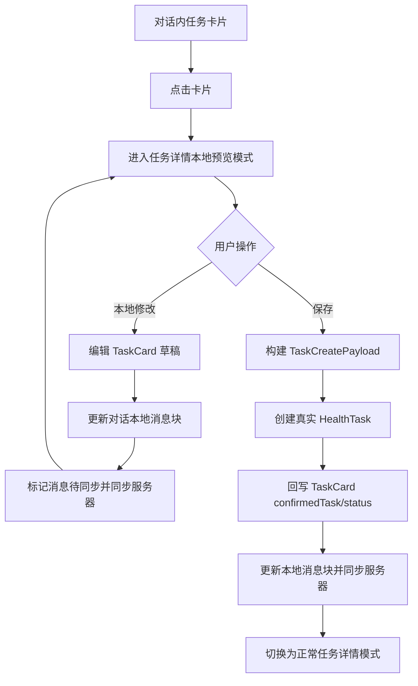
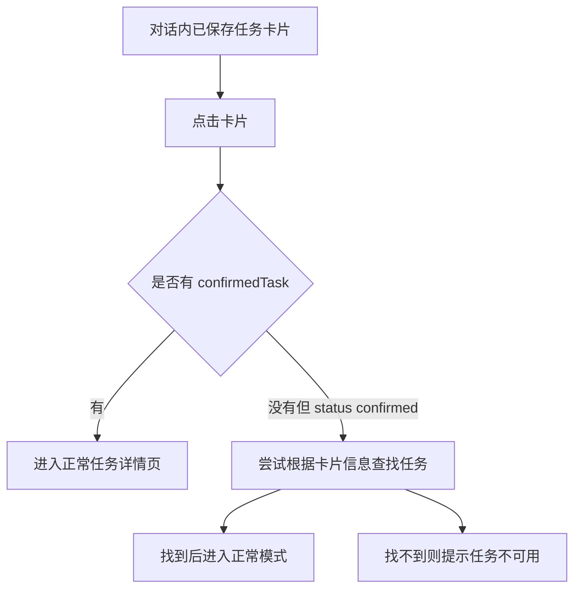

# TASK-000003：任务详情本地预览模式与会话卡片保存闭环工单

> 创建日期：2026-08-11  
> 关联工单：`TASK-000001-任务模块整体优化重构客户端需求工单.md`、`TASK-000002-任务中心与详情页移动端UI质感优化工单.md`  
> 关联入口：`SparkClient/Projects/Features/Chat/Presentation/ChatView/Components/ChatMessageBlock+Render.swift:213`  
> 关联客户端：`TaskDetailView.swift`、`TaskCreateView.swift`、`TaskManager.swift`、`TaskService.swift`、`TaskCardCell.swift`、`TaskCard.swift`、`ChatDetailViewModel.swift`、`ChatRenderContext.swift`、`ChatMessageBubbleContentView.swift`  
> 状态：新需求 / 待实现  
> 优先级：P0，会话任务卡片保存体验闭环

## 1. 一句话目标

任务卡片在对话消息内点击后，不再直接只做“创建 / 忽略”的卡片内操作，而是进入任务详情页的“本地预览模式”。预览模式展示完整任务详情，底部只显示“保存”按钮，替代正常任务详情页里的“标记完成 / 跳过 / 失败”。用户可在右上角进入“本地修改”，只修改对话内任务卡片草稿；点击保存后回调会话内保存逻辑，创建真实任务，保存成功后详情页自动切换为正常模式。

---

## 2. 背景与现状

当前对话任务卡片渲染入口位于：

`SparkClient/Projects/Features/Chat/Presentation/ChatView/Components/ChatMessageBlock+Render.swift:213`

当前代码结构：

```swift
case .taskCards(let cards):
    ForEach(cards) { card in
        TaskCardCell(
            card: card,
            memberContextStore: context.memberContextStore,
            onAction: context.onTaskCardAction,
            isLoading: context.taskCardLoadingIDs.contains(card.id)
        )
    }
```

当前 `TaskCardCell` 支持卡片内“创建任务 / 忽略 / 切换成员”。`ChatDetailViewModel.confirmTaskCard` 会把 `TaskCard` 转成 `TaskCreatePayload`，调用 `taskManager.createTask(payload:)`，然后回写消息块，把卡片状态置为 `.confirmed`。

这条链路已经能保存任务，但有三个体验缺口：

1. 用户保存前不能进入完整详情预览，只能看消息卡片摘要。
2. 用户保存前不能在详情页里本地修改任务草稿。
3. 保存成功后没有“预览详情 -> 正常任务详情”的自然模式切换。

---

## 3. 核心需求

### 3.1 新增任务详情本地预览模式

任务详情页新增两种模式：

1. 正常模式：基于真实 `HealthTask.id` 展示服务端任务。
2. 本地预览模式：基于对话消息内 `TaskCard` 草稿展示完整详情。

本地预览模式的视觉结构应复用 `TASK-000002` 已落地的详情页结构：

1. 头部：标题、描述、类型、优先级、状态。
2. 基础信息卡片：时间、重复、来源、关联业务。
3. 业务面板：医疗 / 运动 / 饮食差异化字段。
4. 底部操作：只显示“保存”。

### 3.2 预览模式底部按钮

本地预览模式底部必须使用“保存”按钮，替代正常模式的：

1. 标记完成
2. 跳过
3. 失败

预览模式不能出现任务执行操作，因为任务还没有真实落库，不存在执行记录语义。

### 3.3 右上角本地修改

本地预览模式右上角提供 `...` 菜单，菜单项为：

1. 本地修改
2. 放弃修改

“本地修改”进入编辑页，但只编辑对话消息内的 `TaskCard` 草稿，不创建真实任务，不调用 `POST /api/v1/tasks/`。

### 3.4 点击保存后的回调

预览模式点击“保存”后必须回调会话内保存逻辑：

1. 使用当前预览草稿构建 `TaskCreatePayload`。
2. 调用任务创建接口。
3. 保存成功后更新对话消息内的 `TaskCard`。
4. 将卡片状态置为 `.confirmed`。
5. 写入 `confirmedTask` 为真实任务 ID。
6. 更新本地消息存储。
7. 标记消息待同步并同步服务器。
8. 当前详情页从本地预览模式切换为正常模式。

### 3.5 已保存卡片点击行为

对话内消息卡片如果已经保存过：

1. `TaskCard.status == .confirmed`
2. 或 `TaskCard.confirmedTask != nil`

点击卡片时必须直接进入正常模式任务详情页，而不是本地预览模式。

---

## 4. 业务流程

### 4.1 未保存任务卡片



### 4.2 已保存任务卡片



---

## 5. 页面模式定义

### 5.1 建议新增枚举

```swift
enum TaskDetailMode: Equatable {
    case normal(taskID: Int)
    case preview(TaskCardPreviewContext)
}

struct TaskCardPreviewContext: Equatable {
    let threadID: UUID
    let messageClientID: UUID
    let card: TaskCard
}
```

### 5.2 详情页输入调整

当前 `TaskDetailView` 输入：

```swift
let taskID: Int
```

建议改为：

```swift
let mode: TaskDetailMode
```

兼容方式：

```swift
init(
    memberID: Int?,
    taskManager: TaskManager,
    knowledgeDependencies: KnowledgeFeatureDependencies,
    knowledgeViewModel: KnowledgeLibraryViewModel,
    taskID: Int
) {
    self.mode = .normal(taskID: taskID)
}
```

这样任务中心原有正常详情入口不受影响，对话卡片入口可以传 `.preview(...)`。

---

## 6. 数据模型设计

### 6.1 TaskCard 到预览详情模型

本地预览模式不能依赖真实 `HealthTask.id`，建议新增一个轻量展示模型：

```swift
struct TaskDetailDisplayModel: Equatable, Sendable {
    let title: String
    let description: String
    let type: HealthTask.TaskType
    let statusText: String
    let startTime: Date?
    let dueTime: Date?
    let repeatType: HealthTask.RepeatType
    let priority: HealthTask.Priority
    let businessType: String
    let businessID: String
    let source: HealthTask.Source
    let medical: TaskMedicalDisplay?
    let exercise: TaskExerciseDisplay?
    let diet: TaskDietDisplay?
}
```

### 6.2 预览模式状态

```swift
enum TaskDetailPreviewState: Equatable {
    case idle(TaskCard)
    case editing(TaskCard)
    case saving(TaskCard)
    case saved(taskID: Int)
    case failed(TaskCard, message: String)
}
```

---

## 7. UI 设计

### 7.1 本地预览模式线框

```text
┌────────────────────────────────────┐
│  < 返回                  ...       │
│                                    │
│  服药提醒                    [医疗] │
│  晚餐后 30 分钟服药，注意饮水       │
│  [待保存] [高优先级] [AI 生成]      │
│                                    │
│  ┌──────────────────────────────┐  │
│  │ 基础信息                     │  │
│  │ 时间        今天 20:00        │  │
│  │ 重复        每日              │  │
│  │ 来源        AI 生成           │  │
│  └──────────────────────────────┘  │
│                                    │
│  ┌──────────────────────────────┐  │
│  │ 医疗任务                     │  │
│  │ 类型        健康监测          │  │
│  │ 说明        记录血压与心率     │  │
│  └──────────────────────────────┘  │
│                                    │
├────────────────────────────────────┤
│  [保存]                            │
└────────────────────────────────────┘
```

### 7.2 正常模式线框

正常模式继续使用 `TASK-000002` 已落地样式：

```text
┌────────────────────────────────────┐
│  < 返回                  ...       │
│  任务详情                          │
│  ...                               │
├────────────────────────────────────┤
│  [标记完成]                  [...] │
└────────────────────────────────────┘
```

### 7.3 模式差异

| 页面元素 | 本地预览模式 | 正常模式 |
| --- | --- | --- |
| 数据来源 | `TaskCard` | `HealthTask` |
| 底部主按钮 | 保存 | 标记完成 |
| 跳过 / 失败 | 不显示 | `...` 菜单内显示 |
| 执行记录 | 不显示或展示“保存后可记录执行” | 展示真实执行记录 |
| 右上角编辑 | 本地修改 | 修改任务 |
| 保存行为 | 创建真实任务 | 不出现保存按钮 |
| 成功后模式 | 切换正常模式 | 保持正常模式 |

---

## 8. 交互细节

### 8.1 卡片点击

`TaskCardCell` 新增点击详情能力：

```swift
let onOpenPreview: (TaskCard) -> Void
```

点击规则：

1. `confirmedTask != nil`：打开正常任务详情。
2. `status == .confirmed` 且有真实任务 ID：打开正常任务详情。
3. 其他情况：打开本地预览模式。

### 8.2 本地修改

预览模式点击右上角 `... -> 本地修改`：

1. 打开任务编辑页。
2. 编辑对象是 `TaskCard` 草稿。
3. 点击编辑页保存时只更新对话消息块。
4. 不调用任务创建接口。
5. 不创建 `HealthTask`。
6. 更新后的消息块必须写入本地存储并同步服务器。

### 8.3 保存

预览模式底部点击保存：

1. 保存按钮立即进入 loading。
2. 禁止重复点击。
3. 创建真实任务。
4. 成功后 toast 提示。
5. 回写卡片状态和真实任务 ID。
6. 切换为正常模式。
7. 正常模式底部显示“标记完成 / ...”。

### 8.4 保存失败

保存失败时：

1. 保留预览模式。
2. 保留用户本地编辑内容。
3. 显示错误提示。
4. 保存按钮恢复可点击。

---

## 9. 落地目录结构

```text
SparkClient/
└── Projects/
    ├── Features/
    │   ├── Task/
    │   │   ├── Domain/
    │   │   │   ├── TaskDetailMode.swift                 # 新增
    │   │   │   ├── TaskCardPreviewMapper.swift          # 新增
    │   │   │   └── TaskCreateFormDraft.swift            # 扩展 TaskCard 草稿转换
    │   │   ├── Presentation/
    │   │   │   ├── TaskDetailView.swift                 # 改造支持 normal / preview
    │   │   │   ├── TaskCreateView.swift                 # 扩展本地草稿编辑模式
    │   │   │   └── TaskCardPreviewEditView.swift        # 可选新增
    │   │   └── Support/
    │   │       ├── TaskDetailBottomActionBar.swift      # 复用正常模式
    │   │       └── TaskPreviewSaveBottomBar.swift       # 新增
    │   └── Chat/
    │       ├── Domain/
    │       │   └── ChatMessage/BlockPayloads/TaskCard.swift
    │       └── Presentation/
    │           ├── ChatDetailViewModel.swift            # 增加保存/本地编辑回调
    │           ├── ChatMessageBlock+Render.swift        # 任务卡片点击进入预览
    │           └── ChatRenderContext.swift              # 增加 onTaskCardOpen
```

---

## 10. 关键代码示例

### 10.1 TaskDetailMode

```swift
enum TaskDetailMode: Equatable {
    case normal(taskID: Int)
    case preview(TaskCardPreviewContext)

    var isPreview: Bool {
        if case .preview = self { return true }
        return false
    }
}

struct TaskCardPreviewContext: Equatable {
    let threadID: UUID
    let messageClientID: UUID
    var card: TaskCard
}
```

### 10.2 任务卡片打开规则

```swift
func openTaskCard(_ card: TaskCard, message: ChatMessage) {
    if let taskID = card.confirmedTask {
        route.append(.taskDetail(.normal(taskID: taskID)))
        return
    }

    route.append(.taskDetail(.preview(TaskCardPreviewContext(
        threadID: threadID,
        messageClientID: message.clientMessageID,
        card: card
    ))))
}
```

### 10.3 预览模式底部保存

```swift
struct TaskPreviewSaveBottomBar: View {
    let isSaving: Bool
    let onSave: () -> Void

    var body: some View {
        Button(action: onSave) {
            if isSaving {
                ProgressView()
                    .frame(maxWidth: .infinity)
            } else {
                Label(NSLocalizedString("common.save", comment: "保存"), systemImage: "tray.and.arrow.down.fill")
                    .frame(maxWidth: .infinity)
            }
        }
        .buttonStyle(.borderedProminent)
        .disabled(isSaving)
        .frame(minHeight: 44)
        .padding(.horizontal, 16)
        .padding(.vertical, 10)
        .background(.bar)
    }
}
```

### 10.4 预览保存回调

```swift
func savePreviewTaskCard(
    threadID: UUID,
    message: ChatMessage,
    card: TaskCard
) async throws -> Int {
    guard let memberID = validatedTaskCardMemberID(card.member) else {
        throw TaskPreviewSaveError.missingMember
    }

    var cardToCreate = card
    cardToCreate.member = memberID
    cardToCreate.taskPayload = Self.taskPayload(card.taskPayload, settingMemberID: memberID)

    let payload = ChatTaskPayloadBuilder.build(from: cardToCreate)
    let createdTask = try await taskManager.createTaskReturningTask(payload: payload)

    await updateTaskCard(threadID: threadID, message: message, cardID: card.id) {
        $0.member = memberID
        $0.taskPayload = cardToCreate.taskPayload
        $0.status = .confirmed
        $0.confirmedTask = createdTask.id
        $0.updatedAt = Date()
    }

    return createdTask.id
}
```

### 10.5 本地编辑回写

```swift
func updatePreviewTaskCardDraft(
    threadID: UUID,
    message: ChatMessage,
    cardID: Int,
    mutate: @escaping (inout TaskCard) -> Void
) async {
    await updateTaskCard(threadID: threadID, message: message, cardID: cardID) { card in
        mutate(&card)
        card.updatedAt = Date()
    }
}
```

`updateTaskCard` 必须继续调用：

```swift
updateChatMessageBlocksUseCase.execute(
    clientMessageID: message.clientMessageID,
    blocks: updatedBlocks,
    markPendingForSync: true
)
```

这样本地编辑会更新本地存储，并通过消息同步链路同步服务器。

---

## 11. 需要调整的现有代码

### 11.1 `TaskManager`

当前：

```swift
func createTask(payload: TaskCreatePayload) async throws
```

建议新增：

```swift
func createTaskReturningTask(payload: TaskCreatePayload) async throws -> HealthTask
```

原因：

1. 保存成功后需要真实任务 ID。
2. 需要写回 `TaskCard.confirmedTask`。
3. 详情页需要立即切换正常模式。

### 11.2 `TaskCardCell`

新增打开详情回调：

```swift
let onOpenPreview: (TaskCard) -> Void
```

卡片点击不应直接触发创建；创建入口保留为按钮，卡片主体点击进入预览。

### 11.3 `ChatRenderContext`

新增：

```swift
let onTaskCardOpen: (TaskCard, ChatMessage) -> Void
```

或简化为：

```swift
let onTaskCardOpen: (TaskCard) -> Void
```

如果路由层需要消息上下文，推荐保留 `ChatMessage`。

### 11.4 `ChatMessageBlock+Render`

当前只传 `onAction`：

```swift
TaskCardCell(
    card: card,
    memberContextStore: context.memberContextStore,
    onAction: context.onTaskCardAction,
    isLoading: context.taskCardLoadingIDs.contains(card.id)
)
```

改为：

```swift
TaskCardCell(
    card: card,
    memberContextStore: context.memberContextStore,
    onOpenPreview: { context.onTaskCardOpen($0, context.message) },
    onAction: context.onTaskCardAction,
    isLoading: context.taskCardLoadingIDs.contains(card.id)
)
```

### 11.5 `TaskDetailView`

改为支持：

```swift
let mode: TaskDetailMode
```

本地预览模式：

1. 不调用 `taskManager.loadExecutions(taskID:)`。
2. 不展示执行记录或展示弱提示。
3. 不显示 `TaskDetailBottomActionBar`。
4. 显示 `TaskPreviewSaveBottomBar`。
5. 右上角菜单显示“本地修改”。

正常模式：

1. 继续按 `taskID` 从 `TaskManager` 查询真实任务。
2. 继续加载执行记录。
3. 继续显示标记完成、跳过、失败。

---

## 12. 状态同步要求

### 12.1 本地编辑同步

本地编辑不是创建任务，但必须更新对话消息：

1. 更新 `TaskCard` 字段。
2. 更新 `TaskCard.taskPayload` 中对应 JSON。
3. 更新 `updatedAt`。
4. 调用 `updateChatMessageBlocksUseCase`。
5. `markPendingForSync = true`。

### 12.2 保存成功同步

保存成功后必须更新：

1. `status = .confirmed`
2. `confirmedTask = createdTask.id`
3. `member = memberID`
4. `taskPayload = savedPayload`
5. `updatedAt = Date()`
6. 本地消息存储
7. 服务端消息同步
8. `TaskManager.tasks`

### 12.3 已保存重复点击

如果消息卡片已经保存：

1. 不再进入预览模式。
2. 不再显示保存按钮。
3. 不再允许“本地修改”影响真实任务。
4. 点击直接打开正常任务详情页。

---

## 13. 验收标准

### 13.1 未保存卡片

- [ ] 对话内任务卡片主体点击进入任务详情本地预览模式。
- [ ] 本地预览模式底部只显示“保存”。
- [ ] 本地预览模式不显示“标记完成 / 跳过 / 失败”。
- [ ] 右上角提供“本地修改”入口。
- [ ] 本地修改只更新对话消息内 `TaskCard` 草稿。
- [ ] 本地修改后不创建真实任务。
- [ ] 本地修改后本地消息存储更新，并标记同步服务器。

### 13.2 保存

- [ ] 点击保存会创建真实 `HealthTask`。
- [ ] 保存中按钮进入 loading，禁止重复点击。
- [ ] 保存成功后写回 `TaskCard.status = .confirmed`。
- [ ] 保存成功后写回 `TaskCard.confirmedTask = task.id`。
- [ ] 保存成功后当前页面切换为正常任务详情模式。
- [ ] 保存失败保留本地预览模式和用户修改。

### 13.3 已保存卡片

- [ ] 已保存任务卡片点击直接进入正常任务详情页。
- [ ] 正常模式底部显示“标记完成 / ...”。
- [ ] 正常模式不显示“保存”按钮。
- [ ] 已保存卡片不再允许预览模式本地修改。

---

## 14. 边界与风险

1. `TaskManager.createTask(payload:)` 当前不返回 `HealthTask`，无法写回 `confirmedTask`，必须新增返回真实任务的方法。
2. `TaskCard.taskPayload` 是字符串字典，编辑时必须同步修改内层 JSON，不能只改外层字段。
3. 对话消息块本地更新后必须走 `markPendingForSync = true`，否则刷新或跨端后会丢失本地编辑。
4. 保存成功后页面模式切换要避免重新 push 一个页面导致导航栈重复。
5. 如果保存后服务端返回任务但消息块回写失败，需要保留可恢复提示，避免用户以为没保存。

---

## 15. 推荐落地顺序

1. 增加 `TaskDetailMode` 和 `TaskCardPreviewContext`。
2. 增加 `TaskCardPreviewMapper`，将 `TaskCard` 转成详情展示模型。
3. 改造 `TaskDetailView` 支持 normal / preview。
4. 增加 `TaskPreviewSaveBottomBar`。
5. 改造 `TaskManager` 增加返回 `HealthTask` 的创建方法。
6. 改造 `ChatDetailViewModel` 增加预览保存和本地编辑回写方法。
7. 改造 `TaskCardCell` 支持主体点击进入预览。
8. 改造 `ChatRenderContext` 和 `ChatMessageBlock+Render.swift:213` 传入打开预览回调。
9. 验证未保存、已保存、编辑后保存、保存失败四条路径。

---

## 16. 结论

本工单要把“对话内任务建议卡片”从一个只能直接创建的轻卡片，升级为“可预览、可本地修改、可保存、可切换正常详情”的完整闭环。

关键原则是：**预览模式只处理对话内草稿，保存才创建真实任务；保存成功后必须回写消息并切换正常模式。**
