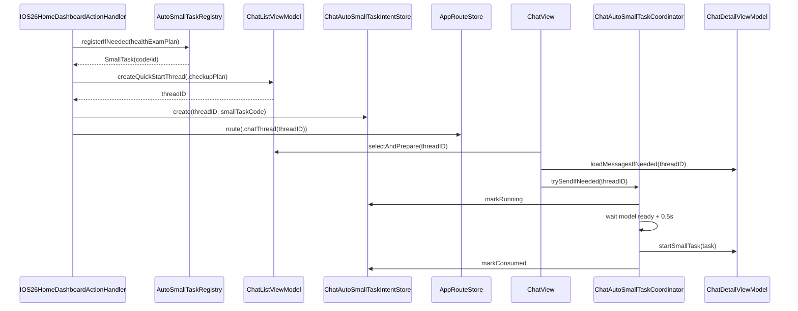

# CHAT-000015 首页制定体检计划入口自动发送小任务通用流程工单

## 0. 工单元信息

| 字段 | 内容 |
| --- | --- |
| 工单编号 | CHAT-000015 |
| 工单类型 | P1 首页快捷入口 / Chat 小任务自动触发 / 本地小任务配置 / UserDefaults 幂等注册 |
| 当前范围 | 只创建需求与技术方案工单；本工单不直接修改代码 |
| 目标工程 | `/Users/hua/Documents/project/Reference/LookHealthClient/SparkClient` |
| 目标模块 | `Features/Home`、`Features/Chat`、`Features/AISettings`、`Core/AI` |
| 创建日期 | 2026-08-11 |
| 触发需求 | 用户首次从首页点击“制定体检计划”进入 Chat 后，自动发送“生成体检计划”小任务；小任务配置写入本地并通过 UserDefaults 做幂等记录 |
| 关联工单 | `CHAT-000007`、`CHAT-000009`、`CHAT-000012`、`DEEPTUTORCHAT-000051`、`MEDICAL-000003` |
| 明确非目标 | 本工单不改 DeepTutorChat；不改任务展示；不改小任务执行结果展示；不直接实现代码 |

## 1. 背景与问题

当前首页快捷入口已有“制定体检计划”和“报告解读”等入口，Chat 侧也已有 SmallTask 机制。用户希望点击首页“制定体检计划”后，不再只是进入对话并留下草稿，而是自动触发体检计划小任务。

现阶段需要解决四件事：

1. 首页入口需要把业务意图带入 Chat，而不是依赖用户手动点击小任务胶囊。
2. 体检计划小任务配置要能插入本地 SmallTask 数据库，避免依赖服务端配置是否已下发。
3. 本地小任务插入必须幂等，当前用户已插入过就不要重复创建。
4. Chat 页面需要在默认模型加载完成后，延迟约 0.5 秒自动发送该小任务消息。

同时，这套能力后续会用于“报告解读”等其他小任务，因此不能写死为体检计划的一次性逻辑，需要形成通用公共规范。

## 2. 产品目标

1. 用户从首页点击“制定体检计划”，进入普通 Chat 对话。
2. 系统检查当前用户是否已注册过体检计划小任务：
   - 已注册：复用已保存的小任务 ID 或 code。
   - 未注册：把体检计划小任务配置插入本地 SmallTask 数据库，并把 `business_key=health_exam_plan`、小任务 ID 和稳定 code 写入 UserDefaults。
3. Chat 页面打开后，等待默认模型自动加载完成，再延迟 0.5 秒自动发送体检计划小任务消息。
4. 自动发送只在普通 Chat 生效；DeepTutorChat 不执行这套自动发送流程。
5. 小任务自动发送只对本次首页入口创建的新会话执行一次，避免页面重建、返回前台、重复 `.task` 导致重复发送。
6. 方案要支持后续“报告解读小任务”接入，不新增平行流程。

## 3. 推荐方案结论

建议采用“三段式”方案：

1. **本地小任务注册层**  
   负责把业务内置 SmallTask 配置写入本地数据库，并用 UserDefaults 记录当前用户、业务入口和小任务 ID 的映射。

2. **首页快捷入口意图层**  
   首页点击只负责创建 Chat 会话，并登记一个一次性 `pendingAutoSmallTaskIntent`，说明本次进入 Chat 后要自动发送哪个小任务。

3. **Chat 自动发送协调层**  
   Chat 页面选中线程、加载消息、默认模型就绪后，延迟 0.5 秒调用 `startSmallTask(_:)`。发送成功或明确失败后清理本次 pending intent。

这比直接在首页调用发送更稳，因为首页没有 Chat 页面完整生命周期、默认模型状态、消息加载状态和发送锁状态。

### 3.1 已确认产品决策

本工单以下决策已确认，后续实现不再作为开放问题处理：

1. 首页“制定体检计划”本期强制进入普通 Chat，不再尊重 quick start 偏好切到 DeepTutorChat。原因是该自动发送流程只在 Chat 生效，DeepTutorChat 明确不处理。
2. UserDefaults 中的体检计划注册记录存 `business_key=health_exam_plan`、`smallTaskID` 和稳定 `smallTaskCode`；它不是体检计划知识库文档的业务 ID。后续报告解读可在 pending intent 中额外携带 `business_type/business_id`。
3. 业务识别使用稳定 code `Service_health_exam_plan_task`。本地数据库可以保存为 `.local` 来源，但业务逻辑不得依赖 `Local_1` 这类自增 code。
4. 自动发送失败后展示轻提示 Toast，并保留草稿，方便用户手动继续。
5. 本期不提供“关闭首页自动发送”的设置项。日志和 source 字段必须保留，后续如果用户反馈打扰，再加开关。

## 4. 核心边界

### 4.1 只在 Chat 生效

| 入口目标 | 是否执行自动发送 | 说明 |
| --- | --- | --- |
| 普通 Chat | 是 | 本工单目标路径；首页“制定体检计划”本期强制进入 Chat |
| DeepTutorChat | 否 | 用户明确要求 DeepTutorChat 不处理 |
| Chat 列表手动新建会话 | 否 | 不是首页业务入口 |
| 普通历史会话打开 | 否 | 避免污染已有对话 |
| 首页报告解读 | 后续接入 | 使用同一规范新增业务配置 |

### 4.2 UserDefaults 幂等含义

UserDefaults 的“已存储”只表示当前用户已把该业务小任务配置注册到本地数据库，**不表示以后不再自动发送**。

正确语义：

```text
已注册过小任务配置 -> 不重复插入 SmallTask
本次首页点击创建新 Chat 线程 -> 仍可以自动发送一次
同一个 threadID 已自动发送过 -> 不重复发送
```

如果把“已存储”理解成“以后都不触发自动发送”，用户第二次点击首页“制定体检计划”会没有响应，不符合产品目标。

## 5. 本地小任务配置

### 5.1 体检计划小任务配置

```json
{
  "code": "Service_health_exam_plan_task",
  "name": "生成体检计划",
  "brief": "生成一份个体化体检计划，自动保存到知识库，并创建 1 个关联该计划的体检任务。",
  "icon": "stethoscope",
  "tool_list": [
    "get_current_member",
    "request_member_selection",
    "query_member_profile",
    "list_member_health_sources",
    "get_health_resource_reference",
    "get_health_resource_context",
    "search_knowledge_bag",
    "ask_user_question",
    "show_medical_risk_notice",
    "create_knowledge_document",
    "generate_task"
  ]
}
```

### 5.2 小任务 Prompt

```text
你是“体检计划任务生成智能体”。

你的目标不是在会话里详细解释体检项目，而是：
1. 生成一份完整、个体化的体检计划；
2. 自动保存到知识库；
3. 只创建 1 个关联该知识库计划的体检任务；
4. 最终只给用户简短确认。

执行流程：

1. 确认体检对象
- 优先调用 get_current_member。
- 如果当前成员不明确，调用 request_member_selection。
- 不要在成员不明确时直接生成计划。

2. 读取成员健康画像
- 调用 query_member_profile。
- 重点读取：年龄、性别、身高体重、慢病史、长期用药、过敏史、家族史、生活方式、既往体检摘要、风险评估。
- 如果用户提到“上次体检”“报告异常”“结合历史报告”，调用 list_member_health_sources。
- 如需要具体报告上下文，再调用 get_health_resource_reference 和 get_health_resource_context。

3. 检索知识库规则
- 调用 search_knowledge_bag。
- 体检项目、筛查建议、检前准备、复查原则应优先来自知识库背包。
- 不要只凭通用常识生成体检项目。

4. 判断是否需要追问
如果缺少必要信息，只调用 ask_user_question 追问最多 1 次。
追问问题最多 3 个，优先确认：
- 本次体检目的：年度体检 / 复查异常 / 入职入学 / 备孕 / 慢病管理 / 其他
- 预算或套餐偏好：基础 / 标准 / 深度
- 是否有近期不适或医生已建议复查的项目

如果已有信息足够，不要追问，直接进入生成。

5. 红旗风险处理
如果用户描述胸痛、呼吸困难、严重头痛、肢体无力、黑便、咯血、异常出血、快速消瘦、高热不退等红旗症状：
- 先调用 show_medical_risk_notice。
- 仍可生成知识库计划和任务，但任务目标应改为“尽快就医/专科评估”。
- 不要包装成普通年度体检。

6. 生成体检计划正文
生成完整体检计划，但不要在会话正文中展开。
计划内容用于保存到知识库，建议包含：
- 基本信息
- 本次体检目标
- 风险摘要
- 推荐体检项目
- 检前准备
- 检后处理
- 需要及时就医的情况
- 生成依据

7. 自动保存到知识库
调用 create_knowledge_document。
必须传入：
- title：{成员名或称呼}的体检计划-{当前日期}
- content：完整 Markdown 体检计划
- auto_save：true
- category：health_exam_plan
- member_id：当前成员 ID
- source：small_task_health_exam_plan

保存成功后，必须读取工具返回：
- business_type
- business_id

期望返回：
{
  "ok": true,
  "action": "saved",
  "business_type": "knowledge",
  "business_id": "知识库文档ID"
}

如果保存失败，不要继续创建任务。

8. 创建体检任务
调用 generate_task。
只创建 1 个任务，不要拆分多个体检项目任务。

必须传入：
- task_type：knowledge
- business_type：create_knowledge_document 返回的 business_type
- business_id：create_knowledge_document 返回的 business_id
- title：完成本次体检计划
- description：体检项目详情已保存到知识库，请按计划完成检查，并在拿到报告后上传解读。
- member_id：当前成员 ID
- source：small_task_health_exam_plan

任务创建时，业务关联必须指向知识库体检计划。

9. 最终回复
最终只输出简短确认，不逐项解释体检项目。

成功时回复：
“已生成体检计划并保存到知识库，同时创建 1 个体检任务。任务已关联该体检计划。”

知识库保存失败时回复：
“体检计划已生成，但保存到知识库失败，因此没有创建体检任务。请稍后重试。”

任务创建失败时回复：
“体检计划已保存到知识库，但体检任务创建失败。你可以稍后从知识库计划重新创建任务。”

限制：
- 不要在会话正文里详细说明每一个体检项目。
- 不要创建多个任务。
- 不要把具体体检项目硬编码在任务里。
- 不要在没有知识库 business_id 的情况下创建体检任务。
- 不要替代医生诊断。
```

## 6. UserDefaults 存储规范

### 6.1 存储目标

UserDefaults 只存轻量索引，不存完整 Prompt 和工具列表。

对体检计划注册记录而言，UserDefaults 中的业务 ID 指本地注册业务 key 与 SmallTask 索引，不是知识库文档 ID。知识库文档 ID 只在小任务执行完成后由 `create_knowledge_document` 返回，并由 `generate_task` 写入任务 `business_id`。

建议存储：

```json
{
  "user_id": "当前账号ID",
  "business_key": "health_exam_plan",
  "small_task_code": "Service_health_exam_plan_task",
  "local_small_task_id": 10001,
  "payload_version": 1,
  "payload_hash": "sha256-of-name-brief-prompt-tools",
  "created_at": "2026-08-11T00:00:00Z",
  "updated_at": "2026-08-11T00:00:00Z"
}
```

推荐 key：

```text
chat.autoSmallTask.registry.{userID}.health_exam_plan
```

不要使用全局 key，例如：

```text
health_exam_plan_small_task_id
```

原因：多账号、游客升级正式账号、测试账号切换都会导致串数据。

### 6.2 幂等判断

注册时按以下顺序判断：

1. UserDefaults 是否存在当前 `userID + business_key` 记录。
2. 记录里的 `small_task_code/local_small_task_id` 是否能在本地 SmallTask 数据库查到。
3. 如果查不到，视为脏记录，重新插入并覆盖 UserDefaults。
4. 如果查得到，比较 `payload_version/payload_hash`：
   - 版本一致：复用。
   - 版本升级：推荐更新本地 SmallTask，并刷新 UserDefaults。
5. 业务逻辑查找小任务时优先使用稳定 `small_task_code=Service_health_exam_plan_task`，`local_small_task_id` 只作为本地数据库快速定位和校验字段。

### 6.3 为什么需要版本和 hash

如果只保存 `small_task_id`，后续 Prompt 或工具白名单变更后，老用户不会得到更新，体检计划流程会停留在旧协议。建议至少保存 `payload_version`，更稳的是同时保存 `payload_hash`。

## 7. 本地 SmallTask 注册规范

### 7.1 推荐公共服务

建议新增公共服务概念：

```swift
AutoSmallTaskRegistry
```

职责：

1. 接收业务 key 和 SmallTask 内置配置。
2. 检查 UserDefaults 注册记录。
3. 查询本地 SmallTask 数据库。
4. 必要时插入或更新本地 SmallTask。
5. 返回可执行的 `SmallTask` 或 `smallTaskCode/smallTaskID`。

### 7.2 不建议写在首页 View

不要把本地小任务插入逻辑直接写进 `IOS26HomeView` 或按钮 action。原因：

1. 首页只负责用户动作，不应该知道 SmallTask 持久化细节。
2. 后续报告解读会复用同一套流程。
3. 直接写在 View 层容易被 SwiftUI 重建触发多次。

更合适的位置：

| 层 | 职责 |
| --- | --- |
| `IOS26HomeDashboardActionHandler` | 识别首页业务入口，发起 quick start |
| `AutoSmallTaskRegistry` | 注册/复用本地小任务 |
| `ChatAutoSmallTaskIntentStore` | 登记本次 thread 的一次性自动发送意图 |
| `ChatView` / `ChatDetailViewModel` | 等待模型就绪后触发 `startSmallTask` |

## 8. 首页到 Chat 的流程

### 8.1 体检计划入口

```text
用户点击首页“制定体检计划”
  -> 强制使用 Chat quick start 路径
  -> 注册/复用 health_exam_plan 小任务
  -> 创建 Chat quick start thread
  -> 写入 pendingAutoSmallTaskIntent(threadID, businessKey, smallTaskCode, source)
  -> route(to: .chatThread(threadID))
```

说明：本期“制定体检计划”不再读取 `HomeQuickStartConversationPreferenceStore.target` 来切换 DeepTutorChat。报告解读是否尊重偏好，后续按对应工单单独确认。

### 8.2 Pending Intent 建议结构

```swift
struct ChatAutoSmallTaskIntent: Codable, Sendable {
    let id: UUID
    let threadID: UUID
    let businessKey: String
    let smallTaskCode: String
    let localSmallTaskID: Int?
    let source: String
    let createdAt: Date
    let expiresAt: Date
    var status: Status

    enum Status: String, Codable, Sendable {
        case pending
        case running
        case consumed
        case failed
        case expired
    }
}
```

建议 `expiresAt` 设置为 5 分钟，避免用户点击后迟迟不进入 Chat，下一次打开同一线程误触发。

### 8.3 Pending Intent 存储位置

推荐优先使用内存 Store，并在必要时用 UserDefaults 做短期兜底。

| 存储 | 推荐用途 |
| --- | --- |
| 内存 Store | 正常导航期间的一次性 pending intent |
| UserDefaults | App 被系统杀掉、导航中断后的短期恢复 |
| ChatThread extra | 如果后续需要跨设备同步自动意图，可再考虑 |

本期建议不要把 pending intent 放进 SmallTask 表，因为它不是配置，而是一次性执行状态。

## 9. Chat 自动发送流程

### 9.1 触发条件

Chat 页面必须同时满足以下条件才发送：

1. 当前 route 是 `.chatThread(threadID)`。
2. 存在 `pendingAutoSmallTaskIntent`，且 `threadID` 匹配。
3. intent 状态为 `pending`，未过期。
4. Chat 消息已完成初次加载。
5. 默认模型已自动加载并选中。
6. 当前没有正在发送的消息。
7. 本线程没有已经发送过同一 intent 的小任务消息。

### 9.2 0.5 秒延迟规则

等待默认模型就绪后，再延迟 0.5 秒自动发送：

```text
ChatView 出现
  -> selectAndPrepare(threadID)
  -> loadMessagesIfNeeded(threadID)
  -> 等待 selectedComposerModelRow 不为空
  -> 等待 effectiveSmallTasks 可找到 smallTaskCode
  -> delay 0.5s
  -> detailViewModel.startSmallTask(task)
```

0.5 秒只是 UI 和状态稳定缓冲，不应该替代“模型已就绪”的判断。不能写成固定进入页面 0.5 秒后无条件发送。

### 9.3 去重规则

需要防止以下重复：

1. SwiftUI `.task(id:)` 重跑。
2. App 前后台切换导致页面重新出现。
3. Chat 消息加载重复回调。
4. 用户快速连续点击首页入口。
5. 默认模型刷新导致就绪状态重复触发。

推荐去重策略：

```text
intent.status pending -> running -> consumed
```

一旦进入 `running`，同一 intent 不再重复触发。发送失败时标记 `failed`，并展示轻提示或记录日志。

### 9.4 是否保留 initialDraft

当前 Chat quick start 会设置 `mode.initialDraft`。自动发送小任务后，建议不要再保留草稿，否则用户可能看到草稿残留。

推荐方案：

| 场景 | draft 处理 |
| --- | --- |
| 自动小任务发送成功 | 清空 draft |
| 自动小任务发送失败 | 保留或恢复 draft，方便用户手动发送 |
| 小任务配置缺失 | 保留 draft，并给出错误提示 |

## 10. 默认模型与小任务可用性

小任务实际工具白名单会与模型 `aiToolScenarios` 取交集。因此自动发送前需要确认：

1. 默认模型已加载。
2. 当前模型允许小任务需要的工具。
3. 当前模型的 `relatedTaskCodes` 不一定包含该小任务也可以发送，但为了输入栏展示一致，建议后续补齐绑定。

推荐策略：

| 状态 | 处理 |
| --- | --- |
| 默认模型加载成功且工具可用 | 自动发送 |
| 默认模型未加载 | 等待，设置超时，例如 10 秒 |
| 超时仍无模型 | 不自动发送，保留草稿并提示 |
| 小任务找不到 | 尝试重新注册一次；仍失败则提示 |
| 工具白名单不满足 | 不自动发送，提示当前模型不支持体检计划小任务 |

## 11. 后续报告解读接入建议

本工单建议把业务入口抽象为：

```swift
enum ChatAutoSmallTaskBusinessKey: String {
    case healthExamPlan = "health_exam_plan"
    case reportInterpretation = "report_interpretation"
}
```

每个业务 key 对应：

```swift
struct AutoSmallTaskDefinition {
    let businessKey: String
    let smallTaskCode: String
    let name: String
    let brief: String
    let prompt: String
    let icon: String
    let toolList: [String]
    let payloadVersion: Int
}
```

后续报告解读只需要新增一条 definition，不需要复制首页、UserDefaults、Chat 自动发送逻辑。

### 11.1 报告解读需要额外考虑

报告解读通常需要业务对象上下文，例如：

- report ID
- report type
- file ID
- OCR 状态
- member ID

因此 pending intent 需要预留：

```swift
let businessType: String?
let businessID: String?
let payload: [String: String]
```

体检计划入口当前可以不传 `businessID`；报告解读入口大概率需要传入具体报告 ID。

## 12. 失败与降级

### 12.1 小任务注册失败

处理：

1. 不进入自动发送。
2. 可以仍创建 Chat 线程并保留 `initialDraft`。
3. 提示用户：`体检计划小任务初始化失败，请稍后重试。`

### 12.2 默认模型未加载

处理：

1. 等待最多 10 秒。
2. 超时后清理 pending intent 或标记 failed。
3. 保留草稿，用户可手动发送。

### 12.3 自动发送失败

处理：

1. intent 标记 failed。
2. 不重试无限次。
3. 允许用户手动点击小任务胶囊或发送草稿。
4. 展示轻提示 Toast，例如：`体检计划小任务自动发送失败，你可以手动发送。`

### 12.4 用户切换会话

如果自动发送前用户离开当前 thread：

1. 不发送。
2. intent 保留到过期时间。
3. 用户回到同一 thread 且未过期时可继续发送。

### 12.5 用户手动输入

如果用户在自动发送前手动输入或发送消息：

推荐取消 pending intent，避免系统抢发打断用户。

## 13. 日志与埋点

建议记录以下日志：

| 事件 | 字段 |
| --- | --- |
| `auto_small_task.register.start` | userID、businessKey、smallTaskCode |
| `auto_small_task.register.reuse` | userID、businessKey、smallTaskID |
| `auto_small_task.register.created` | userID、businessKey、smallTaskID、payloadVersion |
| `auto_small_task.intent.created` | threadID、businessKey、source |
| `auto_small_task.wait_model.timeout` | threadID、businessKey、timeout |
| `auto_small_task.send.start` | threadID、businessKey、smallTaskCode |
| `auto_small_task.send.success` | threadID、businessKey |
| `auto_small_task.send.failed` | threadID、businessKey、error |
| `auto_small_task.intent.consumed` | threadID、businessKey |

日志中不得记录完整 Prompt、健康资料正文、用户隐私健康信息。

## 14. 目录结构与文件改动建议

### 14.1 推荐新增目录结构

为了后续“报告解读小任务”复用，建议把自动小任务能力拆成 Chat 公共域能力，不放在 Home 或 DeepTutorChat 目录下。

```text
SparkClient/Projects/Features/Chat/
  Domain/
    AutoSmallTask/
      ChatAutoSmallTaskBusinessKey.swift
      AutoSmallTaskDefinition.swift
      BuiltInAutoSmallTaskCatalog.swift
      ChatAutoSmallTaskIntent.swift
  Application/
    AutoSmallTaskRegistry.swift
    ChatAutoSmallTaskIntentStore.swift
    ChatAutoSmallTaskCoordinator.swift
  Infrastructure/
    UserDefaultsAutoSmallTaskRegistryStore.swift
    UserDefaultsChatAutoSmallTaskIntentStore.swift
```

如果团队希望少建文件，也可以先合并为：

```text
Features/Chat/Domain/ChatAutoSmallTaskModels.swift
Features/Chat/Application/ChatAutoSmallTaskCoordinator.swift
Features/Chat/Infrastructure/ChatAutoSmallTaskPersistence.swift
```

推荐第一种拆法。原因是注册、意图、协调三个职责不同，后续接入报告解读时更清楚。

### 14.2 新增文件职责

| 文件 | 职责 |
| --- | --- |
| `ChatAutoSmallTaskBusinessKey.swift` | 定义 `health_exam_plan`、后续 `report_interpretation` 等业务 key |
| `AutoSmallTaskDefinition.swift` | 定义内置小任务配置结构，包括 code、name、brief、prompt、icon、toolList、payloadVersion |
| `BuiltInAutoSmallTaskCatalog.swift` | 放体检计划小任务配置和 Prompt，后续新增报告解读配置 |
| `ChatAutoSmallTaskIntent.swift` | 定义本次 Chat 会话要自动发送哪个小任务，以及状态、过期时间、source |
| `AutoSmallTaskRegistry.swift` | 负责注册/复用本地 SmallTask，维护 UserDefaults 幂等记录 |
| `ChatAutoSmallTaskIntentStore.swift` | 管理 pending/running/consumed/failed intent |
| `ChatAutoSmallTaskCoordinator.swift` | 监听 Chat 就绪状态，查找小任务并触发 `startSmallTask` |
| `UserDefaultsAutoSmallTaskRegistryStore.swift` | 读写 `chat.autoSmallTask.registry.{userID}.{businessKey}` |
| `UserDefaultsChatAutoSmallTaskIntentStore.swift` | 可选短期兜底保存 pending intent，避免导航中断 |

### 14.3 需要改动的现有文件

| 文件 | 改动点 |
| --- | --- |
| `Features/Home/Presentation/IOS26HomeDashboardActionHandler.swift` | `checkupPlan` 分支强制走 Chat；注册/复用体检计划小任务；创建 pending intent；不再读取 quick start 偏好切到 DeepTutorChat |
| `Features/Chat/Presentation/ChatListViewModel.swift` | `createQuickStartThread` 增加可选自动小任务业务 key 或返回后由首页写 intent；自动小任务场景不要只设置 draft 后结束 |
| `Features/Chat/Domain/ChatQuickStartMode.swift` | 为 `.checkupPlan` 标注对应 `ChatAutoSmallTaskBusinessKey.healthExamPlan`；报告解读预留 |
| `Features/Chat/Presentation/ChatView.swift` | 在 `threadID` task 中完成消息加载后，交给 `ChatAutoSmallTaskCoordinator` 尝试自动发送；不要直接在 View 里写业务判断 |
| `Features/Chat/Presentation/ChatDetailViewModel.swift` | 复用现有 `startSmallTask(_:)`；必要时补一个只读状态方法，例如当前是否 sending、当前 threadID |
| `Features/Chat/Presentation/ChatStateStore.swift` | 若现有状态不足，补充 selected thread、draft、isSending、消息加载完成状态的只读访问能力 |
| `Features/AISettings/Infrastructure/DefaultAISettingsRepository.swift` | 确认现有 `AISmallTaskEntity` 能保存内置小任务；如注册服务直接写 repository，需要暴露 upsert small task 能力 |
| `Features/AISettings/Presentation/Root/AISettingsViewModel.swift` | 可复用 `upsertLocalSmallTaskAndPersist`，但不建议 AutoSmallTaskRegistry 依赖 Presentation VM；更推荐把 upsert 下沉到 Application/Repository |
| `Core/AI/AIConfigCenter.swift` | 自动发送前通过 `effectiveSmallTasks()` 查找稳定 code；必要时增加刷新本地 runtime config 的入口 |
| `Core/AI/AIRuntimeConfigStore.swift` | 无核心改动预期；只需确认 local small task 覆盖规则对该 code 生效 |
| `App/Sources/App/AppContainer.swift` | 组装 `AutoSmallTaskRegistry`、`ChatAutoSmallTaskIntentStore`、`ChatAutoSmallTaskCoordinator`，注入 Home 和 Chat |
| `App/Sources/App/MainTabRouteDestinationBuilder.swift` | 创建 `ChatView` 时传入自动小任务 coordinator 或 intent store |
| `App/Sources/App/IOS26TabBarView.swift` / `MainTabCoordinatorView.swift` | 如构造参数新增，需要同步透传依赖 |
| `App/Resources/*/Localizable.strings` | 新增自动发送失败 Toast、模型不可用、小任务初始化失败等文案 |
| `SparkClient.xcodeproj/project.pbxproj` | 如果新增 Swift 文件，需要加入 Xcode target |

### 14.4 不建议改动的文件

| 文件/模块 | 原因 |
| --- | --- |
| `Features/DeepTutorChat/**` | 本工单明确 DeepTutorChat 不处理 |
| `Core/AIRuntime/ChatCapabilityStrategy.swift` | 小任务能力策略已存在，本需求不改变单轮和工具白名单交集规则 |
| `Core/AIRuntime/ChatSystemPromptResolver.swift` | 小任务 Prompt 最高优先级已存在，本需求只负责自动触发 |
| `Features/Chat/Application/SendChatMessageUseCase.swift` | 除非发现自动小任务需要特殊 draft 清理，否则不应改发送主链路 |
| `CoreData model` | 复用现有 `AISmallTaskEntity`，本需求不新增表 |

## 15. 落地实现步骤

### 15.1 第一步：定义业务 key 与内置小任务目录

新增 `ChatAutoSmallTaskBusinessKey`：

```swift
enum ChatAutoSmallTaskBusinessKey: String, Codable, Sendable {
    case healthExamPlan = "health_exam_plan"
    case reportInterpretation = "report_interpretation"
}
```

新增 `AutoSmallTaskDefinition`：

```swift
struct AutoSmallTaskDefinition: Codable, Sendable {
    let businessKey: ChatAutoSmallTaskBusinessKey
    let smallTaskCode: String
    let name: String
    let brief: String
    let prompt: String
    let icon: String
    let toolList: [String]
    let payloadVersion: Int
}
```

`BuiltInAutoSmallTaskCatalog` 第一版只放 `healthExamPlan`。报告解读先保留 enum 和结构，不配置具体 Prompt。

### 15.2 第二步：实现本地注册幂等

`AutoSmallTaskRegistry.registerIfNeeded(definition:userID:)` 推荐流程：

```text
读取 UserDefaults registry
  -> registry 存在且本地 SmallTask 查得到
      -> payloadVersion/hash 一致：返回现有 SmallTask
      -> payloadVersion/hash 不一致：更新本地 SmallTask 后返回
  -> registry 不存在或本地记录丢失
      -> 按 stable code 查询本地 SmallTask
      -> 查到则更新并写 registry
      -> 查不到则插入本地 SmallTask 并写 registry
```

落地细节：

1. 不要用 `Local_1` 作为业务查找依据。
2. 注册记录 key 必须包含 userID。
3. 需要处理游客账号升级正式账号：账号切换后不同 userID 应有不同 registry。
4. 如果 AI 设置快照尚未加载，registry 要先触发或等待 AI settings load 完成。
5. 更新小任务后要刷新 `AIConfigCenter` 的本地 runtime config，否则 Chat 可能查不到刚插入的小任务。

### 15.3 第三步：首页入口强制 Chat

`IOS26HomeDashboardActionHandler.handle(.checkupPlan)` 目标流程：

```text
case .checkupPlan
  -> definition = BuiltInAutoSmallTaskCatalog.healthExamPlan
  -> smallTask = AutoSmallTaskRegistry.registerIfNeeded(definition, userID)
  -> threadID = chatListViewModel.createQuickStartThread(mode: .checkupPlan, source: "ios26_home_checkup_plan")
  -> intentStore.create(threadID, businessKey: .healthExamPlan, smallTaskCode: smallTask.code, localSmallTaskID: smallTask.id)
  -> routeStore.route(to: .chatThread(threadID))
```

注意：

1. 该分支不读取 `HomeQuickStartConversationPreferenceStore.target`。
2. 仅 `.checkupPlan` 强制 Chat；`.reportInterpretation` 暂不改变，等报告解读工单确认。
3. 如果注册失败，仍可创建 Chat 并保留 draft，但不要创建 pending intent。

### 15.4 第四步：Chat 进入后自动发送

`ChatAutoSmallTaskCoordinator.trySendIfNeeded(threadID:)` 推荐触发点：

```text
MainTabRouteDestinationBuilder .chatThread task
  -> chatListViewModel.selectAndPrepare(threadID)
  -> chatDetailViewModel.loadMessagesIfNeeded(threadID)
  -> coordinator.trySendIfNeeded(threadID)
```

Coordinator 内部必须等待：

1. `intentStore.pendingIntent(threadID)` 存在。
2. `AIConfigCenter.effectiveSmallTasks()` 能查到 `smallTaskCode`。
3. 默认模型已选中且可用。
4. `ChatDetailViewModel` 不在发送中。

发送前：

```text
intent.status = running
await Task.sleep(0.5s)
detailViewModel.startSmallTask(task)
```

发送后：

```text
成功进入发送状态或用户消息已落库 -> consumed
失败 -> failed + Toast + 保留 draft
```

### 15.5 第五步：draft 处理

当前 `createQuickStartThread` 会设置 `mode.initialDraft`。体检计划自动小任务场景建议：

| 时机 | 处理 |
| --- | --- |
| 创建 thread 时 | 可以设置 draft 作为兜底 |
| 自动发送开始前 | 如果用户未编辑，允许清空 draft |
| 自动发送成功 | 清空 draft |
| 自动发送失败 | 保留或恢复 draft |
| 用户已手动编辑 | 取消自动发送，避免覆盖用户输入 |

需要判断“用户是否编辑过 draft”。如果当前没有字段，可在 intent 创建后记录 initial draft hash，发送前比较当前 draft 是否仍等于初始值。

### 15.6 第六步：失败提示与日志

自动发送失败 Toast 文案：

```text
体检计划小任务自动发送失败，你可以手动发送。
```

小任务初始化失败 Toast 文案：

```text
体检计划小任务初始化失败，请稍后重试。
```

模型不可用 Toast 文案：

```text
当前模型暂不支持体检计划小任务，请切换模型后重试。
```

日志只记录 code、threadID、businessKey、source、错误码，不记录 Prompt 和健康内容。

## 16. 接入点时序图



## 17. 验收标准

1. 当前用户首次从首页点击“制定体检计划”时，本地 SmallTask 数据库新增体检计划小任务。
2. UserDefaults 记录当前用户与 `health_exam_plan` 的小任务 ID/code 映射。
3. 同一用户再次点击“制定体检计划”时，不重复插入 SmallTask。
4. 每次首页点击创建的新 Chat 会话，进入页面后在默认模型加载完成约 0.5 秒后自动发送体检计划小任务。
5. 同一个 threadID 不会因为页面重建重复自动发送。
6. DeepTutorChat 路径不触发自动小任务发送。
7. 小任务缺失、模型未就绪、工具不支持时有可降级行为，不出现空白卡死。
8. 自动发送成功后不残留 initial draft。
9. 自动发送失败时保留可手动操作的入口。
10. 方案能通过新增 definition 复用到后续报告解读小任务。
11. 新增文件位于 Chat 自动小任务公共目录，不散落在 Home View 或 DeepTutorChat。
12. 新增 Swift 文件已加入 Xcode target，Release/Debug 均可编译。

## 18. 测试用例

### 18.1 首次点击体检计划

步骤：

1. 清空当前用户 `health_exam_plan` UserDefaults 记录。
2. 点击首页“制定体检计划”。
3. 进入 Chat。

期望：

1. 本地 SmallTask 插入成功。
2. UserDefaults 保存小任务 ID/code。
3. Chat 默认模型就绪后自动发送小任务。

### 18.2 重复点击体检计划

步骤：

1. 当前用户已有 UserDefaults 注册记录。
2. 再次点击首页“制定体检计划”。

期望：

1. 不重复插入 SmallTask。
2. 新建 Chat 会话仍自动发送一次体检计划小任务。

### 18.3 页面重建

步骤：

1. 首页点击进入 Chat。
2. 自动发送前后触发页面重建或前后台切换。

期望：

1. 同一 intent 最多发送一次。
2. 不产生重复用户消息或重复 assistant 运行。

### 18.4 DeepTutorChat 路径

步骤：

1. quick start 目标设置为 DeepTutorChat。
2. 点击首页“制定体检计划”。

期望：

1. 该入口忽略 quick start 偏好，强制进入普通 Chat。
2. 注册或复用 `health_exam_plan` 小任务。
3. 创建 Chat pending intent。
4. 不进入 DeepTutorChat，不调用 DeepTutorChat quick start。
5. Chat 默认模型就绪后自动调用 `startSmallTask`。

### 18.5 默认模型超时

步骤：

1. 模拟默认模型加载失败或为空。
2. 点击首页“制定体检计划”进入 Chat。

期望：

1. 不自动发送小任务。
2. pending intent 标记 failed 或过期。
3. 保留草稿或展示可恢复提示。

### 18.6 报告解读预留

步骤：

1. 新增 `report_interpretation` definition。
2. 通过同一 AutoSmallTaskRegistry 注册。

期望：

1. 不需要复制体检计划专用逻辑。
2. 可携带 `businessType/businessID/payload` 给 Chat 自动发送流程。

## 19. 待确认问题

本节原有 5 个问题已转为 `3.1 已确认产品决策`，当前无阻塞实现的开放问题。

后续可选增强：

1. 报告解读入口是否强制 Chat，还是按业务对象状态选择 Chat / DeepTutorChat。
2. 是否为自动发送失败增加“重试”按钮。
3. 是否在设置中增加“首页快捷入口自动发送小任务”开关。
