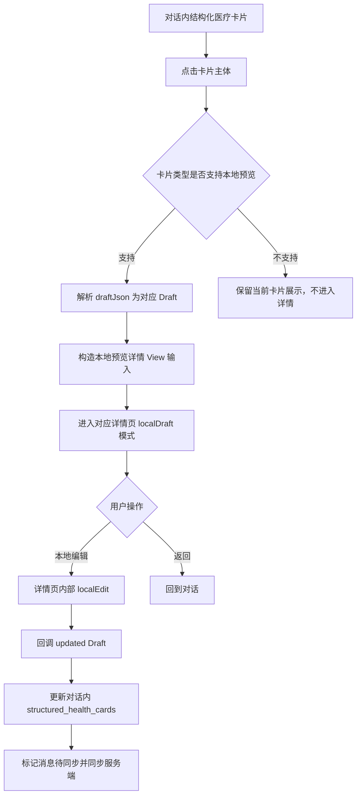
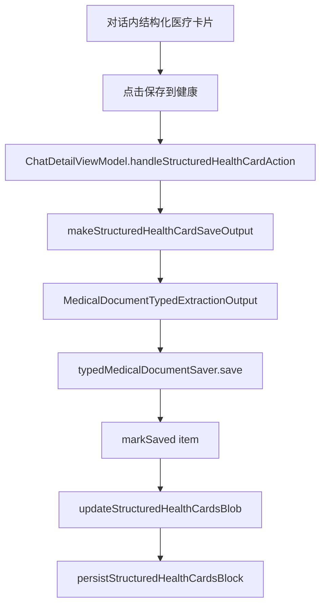

# CHAT-000019：结构化医疗卡片点击进入本地预览详情工单

> 创建日期：2026-08-12  
> 所属模块：Chat / 结构化医疗卡片 / 医疗档案本地草稿预览  
> 状态：新需求 / 待实现  
> 优先级：P1  
> 本工单范围：仅需求与技术方案，不实现代码  
> 关联入口：`SparkClient/Projects/Features/Chat/Presentation/ChatView/Components/ChatMessageBlock+Render.swift:135`  
> 关联卡片：`SparkClient/Projects/Features/Chat/Presentation/ChatView/MessageCards/ChatStructuredHealthCardsBlockView.swift:151`  

---

## 1. 一句话目标

对话消息内的结构化医疗卡片，除现有“保存到健康”按钮外，卡片主体点击应进入对应医疗资料详情页的“本地预览模式”。用户在详情页内使用已有本地编辑能力修改草稿后，不直接入库，而是回写对话消息内 `structured_health_cards` 数据，并通过现有消息同步链路同步服务端。

本工单明确：**详情页不新增保存按钮，保存到健康仍只在消息卡片内完成；病历 / 病例卡片第一期不支持点击进入详情页。**

---

## 2. 背景与现状

当前结构化医疗卡片的渲染入口在：

```swift
case .structuredHealthCards(let blob):
    ChatStructuredHealthCardsBlockView(
        blockID: id,
        blockStatus: status,
        blob: blob,
        memberContextStore: context.memberContextStore,
        isSavingIDs: context.savingStructuredHealthCardIDs,
        onAction: context.onStructuredHealthCardAction
    )
```

现状能力：

1. `ChatStructuredHealthCardsBlockView` 会按 `StructuredHealthCardsBlob` 渲染多类医疗卡片。
2. 每张卡片支持选择成员。
3. 每张未保存卡片支持点击“保存到健康”。
4. 保存成功后会将对应卡片标记为 `isSaved = true`。
5. 目前卡片主体没有进入详情预览的交互。

当前卡片行核心区域在：

```swift
private func medicalRow(
    title: String,
    subtitle: String?,
    item: ChatStructuredHealthCardItem,
    isSaving: Bool,
    onSetMember: @escaping (Int?) -> Void,
    action: @escaping () -> Void
) -> some View
```

这里目前只承载摘要、成员选择、保存按钮，没有 `onOpenPreview`。

---

## 3. 核心原则

### 3.1 保存入口不变

“保存到健康”仍只在消息卡片内触发：

```swift
onAction(.save(blockID: blockID, item: item))
```

详情页本地预览模式不新增“保存到健康”按钮，避免用户误以为进入详情后就是最终入库流程。

### 3.2 本地预览只改对话草稿

详情页内的本地编辑只更新消息内卡片的 `draftJson`、摘要字段和 `updated` 状态，不调用医疗档案保存接口。

### 3.3 尽量不改各个详情页

用药计划、家庭药箱、处方、检查报告已经具备 `localDraft / localEdit` 能力。第一期应通过外层 adapter 和路由注入回调复用现有详情页，不改动各个详情页内部实现。

### 3.4 病历第一期不支持

`medicalCase` 卡片第一期不进入详情页，继续保持当前卡片内保存能力。原因是 `MedicalCaseDetailPage` 当前主详情页只接了服务端编辑，虽然 `MedicalCaseFormView` 有 `localEdit` 表单能力，但详情入口尚未形成本地草稿预览闭环。

---

## 4. 支持范围

| 卡片类型 | 数据字段 | 详情页 | 本地预览 | 本地编辑 | 第一期点击进入详情 |
| --- | --- | --- | --- | --- | --- |
| 用药计划 | `blob.medicationPlans` | `MedicationPlanDetailPage` | 支持 | 支持 `.localDraft -> .localEdit` | 支持 |
| 家庭药箱 | `blob.medicineBoxes` | `MedicineBoxDetailPage` | 支持 | 支持 `.localDraft -> .localEdit` | 支持 |
| 处方 | `blob.prescriptions` | `MedicationPrescriptionDetailPage` | 支持 | 支持 `.localDraft -> .localEdit` | 支持 |
| 检查报告 | `blob.examReports` 内 `MedicalReportRecognitionDraft` | `ExaminationReportDetailPage` | 支持 | 支持 `.localDraft -> .localEdit` | 支持 |
| 体检报告 | `blob.examReports` 内 `HealthExamRecognitionDraft` | `HealthExamRecognitionResultView` | 部分支持 | 识别结果页支持，入库详情壳未完整接出 | 视 adapter 能力决定，第一期建议灰度 |
| 病历 / 病例 | `blob.medicalCases` | `MedicalCaseDetailPage` | 暂不支持 | 主详情页未接本地预览 | 不支持 |

第一期明确交付：

1. 用药计划卡片点击进入本地预览详情。
2. 家庭药箱卡片点击进入本地预览详情。
3. 处方卡片点击进入本地预览详情。
4. 检查报告卡片点击进入本地预览详情。
5. 病历卡片不进入详情页。
6. 体检报告如果不能在不改详情页的前提下复用现有可编辑识别结果页，则第一期不接入，保留卡片内保存。

---

## 5. 业务流程

### 5.1 未保存卡片点击预览



### 5.2 保存到健康流程保持不变



预览详情页不参与这条保存链路。

---

## 6. UI 与交互要求

### 6.1 卡片主体点击

卡片主体区域可点击进入本地预览详情：

```text
┌────────────────────────────────────┐
│ 药品名称 / 报告标题            成员 │  ← 点击主体进入详情预览
│ 剂量、规格、诊断、医院等摘要         │
│                                    │
│ [保存到健康]                       │  ← 仍然只做保存动作
└────────────────────────────────────┘
```

交互边界：

1. 点击成员选择区域：只打开成员选择，不进入详情。
2. 点击保存按钮：只保存到健康，不进入详情。
3. 点击已保存状态标签：不触发预览。
4. 点击卡片主体空白、标题、摘要：进入本地预览详情。

### 6.2 本地预览详情页

本地预览详情页使用各业务现有详情页的本地草稿模式：

1. 导航标题沿用业务详情页标题。
2. 右上角如果现有详情页已有编辑入口，则继续使用。
3. 编辑完成后回调更新本地 draft。
4. 不新增底部“保存到健康”按钮。
5. 不新增全局提交按钮。

### 6.3 不支持类型反馈

病历 / 病例卡片第一期不支持点击进入详情，不需要强提示。可选方案：

1. 卡片主体不加点击态。
2. 保持当前“保存到健康”能力。
3. 如果用户点击整卡，可轻提示“病历预览详情暂未开放”。

建议第一期采用“无点击态”，减少无效反馈。

---

## 7. 数据模型与回写要求

### 7.1 当前数据结构

`StructuredHealthCardsBlob` 内各类型卡片都带有 `draftJson`：

```swift
var medicationPlans: [MedicationChatCardPayload]
var medicineBoxes: [MedicineBoxChatCardPayload]
var prescriptions: [PrescriptionChatCardPayload]
var examReports: [ExamReportChatCardPayload]
var medicalCases: [MedicalCaseChatCardPayload]
```

`ChatStructuredHealthCardItem` 提供统一包装：

```swift
enum ChatStructuredHealthCardItem {
    case medicationPlan(MedicationChatCardPayload)
    case medicineBox(MedicineBoxChatCardPayload)
    case prescription(PrescriptionChatCardPayload)
    case examReport(ExamReportChatCardPayload)
    case medicalCase(MedicalCaseChatCardPayload)
}
```

### 7.2 本地编辑回写字段

本地编辑完成后，必须更新：

| 字段 | 说明 |
| --- | --- |
| `draftJson` | 用最新 Draft JSON 覆盖原卡片草稿 |
| 展示标题 | 如 `displayName` 或 `title` |
| 展示副标题 | 如 `specification`、`dosageLine`、`subtitle`、`hospital/dateText` |
| `memberId` | 如果详情页允许成员变更，需要同步 |
| `isSaved` | 不应因本地编辑改变，仍保持原状态 |
| block `revision` | 消息块版本递增 |
| block `updatedAt` | 更新为当前时间 |

本地编辑不应更新：

1. 不应设置 `isSaved = true`。
2. 不应调用医疗档案保存接口。
3. 不应创建真实医疗档案记录。
4. 不应改变其他卡片。

### 7.3 同步链路

回写对话消息后必须走现有 block 更新链路：

```swift
updateChatMessageBlocksUseCase.execute(
    clientMessageID: message.clientMessageID,
    blocks: updatedBlocks,
    markPendingForSync: true
)
```

目标是让本地草稿编辑在以下场景保持一致：

1. 返回对话后卡片摘要立即更新。
2. 重启 App 后仍能看到修改后的卡片。
3. 会话同步到服务端后，跨设备可恢复最新草稿。

---

## 8. 建议新增路由与上下文

### 8.1 打开预览上下文

建议新增轻量上下文，避免详情页直接依赖完整 Chat 模块：

```swift
struct ChatStructuredHealthCardPreviewContext: Equatable, Sendable {
    let threadID: UUID
    let messageClientID: UUID
    let blockID: UUID
    let itemID: UUID
    let item: ChatStructuredHealthCardItem
}
```

### 8.2 预览路由

如果 Chat 当前使用 route path，建议新增：

```swift
enum ChatRoute: Hashable {
    case structuredHealthCardPreview(ChatStructuredHealthCardPreviewContext)
}
```

如果当前页面局部使用 sheet，也可以先使用：

```swift
@State private var structuredHealthCardPreview: ChatStructuredHealthCardPreviewContext?
```

建议优先 push，而不是 sheet。详情预览属于内容浏览，push 更符合“从消息进入资料详情”的心理模型。

---

## 9. 文件改动范围

本工单不实现代码，以下是后续落地时的预计改动文件。

### 9.1 Chat 渲染与交互

| 文件 | 改动 |
| --- | --- |
| `ChatMessageBlock+Render.swift` | 给 `ChatStructuredHealthCardsBlockView` 注入打开预览回调 |
| `ChatStructuredHealthCardsBlockView.swift` | `medicalRow` 增加 `onOpenPreview`，卡片主体增加点击区域 |
| `ChatRenderContext.swift` | 增加 `onStructuredHealthCardOpenPreview` 回调 |
| `ChatMessageBubbleContentView.swift` | 透传新增回调 |
| `ChatConversationMessageRow.swift` | 会话行构造 context 时接入回调 |

### 9.2 Chat 状态与消息回写

| 文件 | 改动 |
| --- | --- |
| `ChatDetailViewModel.swift` | 增加本地预览草稿回写方法 |
| `ChatStructuredHealthCardsModels.swift` | 增加 `applyingLocalDraftUpdate` helper 或 builder |
| `ChatMessage.swift` | 如已有 block 替换能力则不改 |

### 9.3 本地预览 Adapter

建议新增一个 adapter 文件，集中处理 `draftJson` 解码、详情页输入构造和回写摘要生成：

```text
SparkClient/Projects/Features/Chat/Presentation/ChatView/MessageCards/
└── ChatStructuredHealthCardPreviewAdapter.swift
```

职责：

1. `ChatStructuredHealthCardItem -> 对应 Draft`
2. `Draft -> 本地详情页输入模型`
3. `Updated Draft -> Updated ChatStructuredHealthCardItem`
4. 失败时返回不可预览原因

### 9.4 详情页

第一期原则上不改详情页。只复用：

| 类型 | 复用页面 |
| --- | --- |
| 用药计划 | `MedicationPlanDetailPage(mode: .localDraft, ...)` |
| 家庭药箱 | `MedicineBoxDetailPage(mode: .localDraft, ...)` |
| 处方 | `MedicationPrescriptionDetailPage(mode: .localDraft, ...)` |
| 检查报告 | `ExaminationReportDetailPage(mode: .localDraft, ...)` |

---

## 10. 类型落地方案

### 10.1 用药计划

输入：

```swift
ChatStructuredHealthCardItem.medicationPlan(card)
```

处理：

1. 解码 `card.draftJson -> MedicationPlanRecognitionDraft`。
2. 构造 `RemoteMedicationPlan` 本地展示投影。
3. 打开 `MedicationPlanDetailPage(mode: .localDraft)`。
4. 用户编辑后回调 `onLocalDraftSaved(updatedDraft)`。
5. 用 `updatedDraft` 重新编码 `draftJson` 并更新 `displayName/specification/dosageLine`。

### 10.2 家庭药箱

输入：

```swift
ChatStructuredHealthCardItem.medicineBox(card)
```

处理：

1. 解码 `card.draftJson -> MedicineBoxRecognitionDraft`。
2. 构造 `RemoteMedicineBox` 本地展示投影。
3. 打开 `MedicineBoxDetailPage(mode: .localDraft)`。
4. 用户编辑后回调 `onLocalDraftSaved(updatedDraft)`。
5. 更新 `draftJson/displayName/specification`。

### 10.3 处方

输入：

```swift
ChatStructuredHealthCardItem.prescription(card)
```

处理：

1. 解码 `card.draftJson -> PrescriptionRecognitionDraft` 或 `[PrescriptionRecognitionDraft]`。
2. 构造 `RemotePrescription?` 和本地 `RemoteMedicationPlan` 投影。
3. 打开 `MedicationPrescriptionDetailPage(mode: .localDraft)`。
4. 用户编辑处方后回调 `onLocalDraftPrescriptionUpdated(updatedDraft)`。
5. 用户编辑处方内用药计划时同步更新处方 draft 内对应 medication。
6. 更新 `draftJson/title/subtitle`。

### 10.4 检查报告

输入：

```swift
ChatStructuredHealthCardItem.examReport(card)
```

当 `draftJson` 可解码为 `MedicalReportRecognitionDraft` 时：

1. 构造 `RemoteExaminationReportWithAttachments` 本地展示投影。
2. 打开 `ExaminationReportDetailPage(mode: .localDraft)`。
3. 用户编辑后回调 `onLocalDraftSaved(updatedDraft)`。
4. 更新 `draftJson/title/hospital/dateText`。

当 `draftJson` 可解码为 `HealthExamRecognitionDraft` 时：

1. 第一优先级：不改详情页的前提下，评估是否可直接复用 `HealthExamRecognitionResultView` 的 `.recognition` 模式。
2. 如果需要补 adapter 但不动详情页，可作为第一期灰度能力。
3. 如果需要改 `HealthExamReportDetailPage` 才能完成闭环，则第一期不接入，仍只保留卡片内保存。

### 10.5 病历 / 病例

输入：

```swift
ChatStructuredHealthCardItem.medicalCase(card)
```

第一期不支持点击进入详情页。

原因：

1. `MedicalCaseDetailPage` 当前以服务端 `RemoteMedicalCaseSummary` 为主。
2. 主详情页编辑走 `MedicalCaseFormView(mode: .serverEdit(...))`。
3. 虽然 `MedicalCaseFormView` 支持 `localEdit`，但详情页没有 `localDraft` 模式。
4. 不符合“尽量不改各个详情页面”的前提。

---

## 11. 关键代码示例

### 11.1 渲染入口注入

```swift
case .structuredHealthCards(let blob):
    ChatStructuredHealthCardsBlockView(
        blockID: id,
        blockStatus: status,
        blob: blob,
        memberContextStore: context.memberContextStore,
        isSavingIDs: context.savingStructuredHealthCardIDs,
        onOpenPreview: { item in
            context.onStructuredHealthCardOpenPreview(id, item, context.message)
        },
        onAction: context.onStructuredHealthCardAction
    )
```

### 11.2 卡片行点击

```swift
private func medicalRow(
    title: String,
    subtitle: String?,
    item: ChatStructuredHealthCardItem,
    isSaving: Bool,
    onOpenPreview: @escaping (ChatStructuredHealthCardItem) -> Void,
    onSetMember: @escaping (Int?) -> Void,
    action: @escaping () -> Void
) -> some View {
    VStack(alignment: .leading, spacing: 8) {
        Button {
            onOpenPreview(item)
        } label: {
            VStack(alignment: .leading, spacing: 8) {
                titleAndMemberRow
                subtitleText
            }
        }
        .buttonStyle(.plain)

        saveActionRow
    }
}
```

实际实现时需要避免成员菜单和保存按钮触发卡片主体点击。

### 11.3 本地草稿回写

```swift
func updateStructuredHealthCardDraft(
    threadID: UUID,
    message: ChatMessage,
    blockID: UUID,
    itemID: UUID,
    updatedItem: ChatStructuredHealthCardItem
) async {
    await updateStructuredHealthCardsBlob(
        threadID: threadID,
        message: message,
        blockID: blockID,
        item: updatedItem
    ) { blob in
        blob.replace(updatedItem)
    }
}
```

需要新增或复用 `replace` 能力：

```swift
extension StructuredHealthCardsBlob {
    mutating func replace(_ item: ChatStructuredHealthCardItem) {
        switch item {
        case .medicationPlan(let card):
            replaceByID(&medicationPlans, card)
        case .medicineBox(let card):
            replaceByID(&medicineBoxes, card)
        case .prescription(let card):
            replaceByID(&prescriptions, card)
        case .examReport(let card):
            replaceByID(&examReports, card)
        case .medicalCase:
            break
        }
    }
}
```

---

## 12. 验收标准

### 12.1 用药计划

- [ ] 点击用药计划卡片主体进入 `MedicationPlanDetailPage` 本地预览。
- [ ] 详情页不出现“保存到健康”按钮。
- [ ] 在详情页编辑后返回，对话卡片标题和摘要更新。
- [ ] 编辑后 `draftJson` 更新，`isSaved` 不变。
- [ ] 刷新会话后仍能看到修改后的草稿。

### 12.2 家庭药箱

- [ ] 点击家庭药箱卡片主体进入 `MedicineBoxDetailPage` 本地预览。
- [ ] 编辑药品名称、规格、剂型后，对话卡片同步更新。
- [ ] 不调用家庭药箱保存接口。

### 12.3 处方

- [ ] 点击处方卡片主体进入 `MedicationPrescriptionDetailPage` 本地预览。
- [ ] 编辑处方基础信息后，对话卡片标题和诊断摘要同步更新。
- [ ] 编辑处方内用药计划后，`draftJson` 内嵌用药同步更新。

### 12.4 检查报告

- [ ] 点击检查报告卡片主体进入 `ExaminationReportDetailPage` 本地预览。
- [ ] 编辑检查报告后，对话卡片标题、医院、日期同步更新。
- [ ] 不调用检查报告保存接口。

### 12.5 不支持类型

- [ ] 病历 / 病例卡片不进入详情页。
- [ ] 病历 / 病例卡片原有保存能力不受影响。
- [ ] 体检报告若第一期未接入，点击行为不影响保存按钮。

### 12.6 保存链路

- [ ] 点击“保存到健康”仍走原 `onStructuredHealthCardAction(.save)`。
- [ ] 本地预览编辑后再保存，保存使用最新 `draftJson`。
- [ ] 保存成功后卡片 `isSaved = true`。

---

## 13. 风险与注意事项

1. `draftJson` 是本地预览和保存的核心事实源，编辑后必须重新编码并写回。
2. 卡片展示字段不是自动从 `draftJson` 计算出来的，必须同步更新摘要字段。
3. 不能让详情页新增保存按钮，否则会出现两个保存入口，用户心智会混乱。
4. 本地编辑后必须走消息同步，否则跨端和重启会丢草稿。
5. 体检报告虽然识别结果页支持编辑，但详情入口当前是 `.detail` 模式，第一期需要谨慎接入。
6. 病历主详情页没有 `localDraft` 模式，第一期不支持是合理边界。

---

## 14. 推荐落地顺序

1. 新增 `ChatStructuredHealthCardPreviewContext` 与打开预览回调。
2. 新增 `ChatStructuredHealthCardPreviewAdapter`，先支持用药计划和家庭药箱。
3. 接入处方本地预览。
4. 接入检查报告本地预览。
5. 增加本地编辑后回写 `StructuredHealthCardsBlob` 的统一方法。
6. 验证编辑后卡片摘要、`draftJson`、消息同步三者一致。
7. 单独评估体检报告是否能不改详情页接入。
8. 病历 / 病例后续单独开工单处理。

---

## 15. 结论

本工单把结构化医疗卡片从“只能在消息里看摘要并保存”升级为“可点击进入详情页本地预览并编辑草稿”的体验。

第一期最关键的边界是：**详情页只负责预览和本地草稿编辑，真正保存到健康仍由消息卡片内按钮触发；病历先不支持进入详情页。**
