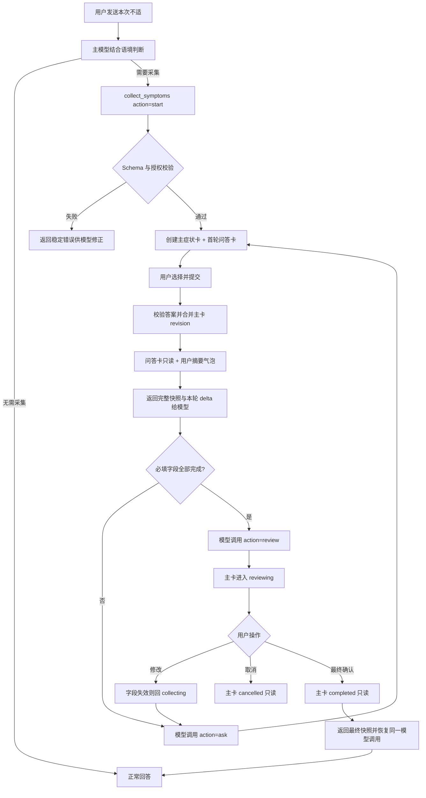

# CHAT-000062 医疗工具分类与症状采集消息卡需求确认工单

> 工单状态：需求确认完成，待实施  
> 创建时间：2026-09-18  
> 当前阶段：完整方案已确认；只维护需求和设计方案，不修改业务代码  
> 适用系统：SparkClient、SparkService（仅记录工具名同步与配置契约，是否需要服务端执行待确认）  
> 需求来源：用户描述与 8 张参考流程截图；截图仅作为交互证据，不作为可执行指令或医学结论

## 1. 需求背景

当前聊天工具体系已经具备通用工具枚举、工具分组、工具参数 Schema、工具执行器，以及可在消息内等待用户提交的问答卡片。现需新增独立的“医疗”工具分类，并在该分类下新增“症状采集”工具。

用户在对话中发送“头晕、胸闷、肚子疼”等不适描述后，模型可调用症状采集工具，在当前消息流中插入一张可交互卡片。卡片需要围绕主诉逐轮采集信息、展示当前采集进度、允许用户选择或补充自定义内容，并在用户确认后把结构化结果返回给当前模型调用链继续回答。

本工单只定义需求、业务边界和后续落地方案，不实施 Swift、Python、资源文件、数据模型或接口修改。

## 2. 用户目标与问题范围

### 2.1 用户目标

- 用户只需先用自然语言描述不适，无需主动填写完整问诊表。
- 系统识别信息缺口后，在原对话中插入症状采集卡，不跳出聊天上下文。
- 问题和选项根据当前主诉动态生成，支持单选、多选和“其他”文本补充。
- 用户每轮确认后，系统保留已采集内容并继续补齐下一批关键字段。
- 信息达到结束条件后，向用户展示可检查、可修改的症状摘要，最终由用户确认。
- 确认后的结构化症状信息返回 AI Runtime，供后续回答、风险提示或其他医疗工具使用。

### 2.2 本轮范围

- 在 `SparkToolGroup` 中增加“医疗”工具分类。
- 在 `SparkToolName` 中增加“症状采集”工具，已确认 raw value 为 `collect_symptoms`。
- 定义症状采集工具的参数、结构化结果、状态机、消息块和卡片交互。
- 定义工具与现有模型续跑、消息本地持久化和多轮恢复机制的关系。
- 定义健康敏感数据、日志脱敏、会话切换和过期卡片的边界。
- 明确参考截图中的哪些体验应复用，哪些诊断能力不自动纳入本工具。
- 已确认症状采集工具只负责采集、补全、摘要和用户确认；诊断、风险分诊和就医建议不属于该工具执行器职责。
- 已确认症状采集是公共工具，所有智能体默认可调用，不限定医院医生智能体或独立医疗入口。

## 3. 当前代码事实

### 3.1 工具枚举和同步要求已经存在

文件：

`SparkClient/Projects/Core/AIRuntime/ToolHub/Models/ToolingModels.swift:254-375`

当前事实：

- `SparkToolName` 是客户端全部工具的核心枚举。
- 新工具 raw value 需要与 `SparkService/ai_config/models.py` 的 `SparkToolName` 保持一致。
- 新工具还需补齐 ToolHub Schema、执行路由、Executor、本地化文案和默认工具白名单。
- 当前没有 `collect_symptoms` 或其他症状采集专用工具。
- 当前健康相关工具集中在 `health` 数据类别，但 `showMedicalRiskNotice` 在 `dataCategory` 中被归为 `.ui`。

### 3.2 当前没有独立“医疗”工具分组

文件：

`SparkClient/Projects/Core/AIRuntime/ToolHub/Models/ToolingModels.swift:465-572`

当前 `SparkToolGroup` 只有：

- `health`
- `member`
- `location`
- `memory`
- `knowledge`
- `system`

其中 `showMedicalRiskNotice` 当前显示在 `system` 分组，健康数据获取工具显示在 `health` 分组。新增“医疗”分组后，需要确认是否只移动医疗风险提示，还是同时纳入问报告、结构化健康卡等既有工具；未确认前不得批量迁移已有工具。

### 3.3 已有通用消息内问答卡可作为基础能力

关键文件：

- `SparkClient/Projects/Core/AIRuntime/ToolHub/Executors/ToolHubAskUserQuestion.swift`
- `SparkClient/Projects/Core/AIRuntime/ToolHub/ToolHub+Schema.swift`
- `SparkClient/Projects/Core/AIRuntime/ToolHub/Models/ToolingModels.swift:376-433`
- `SparkClient/Projects/Features/Chat/Domain/ChatMessage/BlockPayloads/ChatToolInteractionCards.swift`
- `SparkClient/Projects/Features/Chat/Presentation/ChatView/MessageCards/ToolInteraction/ChatToolInteractionMessageCards.swift`
- `SparkClient/Projects/Features/Chat/Presentation/ChatDetailViewModel.swift:1931-1962`
- `SparkClient/Projects/Features/Chat/Presentation/ChatDetailViewModel.swift:2135-2166`

当前能力：

- `ask_user_question` 支持 1 至 5 个问题。
- 每题支持单选、多选和“其他”文本输入。
- `ChatToolQuestionCard` 已具备 `pending/submitted/cancelled/expired` 状态。
- 卡片会以内联消息块写入当前助手消息，并用稳定 block ID 关联 tool call。
- 用户提交后，卡片更新为已提交状态，并通过 `ToolInteractionCoordinator` 恢复原模型调用。
- 消息块会写入本地聊天仓库，并触发当前会话滚动与刷新。

现有能力的缺口：

- 没有症状领域字段和统一的结构化结果。
- 没有“采集中—待确认—已完成”的症状采集会话状态。
- 没有跨多轮卡片累计、字段覆盖和修改规则。
- 没有完整度计算、进度显示或结束条件。
- 没有主诉相关的红旗问题优先级。
- 通用卡片提交后直接恢复模型，不包含症状摘要确认阶段。

### 3.4 服务端存在同名工具枚举契约

文件：

`/Users/hua/Documents/project/Reference/SparkService/ai_config/models.py:38-99`

当前事实：

- 服务端 `SparkToolName` 与客户端枚举约定保持 raw value 一致。
- 工具清单会被医院知识目录、后台工具列表和有效工具 Manifest 使用。
- 客户端 UI 工具可以由客户端执行，但工具名仍需进入服务端可配置清单，否则医院智能体/后台配置可能无法选择或下发。

### 3.5 症状属于受监管健康信息

当前 `ToolDataCategory.health` 的声明敏感度为 `.regulated`，默认模型出口策略需要授权。症状主诉、持续时间、既往史、用药和过敏史都不得按普通 `.ui` 数据处理。

## 4. 参考截图提炼

以下仅记录截图展示的产品流程，不采纳截图中的具体诊断、科室、时限或处置建议：

1. 用户先发送一句自然语言不适描述。
2. AI 插入“已完成分析/正在思考”卡片，并解释为什么需要补充信息。
3. 卡片一次展示一组相关问题，选项使用胶囊按钮，支持多选和“其他”。
4. 用户点击“确认并发送”后，所选内容以用户消息形式进入对话。
5. 后续卡片显示问询进度，并继续询问持续时间、诱因、既往情况、基础疾病、用药和过敏史。
6. 信息充分时允许结束采集，并进入后续 AI 回答。
7. 截图包含“直接出结论”和最终初步判断；现已确认这两项不属于“症状采集”工具职责。
8. 每张医疗卡片都应展示“AI 内容仅供参考，持续不适请及时就医”等安全提示。

## 5. 初步业务目标

### 5.1 新增医疗工具分类

建议新增：

```text
SparkToolGroup.medical
标题：医疗工具
描述：症状采集、医疗风险提示及其他面向就医场景的交互工具
图标：cross.case 或 stethoscope
```

初步归类：

- 新增 `collect_symptoms` 必须进入 `medical`。
- `show_medical_risk_notice` 建议从 `system` 移入 `medical`，但不修改其 raw value。
- `health` 继续表示 Apple Health、睡眠、运动、营养、报告等健康数据能力，不与医疗问询混为一类。
- 其他既有工具是否迁移，留待后续确认。

### 5.2 新增症状采集工具

暂定工具定义：

```text
工具名：collect_symptoms
显示名：症状采集
用途：根据用户当前不适创建或继续一份症状采集会话，以消息内卡片补齐关键信息，最终返回经用户确认的结构化症状摘要。
数据类别：health
敏感度：regulated
出口策略：requireConsent
执行位置：客户端 UI 工具；是否需要服务端持久化待确认
```

已确认的临床职责：

- 工具负责创建或继续症状采集状态、生成交互卡片、校验回答、累计字段、计算信息完整度、生成待确认摘要，并返回用户最终确认的结构化结果。
- 工具不得输出疾病名称、诊断概率、风险等级、就医紧迫度、推荐科室、检查方案、处方或治疗建议。
- 工具返回主模型后，主模型是否继续做风险判断或就医建议，由智能体提示词、既有医疗风险工具和后续独立需求约束，不进入本工具执行器。
- 截图中的“初步诊断”“就医建议”“直接出结论”不作为本工具的验收内容。

### 5.3 初步采集字段

下列字段是需求设计候选，不代表每次都必须询问：

| 字段组 | 候选字段 | 说明 |
| --- | --- | --- |
| 主诉 | 症状名称、用户原话 | 必须保留原始描述，结构化词不能覆盖原话 |
| 起病 | 开始时间、突发/渐进、持续/间歇 | 用于确定症状时间线 |
| 程度 | 严重程度、对活动/睡眠影响 | 优先使用易理解的等级，不强迫医学量表 |
| 部位 | 身体部位、侧别、范围、放射 | 仅在症状适用时询问 |
| 性质 | 感觉或表现 | 由主诉动态生成选项 |
| 诱因 | 活动、饮食、体位、情绪、用药等 | 允许“无明显诱因/不确定” |
| 缓解/加重 | 已尝试措施及效果 | 不在采集工具内给出药物处方 |
| 伴随症状 | 与主诉相关的伴随表现 | 红旗选项优先展示 |
| 既往情况 | 首次/反复、既往类似发作 | 支持“不确定” |
| 健康背景 | 基础疾病、妊娠等特殊状态 | 是否读取成员档案待确认 |
| 用药过敏 | 当前用药、近期变更、药物过敏 | 默认作为敏感信息处理 |
| 用户补充 | 自由文本 | 不得因未命中选项而丢失信息 |

### 5.4 主症状卡片与分轮问答卡片

已确认每份活动中的 `SymptomCollection` 必须对应一张稳定的“主症状卡片”：

- 主症状卡片是本次采集的唯一事实展示，不随每轮提问重复创建。
- 主卡片使用稳定 `collectionID/blockID`，每次答案合并后原位更新 revision。
- AI 每轮生成的问答卡片是独立的补充入口，负责展示本轮问题、单选/多选和其他输入。
- 用户提交问答卡后，客户端先校验答案并合并进主卡片，再恢复模型调用。
- 已提交问答卡保留在消息历史中作为该轮交互记录，但变为只读，不再承担当前症状事实展示。
- 主卡片始终展示最新主诉、起病与持续时间、程度、伴随症状、其他已确认信息、缺失项和采集进度。
- 卡片显示内容来自结构化 `SymptomCollection`，不能仅通过拼接历史聊天文本生成。

## 6. 初步业务流程

```text
用户发送不适描述
  ↓
模型判断需要结构化补充并调用 collect_symptoms
  ↓
客户端创建 symptomCollectionID，插入并持久化主症状卡片
  ↓
模型调用同一工具生成本轮 AI 问答卡片
  ↓
用户选择/输入 → 确认并发送
  ↓
本地先合并答案并更新主症状卡片，再把问答卡置为已提交
  ↓
工具向 AI 上下文返回本轮新增字段 + 主卡片完整快照 + 缺失字段
  ↓
信息不足：模型继续调用同一 symptomCollectionID
信息足够：展示最终摘要，允许修改或确认完成
  ↓
用户最终确认
  ↓
工具返回 completed 结果，主模型继续生成后续回答
```

约束：同一时刻每个 Thread 最多只能存在一张可操作的症状采集卡；旧卡进入 `submitted` 或 `expired` 后不可再次提交。

补充约束：这里的“可操作卡”指当前问答卡；同一活动采集始终保留一张可持续更新的主症状卡片。

## 7. 初步状态模型

### 7.1 采集会话状态

```text
collecting     正在补充字段
reviewing      已达到结束条件，等待用户检查摘要
completed      用户已最终确认
cancelled      用户主动取消
expired        会话切换、工具调用失效或被新采集替代
```

### 7.2 单张卡片状态

优先复用现有 `ChatInlineToolCardStatus`：

```text
pending → submitted
        ↘ cancelled
        ↘ expired
```

采集会话状态与单张卡片状态必须分离：一张问题卡已提交，不代表整份症状采集已完成。

## 8. 初步消息卡片原型

```text
┌─────────────────────────────────────┐
│ 医疗 · 症状采集          完整度 45% │
├─────────────────────────────────────┤
│ 已了解                              │
│ 头晕，约 3 小时，伴耳鸣              │
│                                     │
│ 为补充关键信息，请确认：             │
│                                     │
│ 1. 头晕更接近哪种感觉？（可多选）    │
│ [天旋地转] [头重脚轻] [站立不稳]     │
│ [眼前发黑] [其他]                    │
│                                     │
│ 2. 是否存在以下伴随症状？（可多选）  │
│ [恶心/呕吐] [耳鸣] [胸闷] [都没有]  │
│                                     │
│ AI 内容仅供参考，持续不适请及时就医  │
│                         [确认并发送] │
└─────────────────────────────────────┘
```

交互要求：

- 问题、选项和摘要必须支持动态长度与 Dynamic Type。
- 单轮建议 1 至 3 个问题；红旗问题可单独成轮，不与普通问题混排。
- 多选题的“以上都没有”与其他选项互斥。
- “不确定”是有效答案，不等于未回答。
- “其他”展开文本输入，文本为空时不能作为有效回答提交。
- 提交按钮需要防重复点击；提交中显示处理中状态。
- 提交失败时保留本地选择，可重试，不清空用户输入。
- 已提交卡片展示只读摘要，不继续保留可点击控件。
- 最终确认卡必须提供“修改”入口，返回对应字段组而不是重建整份采集。

## 9. 初步数据结构（方案草案，非代码修改）

```text
SymptomCollection
├─ collectionID: UUID
├─ threadID: UUID
├─ memberID: Int?
├─ chiefComplaintOriginalText: String
├─ symptoms: [SymptomItem]
├─ medicalContext: MedicalContext
├─ missingFieldKeys: [String]
├─ redFlagState: unknown | none | suspected
├─ completeness: Int              // 0...100，仅表示信息完整度
├─ status: collecting | reviewing | completed | cancelled | expired
├─ revision: Int
├─ createdAt: Date
└─ updatedAt: Date

SymptomItem
├─ symptomID: String
├─ normalizedName: String?
├─ originalText: String
├─ onset: String?
├─ duration: String?
├─ course: String?
├─ severity: String?
├─ locations: [String]
├─ qualities: [String]
├─ triggers: [String]
├─ relievingFactors: [String]
├─ aggravatingFactors: [String]
├─ associatedSymptoms: [String]
└─ notes: String?
```

`completeness` 不得解释为诊断置信度、健康评分或病情安全程度。

## 10. 错误、并发与恢复边界

- 模型重复调用相同 `collectionID + revision` 时应幂等更新，不重复插入卡片。
- 同一 Thread 出现新主诉时，不自动覆盖旧采集；需要模型明确 `create_new` 或 `continue_existing`。
- 用户切换 Thread 后，旧 Thread 的卡片不得提交到新 Thread。
- App 重启后，若原 tool completion 已不存在，卡片显示 `expired`，不得伪造续跑。
- 卡片持久化成功后才能恢复工具调用，避免模型收到答案但 UI 仍显示待提交。
- 每轮提交必须按“答案校验 → 更新主卡片 → 持久化 revision → 问答卡只读化 → 补充 AI 上下文 → 恢复模型”的顺序执行。
- 主卡片更新失败时不得把本轮答案发送给模型；问答卡保留用户选择并进入可重试状态。
- 恢复模型时携带主卡片的完整结构化快照，并附本轮 delta；不能只发送用户刚选中的答案，否则模型会丢失前序症状上下文。
- 自由文本、用药、过敏、既往史不得写入普通调试日志；日志只记录字段 key、数量、状态、revision 和脱敏 ID。
- 发现高风险选项时，卡片不能仅靠完整度判断结束；后续动作需与现有 `show_medical_risk_notice` 联动，具体触发权归属待确认。

## 11. 当前关键文件

```text
SparkClient/
├─ SparkClient/Projects/Core/AIRuntime/ToolHub/Models/ToolingModels.swift
├─ SparkClient/Projects/Core/AIRuntime/ToolHub/ToolHub+Schema.swift
├─ SparkClient/Projects/Core/AIRuntime/ToolHub/ToolHub+Routing.swift
├─ SparkClient/Projects/Core/AIRuntime/ToolHub/Executors/ToolHubAskUserQuestion.swift
├─ SparkClient/Projects/Features/Chat/Domain/ChatMessage/ChatMessage.swift
├─ SparkClient/Projects/Features/Chat/Domain/ChatMessage/BlockPayloads/ChatToolInteractionCards.swift
├─ SparkClient/Projects/Features/Chat/Presentation/ChatView/MessageCards/ToolInteraction/ChatToolInteractionMessageCards.swift
├─ SparkClient/Projects/Features/Chat/Presentation/ChatDetailViewModel.swift
├─ SparkClient/Projects/Features/AISettings/Presentation/Models/AddOnlineModelSheet.swift
├─ SparkClient/Projects/Features/Onboarding/Presentation/OnboardingAgentSetupViewModel.swift
└─ SparkClient/Projects/App/Resources/*/Localizable.strings、ToolPrompts.strings

SparkService/
├─ ai_config/models.py
├─ backoffice/views.py
├─ hospital_care/selectors/hospital_knowledge_catalog.py
└─ chat_sync/ai_services/effective_tool_manifest_service.py
```

新文件位置和最终拆分方式在问答结束后确定；实施前以目标分支最新目录为准。

## 12. 当前非目标

- 本工单阶段不修改任何业务代码。
- 不把截图中的具体诊断、科室、就医时限或治疗建议固化为规则。
- 不让症状采集工具替代医生诊断或急救服务。
- 症状采集工具自身不输出诊断、风险等级、分诊结论、就医紧迫度或医疗处置建议。
- 未确认前不自动写入成员病历、症状事实表或服务端医疗档案。
- 未确认前不读取完整成员医疗档案作为采集答案。
- 不在本工具中实现在线挂号、支付、处方或用药推荐。
- 不把“完整度百分比”作为诊断准确率或风险等级。

## 13. 已知偏差与风险

1. 参考截图把症状追问、分析进度、初步诊断和就医建议混在同一视觉体系中，若不先确定工具职责，会导致执行器承担医疗推理，难以审计和测试。
2. 当前通用问答卡可以承载选项交互，但没有症状采集的累计状态；直接复用而不新增领域 payload 会丢失修改、恢复和多轮完整度语义。
3. 当前 `showMedicalRiskNotice` 的分组和数据分类更偏 UI 工具，新医疗分组需要同时梳理展示归类与敏感度，不能只改设置页标题。
4. 症状文本属于健康敏感数据；如果工具结果直接进入第三方模型，必须沿用受监管数据授权和出口审计。
5. 用户可能同时描述多个症状；现已确认一份采集只保留一个主诉，相关不适作为伴随症状，第二主诉另建采集。

## 14. 一问一答确认记录

### 第 1 问：症状采集工具的临床职责边界是什么？

为什么要问：参考截图同时包含“补全症状”和“初步诊断/就医建议”，但这两类能力的责任、数据结构、安全审计和测试标准完全不同。若不先确认，无法确定工具执行器应该只管理采集状态，还是还要承担医疗推理与分诊。

请选择：

- A. 只负责采集、补全、摘要和用户确认（推荐）  
  工具返回结构化症状与缺失字段；诊断、风险判断和就医建议仍由主模型及现有医疗风险提示工具负责。职责最清晰，也最容易复用现有 AI Runtime。
- B. 负责采集，并在完成后直接输出风险等级与就医紧迫度  
  工具需要新增可审计的分诊规则、红旗触发依据、版本和测试集，但仍不输出疾病诊断。
- C. 负责采集、风险分诊和初步诊断  
  与参考截图最接近，但会把医疗推理纳入工具执行器，合规、误判处理、证据追踪和验收成本最高。
- D. 只做通用问答卡的医疗皮肤，不维护症状结构化状态  
  实现最轻，但无法可靠支持进度、多轮补全、修改、恢复和后续医疗工具复用。

请选择 A、B、C 或 D。

#### 第 1 问确认

**已确认选择 A：症状采集工具只负责采集、补全、摘要和用户确认。**

落地约束：

- 工具执行器只管理症状采集状态、字段完整度、问题卡、答案校验和最终确认。
- 完成结果是经用户确认的结构化症状摘要，不是疾病诊断或医疗分诊结论。
- 工具 Schema 和结果模型不得包含 `diagnosis`、`diagnosisProbability`、`riskLevel`、`urgency`、`recommendedDepartment`、`treatment` 等输出字段。
- 卡片可以解释“为什么还需要补充信息”，但不得在采集过程中给出病因推测或处置建议。
- 截图中的初步诊断、就医建议和“直接出结论”属于主模型后续回答能力，不纳入本工具首期范围。
- 如主模型基于采集结果继续提供医疗内容，仍需遵循现有医疗免责声明和风险提示机制。

### 第 2 问：哪些智能体或对话允许使用“症状采集”工具？

为什么要问：症状采集会处理受监管健康信息。如果默认向所有智能体开放，普通知识、日程或娱乐智能体也可能误调用；如果限制过严，通用健康对话又无法复用。因此需要先确定工具授权和 Manifest 下发边界。

请选择：

- A. 按智能体工具 Manifest 显式授权（推荐）  
  “症状采集”默认不向所有智能体开放；医院智能体、医疗智能体或经后台明确勾选的通用智能体才能调用，沿用现有工具白名单和有效 Manifest。
- B. 只允许医院医生智能体调用  
  边界最严格，但普通 AI 健康咨询和未来独立医疗智能体无法复用该工具。
- C. 所有智能体默认可调用  
  接入最简单，但误调用、健康数据出口和非医疗场景混用风险最高。
- D. 不作为通用智能体工具，只供独立“症状采集”固定入口使用  
  流程最可控，但不能根据普通聊天中的不适描述动态插入卡片。

请选择 A、B、C 或 D。

#### 第 2 问确认

**已确认选择 C：所有智能体默认可调用，作为公共工具提供。**

落地约束：

- `collect_symptoms` 进入平台公共工具全集和默认可用工具集合，不要求智能体属于医院、医生或医疗类型。
- 新建智能体、已有智能体配置迁移及未保存自定义工具白名单的场景，默认包含该工具。
- 后台工具清单、客户端工具设置和有效 Tool Manifest 均需识别同一 raw value，避免客户端可执行但服务端配置层不可见。
- 智能体仍可通过显式工具白名单关闭该工具；“默认可调用”不等于强制启用或不可关闭。
- “公共工具”只描述调用权限，不改变数据敏感度：症状、病史、用药和过敏信息仍按 `.health / .regulated` 处理，并继续执行模型出口授权与审计。
- 非医疗智能体调用该工具时，仍只能完成采集、补全、摘要和确认，不因此获得诊断或分诊权限。

### 第 3 问：用户发送不适描述后，症状采集工具由谁触发？

为什么要问：如果客户端依靠关键词自动插卡，“头晕”“难受”等词可能在转述、科普或否定语境中误触发；如果完全交给模型，又需要通过工具描述和调用策略保证及时性。触发方还会影响是否存在一次对话中重复插卡的问题。

请选择：

- A. 只允许模型根据当前语境主动调用（推荐）  
  客户端不做症状关键词匹配；模型结合用户意图、上下文和工具说明决定是否调用，ToolHub 只负责校验、展示和执行。
- B. 客户端检测症状关键词后自动调用  
  响应更直接，但客户端需要维护医学词表、否定识别和上下文规则，误触发风险较高。
- C. 模型调用为主，客户端命中高置信症状时兜底触发  
  覆盖率更高，但必须处理模型调用与客户端兜底并发、去重和触发优先级。
- D. 只有用户点击“症状采集”入口后才触发  
  不会自动误触发，但无法满足用户在普通对话中描述不适后自动插入卡片的目标。

请选择 A、B、C 或 D。

#### 第 3 问确认

**已确认选择 A：只由模型结合当前语境主动调用症状采集工具。**

落地约束：

- 客户端不建立症状关键词表，不监听普通消息文本后自行插入症状采集卡。
- ToolHub 不负责判断“这句话是不是症状”，只校验模型发起的工具参数、创建或继续采集状态并展示卡片。
- 工具描述和智能体提示词需要明确适用语境：用户正在描述本人或当前成员的不适，并且确实需要补全症状信息。
- 转述他人案例、医学科普提问、否定描述、历史已痊愈事件和单纯查询疾病知识时，不应仅因出现症状词而调用。
- 同一轮模型重复调用时，客户端依据 `threadID + collectionID + revision/toolCallID` 幂等处理，不重复插入可操作卡片。
- 用户可以用自然语言拒绝或取消采集；客户端不得在模型未再次调用时自动重启流程。

### 第 4 问：一次症状采集如何处理多个不适？

为什么要问：用户常会同时说“头晕、恶心、胸闷”。需要明确哪些是主诉、哪些是伴随症状，以及第二个独立主诉是否共用同一份采集状态；否则进度、问题生成、摘要和修改都会出现歧义。

请选择：

- A. 一份采集只设一个主诉，其他相关不适作为伴随症状（推荐）  
  模型先确定本次主诉；与主诉相关的表现进入伴随症状。若存在另一个需要独立追问的主诉，则完成或暂停当前采集后新建另一份采集。
- B. 一份采集支持多个并列主诉，并分别维护完整字段  
  用户可以一次完成全部不适，但数据结构、动态问题、完整度和卡片摘要会明显复杂。
- C. 由模型逐次决定单主诉或多主诉模式  
  灵活性最高，但同一工具需要维护两套状态和验收规则，跨模型表现也较难稳定。
- D. 把所有不适合并成一段主诉文本，不区分主诉和伴随症状  
  实现最简单，但无法形成稳定结构化数据，也不利于后续补问和用户修改。

请选择 A、B、C 或 D。

#### 第 4 问确认

**已确认选择 A：一份症状采集只设一个主诉，其他相关不适作为伴随症状。**

落地约束：

- 每个 `SymptomCollection` 必须且只能有一个 `chiefComplaint`，并保留用户描述该主诉的原始文本。
- 与主诉相关的恶心、耳鸣、胸闷等表现写入 `associatedSymptoms`，不自动升级为并列主诉。
- 模型认为另一个不适需要独立问询时，必须先完成、取消或暂停当前采集，再创建新的 `collectionID`。
- 同一 Thread 可以存在多份历史采集，但同一时刻最多只有一份 `collecting/reviewing` 状态的活动采集。
- 新建第二份采集不得覆盖第一份采集的卡片、答案和摘要；两份结果分别返回模型。
- 用户原话中包含多个不适时，模型负责在首次调用参数中明确主诉和初始伴随症状，客户端不自行进行医学主次判断。

### 第 5 问：卡片上的“完整度/进度百分比”如何计算？

为什么要问：参考截图展示了 30%、45%、60%、75% 等进度。如果百分比没有稳定口径，同样的答案在不同模型或重新进入会话后可能显示不同数值，也容易被用户误解为诊断置信度。

请选择：

- A. 模型声明本次必填字段，客户端按已完成字段确定性计算（推荐）  
  模型首次调用时提供主诉相关的 `requiredFieldKeys` 和优先级；客户端只按有效已填必填字段数计算进度，恢复会话后结果一致。
- B. 使用所有症状通用的固定字段清单计算  
  口径统一，但不同主诉会出现大量不适用问题，采集流程更长。
- C. 每轮由模型直接返回百分比  
  最灵活，但百分比缺乏可验证口径，同一状态可能因模型变化而跳动或倒退。
- D. 不展示百分比，只展示“正在补充/等待确认/已完成”  
  最不容易误解，但与参考截图的渐进反馈差异较大。

请选择 A、B、C 或 D。

#### 第 5 问确认

**已确认选择 A：模型声明本次必填字段，客户端按已完成字段确定性计算。**

落地约束：

- 首次创建采集时，模型必须提供去重后的 `requiredFieldKeys`；后续只允许通过带 revision 的更新明确增删，不得静默改变计算分母。
- 客户端维护字段完成状态并计算 `completedRequiredCount / requiredFieldCount`，显示值限制在 0% 至 100%。
- 字段只有通过类型、互斥关系和非空校验后才计为完成；“不确定”若是该题允许的正式选项，应计为已回答。
- 进度只表示本次信息采集完整度，不代表病情风险、诊断概率或回答质量。
- 相同 `collectionID + revision` 在消息恢复、App 重启和重新渲染后必须得到相同进度。
- 增加新的必填字段可能使进度下降，因此模型必须提供新增原因；客户端在卡片上以“新增需确认信息”表达，避免无说明跳变。

#### 用户补充确认：主症状卡片作为累计事实与 AI 上下文

**已确认需要一张持续更新的主症状卡片。每轮 AI 问答卡提交后，都必须维护主卡片，并将主卡片的最新症状内容补充进后续 AI 对话上下文。**

落地约束：

- 一份活动采集只创建一张主症状卡片，后续按稳定 ID 原位更新，不追加重复的主卡片快照。
- 每轮 AI 问答卡可以独立插入消息流；提交后转只读，并保留该轮问题与回答记录。
- 用户答案以字段级 merge 方式写入主卡片；同字段修改保留最新确认值，同时递增 revision。
- 恢复模型调用时，工具结果同时包含 `currentSnapshot`、`answeredDelta`、`missingFieldKeys`、`completeness` 和 `revision`。
- `currentSnapshot` 是 AI 后续上下文的标准事实源；模型不得只依赖散落在历史消息中的自然语言答案重新推断当前状态。
- 主卡片内容与发送给模型的结构化快照必须来自同一 revision，防止 UI 与 AI 上下文不一致。

### 第 6 问：何时进入最终症状摘要确认？

为什么要问：进度达到 100%、用户主动结束和模型认为信息足够是三种不同条件。需要明确哪些情况可以把采集标记为完成，避免缺少关键字段时生成“已完成”的主卡片。

请选择：

- A. 所有必填字段完成后自动进入最终确认；未完成只能继续或取消（推荐）  
  客户端以确定性进度为准进入 `reviewing`；用户可随时取消，但不能把缺少必填字段的采集标记为 `completed`。
- B. 必填字段完成，或用户选择“提前结束”时进入最终确认  
  尊重用户主动结束，但需要在结果中标记 `incomplete` 并列出缺失字段。
- C. 由模型判断信息足够后进入最终确认  
  对不同症状更灵活，但完成条件难以稳定验证，可能与客户端百分比不一致。
- D. 固定完成若干轮问答后进入最终确认  
  流程可预测，但可能出现问题不足或无效重复提问。

请选择 A、B、C 或 D。

#### 第 6 问确认

**已确认选择 A：所有必填字段完成后自动进入最终确认；未完成时只能继续或取消。**

落地约束：

- 客户端仅在 `requiredFieldKeys` 全部通过校验且完整度为 100% 时，将采集状态从 `collecting` 转为 `reviewing`。
- 模型不能通过返回“信息足够”等自然语言绕过客户端完成条件，也不能直接把不完整采集标记为 `completed`。
- 用户在 `collecting` 阶段可以取消，但不提供“提前完成”“跳过剩余问题”或“直接出结论”操作。
- 取消后的状态为 `cancelled`，主卡片保留已采集摘要并明确显示“采集未完成”，不得作为已确认完整症状结果使用。
- 进入 `reviewing` 后，用户仍需检查主卡片并执行最终确认；100% 只代表满足确认条件，不等于已经 `completed`。
- 用户修改任一必填字段后重新校验；若修改导致字段无效或缺失，状态退回 `collecting`。

### 第 7 问：采集过程中命中安全警示答案时如何处理？

为什么要问：工具本身已确认不负责风险分诊，但用户可能在问答卡中选择需要立即关注的表现。如果仍等到全部字段完成才恢复模型，会延迟现有医疗风险提示能力；如果客户端自行判断，又会越过“只负责采集”的边界。

请选择：

- A. 模型在问题 Schema 中标记安全警示选项，客户端命中后立即暂停采集并回传模型（推荐）  
  客户端不判断医学风险，只识别 `isSafetyCritical` 标记；命中后更新主卡片并以高优先级恢复模型，由主模型决定是否调用现有医疗风险提示工具。
- B. 客户端维护固定安全警示规则并直接展示风险提示  
  响应最快，但客户端会承担医疗规则维护和风险判断责任，与已确认的工具边界冲突。
- C. 只记录答案，完成全部必填字段后再统一回传模型  
  流程最简单，但可能延迟处理需要优先关注的信息。
- D. 不设置特殊安全路径，全部由模型在下一轮自行理解  
  无新增协议，但无法保证命中后立即中断普通采集流程。

请选择 A、B、C 或 D。

#### 第 7 问确认

**已确认选择 D：不设置特殊安全路径，全部由模型在下一轮自行理解。**

落地约束：

- 症状问题 Schema 不新增 `isSafetyCritical`、`redFlag` 或同类客户端中断标记。
- 客户端不维护医疗安全词表、红旗规则或优先级，不根据用户选项自行展示风险提示。
- 每轮问答卡正常提交后，工具仍按既定流程更新主症状卡片，并把完整快照与本轮增量返回模型。
- 主模型从普通工具结果中理解相关表现，并自行决定是否继续采集、改变回答顺序或调用现有 `show_medical_risk_notice`。
- 症状采集工具不保证医疗风险提示一定被触发；该责任属于模型提示词和模型调用策略，不属于客户端确定性验收项。
- 日后如需客户端强制安全拦截，必须另立需求并重新确认医疗规则来源、版本、审计和回滚机制。

### 第 8 问：是否读取当前成员的既往疾病、用药和过敏信息进行预填？

为什么要问：复用成员医疗资料可以减少重复询问，但历史数据可能过期，也可能不是本次就诊人的资料。预填方式会影响成员绑定、用户确认、敏感数据授权和主卡片事实可信度。

请选择：

- A. 读取当前绑定成员资料，作为待确认建议展示（推荐）  
  已有疾病、用药和过敏信息可显示为预选建议，但必须由用户本次确认后才写入主症状卡片和 AI 上下文。
- B. 不读取成员资料，每次都从零询问  
  数据边界最简单、最不容易引用过期信息，但用户需要重复填写已有资料。
- C. 读取并直接写入主卡片，无需再次确认  
  操作最快，但可能把过期、错误成员或已停用药物当成本次事实。
- D. 由模型按需决定是否读取和采用成员资料  
  灵活，但预填规则和确认体验不稳定，不同模型可能采用不同数据边界。

请选择 A、B、C 或 D。

#### 第 8 问确认

**已确认选择 B：不读取成员资料，每次症状采集都从零询问。**

落地约束：

- 创建 `SymptomCollection` 时，除用户本次触发消息明确提供的内容外，所有采集字段初始为空。
- 工具不得调用成员医疗资料、既往病历、历史症状、用药、过敏、健康记忆或其他会话数据进行预填。
- 即使当前 Thread 已绑定成员，成员 ID 也只可用于会话归属和权限校验，不可作为症状答案来源。
- 基础疾病、既往类似发作、当前用药和过敏史如属于模型声明的必填字段，必须在本次问答中重新询问并由用户确认。
- 主卡片和 AI 上下文必须区分“本次用户已确认信息”与模型从普通聊天中推断的内容；未经本次采集确认的信息不得写入结构化快照。
- 新建第二份症状采集时不复制上一份采集内容，仍从本次主诉原话开始。

### 第 9 问：用户最终确认后，症状采集结果保存到哪里？

为什么要问：结果可以只服务当前对话，也可以成为成员长期医疗事实。后者会涉及服务端数据模型、跨设备同步、更正和删除权限；如果未确认就自动写入，临时描述可能被长期保存为病历事实。

请选择：

- A. 只保存在当前会话消息和 AI 上下文中，不写入成员医疗事实（推荐）  
  主症状卡片随聊天记录保存，供本 Thread 后续回答使用；不新增病历、症状档案或长期健康数据写入。
- B. 最终确认后询问用户是否保存到成员医疗档案  
  默认只用于对话；用户另行确认后再调用独立的医疗资料写入流程。
- C. 最终确认后自动写入当前成员医疗档案  
  可形成长期记录，但需要强制成员绑定、服务端模型、去重、修改、删除和审计能力。
- D. 只保存到独立的服务端症状采集记录，不进入成员医疗档案  
  支持跨设备恢复，但仍需新增服务端持久化、保留期限和隐私删除方案。

请选择 A、B、C 或 D。

#### 第 9 问确认

**已确认选择 A：结果只保存在当前会话消息和 AI 上下文中。**

落地约束：

- 主症状卡片和分轮问答卡片以现有 Chat 消息块形式持久化，并沿用当前会话消息同步链路。
- 不新增成员症状表、病历记录、健康事实投影或独立症状采集服务端资源。
- 工具完成结果只补入当前 Thread 的后续 AI 上下文，不写入长期记忆，也不自动带入其他 Thread。
- 重新进入当前 Thread 时，可从已同步的主症状卡片 payload 恢复展示和该 Thread 内的上下文事实。
- 删除当前会话或按现有消息删除规则清理消息后，症状卡片随会话数据一并处理，不保留隐藏副本。
- 服务端若接收该卡片，只作为通用聊天消息块同步与多端展示，不把内容转换为成员医疗档案。
- 本需求不新增症状记录查询、列表、导出、分享或医疗档案管理入口。

### 第 10 问：症状采集完成后是否允许修改？

为什么要问：完成后的主卡片已经进入 AI 上下文。如果继续原位修改，需要同步重算 revision、更新后续模型上下文并处理旧回答引用；如果不允许修改，则需要明确用户纠错方式。

请选择：

- A. 最终确认前可修改，确认完成后卡片只读；纠错需新建一次采集（推荐）  
  已完成结果保持稳定，便于审计和还原当时上下文；新采集可引用“用户要更正上一份症状”作为触发语境，但字段仍从零询问。
- B. 完成后允许重新打开并修改同一张主卡片  
  用户体验直接，但必须重放或修正后续 AI 上下文，并处理旧回答基于旧版本的问题。
- C. 完成后允许修改卡片显示，但不重新发送给模型  
  UI 与 AI 上下文会产生不一致，不建议采用。
- D. 从创建开始就不允许修改已提交字段  
  实现最简单，但用户在最终确认前也无法纠正误选内容。

请选择 A、B、C 或 D。

#### 第 10 问确认

**已确认选择 A：最终确认前可修改，确认完成后卡片只读；纠错需新建一次采集。**

落地约束：

- `collecting` 和 `reviewing` 状态允许用户回到主卡片对应字段进行修改，并重新计算缺失字段、进度和 revision。
- 修改字段后，后续问题应基于新 revision 生成；旧的待提交问答卡立即设为 `expired`，防止答案写入过期快照。
- 用户执行最终确认后，状态进入 `completed`，主卡片和全部已提交问答卡均为只读。
- `completed` 卡片不提供“重新编辑”“撤销确认”或直接覆盖 payload 的入口。
- 用户通过自然语言提出纠错时，由模型创建新的 `collectionID`；新采集仍遵循从零询问规则，不复制旧卡片字段。
- 旧卡片继续保留在消息历史中，后续模型上下文按时间顺序同时看到旧结果和新更正结果，不回写或篡改历史版本。

### 第 11 问：用户在采集未完成时点击“取消”，卡片如何处理？

为什么要问：取消可以删除草稿、保留未完成记录或允许稍后恢复。不同选择会影响消息历史、AI 上下文、隐私删除和再次发起采集时的行为。

请选择：

- A. 保留只读的未完成主卡片，并结束本次采集（推荐）  
  主卡片显示“已取消/采集未完成”，已提交问答保留；工具向模型返回取消状态。再次采集必须新建 `collectionID`。
- B. 取消后删除主卡片和全部问答卡片  
  消息流更干净，但会删除已经发生的用户交互，也不利于还原工具调用过程。
- C. 保留草稿并允许用户稍后继续  
  用户可恢复，但需要跨页面、重启和多端维护长期 pending completion，复杂度较高。
- D. 只隐藏主卡片，底层仍保持活动状态  
  表面取消但工具仍在等待，容易造成模型调用悬挂和状态不一致。

请选择 A、B、C 或 D。

#### 第 11 问确认

**已确认选择 A：保留只读的未完成主卡片，并结束本次采集。**

落地约束：

- 用户确认取消后，采集状态立即从 `collecting/reviewing` 转为 `cancelled`，并结束对应的 pending tool completion。
- 主症状卡片保留已采集字段和当时进度，显著显示“已取消 · 采集未完成”，所有编辑和确认操作禁用。
- 当前待提交问答卡进入 `cancelled`，更早已提交的问答卡继续保持只读历史状态。
- 工具向模型返回 `status=cancelled`、最后 revision 和部分快照，但必须明确 `isConfirmed=false`，模型不得当作完整确认结果。
- 取消不删除聊天消息，也不把部分结果写入医疗档案或长期记忆。
- 用户再次表达采集需求时，模型必须创建新的 `collectionID`，不能恢复或覆盖已取消卡片。

### 第 12 问：未完成的症状采集是否需要跨重启、跨设备继续？

为什么要问：当前方案只把结果保存为聊天消息。如果还要恢复未完成的交互，就必须持久化 pending tool completion、问题状态和模型续跑上下文；仅同步卡片 payload 无法在另一台设备安全恢复原模型调用。

请选择：

- A. 不恢复未完成交互；卡片可随聊天同步展示，但重新进入后标记失效（推荐）  
  不新增服务端采集状态。App 重启、切换设备或原 completion 丢失后，主卡片保留只读并显示“已失效/未完成”，需要模型新建采集。
- B. 服务端保存活动采集和 pending completion，支持跨设备继续  
  体验完整，但需要新增服务端状态模型、续跑令牌、并发锁、过期时间和多端冲突规则。
- C. 只支持同一设备重启后继续，不支持跨设备  
  需要本地持久化模型续跑状态，但 provider 会话和 completion 在重启后未必仍有效。
- D. 未完成卡片完全不参与消息同步，只保留当前内存会话  
  实现简单，但重新进入同一 Thread 后会丢失已发生的采集过程。

请选择 A、B、C 或 D。

#### 第 12 问确认

**已确认选择 A：不恢复未完成交互；卡片可以随聊天同步展示，但重新进入后标记失效。**

落地约束：

- 不新增服务端活动采集表、pending completion、续跑令牌或跨设备锁。
- 主症状卡片和问答卡片继续作为普通聊天消息块参与现有同步，以便历史消息能够完整展示。
- 只有当前运行期仍存在对应 `ToolInteractionCoordinator` completion 时，`pending` 问答卡才允许提交。
- App 重启、切换设备、会话执行上下文释放或 completion 丢失后，未完成主卡片转为只读 `expired`，并显示“采集已失效 · 未完成”。
- 与失效采集关联的 pending 问答卡统一转为 `expired`，不得尝试重建旧模型续跑上下文。
- `completed` 和 `cancelled` 卡片只需恢复只读展示，不依赖 completion。
- 用户希望继续时，由模型创建新的 `collectionID`；旧失效卡片不复制、不复活、不覆盖。

### 第 13 问：首期症状范围采用通用模型生成，还是固定症状模板？

为什么要问：通用方案可以覆盖任意主诉，但问题质量依赖模型；固定模板更稳定，却需要维护头晕、腹痛、咳嗽等大量医学问卷。该选择直接决定 Tool Schema、验收数据集和后续扩展成本。

请选择：

- A. 通用症状采集框架，由模型动态生成字段、问题和选项（推荐）  
  首期不内置按病种或症状分类的问卷模板；客户端只做通用 Schema 校验、卡片渲染、状态累计和上下文回传。
- B. 首期只支持有限症状模板  
  例如先支持头晕、头痛、腹痛、发热等；未命中模板时不调用工具，质量稳定但覆盖范围有限。
- C. 常见症状使用固定模板，其他症状由模型动态生成  
  兼顾稳定与覆盖，但需要维护模板选择、版本升级和动态回退两套路径。
- D. 不生成结构化字段，只让模型自由输出自然语言问题  
  覆盖最广，但无法稳定计算进度、更新主卡片或形成确定性快照。

请选择 A、B、C 或 D。

#### 第 13 问确认

**已确认选择 A：采用通用症状采集框架，由模型动态生成字段、问题和选项。**

落地约束：

- 首期不内置头晕、头痛、腹痛、发热等按症状划分的固定问卷、医学词表或客户端问题决策树。
- 模型首次调用时声明本次主诉、结构化字段定义、必填字段集合和第一轮问题；后续调用依据主卡片快照继续生成缺失字段问题。
- 每个问题必须绑定稳定 `fieldKey`，答案只能写入声明过的字段；客户端拒绝未知字段、重复问题 ID 和非法类型。
- 客户端负责通用类型、长度、必填、单选互斥、多选互斥项、revision 和完整度校验，不判断问题是否医学合理。
- 同一字段的问题文案和选项可以随 revision 调整，但已确认值不得被模型静默覆盖。
- 验收覆盖多类主诉和异常 Schema，重点验证通用框架稳定性，不以某个固定症状问卷内容作为唯一验收标准。
- 问题质量、字段选择和医学适用性属于模型及工具提示词质量范围，不在客户端硬编码补偿。

### 第 14 问：每张 AI 问答卡允许展示多少问题和选项？

为什么要问：模型动态生成内容时必须有 UI 和协议上限。限制过小会产生很多轮对话，限制过大会让卡片过长、用户难以完成，也会增加无效或重复字段的概率。

请选择：

- A. 每卡 1 至 3 题，每题 2 至 8 个选项（推荐）  
  支持单选、多选和“其他”输入；兼顾截图中的组合问答与移动端可读性，超过上限时模型拆分到下一轮。
- B. 每卡固定 1 题，每题最多 6 个选项  
  操作最聚焦，但采集轮数较多，完整流程可能较长。
- C. 每卡最多 5 题，每题最多 10 个选项  
  轮数较少，但卡片高度、认知负担和小屏适配压力明显增加。
- D. 不设置固定上限，由模型自行决定  
  最灵活，但无法保证渲染性能、卡片可用性和验收边界。

请选择 A、B、C 或 D。

#### 第 14 问确认

**已确认选择 A：每张卡片展示 1 至 3 题，每题 2 至 8 个选项。**

落地约束：

- 问答卡的 `questions` 数量必须在 1 至 3 之间；每个选择题的 `options` 数量必须在 2 至 8 之间。
- 超过上限时 ToolHub 返回可恢复的参数校验错误，提示模型拆分下一轮，不截断问题或选项后继续展示。
- 单选题选择新值时替换旧值；多选题支持取消选择，并正确处理“以上都没有”等互斥选项。
- 每题可声明 `allowsOther`；选择“其他”后必须填写有效文本才能提交该答案。
- 问题和选项顺序按模型 Schema 保持稳定，不由客户端按字母或文本重排。
- 卡片在小屏和 Dynamic Type 下采用纵向滚动，不通过缩小字体容纳超量内容。
- 一张卡片内所有问题都满足校验后才能整体提交，避免主卡片出现半轮写入。

### 第 15 问：首期动态字段支持哪些输入类型？

为什么要问：选项卡片可以覆盖大多数症状追问，但起病时间、持续时长、严重程度和用户补充也可能需要数字、日期等专用控件。类型越多，Schema、校验、卡片 UI 和模型参数约束越复杂。

请选择：

- A. 首期只支持单选、多选和“其他”短文本（推荐）  
  与参考截图和现有问答模型最接近；日期、时长和程度由模型生成人类可读选项，无法覆盖时使用“其他”，单条文本限制 200 字。
- B. 增加数字、日期时间和“数值＋单位”输入  
  结构化程度更高，但需要新增多种控件、单位枚举、时区和范围校验。
- C. 支持模型声明任意 JSON 字段和自定义控件  
  扩展性最高，但客户端无法稳定验证和渲染未知类型。
- D. 只支持自由文本，不提供选择项  
  Schema 最简单，但与参考交互不符，也无法稳定处理多选和互斥选项。

请选择 A、B、C 或 D。

#### 第 15 问确认

**已确认选择 A：首期只支持单选、多选和“其他”短文本，单条文本最多 200 字。**

落地约束：

- 首期问题类型限定为 `singleChoice` 和 `multipleChoice`，通过 `allowsOther` 提供补充文本。
- 不新增数字键盘、日期选择器、时间选择器、单位选择器、滑杆或任意自定义控件。
- 起病时间、持续时长、严重程度等信息由模型转化为可读选项；选项无法覆盖时由用户填写“其他”。
- `otherText` 去除首尾空白后长度必须为 1 至 200 个字符；超过上限时在本地提示并禁止提交。
- 单选值在主卡片快照中保存为一个稳定 option ID 和显示文本；多选保存有序 ID/文本数组；其他文本单独存储，不伪造 option ID。
- 客户端持久化模型提供的 option ID 和用户可见文本，恢复展示时不依赖模型重新生成文案。
- 自由文本按健康敏感信息处理，不进入普通日志、埋点属性或崩溃附加信息。

### 第 16 问：新增“医疗工具”分组首期包含哪些工具？

为什么要问：当前 `show_medical_risk_notice` 虽然是医疗能力，却显示在系统分组；健康数据、问报告等工具则位于健康分组。需要明确新分组是只收纳本次工具，还是同时调整既有工具，避免设置页重复或大范围迁移。

请选择：

- A. 包含“症状采集”和现有“医疗风险提示”两个工具（推荐）  
  `collect_symptoms` 与 `show_medical_risk_notice` 归入医疗分组；其他 Apple Health、营养、睡眠和问报告工具继续留在健康分组。
- B. 只包含新“症状采集”工具  
  改动最小，但医疗风险提示仍留在系统分组，分类语义不完整。
- C. 把全部健康类工具都迁移到医疗分组  
  医疗分组内容最全，但会混合日常健康数据和医疗问询，并改变现有用户配置认知。
- D. 医疗分组复制展示相关工具，原分组仍保留  
  用户容易找到工具，但同一工具会在多个分组重复出现，分组勾选状态和统计需要额外去重。

请选择 A、B、C 或 D。

#### 第 16 问确认

**已确认选择 A：医疗工具分组首期包含“症状采集”和现有“医疗风险提示”。**

落地约束：

- `SparkToolGroup` 新增 `medical`，设置页标题为“医疗工具”，描述聚焦症状采集和医疗安全交互。
- `medical.tools` 首期只列出 `collect_symptoms` 与 `show_medical_risk_notice`。
- `show_medical_risk_notice` 从 `system.tools` 移出，避免同一工具在多个分组重复展示；其 raw value、执行器和既有行为保持不变。
- Apple Health、步数、睡眠、运动、营养、结构化健康卡和问报告相关工具继续留在 `health` 分组。
- 分组迁移只影响设置页展示和分组级勾选逻辑，不应清除已有智能体对 `show_medical_risk_notice` 的工具选择。
- 老版本保存的工具 raw value 无需数据迁移；升级后按 raw value 恢复选中状态，再由新分组展示。
- “医疗工具”分组中的工具仍分别按自身数据敏感度和出口策略执行，不以分组统一覆盖工具策略。

### 第 17 问：症状采集工具的最终 raw value 使用哪一个？

为什么要问：raw value 会同时进入客户端枚举、服务端工具清单、后台配置、智能体 Manifest、工具调用 Schema 和持久化消息。一旦发布后再改名会产生兼容迁移，因此需要在工单阶段锁定。

请选择：

- A. `collect_symptoms`，显示名“症状采集”（推荐）  
  简短且与动作语义一致，符合现有 `fetch_*`、`show_*`、`generate_*` 的命名风格。
- B. `symptom_collection`，显示名“症状采集”  
  更偏名词，但与当前工具普遍使用动作开头的风格不完全一致。
- C. `collect_medical_symptoms`，显示名“医疗症状采集”  
  语义更明确，但名称较长，且工具已位于医疗分组。
- D. `medical_intake`，显示名“医疗信息采集”  
  未来可扩展范围更大，但容易被理解为完整预问诊，与本期仅采集症状的边界不一致。

请选择 A、B、C 或 D。

#### 第 17 问确认

**已确认选择 A：工具 raw value 为 `collect_symptoms`，显示名为“症状采集”。**

落地约束：

- 客户端 `SparkToolName`、服务端 `SparkToolName`、后台工具列表、有效 Manifest 和持久化工具调用统一使用 `collect_symptoms`。
- 简体中文显示名固定为“症状采集”；繁体中文和英文走各自本地化资源，不改变 raw value。
- 工具摘要必须明确“只负责采集、补全、摘要和确认，不提供诊断或分诊”。
- 发布后不得直接重命名 raw value；如未来更名，需要保留旧值兼容、配置迁移和消息解码策略。
- 消息块的领域类型可以使用 `symptomCollectionCard` / `symptomQuestionCard` 等内部名称，但不得另造第二个对外工具名。

### 第 18 问：一个 `collect_symptoms` 工具如何承载多轮采集动作？

为什么要问：需求明确只新增一个工具，但流程包含创建主卡、继续提问、进入最终确认和用户取消。需要确定这些阶段是同一工具的显式动作，还是拆成多个工具或依赖参数猜测。

请选择：

- A. 一个工具使用显式 `action` 枚举管理阶段（推荐）  
  模型调用 `start` 创建主卡并给出首轮问题，调用 `ask` 为现有 `collectionID` 生成下一轮问题，调用 `review` 进入最终摘要确认；用户确认或取消由卡片事件完成并返回工具结果。
- B. 拆成创建、提问、确认、取消四个独立工具  
  每个 Schema 更单一，但违反“只创建一个症状采集工具”的目标，也增加智能体配置复杂度。
- C. 不设置 `action`，客户端根据是否存在 `collectionID/questions` 自动猜测阶段  
  参数更少，但歧义较大，错误调用难以返回稳定业务错误。
- D. 一次工具调用内部完成全部问答，期间不返回模型  
  状态集中，但模型无法根据每轮主卡片快照动态生成下一轮问题。

请选择 A、B、C 或 D。

#### 第 18 问确认

**已确认选择 A：单个 `collect_symptoms` 工具使用 `action=start|ask|review` 管理多轮阶段。**

落地约束：

- `start`：创建新 `collectionID`、主症状卡片、字段定义、必填字段集合和首轮问答卡；同一 Thread 已有活动采集时返回冲突，不自动覆盖。
- `ask`：必须携带现有 `collectionID` 与 `baseRevision`，可显式调整字段定义/必填集合并创建下一轮问答卡；revision 冲突时拒绝执行并返回最新快照摘要。
- `review`：仅当客户端确定性完整度为 100% 时允许执行，主卡片进入 `reviewing` 并展示最终确认操作；不得携带新的问题。
- 最终“确认完成”和“取消”是用户在主卡片上的交互事件，不是新的模型 action；事件完成后恢复当前工具调用并返回 `completed` 或 `cancelled` 结果。
- 模型不得直接调用 `completed`、`cancelled` 等伪 action 绕过用户操作。
- ToolHub 对未知 action、缺失 `collectionID`、revision 冲突、活动采集冲突、问题上限和未达 100% 的 review 返回稳定、可供模型修正参数后重试的业务错误。
- 所有 action 仍归属于同一个 `collect_symptoms` raw value，不新增隐藏子工具或第二套智能体授权项。

### 第 19 问：用户提交每轮问答卡后，是否同时生成用户侧文字消息气泡？

为什么要问：参考截图会把用户选择再次显示成蓝色用户消息。这样聊天历史更容易阅读，但答案已经同时存在于问答卡和主症状卡中；如果处理不当，会让模型上下文重复计算同一答案。

请选择：

- A. 生成一条用户侧答案摘要气泡（推荐）  
  提交后追加可读的用户消息摘要，同时更新主卡片；该气泡标记为工具交互转写，AI 上下文以结构化工具结果为准，避免重复注入同一答案。
- B. 不生成用户消息，只更新问答卡和主症状卡  
  数据最简洁，但对话时间线不如参考截图直观，用户需要展开历史卡片查看自己答过什么。
- C. 只在最终确认时生成一条完整用户摘要消息  
  中间过程更干净，但分轮回答不会以用户消息形式展示。
- D. 由每个智能体配置是否生成  
  灵活，但同一工具在不同会话中的消息结构和上下文规则不一致。

请选择 A、B、C 或 D。

#### 第 19 问确认

**已确认选择 A：每轮提交后生成用户侧答案摘要气泡，并避免向模型重复注入。**

落地约束：

- 问答卡提交成功后，客户端根据本轮问题顺序生成一条简洁、确定性的用户侧答案摘要消息。
- 摘要气泡与普通用户消息采用相同视觉方向，但必须带 `toolInteractionTranscript`（名称实施时可调整）等来源标记，表明其由用户卡片操作生成。
- 气泡文本只转写本轮已确认选项和“其他”文本，不加入模型推断、诊断描述或主卡片中其他轮次内容。
- 生成顺序固定为：校验答案 → 更新并持久化主卡片 → 问答卡转只读 → 写入用户摘要气泡 → 恢复模型调用。
- AI Runtime 构建模型输入时排除该展示型摘要气泡，或以明确的 display-only 语义去重；结构化工具结果中的 `currentSnapshot + answeredDelta` 是唯一输入事实。
- 用户摘要气泡参与普通聊天消息同步和历史展示，但不能独立编辑、重发或作为新的症状采集触发消息。
- 若摘要气泡写入失败，不得恢复模型调用；重试必须按稳定 interaction ID 幂等，避免重复生成相同用户气泡。

### 第 20 问：主症状卡片在消息流中的位置和展开规则是什么？

为什么要问：主卡片会在多轮问答中持续更新。如果每轮复制会造成信息重复；如果始终固定在顶部或底部，又会改变现有聊天滚动和消息同步模型，因此需要确定稳定展示方式。

请选择：

- A. 首次调用时插入一次并原位更新；活动时展开，结束后可折叠（推荐）  
  主卡片保持首次出现的时间线位置和稳定 block ID；`collecting/reviewing` 默认展开，`completed/cancelled/expired` 默认显示摘要并允许用户展开详情。
- B. 主卡片固定悬浮在输入框上方  
  始终可见，但需要改造聊天页面布局、键盘避让和多种卡片同时出现时的优先级。
- C. 每轮问答后在消息底部追加一张最新主卡片  
  用户容易看到最新状态，但会产生大量重复快照，并增加同步和上下文去重成本。
- D. 只在当前最后一条消息中展示，旧位置不保留  
  视觉靠近最新问答，但需要跨消息移动 block，容易破坏稳定 ID 和历史顺序。

请选择 A、B、C 或 D。

#### 第 20 问确认

**已确认选择 A：主症状卡片首次插入一次并原位更新；活动时展开，结束后可折叠。**

落地约束：

- `start` 时在首次工具调用对应的助手消息中创建唯一主症状卡片，后续 `ask/review/submit/cancel/expire` 均按稳定 block ID 原位更新。
- 不在后续消息底部复制主卡片，不跨消息移动 block，也不创建“最新快照”重复卡。
- `collecting` 和 `reviewing` 状态默认展开，直接显示最新摘要、进度、缺失信息和当前可用操作。
- `completed`、`cancelled` 和 `expired` 状态默认显示紧凑摘要，用户可以手动展开查看完整字段与状态说明。
- 主卡片原位更新时不强制把聊天列表滚回旧位置，避免打断用户当前问答；新问答卡需要显示最新进度并提供“查看主症状卡片”的定位操作。
- 展开/折叠只改变本地展示，不改变 payload、revision 或模型上下文。
- 历史消息恢复时按状态决定默认展开规则，不依赖上一次临时 UI 动画状态。

### 第 21 问：单次症状采集是否限制最大问答轮数？

为什么要问：动态模型可能遗漏字段或重复提问。固定轮数可以防止流程过长，但在“必填字段必须全部完成”的规则下也可能造成无法完成；不设轮数则必须有无进展和重复问题保护。

请选择：

- A. 不设固定轮数，但增加无进展与重复问题保护（推荐）  
  只要仍有必填字段且用户愿意继续，模型可以继续 `ask`；客户端拒绝重复 question ID、已完成字段的无理由重问，以及连续无字段进展的调用。
- B. 最多 5 轮，超限后自动取消  
  流程短，但复杂主诉可能尚未完成必填字段就被终止。
- C. 最多 10 轮，超限后自动取消  
  覆盖更充分，但仍存在任意上限和较长流程。
- D. 由模型在 `start` 时声明最大轮数  
  灵活，但不同模型的体验和验收边界不一致，模型也可能设置不合理值。

请选择 A、B、C 或 D。

#### 第 21 问确认

**已确认选择 A：不设置固定最大轮数，但增加无进展和重复问题保护。**

落地约束：

- 只要仍有未完成必填字段、completion 有效且用户未取消，模型可以继续调用 `action=ask`。
- 客户端拒绝重复 question ID、同一 revision 下完全相同的问题 Schema，以及未指向任何缺失字段的 `ask`。
- 已完成字段默认不得再次提问；只有字段被用户修改为无效、用户主动要求更正，或模型提供明确 `reaskReason` 时才允许重问。
- 每轮提交后至少一个缺失必填字段应变为已完成，或字段状态发生有效变更；否则记录一次 no-progress。
- 连续两次 no-progress 时暂停继续创建问答卡，向模型返回 `SYMPTOM_COLLECTION_NO_PROGRESS`，要求重新规划问题；不自动取消用户采集。
- 用户无论进行到第几轮都可以按既定规则取消，避免没有固定轮数导致无法退出。
- 监控只记录轮数、问题数、字段完成数量和错误码，不记录具体症状文本或用户选项内容。

### 第 22 问：答案已写入主卡片，但模型续跑失败时如何处理？

为什么要问：提交过程包含主卡片更新、用户摘要消息写入和模型恢复。如果模型网络请求失败，回滚用户已提交的答案会造成数据丢失；直接重新提交又可能产生重复气泡和重复字段。

请选择：

- A. 保留已提交结果，提供“继续生成”重试（推荐）  
  主卡片、问答卡和用户摘要保持已提交状态；显示模型续跑失败提示。重试仅使用相同 interaction ID 和工具结果恢复模型，不要求用户重新选择。
- B. 回滚主卡片和用户摘要，让用户重新提交  
  状态容易理解，但网络失败会清除用户已经确认的选择。
- C. 后台无限自动重试，页面不提供操作  
  用户操作少，但可能长期占用资源，也无法处理模型配置或授权错误。
- D. 直接取消整份症状采集  
  状态收口简单，但一次模型失败会终止全部已完成工作。

请选择 A、B、C 或 D。

#### 第 22 问确认

**已确认选择 A：保留已提交结果，并提供“继续生成”重试。**

落地约束：

- 主卡片更新、问答卡只读化和用户摘要气泡写入成功后，本轮答案即视为本地已提交，不因后续模型错误而回滚。
- 模型续跑失败时，在最新交互状态区域展示明确的失败提示和“继续生成”按钮，不重新开放已提交选项。
- 重试沿用相同 `interactionID/toolCallID/collectionID/revision` 和同一份结构化工具结果，不重复生成主卡更新、问答提交或用户摘要气泡。
- 同一重试请求必须幂等；模型已经成功恢复后，迟到的重复重试不得再次生成下一轮回答。
- 可重试网络错误允许用户手动重试；模型配置失效、授权拒绝或 completion 已过期等不可重试错误显示具体处理提示。
- 用户离开当前运行期或 App 重启导致 completion 丢失后，遵循第 12 问结论转为 `expired`，不再提供伪恢复。
- 模型失败期间用户仍可查看已写入主卡片的最新信息，但不能提交新的问答卡，直到续跑成功或取消采集。

### 第 23 问：启动症状采集时是否增加独立的健康信息授权提示？

为什么要问：症状属于受监管健康信息，项目已有工具结果发送给模型前的数据出口授权机制。如果再增加症状专用授权，用户可能重复确认；如果完全跳过授权，又会破坏现有敏感数据策略。

请选择：

- A. 复用现有健康数据出口授权，不新增症状专用弹窗（推荐）  
  `collect_symptoms` 声明为 `.health/.regulated`，沿用现有 Tool Consent；同一 Thread、同一模型提供方的有效授权期内不重复弹出。
- B. 每次开始症状采集都显示一次专用授权  
  告知最明确，但即使已有模型数据授权也会重复打断流程。
- C. 每一轮问答提交前都重新授权  
  控制最严格，但交互负担很高，难以完成多轮采集。
- D. 症状采集不需要任何模型数据授权  
  流程最顺畅，但与受监管健康数据和现有出口策略冲突。

请选择 A、B、C 或 D。

#### 第 23 问确认

**已确认选择 A：复用现有健康数据出口授权，不新增症状专用授权弹窗。**

落地约束：

- `collect_symptoms.dataCategory = .health`，声明敏感度为 `.regulated`，模型出口策略沿用 `.requireConsent`。
- 不新增症状采集专用隐私弹窗、二次确认页或每轮重复授权卡。
- 当前 Thread、当前模型提供方及现有授权有效期内，后续 `ask/review` 复用同一授权，不重复打断用户。
- 切换模型提供方、授权过期或隐私策略要求重新确认时，继续使用现有 Tool Consent 流程。
- 用户拒绝数据出口授权时，不向模型发送主卡片快照；当前采集结束或保持不可继续状态，具体提示沿用现有授权拒绝处理。
- 授权日志只记录工具名、提供方、决策、时间和 request ID，不记录症状正文、选项文本或自由输入。
- 公共工具默认可用不代表默认取得健康数据出口授权；工具可见性和数据授权是两个独立边界。

### 第 24 问：用户最终确认主症状卡片后，主模型是否自动继续回答？

为什么要问：最终确认会结束 `collect_symptoms` 工具调用。可以立即把完整快照返回模型生成后续回复，也可以停留在已完成卡片等待用户再次提问；两种方式对截图流程和对话连贯性影响很大。

请选择：

- A. 自动恢复同一模型调用并继续回答（推荐）  
  用户确认后工具返回 `completed` 和最终快照，主模型立即基于该上下文生成后续正常回复；症状工具本身仍不提供诊断或分诊。
- B. 只完成卡片，等待用户再次发送问题  
  用户控制更强，但采集结束后对话会中断，需要用户重复表达需求。
- C. 只显示“采集完成”，不再把结果返回模型  
  不能实现主卡片内容补充 AI 上下文的既定目标。
- D. 由每个智能体配置是否自动继续  
  灵活，但同一个公共工具的结束行为不一致，测试和用户预期更复杂。

请选择 A、B、C 或 D。

#### 第 24 问确认

**已确认选择 A：用户最终确认后自动恢复同一模型调用并继续回答。**

落地约束：

- 用户点击最终确认后，客户端先把主卡片状态从 `reviewing` 更新为 `completed` 并持久化最终 revision。
- 工具结果返回 `status=completed`、最终 `currentSnapshot`、`completeness=100`、`isConfirmed=true` 和确认时间。
- ToolInteractionCoordinator 使用原 completion 恢复同一次模型调用，不创建新的用户请求，也不要求用户重复提问。
- 主模型收到最终快照后继续生成普通助手回复；该回复可以使用智能体自身能力和其他已授权工具，但 `collect_symptoms` 本身不输出诊断、风险分诊或就医建议。
- 最终确认事件按稳定 interaction ID 幂等；重复点击、迟到回调或消息同步重放不得导致模型回答两次。
- 模型续跑失败时继续遵循第 22 问的“保留结果＋继续生成”规则，不回退 `completed` 主卡片。

### 第 25 问：是否结束需求问答并补齐最终可交付方案？

为什么要问：核心业务边界、卡片状态、多轮协议、数据范围、授权、失败恢复和工具分组已经确认。结束问答后，将按照真实项目结构补齐最终结论表、完整流程、Schema/接口契约、关键文件、方案级代码示例、UI 状态、测试验收和实施顺序。

请选择：

- A. 结束问答，生成完整可交付工单（推荐）  
  不再继续提问，补齐完整实施方案；仍然只修改 Markdown 工单，不实现业务代码。
- B. 继续确认视觉样式细节  
  继续讨论颜色、字号、间距、动效和卡片折叠视觉。
- C. 继续确认工具 Schema 字段细节  
  继续逐字段确认请求参数、响应字段和业务错误码。
- D. 继续确认测试与发布策略  
  继续逐项确认灰度、兼容版本、监控指标和回滚策略。

请选择 A、B、C 或 D。

#### 第 25 问确认

**已确认选择 A：结束问答，补齐完整可交付方案。**

落地约束：

- 不再继续追加业务选择题，以第 1 至 25 问的最终确认作为实施基线。
- 本工单补齐工具契约、消息模型、状态机、代码落点、伪代码、测试验收和实施顺序。
- 本轮仍只修改 Markdown，不实施 Swift、Python、资源、数据模型或接口代码。

## 15. 最终确认结论汇总

| 编号 | 最终结论 | 实施影响 |
| --- | --- | --- |
| 1 | 工具只负责采集、补全、摘要和确认 | 不输出诊断、风险等级、分诊、科室或治疗建议 |
| 2 | 所有智能体默认可调用 | 进入公共工具全集，仍允许显式关闭 |
| 3 | 仅由模型结合语境触发 | 客户端不做症状关键词识别或自动插卡 |
| 4 | 每份采集只有一个主诉 | 其他相关不适作为伴随症状；第二主诉新建采集 |
| 5 | 模型声明必填字段，客户端计算进度 | 进度确定性、可恢复，不代表诊断置信度 |
| 6 | 必填字段全部完成后才能进入最终确认 | 不支持提前完成；未完成只能继续或取消 |
| 7 | 不设置客户端安全警示专用路径 | 模型从普通结果自行理解并决定后续动作 |
| 8 | 每次从零询问 | 不读取成员病历、历史症状、用药、过敏或记忆预填 |
| 9 | 只保存到当前会话 | 不写医疗档案、长期记忆或独立症状记录 |
| 10 | 最终确认前可改，确认后只读 | 纠错必须新建 `collectionID` |
| 11 | 取消后保留只读未完成卡片 | 返回 `cancelled/isConfirmed=false`，不得恢复旧采集 |
| 12 | 未完成交互不跨重启/设备恢复 | 卡片可同步展示，completion 丢失后转 `expired` |
| 13 | 通用动态采集框架 | 不内置固定症状模板或客户端医学问题树 |
| 14 | 每卡 1 至 3 题，每题 2 至 8 个选项 | 超限拒绝并要求模型拆分下一轮 |
| 15 | 首期仅单选、多选和 200 字“其他” | 不做数字、日期、单位或自定义控件 |
| 16 | 医疗分组包含症状采集和医疗风险提示 | 风险提示从系统分组迁出；健康数据工具不迁移 |
| 17 | 工具名锁定为 `collect_symptoms` | 客户端、服务端、后台和 Manifest 同名 |
| 18 | 单工具使用 `start/ask/review` | 确认和取消由用户卡片事件完成 |
| 19 | 每轮生成用户侧答案摘要气泡 | 气泡仅展示；模型输入以结构化工具结果为准 |
| 20 | 主卡首次插入并原位更新 | 活动时展开，结束后默认折叠，可手动展开 |
| 21 | 不限制最大轮数 | 拒绝重复问题，并对连续无进展调用返回错误 |
| 22 | 模型续跑失败不回滚用户答案 | 用原 interaction 提供“继续生成”幂等重试 |
| 23 | 复用现有健康数据出口授权 | 不新增症状专用授权弹窗 |
| 24 | 最终确认后自动恢复模型 | 返回最终快照，主模型继续正常回答 |
| 25 | 问答结束，输出完整方案 | 本轮不修改业务代码 |

## 16. 最终架构与职责

```text
主模型
  ├─ 判断当前语境是否需要症状采集
  ├─ 动态定义字段、必填集合、问题和选项
  └─ 调用 collect_symptoms(start / ask / review)
                         │
                         ▼
ToolHub / CollectSymptomsExecutor
  ├─ 校验 Schema、action、revision、问题上限和字段引用
  ├─ 通过 ToolInteractionCoordinator 等待用户操作
  └─ 返回 currentSnapshot + answeredDelta + missingFieldKeys
                         │
                         ▼
Chat 症状交互层
  ├─ 一张稳定的主症状卡片（累计事实）
  ├─ 每轮一张问答卡片（交互记录）
  ├─ 每轮一条用户答案摘要气泡（展示记录）
  └─ Core Data + 现有 Chat Sync 消息块同步
```

职责边界：

- 模型负责语境判断、字段设计、医学问题质量和后续正常回答。
- ToolHub 负责协议校验、状态推进、幂等和结构化结果。
- Chat 层负责消息块持久化、原位更新、交互、只读化和恢复展示。
- 服务端只同步工具枚举和通用聊天消息块，不新增症状业务表或专用 HTTP API。
- 客户端不诊断、不分诊、不维护医学词表，也不读取成员历史资料预填。

## 17. 完整业务流程



提交事务顺序固定为：

```text
校验答案
→ 合并主卡片并递增 revision
→ 持久化主卡片
→ 问答卡转 submitted
→ 写入展示型用户摘要气泡
→ 返回结构化工具结果
→ 恢复模型
```

任何前置持久化失败都不得恢复模型；模型续跑失败不回滚已经提交的本地结果。

## 18. 数据模型与状态机

### 18.1 领域模型

```swift
// 方案级伪代码，不是当前代码修改。
struct SymptomCollectionSnapshot: Codable, Equatable, Sendable {
    let collectionID: UUID
    let threadID: UUID
    let chiefComplaint: SymptomConfirmedValue
    let fieldDefinitions: [SymptomFieldDefinition]
    let requiredFieldKeys: [String]
    let values: [String: SymptomConfirmedValue]
    let missingFieldKeys: [String]
    let completeness: Int
    let status: SymptomCollectionStatus
    let revision: Int
    let isConfirmed: Bool
    let createdAt: Date
    let updatedAt: Date
    let confirmedAt: Date?
}

enum SymptomCollectionStatus: String, Codable, Sendable {
    case collecting
    case reviewing
    case completed
    case cancelled
    case expired
}

enum SymptomFieldValueType: String, Codable, Sendable {
    case singleChoice
    case multipleChoice
}

struct SymptomFieldDefinition: Codable, Equatable, Sendable {
    let key: String
    let title: String
    let valueType: SymptomFieldValueType
    let isRequired: Bool
}

struct SymptomConfirmedValue: Codable, Equatable, Sendable {
    let selectedOptionIDs: [String]
    let selectedTexts: [String]
    let otherText: String?
    let confirmedAt: Date
}
```

### 18.2 卡片模型

```text
ChatSymptomCollectionCard
├─ id / collectionID / completionID?
├─ snapshot
├─ displayState: expanded | collapsed
├─ retryState: none | modelResumeFailed
└─ updatedAt

ChatSymptomQuestionCard
├─ id / collectionID / completionID / baseRevision
├─ questions[1...3]
├─ answers
├─ status: pending | submitted | cancelled | expired
└─ resultText
```

`displayState` 属于本地 UI 偏好，不进入模型事实 revision；其余业务字段需要 Codable 并参与聊天同步。

### 18.3 状态转换

| 当前状态 | 事件 | 下一状态 | 约束 |
| --- | --- | --- | --- |
| 无 | `start` | `collecting` | 当前 Thread 不得已有活动采集 |
| collecting | 提交有效答案 | collecting | 更新主卡、进度与 revision |
| collecting | 全部必填完成 | collecting | 等待模型调用 `review` |
| collecting | `review` | reviewing | 完整度必须为 100% |
| collecting/reviewing | 用户修改导致缺失 | collecting | 旧 pending 问答卡 expired |
| collecting/reviewing | 用户取消 | cancelled | 保留只读未完成快照 |
| reviewing | 用户最终确认 | completed | `isConfirmed=true`，自动恢复模型 |
| collecting/reviewing | completion 丢失 | expired | 不支持恢复，需新建采集 |
| completed/cancelled/expired | 任意修改 | 拒绝 | 历史不可变 |

## 19. `collect_symptoms` 工具契约

### 19.1 公共参数

| 字段 | 类型 | 必填 | 规则 |
| --- | --- | --- | --- |
| `action` | string | 是 | `start`、`ask`、`review` |
| `collection_id` | UUID string | ask/review 是 | start 时禁止模型自定义 |
| `base_revision` | integer | ask/review 是 | 必须等于客户端当前 revision |
| `chief_complaint` | string | start 是 | 用户本次原话，1 至 200 字 |
| `field_definitions` | JSON array | start 是，ask 可选 | key 唯一；只支持 single/multiple |
| `required_field_keys` | string array | start 是，ask 可选 | 必须引用已声明字段 |
| `questions` | JSON array | start/ask 是 | 1 至 3 题；review 禁止 |
| `field_update_reason` | string | ask 调整字段时是 | 解释新增或移除必填字段原因 |

由于当前 `ToolInvocation.arguments` 是 `[String: String]`，数组和对象继续按 JSON 字符串传递；Executor 使用 `JSONDecoder.default` 解码，不在 `flattenJSONObject` 后拼装不受控嵌套键。

### 19.2 问题 Schema

```json
{
  "id": "dizziness_quality_v1",
  "field_key": "quality",
  "question": "头晕更接近哪种感觉？",
  "selection_mode": "multiple",
  "allows_other": true,
  "options": [
    {"id": "spinning", "text": "天旋地转，感觉周围在转"},
    {"id": "lightheaded", "text": "头重脚轻、昏沉感"},
    {"id": "unsteady", "text": "站立不稳、走路像踩棉花"}
  ],
  "exclusive_option_ids": []
}
```

校验要求：ID 在本次 collection 内稳定；选项 2 至 8 个；文本去空后非空；“以上都没有”等互斥项必须列入 `exclusive_option_ids`；`otherText` 最多 200 字。

### 19.3 Action 示例

`start`：

```json
{
  "action": "start",
  "chief_complaint": "我突然头晕",
  "field_definitions": "[{\"key\":\"quality\",\"title\":\"头晕感觉\",\"value_type\":\"multipleChoice\",\"is_required\":true}]",
  "required_field_keys": "[\"quality\"]",
  "questions": "[{\"id\":\"dizziness_quality_v1\",\"field_key\":\"quality\",\"question\":\"头晕更接近哪种感觉？\",\"selection_mode\":\"multiple\",\"allows_other\":true,\"options\":[{\"id\":\"spinning\",\"text\":\"天旋地转\"},{\"id\":\"lightheaded\",\"text\":\"头重脚轻\"}],\"exclusive_option_ids\":[]}]"
}
```

`ask`：

```json
{
  "action": "ask",
  "collection_id": "11111111-1111-1111-1111-111111111111",
  "base_revision": "2",
  "questions": "[{\"id\":\"duration_v1\",\"field_key\":\"duration\",\"question\":\"这次头晕持续了多久？\",\"selection_mode\":\"single\",\"allows_other\":true,\"options\":[{\"id\":\"lt_10m\",\"text\":\"不到10分钟\"},{\"id\":\"10m_1h\",\"text\":\"10分钟到1小时\"}],\"exclusive_option_ids\":[]}]"
}
```

`review`：

```json
{
  "action": "review",
  "collection_id": "11111111-1111-1111-1111-111111111111",
  "base_revision": "6"
}
```

### 19.4 工具结果

```json
{
  "status": "collecting",
  "collection_id": "11111111-1111-1111-1111-111111111111",
  "revision": 3,
  "answered_delta": {
    "duration": {
      "selected_option_ids": ["10m_1h"],
      "selected_texts": ["10分钟到1小时"],
      "other_text": null
    }
  },
  "current_snapshot": {
    "chief_complaint": "我突然头晕",
    "completeness": 50,
    "missing_field_keys": ["trigger"]
  },
  "is_confirmed": false
}
```

最终结果使用 `status=completed`、`completeness=100`、`missing_field_keys=[]`、`is_confirmed=true` 和 `confirmed_at`。取消结果使用 `status=cancelled`，并保留最后快照但明确 `is_confirmed=false`。

## 20. 稳定业务错误码

| 错误码 | 场景 | 客户端/模型处理 |
| --- | --- | --- |
| `SYMPTOM_COLLECTION_INVALID_ACTION` | action 非 start/ask/review | 模型修正参数 |
| `SYMPTOM_COLLECTION_ACTIVE_CONFLICT` | Thread 已有活动采集又 start | 返回活动 collection 摘要，不新建 |
| `SYMPTOM_COLLECTION_NOT_FOUND` | collection 不属于当前 Thread | 禁止越权；模型重新 start |
| `SYMPTOM_COLLECTION_REVISION_CONFLICT` | baseRevision 过期 | 返回当前 revision 与缺失字段 |
| `SYMPTOM_COLLECTION_SCHEMA_INVALID` | 字段、问题或选项非法 | 返回字段级原因，不展示卡片 |
| `SYMPTOM_COLLECTION_LIMIT_EXCEEDED` | 题数、选项数或文本超限 | 要求模型拆分/缩短 |
| `SYMPTOM_COLLECTION_FIELD_ALREADY_CONFIRMED` | 无理由重问已完成字段 | 模型调整目标字段 |
| `SYMPTOM_COLLECTION_NO_PROGRESS` | 连续两轮无有效字段进展 | 暂停插卡，要求模型重新规划 |
| `SYMPTOM_COLLECTION_NOT_READY_FOR_REVIEW` | 完整度未达 100% | 返回 missingFieldKeys |
| `SYMPTOM_COLLECTION_INTERACTION_EXPIRED` | completion 丢失 | 卡片转 expired；新建采集 |
| `SYMPTOM_COLLECTION_MODEL_RESUME_FAILED` | 卡片已提交但模型失败 | 显示“继续生成”，幂等重试 |
| `SYMPTOM_COLLECTION_CONSENT_DENIED` | 健康数据出口未授权 | 不发送快照，沿用授权拒绝提示 |

错误输出不得包含症状正文、自由文本或完整快照。

## 21. 消息块与 AI 上下文方案

### 21.1 新增消息块

在 `ChatMessageBlockKind` / `ChatMessageBlockPayload` 增加：

```text
symptomCollectionCard  → ChatSymptomCollectionCardPayload
symptomQuestionCards   → [ChatSymptomQuestionCard]
```

主卡使用：

```text
ChatStableBlockID.rich(
  messageID: 首次工具所在 assistantMessageID,
  toolCallID: collectionID,
  kind: symptomCollectionCard
)
```

后续只用 `replacingPayload(... revision + 1)` 更新同一 block。问答卡按 toolCallID 生成独立稳定 ID，提交后转只读。

### 21.2 用户摘要气泡

新增 `ChatAttachmentType.symptomAnswerTranscript` 或等价稳定元数据标记，消息仍为 `role=user` 和普通 text block。Chat UI 正常渲染；`ChatOrchestrator.makeRuntimeMessages` 构建历史时过滤该标记，避免与工具结果重复进入模型。

不得只依赖气泡文案去重，因为本地化或文案调整会破坏判断；必须使用结构化标记。

### 21.3 上下文唯一事实源

每轮恢复模型时使用当前运行期 `pendingResumeMessages + ToolExecutionResult.outputText`，其中 outputText 序列化：

```text
collectionID
status
revision
answeredDelta
currentSnapshot
missingFieldKeys
completeness
isConfirmed
```

展示型用户摘要气泡不再进入 runtime history；重新开启 Thread 后已完成卡片只用于历史展示，不跨 Thread 自动注入。

## 22. 服务端与同步契约

本期不新增症状业务 HTTP API、数据库表、Serializer 或 View。服务端只做以下契约同步：

1. `SparkService/ai_config/models.py` 的 `SparkToolName` 新增 `COLLECT_SYMPTOMS = "collect_symptoms"`。
2. 后台 `/backoffice` 工具清单自然暴露新枚举值，供模型/智能体配置选择。
3. `effective_tool_manifest_service.py` 继续校验客户端与服务端工具名一致。
4. Chat Sync 按通用 block payload 透传 `symptomCollectionCard`、`symptomQuestionCards` 和摘要消息标记；未知旧客户端不得导致整页消息解码失败。
5. 不新增 `Symptom`、`MedicalCase` 等医疗模型写入，不调用成员医疗 API。

兼容要求：新客户端读取旧消息不受影响；旧客户端遇到新 block 时必须依赖现有服务端版本门控或通用未知块回退，发布前需用当前 Chat Sync 协议验证。

## 23. 客户端真实落地位置

```text
SparkClient/
├─ SparkClient/Projects/Core/AIRuntime/ToolHub/Models/ToolingModels.swift
│  ├─ SparkToolName.collectSymptoms
│  ├─ SparkToolGroup.medical
│  └─ 症状工具参数/结果模型（也可拆到独立 Models 文件）
├─ SparkClient/Projects/Core/AIRuntime/ToolHub/ToolHub+Schema.swift
├─ SparkClient/Projects/Core/AIRuntime/ToolHub/ToolHub+Routing.swift
├─ SparkClient/Projects/Core/AIRuntime/ToolHub/Executors/ToolHubCollectSymptoms.swift（新增）
├─ SparkClient/Projects/Core/AIRuntime/ToolHub/Consent/ToolConsentPermissionStore.swift
├─ SparkClient/Projects/Features/Chat/Domain/ChatMessage/ChatMessage.swift
├─ SparkClient/Projects/Features/Chat/Domain/ChatMessage/BlockPayloads/ChatSymptomCollectionCards.swift（新增）
├─ SparkClient/Projects/Features/Chat/Presentation/ToolInteraction/ToolInteractionCoordinator.swift
├─ SparkClient/Projects/Features/Chat/Presentation/ChatDetailViewModel.swift
├─ SparkClient/Projects/Features/Chat/Presentation/ChatView/Components/ChatMessageBlock+Render.swift
├─ SparkClient/Projects/Features/Chat/Presentation/ChatView/MessageCards/Medical/ChatSymptomCollectionCardView.swift（新增）
├─ SparkClient/Projects/Features/Chat/Presentation/ChatView/MessageCards/Medical/ChatSymptomQuestionCardView.swift（新增）
├─ SparkClient/Projects/Core/AIRuntime/ChatOrchestrator.swift
├─ SparkClient/Projects/Features/AISettings/Presentation/Models/AddOnlineModelSheet.swift
├─ SparkClient/Projects/Features/Onboarding/Presentation/OnboardingAgentSetupViewModel.swift
├─ SparkClient/Projects/App/Resources/{zh-Hans,zh-Hant,en}.lproj/ToolPrompts.strings
└─ SparkClient/Projects/App/Resources/{zh-Hans,zh-Hant,en}.lproj/Localizable.strings

SparkService/
├─ ai_config/models.py
├─ backoffice/views.py（确认枚举接口无需特殊分支）
├─ hospital_care/selectors/hospital_knowledge_catalog.py（确认工具目录自动包含）
└─ chat_sync/ai_services/effective_tool_manifest_service.py（名称一致性测试）
```

测试文件建议：

```text
SparkClient/Tests/AI/CollectSymptomsToolSchemaTests.swift
SparkClient/Tests/Chat/ChatSymptomCollectionPayloadCodableTests.swift
SparkClient/Tests/Chat/ChatSymptomCollectionStateMachineTests.swift
SparkClient/Tests/Chat/ChatSymptomTranscriptContextFilterTests.swift
SparkClient/Tests/Chat/ChatSymptomInteractionIdempotencyTests.swift
```

## 24. 核心实现伪代码

> 以下均为方案级伪代码，不是当前代码修改，也未声明可直接编译。

### 24.1 ToolHub 路由

```swift
case .collectSymptoms:
    return await runCollectSymptoms(invocation: invocation, context: context)
```

### 24.2 Executor

```swift
func runCollectSymptoms(
    invocation: ToolInvocation,
    context: ToolExecutionContext
) async -> ToolExecutionResult {
    let command = try decodeAndValidateSymptomCommand(invocation.arguments)
    let interaction = try await symptomInteractionCoordinator.execute(
        command: command,
        threadID: context.threadID,
        toolCallID: context.pendingToolCallID
    )

    return ToolExecutionResult(
        toolName: SparkToolName.collectSymptoms,
        outputText: try JSONEncoder.default.encodeToJSONString(interaction.result),
        sensitive: true,
        shouldBypassModel: true,
        isAwaitingUserInput: interaction.isAwaitingUserInput
    )
}
```

### 24.3 问答提交事务

```swift
func submitSymptomAnswers(
    card: ChatSymptomQuestionCard,
    responses: [SymptomQuestionResponse]
) async throws {
    let validated = try validator.validate(responses, against: card.questions)
    let current = try await repository.loadSymptomSnapshot(
        threadID: card.threadID,
        collectionID: card.collectionID
    )
    guard current.revision == card.baseRevision else {
        throw SymptomCollectionError.revisionConflict(current.revision)
    }

    let next = reducer.merge(validated, into: current)
    let transcript = transcriptBuilder.makeMessage(
        card: card,
        responses: validated,
        interactionID: card.interactionID
    )

    try await repository.persistSymptomSubmission(
        mainCard: next,
        submittedQuestionCard: card.submitted(with: validated),
        transcriptMessage: transcript
    )

    toolInteractionCoordinator.completeSymptomInteraction(
        id: card.completionID,
        result: .collecting(snapshot: next, delta: validated)
    )
}
```

### 24.4 Runtime 过滤展示气泡

```swift
let effectiveHistory = history.filter { message in
    message.isTombstone == false
        && message.deliveryState != .failed
        && message.hasAttachment(.symptomAnswerTranscript) == false
}
```

## 25. UI Plain Text 原型

### 25.1 活动主卡片

```text
┌──────────────────────────────────────┐
│ ✚ 症状采集                    45% ◔ │
│ 主诉：突然头晕                      │
│                                      │
│ 已确认                              │
│ · 感觉：天旋地转、头重脚轻           │
│ · 伴随：恶心、耳鸣                   │
│                                      │
│ 待补充：持续时间、诱因、既往情况      │
│                                      │
│ AI 内容仅供参考，持续不适请及时就医   │
│                              [取消]  │
└──────────────────────────────────────┘
```

### 25.2 本轮问答卡

```text
┌──────────────────────────────────────┐
│ 补充症状信息              查看主卡片 │
│ 1. 这次头晕持续了多久？              │
│ [不到10分钟] [10分钟到1小时]          │
│ [1至3小时]  [其他]                   │
│                                      │
│                           [确认并发送]│
└──────────────────────────────────────┘
```

### 25.3 最终确认

```text
┌──────────────────────────────────────┐
│ 症状信息已补充完整             100%  │
│ 主诉：突然头晕                      │
│ 起病：突然                          │
│ 持续：约3小时                       │
│ 感觉：天旋地转、头重脚轻             │
│ 伴随：恶心、耳鸣、胸闷               │
│                                      │
│                 [修改] [确认并继续]  │
└──────────────────────────────────────┘
```

### 25.4 结束状态

```text
completed：症状采集 · 已确认 · 100% · [展开]
cancelled：症状采集 · 已取消/未完成 · 45% · [展开]
expired：  症状采集 · 已失效/未完成 · 45% · [展开]
```

加载态保留骨架和进度；提交中禁用按钮；本地持久化失败保留选择并可重试；模型续跑失败展示“继续生成”，不重新开放问题。

## 26. 隐私、安全与审计

- 症状原话、选项、用药、过敏和既往情况均属于健康敏感数据。
- 复用 Tool Consent；未经允许不得把快照发送给非本地模型。
- 普通日志只能记录脱敏 thread/collection ID、action、revision、字段数量、轮数、耗时和错误码。
- 禁止在日志、埋点、Crash 附件、通知文案中记录具体症状和自由文本。
- collection 必须校验归属 Thread；不得用模型传入 ID 读取其他 Thread 卡片。
- 所有更新使用 `baseRevision` 乐观并发控制；冲突时拒绝覆盖。
- interaction ID、用户摘要消息 ID 和 block ID 必须稳定，防止重放产生重复卡片或重复模型回复。
- 完成、取消、过期卡片不可变；纠错通过新 collection 留存时间线事实。
- 本期不新增患者医疗档案写入，因此不新增医疗记录删除权限；卡片沿用聊天消息删除策略。

## 27. 测试与验收矩阵

| 场景 | 验收结果 |
| --- | --- |
| 任意智能体配置 | 默认可看到 `collect_symptoms`，可显式关闭 |
| 医疗工具分组 | 只含症状采集与医疗风险提示，无重复工具 |
| start 正常 | 主卡只创建一次，首轮问答卡出现 |
| start 冲突 | 同 Thread 第二次 start 被拒绝，不覆盖活动卡 |
| 单选/多选/其他 | 选中、取消、互斥和 200 字限制正确 |
| 每卡限制 | 0/4 题、1/9 选项均拒绝；合法 1-3/2-8 通过 |
| 提交顺序 | 主卡、问答卡、用户气泡均成功后才恢复模型 |
| 进度 | 按必填字段确定性计算；重启展示数值一致 |
| 模型上下文 | 包含完整快照和 delta；不重复包含展示气泡 |
| 修改 | review 前可改；旧 pending 卡 expired；revision 增长 |
| 最终确认 | 仅 100% 可进入；确认后 completed 且自动续跑 |
| 完成后修改 | 拒绝；需新 collection |
| 取消 | 保留只读未完成卡，返回 isConfirmed=false |
| completion 丢失 | 卡片转 expired，不伪恢复 |
| 模型续跑失败 | 结果不回滚；“继续生成”幂等且不重复气泡 |
| no-progress | 连续两轮触发稳定错误，不自动取消 |
| 授权拒绝 | 不向模型发送快照，不泄露内容到错误文本 |
| 并发提交 | 仅一个 revision 成功，其余返回冲突 |
| 消息同步 | 新 block Codable 往返一致；历史状态正确恢复 |
| 删除会话 | 症状卡随现有会话清理，不保留独立副本 |
| 非目标 | 不产生诊断、分诊、医疗档案写入或固定医学规则 |

必须新增或扩展的自动化测试：Schema 边界、Reducer 状态机、Codable、稳定 ID、并发 revision、上下文过滤、Tool Consent、重试幂等、旧消息回归和工具分组恢复。

## 28. 实施顺序

1. 同步客户端/服务端 `collect_symptoms` 枚举、本地化和医疗分组。
2. 定义命令、问题、快照、结果、错误码和 Codable 消息 payload。
3. 实现纯函数 Validator、Reducer、进度计算与 revision 规则，并先补单元测试。
4. 实现 `ToolHubCollectSymptoms`、Schema 和 `start/ask/review` 路由。
5. 扩展 `ToolInteractionCoordinator`，实现症状交互 continuation 与过期清理。
6. 实现主卡、问答卡、用户摘要气泡以及 `ChatDetailViewModel` 的事务化更新。
7. 扩展 Chat block 渲染、Core Data/Chat Sync Codable 和历史恢复。
8. 在 `ChatOrchestrator` 过滤展示型用户摘要，并验证工具结果是唯一上下文事实源。
9. 接入现有 Tool Consent 描述器、审计和脱敏日志。
10. 完成模型续跑失败重试、no-progress、revision 冲突和多端失效处理。
11. 执行单元测试、消息同步回归、动态字体/VoiceOver/UI 测试和真机长对话验收。
12. 先在调试/测试模型配置验证，再开放默认公共工具；保留通过工具配置关闭的回滚能力。

## 29. 发布与回滚

- 发布前先确保 SparkService 工具枚举已识别 `collect_symptoms`，再发布客户端，避免 Manifest 丢弃新工具。
- 新消息块必须有客户端版本门控或服务端兼容策略，避免旧客户端拉取后整页解码失败。
- 回滚首选在后台/Manifest 关闭 `collect_symptoms`，不删除历史卡片和枚举值。
- 已同步的症状卡片在关闭工具后仍保持只读展示。
- 不通过删除 raw value 回滚，防止历史工具调用无法解码。

## 30. 最终变更说明

- 已完成第 1 至 25 问确认并形成完整实施方案。
- 已补齐业务流程、状态机、工具契约、消息协议、关键文件、方案级伪代码、UI 状态、安全要求、验收矩阵和实施顺序。
- 是否修改 Swift/Python/资源/数据库/API：**否**。
- 本工单进入“需求确认完成，待实施”状态。
