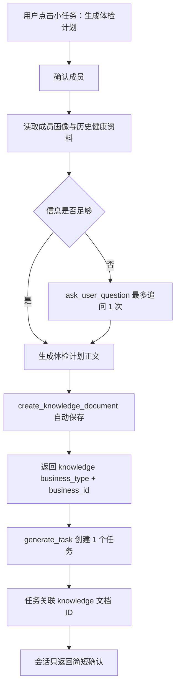

# DEEPTUTORCHAT-000051 体检计划小任务知识库落库与单任务关联工单

## 0. 工单元信息

| 字段 | 内容 |
| --- | --- |
| 工单编号 | DEEPTUTORCHAT-000051 |
| 工单类型 | P1 小任务 / 知识库自动保存 / 任务业务关联 / DeepTutorChat 工具编排 |
| 当前范围 | 只创建需求与技术方案工单；本工单不直接修改代码 |
| 目标工程 | `/Users/hua/Documents/project/Reference/LookHealthClient/SparkClient`、`/Users/hua/Documents/project/Reference/LookHealthClient/SparkService` |
| 客户端需求目录 | `/Users/hua/Documents/project/Reference/LookHealthClient/SparkClient/需求文档/对话/DeepTutorChat` |
| 创建日期 | 2026-08-10 |
| 触发需求 | 体检计划小任务要结果导向：体检项目详情进入知识库背包，最终只创建 1 个关联知识库计划的体检任务 |
| 关联工单 | `DEEPTUTORCHAT-000037`、`DEEPTUTORCHAT-000042`、`DEEPTUTORCHAT-000047`、`DEEPTUTORCHAT-000050`、`MEDICAL-000003` |
| 非目标 | 本期不改任务展示、不改任务详情展示、不做体检项目在会话内长篇展示 |

## 1. 背景与问题

上一版“体检计划智能体”偏向在会话内生成详细方案，容易出现两个问题：

1. 会话正文过长，用户真正需要的是一个可追踪的体检任务入口。
2. 体检项目明细没有稳定保存为业务对象，后续任务、复查、报告解读无法通过业务 ID 找回完整计划。

新的目标是把“体检计划详情”和“任务追踪入口”拆开：

- 体检项目、依据、准备事项、复查建议、风险分层等详细内容保存到知识库背包。
- 任务系统只创建 1 个任务，任务关联该知识库文档。
- AI 工具调用链必须把知识库保存后的 `business_type` 和 `business_id` 返回给模型，再传入任务创建工具。

## 2. 产品目标

1. 用户点击“生成体检计划”小任务后，最终只产生 1 个可执行任务。
2. 体检项目明细不在会话内展开，而是自动保存为知识库文档。
3. 任务创建时带入关联业务：
   - `business_type = knowledge`
   - `business_id = 知识库体检计划文档 ID`
4. 用户在任务列表里看到的是“完成本次体检计划”类任务；详情可通过关联 ID 找到完整体检计划。
5. AI 工具链支持自动保存知识库文档，并把保存结果返回给 AI。
6. `generate_task` 工具支持可选传入 `business_type` 和 `business_id`；未传入时保持现有行为。

## 3. 非目标

1. 本期不修改任务卡片、任务列表、任务详情的展示样式。
2. 本期不要求体检项目以多任务拆分。
3. 本期不要求自动写日历或提醒。
4. 本期不把体检项目硬编码在小任务 Prompt 中。
5. 本期不做体检机构套餐购买、预约下单、支付。

## 4. 新流程总览

### 4.1 目标流程



### 4.2 会话输出原则

会话最终只输出短确认，不逐项讲解体检项目：

```text
已生成你的体检计划，并创建 1 个体检任务。体检项目详情已保存到知识库，可从任务关联内容查看。
```

如果信息不足：

```text
我还需要确认 1 个信息：本次体检目的是什么？年度体检、复查异常、入职入学、备孕或慢病管理。
```

## 5. 小任务配置建议

### 5.1 SmallTask 基础配置

```json
{
  "code": "Service_health_exam_plan_task",
  "name": "生成体检计划",
  "brief": "生成一份个体化体检计划，自动保存到知识库，并创建 1 个关联该计划的体检任务。",
  "icon": "stethoscope",
  "tool_list": [
    "get_current_member",
    "request_member_selection",
    "query_member_profile",
    "list_member_health_sources",
    "get_health_resource_reference",
    "get_health_resource_context",
    "search_knowledge_bag",
    "ask_user_question",
    "show_medical_risk_notice",
    "create_knowledge_document",
    "generate_task"
  ]
}
```

说明：

- `create_knowledge_document` 必须支持自动保存，否则流程无法闭环。
- `generate_task` 必须支持传入关联业务类型和业务 ID。
- 小任务工具白名单仍会与模型绑定的 `aiToolScenarios` 取交集，因此模型绑定里也要允许这些工具。

### 5.2 小任务 Prompt 建议

```text
你是“体检计划任务生成智能体”。你的目标是生成一份完整体检计划，自动保存到知识库，并只创建 1 个关联该知识库计划的体检任务。

执行规则：
1. 先确认目标成员。优先调用 get_current_member；成员不明确时调用 request_member_selection。
2. 调用 query_member_profile 读取成员画像。必要时调用 list_member_health_sources、get_health_resource_reference、get_health_resource_context 获取既往体检报告或异常摘要。
3. 调用 search_knowledge_bag 获取体检项目规则、筛查建议、检前准备等知识。具体体检项目应来自知识库规则或成员资料，不要只靠泛化常识。
4. 如果缺少必要信息，只调用 ask_user_question 追问最多 1 次，问题控制在 1 到 3 个。
5. 生成完整体检计划正文，但不要在会话正文里展开展示。
6. 调用 create_knowledge_document，并要求自动保存。标题格式：{成员名或称呼}的体检计划-{日期}。
7. create_knowledge_document 成功后，必须读取工具返回的 business_type 和 business_id。
8. 调用 generate_task，只创建 1 个任务。任务标题建议为“完成本次体检计划”或“按体检计划完成检查”。任务类型为知识库；任务业务关联为 create_knowledge_document 返回的 business_type 和 business_id。
9. generate_task 的 user_input 中必须包含：任务目标、成员、计划摘要、business_type、business_id、任务类型=知识库。
10. 最终回复只做简短确认，不逐项解释体检项目。

红旗风险：
如果用户描述胸痛、呼吸困难、严重头痛、肢体无力、黑便、咯血、异常出血、快速消瘦、高热不退等红旗症状，先调用 show_medical_risk_notice。仍可生成知识库计划和任务，但任务应优先指向“尽快就医/专科评估”，不能包装成普通年度体检。
```

## 6. 知识库文档要求

### 6.1 内容进入知识库，不进入会话长正文

体检计划完整内容保存为知识库文档，建议 Markdown 结构：

```markdown
# 体检计划

## 基本信息

## 本次体检目标

## 风险摘要

## 推荐体检项目

## 检前准备

## 检后处理

## 需要及时就医的情况

## 生成依据
```

### 6.2 知识库自动保存工具要求

当前 `create_knowledge_document` 工具只生成知识卡片草稿，需要用户手动保存。新流程要求增加自动保存能力。

建议入参：

```json
{
  "title": "张三的体检计划-2026-08-10",
  "content": "完整 Markdown 体检计划",
  "auto_save": true,
  "category": "health_exam_plan",
  "member_id": 123,
  "source": "small_task_health_exam_plan"
}
```

建议成功返回：

```json
{
  "ok": true,
  "action": "saved",
  "document": {
    "id": "456",
    "title": "张三的体检计划-2026-08-10"
  },
  "business_type": "knowledge",
  "business_id": "456",
  "category": "health_exam_plan"
}
```

建议失败返回：

```json
{
  "ok": false,
  "error": "knowledge_save_failed",
  "recoverable": true
}
```

要求：

1. `auto_save=true` 时，工具必须直接调用知识库创建用例并完成落库。
2. 保存成功后，工具输出必须包含 `business_type` 和 `business_id`。
3. 保存失败时不得继续创建任务，除非后续支持临时草稿 ID。
4. 保存成功后可以继续附带知识卡片 side effect，但不是本流程依赖项。
5. 保存后的知识文档需要能被后续 `search_knowledge_bag` 检索。

## 7. 任务创建工具要求

### 7.1 当前问题

当前任务服务端模型与 API 已具备 `business_type`、`business_id` 字段；客户端任务卡到创建参数的转换也能读取 `business_type`、`business_id`。但 AI 工具 `generate_task` 当前默认写死：

```text
businessType: "ai_task_generation"
businessID: ""
```

这导致小任务无法把“已保存的知识库体检计划 ID”传给任务。

### 7.2 新入参要求

`generate_task` 需要支持以下可选参数：

```json
{
  "user_input": "创建一个体检计划执行任务",
  "member_id": 123,
  "task_type": "knowledge",
  "business_type": "knowledge",
  "business_id": "456",
  "title": "完成本次体检计划",
  "description": "体检项目详情已保存到知识库体检计划，按计划完成检查并上传报告。",
  "source": "small_task_health_exam_plan"
}
```

兼容要求：

1. `business_type`、`business_id` 可以传入，也可以不传入。
2. 不传入时保持现有默认：`business_type=ai_task_generation`、`business_id=""`。
3. 传入时任务卡、确认创建 payload、服务端 Task 都必须保留该关联。
4. `business_id` 统一按字符串传输。

### 7.3 任务类型决策

用户要求“任务类型：知识库”。当前任务系统只有：

```text
medical / exercise / diet
```

建议按两阶段处理：

| 阶段 | 策略 | 说明 |
| --- | --- | --- |
| 一期推荐 | 新增 `knowledge` 任务类型 | 语义最准确，任务直接表示“执行/查看关联知识库计划” |
| 一期保守兜底 | 仍用 `medical`，但 `business_type=knowledge` | 不改任务类型枚举，先通过业务关联表达知识库来源 |

本工单倾向新增 `knowledge` 任务类型；如果评估改动面过大，可以先采用保守兜底，但必须在代码注释和文档中标明这是过渡方案。

### 7.4 只创建一个任务

`generate_task` 在该小任务场景下只允许创建或生成 1 张任务卡：

```json
{
  "title": "完成本次体检计划",
  "type": "knowledge",
  "business_type": "knowledge",
  "business_id": "456",
  "description": "按知识库中的体检计划完成检查，并在拿到报告后上传解读。",
  "priority": "medium",
  "repeat_type": "none"
}
```

不得拆成：

- 抽血任务
- 腹部超声任务
- 心电图任务
- 报告解读任务

这些细项应留在知识库体检计划正文中。

## 8. 推荐工具编排

### 8.1 正常路径

```text
get_current_member
  -> query_member_profile
  -> list_member_health_sources
  -> get_health_resource_context（可选）
  -> search_knowledge_bag
  -> create_knowledge_document(auto_save=true)
  -> generate_task(task_type=knowledge, business_type=knowledge, business_id=knowledge_document_id)
  -> 简短确认
```

### 8.2 信息不足路径

```text
get_current_member
  -> query_member_profile
  -> ask_user_question（最多 1 次）
  -> search_knowledge_bag
  -> create_knowledge_document(auto_save=true)
  -> generate_task(...)
```

### 8.3 红旗风险路径

```text
get_current_member
  -> query_member_profile
  -> show_medical_risk_notice
  -> create_knowledge_document(auto_save=true，内容改为就医/专科评估计划)
  -> generate_task(title="尽快完成专科评估", task_type=knowledge, business_type=knowledge, business_id=...)
```

## 9. AI 输出与工具返回契约

### 9.1 `create_knowledge_document` 返回给 AI 的最小字段

| 字段 | 必须 | 说明 |
| --- | --- | --- |
| `ok` | 是 | 是否保存成功 |
| `action` | 是 | `saved` / `draft_created` / `failed` |
| `business_type` | 自动保存成功时必须 | 固定建议为 `knowledge` |
| `business_id` | 自动保存成功时必须 | 知识库文档 ID |
| `document.id` | 自动保存成功时必须 | 同 `business_id` |
| `document.title` | 建议 | 用于任务描述 |
| `error` | 失败时必须 | 错误码 |

### 9.2 `generate_task` 返回给 AI 的最小字段

| 字段 | 必须 | 说明 |
| --- | --- | --- |
| `ok` | 是 | 是否生成任务卡或创建任务成功 |
| `action` | 是 | `created` / `pending_confirm` / `no_create` |
| `task.id` | 已创建时必须 | 服务端任务 ID |
| `task.business_type` | 传入时必须原样返回 | 应为 `knowledge` |
| `task.business_id` | 传入时必须原样返回 | 知识库文档 ID |
| `error` | 失败时必须 | 错误码 |

## 10. 小任务最终交互口径

### 10.1 成功

```text
已生成体检计划并保存到知识库，同时创建 1 个体检任务。任务已关联该体检计划。
```

### 10.2 知识库保存失败

```text
体检计划已生成，但保存到知识库失败，因此没有创建体检任务。请稍后重试。
```

### 10.3 任务创建失败

```text
体检计划已保存到知识库，但体检任务创建失败。你可以稍后从知识库计划重新创建任务。
```

## 11. 实现范围建议

### 11.1 客户端

需要评估并修改：

| 模块 | 目标 |
| --- | --- |
| `ToolHubCreateKnowledgeDocument` | 支持 `auto_save=true`，调用 `CreateKnowledgeDocumentUseCase` 实际保存 |
| `ToolHubGenerateTask` | 支持读取 `business_type`、`business_id`、`task_type`、`title`、`description` 入参 |
| `TaskToolCardPayload` / `taskPayload` | 确保关联字段进入任务卡和确认创建 payload |
| `SparkToolName` 工具说明 | 更新 `create_knowledge_document`、`generate_task` 参数说明 |
| SmallTask 配置 | 新增或更新“生成体检计划”小任务 Prompt 和工具白名单 |

本期不改：

- 任务列表展示
- 任务详情展示
- 知识卡片展示
- 聊天消息展示样式

### 11.2 服务端

需要评估并修改：

| 模块 | 目标 |
| --- | --- |
| `task_system` | 若新增 `knowledge` 任务类型，更新枚举、序列化、同步、测试 |
| 任务创建 API | 确认 `business_type`、`business_id` 写入和权限校验稳定 |
| 知识库 API | 支持 AI 工具自动创建知识文档并返回 ID |
| AI 工具 Schema | 暴露 `auto_save`、`business_type`、`business_id` 参数 |

如果一期采用保守方案，不新增任务类型，则服务端只需确认 `medical` 类型任务可携带 `business_type=knowledge`、`business_id=知识库ID`。

## 12. 验收标准

1. 点击“生成体检计划”小任务后，AI 不在会话正文里展开完整体检项目。
2. AI 成功调用知识库工具自动保存体检计划。
3. 知识库工具返回 `business_type=knowledge` 和 `business_id=<知识库文档ID>`。
4. AI 继续调用 `generate_task`，只生成 1 个任务。
5. 任务携带 `business_type=knowledge` 和 `business_id=<知识库文档ID>`。
6. `business_type/business_id` 未传入时，`generate_task` 保持现有默认行为。
7. 知识库保存失败时，不创建无关联任务。
8. 任务创建失败时，已保存的知识库文档不丢失。
9. 展示层没有被本期需求改动。

## 13. 测试用例

### 13.1 正常生成

输入：

```text
帮我生成今年的体检计划。
```

期望：

1. 自动读取成员画像。
2. 自动保存知识库文档。
3. 创建 1 个关联知识库的任务。
4. 会话只输出简短确认。

### 13.2 带历史报告

输入：

```text
结合我上次体检报告，生成下次体检计划。
```

期望：

1. 读取最近体检报告摘要。
2. 体检项目细节写入知识库。
3. 任务关联知识库计划 ID。

### 13.3 知识库保存失败

模拟：

```text
create_knowledge_document(auto_save=true) 返回 knowledge_save_failed
```

期望：

1. 不调用 `generate_task`。
2. 会话提示保存失败，稍后重试。

### 13.4 任务关联字段缺失

模拟：

```text
create_knowledge_document 返回 ok=true，但缺少 business_id
```

期望：

1. 不创建任务。
2. 记录工具返回契约错误。

### 13.5 兼容旧任务生成

输入：

```text
提醒我明天晚上跑步。
```

期望：

1. `generate_task` 未传入 `business_type/business_id` 时仍可按旧逻辑生成任务。
2. 不影响非体检计划场景。

## 14. 待确认问题

1. 是否正式新增任务类型 `knowledge`？如果新增，需要同步 iOS、服务端、后台和枚举文案。
2. 知识库文档的业务类型是否统一使用 `knowledge`，还是更精确地使用 `knowledge_document`？
3. 体检计划知识库文档是否需要专属分类 `health_exam_plan`？
4. 自动保存的知识库文档是否需要默认私有、绑定成员、进入成员健康资料索引？
5. 任务点击后是否后续跳转知识库详情？本工单明确暂不改展示，但需要后续工单承接。

