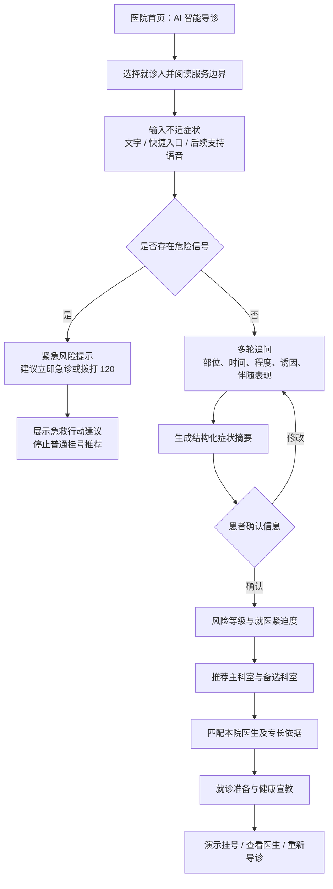
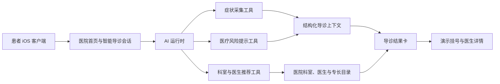

# 天长市中医院智能导诊系统演示方案

> 文档版本：V1.0  
> 编写日期：2026-09-21  
> 演示对象：医院信息中心、门诊部、医务科、护理部及相关临床科室  
> 产品定位：面向患者的就诊路径辅助工具，不提供疾病诊断，不替代医生判断

## 1. 方案摘要

本演示围绕患者最常见的就医难题展开：

> 身体不舒服，但不知道是否紧急、不知道挂哪个科，也不知道应当找哪位医生。

系统通过多轮询问整理患者的主要症状、持续时间、伴随表现和危险信号，形成结构化症状摘要，并给出：

1. 风险等级与就医紧迫度提示；
2. 推荐科室、推荐理由及备选科室；
3. 与症状方向匹配的本院医生；
4. 就诊前准备事项和健康宣教；
5. 演示挂号或立即就医入口。

建议本次院方演示以“找科室、找医生、识别紧急情况”三项能力为核心，不在首轮演示中扩展到疾病诊断、处方建议和真实收费。

## 2. 参考产品与本方案取舍

本方案参考[讯飞医疗智能导诊系统](https://www.xunfeihealthcare.com/product/62.html#minban)公开页面所展示的产品方向，包括智能分诊、AI 辅助自查、精准导医、宣教知识推荐和分级诊疗推荐。

| 参考方向 | 本次演示采用方式 | 本次是否重点展示 |
| --- | --- | --- |
| 智能分诊——找科室 | 根据症状和危险信号推荐本院科室 | 是 |
| AI 辅助自查——病情分析 | 生成症状摘要与就医紧迫度，不输出疾病诊断 | 是 |
| 精准导医——找医生 | 根据科室、医生专长和患者症状推荐医生 | 是 |
| 宣教知识推荐——查知识 | 推荐就诊准备和经审核的科普内容 | 简要展示 |
| 分级诊疗推荐——找医院 | 紧急情况引导急诊/120；超出本院能力时提供转诊提示 | 作为后续能力 |

说明：参考页面公布的科室数、症状数和疾病数属于其产品指标。本演示不沿用这些数字，也不作同等能力承诺；演示效果以本项目实际数据、模型配置和验收结果为准。

## 3. 医院场景与演示价值

### 3.1 患者侧问题

- 患者不了解医院科室划分，容易挂错科；
- 患者描述零散，导诊人员需要反复追问；
- 患者只按医生名气选择，未必与症状方向匹配；
- 胸痛、呼吸困难、意识异常等危险信号可能被普通咨询流程延误；
- 挂号前不知道需要携带哪些资料、是否空腹以及如何陈述病情。

### 3.2 医院侧价值

- 为公众号、小程序或 App 提供全天候导诊入口；
- 减少人工导诊台重复咨询压力；
- 提高科室与医生推荐的可解释性；
- 将医院真实科室、医生专长和出诊信息转化为患者可用的服务；
- 对高风险症状优先拦截，引导患者进入急诊或 120 流程；
- 为后续分析错挂号、高频症状和患者服务需求积累匿名统计数据。

## 4. 演示范围

### 4.1 本次纳入

- 天长市中医院首页的 AI 智能导诊入口；
- 文字输入、快捷症状入口；
- AI 多轮症状采集；
- 症状摘要确认；
- 风险分级与危险信号拦截；
- 本院科室推荐、推荐依据和备选科室；
- 本院医生推荐及专长匹配说明；
- 就诊准备和科普提示；
- 演示挂号链路；
- 会话失败后的重试与人工/线下兜底提示。

### 4.2 本次不纳入

- 直接给出疾病诊断或确诊概率；
- 推荐处方、调整药物剂量或替代医生治疗意见；
- 接入真实支付、医保结算和号源锁定；
- 自动读取真实电子病历、检验、影像数据；
- 未经医院审核即对外发布医疗知识；
- 使用真实患者隐私数据进行演示。

## 5. 当前项目能力盘点

本方案不是从零设计。现有客户端与服务端已具备下列基础能力。

| 能力 | 当前状态 | 演示使用方式 |
| --- | --- | --- |
| 医院首页与快捷服务 | 已具备 | 从医院首页进入“AI 智能导诊” |
| 每次导诊创建独立会话 | 已具备 | 避免历史话题干扰本次导诊 |
| 快捷症状问题 | 已具备 | 展示头晕、胸闷、腹部不适等快速入口 |
| 多轮症状采集 | 已具备基础 | 采集主诉、持续时间、伴随症状等信息 |
| 结构化症状摘要 | 已具备基础 | 患者确认后再进入推荐环节 |
| 医疗风险提示卡 | 已具备 | 展示低、中、高、紧急四级风险 |
| 科室目录 | 已具备 | 使用天长市中医院真实公开科室数据 |
| 医生目录与专长 | 已具备 | 使用公开医生信息进行匹配展示 |
| 科室/医生推荐卡 | 已具备基础 | 需补齐稳定的导诊决策与排序规则 |
| 演示挂号页面 | 已具备 | 只展示流程，不形成真实医疗订单 |
| 医院介绍与医生智能体 | 已具备基础 | 在导诊结果后承接进一步咨询 |
| 真实号源与排班接口 | 未接入 | 演示阶段使用明确标识的模拟数据 |

目前项目内已整理约 28 个实际临床科室和 142 位去重后的公开医生资料。正式演示前应再次由医院确认科室命名、医生在岗情况、专长描述及门诊安排。

## 6. 产品定位

### 6.1 一句话定位

> 天长市中医院智能导诊：帮助患者从“不知道挂什么科”，走到“知道为什么、找谁、下一步做什么”。

### 6.2 核心原则

1. **先安全，后推荐**：先识别危险信号，再进入常规导诊。
2. **先问清，后判断**：信息不足时继续追问，不仓促推荐。
3. **推荐可解释**：必须告诉患者推荐科室和医生的依据。
4. **仅推荐就医路径**：不把导诊结果表述为疾病诊断。
5. **只推荐院内有效资源**：科室和医生必须来自医院目录。
6. **随时允许退出**：患者可以改为人工咨询、急诊或直接浏览科室。

## 7. 核心业务流程



## 8. 系统演示架构



正式落地后可将医院排班、号源、院内导航和患者主索引接入上述架构，但不影响本次独立演示。

## 9. 页面与交互方案

### 9.1 页面一：医院首页

展示内容：

- 天长市中医院名称和医院服务入口；
- “AI 智能导诊”作为高优先级快捷服务；
- 同级入口包括预约挂号、报告解读等；
- 明确提示智能导诊用于就医路径参考。

演示重点：这不是一个孤立聊天机器人，而是医院患者服务入口的一部分。

### 9.2 页面二：导诊欢迎页

建议文案：

> 你好，我是天长市中医院智能导诊助手。我会询问你的主要不适，帮助你判断就医紧迫度并推荐合适的科室和医生。结果仅供就医路径参考，不能替代医生诊断。若出现严重胸痛、呼吸困难、意识异常等情况，请立即拨打 120 或前往急诊。

快捷入口：

- 头痛、头晕；
- 胸闷、心慌；
- 腹痛、腹胀；
- 咳嗽、发热；
- 儿童不适；
- 其他症状。

### 9.3 页面三：多轮症状采集

每轮只询问一个核心问题，优先采用可点击选项，同时允许患者自由补充。

建议采集字段：

| 字段 | 示例 |
| --- | --- |
| 就诊人 | 本人、儿童、老人、家庭成员 |
| 主要不适 | 头晕、胸痛、腹痛、咳嗽等 |
| 开始时间 | 20 分钟前、3 天前、反复半年 |
| 严重程度 | 轻微、中等、严重、持续加重 |
| 诱发因素 | 转头、运动、进食、外伤等 |
| 伴随表现 | 发热、恶心、气促、肢体无力等 |
| 危险信号 | 晕厥、意识异常、持续胸痛、呼吸困难等 |
| 特殊情况 | 年龄、孕产、慢病、近期手术等 |

交互要求：

- 页面显示采集进度，但不承诺固定问题数量；
- 患者可以修改上一项回答；
- 输入模糊时先澄清，不直接推荐；
- 任何一轮触发危险信号，都立即切换到风险处置流程。

### 9.4 页面四：症状摘要确认

示例：

> 就诊人：本人，35 岁  
> 主要不适：头晕 3 天  
> 特点：转头时较明显，伴轻度恶心  
> 暂未描述：肢体无力、言语不清、晕厥、严重头痛、胸痛

按钮：

- 信息正确，开始推荐；
- 修改症状；
- 暂不继续。

演示重点：患者先确认事实，降低模型误解后直接生成推荐的风险。

### 9.5 页面五：导诊结果

建议采用一张主结果卡和三张辅助卡。

#### 主结果卡

- 就医紧迫度：建议近期门诊 / 建议当日就诊 / 建议立即急诊；
- 推荐科室：主科室；
- 推荐理由：基于患者已经确认的症状；
- 备选科室：仅在确有交叉可能时展示；
- 重要提醒：出现哪些变化需要立即升级处置。

#### 医生推荐卡

- 医生姓名、科室、职称；
- 与本次症状相关的公开专长；
- 出诊信息状态；
- 查看详情、演示挂号。

医生排序不能只由大模型自由生成，应由科室归属、公开专长关键词、出诊状态和医院配置共同决定。

#### 就诊准备卡

- 建议携带的既往报告、用药清单；
- 是否建议记录症状发生时间；
- 到院后如何向医生说明本次问题；
- 医院审核过的检查或就诊注意事项。

#### 服务边界卡

> 以上内容用于帮助选择就医路径，不代表疾病诊断。实际科室、检查和治疗方案以接诊医生意见为准。

### 9.6 页面六：紧急风险拦截

触发严重胸痛、明显呼吸困难、意识异常、疑似卒中等危险信号时：

- 使用醒目的“建议立即就医”状态；
- 首要按钮为“拨打 120”；
- 次要按钮为“查看急诊指引”；
- 不继续展示普通医生排名，不以预约门诊替代急救；
- 给出简短行动建议，避免冗长科普延误处置。

## 10. 三个现场演示场景

### 场景 A：成人头晕——完整展示标准导诊闭环

#### 患者输入

> 我头晕三天了，转头时明显，有一点恶心。

#### AI 关键追问

1. 头晕是天旋地转，还是站立不稳、眼前发黑？
2. 是否出现肢体无力、面部歪斜、言语不清或突然剧烈头痛？
3. 是否有胸痛、心悸、晕厥或明显呼吸困难？
4. 是否伴耳鸣、听力变化、发热或近期外伤？
5. 年龄及是否有高血压、糖尿病等基础疾病？

#### 演示预期结果

- 未发现已描述的紧急危险信号；
- 提示仍需医生面诊，不能据此排除严重疾病；
- 推荐与神经系统、眩晕方向相符的院内科室；
- 从该科室医生中展示公开专长与头晕、眩晕或神经系统疾病相关的医生；
- 可进入医生详情或演示挂号。

注意：具体主科室和医生必须由上线前医院确认后的规则与目录决定，讲解人员不要现场口头承诺某种诊断。

### 场景 B：儿童反复咳嗽——展示家庭成员与专病匹配

#### 患者输入

> 我家孩子 7 岁，最近一个月总是咳嗽，晚上比较明显，没有明显喘不上气。

#### AI 关键追问

1. 是否发热，最高体温是多少？
2. 咳嗽是否伴喘鸣、呼吸急促、口唇发紫？
3. 是否有过敏史、哮喘史或反复呼吸道感染？
4. 是否咳痰，痰的颜色如何？
5. 精神、饮食和睡眠情况怎样？

#### 演示预期结果

- 推荐儿科；
- 优先匹配公开专长包含儿童呼吸、反复呼吸道感染、过敏性咳嗽等方向的医生；
- 告知家长记录体温、咳嗽时段、诱因和既往用药；
- 若追问中出现呼吸困难、口唇发紫或精神状态明显异常，立刻升级为紧急提示。

### 场景 C：突发胸痛——展示安全拦截

#### 患者输入

> 我突然胸口痛了二十分钟，还出冷汗，有点喘不上气。

#### 演示预期结果

- 立即显示紧急风险提示；
- 建议停止活动、立即拨打 120 或由他人陪同就近急诊；
- 不让患者自行驾车；
- 不继续普通门诊医生推荐；
- 不输出“已经心梗”等确定性诊断。

该场景用于证明系统的核心安全原则：危险信号的处置优先级高于完成导诊流程。

## 11. 八分钟现场讲解脚本

| 时间 | 操作 | 讲解要点 |
| --- | --- | --- |
| 0:00–0:40 | 展示医院首页 | 患者常常知道自己不舒服，却不知道挂什么科。智能导诊作为医院服务入口，连接后续科室、医生和挂号服务。 |
| 0:40–1:20 | 进入智能导诊 | 强调服务边界：提供就医路径建议，不替代医生诊断；紧急情况优先 120/急诊。 |
| 1:20–3:20 | 输入“头晕三天”并回答追问 | 展示多轮采集不是闲聊，而是在补齐时间、特点、伴随症状和危险信号。 |
| 3:20–4:00 | 确认症状摘要 | 让患者确认事实，减少错误理解，并为医院保留结构化记录。 |
| 4:00–5:20 | 展示科室和医生推荐 | 说明推荐来自医院真实科室和公开医生专长，结果包含依据和备选路径。 |
| 5:20–6:10 | 查看医生及演示挂号 | 展示从咨询到服务转化的闭环；当前使用演示号源，未来可对接真实排班。 |
| 6:10–7:00 | 切换“突发胸痛”场景 | 展示危险信号被立即拦截，不再继续普通挂号推荐。 |
| 7:00–8:00 | 总结与院方讨论 | 说明首期可从单院导诊试点开始，再接排班、院内导航和统计分析。 |

### 开场话术

> 今天演示的不是一个替医生看病的机器人，而是一套患者就医路径辅助系统。它先把患者的症状问清楚，优先识别危险情况，再结合天长市中医院自己的科室和医生资源，告诉患者应该去哪里、为什么推荐、下一步怎么做。

### 收尾话术

> 这套系统最适合从医院真实导诊问题出发小范围试点。只要院方帮助确认科室规则、医生专长、危险信号和转人工流程，就可以先形成一个可控、可审核、可持续优化的患者服务入口。

## 12. 演示数据要求

### 12.1 医院数据

- 医院名称、地址、咨询电话、急诊信息；
- 正式科室名称、科室层级和别名；
- 医生姓名、科室、职称、公开专长；
- 可展示的门诊时间或“以医院当日排班为准”状态；
- 医院确认的急诊与转人工规则。

### 12.2 症状测试数据

至少准备下列测试组：

- 信息完整、无危险信号的普通门诊案例；
- 信息不足，需要多轮追问的案例；
- 涉及两个可能科室的交叉案例；
- 儿童、老人、孕产妇等特殊人群案例；
- 明确危险信号案例；
- 无法理解、无匹配科室和模型服务失败案例。

### 12.3 数据使用边界

- 演示统一使用虚构患者；
- 不上传身份证、手机号、病历照片等真实隐私数据；
- 医生与科室资料仅使用医院公开信息；
- 公开信息正式上线前仍需医院书面确认。

## 13. 演示前准备清单

### 13.1 产品与数据

- [ ] 天长市中医院处于可访问状态；
- [ ] 科室和医生种子数据已载入；
- [ ] 演示医生头像、姓名和专长显示正常；
- [ ] 三个标准案例已逐项走通；
- [ ] 演示号源明确标识为模拟信息；
- [ ] 所有医疗边界文案已经过内部复核。

### 13.2 AI 与服务端

- [ ] 医院已绑定可用的智能导诊场景；
- [ ] 症状采集、风险提示和推荐工具均已启用；
- [ ] 新导诊能够创建独立会话；
- [ ] 科室和医生 ID 只能从医院有效目录返回；
- [ ] 紧急风险触发后不会继续普通挂号推荐；
- [ ] 模型超时、断网、返回异常时有固定兜底文案。

### 13.3 客户端与现场

- [ ] 准备一台真机和一台备用设备；
- [ ] 关闭系统通知，保证字体和网络状态正常；
- [ ] 提前登录演示账号并创建虚构家庭成员；
- [ ] 准备稳定网络和手机热点；
- [ ] 录制一份完整离线演示视频；
- [ ] 准备静态截图，防止模型或网络临时不可用；
- [ ] 演示人员熟悉“不能诊断、不能承诺疗效”的表述边界。

## 14. 演示验收标准

### 14.1 功能验收

1. 患者能从医院首页进入独立的智能导诊会话；
2. 系统能识别快捷症状和自由文本输入；
3. 信息不足时至少进行必要的补充询问；
4. 患者可以查看并修改症状摘要；
5. 普通案例能返回有效院内科室，不出现虚构科室；
6. 医生推荐仅来自推荐科室或医院允许的关联科室；
7. 推荐理由与患者已确认的信息一致；
8. 危险案例能跳过普通推荐并显示急诊/120 提示；
9. 页面始终可看到“不能替代医生诊断”的边界说明；
10. 无结果或服务异常时，能够引导人工咨询或线下就医。

### 14.2 质量验收

建议邀请门诊部、急诊科及重点科室共同准备不少于 50 条匿名标准案例进行盲测，记录：

- 科室 Top 1 推荐是否可接受；
- 科室 Top 3 是否覆盖院方建议；
- 危险信号是否正确拦截；
- 是否出现不安全诊断或用药建议；
- 医生专长匹配是否准确；
- 平均完成时长和中途退出率；
- 院方认为必须修改的问法与规则。

正式对外使用前，危险信号漏判应作为阻断上线的问题处理，不能仅以总体准确率掩盖。

## 15. 当前必须补齐的演示增强项

### P0：演示前必须完成

1. **统一导诊结果数据结构**  
   固定返回风险等级、推荐科室 ID、推荐理由、备选科室、医生 ID、行动建议和免责声明，避免结果只存在于自由文本中。

2. **危险信号前置规则**  
   在大模型生成普通回答之前执行高优先级风险校验；触发后进入固定安全流程。

3. **科室目录约束**  
   模型只能选择医院当前有效科室 ID，不能临时编造科室名称。

4. **医生匹配规则**  
   医生候选集先由科室过滤，再结合公开专长匹配，不直接让模型自由推荐姓名。

5. **推荐依据展示**  
   结果卡明确列出“因为你描述了哪些症状，所以建议哪个就医方向”。

6. **失败兜底**  
   对模型超时、网络失败、无法匹配和输入不可理解分别提供可执行的下一步。

### P1：试点阶段完成

- 语音输入与方言适配；
- 医院审核的宣教知识推荐；
- 导诊结果埋点与运营统计；
- 科室别名、常见口语和专病词库；
- 患者对推荐结果的反馈入口；
- 导诊记录供接诊医生查看的授权机制；
- 医院后台配置科室规则、停诊医生和风险文案。

### P2：正式集成阶段

- 对接真实排班、号源和预约挂号；
- 对接院内地图与检查地点导航；
- 经授权读取既往就诊资料；
- 支持医共体内基层机构与上级医院分级推荐；
- 建立持续医学评测、审计和版本回滚机制。

## 16. 安全与合规要求

### 16.1 医疗边界

- 所有结果使用“建议、可能需要、就医方向”等表述；
- 不使用“确诊、排除、保证、治愈”等确定性表述；
- 不替医生开药、停药、换药或调整剂量；
- 对紧急情况优先给出行动指引，不进行冗长问答；
- 系统无法判断时应明确说“不确定”，并引导人工或线下就医。

### 16.2 数据与权限

- 遵循最小必要原则采集个人信息；
- 区分本人、儿童、老人及代办人的授权关系；
- 记录关键推荐输入、规则版本、模型版本和输出结果，便于审计；
- 敏感数据传输与存储应加密；
- 生产环境中的会话保存周期、删除机制和使用范围由医院确认。

### 16.3 内容治理

- 科室、医生和宣教内容由医院指定人员审核；
- 医院调整科室或医生状态后应能及时下线旧信息；
- 高风险规则由临床专家参与制定并定期复核；
- 模型或提示词升级后必须重新执行回归测试。

## 17. 试点效果指标

试点期建议只统计能够真实采集的数据，不预先承诺未经验证的降本比例。

| 指标 | 定义 | 用途 |
| --- | --- | --- |
| 导诊完成率 | 完成结果确认的会话数 / 发起导诊数 | 判断流程是否过长 |
| 平均完成时长 | 从首次输入到结果卡的时间 | 判断使用效率 |
| 科室推荐接受率 | 患者选择推荐科室的比例 | 观察推荐有效性 |
| 人工改判率 | 医院人员认为应更换主科室的比例 | 评估医疗质量 |
| 高风险召回率 | 标准危险案例中成功拦截的比例 | 核心安全指标 |
| 无效医生推荐率 | 推荐停诊、跨科或无相关专长医生的比例 | 评估目录质量 |
| 转人工率 | 无法判断并进入人工服务的比例 | 发现能力边界 |
| 患者反馈 | 推荐是否清楚、有帮助 | 优化交互和解释 |

“降低错挂号率”和“减少人工咨询量”需要医院提供上线前基线数据，再进行前后对比。

## 18. 希望院方共同确认的问题

首次交流时建议重点请医院确认以下内容：

1. 目前导诊台最高频的 20 类咨询是什么？
2. 哪些症状最容易出现错挂科或科室争议？
3. 医院正式使用的科室名称、别名和边界是什么？
4. 哪些情况必须直接引导急诊、120 或人工人员？
5. 医生专长、出诊和停诊信息由哪个部门维护？
6. 首期更适合部署在 App、公众号、小程序、自助机还是院内窗口？
7. 是否允许导诊摘要经患者授权后提供给接诊医生？
8. 试点优先选择哪个科室或哪类患者？
9. 院方希望用哪些指标判断试点是否成功？
10. 后续是否有对接挂号、排班、HIS 或医共体平台的计划？

## 19. 建议试点路径

### 第一阶段：封闭演示

- 使用虚构病例和公开医院资料；
- 完成三类标准演示场景；
- 邀请信息中心、门诊部和临床代表评审；
- 不连接真实患者数据和生产号源。

### 第二阶段：院内受控试用

- 选择 3–5 个高频科室；
- 使用医院审核过的科室规则和医生资料；
- 由导诊人员或医生同步复核结果；
- 收集错分原因和患者反馈，不自动形成医疗决策。

### 第三阶段：患者端试点

- 接入医院官方入口；
- 对接真实排班或挂号服务；
- 建立监控、审计、应急下线和内容更新机制；
- 达到院方安全与质量门槛后再扩大范围。

## 20. 项目内相关实现位置

以下文件可作为演示开发和评审入口：

### 服务端

- `SparkService/hospital_care/services/ai_triage_conversation_service.py`：创建智能导诊会话和欢迎卡；
- `SparkService/hospital_care/api/patient/views.py`：医院首页、科室、医生与导诊接口；
- `SparkService/hospital_care/api/presenters.py`：导诊运行配置与能力输出；
- `SparkService/hospital_care/management/commands/seed_tianchang_hospital.py`：天长市中医院演示数据；
- `SparkService/hospital_care/data/tianchang_public_staff.py`：公开医生与科室资料。

### iOS 客户端

- `SparkClient/Projects/Features/HospitalCare/Presentation/Components/AITriageGuideCardView.swift`：智能导诊引导卡；
- `SparkClient/Projects/Features/HospitalCare/Presentation/Components/HospitalTriageIntroCardView.swift`：医院导诊介绍卡；
- `SparkClient/Projects/Features/HospitalCare/Application/ResolveOrCreateAITriageConversationUseCase.swift`：导诊会话创建；
- `SparkClient/Projects/Core/AIRuntime/ToolHub/Models/SymptomCollectionModels.swift`：症状采集结构；
- `SparkClient/Projects/Features/HospitalCare/Presentation/Views/HospitalRegistrationRecommendationSheet.swift`：挂号推荐展示；
- `SparkClient/Projects/Core/AIRuntime/ToolHub/Views/ChatMedicalRiskNoticeCardView.swift`：医疗风险提示卡。

## 21. 结论

本项目已经具备智能导诊演示所需的主要骨架：医院入口、独立会话、多轮症状采集、风险卡、科室与医生资料以及演示挂号页面。

最合适的首轮演示不是追求“大而全”，而是把以下闭环做稳定：

> 症状输入 → 必要追问 → 危险信号识别 → 症状确认 → 科室推荐 → 医生匹配 → 就诊准备 → 演示挂号。

只要补齐结构化决策结果、院内目录约束、危险信号前置和可解释推荐四项 P0 能力，就能够形成一套适合向医院信息中心和门诊管理部门展示的智能导诊原型。

---

## 附录 A：建议结果卡数据结构

```json
{
  "triage_session_id": "demo-session-id",
  "risk_level": "medium",
  "urgency": "建议当日或近期门诊就诊",
  "symptom_summary": {
    "chief_complaint": "头晕",
    "duration": "3天",
    "features": ["转头时明显", "轻度恶心"],
    "red_flags_denied": ["肢体无力", "言语不清", "晕厥", "严重胸痛"]
  },
  "primary_department": {
    "department_id": "hospital-department-id",
    "name": "由医院规则确定的有效科室",
    "reason": "基于已确认症状和医院科室服务范围"
  },
  "alternative_departments": [],
  "recommended_doctors": [
    {
      "doctor_id": "hospital-doctor-id",
      "name": "医生姓名",
      "match_reason": "公开专长与本次就医方向相关",
      "schedule_status": "以医院当日排班为准"
    }
  ],
  "next_actions": [
    "查看医生详情",
    "演示挂号",
    "修改症状",
    "转人工咨询"
  ],
  "safety_notice": "本结果仅用于就医路径参考，不能替代医生诊断。"
}
```

## 附录 B：固定兜底文案

### 无法判断

> 目前信息还不足以可靠推荐科室。建议补充主要不适、持续时间和伴随症状，或联系医院人工导诊。若症状严重或持续加重，请及时线下就医。

### 服务异常

> 智能导诊服务暂时不可用。你可以直接浏览医院科室、联系人工导诊，或稍后重试。若情况紧急，请立即拨打 120 或前往急诊。

### 无匹配医生

> 已为你找到建议就诊科室，但暂未获取到合适的医生或排班信息。请查看该科室当日门诊安排，或联系医院确认。

### 紧急风险

> 你描述的情况可能需要立即由医务人员评估。请停止继续操作，立即拨打 120 或由他人陪同前往最近的急诊；请勿自行驾车。智能导诊不能判断具体疾病，也不能替代急救处置。
